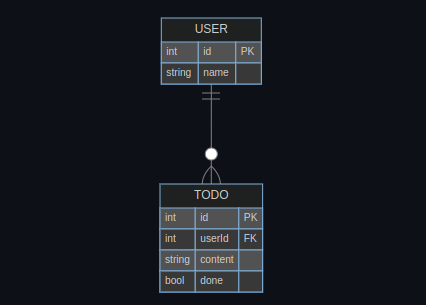

+++
title = 'ERD(Entity Relationship Diagram)란'
date = 2024-05-25T16:02:12+09:00
tags = ["ERD", "Database"]
categories = ["programming"]
draft = false
+++

> ERD(Entity Relationship Diagram)란 데이터베이스의 구조를 시각적으로 표현한 것이다. ERD는 데이터베이스의 테이블 간의 관계를 나타내며, 데이터베이스의 설계와 구조를 이해하기 쉽게 도와준다.

## ERD의 구성 요소

ERD는 다음과 같은 구성 요소로 이루어져 있다.

1. **엔티티(Entity)**
2. **속성(Attribute)**
3. **관계(Relationship)**

### 엔티티(Entity)

엔티티는 데이터베이스에서 관리하려는 개체를 나타낸다. 예를 들어, 학생, 교수, 강의 등이 엔티티가 될 수 있다.

### 속성(Attribute)

속성은 엔티티의 특성을 나타낸다. 예를 들어, 학생 엔티티의 속성으로 학번, 이름, 학과 등이 있을 수 있다.

### 관계(Relationship)

관계는 엔티티 간의 관계를 나타낸다. 예를 들어, 학생과 교수 간에는 '수강'이라는 관계가 있을 수 있다.

## ERD의 표기법

ERD는 다양한 표기법이 있지만, 가장 널리 사용되는 표기법은 **IE 표기법**이다. IE 표기법은 다음과 같이 사용한다.

-   **엔티티(Entity)**: 직사각형으로 표현한다. 엔티티의 이름을 직사각형 상단에 작성한다.
-   **속성(Attribute)**: 직사각형 안에 속성의 이름을 작성한다. 속성의 이름과 데이터 타입을 함께 작성할 수 있다. 속성의 FK, PK등의 조건을
    작성할 수 있다.
    
-   **관계(Relationship)**:
    1. 점선과 실선
        - 실선: 식별 관계
            - PK를 FK로 사용하는 관계:
                - 부모 테이블의 PK가 자식 테이블의 FK로 사용되는 관계
        - 점선: 비식별 관계
            - PK를 FK로 사용하지 않는 관계:
                - 부모 테이블의 PK가 자식 테이블의 FK로 사용되지 않는 관계
    2. Maping Cardinality - 뜻: 엔티티 간의 관계에서 한 엔티티가 다른 엔티티와 어떤 관계를 맺고 있는지를 나타낸다. - 1:1, 1:N, N:M 등의 관계를 나타낸다. - IE 표기법에서는 까마귀 발 표기법을 사용한다.
       
       위의 그림에서는 다음과 같은 관계를 나타낸다.
        - USER 테이블은 여러개의 TODO테이블을 가질수도 있고, 가지지 않을 수도 있다.
        - TODO테이블은 오직 하나의 USER테이블을 가진다.

## 까마귀 발 표기법(Crow's Foot Notation)

관계
까마귀 발 표기법은 ERD에서 관계를 나타내는 표기법이다. 까마귀 발 표기법은 다음과 같이 사용한다.

-   **one**: 1 요소가 하나인 경우
-   **many**: N 요소가 여러 개인 경우
-   **only one**: 1 요소가 오직 하나인 경우
-   **zero or one**: 0..1 요소가 없거나 하나인 경우
-   **one or many**: 1..N 요소가 하나 이상인 경우
-   **zero or many**: 0..N 요소가 없거나 여러 개인 경우
