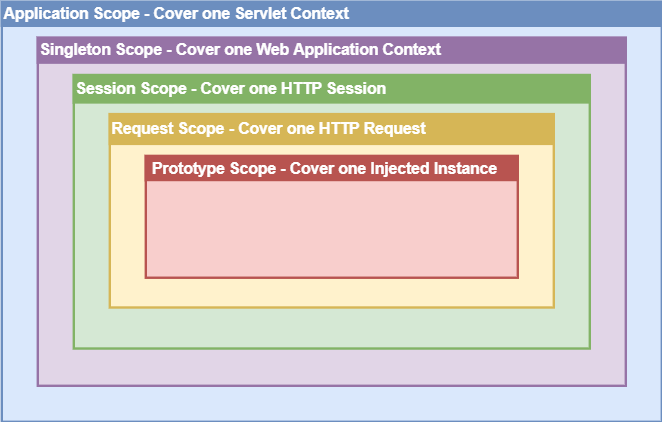

### 스프링(Spring)이란?

> 스프링은 자바 언어를 기반으로 하는 프레임워크로, 엔터프라이즈급 애플리케이션을 개발하기 위한 다양한 기능을 제공한다.

스프링은 다음과 같은 특징을 가지고 있다.

-   **경량 컨테이너**: 스프링은 경량 컨테이너로서 객체의 생성, 생명주기, 의존성 관리 등을 관리한다.

-   **제어의 역전(IoC)**: 스프링은 제어의 역전을 지원하여 객체의 생성, 생명주기, 의존성 관리 등을 스프링 컨테이너가 관리한다.

-   **의존성 주입(DI)**: 스프링은 의존성 주입을 지원하여 객체 간의 의존 관계를 스프링 컨테이너가 관리한다.

-   **관점 지향 프로그래밍(AOP)**: 스프링은 관점 지향 프로그래밍을 지원하여 핵심 로직과 공통 로직을 분리하여 관리한다.

-   **트랜잭션 관리**: 스프링은 트랜잭션 관리를 지원하여 데이터베이스 연산을 트랜잭션 단위로 처리할 수 있다.

-   **예외 처리**: 스프링은 예외 처리를 지원하여 예외가 발생했을 때 처리할 수 있다.

-   **테스트**: 스프링은 테스트를 지원하여 단위 테스트, 통합 테스트, 시스템 테스트 등을 수행할 수 있다.

### 스프링 부트(Spring Boot)란?

> 스프링 부트는 스프링 프레임워크를 사용하여 웹 애플리케이션을 쉽게 개발할 수 있도록 도와주는 프레임워크이다.

스프링 부트는 다음과 같은 특징을 가지고 있다.

-   **내장형 서버**: 스프링 부트는 내장형 서버(Tomcat, Jetty, Undertow)를 제공하여 별도의 서버를 설치하지 않아도 웹 애플리케이션을 실행할 수 있다.

-   **자동 설정**: 스프링 부트는 `@SpringBootApplication` 어노테이션을 사용하여 스프링 애플리케이션을 자동으로 설정한다.

-   **의존성 관리**: 스프링 부트는 `starter`를 사용하여 의존성을 관리한다. `starter`는 특정 기능을 제공하는 의존성을 모아놓은 것이다.

-   **스프링 부트 CLI**: 스프링 부트 CLI(Command Line Interface)를 사용하여 스프링 부트 애플리케이션을 빠르게 개발할 수 있다.

-   **스프링 부트 액추에이터**: 스프링 부트 액추에이터(Actuator)를 사용하여 애플리케이션의 상태를 모니터링할 수 있다.

-   **스프링 부트 스타터**: 스프링 부트 스타터(Starter)를 사용하여 특정 기능을 제공하는 의존성을 모아놓은 것이다.

### 스프링 빈(Bean)이란?

> 스프링 빈은 스프링 컨테이너에 의해 관리되는 객체를 말한다.
> 쉽게 new 연산자 대신 스프링 컨테이너에 의해 생성되는 객체를 스프링 빈이라고 할 수 있다.
> 싱글톤 패턴을 적용하여 스프링 빈을 생성하고 관리한다.

예를 들어, 다음과 같이 `@Component` 어노테이션을 사용하여 스프링 빈을 등록할 수 있다.

```java
@Component
public class HelloService {
    public String sayHello() {
        return "Hello, World!";
    }
}
```

위의 코드에서 `HelloService` 클래스는 `@Component` 어노테이션을 사용하여 스프링 빈으로 등록되었다.
따라서 스프링 컨테이너는 `HelloService` 클래스의 인스턴스를 생성하고 관리하게 된다.

또한 @Bean 어노테이션을 사용하여 스프링 빈을 등록할 수 있다.

```java
@Configuration
public class AppConfig {
    @Bean
    public HelloService helloService() {
        return new HelloService();
    }
}
```

그리고 `@Autowired` 어노테이션을 사용하여 스프링 빈을 주입할 수 있다.

```java
@Component
public class HelloController {
    @Autowired
    private HelloService helloService;

    public String sayHello() {
        return helloService.sayHello();
    }
}
```

위의 코드에서 `HelloController` 클래스는 `@Autowired` 어노테이션을 사용하여 `HelloService` 스프링 빈을 주입받았다.
따라서 스프링 컨테이너는 `HelloService` 클래스의 인스턴스를 생성하고 `HelloController` 클래스의 `helloService` 필드에 주입하게 된다.

### 싱글톤 패턴(Singleton Pattern)

> 싱글톤 패턴은 어떤 클래스의 인스턴스가 오직 하나만 생성되도록 하는 디자인 패턴이다.

객체를 여러 번 생성하면 메모리 낭비가 발생할 수 있다.
따라서 싱글톤 패턴을 적용하여 객체를 한 번만 생성하고, 이후에는 생성된 인스턴스를 계속해서 사용하는 것이 좋다.

싱글톤 패턴 코드 예시

```java
public class Singleton {
    private static Singleton instance;

    private Singleton() {
    }

    public static Singleton getInstance() {
        if (instance == null) {
            instance = new Singleton();
        }
        return instance;
    }
}
```

위의 코드에서 `Singleton` 클래스는 싱글톤 패턴을 적용하여 객체를 한 번만 생성하고, 이후에는 생성된 인스턴스를 계속해서 사용한다.

> 대표적인 사용 예: `Spring Bean`, `Logger`, `Runtime`

### 스프링 빈 스코프(Bean Scope)

> 스프링 빈의 스코프는 스프링 컨테이너가 스프링 빈을 생성하고 관리하는 범위를 말한다.



스프링 빈의 스코프는 다음과 같이 설정할 수 있다.

-   `singleton`: 스프링 컨테이너는 스프링 빈을 한 번만 생성하고, 이후에는 생성된 인스턴스를 계속해서 사용한다. 이것이 기본 스코프이다.
-   `prototype`: 스프링 컨테이너는 스프링 빈을 요청할 때마다 새로운 인스턴스를 생성한다.
-   `request`: 스프링 빈은 HTTP 요청마다 생성되고, 요청이 끝나면 소멸한다.
-   `session`: 스프링 빈은 HTTP 세션마다 생성되고, 세션이 끝나면 소멸한다.
-   `application`: 스프링 빈은 서블릿 컨텍스트마다 생성되고,컨텍스트가 종료되면 소멸한다.

스프링 빈의 스코프는 다음과 같이 설정할 수 있다.

```java
@Component
@Scope("prototype")
public class HelloService {
    public HelloService() {
        System.out.println("HelloService 생성");
    }
}
```

위의 코드에서 `@Scope("prototype")` 어노테이션을 사용하여 `HelloService` 스프링 빈의 스코프를 `prototype`으로 설정하였다.

### DI, IOC, AOP란?

> -   DI(Dependency Injection): 의존성 주입이란 객체 간의 의존 관계를 스프링 컨테이너가 관리하는 것을 말한다.
> -   IOC(Inversion of Control): 제어의 역전이란 객체의 생성, 생명주기, 의존성 관리 등을 스프링 컨테이너가 관리하는 것을 말한다.
> -   AOP(Aspect-Oriented Programming): 관점 지향 프로그래밍이란 핵심 로직과 공통 로직을 분리하여 관리하는 것을 말한다.

예를 들어, 다음과 같이 `@Autowired` 어노테이션을 사용하여 의존성 주입을 할 수 있다.

```java
@Component
public class HelloController {
    @Autowired
    private HelloService helloService;

    public String sayHello() {
        return helloService.sayHello();
    }
}
```

위의 코드에서 `HelloController` 클래스는 `@Autowired` 어노테이션을 사용하여 `HelloService` 스프링 빈을 주입받았다.

또한 `@Aspect` 어노테이션을 사용하여 AOP를 적용할 수 있다.

```java
@Aspect
@Component
public class LoggingAspect {
    @Before("execution(* com.example.demo..*.*(..))")
    public void logBefore(JoinPoint joinPoint) {
        System.out.println("Before: " + joinPoint.getSignature().getName());
    }
}
```

위의 코드에서 `LoggingAspect` 클래스는 `@Aspect` 어노테이션을 사용하여 AOP를 적용하였다.
그리고 Before`어노테이션을 사용하여`com.example.demo`패키지의 모든 메서드가 실행되기 전에`logBefore`메서드가 실행되도록 설정하였다.
결국`logBefore`메서드가 실행되면서`Before: 메서드이름`이 출력된다.

이렇게 스프링은 DI, IOC, AOP를 지원하여 객체 간의 의존 관계를 관리하고, 공통 로직을 분리하여 관리할 수 있게 해 준다.
