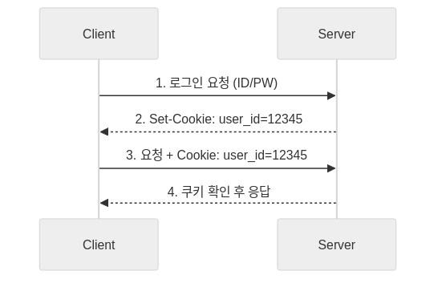
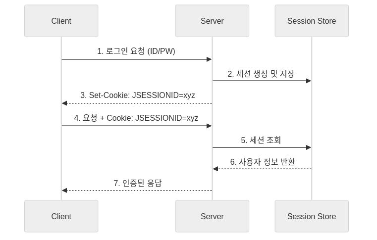
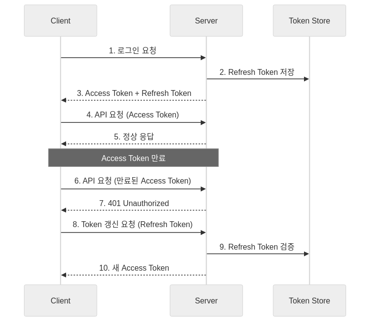

웹 인증(Web Authentication)은 HTTP 프로토콜의 무상태(Stateless) 특성으로 인해 발생하는 사용자 식별 문제를 해결하기 위한 핵심 메커니즘으로, 1994년 Netscape Communications의 Lou Montulli가 쿠키를 발명한 이후 세션 기반 인증, 토큰 기반 인증으로 발전해왔으며, 현대 웹 애플리케이션에서는 보안성과 확장성을 모두 만족시키기 위해 JWT와 Refresh Token을 조합한 하이브리드 방식이 널리 사용되고 있다.

## 인증과 인가의 개념

> **인증(Authentication)과 인가(Authorization)의 차이**
>
> 인증(Authentication)은 "당신이 누구인가?"를 확인하는 과정으로 사용자의 신원을 검증하는 것이며, 인가(Authorization)는 "당신이 무엇을 할 수 있는가?"를 결정하는 과정으로 인증된 사용자에게 특정 리소스에 대한 접근 권한을 부여하는 것이다. 인증이 먼저 수행되어야 인가가 가능하며, 두 개념은 명확히 구분되어야 한다.

### 인증과 인가의 실제 예시

| 시나리오 | 인증(Authentication) | 인가(Authorization) |
|---------|---------------------|---------------------|
| 회사 출입 | 사원증으로 본인 확인 | 특정 층/구역 접근 권한 |
| 은행 서비스 | 계좌 비밀번호 확인 | 이체 한도, 서비스 이용 권한 |
| 웹 애플리케이션 | 로그인 (ID/PW 확인) | 관리자 페이지 접근, 게시글 삭제 권한 |
| API 호출 | API 키 검증 | 특정 엔드포인트 호출 권한 |

## HTTP의 특성과 인증의 필요성

> **HTTP의 무상태성(Statelessness)**
>
> HTTP 프로토콜은 기본적으로 무상태(Stateless)와 비연결성(Connectionless) 특성을 가지고 있어, 각 요청은 독립적으로 처리되며 서버는 이전 요청에 대한 정보를 기억하지 않는다. 이러한 설계는 서버의 확장성을 높이고 구현을 단순화하지만, 로그인 상태 유지와 같은 사용자 식별이 필요한 기능을 구현하기 위해서는 별도의 상태 관리 메커니즘이 필요하다.

HTTP의 무상태성이 인증에 미치는 영향은 다음과 같다.

1. **연결 독립성**: 각 HTTP 요청은 독립적으로 처리되어 이전 요청과의 연관성이 없음
2. **상태 비보존**: 서버는 요청 처리 후 클라이언트에 대한 정보를 저장하지 않음
3. **명시적 식별 필요**: 사용자를 식별하려면 매 요청마다 인증 정보를 전송해야 함

이러한 특성 때문에 Cookie, Session, JWT와 같은 다양한 인증 메커니즘이 개발되었다.

## Cookie 기반 인증

> **Cookie란?**
>
> 쿠키(Cookie)는 1994년 Netscape의 Lou Montulli가 웹 쇼핑 카트를 구현하기 위해 발명한 기술로, 서버가 클라이언트(브라우저)에 전송하여 저장하는 최대 4KB 크기의 작은 텍스트 데이터이며, 이후 동일한 서버에 요청을 보낼 때 자동으로 함께 전송되어 상태 정보를 유지할 수 있게 해주는 핵심 웹 기술이다.

### Cookie의 동작 원리



### Cookie의 주요 속성

| 속성 | 설명 | 보안 영향 |
|------|------|----------|
| `Domain` | 쿠키가 전송될 도메인 지정 | 하위 도메인 포함 여부 결정 |
| `Path` | 쿠키가 전송될 경로 지정 | 경로 기반 접근 제어 |
| `Expires`/`Max-Age` | 쿠키 만료 시간 설정 | 영구 쿠키 vs 세션 쿠키 |
| `Secure` | HTTPS 연결에서만 전송 | 중간자 공격 방지 |
| `HttpOnly` | JavaScript 접근 차단 | XSS 공격 방지 |
| `SameSite` | 크로스 사이트 요청 시 전송 제어 | CSRF 공격 방지 |

### SameSite 속성의 세부 옵션

| 옵션 | 동작 | 사용 사례 |
|------|------|----------|
| `Strict` | 동일 사이트 요청에서만 쿠키 전송 | 민감한 세션 쿠키 |
| `Lax` | 동일 사이트 + 안전한 크로스 사이트 네비게이션 | 일반적인 로그인 쿠키 (기본값) |
| `None` | 모든 크로스 사이트 요청에서 전송 (Secure 필수) | 서드파티 쿠키, 임베드 콘텐츠 |

### Cookie 기반 인증의 한계

쿠키만으로 인증을 처리하는 방식은 다음과 같은 보안 취약점이 있어 현대 웹 개발에서는 권장되지 않는다.

1. **조작 가능성**: 클라이언트에 저장되므로 사용자가 쿠키 값을 변조할 수 있음
2. **보안 취약점**: XSS(Cross-Site Scripting), CSRF(Cross-Site Request Forgery) 공격에 취약
3. **용량 제한**: 최대 4KB로 저장할 수 있는 정보가 제한적
4. **크로스 도메인 제약**: 동일 출처 정책(Same-Origin Policy)으로 인해 다른 도메인 간 쿠키 공유 불가

## Session 기반 인증

> **Session이란?**
>
> 세션(Session)은 서버 측에서 클라이언트의 상태 정보를 관리하는 방식으로, 클라이언트에게는 고유한 세션 ID만 발급하고 실제 사용자 정보는 서버의 메모리나 데이터베이스에 저장하여 쿠키의 보안 취약점을 보완한 인증 메커니즘이며, 1990년대 후반 PHP, ASP 등의 서버 사이드 언어에서 표준 인증 방식으로 채택되어 널리 사용되었다.

### Session의 동작 원리



세션 기반 인증의 핵심은 서버가 사용자 정보를 직접 관리한다는 점이다. 클라이언트는 세션 ID만 쿠키로 저장하고, 서버는 이 ID를 키로 사용하여 메모리나 Redis, 데이터베이스 등의 세션 저장소에서 실제 사용자 정보를 조회한다. Spring Boot에서는 `HttpSession` 객체를 통해 `session.setAttribute("userId", user.getId())`와 같이 간단하게 세션에 정보를 저장하고 조회할 수 있다.

### Session 기반 인증의 장단점

| 장점 | 단점 |
|------|------|
| 서버에서 세션 강제 만료 가능 | 서버 메모리 사용량 증가 |
| 클라이언트에서 데이터 조작 불가 | 수평적 확장(Scale-out) 어려움 |
| 세션 ID만 노출되어 보안성 높음 | 매 요청마다 세션 저장소 조회 필요 |
| 구현이 비교적 간단함 | HTTP의 무상태성 원칙 위반 |
| 세션 속성 변경 용이 | 분산 환경에서 세션 동기화 필요 |

## JWT(JSON Web Token) 기반 인증

> **JWT란?**
>
> JWT(JSON Web Token)는 2010년 IETF(Internet Engineering Task Force)에서 RFC 7519로 표준화된 토큰 기반 인증 방식으로, JSON 객체를 Base64Url로 인코딩하여 당사자 간에 안전하게 정보를 전송하기 위한 컴팩트하고 자가 포함적인(self-contained) 방식이며, 서버에 상태를 저장하지 않는 무상태(Stateless) 인증을 가능하게 하여 마이크로서비스 아키텍처와 분산 시스템에서 널리 사용되고 있다.

### JWT의 구조

JWT는 Header, Payload, Signature 세 부분으로 구성되며, 각 부분은 점(.)으로 구분된다.

```
xxxxx.yyyyy.zzzzz
  │      │     │
  │      │     └── Signature (서명)
  │      └──────── Payload (내용)
  └─────────────── Header (헤더)
```

**Header**는 토큰 타입(`typ`)과 서명 알고리즘(`alg`)을 포함하고, **Payload**는 사용자 정보와 토큰 메타데이터(발급 시간 `iat`, 만료 시간 `exp`, 발급자 `iss` 등)를 담는다. **Signature**는 Header와 Payload를 비밀키로 해시하여 생성하며, 토큰의 무결성을 검증하는 데 사용된다.

### JWT 서명 알고리즘 비교

| 알고리즘 | 유형 | 사용 사례 | 특징 |
|---------|------|----------|------|
| HS256 | 대칭키 | 단일 서버, 신뢰된 당사자 간 | 빠르고 간단하지만 키 공유 필요 |
| RS256 | 비대칭키 | 마이크로서비스, 공개 검증 | 개인키 미공유, 공개 검증 가능 |
| ES256 | 비대칭키 | 모바일, IoT | RS256보다 작은 키 크기 |

### JWT 동작 원리


클라이언트는 로그인 시 서버로부터 JWT를 발급받고, 이후 API 요청 시 `Authorization: Bearer <token>` 헤더에 토큰을 포함하여 전송한다. 서버는 토큰의 서명을 검증하여 위변조 여부를 확인하고, Payload에서 사용자 정보를 추출하여 인증을 처리한다.

### JWT의 장단점

| 장점 | 단점 |
|------|------|
| 서버에 상태 저장 불필요 (Stateless) | 발급 후 강제 무효화 어려움 |
| 수평적 확장(Scale-out) 용이 | 토큰 크기가 세션 ID보다 큼 |
| 마이크로서비스 간 인증 정보 공유 가능 | Payload가 Base64 인코딩되어 내용 노출 |
| 데이터베이스 조회 없이 검증 가능 | 토큰 탈취 시 만료까지 악용 가능 |

### JWT 보안 고려사항

JWT를 안전하게 사용하기 위해서는 다음 사항을 반드시 준수해야 한다.

1. **충분히 긴 비밀키 사용**: 최소 256비트 이상의 비밀키 사용
2. **짧은 만료 시간 설정**: Access Token은 15분~1시간 이내로 설정
3. **민감한 정보 제외**: 비밀번호, 개인정보 등은 Payload에 포함하지 않음
4. **HTTPS 필수**: 토큰 탈취 방지를 위해 반드시 암호화된 연결 사용
5. **안전한 저장소 사용**: HttpOnly 쿠키 또는 메모리에 저장

## Refresh Token 전략

> **Refresh Token이란?**
>
> Refresh Token은 Access Token의 짧은 만료 시간으로 인한 사용자 경험 저하 문제를 해결하기 위해 도입된 장기 유효 토큰으로, Access Token이 만료되었을 때 사용자가 다시 로그인하지 않고도 새로운 Access Token을 발급받을 수 있게 해주며, OAuth 2.0 스펙(RFC 6749)에서 공식적으로 정의되어 세션 방식의 보안성과 JWT 방식의 확장성을 결합한 하이브리드 인증 방식의 핵심 구성요소로 사용된다.

### Access Token과 Refresh Token의 비교

| 구분 | Access Token | Refresh Token |
|------|--------------|---------------|
| 목적 | API 요청 인증 | Access Token 재발급 |
| 만료 시간 | 짧음 (15분~1시간) | 김 (7일~30일) |
| 저장 위치 | 메모리 또는 localStorage | HttpOnly 쿠키 또는 보안 저장소 |
| 전송 빈도 | 매 API 요청 | Access Token 만료 시에만 |
| 서버 저장 | 불필요 (Stateless) | 권장 (무효화 가능) |
| 탈취 시 위험도 | 단기적 (짧은 만료 시간) | 장기적 (긴 만료 시간) |

### Refresh Token 동작 원리



로그인 시 Access Token과 Refresh Token을 함께 발급하고, Access Token이 만료되면 Refresh Token을 사용하여 새로운 Access Token을 발급받는다. Refresh Token은 서버 측 저장소에 보관하여 필요시 무효화할 수 있도록 하며, 클라이언트에서는 HttpOnly 쿠키로 안전하게 저장한다.

## RTR(Refresh Token Rotation) 전략

> **RTR(Refresh Token Rotation)이란?**
>
> Refresh Token Rotation은 Refresh Token을 사용하여 Access Token을 재발급할 때마다 새로운 Refresh Token도 함께 발급하여 이전 Refresh Token을 무효화하는 보안 강화 전략으로, OAuth 2.0 Security Best Current Practice(RFC 6819) 문서에서 권장하는 방식이며, Refresh Token 탈취 시 발생할 수 있는 장기적인 보안 위협을 완화하고 토큰 재사용 공격(Token Replay Attack)을 탐지할 수 있게 해준다.

### RTR 동작 원리


RTR의 핵심은 토큰 갱신 시마다 새로운 Refresh Token을 발급하고 이전 토큰을 무효화하는 것이다. 만약 탈취된 이전 토큰으로 갱신을 시도하면, 서버는 이미 사용된 토큰임을 감지하고 해당 사용자의 모든 토큰을 무효화하여 보안 침해를 방지한다.

### RTR의 장단점

| 장점 | 단점 |
|------|------|
| 탈취된 Refresh Token 재사용 방지 | 구현 복잡도 증가 |
| 토큰 재사용 공격 탐지 가능 | 네트워크 오류 시 동기화 문제 |
| 보안성 대폭 향상 | 저장해야 할 데이터 증가 |
| Refresh Token 만료 시간 연장 가능 | 클라이언트에서 새 토큰 관리 필요 |

### RTR 구현 시 고려사항

1. **네트워크 실패 처리**: 토큰 갱신 응답이 클라이언트에 도달하지 못한 경우 재시도 허용 기간 설정
2. **Grace Period**: 이전 토큰에 대해 짧은 유예 기간(예: 수 초) 부여
3. **Token Family**: 동일 로그인 세션에서 발급된 토큰들을 그룹으로 관리
4. **감사 로깅**: 모든 토큰 발급/갱신/무효화 이벤트 기록

## 인증 방식 종합 비교

| 특성 | Cookie | Session | JWT | JWT + Refresh |
|------|--------|---------|-----|---------------|
| **상태 관리** | 클라이언트 | 서버 | 클라이언트 | 하이브리드 |
| **확장성** | 높음 | 낮음 | 높음 | 높음 |
| **보안성** | 낮음 | 높음 | 중간 | 높음 |
| **강제 로그아웃** | 불가 | 가능 | 어려움 | 가능 |
| **서버 부하** | 낮음 | 높음 | 낮음 | 중간 |
| **구현 복잡도** | 낮음 | 낮음 | 중간 | 높음 |
| **마이크로서비스 적합성** | 낮음 | 낮음 | 높음 | 높음 |
| **모바일 앱 적합성** | 낮음 | 중간 | 높음 | 높음 |

### 사용 시나리오별 권장 방식

| 시나리오 | 권장 방식 | 이유 |
|---------|----------|------|
| 단일 서버 웹 애플리케이션 | Session | 구현 간단, 보안성 높음 |
| 마이크로서비스 아키텍처 | JWT + Refresh Token | Stateless, 서비스 간 인증 공유 |
| 모바일 앱 | JWT + Refresh Token | 쿠키 지원 불필요, 오프라인 지원 |
| SPA (Single Page Application) | JWT + Refresh Token | CORS 이슈 회피, API 중심 |
| 금융/의료 서비스 | Session + 강화된 보안 | 엄격한 세션 제어, 즉시 로그아웃 |
| IoT 디바이스 | JWT (장기) | 리소스 제한, 네트워크 간헐적 |

## 토큰 저장 위치별 보안 비교

| 저장 위치 | XSS 취약성 | CSRF 취약성 | 권장 용도 |
|----------|-----------|-------------|----------|
| localStorage | 높음 | 없음 | 권장하지 않음 |
| sessionStorage | 높음 | 없음 | 임시 데이터만 |
| 일반 Cookie | 중간 | 높음 | 권장하지 않음 |
| HttpOnly Cookie | 낮음 | 중간 | Refresh Token |
| 메모리 (변수) | 낮음 | 없음 | Access Token |

가장 안전한 토큰 저장 전략은 Access Token을 JavaScript 변수(메모리)에 저장하고, Refresh Token은 HttpOnly 쿠키로 서버에서 관리하는 것이다. 이 방식은 XSS 공격으로부터 Refresh Token을 보호하면서도, Access Token의 짧은 수명으로 탈취 시 피해를 최소화할 수 있다.

## 마치며

웹 인증 방식은 Cookie, Session, JWT, Refresh Token, RTR로 발전해왔으며, 각 방식은 고유한 장단점을 가지고 있다. Cookie는 클라이언트 측 상태 유지의 기초를 제공하고, Session은 서버 측 보안을 강화하며, JWT는 무상태 인증과 마이크로서비스 환경에서의 확장성을 제공한다. Refresh Token과 RTR은 JWT의 보안 취약점을 보완하여 실무에서 가장 권장되는 하이브리드 인증 방식을 구현할 수 있게 해준다.

인증 방식 선택 시에는 서비스의 특성, 보안 요구사항, 확장성 필요성, 개발 복잡도를 종합적으로 고려해야 하며, 어떤 방식을 선택하더라도 HTTPS 사용, 적절한 토큰 만료 시간 설정, 안전한 저장소 사용, 감사 로깅 등의 보안 베스트 프랙티스를 함께 적용해야 한다.
