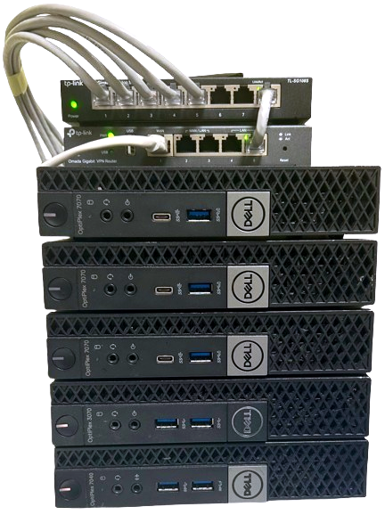
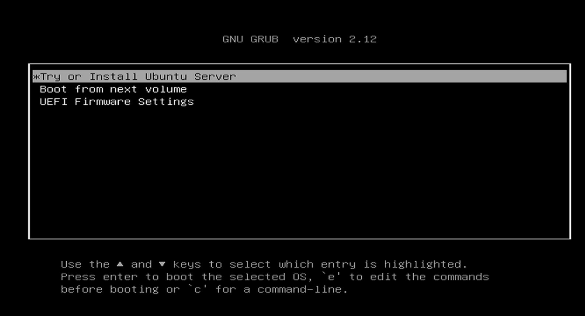
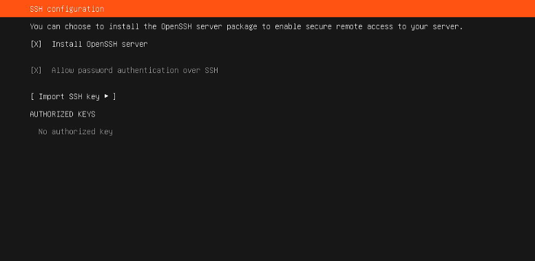
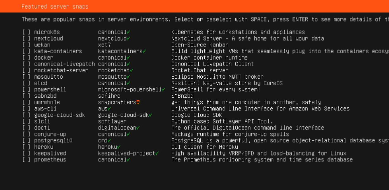
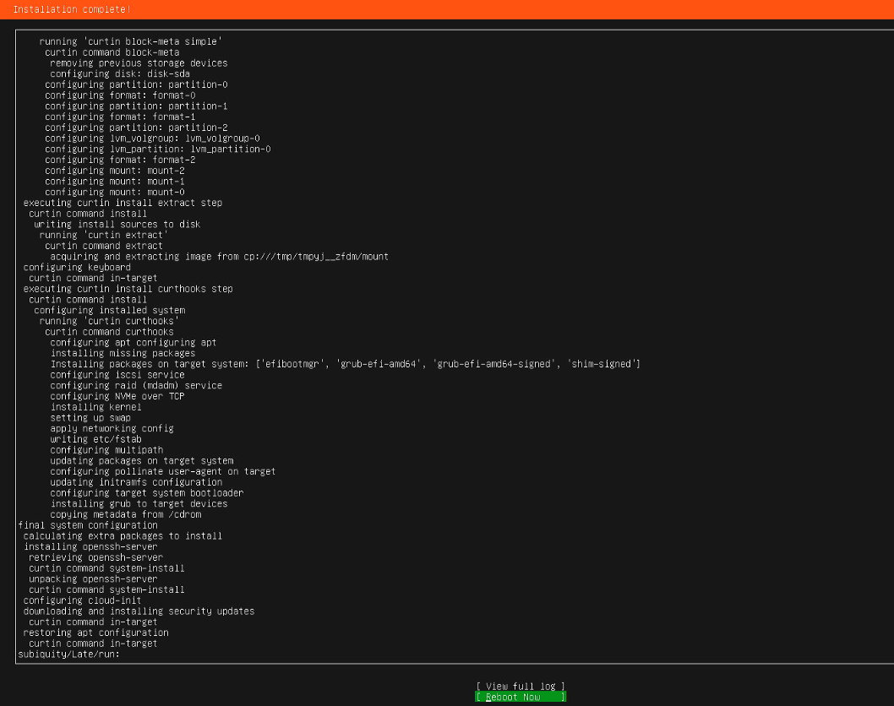

## 시리즈 소개

이 시리즈는 홈랩에 쿠버네티스 클러스터를 설치하고 사이드 프로젝트나 테스트 환경을 위한 CI/CD 시스템을 구축하는 과정을 다룬다. 클라우드 비용 부담 없이 집에서 쿠버네티스를 직접 운영하는 방법을 알아보며, 실용적인 홈랩 환경을 만드는 전체 과정을 단계별로 설명한다.



하드웨어로는 Dell OptiPlex Micro 다섯 대로 노드를 구성하고, TP-Link 라우터와 스위치로 네트워크를 구성했다. Dell OptiPlex Micro는 전력 소모가 적은 미니 PC이며, 중고 시장에서 저렴하게 구할 수 있는 장점이 있다. 구매한 모델은 9세대 i5 CPU, 16GB 메모리, 256GB SSD로 구성되어 있어 쿠버네티스를 운영하기에 충분한 성능을 제공한다.

## OS 설치

클러스터 구축의 첫 단계는 운영체제 설치다. Dell OptiPlex Micro에는 원래 Windows 10이 설치되어 있었으나, 이를 제거하고 Ubuntu 24.04 LTS Server(CLI)를 설치했다. 서버용 Ubuntu를 선택한 이유는 GUI가 없어 리소스 사용량이 적고, 쿠버네티스와 같은 서버 환경에 최적화되어 있기 때문이다. 또한 LTS 버전은 장기 지원되어 안정성이 높고 보안 업데이트가 지속적으로 제공되어 서버 운영에 적합하다.

설치 과정은 다음과 같다. 먼저 설치용 USB를 만든 후 부팅하여 설치를 진행한다.



부팅 후 "Try or Install Ubuntu"를 선택하고 설치를 계속 진행한다. 설치 과정 중에 다음과 같은 화면이 나오면 "Install OpenSSH server"를 선택한다. 이는 SSH로 원격 접속하여 작업하기 위함이다. 헤드리스 서버로 운영할 것이므로 모니터와 키보드 없이 원격에서 관리하기 위해 필수적인 설정이다.



그 다음 단계에서 추가 패키지는 일단 설치하지 않고 진행한다. 필요한 패키지는 나중에 설치할 수 있으므로 기본 설치를 빠르게 완료하는 것이 좋다.



아래 화면이 나오면 설치가 완료된 것이다. 이 과정을 모든 노드에 반복하여 다섯 대 모두 동일한 환경으로 구성한다.



## 네트워크 설정

OS 설치가 완료된 후에는 네트워크 설정이 필요하다. 아래 그림은 이번 클러스터의 네트워크 다이어그램이다.


[이전 포스트](/posts/ubuntu-2404-lts-set-static-ip)를 참고하여 각 노드에 고정 IP를 할당했다. 쿠버네티스 클러스터에서는 노드 간 통신이 매우 중요하기 때문에 고정 IP 설정이 필수적이다. DHCP로 할당된 IP는 재부팅 시 변경될 수 있어 클러스터 안정성을 해칠 수 있다. 또한 고정 IP를 사용하면 서비스 디스커버리와 로드밸런싱 구성이 훨씬 간편해진다.

## 쿠버네티스 설치

Ubuntu 설치와 네트워크 설정이 완료되었으니 이제 본격적으로 쿠버네티스를 설치한다. 설치는 크게 두 단계로 나뉜다. 먼저 모든 노드에 기본 구성 요소를 설치한 후, 마스터 노드에서 클러스터를 초기화하고 워커 노드를 연결하는 과정이다.

아래 명령어를 모든 노드(마스터 노드와 워커 노드 모두)에서 실행하여 도커와 쿠버네티스 관련 패키지를 설치한다.

```bash
sudo apt-get update && sudo apt-get upgrade -y
sudo apt-get install -y apt-transport-https ca-certificates curl software-properties-common

sudo apt-get update
sudo apt-get install ca-certificates curl
sudo install -m 0755 -d /etc/apt/keyrings
sudo curl -fsSL https://download.docker.com/linux/ubuntu/gpg -o /etc/apt/keyrings/docker.asc
sudo chmod a+r /etc/apt/keyrings/docker.asc

echo \
"deb [arch=$(dpkg --print-architecture) signed-by=/etc/apt/keyrings/docker.asc] https://download.docker.com/linux/ubuntu \
$(. /etc/os-release && echo "$VERSION_CODENAME") stable" | \
sudo tee /etc/apt/sources.list.d/docker.list > /dev/null

sudo apt-get update
sudo apt-get install docker-ce docker-ce-cli containerd.io

sudo systemctl start docker
sudo systemctl enable docker

echo "deb [signed-by=/etc/apt/keyrings/kubernetes-apt-keyring.gpg] https://pkgs.k8s.io/core:/stable:/v1.30/deb/ /" | sudo tee /etc/apt/sources.list.d/kubernetes.list
curl -fsSL https://pkgs.k8s.io/core:/stable:/v1.30/deb/Release.key | sudo gpg --dearmor -o /etc/apt/keyrings/kubernetes-apt-keyring.gpg

sudo apt-get update
sudo apt-get install -y kubelet kubeadm kubectl
sudo apt-mark hold kubelet kubeadm kubectl

# 스왑 비활성화 (쿠버네티스는 스왑을 비활성화해야 정상 작동함)
sudo swapoff -a
sudo sed -i '/swap/d' /etc/fstab

# iptables 설정
cat <<EOF | sudo tee /etc/modules-load.d/k8s.conf
overlay
br_netfilter
EOF

sudo modprobe overlay
sudo modprobe br_netfilter

cat <<EOF | sudo tee /etc/sysctl.d/k8s.conf
net.bridge.bridge-nf-call-iptables  = 1
net.bridge.bridge-nf-call-ip6tables = 1
net.ipv4.ip_forward                 = 1
EOF

sudo sysctl --system

sudo mkdir -p /etc/containerd
sudo containerd config default | sudo tee /etc/containerd/config.toml
sudo sed -i 's/SystemdCgroup = false/SystemdCgroup = true/' /etc/containerd/config.toml
sudo systemctl restart containerd

sudo kubeadm config images pull
```

기본 패키지 설치가 완료되면, 이제 마스터 노드에서만 아래 명령어를 실행하여 쿠버네티스 클러스터를 초기화한다. `--pod-network-cidr` 옵션은 Calico 네트워크 플러그인을 위한 설정이다.

```bash
sudo kubeadm init --pod-network-cidr=10.244.0.0/16
```

초기화가 완료되면 다음과 같은 메시지가 출력된다. 이 출력에는 클러스터 설정 방법과 워커 노드를 연결하는 명령어가 포함되어 있다.

```
Your Kubernetes control-plane has initialized successfully!

To start using your cluster, you need to run the following as a regular user:

  mkdir -p $HOME/.kube
  sudo cp -i /etc/kubernetes/admin.conf $HOME/.kube/config
  sudo chown $(id -u):$(id -g) $HOME/.kube/config

You should now deploy a pod network to the cluster.
Run "kubectl apply -f [podnetwork].yaml" with one of the options listed at:
  https://kubernetes.io/docs/concepts/cluster-administration/addons/

Then you can join any number of worker nodes by running the following on each as root:

kubeadm join <your-master-ip>:6443 --token <token> --discovery-token-ca-cert-hash sha256:<hash>
```

마지막 줄에 있는 `kubeadm join` 명령어는 모든 워커 노드에서 실행해야 한다. 이 명령어를 통해 워커 노드가 마스터 노드에 연결되어 클러스터의 일부가 된다.

다음으로, 마스터 노드에서 아래 명령어를 실행하여 kubectl을 사용할 수 있도록 설정한다. 이 설정을 통해 일반 사용자 계정으로도 클러스터를 관리할 수 있게 된다.

```bash
mkdir -p $HOME/.kube
sudo cp -i /etc/kubernetes/admin.conf $HOME/.kube/config
sudo chown $(id -u):$(id -g) $HOME/.kube/config
```

이제 마스터 노드에서 Calico 네트워크 플러그인을 설치한다. Calico를 선택한 이유는 높은 성능과 보안 정책 지원 때문이다. Calico는 BGP를 사용하여 효율적인 네트워크 라우팅을 제공하고, 네트워크 정책을 통해 파드 간 트래픽을 세밀하게 제어할 수 있어 클러스터 보안에 도움이 된다.

```bash
kubectl apply -f https://raw.githubusercontent.com/projectcalico/calico/v3.26.1/manifests/calico.yaml
```

## 로드밸런서 설치

클러스터의 기본 구성이 완료되었으니, 이제 로드밸런서를 설치하여 외부에서 서비스에 접근할 수 있도록 한다. 이 클러스터에서는 MetalLB를 사용한다. MetalLB는 클라우드 환경과 달리 로드밸런서가 기본 제공되지 않는 온프레미스 환경에서 많이 사용되는 로드밸런서이다. MetalLB를 선택한 이유는 베어메탈 환경에서도 쿠버네티스의 LoadBalancer 타입 서비스를 구현할 수 있기 때문이다. 이를 통해 클라우드 환경과 유사한 방식으로 서비스를 외부에 노출시킬 수 있어 개발 경험의 일관성을 유지할 수 있다.

다음 명령어로 MetalLB를 설치한다.

```bash
kubectl apply -f https://raw.githubusercontent.com/metallb/metallb/v0.14.9/config/manifests/metallb-native.yaml
```

설치가 제대로 되었는지 다음 명령어로 확인한다.

```bash
kubectl get pods -n metallb-system
```

이 시리즈에서는 MetalLB를 Layer 2 모드로 사용할 것이다. 이 모드에서는 노드의 IP를 활용하여 로드 밸런서를 생성하고, ARP/NDP 프로토콜을 사용하여 할당된 IP를 해당 노드의 MAC 주소로 매핑한다.

예를 들어, MetalLB가 192.168.0.200이라는 가상 IP를 할당하면, 해당 IP로 들어온 패킷은 ARP/NDP 프로토콜을 통해 해당 IP를 가진 노드의 MAC 주소로 변환되어 전달된다. 이를 통해 별도의 하드웨어 로드밸런서 없이도 효과적인 로드 밸런싱을 구현할 수 있다.

ARP와 NDP에 대해 더 알아보려면 다음 글을 참고하면 된다:

-   [ARP 프로토콜 작동 방식](/posts/how-arp-protocol-works/)
-   [IPv6 NDP 이해하기](/posts/understanding-ipv6-ndp/)

### 마치며

이상으로 기본적인 쿠버네티스 클러스터를 구축하고 MetalLB를 사용하여 로드밸런서를 설정하는 과정을 완료했다. 이제 클러스터에 다양한 워크로드를 배포하고 관리할 수 있는 환경이 준비되었다.

다음 글에서는 GitOps 방식으로 애플리케이션을 관리하기 위해 ArgoCD를 설치하고 Git 레포지토리와 연동하는 방법을 알아볼 것이다.
