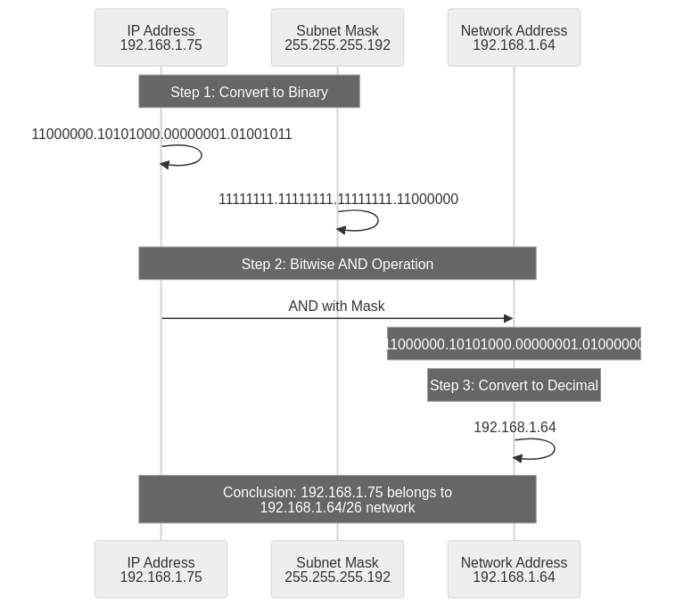
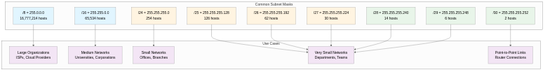

## 서브넷 마스크의 등장 배경과 역사

서브넷 마스크(Subnet Mask)는 1985년 RFC 950 문서를 통해 TCP/IP 프로토콜 스택에 공식적으로 도입되었으며, 이는 초기 인터넷의 클래스 기반 주소 체계(Classful Addressing)가 가진 심각한 비효율성 문제를 해결하기 위한 혁신적인 기술이었다. 1980년대 초반 인터넷은 A, B, C 클래스 체계를 사용했는데, Class A는 첫 바이트(1-126)로 식별되어 약 1,600만 개의 호스트를 지원하고, Class B는 두 번째 바이트(128-191)로 식별되어 약 65,000개의 호스트를 지원하며, Class C는 세 번째 바이트(192-223)로 식별되어 254개의 호스트를 지원했다. 이 경직된 구조는 치명적인 문제를 야기했는데, 1,000대의 호스트가 필요한 조직은 Class C(254개)로는 부족하여 Class B(65,534개)를 할당받아야 했고 이로 인해 64,000개 이상의 IP 주소가 낭비되었으며, 반대로 300대의 호스트만 필요한 조직도 Class C 전체(254개)를 할당받아야 하여 유연성이 전혀 없었다. 서브넷 마스크는 이러한 비효율성을 해결하기 위해 등장하여 하나의 네트워크를 여러 개의 작은 서브네트워크(서브넷)로 분할할 수 있게 했으며, 네트워크 부분과 호스트 부분의 경계를 임의로 조정하여 필요한 만큼의 호스트 수를 정확하게 할당할 수 있게 만들었고, 이는 1993년 CIDR(Classless Inter-Domain Routing) 도입의 기반이 되어 현대 인터넷 주소 관리의 핵심 개념으로 자리잡았다.

## 서브넷 마스크의 구조와 원리

서브넷 마스크는 IP 주소와 동일하게 32비트(4옥텟)로 구성되며, 연속된 1과 연속된 0으로 이루어진 이진수 패턴을 가지는데, 1로 설정된 비트는 네트워크 부분(Network Portion)을 나타내어 해당 네트워크 내 모든 호스트가 동일한 값을 가져야 하며, 0으로 설정된 비트는 호스트 부분(Host Portion)을 나타내어 각 호스트마다 고유한 값을 가질 수 있다. 예를 들어 255.255.255.0은 이진수로 11111111.11111111.11111111.00000000이며, 처음 24비트(세 옥텟)가 네트워크 부분이고 마지막 8비트(한 옥텟)가 호스트 부분이므로 256개(2^8)의 주소를 가지며 네트워크 주소와 브로드캐스트 주소를 제외하면 254개의 호스트를 할당할 수 있다. 255.255.255.128은 이진수로 11111111.11111111.11111111.10000000이며, 25비트가 네트워크 부분이고 7비트가 호스트 부분이므로 128개(2^7) 주소에 126개 호스트를 할당할 수 있고, 255.255.255.192는 이진수로 11111111.11111111.11111111.11000000이며 26비트 네트워크 부분에 6비트 호스트 부분으로 64개(2^6) 주소에 62개 호스트를 할당할 수 있다. 서브넷 마스크는 반드시 연속된 1로 시작하고 연속된 0으로 끝나야 하는 규칙이 있어 11111111.11111111.11111111.11001100(255.255.255.204)처럼 1과 0이 섞인 패턴은 유효하지 않으며, 이는 라우팅 효율성과 표준 준수를 위한 필수 조건이다.

## 서브넷 마스크의 AND 연산 원리

서브넷 마스크의 핵심 동작 원리는 비트 단위 AND 연산(Bitwise AND Operation)으로, IP 주소와 서브넷 마스크를 이진수로 변환한 후 각 비트 위치에서 AND 연산을 수행하여 네트워크 주소를 추출하며, 이를 통해 두 IP 주소가 동일한 네트워크에 속하는지 판단하고 라우팅 결정을 내릴 수 있다. AND 연산의 규칙은 두 비트가 모두 1일 때만 결과가 1이고 나머지 경우는 모두 0이 되는 논리 연산으로, 1 AND 1 = 1, 1 AND 0 = 0, 0 AND 1 = 0, 0 AND 0 = 0의 진리표를 따른다. 구체적인 예시로 IP 주소 192.168.1.75와 서브넷 마스크 255.255.255.192(/26)의 AND 연산 과정을 살펴보면, 먼저 IP 주소 192.168.1.75를 이진수로 변환하면 11000000.10101000.00000001.01001011이고, 서브넷 마스크 255.255.255.192를 이진수로 변환하면 11111111.11111111.11111111.11000000이며, 비트 단위 AND 연산을 수행하면 11000000.10101000.00000001.01000000이 되고, 이를 십진수로 변환하면 192.168.1.64가 되어 이것이 네트워크 주소임을 알 수 있다. 이 연산을 통해 192.168.1.75는 192.168.1.64/26 네트워크에 속하며, 이 네트워크의 주소 범위는 192.168.1.64 ~ 192.168.1.127(64개 주소)이고, 네트워크 주소는 .64, 브로드캐스트 주소는 .127, 사용 가능한 호스트 주소는 .65 ~ .126(62개)임을 확인할 수 있다.

## 주요 서브넷 마스크 값과 활용 사례

### Class A 기반 서브넷 마스크

**255.0.0.0 (/8)**은 Class A의 기본 서브넷 마스크로, 8비트 네트워크 부분과 24비트 호스트 부분을 가지며 16,777,216개(2^24) 주소에 16,777,214개 호스트를 할당할 수 있고, 주로 대형 ISP(Internet Service Provider), 클라우드 서비스 제공업체(AWS, Google Cloud, Azure), 글로벌 대기업, 정부 기관에서 사용되며, 예를 들어 10.0.0.0/8은 사설 IP 대역으로 대규모 기업 내부 네트워크에 광범위하게 활용된다. **255.128.0.0 (/9)**는 8,388,606개 호스트를 지원하며, **255.192.0.0 (/10)**은 4,194,302개 호스트를, **255.224.0.0 (/11)**은 2,097,150개 호스트를, **255.240.0.0 (/12)**는 1,048,574개 호스트를 지원하여 Class A를 더 작은 블록으로 분할할 때 사용되며, 이는 대규모 조직 내에서 지역별, 부서별로 IP 블록을 할당할 때 유용하다.

### Class B 기반 서브넷 마스크

**255.255.0.0 (/16)**은 Class B의 기본 서브넷 마스크로, 16비트 네트워크 부분과 16비트 호스트 부분을 가지며 65,536개(2^16) 주소에 65,534개 호스트를 할당할 수 있고, 주로 중대형 대학, 기업 본사, 데이터센터, 정부 부처에서 사용되며, 예를 들어 172.16.0.0/16은 사설 IP 대역으로 기업 내부 네트워크에 사용된다. **255.255.128.0 (/17)**은 32,766개 호스트를, **255.255.192.0 (/18)**은 16,382개 호스트를, **255.255.224.0 (/19)**은 8,190개 호스트를, **255.255.240.0 (/20)**은 4,094개 호스트를, **255.255.248.0 (/21)**은 2,046개 호스트를, **255.255.252.0 (/22)**은 1,022개 호스트를, **255.255.254.0 (/23)**은 510개 호스트를 지원하여 Class B를 여러 서브넷으로 세분화할 때 사용되며, VLSM(Variable Length Subnet Mask)을 통해 실제 필요한 호스트 수에 맞춰 효율적으로 IP를 할당할 수 있다.

### Class C 기반 서브넷 마스크

**255.255.255.0 (/24)**는 Class C의 기본 서브넷 마스크로, 24비트 네트워크 부분과 8비트 호스트 부분을 가지며 256개(2^8) 주소에 254개 호스트를 할당할 수 있고, 주로 소규모 사무실, 지사, 부서, 가정 네트워크에서 가장 보편적으로 사용되며, 예를 들어 192.168.1.0/24는 가정용 공유기의 기본 설정으로 널리 사용된다. **255.255.255.128 (/25)**은 126개 호스트를 지원하여 /24 네트워크를 두 개의 서브넷으로 분할할 때 사용되고, **255.255.255.192 (/26)**은 62개 호스트를 지원하여 네 개의 서브넷으로 분할하며, **255.255.255.224 (/27)**은 30개 호스트로 여덟 개의 서브넷을, **255.255.255.240 (/28)**은 14개 호스트로 열여섯 개의 서브넷을, **255.255.255.248 (/29)**은 6개 호스트로 서른두 개의 서브넷을, **255.255.255.252 (/30)**은 2개 호스트로 예순네 개의 서브넷을 생성하며, /30은 주로 라우터 간 Point-to-Point 연결(WAN 링크, BGP 피어링)에 사용된다.

## 서브넷 마스크와 CIDR 표기법의 관계

1993년 CIDR(Classless Inter-Domain Routing)이 도입되면서 서브넷 마스크는 슬래시 표기법(Slash Notation)으로도 표현되기 시작했으며, 이는 32비트 중 네트워크 비트의 개수를 /n 형식으로 간결하게 나타내는 방식으로 가독성과 편의성을 크게 향상시켰다. CIDR 표기법과 서브넷 마스크는 일대일로 대응되는데, /8은 255.0.0.0(8비트 네트워크, 24비트 호스트)이고, /16은 255.255.0.0(16비트 네트워크, 16비트 호스트)이며, /24는 255.255.255.0(24비트 네트워크, 8비트 호스트)이고, /25는 255.255.255.128(25비트 네트워크, 7비트 호스트)이며, /26은 255.255.255.192(26비트 네트워크, 6비트 호스트)이고, /27은 255.255.255.224(27비트 네트워크, 5비트 호스트)이며, /28은 255.255.255.240(28비트 네트워크, 4비트 호스트)이고, /29는 255.255.255.248(29비트 네트워크, 3비트 호스트)이며, /30은 255.255.255.252(30비트 네트워크, 2비트 호스트)이다. CIDR 표기법의 장점은 표기가 간결하여 192.168.1.0 255.255.255.0 대신 192.168.1.0/24로 표현할 수 있고, 계산이 직관적이어서 /24는 바로 8비트 호스트(2^8 = 256개)임을 알 수 있으며, 국제 표준으로 널리 채택되어 네트워크 설정, 라우팅 테이블, 문서화에서 보편적으로 사용되고, VLSM과 라우트 집약을 지원하여 유연한 네트워크 설계가 가능하다는 점이다.

## 서브넷 마스크 계산 실습

### 호스트 수로부터 서브넷 마스크 계산

필요한 호스트 수가 주어졌을 때 적절한 서브넷 마스크를 계산하는 방법은 다음과 같으며, 먼저 필요한 호스트 수에 2를 더한다(네트워크 주소와 브로드캐스트 주소 예약분), 그 다음 이 값 이상의 가장 작은 2의 거듭제곱을 찾고, 그 거듭제곱의 지수가 호스트 비트 수가 되며, 마지막으로 32에서 호스트 비트 수를 빼면 네트워크 비트 수(CIDR 접두사)가 된다. 예를 들어 50개 호스트가 필요한 경우 50 + 2 = 52이고, 이상의 가장 작은 2의 거듭제곱은 2^6 = 64이므로 호스트 비트는 6비트이며, 32 - 6 = 26이므로 /26(255.255.255.192)이 필요하고 실제로 62개 호스트를 사용할 수 있다. 100개 호스트가 필요한 경우 100 + 2 = 102이고, 2^7 = 128이므로 호스트 비트는 7비트이며, /25(255.255.255.128)가 필요하고 126개 호스트를 사용할 수 있다. 500개 호스트가 필요한 경우 500 + 2 = 502이고, 2^9 = 512이므로 호스트 비트는 9비트이며, /23(255.255.254.0)이 필요하고 510개 호스트를 사용할 수 있다.

### 서브넷 분할 계산

192.168.1.0/24 네트워크를 4개의 동일한 크기 서브넷으로 분할하려면 어떻게 해야 하는지 계산하는 과정을 살펴보면, 4개 서브넷을 만들려면 2비트가 추가로 필요하고(2^2 = 4), 원래 /24에 2를 더하면 /26이 되며, /26 서브넷 마스크는 255.255.255.192이고, 각 서브넷은 64개 주소(62개 사용 가능 호스트)를 가진다. 네 개의 서브넷은 첫 번째가 192.168.1.0/26(192.168.1.0 ~ 192.168.1.63, 사용 가능: .1 ~ .62)이고, 두 번째가 192.168.1.64/26(192.168.1.64 ~ 192.168.1.127, 사용 가능: .65 ~ .126)이며, 세 번째가 192.168.1.128/26(192.168.1.128 ~ 192.168.1.191, 사용 가능: .129 ~ .190)이고, 네 번째가 192.168.1.192/26(192.168.1.192 ~ 192.168.1.255, 사용 가능: .193 ~ .254)이 된다.

### 두 IP가 동일 네트워크인지 확인

192.168.1.75와 192.168.1.130이 서브넷 마스크 255.255.255.192(/26) 환경에서 동일한 네트워크에 속하는지 확인하는 과정은 다음과 같으며, 먼저 192.168.1.75 AND 255.255.255.192를 수행하면 192.168.1.64가 나오고, 192.168.1.130 AND 255.255.255.192를 수행하면 192.168.1.128이 나오며, 두 네트워크 주소가 다르므로(192.168.1.64 ≠ 192.168.1.128) 두 IP는 서로 다른 네트워크에 속하여 직접 통신할 수 없고 라우터를 통해야 한다.

## 서브넷 마스크의 실제 활용

### 기업 네트워크 설계

중소기업이 192.168.0.0/16 사설 IP 블록을 할당받아 VLSM을 활용하여 효율적으로 네트워크를 설계하는 예시를 살펴보면, 본사 직원 200명은 192.168.0.0/24(254개 호스트)를 할당받고, 지사 A 직원 50명은 192.168.1.0/26(62개 호스트)을 할당받으며, 지사 B 직원 30명은 192.168.1.64/27(30개 호스트)을 할당받고, 서버팜 20대는 192.168.1.96/27(30개 호스트)을 할당받으며, DMZ 웹 서버 5대는 192.168.1.128/29(6개 호스트)를 할당받고, 라우터 간 Point-to-Point 링크는 192.168.1.136/30, 192.168.1.140/30(각 2개 호스트)을 할당받으며, 나머지 주소 공간은 향후 확장을 위해 예약한다.

### 클라우드 환경(AWS VPC)

AWS VPC를 10.0.0.0/16으로 생성하고 서브넷 마스크를 활용하여 구조화하는 예시는 다음과 같으며, 퍼블릭 서브넷 A는 10.0.1.0/24(254개 호스트, 웹 서버, 로드 밸런서)를 사용하고, 퍼블릭 서브넷 B는 10.0.2.0/24(254개 호스트, 고가용성 위한 다른 가용 영역)를 사용하며, 프라이빗 서브넷 A는 10.0.10.0/24(254개 호스트, 애플리케이션 서버)를 사용하고, 프라이빗 서브넷 B는 10.0.11.0/24(254개 호스트, 고가용성)를 사용하며, 데이터베이스 서브넷 A는 10.0.20.0/24(254개 호스트, RDS, ElastiCache)를 사용하고, 데이터베이스 서브넷 B는 10.0.21.0/24(254개 호스트, 고가용성)를 사용하며, 나머지 주소 공간(10.0.30.0/24 ~ 10.0.255.0/24)은 향후 서비스 확장을 위해 예약한다.

### 홈 네트워크

가정용 공유기에서 서브넷 마스크를 활용하는 일반적인 예시는 192.168.1.0/24(255.255.255.0) 네트워크를 사용하며, 공유기 게이트웨이는 192.168.1.1을 사용하고, DHCP 범위는 192.168.1.100 ~ 192.168.1.200(동적 할당)을 설정하며, 고정 IP는 192.168.1.10 ~ 192.168.1.50(서버, NAS, 프린터 등)을 할당하고, 예약 주소는 192.168.1.201 ~ 192.168.1.254(향후 사용)를 남겨두며, 이 구성으로 254개 장치를 연결할 수 있어 일반 가정에서는 충분하다.

## 서브넷 마스크 관련 트러블슈팅

### 잘못된 서브넷 마스크 설정

호스트에 잘못된 서브넷 마스크를 설정하면 네트워크 통신 장애가 발생하는데, 예를 들어 실제 네트워크는 192.168.1.0/24이지만 호스트에 255.255.255.0 대신 255.255.0.0(/16)을 설정하면 호스트는 192.168.0.0 ~ 192.168.255.255 전체를 로컬 네트워크로 인식하여 192.168.2.10과 통신할 때 라우터를 거치지 않고 직접 ARP 요청을 보내지만 실제로는 다른 네트워크이므로 응답이 없어 통신이 실패한다. 증상은 동일 서브넷 내 통신은 정상이나 다른 서브넷 통신이 실패하고, ARP 테이블에 불필요한 항목이 과도하게 생성되며, 네트워크 성능이 저하되고 브로드캐스트 트래픽이 증가한다. 해결 방법은 호스트의 서브넷 마스크를 올바른 값으로 수정하고(Windows: ncpa.cpl → 어댑터 속성, Linux: /etc/netplan/ 또는 nmcli), DHCP 서버 설정을 확인하여 올바른 서브넷 마스크를 배포하는지 점검하며, 네트워크 장비(라우터, 스위치) 설정을 검토하여 VLAN과 서브넷이 일치하는지 확인한다.

### 서브넷 불일치로 인한 통신 실패

동일한 물리적 네트워크에 서로 다른 서브넷 마스크를 사용하는 호스트가 혼재하면 통신 문제가 발생하는데, 예를 들어 호스트 A는 192.168.1.10/24(255.255.255.0)이고 호스트 B는 192.168.1.20/26(255.255.255.192)일 때, 호스트 A는 192.168.1.0 ~ 192.168.1.255를 로컬로 인식하지만 호스트 B는 192.168.1.0 ~ 192.168.1.63만 로컬로 인식하여 비대칭 라우팅이 발생한다. 호스트 A에서 호스트 B로 패킷을 보낼 때는 직접 ARP로 통신하지만, 호스트 B에서 호스트 A(192.168.1.10)로 응답할 때는 게이트웨이로 전송하려 하여 통신이 불안정해진다. 해결 방법은 모든 호스트가 동일한 서브넷 마스크를 사용하도록 표준화하고, DHCP를 사용하여 일관된 네트워크 설정을 자동으로 배포하며, 네트워크 문서화를 통해 서브넷 할당 계획을 명확히 관리하고, 정기적인 네트워크 감사(network audit)를 수행하여 불일치를 조기에 발견한다.

### 서브넷 경계 위반

서브넷을 분할할 때 경계가 2의 거듭제곱 단위로 정렬되지 않으면 라우팅 문제가 발생하는데, 예를 들어 192.168.1.50/26을 서브넷으로 설정하면 /26의 크기는 64이므로 0, 64, 128, 192에서 시작해야 하지만 50은 유효한 시작 주소가 아니어서 라우터가 이 서브넷을 올바르게 인식하지 못하고 라우팅 테이블에 추가할 수 없으며, 네트워크 통신이 완전히 실패한다. 해결 방법은 서브넷 시작 주소가 서브넷 크기의 배수인지 확인하고(예: /26은 0, 64, 128, 192), 온라인 서브넷 계산기를 사용하여 유효성을 검증하며, 네트워크 설계 단계에서 서브넷 할당 계획을 수립하여 문서화하고, 라우터 설정 후 라우팅 테이블을 확인하여 서브넷이 올바르게 등록되었는지 점검한다.

## 서브넷 마스크의 장점과 한계

### 장점

서브넷 마스크의 가장 큰 장점은 IP 주소 할당의 유연성 향상으로, 클래스 기반 체계의 경직성을 극복하여 필요한 만큼의 호스트 수를 정확하게 할당할 수 있고, 100개 호스트가 필요하면 /25(126개)를 할당하여 낭비를 최소화할 수 있으며, VLSM을 통해 하나의 네트워크 내에서 서로 다른 크기의 서브넷을 동시에 사용할 수 있다. 네트워크 보안 강화도 중요한 장점으로, 서브넷을 분리하여 브로드캐스트 도메인을 축소함으로써 브로드캐스트 스톰을 방지하고 네트워크 성능을 향상시키며, 부서별, 기능별로 네트워크를 분리하여 방화벽 규칙을 적용하고 접근 제어를 강화할 수 있고, 보안 침해 발생 시 피해 범위를 해당 서브넷으로 제한하여 전체 네트워크 확산을 방지할 수 있다. 라우팅 효율성 증가도 장점으로, 서브넷 마스크를 통해 라우터가 빠르게 네트워크 주소를 계산하고 최적 경로를 결정할 수 있으며, 계층적 네트워크 구조를 구현하여 라우팅 테이블 크기를 축소하고, 라우트 집약(Route Aggregation)을 통해 여러 서브넷을 하나의 라우팅 항목으로 통합할 수 있다. 네트워크 관리 편의성도 향상되는데, 서브넷을 논리적으로 분할하여 조직 구조나 지리적 위치에 맞게 네트워크를 설계할 수 있고, 트러블슈팅 시 문제가 발생한 서브넷을 쉽게 격리하고 진단할 수 있으며, 네트워크 확장 시 기존 구조를 유지하면서 새로운 서브넷을 추가할 수 있다.

### 한계

서브넷 마스크의 한계는 복잡성 증가로 나타나는데, 이진수 연산과 비트 조작에 대한 이해가 필요하여 네트워크 관리자의 학습 곡선이 높고, 서브넷 분할 계산이 복잡하여 실수가 발생하기 쉬우며, 특히 VLSM 환경에서는 여러 크기의 서브넷이 혼재하여 관리가 어려워진다. 설정 오류 발생 가능성도 문제인데, 잘못된 서브넷 마스크 설정 시 네트워크 통신이 완전히 실패하거나 부분적으로 작동하여 원인 파악이 어렵고, 서브넷 경계 위반 시 라우팅 문제가 발생하며, 일관되지 않은 서브넷 마스크 사용 시 비대칭 라우팅이 발생한다. IPv4 주소 고갈 문제의 근본적 해결책은 아니며, 서브넷 마스크는 IP 주소 활용 효율을 높일 뿐 32비트 주소 공간의 한계는 여전히 존재하고, 궁극적인 해결책은 IPv6(128비트 주소 공간)로의 전환이지만 IPv4와 IPv6가 공존하는 현재 상황에서는 서브넷 마스크가 IPv4 네트워크 관리의 핵심 기술로 계속 사용되고 있다. 호환성 문제도 존재하는데, 일부 오래된 네트워크 장비는 CIDR과 VLSM을 지원하지 않아 최신 프로토콜로 업그레이드가 필요하고, 레거시 애플리케이션은 클래스 기반 주소 체계를 가정하여 CIDR 환경에서 오작동할 수 있으며, 서로 다른 벤더의 장비 간 서브넷 마스크 표기법이 미묘하게 다를 수 있어 통합 시 주의가 필요하다.

## 결론

서브넷 마스크는 1985년 RFC 950으로 도입된 이후 40년 가까이 TCP/IP 네트워킹의 핵심 구성 요소로 자리잡았으며, 클래스 기반 주소 체계의 비효율성을 해결하여 IP 주소 할당의 유연성을 크게 향상시켰고, 네트워크를 논리적으로 분할하여 보안, 성능, 관리 효율성을 동시에 개선할 수 있게 만들었다. 서브넷 마스크의 핵심 원리인 비트 단위 AND 연산은 라우터가 패킷을 전달할 때 네트워크 주소를 빠르게 계산하고 최적 경로를 결정하는 데 필수적이며, 이는 현대 인터넷 라우팅의 기반이 되었고, 1993년 CIDR 도입으로 슬래시 표기법이 추가되면서 가독성과 편의성이 크게 향상되었으며, VLSM을 통해 하나의 네트워크 내에서 다양한 크기의 서브넷을 동시에 사용할 수 있게 되어 IP 주소 활용도를 극대화할 수 있게 되었다. 서브넷 마스크를 깊이 이해하면 네트워크 설계 시 조직 구조와 요구사항에 맞춰 효율적인 서브넷 할당 계획을 수립할 수 있고, 트러블슈팅 시 통신 실패 원인을 신속하게 파악하고 해결할 수 있으며, 클라우드 환경(AWS VPC, Azure VNet, GCP VPC)에서 네트워크를 올바르게 구성할 수 있고, 보안 정책을 수립할 때 서브넷 단위로 접근 제어와 방화벽 규칙을 설계할 수 있으며, 라우팅 프로토콜(OSPF, EIGRP, BGP)의 동작 원리를 이해하는 데 도움이 된다. IPv6 전환이 진행 중인 현재에도 IPv4는 여전히 광범위하게 사용되고 있으며, 서브넷 마스크는 IPv4 네트워크를 효율적으로 관리하는 데 필수불가결한 기술로 계속 중요한 역할을 수행할 것이다.
