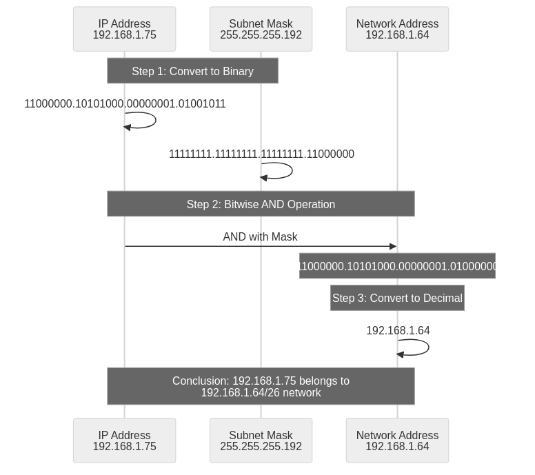
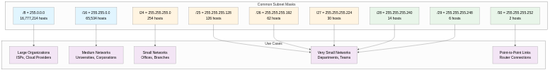

## 서브넷 마스크의 등장 배경과 역사

서브넷 마스크(Subnet Mask)는 1985년 RFC 950을 통해 TCP/IP 프로토콜 스택에 공식 도입되었다. 이는 초기 인터넷의 클래스 기반 주소 체계(Classful Addressing)가 안고 있던 비효율성을 해결하기 위한 기술이었다.

1980년대 초반 인터넷은 A, B, C 클래스 체계를 사용했다. Class A는 첫 바이트(1-126)로 식별되며 약 1,600만 개의 호스트를 지원했고, Class B는 두 번째 바이트(128-191)로 식별되며 약 65,000개의 호스트를 지원했으며, Class C는 세 번째 바이트(192-223)로 식별되어 254개의 호스트를 지원했다.

문제는 이 구조가 지나치게 경직되어 있었다는 점이다. 예를 들어 1,000대의 호스트가 필요한 조직은 Class C(254개)로는 부족해 Class B(65,534개)를 할당받아야 했고, 그 결과 64,000개 이상의 IP 주소가 낭비되었다. 반대로 300대의 호스트가 필요한 조직도 Class C 전체를 통째로 고려해야 하는 등, 실제 수요에 맞춘 유연한 배분이 어려웠다.

서브넷 마스크는 이런 비효율을 줄이기 위해 등장했다. 하나의 네트워크를 여러 개의 작은 서브네트워크(서브넷)로 나누고, 네트워크 부분과 호스트 부분의 경계를 필요에 맞게 조정할 수 있게 하면서 현대적인 주소 관리의 기반을 만들었다. 이 개념은 이후 1993년 CIDR(Classless Inter-Domain Routing) 도입으로 이어지며 현대 인터넷 주소 관리의 핵심 원리로 자리잡았다.

## 서브넷 마스크의 구조와 원리

서브넷 마스크는 IP 주소와 마찬가지로 32비트(4옥텟)로 구성된다. 이 값은 연속된 1과 연속된 0으로 이루어진 이진수 패턴을 가지며, 1로 설정된 비트는 네트워크 부분(Network Portion), 0으로 설정된 비트는 호스트 부분(Host Portion)을 뜻한다. 네트워크 부분은 같은 네트워크에 속한 모든 호스트가 공통으로 가져야 하는 값이고, 호스트 부분은 각 장비마다 달라질 수 있는 값이다.

예를 들어 255.255.255.0은 이진수로 `11111111.11111111.11111111.00000000`이다. 처음 24비트가 네트워크 부분이고 마지막 8비트가 호스트 부분이므로 전체 주소는 256개(`2^8`)이며, 네트워크 주소와 브로드캐스트 주소를 제외하면 254개의 호스트를 할당할 수 있다.

255.255.255.128은 `11111111.11111111.11111111.10000000`으로 표현되며, 25비트가 네트워크 부분이고 7비트가 호스트 부분이다. 따라서 128개(`2^7`) 주소 중 126개 호스트를 사용할 수 있다. 255.255.255.192는 `11111111.11111111.11111111.11000000`이며, 26비트가 네트워크 부분이고 6비트가 호스트 부분이므로 64개(`2^6`) 주소 중 62개 호스트를 할당할 수 있다.

서브넷 마스크는 반드시 연속된 1로 시작해 연속된 0으로 끝나야 한다. 따라서 `11111111.11111111.11111111.11001100`(255.255.255.204)처럼 1과 0이 섞인 패턴은 유효하지 않다. 이 규칙은 표준 준수와 라우팅 효율성을 위해 필요하다.

## 서브넷 마스크의 AND 연산 원리

서브넷 마스크의 핵심 동작 원리는 비트 단위 AND 연산(Bitwise AND Operation)이다. IP 주소와 서브넷 마스크를 이진수로 바꾼 뒤 각 비트 위치에서 AND 연산을 수행하면 네트워크 주소를 얻을 수 있다. 이 결과를 바탕으로 두 IP 주소가 같은 네트워크에 속하는지 판단하고, 라우터는 이를 기준으로 전달 경로를 결정한다.

AND 연산의 규칙은 단순하다. 두 비트가 모두 1일 때만 결과가 1이 되고, 나머지 경우는 모두 0이 된다. 즉 `1 AND 1 = 1`, `1 AND 0 = 0`, `0 AND 1 = 0`, `0 AND 0 = 0`이다.

예를 들어 IP 주소 192.168.1.75와 서브넷 마스크 255.255.255.192(/26)을 보자. 먼저 192.168.1.75를 이진수로 바꾸면 `11000000.10101000.00000001.01001011`이고, 255.255.255.192는 `11111111.11111111.11111111.11000000`이다. 두 값을 비트 단위로 AND 연산하면 `11000000.10101000.00000001.01000000`이 되며, 이를 다시 십진수로 바꾸면 192.168.1.64가 된다.

즉 192.168.1.75는 192.168.1.64/26 네트워크에 속한다. 이 네트워크의 전체 주소 범위는 192.168.1.64부터 192.168.1.127까지이며, 네트워크 주소는 `.64`, 브로드캐스트 주소는 `.127`이다. 따라서 실제로 사용할 수 있는 호스트 주소는 `.65`부터 `.126`까지 총 62개다.

## 주요 서브넷 마스크 값과 활용 사례

### Class A 기반 서브넷 마스크

**255.0.0.0 (/8)**은 Class A의 기본 서브넷 마스크다. 8비트가 네트워크 부분이고 24비트가 호스트 부분이므로 16,777,216개(`2^24`) 주소 중 16,777,214개 호스트를 할당할 수 있다. 주로 대형 ISP(Internet Service Provider), 클라우드 서비스 제공업체(AWS, Google Cloud, Azure), 글로벌 대기업, 정부 기관처럼 매우 큰 주소 공간이 필요한 환경에서 사용된다. 대표적으로 `10.0.0.0/8`은 사설 IP 대역으로 대규모 기업 내부 네트워크에서 널리 활용된다.

이보다 더 작은 블록으로 나눌 때는 **255.128.0.0 (/9)**, **255.192.0.0 (/10)**, **255.224.0.0 (/11)**, **255.240.0.0 (/12)** 같은 마스크를 사용한다. 각각 8,388,606개, 4,194,302개, 2,097,150개, 1,048,574개의 호스트를 지원하며, 대규모 조직이 지역이나 부서별로 IP 블록을 나눌 때 유용하다.

### Class B 기반 서브넷 마스크

**255.255.0.0 (/16)**은 Class B의 기본 서브넷 마스크다. 16비트 네트워크 부분과 16비트 호스트 부분으로 구성되며, 65,536개(`2^16`) 주소 중 65,534개 호스트를 사용할 수 있다. 주로 중대형 대학, 기업 본사, 데이터센터, 정부 부처 등에서 사용된다. 예를 들어 `172.16.0.0/16`은 사설 IP 대역으로 기업 내부 네트워크에 자주 쓰인다.

규모를 더 세분화해야 할 때는 **255.255.128.0 (/17)**, **255.255.192.0 (/18)**, **255.255.224.0 (/19)**, **255.255.240.0 (/20)**, **255.255.248.0 (/21)**, **255.255.252.0 (/22)**, **255.255.254.0 (/23)**을 사용할 수 있다. 각각 32,766개, 16,382개, 8,190개, 4,094개, 2,046개, 1,022개, 510개의 호스트를 지원하며, VLSM(Variable Length Subnet Mask)을 이용해 실제 요구 수량에 맞춰 주소를 배분할 때 적합하다.

### Class C 기반 서브넷 마스크

**255.255.255.0 (/24)**는 Class C의 기본 서브넷 마스크다. 24비트 네트워크 부분과 8비트 호스트 부분을 가지며, 256개(`2^8`) 주소 중 254개 호스트를 사용할 수 있다. 소규모 사무실, 지사, 부서, 가정 네트워크에서 가장 흔히 사용되며, `192.168.1.0/24`는 가정용 공유기의 기본 설정 예시로 널리 알려져 있다.

더 작은 서브넷이 필요할 때는 **255.255.255.128 (/25)**, **255.255.255.192 (/26)**, **255.255.255.224 (/27)**, **255.255.255.240 (/28)**, **255.255.255.248 (/29)**, **255.255.255.252 (/30)**을 사용한다. 이들은 각각 126개, 62개, 30개, 14개, 6개, 2개의 호스트를 지원한다. /24 네트워크를 여러 개로 쪼개는 데 자주 쓰이며, 특히 **/30**은 라우터 간 Point-to-Point 연결(WAN 링크, BGP 피어링)에 많이 사용된다.

## 서브넷 마스크와 CIDR 표기법의 관계

1993년 CIDR(Classless Inter-Domain Routing)이 도입되면서 서브넷 마스크는 슬래시 표기법(Slash Notation)으로도 널리 표현되기 시작했다. 이 방식은 32비트 중 네트워크 비트의 개수를 `/n` 형식으로 간단히 나타내며, 가독성과 설정 편의성을 크게 높였다.

CIDR 표기법과 서브넷 마스크는 일대일로 대응된다. 예를 들어 `/8`은 255.0.0.0, `/16`은 255.255.0.0, `/24`는 255.255.255.0, `/25`는 255.255.255.128, `/26`은 255.255.255.192, `/27`은 255.255.255.224, `/28`은 255.255.255.240, `/29`는 255.255.255.248, `/30`은 255.255.255.252에 해당한다.

CIDR 표기법의 장점은 명확하다. `192.168.1.0 255.255.255.0` 대신 `192.168.1.0/24`처럼 더 간결하게 표현할 수 있고, `/24`를 보면 바로 8비트 호스트 영역, 즉 `2^8 = 256`개 주소를 떠올릴 수 있다. 또한 국제 표준으로 널리 채택되어 네트워크 설정, 라우팅 테이블, 문서화에서 일관되게 사용되며, VLSM과 라우트 집약도 자연스럽게 지원한다.

## 서브넷 마스크 계산 실습

### 호스트 수로부터 서브넷 마스크 계산

필요한 호스트 수가 주어졌을 때 적절한 서브넷 마스크를 계산하는 방법은 다음과 같다. 먼저 필요한 호스트 수에 2를 더한다. 이는 네트워크 주소와 브로드캐스트 주소를 예약해야 하기 때문이다. 그다음 이 값 이상이 되는 가장 작은 2의 거듭제곱을 찾고, 그 지수를 호스트 비트 수로 본다. 마지막으로 32에서 호스트 비트 수를 빼면 네트워크 비트 수, 즉 CIDR 접두사가 된다.

예를 들어 50개 호스트가 필요하면 `50 + 2 = 52`이고, 이 값을 수용하는 가장 작은 2의 거듭제곱은 `2^6 = 64`이다. 따라서 호스트 비트는 6비트이고, `32 - 6 = 26`이므로 `/26`(255.255.255.192)이 필요하다. 실제 사용 가능한 호스트 수는 62개다.

100개 호스트가 필요한 경우에는 `100 + 2 = 102`이므로 `2^7 = 128`이 필요하고, 호스트 비트는 7비트가 된다. 따라서 `/25`(255.255.255.128)가 적절하며 126개 호스트를 사용할 수 있다. 500개 호스트가 필요한 경우에는 `500 + 2 = 502`이므로 `2^9 = 512`가 필요하고, 호스트 비트는 9비트이므로 `/23`(255.255.254.0)을 사용해 510개 호스트를 확보할 수 있다.

### 서브넷 분할 계산

`192.168.1.0/24` 네트워크를 4개의 동일한 크기 서브넷으로 나누는 과정을 보자. 4개 서브넷을 만들려면 추가로 2비트가 필요하다. `2^2 = 4`이기 때문이다. 따라서 원래의 `/24`에 2를 더해 `/26`을 사용하면 된다.

`/26`의 서브넷 마스크는 255.255.255.192이고, 각 서브넷은 64개 주소를 가진다. 이 중 실제로 사용할 수 있는 호스트는 62개다.

분할 결과는 다음과 같다. 첫 번째 서브넷은 `192.168.1.0/26`으로 `192.168.1.0 ~ 192.168.1.63` 범위를 가지며 사용 가능한 호스트는 `.1 ~ .62`이다. 두 번째는 `192.168.1.64/26`으로 `.65 ~ .126`을 사용할 수 있다. 세 번째는 `192.168.1.128/26`으로 `.129 ~ .190`, 네 번째는 `192.168.1.192/26`으로 `.193 ~ .254`를 사용할 수 있다.

### 두 IP가 동일 네트워크인지 확인

192.168.1.75와 192.168.1.130이 서브넷 마스크 255.255.255.192(/26) 환경에서 같은 네트워크에 속하는지 확인해 보자. 먼저 `192.168.1.75 AND 255.255.255.192`를 수행하면 192.168.1.64가 나오고, `192.168.1.130 AND 255.255.255.192`를 수행하면 192.168.1.128이 나온다.

두 결과가 다르므로 `192.168.1.64 ≠ 192.168.1.128`, 두 IP는 서로 다른 네트워크에 속한다. 따라서 직접 통신할 수 없고 라우터를 거쳐야 한다.

## 서브넷 마스크의 실제 활용

### 기업 네트워크 설계

중소기업이 `192.168.0.0/16` 사설 IP 블록을 할당받아 VLSM으로 네트워크를 설계한다고 가정해 보자. 본사 직원 200명에게는 `192.168.0.0/24`(254개 호스트)를 할당하고, 지사 A 직원 50명에게는 `192.168.1.0/26`(62개 호스트)를 배정할 수 있다. 지사 B 직원 30명에게는 `192.168.1.64/27`(30개 호스트), 서버팜 20대에는 `192.168.1.96/27`(30개 호스트), DMZ 웹 서버 5대에는 `192.168.1.128/29`(6개 호스트)를 할당할 수 있다. 라우터 간 Point-to-Point 링크에는 `192.168.1.136/30`, `192.168.1.140/30`처럼 각 2개 호스트를 갖는 대역을 사용할 수 있으며, 나머지 주소 공간은 향후 확장을 위해 예약해 둘 수 있다.

### 클라우드 환경(AWS VPC)

AWS VPC를 `10.0.0.0/16`으로 생성한 뒤 서브넷 마스크를 활용해 구조화하는 예도 흔하다. 퍼블릭 서브넷 A는 `10.0.1.0/24`로 구성해 웹 서버와 로드 밸런서를 배치하고, 퍼블릭 서브넷 B는 `10.0.2.0/24`로 구성해 다른 가용 영역에 같은 역할을 배치할 수 있다. 프라이빗 서브넷 A와 B는 각각 `10.0.10.0/24`, `10.0.11.0/24`로 두어 애플리케이션 서버를 나눠 배치하고, 데이터베이스 서브넷은 `10.0.20.0/24`, `10.0.21.0/24`처럼 별도 영역으로 분리할 수 있다. 나머지 주소 공간인 `10.0.30.0/24 ~ 10.0.255.0/24`는 이후 서비스 확장을 위해 남겨둘 수 있다.

### 홈 네트워크

가정용 공유기에서는 보통 `192.168.1.0/24`(255.255.255.0) 네트워크를 사용한다. 공유기 게이트웨이는 `192.168.1.1`을 쓰고, DHCP 범위는 `192.168.1.100 ~ 192.168.1.200`으로 설정하는 경우가 많다. 서버, NAS, 프린터처럼 고정 IP가 필요한 장비에는 `192.168.1.10 ~ 192.168.1.50`을 할당하고, `192.168.1.201 ~ 192.168.1.254`는 예비 주소로 남겨둘 수 있다. 이런 구성만으로도 일반 가정에서는 충분한 규모의 네트워크를 운영할 수 있다.

## 서브넷 마스크 관련 트러블슈팅

### 잘못된 서브넷 마스크 설정

호스트에 잘못된 서브넷 마스크를 설정하면 네트워크 통신 장애가 발생한다. 예를 들어 실제 네트워크가 `192.168.1.0/24`인데 호스트에 255.255.255.0 대신 255.255.0.0(`/16`)을 설정하면, 해당 호스트는 `192.168.0.0 ~ 192.168.255.255` 전체를 로컬 네트워크로 인식한다. 그 결과 `192.168.2.10`과 통신할 때 라우터를 거치지 않고 직접 ARP 요청을 보내게 되지만, 실제로는 다른 네트워크이므로 응답을 받지 못해 통신이 실패한다.

이때 나타나는 증상은 비교적 분명하다. 동일 서브넷 내 통신은 정상인데 다른 서브넷과의 통신이 실패하고, ARP 테이블에는 불필요한 항목이 과도하게 쌓이며, 브로드캐스트 트래픽 증가로 네트워크 성능이 저하될 수 있다.

해결 방법은 호스트의 서브넷 마스크를 올바른 값으로 수정하는 것이다. Windows에서는 `ncpa.cpl`에서 어댑터 속성을 확인하고, Linux에서는 `/etc/netplan/` 또는 `nmcli` 설정을 점검하면 된다. 함께 DHCP 서버가 올바른 서브넷 마스크를 배포하는지 확인하고, 라우터와 스위치 설정에서 VLAN과 서브넷 구성이 일치하는지도 점검해야 한다.

### 서브넷 불일치로 인한 통신 실패

같은 물리적 네트워크에 서로 다른 서브넷 마스크를 사용하는 호스트가 섞여 있으면 통신 문제가 발생할 수 있다. 예를 들어 호스트 A는 `192.168.1.10/24`(255.255.255.0)이고 호스트 B는 `192.168.1.20/26`(255.255.255.192)라고 하자. 호스트 A는 `192.168.1.0 ~ 192.168.1.255`를 로컬 네트워크로 인식하지만, 호스트 B는 `192.168.1.0 ~ 192.168.1.63`만 로컬로 인식한다. 이렇게 네트워크 범위를 다르게 해석하면 통신 경로 판단이 엇갈려 문제가 생길 수 있다.

예를 들어 호스트 A는 호스트 B로 가는 패킷을 직접 ARP로 전송하지만, 반대 방향에서는 게이트웨이를 거치려 하거나 로컬 통신으로 처리하려는 판단이 서로 다를 수 있다. 이런 불일치는 통신 불안정으로 이어진다.

해결하려면 모든 호스트가 동일한 서브넷 마스크를 사용하도록 표준화해야 한다. DHCP를 이용해 일관된 설정을 자동 배포하고, 네트워크 문서화를 통해 서브넷 할당 계획을 명확히 관리하며, 정기적인 네트워크 감사를 통해 불일치를 조기에 발견하는 것이 좋다.

### 서브넷 경계 위반

서브넷을 나눌 때 경계가 2의 거듭제곱 단위로 정렬되지 않으면 라우팅 문제가 생긴다. 예를 들어 `192.168.1.50/26`을 서브넷 시작 주소로 설정하면 `/26`의 블록 크기는 64이므로 0, 64, 128, 192에서 시작해야 한다는 규칙에 어긋난다. 즉 50은 유효한 시작 주소가 아니다.

이 경우 라우터는 해당 서브넷을 올바르게 인식하지 못하고 라우팅 테이블에 추가할 수 없으며, 결과적으로 네트워크 통신이 완전히 실패할 수 있다.

해결 방법은 서브넷 시작 주소가 서브넷 크기의 배수인지 확인하는 것이다. 예를 들어 `/26`은 0, 64, 128, 192에서만 시작할 수 있다. 필요하다면 온라인 서브넷 계산기로 유효성을 검증하고, 설계 단계에서부터 서브넷 할당 계획을 문서화하며, 라우터 설정 후 라우팅 테이블에 올바르게 등록되었는지 확인해야 한다.

## 서브넷 마스크의 장점과 한계

### 장점

서브넷 마스크의 가장 큰 장점은 IP 주소를 훨씬 유연하게 할당할 수 있다는 점이다. 클래스 기반 체계의 경직성을 줄이고, 필요한 호스트 수에 맞춰 더 정확하게 주소를 배분할 수 있다. 예를 들어 100개 호스트가 필요하다면 `/25`를 사용해 126개를 확보함으로써 낭비를 줄일 수 있다. VLSM을 활용하면 하나의 네트워크 안에서도 서로 다른 크기의 서브넷을 함께 운영할 수 있다.

보안과 성능 측면에서도 이점이 크다. 서브넷을 분리하면 브로드캐스트 도메인이 작아져 브로드캐스트 스톰을 줄이고 네트워크 성능을 높일 수 있다. 또한 부서별, 기능별로 네트워크를 나누어 방화벽 규칙과 접근 제어를 적용하기 쉬워지며, 침해가 발생했을 때 영향 범위를 특정 서브넷으로 제한하는 데도 도움이 된다.

라우팅 효율성과 관리 편의성 역시 개선된다. 라우터는 서브넷 마스크를 이용해 네트워크 주소를 빠르게 계산하고 경로를 결정할 수 있으며, 계층적인 구조를 만들면 라우팅 테이블 크기도 줄일 수 있다. 운영 측면에서는 조직 구조나 지리적 위치에 맞춰 네트워크를 논리적으로 나눌 수 있고, 장애가 발생했을 때 문제 구간을 더 쉽게 격리하고 진단할 수 있다.

### 한계

반면 서브넷 마스크는 관리 복잡성을 높이기도 한다. 이진수 연산과 비트 계산에 대한 이해가 필요하고, 서브넷 분할 과정에서 실수가 발생하기 쉽다. 특히 VLSM 환경에서는 여러 크기의 서브넷이 함께 존재하므로 설계와 운영이 더 까다로워진다.

설정 오류의 영향도 크다. 서브넷 마스크를 잘못 지정하면 네트워크 통신이 완전히 실패하거나 일부만 동작할 수 있어 원인 파악이 어렵다. 서브넷 경계를 잘못 잡으면 라우팅 문제가 발생하고, 장비마다 서로 다른 마스크를 사용하면 비대칭적인 통신 문제가 생길 수 있다.

또한 서브넷 마스크는 IPv4 주소 고갈 문제를 근본적으로 해결하는 기술은 아니다. 주소 활용 효율을 높여 줄 뿐, 32비트 주소 공간 자체의 한계는 그대로 남아 있다. 궁극적인 해법은 IPv6(128비트 주소 공간)로의 전환이지만, IPv4와 IPv6가 공존하는 현재 환경에서는 여전히 중요한 역할을 한다.

호환성 문제도 무시할 수 없다. 일부 오래된 네트워크 장비는 CIDR과 VLSM을 지원하지 않으며, 일부 레거시 애플리케이션은 클래스 기반 주소 체계를 전제로 동작한다. 서로 다른 벤더의 장비를 함께 쓸 때는 서브넷 마스크 표기와 해석 차이도 주의해야 한다.

## 결론

서브넷 마스크는 클래스 기반 주소 체계의 비효율을 줄이고, IPv4 네트워크를 더 유연하고 체계적으로 설계할 수 있게 만든 핵심 기술이다. 비트 단위 AND 연산으로 네트워크 주소를 계산하는 원리는 오늘날 라우팅과 주소 관리의 기본이 되었으며, CIDR과 VLSM의 도입으로 그 활용 범위는 더욱 넓어졌다.

서브넷 마스크를 제대로 이해하면 필요한 호스트 수에 맞는 주소 계획을 세울 수 있고, 통신 장애의 원인도 더 빠르게 파악할 수 있다. IPv6 전환이 진행 중인 지금도 IPv4 환경은 널리 사용되고 있으므로, 서브넷 마스크는 앞으로도 실무 네트워크 운영에서 중요한 개념으로 남을 것이다.
