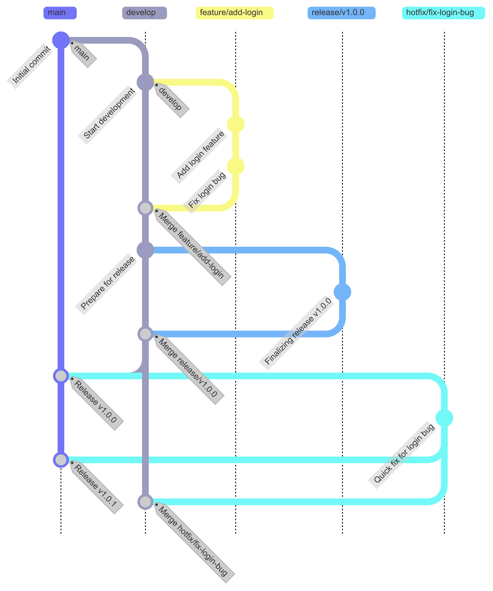
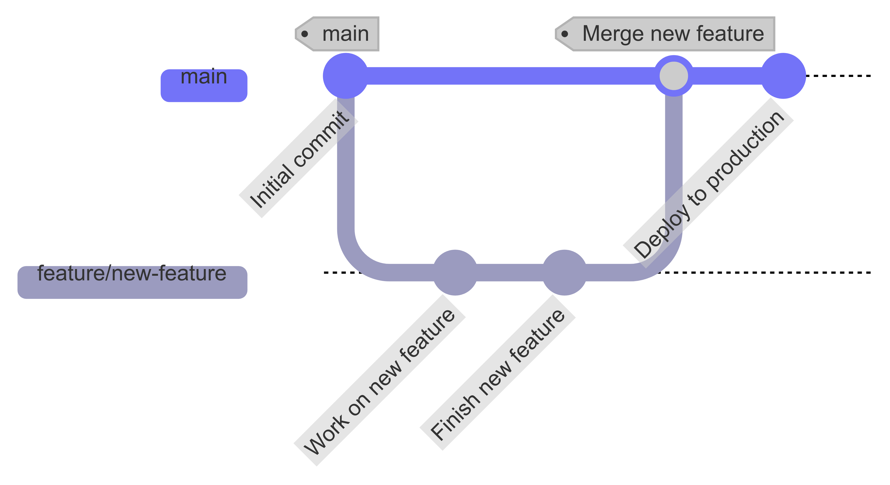

## History and Background of Branching Strategies

The systematization of Git branching strategies began on January 5, 2010, when Dutch developer Vincent Driessen published his blog post "A successful Git branching model." The Git Flow introduced in this article resonated strongly in software development environments that required systematic release management at the time. In 2011, GitHub's Scott Chacon proposed a simpler model called GitHub Flow. Then in 2014, GitLab announced GitLab Flow, combining the advantages of both strategies. All three strategies continue to be widely used today depending on project characteristics.

The background for why branching strategies became important lies in the increasing complexity of software development. The need to maintain stable releases while multiple developers work simultaneously, the situation of having to handle emergency bug fixes alongside new feature development, and the spread of Continuous Integration/Continuous Deployment (CI/CD) established systematic branch management as an essential element.

## Git Flow: Systematic Release Management

### Background and Design Philosophy

Git Flow was conceived by Vincent Driessen to solve the release management difficulties he experienced at the company where he worked. It was designed to systematize version management and enable simultaneous maintenance of multiple versions for software with clear release cycles such as desktop applications, mobile apps, and libraries.

### Roles of the 5 Branches

Git Flow uses five types of branches, each with a clear purpose and lifecycle.

| Branch | Lifespan | Purpose | Branch From | Merge To |
|--------|----------|---------|-------------|----------|
| main (master) | Permanent | Production releases | - | - |
| develop | Permanent | Development integration | main | - |
| feature/* | Temporary | Feature development | develop | develop |
| release/* | Temporary | Release preparation | develop | main, develop |
| hotfix/* | Temporary | Emergency fixes | main | main, develop |

The **main branch** contains only production-deployed code with version tags (v1.0.0, v1.1.0) on each commit. The **develop branch** is the integration branch for all features for the next release and serves as the merge target for feature branches.

**Feature branches** are created from develop for new feature development and merged back into develop after completion. The naming convention follows the `feature/feature-name` format.

**Release branches** are created from develop when release preparation is complete. They handle only release-necessary work such as bug fixes, documentation, and version number updates, then merge into both main and develop after completion.

**Hotfix branches** branch directly from main to fix urgent bugs discovered in production. After the fix is complete, they merge into both main and develop so the fix is reflected in the next release as well.

### Workflow



A typical Git Flow workflow proceeds as follows.

```bash
# 1. Create feature branch and develop
git checkout develop
git checkout -b feature/user-authentication

# Commit after development work
git commit -m "feat: implement user login"

# 2. Merge feature into develop
git checkout develop
git merge --no-ff feature/user-authentication
git branch -d feature/user-authentication

# 3. Prepare release
git checkout -b release/v1.2.0

# After bug fixes and version number update
git commit -m "chore: bump version to 1.2.0"

# 4. Complete release
git checkout main
git merge --no-ff release/v1.2.0
git tag -a v1.2.0 -m "Release version 1.2.0"

git checkout develop
git merge --no-ff release/v1.2.0
git branch -d release/v1.2.0

# 5. Emergency fix (if needed)
git checkout main
git checkout -b hotfix/v1.2.1

# After bug fix
git checkout main
git merge --no-ff hotfix/v1.2.1
git tag -a v1.2.1

git checkout develop
git merge --no-ff hotfix/v1.2.1
git branch -d hotfix/v1.2.1
```

### Advantages and Disadvantages

The advantages of Git Flow include clear release management where version history remains on the main branch with tags for easy tracking, the ability to maintain multiple versions simultaneously, the develop branch protecting main to ensure production stability, and clear role division in large teams.

Disadvantages include high complexity due to many branches and a steep learning curve, time spent on conflict resolution due to frequent merging, unsuitability for Continuous Deployment (CD) environments, and the fact that Vincent Driessen himself noted in 2020 that "GitHub Flow may be more suitable for web apps."

## GitHub Flow: Simplicity and Continuous Deployment

### Background

GitHub Flow was proposed in 2011 by GitHub's Scott Chacon as a simple model optimized for continuous deployment environments while reducing Git Flow's complexity. It organizes the workflow that was being used for GitHub's own development and is suitable for projects that need to maintain a constantly deployable state like web applications.

### Core Principles

The core principles of GitHub Flow can be summarized in three points.

1. **The main branch is always deployable**: Code merged to main should be immediately deployable to production.
2. **All work happens in feature branches**: Whether bug fixes or new features, work is done in branches created from main.
3. **Code review through Pull Requests**: PRs must be created and reviewed by team members before merging.

### Workflow



```bash
# 1. Create feature branch from main
git checkout main
git pull origin main
git checkout -b feature/add-search

# 2. Develop and commit
git commit -m "feat: add search functionality"
git push origin feature/add-search

# 3. Create Pull Request (on GitHub web)
# Team review, discussion, modifications

# 4. Merge to main after review passes
# Click "Merge pull request" on GitHub

# 5. Automatic or manual deployment after merge
```

### Advantages and Disadvantages

Advantages include that there are only two types of branches (main and feature) making it easy to understand, Pull Request-based code review happens naturally, integration with CI/CD pipelines is simple, and fast feedback and deployment are possible.

Disadvantages include difficulty maintaining multiple versions simultaneously, insufficiency for projects requiring release management, and the necessity of strong automated testing for main to always remain in a deployable state.

## GitLab Flow: Environment-Based Branching Strategy

### Background

GitLab Flow was proposed in 2014 by GitLab as a balance point between Git Flow's structure and GitHub Flow's simplicity. It supports both continuous deployment and release management by introducing environment branches (production, staging).

### Branch Structure

GitLab Flow has two variants.

The **environment branch approach** has code flowing in the order main (development) to staging (testing) to production (deployment), with automatic deployment to each environment when merged to its branch.

The **release branch approach** maintains version-specific release branches (release/1.0, release/2.0), suitable for libraries or packages that need to support multiple versions simultaneously.

```bash
# Environment branch approach example
git checkout main
git checkout -b feature/new-feature

# Merge to main after development complete (development environment deployment)
git checkout main
git merge feature/new-feature

# Merge to staging when test-ready
git checkout staging
git merge main

# When production deployment ready
git checkout production
git merge staging
```

## Strategy Selection Guide

The criteria for selecting a branching strategy based on project characteristics are as follows.

| Criteria | Git Flow | GitHub Flow | GitLab Flow |
|----------|----------|-------------|-------------|
| Release Cycle | Regular (monthly/quarterly) | Continuous (daily/weekly) | Middle |
| Project Scale | Large | Small to Medium | Medium to Large |
| Version Maintenance | Multiple simultaneous | Single version | Selective |
| Team Size | 10+ | 5 or fewer | 5-15 |
| Deployment Environment | Single | Single | Multiple (staging/prod) |
| Suitable Projects | Mobile apps, libraries | SaaS, internal tools | Web services |

**Cases to choose Git Flow** include software requiring clear version numbers (v1.0, v2.0), libraries needing to support multiple versions simultaneously, mobile apps requiring app store review, and organizations with strict QA processes.

**Cases to choose GitHub Flow** include web applications requiring continuous deployment, startups where fast feedback and iteration are important, organizations with established DevOps culture, and teams with automated testing and deployment pipelines.

**Cases to choose GitLab Flow** include projects where staging environment validation is mandatory, cases where environment-specific deployment management is needed but Git Flow is excessive, and organizations needing both fast deployment and release management.

## Conclusion

Git branching strategies began their systematization with Vincent Driessen's Git Flow in 2010 and evolved to GitHub Flow (2011) and GitLab Flow (2014). Each strategy suits different situations depending on release cycle, project scale, and deployment environment. Git Flow excels at systematic release management, GitHub Flow at continuous deployment, and GitLab Flow at environment-specific deployment management. What matters is selecting a strategy that the entire team can understand and follow consistently, and adjusting it flexibly as needed.
