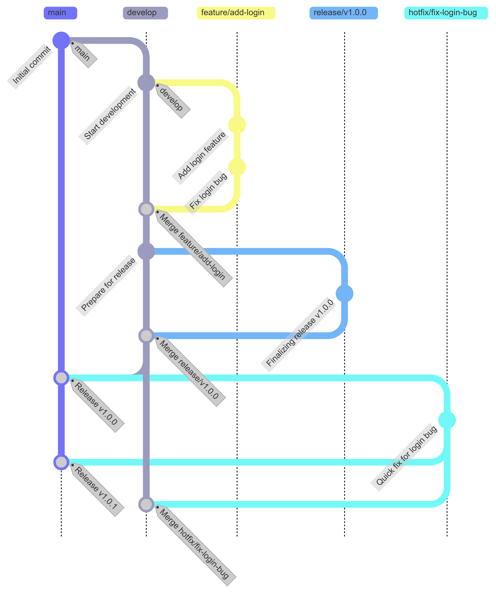

## 브랜치 전략의 역사와 배경

Git 브랜치 전략의 체계화는 2010년 1월 5일 네덜란드 개발자 Vincent Driessen이 "A successful Git branching model"이라는 블로그 포스트를 발표하면서 시작되었으며, 이 글에서 소개된 Git Flow는 당시 체계적인 릴리스 관리가 필요했던 소프트웨어 개발 환경에서 큰 반향을 일으켰고, 이후 2011년 GitHub의 Scott Chacon이 더 단순한 모델인 GitHub Flow를 제안했으며, 2014년에는 GitLab이 두 전략의 장점을 결합한 GitLab Flow를 발표하여 현재까지 세 가지 전략이 프로젝트 특성에 따라 널리 사용되고 있다.

브랜치 전략이 중요해진 배경에는 소프트웨어 개발의 복잡성 증가가 있으며, 여러 개발자가 동시에 작업하면서도 안정적인 릴리스를 유지해야 하는 요구사항, 긴급 버그 수정과 새 기능 개발을 병행해야 하는 상황, 그리고 지속적 통합/배포(CI/CD)의 확산으로 인해 체계적인 브랜치 관리가 필수적인 요소로 자리 잡았다.

## Git Flow: 체계적인 릴리스 관리

### 등장 배경과 설계 철학

Git Flow는 Vincent Driessen이 당시 근무하던 회사에서 겪었던 릴리스 관리의 어려움을 해결하기 위해 고안되었으며, 명확한 릴리스 주기를 가진 소프트웨어(데스크톱 애플리케이션, 모바일 앱, 라이브러리)에서 버전 관리를 체계화하고 여러 버전을 동시에 유지보수할 수 있도록 설계되었다.

### 5개 브랜치의 역할

Git Flow는 다섯 가지 브랜치 유형을 사용하며, 각 브랜치는 명확한 목적과 수명 주기를 가진다.

| 브랜치 | 수명 | 목적 | 분기 원본 | 병합 대상 |
|--------|------|------|-----------|-----------|
| main (master) | 영구 | 프로덕션 릴리스 | - | - |
| develop | 영구 | 개발 통합 | main | - |
| feature/* | 임시 | 기능 개발 | develop | develop |
| release/* | 임시 | 릴리스 준비 | develop | main, develop |
| hotfix/* | 임시 | 긴급 수정 | main | main, develop |

**main 브랜치**는 프로덕션에 배포된 코드만 존재하며 각 커밋에 버전 태그(v1.0.0, v1.1.0)가 붙고, **develop 브랜치**는 다음 릴리스를 위한 모든 기능이 통합되는 브랜치로서 feature 브랜치의 병합 대상이 된다.

**feature 브랜치**는 새로운 기능 개발을 위해 develop에서 분기하여 개발 완료 후 다시 develop으로 병합되며, 네이밍 규칙은 `feature/기능명` 형식을 따른다.

**release 브랜치**는 릴리스 준비가 완료되면 develop에서 분기하여 버그 수정, 문서 작업, 버전 번호 업데이트 등 릴리스에 필요한 작업만 수행하고 완료 후 main과 develop 양쪽에 병합된다.

**hotfix 브랜치**는 프로덕션에서 발견된 긴급 버그를 수정하기 위해 main에서 직접 분기하며, 수정 완료 후 main과 develop 양쪽에 병합되어 다음 릴리스에도 수정 사항이 반영된다.

### 워크플로우



Git Flow의 전형적인 워크플로우는 다음과 같이 진행된다.

```bash
# 1. feature 브랜치 생성 및 개발
git checkout develop
git checkout -b feature/user-authentication

# 개발 작업 후 커밋
git commit -m "feat: implement user login"

# 2. feature를 develop에 병합
git checkout develop
git merge --no-ff feature/user-authentication
git branch -d feature/user-authentication

# 3. 릴리스 준비
git checkout -b release/v1.2.0

# 버그 수정, 버전 번호 업데이트 후
git commit -m "chore: bump version to 1.2.0"

# 4. 릴리스 완료
git checkout main
git merge --no-ff release/v1.2.0
git tag -a v1.2.0 -m "Release version 1.2.0"

git checkout develop
git merge --no-ff release/v1.2.0
git branch -d release/v1.2.0

# 5. 긴급 수정 (필요시)
git checkout main
git checkout -b hotfix/v1.2.1

# 버그 수정 후
git checkout main
git merge --no-ff hotfix/v1.2.1
git tag -a v1.2.1

git checkout develop
git merge --no-ff hotfix/v1.2.1
git branch -d hotfix/v1.2.1
```

### 장점과 단점

Git Flow의 장점은 명확한 릴리스 관리로 버전별 이력이 태그와 함께 main 브랜치에 남아 추적이 용이하고, 여러 버전의 동시 유지보수가 가능하며, develop 브랜치가 main을 보호하여 프로덕션 안정성을 확보할 수 있고, 대규모 팀에서 역할 분담이 명확해진다는 점이다.

단점으로는 브랜치가 많아 복잡도가 높고 학습 곡선이 가파르며, 병합이 빈번하여 충돌 해결에 시간이 소요되고, 지속적 배포(CD) 환경에는 부적합하며, 2020년 Vincent Driessen 본인도 "웹 앱에는 GitHub Flow가 더 적합할 수 있다"고 언급했다.

## GitHub Flow: 단순함과 지속적 배포

### 등장 배경

GitHub Flow는 2011년 GitHub의 Scott Chacon이 Git Flow의 복잡성을 줄이고 지속적 배포 환경에 최적화된 단순한 모델로 제안했으며, GitHub 자체 개발에 사용되던 워크플로우를 정리한 것으로 웹 애플리케이션처럼 항상 배포 가능한 상태를 유지해야 하는 프로젝트에 적합하다.

### 핵심 원칙

GitHub Flow의 핵심 원칙은 세 가지로 요약된다.

1. **main 브랜치는 항상 배포 가능한 상태**: main에 머지된 코드는 즉시 프로덕션에 배포할 수 있어야 한다.
2. **모든 작업은 feature 브랜치에서**: 버그 수정이든 새 기능이든 main에서 분기한 브랜치에서 작업한다.
3. **Pull Request를 통한 코드 리뷰**: 병합 전 반드시 PR을 생성하고 팀원의 리뷰를 받는다.

### 워크플로우


```bash
# 1. main에서 feature 브랜치 생성
git checkout main
git pull origin main
git checkout -b feature/add-search

# 2. 개발 및 커밋
git commit -m "feat: add search functionality"
git push origin feature/add-search

# 3. Pull Request 생성 (GitHub 웹에서)
# 팀원 리뷰, 토론, 수정

# 4. 리뷰 통과 후 main에 병합
# GitHub에서 "Merge pull request" 클릭

# 5. 병합 후 자동 또는 수동 배포
```

### 장점과 단점

장점으로는 브랜치가 main과 feature 두 종류뿐이라 이해하기 쉽고, Pull Request 기반 코드 리뷰가 자연스럽게 이루어지며, CI/CD 파이프라인과의 통합이 간단하고, 빠른 피드백과 배포가 가능하다.

단점으로는 여러 버전을 동시에 유지보수하기 어렵고, 릴리스 관리가 필요한 프로젝트에는 부족하며, main이 항상 배포 가능한 상태를 유지하려면 강력한 자동화 테스트가 필수적이다.

## GitLab Flow: 환경 기반 브랜치 전략

### 등장 배경

GitLab Flow는 2014년 GitLab이 Git Flow의 체계성과 GitHub Flow의 단순함 사이의 균형점으로 제안했으며, 환경별 브랜치(production, staging)를 도입하여 지속적 배포와 릴리스 관리를 동시에 지원한다.

### 브랜치 구조

GitLab Flow는 두 가지 변형이 있다.

**환경 브랜치 방식**은 main(개발) → staging(테스트) → production(배포) 순서로 코드가 흘러가며, 각 환경 브랜치에 머지되면 해당 환경에 자동 배포된다.

**릴리스 브랜치 방식**은 버전별 릴리스 브랜치(release/1.0, release/2.0)를 유지하여 여러 버전을 동시에 지원해야 하는 라이브러리나 패키지에 적합하다.

```bash
# 환경 브랜치 방식 예시
git checkout main
git checkout -b feature/new-feature

# 개발 완료 후 main에 머지 (개발 환경 배포)
git checkout main
git merge feature/new-feature

# 테스트 준비 완료 시 staging에 머지
git checkout staging
git merge main

# 프로덕션 배포 준비 완료 시
git checkout production
git merge staging
```

## 전략 선택 가이드

프로젝트 특성에 따른 브랜치 전략 선택 기준은 다음과 같다.

| 기준 | Git Flow | GitHub Flow | GitLab Flow |
|------|----------|-------------|-------------|
| 릴리스 주기 | 정기적 (월/분기) | 지속적 (일/주) | 중간 |
| 프로젝트 규모 | 대규모 | 소규모~중규모 | 중규모~대규모 |
| 버전 유지보수 | 여러 버전 동시 | 단일 버전 | 선택적 |
| 팀 규모 | 10명 이상 | 5명 이하 | 5~15명 |
| 배포 환경 | 단일 | 단일 | 다중 (staging/prod) |
| 적합한 프로젝트 | 모바일 앱, 라이브러리 | SaaS, 내부 도구 | 웹 서비스 |

**Git Flow를 선택해야 하는 경우**는 명확한 버전 번호가 필요한 소프트웨어(v1.0, v2.0), 여러 버전을 동시에 지원해야 하는 라이브러리, 앱스토어 심사가 필요한 모바일 앱, 엄격한 QA 프로세스가 있는 조직이다.

**GitHub Flow를 선택해야 하는 경우**는 지속적 배포가 필요한 웹 애플리케이션, 빠른 피드백과 반복이 중요한 스타트업, DevOps 문화가 정착된 조직, 자동화된 테스트와 배포 파이프라인을 갖춘 팀이다.

**GitLab Flow를 선택해야 하는 경우**는 staging 환경에서의 검증이 필수인 프로젝트, 환경별 배포 관리가 필요하지만 Git Flow는 과도한 경우, 빠른 배포와 릴리스 관리가 동시에 필요한 조직이다.

## 결론

Git 브랜치 전략은 2010년 Vincent Driessen의 Git Flow에서 체계화가 시작되어 GitHub Flow(2011), GitLab Flow(2014)로 발전해왔으며, 각 전략은 릴리스 주기, 프로젝트 규모, 배포 환경에 따라 적합한 상황이 다르다. Git Flow는 체계적인 릴리스 관리에, GitHub Flow는 지속적 배포에, GitLab Flow는 환경별 배포 관리에 강점이 있으며, 중요한 것은 팀 전체가 이해하고 일관되게 따를 수 있는 전략을 선택하고 필요에 따라 유연하게 조정하는 것이다.
