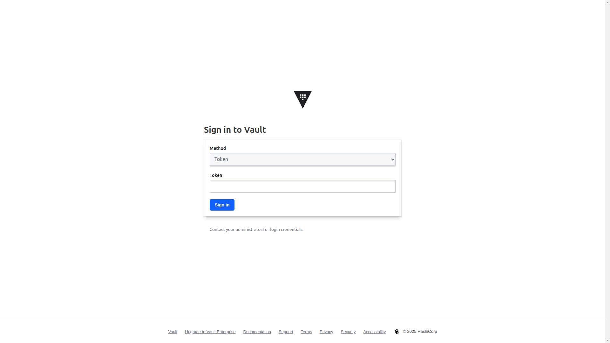
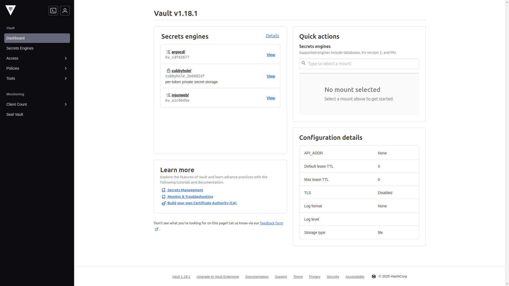

## Overview

In the [previous post](/posts/homelab-build-log-5-external-access/), we configured DDNS and port forwarding to enable external internet access to services running in the homelab Kubernetes cluster. This post covers how to install and configure HashiCorp Vault to securely manage sensitive information like passwords, API keys, and certificates in the Kubernetes cluster.


## Limitations of Default Kubernetes Secrets

Secret management was the biggest challenge while building the homelab environment using GitOps methodology. Several limitations became clear when using default Kubernetes Secrets.

First, there is the GitOps integration issue. Secrets cannot be stored directly in Git repositories, and base64 encoding is not secure because the original values can be restored with simple decoding. Tools like Sealed Secrets and SOPS were also reviewed, but a more comprehensive secret management solution was needed beyond simple encryption.

Second, there is the secret rotation problem. External API tokens and certificates require periodic renewal, but manual handling is inefficient and prone to errors. Automated secret rotation management was necessary.

> **What is HashiCorp Vault?**
>
> HashiCorp Vault is an open-source secret management tool that HashiCorp released in 2015. It stores and manages sensitive data like passwords, API keys, and certificates in a central location, and it includes features such as fine-grained access control, audit logging, automatic secret renewal, and Kubernetes integration.

HashiCorp Vault provides secret encryption, access control, and automatic renewal features along with integration with Kubernetes and GitOps workflows, making it the chosen solution to address these problems.

## Installing Vault

### 1. Preparing Directories for GitOps Configuration

Since I was managing the rest of the homelab through GitOps, Vault followed the same pattern. I started by creating the following directory structure:

```bash
mkdir -p k8s-resources/apps/vault/templates
cd k8s-resources/apps/vault
```

### 2. Helm Chart Configuration

The `Chart.yaml` file looked like this:

```yaml
apiVersion: v2
name: vault
description: HashiCorp Vault installation
type: application
version: 1.0.0
appVersion: "1.15.2"
dependencies:
    - name: vault
      version: "0.27.0"
      repository: "https://helm.releases.hashicorp.com"
```

This configuration pulls the Vault v0.27.0 chart from the official HashiCorp Helm repository.

I added the following Vault settings in `values.yaml`:

```yaml
vault:
    server:
        enabled: true

    ui:
        enabled: true
```

I considered high availability (HA), but it felt like unnecessary overhead for this homelab. I kept the setup simple, with the option to upgrade later if needed.

### 3. Ingress Configuration

For the Vault UI, I reused the Traefik ingress controller from the previous post and kept access internal-only.

`templates/ingressroute.yaml` file:

```yaml
apiVersion: traefik.io/v1alpha1
kind: IngressRoute
metadata:
    name: vault-ui
    namespace: vault
spec:
    entryPoints:
        - intweb
        - intwebsec
    routes:
        - kind: Rule
          match: Host(`vault.injunweb.com`)
          services:
              - name: vault-ui
                port: 8200
```

Setting `entryPoints` to `intweb` and `intwebsec` ensures the Vault UI is accessible only from the internal network, as external exposure of a secret management interface poses a serious security risk.

### 4. Add to Git Repository and Deploy with ArgoCD

```bash
git add .
git commit -m "Add Vault Helm chart configuration"
git push origin main
```

After that commit, ArgoCD picked up the change and deployed Vault to the cluster.

## Vault Initialization and Unsealing

After Vault installation, two important steps are required: initialization and unsealing. These steps generate the encryption keys and bring Vault into an active state, and I handled them manually rather than automating them for security reasons.

### 1. Perform Initialization

I initialized Vault manually by entering the pod and running:

```bash
kubectl -n vault exec -it vault-0 -- /bin/sh

vault operator init
```

Execution result:

```
Unseal Key 1: wO14Gu9jIfGtae33/8U3l9mFv9QERnQS/IMoA1jJZ0vF
Unseal Key 2: FfL8J4QoIP/7fRrKJ7NN/5W8zG2ODzL9MiCJV5UcQmjx
Unseal Key 3: IgNkd4APfXmJywTqh+JjWbkiVgEHBTS+wjUGy/mtQ1pL
Unseal Key 4: +3Q0TUmCtw91/TNjdg7+dIh/8tHmfkoMykMTB9BPkMKn
Unseal Key 5: tJGLuUEYjpXc+K2jjxnMZ2JW7BUQ0KVYq7pGGBhEFLvG

Initial Root Token: hvs.6xu4j8TSoFBJ3EFNpW791e0I
```

> **Warning**: These keys are examples only. In a real environment, this information should never be disclosed. Store them securely in a password manager.

### 2. Perform Unsealing

After initialization, I unsealed Vault using 3 of the 5 keys, which is the default threshold:

```bash
vault operator unseal wO14Gu9jIfGtae33/8U3l9mFv9QERnQS/IMoA1jJZ0vF
vault operator unseal FfL8J4QoIP/7fRrKJ7NN/5W8zG2ODzL9MiCJV5UcQmjx
vault operator unseal IgNkd4APfXmJywTqh+JjWbkiVgEHBTS+wjUGy/mtQ1pL
```

After entering the third key, Vault becomes active. Check the status:

```bash
vault status
```

```
Key             Value
---             -----
Seal Type       shamir
Initialized     true
Sealed          false
Total Shares    5
Threshold       3
...
```

`Sealed: false` indicates that unsealing was successful.

> **Shamir's Secret Sharing Algorithm**
>
> Vault uses Shamir's Secret Sharing algorithm to split the master key into multiple pieces. In enterprise environments, these five keys are distributed to different administrators so that Vault can only be opened with the agreement of at least three people, implementing the four-eyes principle. In a homelab, one person usually manages everything, but the same setup still provides experience with enterprise security principles.

## Accessing the Vault Web UI

Once Vault was active, I also accessed it through the web UI. On my local machine, I added the following hosts entry:

```
192.168.0.200 vault.injunweb.com
```

I then opened `http://vault.injunweb.com` in a browser and logged in with the root token from initialization.



This was the dashboard after login:



The UI felt intuitive, which made complex policy configuration and secret management tasks easier to handle.

## Basic Vault Configuration

Once installation and initialization were done, I moved on to the Kubernetes integration setup.

### 1. Kubernetes Authentication Setup

I enabled Kubernetes authentication so Pods could authenticate to Vault with service account tokens. The actual setup inside the Vault pod looked like this:

```bash
vault login hvs.6xu4j8TSoFBJ3EFNpW791e0I

vault auth enable kubernetes

vault write auth/kubernetes/config \
  kubernetes_host="https://$KUBERNETES_PORT_443_TCP_ADDR:443" \
  token_reviewer_jwt="$(cat /var/run/secrets/kubernetes.io/serviceaccount/token)" \
  kubernetes_ca_cert="$(cat /var/run/secrets/kubernetes.io/serviceaccount/ca.crt)" \
  issuer="https://kubernetes.default.svc.cluster.local"
```

This configuration enables Vault to verify the validity of Kubernetes service account tokens and process authentication requests through communication with the Kubernetes API server.

### 2. Enable KV Secret Engine

For secret storage, I enabled the KV v2 engine first:

```bash
vault secrets enable -path=secret kv-v2
```

KV version 2 provides useful features like secret versioning, soft deletion, and metadata storage, enabling secret change history tracking and recovery from accidental deletion.

### 3. Create Policy and Role

Access control in Vault starts with policies, so I created a simple application policy like this:

```bash
cat <<EOF > app-policy.hcl
path "secret/data/app/*" {
  capabilities = ["read"]
}

path "secret/metadata/app/*" {
  capabilities = ["read", "list"]
}
EOF

vault policy write app-policy app-policy.hcl
```

This policy grants read permission for all secrets under the `secret/data/app/*` path and permission to query metadata.

Then I created the matching Kubernetes auth role:

```bash
vault write auth/kubernetes/role/app \
  bound_service_account_names=app \
  bound_service_account_namespaces=default \
  policies=app-policy \
  ttl=1h
```

This configuration means that when the `app` service account in the `default` namespace authenticates to Vault, the `app-policy` policy applies and the token expires after 1 hour.

### 4. Create Sample Secret

For testing, I stored a sample secret:

```bash
vault kv put secret/app/config \
  db.username="dbuser" \
  db.password="supersecret" \
  api.key="api12345"

vault kv get secret/app/config
```

Secret verification result:

```
====== Metadata ======
Key              Value
---              -----
created_time     2025-02-26T07:45:22.123456789Z
deletion_time    n/a
destroyed        false
version          1

====== Data ======
Key            Value
---            -----
api.key        api12345
db.password    supersecret
db.username    dbuser
```

At this point, the basic secrets were stored in Vault. Next, I tried two ways of using them in Kubernetes applications.

## Installing Vault Secrets Operator

The first approach was to use the Vault Secrets Operator. It automatically synchronized Vault secrets to Kubernetes Secrets, which meant I could use Vault without changing existing application code.

### 1. Add Operator Configuration

`k8s-resources/apps/vault-secrets-operator/Chart.yaml` file:

```yaml
apiVersion: v2
name: vault-secrets-operator
description: Vault Secrets Operator installation
type: application
version: 1.0.0
appVersion: "0.4.1"
dependencies:
    - name: vault-secrets-operator
      version: "0.3.4"
      repository: "https://helm.releases.hashicorp.com"
```

`k8s-resources/apps/vault-secrets-operator/values.yaml` file:

```yaml
vault-secrets-operator:
    defaultVaultConnection:
        enabled: true
        address: "http://vault.vault.svc.cluster.local:8200"
```

This configuration provides default connection information for the Operator to access Vault within the cluster.

### 2. Create Vault Role for Operator

Access Vault to create a policy and role for the Operator:

```bash
cat <<EOF > operator-policy.hcl
path "secret/data/app/*" {
  capabilities = ["read"]
}

path "secret/metadata/app/*" {
  capabilities = ["read", "list"]
}
EOF

vault policy write operator-policy operator-policy.hcl

vault write auth/kubernetes/role/vault-secrets-operator \
  bound_service_account_names=vault-secrets-operator \
  bound_service_account_namespaces=vault-secrets-operator \
  policies=operator-policy \
  ttl=1h
```

### 3. Add to Git and Deploy

```bash
cd k8s-resources
git add apps/vault-secrets-operator
git commit -m "Add Vault Secrets Operator configuration"
git push origin main
```

Verify after deployment:

```bash
kubectl get pods -n vault-secrets-operator
```

Result:

```
NAME                                      READY   STATUS    RESTARTS   AGE
vault-secrets-operator-75bcd5b69d-x2jf9   2/2     Running   0          45s
```

## Configuring Secret Synchronization Resources

Configure settings to synchronize Vault secrets to Kubernetes Secrets through the Vault Secrets Operator.

### 1. Create VaultAuth Resource

The `VaultAuth` resource defines how to authenticate to Vault:

```yaml
apiVersion: secrets.hashicorp.com/v1beta1
kind: VaultAuth
metadata:
    name: default
    namespace: default
spec:
    method: kubernetes
    mount: kubernetes
    kubernetes:
        role: vault-secrets-operator
        serviceAccount: default
```

### 2. Create VaultStaticSecret Resource

The `VaultStaticSecret` resource specifies synchronization of a specific Vault secret to a Kubernetes Secret:

```yaml
apiVersion: secrets.hashicorp.com/v1beta1
kind: VaultStaticSecret
metadata:
    name: app-config
    namespace: default
spec:
    type: kv-v2
    mount: secret
    path: app/config
    destination:
        name: app-config
        create: true
    refreshAfter: 30s
    vaultAuthRef: default
```

The `refreshAfter: 30s` setting ensures that when secrets change in Vault, the Kubernetes Secret is automatically updated within 30 seconds, allowing the latest values to be reflected without application redeployment.

### 3. Deploy and Verify

```bash
kubectl apply -f vault-auth.yaml
kubectl apply -f static-secret.yaml
```

Verify Secret creation:

```bash
kubectl get secret app-config
```

Result:

```
NAME        TYPE     DATA   AGE
app-config  Opaque   3      15s
```

Verify secret contents:

```bash
kubectl get secret app-config -o jsonpath="{.data.db\.password}" | base64 -d
```

### 4. Test Automatic Secret Renewal

Verify that when a secret changes in Vault, the Kubernetes Secret is automatically updated:

```bash
vault kv put secret/app/config \
  db.username="dbuser" \
  db.password="newpassword" \
  api.key="newapi12345"

# Check Kubernetes Secret after 30 seconds
kubectl get secret app-config -o jsonpath="{.data.db\.password}" | base64 -d
```

If the result changes to `newpassword`, automatic renewal is working correctly.

## Installing ArgoCD Vault Plugin

The second approach I tried was the ArgoCD Vault Plugin. That kept only secret references in Git and let ArgoCD resolve the real values from Vault during deployment.

### 1. Modify ArgoCD Helm Chart Values File

Add the following content to the `k8s-resources/apps/argocd/values.yaml` file:

```yaml
argo-cd:
    configs:
        params:
            server.disable.auth: true
            server.insecure: true
    server:
        extraArgs:
            - --insecure
        ingress:
            enabled: false
        ingressGrpc:
            enabled: false

    repoServer:
        rbac:
            - verbs: ["get", "list", "watch"]
              apiGroups: [""]
              resources: ["secrets", "configmaps"]

        initContainers:
            - name: download-tools
              image: alpine/curl
              env:
                  - name: AVP_VERSION
                    value: "1.18.1"
              command: [sh, -c]
              args:
                  - >-
                      curl -L https://github.com/argoproj-labs/argocd-vault-plugin/releases/download/v$(AVP_VERSION)/argocd-vault-plugin_$(AVP_VERSION)_linux_amd64 -o argocd-vault-plugin &&
                      chmod +x argocd-vault-plugin &&
                      mv argocd-vault-plugin /custom-tools/
              volumeMounts:
                  - mountPath: /custom-tools
                    name: custom-tools

        extraContainers:
            - name: avp-helm
              command: ["/var/run/argocd/argocd-cmp-server"]
              image: quay.io/argoproj/argocd:v2.13.2
              securityContext:
                  runAsNonRoot: true
                  runAsUser: 999
              volumeMounts:
                  - mountPath: /var/run/argocd
                    name: var-files
                  - mountPath: /home/argocd/cmp-server/plugins
                    name: plugins
                  - mountPath: /tmp
                    name: tmp-dir
                  - mountPath: /home/argocd/cmp-server/config
                    name: cmp-plugin
                  - name: custom-tools
                    subPath: argocd-vault-plugin
                    mountPath: /usr/local/bin/argocd-vault-plugin
        volumes:
            - configMap:
                  name: cmp-plugin
              name: cmp-plugin
            - name: custom-tools
              emptyDir: {}
            - name: tmp-dir
              emptyDir: {}
```

This configuration adds the Vault Plugin as a sidecar container to the ArgoCD repo-server, enabling replacement of secret references with actual values during Helm chart rendering.

### 2. Create Vault Role for ArgoCD

Access Vault to create a policy and role for ArgoCD:

```bash
cat <<EOF > argocd-policy.hcl
path "secret/data/app/*" {
  capabilities = ["read"]
}

path "secret/metadata/app/*" {
  capabilities = ["read", "list"]
}
EOF

vault policy write argocd argocd-policy.hcl

vault write auth/kubernetes/role/argocd \
  bound_service_account_names=argocd-repo-server \
  bound_service_account_namespaces=argocd \
  policies=argocd \
  ttl=1h
```

### 3. Create Authentication Secret

Create the `k8s-resources/apps/argocd/templates/avp-secret.yaml` file:

```yaml
apiVersion: v1
kind: Secret
metadata:
    name: argocd-vault-plugin-credentials
    namespace: argocd
type: Opaque
stringData:
    AVP_AUTH_TYPE: "k8s"
    AVP_K8S_ROLE: "argocd"
    AVP_TYPE: "vault"
    VAULT_ADDR: "http://vault.vault.svc.cluster.local:8200"
```

### 4. Create ConfigMap

`k8s-resources/apps/argocd/templates/configmap.yaml` file:

```yaml
apiVersion: v1
kind: ConfigMap
metadata:
    name: cmp-plugin
    namespace: argocd
data:
    plugin.yaml: |
        apiVersion: argoproj.io/v1alpha1
        kind: ConfigManagementPlugin
        metadata:
          name: argocd-vault-plugin-helm
        spec:
          allowConcurrency: true
          discover:
            find:
              command:
                - sh
                - "-c"
                - "find . -name 'Chart.yaml' && find . -name 'values.yaml'"
          init:
            command:
              - bash
              - "-c"
              - |
                helm repo add bitnami https://charts.bitnami.com/bitnami
                helm dependency build
          generate:
            command:
              - sh
              - "-c"
              - |
                helm template $ARGOCD_APP_NAME -n $ARGOCD_APP_NAMESPACE ${ARGOCD_ENV_HELM_ARGS} . --include-crds |
                argocd-vault-plugin generate -s argocd:argocd-vault-plugin-credentials -
          lockRepo: false
```

This ConfigMap defines the ArgoCD Vault Plugin's behavior, configuring a pipeline that renders Helm charts and then replaces secret references with actual values from Vault.

## Using Secrets in Applications

Now Vault secrets can be used in applications through two methods.

### 1. Using Secrets Synchronized by Vault Secrets Operator

Simple test Deployment:

```yaml
apiVersion: apps/v1
kind: Deployment
metadata:
    name: demo-app
    namespace: default
spec:
    replicas: 1
    selector:
        matchLabels:
            app: demo-app
    template:
        metadata:
            labels:
                app: demo-app
        spec:
            containers:
                - name: demo-app
                  image: nginx:alpine
                  env:
                      - name: DB_PASSWORD
                        valueFrom:
                            secretKeyRef:
                                name: app-config
                                key: db.password
```

The advantage of this method is that it does not require changes to existing application code. It lets applications keep using the standard Kubernetes Secret reference pattern while still benefiting from Vault.

### 2. Using Secrets Replaced by ArgoCD Vault Plugin

Deployment using plugin reference:

```yaml
apiVersion: apps/v1
kind: Deployment
metadata:
    name: demo-app-avp
    namespace: default
    annotations:
        avp.kubernetes.io/path: "secret/data/app/config"
spec:
    replicas: 1
    selector:
        matchLabels:
            app: demo-app-avp
    template:
        metadata:
            labels:
                app: demo-app-avp
        spec:
            containers:
                - name: demo-app
                  image: nginx:alpine
                  env:
                      - name: DB_PASSWORD
                        value: <path:secret/data/app/config#db.password>
```

The advantage of this method is that secret values are not stored in Git. Only placeholders like `<path:secret/data/app/config#db.password>` are stored in Git, and actual values are retrieved from Vault by ArgoCD at deployment time.

When creating an application in ArgoCD, selecting "argocd-vault-plugin-helm" as the Config Management Plugin causes ArgoCD to replace `<path:...>` format references with actual values before applying manifests to the cluster.

## Conclusion

This post covered how I introduced HashiCorp Vault into the homelab Kubernetes cluster and tested two ways of integrating secrets with the rest of the stack. Vault Secrets Operator felt convenient for existing applications, while ArgoCD Vault Plugin fit better when I wanted to keep Git clean and stay closer to the GitOps model.

The next post covers installing Harbor, Argo Events, and Argo Workflows as the foundation of the IDP.

[Next Post: Homelab Build Log #7: IDP Foundations](/posts/homelab-build-log-7-idp-foundations/)
