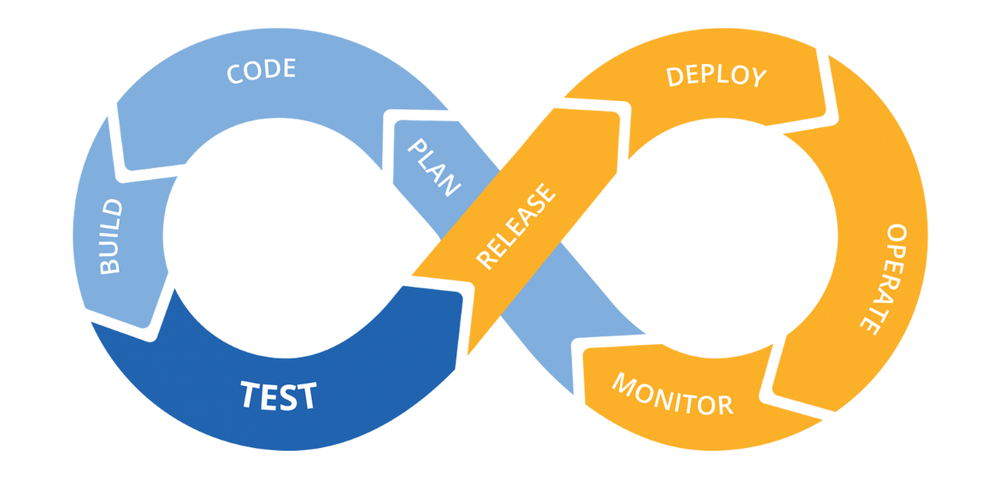

## Overview

In the [previous post](/posts/homelab-k8s-secrets/), we installed HashiCorp Vault to build a secure secrets management system. This post covers installing and configuring three core components needed to build a CI/CD pipeline: Harbor container registry, Argo Events, and Argo Workflows.



## CI/CD System Components

Building a complete CI/CD pipeline in a homelab environment requires the following core components:

- **Container Registry**: A central repository for storing and distributing built container images, enabling self-management of images without depending on public registries like Docker Hub.
- **Event Processing System**: Responsible for detecting various events such as code changes in Git repositories and webhook receipts, and triggering subsequent tasks in response.
- **Workflow Engine**: An engine for defining and executing actual CI/CD tasks such as code building, test execution, and container image creation.
- **GitOps Deployment System**: A system that automatically synchronizes the desired state defined in Git repositories to the cluster. ArgoCD, installed in a previous series post, handles this role.

In this post, we implement the container registry, event processing system, and workflow engine using Harbor, Argo Events, and Argo Workflows respectively. In the next post, we integrate these with ArgoCD to complete a full CI/CD pipeline.

## Installing Harbor

> **What is Harbor?**
>
> Harbor is a graduated project of the CNCF (Cloud Native Computing Foundation). It is an open-source container registry that started at VMware and was donated to CNCF in 2018. Beyond basic image storage functionality like Docker Hub, it provides enterprise-grade features including RBAC (Role-Based Access Control), vulnerability scanning, image signing, and replication policies, offering a complete solution for securely managing container images in private environments.

The reason for choosing Harbor is to build a completely self-hosted CI/CD environment without depending on public registries. Harbor's vulnerability scanning and access control features are useful for enhancing security even in homelab environments.

### Harbor Helm Chart Configuration

As with previous posts, we install Harbor using the GitOps approach. Create the directory and files for Harbor installation in the Git repository:

```bash
mkdir -p k8s-resource/apps/harbor/templates
cd k8s-resource/apps/harbor
```

Create the `Chart.yaml` file:

```yaml
apiVersion: v2
name: harbor
description: harbor chart for Kubernetes
type: application
version: 1.0.0
appVersion: "2.12.0"
dependencies:
    - name: harbor
      version: "1.16.0"
      repository: "https://helm.goharbor.io"
```

Create the `values.yaml` file to define Harbor configuration:

```yaml
harbor:
    expose:
        type: ClusterIP
        tls:
            enabled: false

    externalURL: "https://harbor.injunweb.com:443"

    harborAdminPassword: "<path:argocd/data/harbor#harborAdminPassword>"

    registry:
        relativeurls: true
        upload_purging:
            age: 12h
            interval: 12h

    persistence:
        persistentVolumeClaim:
            registry:
                size: 15Gi
```

The key points of this configuration are:

- **expose.type: ClusterIP**: Configures the Harbor service to be accessible only within the cluster, with external access provided through Traefik IngressRoute.
- **harborAdminPassword**: Uses a Vault path reference so ArgoCD Vault Plugin replaces it with the actual password during deployment.
- **persistence**: Allocates 15GB of persistent storage to the registry for storing container images.
- **upload_purging**: Cleans up old upload files every 12 hours to efficiently manage storage.

### Traefik IngressRoute Configuration

Create an IngressRoute for accessing the Harbor UI and API as the `templates/ingressroute.yaml` file:

```yaml
apiVersion: traefik.io/v1alpha1
kind: IngressRoute
metadata:
    name: harbor
    namespace: harbor
spec:
    entryPoints:
        - intweb
        - intwebsec
    routes:
        - match: Host(`harbor.injunweb.com`) && PathPrefix(`/`)
          kind: Rule
          services:
              - name: harbor-portal
                namespace: harbor
                port: 80
          middlewares:
              - name: harbor-buffer
                namespace: harbor
        - match: Host(`harbor.injunweb.com`) && (PathPrefix(`/api/`) || PathPrefix(`/service/`) || PathPrefix(`/v2/`) || PathPrefix(`/chartrepo/`) || PathPrefix(`/c/`))
          kind: Rule
          services:
              - name: harbor-core
                namespace: harbor
                port: 80
          middlewares:
              - name: harbor-buffer
                namespace: harbor
```

This IngressRoute defines two routing rules: the default path routes to the Harbor web portal, and API-related paths (`/api/`, `/service/`, `/v2/`, `/chartrepo/`, `/c/`) route to the Harbor core service. It uses the `intweb` and `intwebsec` entry points to allow access only from the internal network.

Create middleware for large container image uploads as the `templates/middleware.yaml` file:

```yaml
apiVersion: traefik.io/v1alpha1
kind: Middleware
metadata:
    name: harbor-buffer
    namespace: harbor
spec:
    buffering:
        maxRequestBodyBytes: 1000000000
        memRequestBodyBytes: 1000000000
        retryExpression: ""
```

This middleware sets the request body size limit to approximately 1GB, allowing large container images to be uploaded.

### Deploying Harbor

Commit and push the changes:

```bash
git add .
git commit -m "Add Harbor configuration"
git push
```

ArgoCD detects the changes and automatically deploys Harbor. Check the deployment status:

```bash
kubectl get pods -n harbor
```

When all Pods are in `Running` status, Harbor has been successfully deployed.

### Accessing and Testing Harbor

Add the following entry to your local computer's hosts file:

```
192.168.0.200 harbor.injunweb.com
```

Access `https://harbor.injunweb.com` in a web browser and log in with the `admin` account and the password stored in Vault. After logging in, create a new project and test image pushing from the Docker CLI:

```bash
docker login harbor.injunweb.com -u admin -p <password>
docker pull nginx:alpine
docker tag nginx:alpine harbor.injunweb.com/injunweb/nginx:alpine
docker push harbor.injunweb.com/injunweb/nginx:alpine
```

Once the image is successfully pushed, you can verify it in the Harbor UI.

## Installing Argo Events

> **What is Argo Events?**
>
> Argo Events is a Kubernetes-native event-driven automation framework. It is part of the Argoproj ecosystem and was donated to CNCF where it is actively developed. It supports over 20 event sources including GitHub webhooks, AWS SQS, Kafka, and NATS. When events are detected, it can trigger various targets such as Argo Workflows, Kubernetes object creation, and AWS Lambda.

The Argo Events architecture consists of three core components:

- **EventBus**: The transport layer responsible for message delivery between event sources and sensors, using NATS or JetStream as the backend.
- **EventSource**: Responsible for receiving events from external systems (GitHub, AWS SNS, webhooks, etc.) and forwarding them to the EventBus.
- **Sensor**: Subscribes to events from the EventBus and performs specified triggers (Argo Workflow execution, HTTP requests, etc.) when events matching filter conditions occur.

### Argo Events Helm Chart Configuration

Create the directory and files for Argo Events installation in the Git repository:

```bash
mkdir -p k8s-resource/apps/argo-events/templates
cd k8s-resource/apps/argo-events
```

Create the `Chart.yaml` file:

```yaml
apiVersion: v2
name: argo-events
description: argo-events chart for Kubernetes
type: application
version: 1.0.0
appVersion: "v1.9.3"
dependencies:
    - name: argo-events
      version: "2.4.9"
      repository: "https://argoproj.github.io/argo-helm"
```

The `values.yaml` file uses default settings, so create it empty:

```yaml
# Using default configuration
```

### Deploying Argo Events

Commit and push the changes:

```bash
git add .
git commit -m "Add Argo Events configuration"
git push
```

Check the deployment status:

```bash
kubectl get pods -n argo-events
```

## Installing Argo Workflows

> **What is Argo Workflows?**
>
> Argo Workflows is a Kubernetes-native workflow engine. It was developed by Applatix (now Intuit) in 2017 and is currently maintained as a CNCF graduated project. It can define and execute complex container-based tasks using DAG (Directed Acyclic Graph) or step-based approaches, and is used for various workloads including CI/CD pipelines, data processing, and machine learning pipelines.

The main features of Argo Workflows include:

- **DAG and Step-based Workflows**: Define dependencies between tasks to execute sequentially or in parallel.
- **Artifact Management**: Transfer files or data between workflow steps and store them in S3, GCS, MinIO, etc.
- **Retry and Timeout**: Support for automatic retry of failed steps and timeout settings.
- **Workflow Templates**: Manage reusable workflow definitions as templates to reduce code duplication.

### Argo Workflows Helm Chart Configuration

Create the directory and files for Argo Workflows installation in the Git repository:

```bash
mkdir -p k8s-resource/apps/argo-workflows/templates
cd k8s-resource/apps/argo-workflows
```

Create the `Chart.yaml` file:

```yaml
apiVersion: v2
name: argo-workflows
description: argo-workflows chart for Kubernetes
type: application
version: 1.0.0
appVersion: "v3.6.2"
dependencies:
    - name: argo-workflows
      version: "0.45.2"
      repository: "https://argoproj.github.io/argo-helm"
```

Create the `values.yaml` file:

```yaml
argo-workflows:
    server:
        authMode: "server"
```

`authMode: server` is a setting that uses the Argo Workflows server's own authentication, allowing simple access in a homelab environment.

Create an IngressRoute for accessing the Argo Workflows UI as the `templates/ingressroute.yaml` file:

```yaml
apiVersion: traefik.io/v1alpha1
kind: IngressRoute
metadata:
    name: argo-workflows-server
    namespace: argo-workflows
spec:
    entryPoints:
        - intweb
        - intwebsec
    routes:
        - kind: Rule
          match: Host(`argo-workflows.injunweb.com`)
          services:
              - name: argo-workflows-server
                port: 2746
```

### Deploying Argo Workflows

Commit and push the changes:

```bash
git add .
git commit -m "Add Argo Workflows configuration"
git push
```

Check the deployment status:

```bash
kubectl get pods -n argo-workflows
```

Add the following entry to your local computer's hosts file and access `https://argo-workflows.injunweb.com` in a web browser to verify the Argo Workflows UI:

```
192.168.0.200 argo-workflows.injunweb.com
```

## EventBus and EventSource Configuration

For Argo Events to function, you need to create an EventBus and configure an EventSource to receive events.

### Creating EventBus

The EventBus is the messaging backbone responsible for communication between event sources and sensors. Create a NATS-based EventBus:

```yaml
apiVersion: argoproj.io/v1alpha1
kind: EventBus
metadata:
    name: default
    namespace: argo-events
spec:
    nats:
        native:
            replicas: 3
            auth: none
```

This EventBus creates 3 NATS replicas to ensure high availability. Named `default`, EventSources and Sensors automatically use this EventBus without explicitly specifying it.

### Creating GitHub EventSource

Create an EventSource to receive webhook events from a GitHub repository:

```yaml
apiVersion: argoproj.io/v1alpha1
kind: EventSource
metadata:
    name: github
    namespace: argo-events
spec:
    service:
        ports:
            - port: 12000
              targetPort: 12000
    github:
        example:
            repositories:
                - owner: injunweb
                  names:
                      - example-repo
            webhook:
                endpoint: /webhook
                port: "12000"
                method: POST
            events:
                - push
            apiToken:
                name: github-access
                key: token
            insecure: true
            active: true
            contentType: json
```

The components of this EventSource are:

- **service.ports**: Sets port 12000 for the EventSource to receive webhooks.
- **repositories**: Specifies the GitHub repository to receive webhooks from.
- **webhook.endpoint**: Sets the webhook receive path to `/webhook`.
- **events**: Configured to detect `push` events.
- **apiToken**: Retrieves the GitHub API token from the `github-access` secret.

Check the EventBus and EventSource status:

```bash
kubectl get eventbus -n argo-events
kubectl get eventsource -n argo-events
```

## Component Integration Testing

Perform simple tests to verify the installed components are functioning correctly.

### Harbor Image Push Test

```bash
docker pull nginx:alpine
docker tag nginx:alpine harbor.injunweb.com/injunweb/nginx:test
docker push harbor.injunweb.com/injunweb/nginx:test
```

You can verify the pushed image in the Harbor UI.

### Argo Workflows Workflow Test

Create a simple workflow to verify Argo Workflows is functioning correctly:

```yaml
apiVersion: argoproj.io/v1alpha1
kind: Workflow
metadata:
    generateName: hello-world-
    namespace: argo-workflows
spec:
    entrypoint: whalesay
    templates:
        - name: whalesay
          container:
              image: docker/whalesay:latest
              command: [cowsay]
              args: ["Hello World!"]
```

Apply this workflow to the cluster:

```bash
kubectl apply -f hello-world.yaml
```

You can check the workflow execution results in the Argo Workflows UI.

## Next Steps

The three components installed in this post (Harbor, Argo Events, Argo Workflows) form the foundation of a CI/CD pipeline, but the following additional configurations are needed to complete a working pipeline:

- **Sensor Configuration**: Create Sensors that filter events received from EventSource and trigger Argo Workflows.
- **Workflow Templates**: Write reusable workflow templates that perform tasks such as application building, container image creation, and Harbor push.
- **ArgoCD Integration**: Automate the process of deploying new images to the cluster through ArgoCD after workflows complete.

## Conclusion

This post covered installing and completing basic configuration of Harbor container registry, Argo Events event processing system, and Argo Workflows workflow engine, the core components of a CI/CD pipeline, on a homelab Kubernetes cluster.

The next post covers connecting these components with Sensors and workflow templates and integrating them with ArgoCD to build a complete CI/CD pipeline.

[Next Post: Homelab Kubernetes #8 - Building an Internal Developer Platform (IDP) (2)](/posts/homelab-k8s-cicd-2/)
