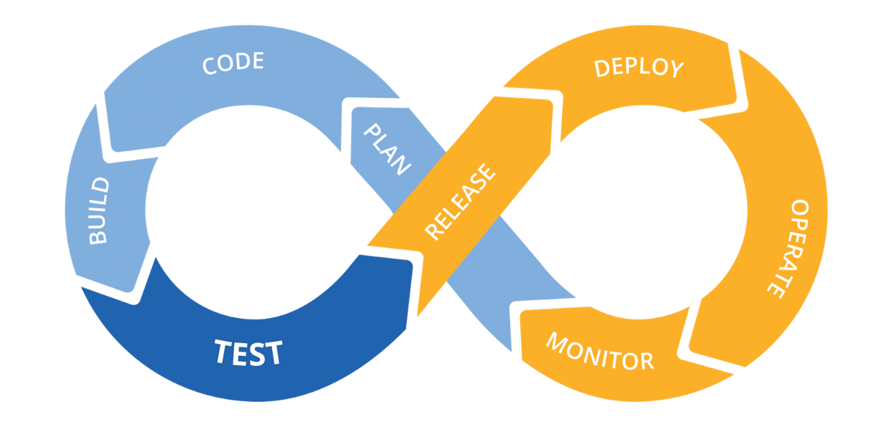

## 개요

[이전 글](/posts/homelab-k8s-secrets/)에서는 HashiCorp Vault를 설치하여 안전한 시크릿 관리 시스템을 구축했다. 이번 글에서는 CI/CD 파이프라인을 구성하기 위해 필요한 세 가지 핵심 컴포넌트인 Harbor 컨테이너 레지스트리, Argo Events, Argo Workflows를 설치하고 기본 구성을 완료하는 방법을 다룬다.



## CI/CD 시스템 구성 요소

홈랩 환경에서 완전한 CI/CD 파이프라인을 구축하기 위해서는 다음과 같은 핵심 구성 요소가 필요하다:

- **컨테이너 레지스트리**: 빌드된 컨테이너 이미지를 저장하고 배포하는 중앙 저장소로, Docker Hub와 같은 퍼블릭 레지스트리에 의존하지 않고 자체적으로 이미지를 관리할 수 있게 한다.
- **이벤트 처리 시스템**: Git 저장소의 코드 변경, 웹훅 수신 등 다양한 이벤트를 감지하고 이에 반응하여 후속 작업을 트리거하는 역할을 담당한다.
- **워크플로우 엔진**: 코드 빌드, 테스트 실행, 컨테이너 이미지 생성 등 실제 CI/CD 작업을 정의하고 실행하는 엔진이다.
- **GitOps 배포 시스템**: Git 저장소에 정의된 원하는 상태를 클러스터에 자동으로 동기화하는 시스템으로, 이전 시리즈에서 설치한 ArgoCD가 이 역할을 담당한다.

이번 글에서는 컨테이너 레지스트리, 이벤트 처리 시스템, 워크플로우 엔진을 각각 Harbor, Argo Events, Argo Workflows로 구현하고, 다음 글에서 이들을 ArgoCD와 통합하여 완전한 CI/CD 파이프라인을 완성한다.

## Harbor 설치

> **Harbor란?**
>
> Harbor는 CNCF(Cloud Native Computing Foundation)의 졸업 프로젝트로, VMware에서 시작하여 2018년 CNCF에 기증된 오픈소스 컨테이너 레지스트리이다. Docker Hub와 같은 기본적인 이미지 저장 기능 외에도 RBAC(역할 기반 접근 제어), 취약점 스캐닝, 이미지 서명, 복제 정책 등 엔터프라이즈급 기능을 제공하며, 프라이빗 환경에서 컨테이너 이미지를 안전하게 관리하기 위한 완전한 솔루션을 제공한다.

Harbor를 선택한 이유는 퍼블릭 레지스트리에 의존하지 않고 완전히 자체 호스팅된 CI/CD 환경을 구축하기 위해서이며, Harbor가 제공하는 취약점 스캐닝과 접근 제어 기능은 홈랩 환경에서도 보안을 강화하는 데 유용하다.

### Harbor Helm 차트 구성

이전 글들과 마찬가지로 GitOps 방식으로 Harbor를 설치한다. Git 저장소에 Harbor 설치를 위한 디렉토리와 파일을 생성한다:

```bash
mkdir -p k8s-resource/apps/harbor/templates
cd k8s-resource/apps/harbor
```

`Chart.yaml` 파일을 생성한다:

```yaml
apiVersion: v2
name: harbor
description: harbor chart for Kubernetes
type: application
version: 1.0.0
appVersion: "2.12.0"
dependencies:
    - name: harbor
      version: "1.16.0"
      repository: "https://helm.goharbor.io"
```

`values.yaml` 파일을 생성하여 Harbor 설정을 정의한다:

```yaml
harbor:
    expose:
        type: ClusterIP
        tls:
            enabled: false

    externalURL: "https://harbor.injunweb.com:443"

    harborAdminPassword: "<path:argocd/data/harbor#harborAdminPassword>"

    registry:
        relativeurls: true
        upload_purging:
            age: 12h
            interval: 12h

    persistence:
        persistentVolumeClaim:
            registry:
                size: 15Gi
```

이 설정의 핵심 사항은 다음과 같다:

- **expose.type: ClusterIP**: Harbor 서비스를 클러스터 내부에서만 접근 가능하게 설정하고 외부 접근은 Traefik IngressRoute를 통해 제공한다.
- **harborAdminPassword**: Vault 경로 참조를 사용하여 ArgoCD Vault Plugin이 배포 시 실제 비밀번호로 대체한다.
- **persistence**: 레지스트리에 15GB의 영구 스토리지를 할당하여 컨테이너 이미지를 저장한다.
- **upload_purging**: 12시간마다 오래된 업로드 파일을 정리하여 스토리지를 효율적으로 관리한다.

### Traefik IngressRoute 구성

Harbor UI와 API에 접근하기 위한 IngressRoute를 `templates/ingressroute.yaml` 파일로 생성한다:

```yaml
apiVersion: traefik.io/v1alpha1
kind: IngressRoute
metadata:
    name: harbor
    namespace: harbor
spec:
    entryPoints:
        - intweb
        - intwebsec
    routes:
        - match: Host(`harbor.injunweb.com`) && PathPrefix(`/`)
          kind: Rule
          services:
              - name: harbor-portal
                namespace: harbor
                port: 80
          middlewares:
              - name: harbor-buffer
                namespace: harbor
        - match: Host(`harbor.injunweb.com`) && (PathPrefix(`/api/`) || PathPrefix(`/service/`) || PathPrefix(`/v2/`) || PathPrefix(`/chartrepo/`) || PathPrefix(`/c/`))
          kind: Rule
          services:
              - name: harbor-core
                namespace: harbor
                port: 80
          middlewares:
              - name: harbor-buffer
                namespace: harbor
```

이 IngressRoute는 두 가지 라우팅 규칙을 정의하는데, 기본 경로는 Harbor 웹 포털로 라우팅하고 API 관련 경로(`/api/`, `/service/`, `/v2/`, `/chartrepo/`, `/c/`)는 Harbor 코어 서비스로 라우팅한다. `intweb`과 `intwebsec` 엔트리 포인트를 사용하여 내부 네트워크에서만 접근 가능하게 설정한다.

대용량 컨테이너 이미지 업로드를 위한 미들웨어를 `templates/middleware.yaml` 파일로 생성한다:

```yaml
apiVersion: traefik.io/v1alpha1
kind: Middleware
metadata:
    name: harbor-buffer
    namespace: harbor
spec:
    buffering:
        maxRequestBodyBytes: 1000000000
        memRequestBodyBytes: 1000000000
        retryExpression: ""
```

이 미들웨어는 요청 본문 크기 제한을 약 1GB로 설정하여 대용량 컨테이너 이미지도 업로드할 수 있게 한다.

### Harbor 배포

변경 사항을 커밋하고 푸시한다:

```bash
git add .
git commit -m "Add Harbor configuration"
git push
```

ArgoCD가 변경 사항을 감지하고 자동으로 Harbor를 배포한다. 배포 상태를 확인한다:

```bash
kubectl get pods -n harbor
```

모든 Pod가 `Running` 상태가 되면 Harbor가 성공적으로 배포된 것이다.

### Harbor 접속 및 테스트

로컬 컴퓨터의 hosts 파일에 다음 항목을 추가한다:

```
192.168.0.200 harbor.injunweb.com
```

웹 브라우저에서 `https://harbor.injunweb.com`에 접속하여 `admin` 계정과 Vault에 저장된 비밀번호로 로그인한다. 로그인 후 새 프로젝트를 생성하고 Docker CLI에서 이미지 푸시를 테스트한다:

```bash
docker login harbor.injunweb.com -u admin -p <비밀번호>
docker pull nginx:alpine
docker tag nginx:alpine harbor.injunweb.com/injunweb/nginx:alpine
docker push harbor.injunweb.com/injunweb/nginx:alpine
```

이미지가 성공적으로 푸시되면 Harbor UI에서 해당 이미지를 확인할 수 있다.

## Argo Events 설치

> **Argo Events란?**
>
> Argo Events는 쿠버네티스 네이티브 이벤트 기반 자동화 프레임워크로, Argoproj 생태계의 일부이며 CNCF에 기증되어 활발하게 개발되고 있다. GitHub 웹훅, AWS SQS, Kafka, NATS 등 20개 이상의 이벤트 소스를 지원하며, 이벤트를 감지하면 Argo Workflows, 쿠버네티스 오브젝트 생성, AWS Lambda 등 다양한 타겟을 트리거할 수 있다.

Argo Events의 아키텍처는 세 가지 핵심 컴포넌트로 구성된다:

- **EventBus**: 이벤트 소스와 센서 간의 메시지 전달을 담당하는 전송 계층으로, NATS 또는 JetStream을 백엔드로 사용한다.
- **EventSource**: 외부 시스템(GitHub, AWS SNS, 웹훅 등)에서 이벤트를 수신하고 EventBus로 전달하는 역할을 한다.
- **Sensor**: EventBus에서 이벤트를 구독하고, 필터 조건에 맞는 이벤트가 발생하면 지정된 트리거(Argo Workflow 실행, HTTP 요청 등)를 수행한다.

### Argo Events Helm 차트 구성

Git 저장소에 Argo Events 설치를 위한 디렉토리와 파일을 생성한다:

```bash
mkdir -p k8s-resource/apps/argo-events/templates
cd k8s-resource/apps/argo-events
```

`Chart.yaml` 파일을 생성한다:

```yaml
apiVersion: v2
name: argo-events
description: argo-events chart for Kubernetes
type: application
version: 1.0.0
appVersion: "v1.9.3"
dependencies:
    - name: argo-events
      version: "2.4.9"
      repository: "https://argoproj.github.io/argo-helm"
```

`values.yaml` 파일은 기본 설정을 사용하므로 비어 있는 상태로 생성한다:

```yaml
# 기본 설정 사용
```

### Argo Events 배포

변경 사항을 커밋하고 푸시한다:

```bash
git add .
git commit -m "Add Argo Events configuration"
git push
```

배포 상태를 확인한다:

```bash
kubectl get pods -n argo-events
```

## Argo Workflows 설치

> **Argo Workflows란?**
>
> Argo Workflows는 쿠버네티스 네이티브 워크플로우 엔진으로, 2017년 Applatix(현재 Intuit)에서 개발되어 현재 CNCF 졸업 프로젝트로 유지보수되고 있다. 복잡한 컨테이너 기반 작업을 DAG(Directed Acyclic Graph) 또는 단계별 방식으로 정의하고 실행할 수 있으며, CI/CD 파이프라인, 데이터 처리, 머신러닝 파이프라인 등 다양한 워크로드에 활용된다.

Argo Workflows의 주요 기능은 다음과 같다:

- **DAG 및 단계별 워크플로우**: 작업 간의 의존성을 정의하여 순차적 또는 병렬로 실행할 수 있다.
- **아티팩트 관리**: 워크플로우 단계 간에 파일이나 데이터를 전달하고 S3, GCS, MinIO 등에 저장할 수 있다.
- **재시도 및 타임아웃**: 실패한 단계에 대한 자동 재시도와 타임아웃 설정을 지원한다.
- **워크플로우 템플릿**: 재사용 가능한 워크플로우 정의를 템플릿으로 관리하여 코드 중복을 줄인다.

### Argo Workflows Helm 차트 구성

Git 저장소에 Argo Workflows 설치를 위한 디렉토리와 파일을 생성한다:

```bash
mkdir -p k8s-resource/apps/argo-workflows/templates
cd k8s-resource/apps/argo-workflows
```

`Chart.yaml` 파일을 생성한다:

```yaml
apiVersion: v2
name: argo-workflows
description: argo-workflows chart for Kubernetes
type: application
version: 1.0.0
appVersion: "v3.6.2"
dependencies:
    - name: argo-workflows
      version: "0.45.2"
      repository: "https://argoproj.github.io/argo-helm"
```

`values.yaml` 파일을 생성한다:

```yaml
argo-workflows:
    server:
        authMode: "server"
```

`authMode: server`는 Argo Workflows 서버 자체의 인증을 사용하는 설정으로, 홈랩 환경에서 간단하게 접근할 수 있게 한다.

Argo Workflows UI에 접근하기 위한 IngressRoute를 `templates/ingressroute.yaml` 파일로 생성한다:

```yaml
apiVersion: traefik.io/v1alpha1
kind: IngressRoute
metadata:
    name: argo-workflows-server
    namespace: argo-workflows
spec:
    entryPoints:
        - intweb
        - intwebsec
    routes:
        - kind: Rule
          match: Host(`argo-workflows.injunweb.com`)
          services:
              - name: argo-workflows-server
                port: 2746
```

### Argo Workflows 배포

변경 사항을 커밋하고 푸시한다:

```bash
git add .
git commit -m "Add Argo Workflows configuration"
git push
```

배포 상태를 확인한다:

```bash
kubectl get pods -n argo-workflows
```

로컬 컴퓨터의 hosts 파일에 다음 항목을 추가하고 웹 브라우저에서 `https://argo-workflows.injunweb.com`에 접속하여 Argo Workflows UI를 확인한다:

```
192.168.0.200 argo-workflows.injunweb.com
```

## EventBus 및 EventSource 설정

Argo Events가 동작하려면 EventBus를 생성하고 이벤트를 수신할 EventSource를 구성해야 한다.

### EventBus 생성

EventBus는 이벤트 소스와 센서 간의 통신을 담당하는 메시징 백본이다. NATS 기반의 EventBus를 생성한다:

```yaml
apiVersion: argoproj.io/v1alpha1
kind: EventBus
metadata:
    name: default
    namespace: argo-events
spec:
    nats:
        native:
            replicas: 3
            auth: none
```

이 EventBus는 3개의 NATS 복제본을 생성하여 고가용성을 보장하며, `default`라는 이름으로 생성되어 EventSource와 Sensor가 명시적으로 EventBus를 지정하지 않아도 자동으로 이 EventBus를 사용한다.

### GitHub EventSource 생성

GitHub 저장소의 웹훅 이벤트를 수신하기 위한 EventSource를 생성한다:

```yaml
apiVersion: argoproj.io/v1alpha1
kind: EventSource
metadata:
    name: github
    namespace: argo-events
spec:
    service:
        ports:
            - port: 12000
              targetPort: 12000
    github:
        example:
            repositories:
                - owner: injunweb
                  names:
                      - example-repo
            webhook:
                endpoint: /webhook
                port: "12000"
                method: POST
            events:
                - push
            apiToken:
                name: github-access
                key: token
            insecure: true
            active: true
            contentType: json
```

이 EventSource의 구성 요소는 다음과 같다:

- **service.ports**: EventSource가 웹훅을 수신할 포트를 12000으로 설정한다.
- **repositories**: 웹훅을 수신할 GitHub 저장소를 지정한다.
- **webhook.endpoint**: 웹훅 수신 경로를 `/webhook`으로 설정한다.
- **events**: `push` 이벤트를 감지하도록 설정한다.
- **apiToken**: GitHub API 토큰을 `github-access` 시크릿에서 가져온다.

EventBus와 EventSource 상태를 확인한다:

```bash
kubectl get eventbus -n argo-events
kubectl get eventsource -n argo-events
```

## 구성 요소 통합 테스트

설치된 구성 요소들이 정상적으로 동작하는지 간단한 테스트를 수행한다.

### Harbor 이미지 푸시 테스트

```bash
docker pull nginx:alpine
docker tag nginx:alpine harbor.injunweb.com/injunweb/nginx:test
docker push harbor.injunweb.com/injunweb/nginx:test
```

Harbor UI에서 푸시된 이미지를 확인할 수 있다.

### Argo Workflows 워크플로우 테스트

간단한 워크플로우를 생성하여 Argo Workflows가 정상적으로 동작하는지 확인한다:

```yaml
apiVersion: argoproj.io/v1alpha1
kind: Workflow
metadata:
    generateName: hello-world-
    namespace: argo-workflows
spec:
    entrypoint: whalesay
    templates:
        - name: whalesay
          container:
              image: docker/whalesay:latest
              command: [cowsay]
              args: ["Hello World!"]
```

이 워크플로우를 클러스터에 적용한다:

```bash
kubectl apply -f hello-world.yaml
```

Argo Workflows UI에서 워크플로우 실행 결과를 확인할 수 있다.

## 다음 단계

이번 글에서 설치한 세 가지 구성 요소(Harbor, Argo Events, Argo Workflows)는 CI/CD 파이프라인의 기반을 구성하지만, 실제로 동작하는 파이프라인을 완성하려면 다음과 같은 추가 구성이 필요하다:

- **Sensor 구성**: EventSource에서 수신한 이벤트를 필터링하고 Argo Workflows를 트리거하는 Sensor를 생성해야 한다.
- **워크플로우 템플릿**: 애플리케이션 빌드, 컨테이너 이미지 생성, Harbor 푸시 등의 작업을 수행하는 재사용 가능한 워크플로우 템플릿을 작성해야 한다.
- **ArgoCD 연동**: 워크플로우가 완료된 후 ArgoCD를 통해 새 이미지를 클러스터에 배포하는 과정을 자동화해야 한다.

## 마치며

이번 글에서는 홈랩 쿠버네티스 클러스터에 CI/CD 파이프라인의 핵심 구성 요소인 Harbor 컨테이너 레지스트리, Argo Events 이벤트 처리 시스템, Argo Workflows 워크플로우 엔진을 설치하고 기본 구성을 완료하는 방법을 살펴보았다.

다음 글에서는 이 구성 요소들을 Sensor와 워크플로우 템플릿으로 연결하고 ArgoCD와 통합하여 완전한 CI/CD 파이프라인을 구축하는 방법을 알아본다.

[다음 글: 홈랩 쿠버네티스 #8 - 내부 개발자 플랫폼(IDP) 구축하기 (2)](/posts/homelab-k8s-cicd-2/)
