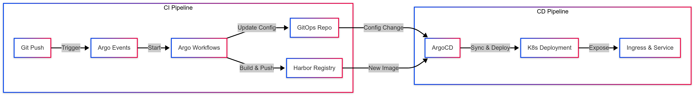

## Overview

In the [previous post](/posts/homelab-k8s-cicd-1/), we installed Harbor container registry, Argo Events, and Argo Workflows as the foundation for a CI/CD pipeline. This post covers integrating these components with ArgoCD and designing Helm chart-based project templates to build an Internal Developer Platform (IDP) that enables deployment of projects with complete CI/CD pipelines from a single YAML file.



## What is an Internal Developer Platform

> **What is an Internal Developer Platform (IDP)?**
>
> An Internal Developer Platform is a system that provides developers with an abstracted self-service interface to deploy and operate applications without directly configuring infrastructure and deployment pipelines. As a core deliverable of platform engineering, it aims to improve developer experience and reduce operational burden through standardized deployment processes.

Traditional CI/CD pipelines require individual configuration for each project, while an Internal Developer Platform uses template-based abstraction to automatically provision all infrastructure including CI/CD pipelines, databases, and network settings when developers write a simple configuration file. The platform built in this post operates with the following flow:

1. **A developer pushes code to a Git repository.**
2. **A GitHub webhook sends an event to Argo Events' EventSource.**
3. **Argo Events' Sensor filters the event and triggers an Argo Workflow.**
4. **Argo Workflows builds the code and pushes the container image to Harbor.**
5. **When the workflow completes, it calls the GitHub API to update the project configuration file.**
6. **ArgoCD detects the changed configuration file and deploys the application with the new image.**

## Project Template Design

We design a Helm chart-based project template that can be reused across multiple projects. Using this template, a project with a complete CI/CD pipeline can be deployed with just a simple YAML configuration file.

### Project Template Requirements

The features that the template should provide for efficiently managing multiple projects in a homelab environment are as follows:

- **Automated CI/CD Pipeline**: Automatically builds and deploys when code changes in a GitHub repository.
- **Declarative Resource Management**: Define applications, databases, and network settings in YAML files.
- **Secrets Management Integration**: Safely manage passwords, API keys, and other secrets through Vault integration.
- **Multi-Application Support**: Manage multiple applications and databases within a single project.

### Git Repository Structure

The Git repository for project management is designed with the following structure:

```
projects-gitops/
├── .github/workflows/
│   └── update-config.yaml
├── applicationset.yaml
├── chart/
│   ├── Chart.yaml
│   └── templates/
│       ├── app/
│       │   ├── ci/
│       │   │   ├── eventbus.yaml
│       │   │   ├── eventsource.yaml
│       │   │   ├── sensor.yaml
│       │   │   └── workflow-template.yaml
│       │   ├── deployment.yaml
│       │   ├── service.yaml
│       │   └── ingressroute.yaml
│       └── db/
│           ├── statefulset.yaml
│           └── service.yaml
└── projects/
    ├── project-a.yaml
    ├── project-b.yaml
    └── ...
```

In this structure, the `chart/` directory contains the Helm chart shared by all projects, and the `projects/` directory contains the configuration files for each project. To deploy a new project, simply add a YAML file to the `projects/` directory.

## ApplicationSet Configuration

> **What is ApplicationSet?**
>
> ApplicationSet is an ArgoCD feature that uses templates and generators to automatically create and manage multiple Applications. It can dynamically create Applications based on file lists in Git repositories, directory structures, cluster lists, and more, enabling efficient management of large-scale multi-project environments.

Create the `applicationset.yaml` file as follows:

```yaml
apiVersion: argoproj.io/v1alpha1
kind: ApplicationSet
metadata:
    name: projects-apps
    namespace: argocd
spec:
    goTemplate: true
    goTemplateOptions: ["missingkey=error"]
    generators:
        - git:
              repoURL: https://github.com/injunweb/projects-gitops.git
              revision: HEAD
              files:
                  - path: "projects/*.yaml"
    template:
        metadata:
            name: '{{.path.filenameNormalized | trimSuffix ".yaml"}}'
            namespace: argocd
        spec:
            project: default
            source:
                repoURL: https://github.com/injunweb/projects-gitops.git
                targetRevision: HEAD
                path: chart
                plugin:
                    name: argocd-vault-plugin-helm
                    env:
                        - name: HELM_ARGS
                          value: >-
                              -f ../projects/{{.path.filename}}
                              --set project={{.path.filenameNormalized | trimSuffix ".yaml"}}
            destination:
                server: https://kubernetes.default.svc
                namespace: '{{.path.filenameNormalized | trimSuffix ".yaml"}}'
            syncPolicy:
                automated:
                    prune: true
                    selfHeal: true
                syncOptions:
                    - CreateNamespace=true
```

This ApplicationSet uses a Git file generator to find all files matching the `projects/*.yaml` pattern and automatically creates an ArgoCD Application for each file. The filename with the `.yaml` extension removed is used as the project name and namespace, and secrets stored in Vault are safely injected through the ArgoCD Vault Plugin.

## Project Configuration File Structure

Each project is defined with a YAML file in the following structure:

```yaml
applications:
    - name: api
      git:
          type: github
          owner: myorg
          repo: my-api
          branch: main
          hash: ~
      port: 8080
      domains:
          - api.example.com

    - name: frontend
      git:
          type: github
          owner: myorg
          repo: my-frontend
          branch: main
          hash: ~
      port: 80
      domains:
          - www.example.com
          - example.com

databases:
    - name: mysql
      type: mysql
      version: "8.0"
      port: 3306
      size: 5Gi

    - name: redis
      type: redis
      version: "7.0"
      port: 6379
      size: 1Gi
```

The key fields in this configuration file are:

- **applications[].git.hash**: The Git commit hash that the CI pipeline will build and deploy. It is initially empty and automatically updated when a build succeeds. Deployments are only created when this value exists.
- **applications[].domains**: A list of domains for accessing the application. A Traefik IngressRoute is created for each domain.
- **databases[]**: A list of databases to use in the project, supporting MySQL, PostgreSQL, Redis, and MongoDB.

## CI Pipeline Templates

The CI pipeline is implemented with a combination of Argo Events and Argo Workflows, defined as Helm chart templates for reuse across all projects.

### EventBus Template

A template that creates an independent event bus for each project:

```yaml
apiVersion: argoproj.io/v1alpha1
kind: EventBus
metadata:
    name: {{ $.Values.project }}-ci-eventbus
    namespace: {{ $.Values.project }}
spec:
    nats:
        native:
            replicas: 3
            auth: none
            antiAffinity: false
```

This EventBus is configured with 3 NATS replicas for high availability and establishes an independent event transport layer for each project.

### EventSource Template

An EventSource template that receives GitHub webhooks:

```yaml
{{- range $app := .Values.applications }}
---
apiVersion: argoproj.io/v1alpha1
kind: EventSource
metadata:
    name: {{ $.Values.project }}-{{ $app.name }}-github-eventsource
    namespace: {{ $.Values.project }}
spec:
    eventBusName: {{ $.Values.project }}-ci-eventbus
    template:
        serviceAccountName: {{ $.Values.project }}-ci-workflow-sa
    service:
        ports:
            - port: 12000
              targetPort: 12000
              name: webhook
    github:
        {{ $.Values.project }}-{{ $app.name }}-github-trigger:
            repositories:
                - owner: {{ $app.git.owner }}
                  names:
                      - {{ $app.git.repo }}
            webhook:
                endpoint: /{{ $.Values.project }}-{{ $app.name }}
                port: "12000"
                method: POST
                url: https://webhook.injunweb.com
            events:
                - push
            apiToken:
                name: {{ $.Values.project }}-github-access-secret
                key: token
            insecure: false
            active: true
            contentType: json
{{- end }}
```

This template creates an EventSource for each application defined in the project configuration, detecting push events from GitHub repositories. The `webhook.url` is the externally accessible webhook endpoint where GitHub sends events.

### Sensor Template

A Sensor template that filters events and triggers workflows:

```yaml
{{- range $app := .Values.applications }}
---
apiVersion: argoproj.io/v1alpha1
kind: Sensor
metadata:
    name: {{ $.Values.project }}-{{ $app.name }}-github-workflow-sensor
    namespace: {{ $.Values.project }}
spec:
    eventBusName: {{ $.Values.project }}-ci-eventbus
    template:
        serviceAccountName: {{ $.Values.project }}-ci-workflow-sa
    dependencies:
        - name: github-dep
          eventSourceName: {{ $.Values.project }}-{{ $app.name }}-github-eventsource
          eventName: {{ $.Values.project }}-{{ $app.name }}-github-trigger
          filters:
              data:
                  - path: body.ref
                    type: string
                    comparator: "="
                    value:
                        - "refs/heads/{{ $app.git.branch }}"
    triggers:
        - template:
              name: workflow-trigger
              k8s:
                  operation: create
                  source:
                      resource:
                          apiVersion: argoproj.io/v1alpha1
                          kind: Workflow
                          metadata:
                              generateName: {{ $.Values.project }}-{{ $app.name }}-build-workflow-
                          spec:
                              arguments:
                                  parameters:
                                      - name: git_sha
                              workflowTemplateRef:
                                  name: {{ $.Values.project }}-{{ $app.name }}-build-workflow-template
                  parameters:
                      - src:
                            dependencyName: github-dep
                            dataKey: body.after
                        dest: spec.arguments.parameters.0.value
          retryStrategy:
              steps: 3
{{- end }}
```

This Sensor filters only push events to specific branches (e.g., main, develop) in the `filters.data` section, and when matching events occur, it creates a Workflow by referencing the WorkflowTemplate. The `body.after` value (the commit hash after the push) is passed as a workflow parameter.

### WorkflowTemplate

A WorkflowTemplate that defines build and configuration update tasks:

```yaml
{{- range $app := .Values.applications }}
---
apiVersion: argoproj.io/v1alpha1
kind: WorkflowTemplate
metadata:
    name: {{ $.Values.project }}-{{ $app.name }}-build-workflow-template
    namespace: {{ $.Values.project }}
spec:
    serviceAccountName: {{ $.Values.project }}-ci-workflow-sa
    entrypoint: build
    arguments:
        parameters:
            - name: git_sha
              description: "Git commit hash"
    volumes:
        - name: docker-config
          secret:
              secretName: registry-secret
              items:
                  - key: .dockerconfigjson
                    path: config.json
    templates:
        - name: build
          dag:
              tasks:
                  - name: build
                    template: build-container
                    arguments:
                        parameters:
                            - name: sha
                              value: "{{`{{workflow.parameters.git_sha}}`}}"
                  - name: update-config
                    template: update-config
                    dependencies: [build]
                    arguments:
                        parameters:
                            - name: sha
                              value: "{{`{{workflow.parameters.git_sha}}`}}"

        - name: build-container
          inputs:
              parameters:
                  - name: sha
          hostAliases:
              - ip: "192.168.0.200"
                hostnames:
                    - "harbor.injunweb.com"
          container:
              image: gcr.io/kaniko-project/executor:latest
              args:
                  - "--context=git://github.com/{{ $app.git.owner }}/{{ $app.git.repo }}.git#refs/heads/{{ $app.git.branch }}#{{`{{inputs.parameters.sha}}`}}"
                  - "--dockerfile=Dockerfile"
                  - "--destination=harbor.injunweb.com/injunweb/{{ $.Values.project }}-{{ $app.name }}:{{`{{inputs.parameters.sha}}`}}"
                  - "--destination=harbor.injunweb.com/injunweb/{{ $.Values.project }}-{{ $app.name }}:latest"
                  - "--cache=true"
                  - "--cache-repo=harbor.injunweb.com/injunweb/cache"
              env:
                  - name: GIT_USERNAME
                    valueFrom:
                        secretKeyRef:
                            name: {{ $.Values.project }}-github-access-secret
                            key: username
                  - name: GIT_PASSWORD
                    valueFrom:
                        secretKeyRef:
                            name: {{ $.Values.project }}-github-access-secret
                            key: token
              volumeMounts:
                  - name: docker-config
                    mountPath: /kaniko/.docker/

        - name: update-config
          inputs:
              parameters:
                  - name: sha
          container:
              image: curlimages/curl:latest
              command: ["/bin/sh", "-c"]
              args:
                  - |
                      curl -X POST https://api.github.com/repos/injunweb/projects-gitops/dispatches \
                        -H "Accept: application/vnd.github.v3+json" \
                        -H "Authorization: Bearer $GITHUB_TOKEN" \
                        -d '{
                          "event_type": "config-api",
                          "client_payload": {
                            "path": "projects/{{$.Values.project}}/applications/{{$app.name}}",
                            "action": "apply",
                            "spec": {
                              "git": {
                                "hash": "'"{{`{{inputs.parameters.sha}}`}}"'"
                              }
                            }
                          }
                        }'
              env:
                  - name: GITHUB_TOKEN
                    valueFrom:
                        secretKeyRef:
                            name: {{ $.Values.project }}-github-access-secret
                            key: token
{{- end }}
```

The key components of this WorkflowTemplate are:

- **DAG Template**: Defines two tasks, `build` and `update-config`, as a DAG with dependencies so that the configuration update only runs after a successful build.
- **Kaniko**: A tool for building images inside containers without a Docker daemon, allowing safe image building without privilege escalation. Caching is enabled to reduce build times.
- **GitHub API Call**: When the build succeeds, it triggers a repository_dispatch event to update the `git.hash` value in the project configuration file.

## CD Pipeline Templates

When the CI pipeline updates the project configuration file, ArgoCD detects the changes and performs deployment with the new image.

### Deployment Template

A Deployment template for application deployment:

```yaml
{{- range $app := .Values.applications }}
{{- if $app.git.hash }}
---
apiVersion: apps/v1
kind: Deployment
metadata:
    name: {{ $app.name }}-app
    namespace: {{ $.Values.project }}
spec:
    replicas: 1
    strategy:
        type: RollingUpdate
        rollingUpdate:
            maxSurge: 1
            maxUnavailable: 0
    selector:
        matchLabels:
            app: {{ $app.name }}-app
    template:
        metadata:
            labels:
                app: {{ $app.name }}-app
        spec:
            affinity:
                podAntiAffinity:
                    preferredDuringSchedulingIgnoredDuringExecution:
                        - weight: 100
                          podAffinityTerm:
                              labelSelector:
                                  matchExpressions:
                                      - key: app
                                        operator: In
                                        values:
                                            - {{ $app.name }}-app
                              topologyKey: "kubernetes.io/hostname"
            terminationGracePeriodSeconds: 120
            containers:
                - name: {{ $app.name }}-app
                  image: harbor.injunweb.com/injunweb/{{ $.Values.project }}-{{ $app.name }}:{{ $app.git.hash }}
                  lifecycle:
                      preStop:
                          exec:
                              command: ["/bin/sh", "-c", "sleep 10"]
                  ports:
                      - containerPort: {{ $app.port }}
                  readinessProbe:
                      tcpSocket:
                          port: {{ $app.port }}
                      initialDelaySeconds: 20
                      periodSeconds: 10
                      successThreshold: 3
                  envFrom:
                      - secretRef:
                            name: {{ $.Values.project }}-{{ $app.name }}-secret
                            optional: true
            imagePullSecrets:
                - name: registry-secret
{{- end }}
{{- end }}
```

The key point of this template is the `{{- if $app.git.hash }}` condition, which ensures that the Deployment is only created when the `git.hash` value is set. This guarantees that deployment only occurs after the CI pipeline has completed successfully.

The main features of the Deployment template are:

- **Rolling Update**: The `maxSurge: 1`, `maxUnavailable: 0` settings implement zero-downtime deployment.
- **Pod Anti-Affinity**: Distributes Pods of the same application across different nodes to improve availability.
- **Graceful Shutdown**: The `preStop` hook and 120-second termination grace period allow existing connections to complete normally.

### IngressRoute Template

An IngressRoute template that provides external access to applications:

```yaml
{{- range $app := .Values.applications }}
{{- if $app.git.hash }}
{{- range $domain := $app.domains }}
---
apiVersion: traefik.io/v1alpha1
kind: IngressRoute
metadata:
    name: {{ $.Values.project }}-{{ $app.name }}-{{ $domain | replace "." "-" }}-route
    namespace: {{ $.Values.project }}
spec:
    entryPoints:
        - web
        - websecure
    routes:
        - match: Host(`{{ $domain }}`)
          kind: Rule
          services:
              - name: {{ $app.name }}
                port: {{ $app.port }}
{{- end }}
{{- end }}
{{- end }}
```

This template creates a Traefik IngressRoute for each domain defined in the project configuration, using the `web` and `websecure` entry points to handle both HTTP and HTTPS requests.

### Database StatefulSet Template

A StatefulSet template for database deployment:

```yaml
{{- range $db := .Values.databases }}
---
apiVersion: apps/v1
kind: StatefulSet
metadata:
    name: {{ $.Values.project }}-{{ $db.name }}-db
    namespace: {{ $.Values.project }}
spec:
    serviceName: {{ $db.name }}
    selector:
        matchLabels:
            app: {{ $.Values.project }}-{{ $db.name }}-db
    template:
        metadata:
            labels:
                app: {{ $.Values.project }}-{{ $db.name }}-db
        spec:
            containers:
                - name: {{ $db.name }}
                  image: {{ $db.type }}:{{ $db.version }}
                  {{- if eq $db.type "mysql" }}
                  env:
                      - name: MYSQL_DATABASE
                        value: {{ $db.name }}_db
                      - name: MYSQL_USER
                        value: {{ $db.name }}_user
                      - name: MYSQL_PASSWORD
                        valueFrom:
                            secretKeyRef:
                                name: {{ $.Values.project }}-{{ $db.name }}-secret
                                key: password
                      - name: MYSQL_ROOT_PASSWORD
                        valueFrom:
                            secretKeyRef:
                                name: {{ $.Values.project }}-{{ $db.name }}-secret
                                key: password
                  {{- else if eq $db.type "redis" }}
                  args: ["--requirepass", "$(REDIS_PASSWORD)"]
                  env:
                      - name: REDIS_PASSWORD
                        valueFrom:
                            secretKeyRef:
                                name: {{ $.Values.project }}-{{ $db.name }}-secret
                                key: password
                  {{- end }}
                  ports:
                      - containerPort: {{ $db.port }}
                  volumeMounts:
                      - name: {{ $.Values.project }}-{{ $db.name }}-data
                        mountPath: {{- if eq $db.type "mysql" }} /var/lib/mysql
                                   {{- else if eq $db.type "redis" }} /data
                                   {{- else if eq $db.type "postgres" }} /var/lib/postgresql/data
                                   {{- else if eq $db.type "mongodb" }} /data/db
                                   {{- end }}
    volumeClaimTemplates:
        - metadata:
              name: {{ $.Values.project }}-{{ $db.name }}-data
          spec:
              accessModes: ["ReadWriteOnce"]
              resources:
                  requests:
                      storage: {{ $db.size }}
{{- end }}
```

This template supports four database types: MySQL, PostgreSQL, Redis, and MongoDB, and automatically configures the appropriate environment variables and volume mount paths for each type.

## GitHub Actions Configuration Update Workflow

A GitHub Actions workflow called by the CI pipeline to update project configuration files:

```yaml
name: Configuration API

on:
    repository_dispatch:
        types: [config-api]

jobs:
    handle-request:
        runs-on: ubuntu-latest
        concurrency:
            group: config-update
            cancel-in-progress: false
        steps:
            - uses: actions/checkout@v3

            - name: Install yq
              run: |
                  wget https://github.com/mikefarah/yq/releases/latest/download/yq_linux_amd64 -O /usr/local/bin/yq
                  chmod +x /usr/local/bin/yq

            - name: Process Request
              run: |
                  PATH_PARAMS="${{ github.event.client_payload.path }}"
                  ACTION="${{ github.event.client_payload.action }}"
                  SPEC='${{ toJson(github.event.client_payload.spec) }}'

                  IFS='/' read -r -a PATH_ARRAY <<< "$PATH_PARAMS"
                  PROJECT="${PATH_ARRAY[1]}"
                  SUB_RESOURCE="${PATH_ARRAY[2]}"
                  NAME="${PATH_ARRAY[3]}"

                  FILE="projects/$PROJECT.yaml"

                  if [ "$ACTION" = "apply" ] && [ -f "$FILE" ]; then
                    if [ "$SUB_RESOURCE" = "applications" ]; then
                      yq eval "(.applications[] | select(.name == \"$NAME\")) *= ${SPEC}" -i $FILE
                    elif [ "$SUB_RESOURCE" = "databases" ]; then
                      yq eval "(.databases[] | select(.name == \"$NAME\")) *= ${SPEC}" -i $FILE
                    fi
                  fi

            - name: Commit and push changes
              run: |
                  git config user.name "CI Bot"
                  git config user.email "ci@example.com"
                  git add .
                  git commit -m "${{ github.event.client_payload.action }} ${{ github.event.client_payload.path }}"
                  git push
```

This workflow receives `repository_dispatch` events and uses the `yq` tool to parse and modify project configuration files. When the CI pipeline build succeeds, this workflow is triggered to update the `git.hash` field to the new commit hash, and ArgoCD detects this change and performs deployment with the new image.

## Project Creation and Usage

The process for creating a new project with a complete CI/CD pipeline is as follows:

### Creating a Project Configuration File

Create the `projects/myproject.yaml` file:

```yaml
applications:
    - name: api
      git:
          type: github
          owner: myorg
          repo: my-api-server
          branch: main
      port: 8080
      domains:
          - api.myproject.example.com

databases:
    - name: mysql
      type: mysql
      version: "8.0"
      port: 3306
      size: 2Gi
```

### Storing Secrets in Vault

Store the secrets required for the project in Vault:

```bash
vault kv put injunweb/myproject-github-access username=myuser token=ghp_xxxxx
vault kv put injunweb/myproject-mysql-secret password=mysecretpassword
vault kv put injunweb/myproject-api-secret API_KEY=my-api-key
```

### Verifying Deployment

When you commit and push the project configuration file, ArgoCD automatically creates the resources:

```bash
kubectl get ns myproject
kubectl get eventbus,eventsource,sensor -n myproject
kubectl get statefulset -n myproject
```

When you push code to the GitHub repository, the CI pipeline is triggered and build and deployment are performed automatically.

## Conclusion

This post covered building your own Internal Developer Platform (IDP) using Helm chart-based project templates and ArgoCD ApplicationSet in a homelab Kubernetes cluster. With this platform, developers can write a simple YAML configuration file to automatically provision all infrastructure including CI/CD pipelines, databases, and network settings, allowing them to focus on development without repetitive infrastructure setup work when adding new projects.

The next post covers installing Prometheus, Grafana, and Loki to build a monitoring system that collects and visualizes cluster metrics and logs.

[Next Post: Mini PC Kubernetes #9: Prometheus Monitoring](/posts/homelab-k8s-monitoring/)
