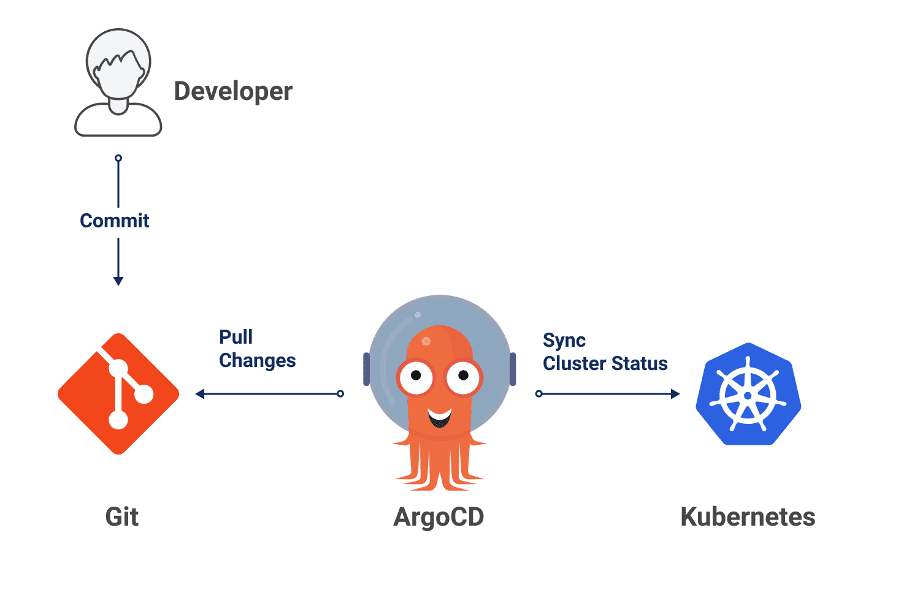
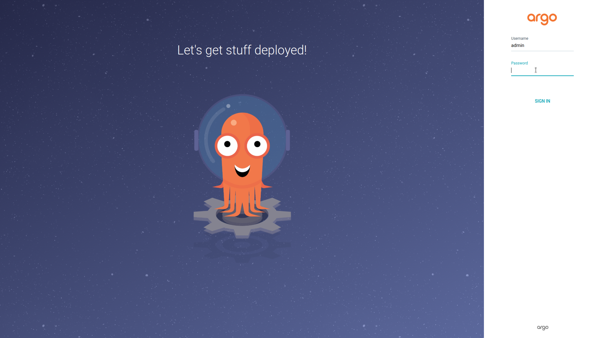
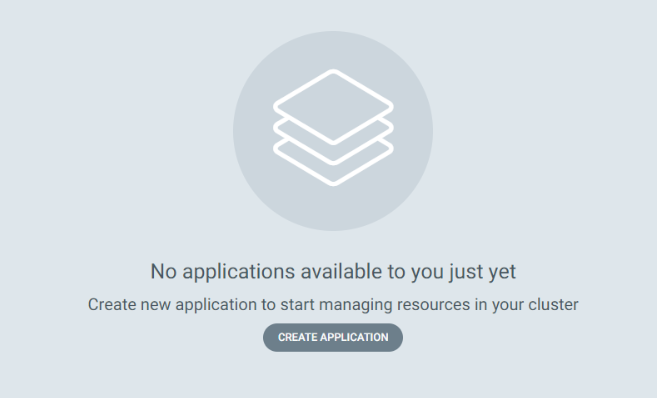
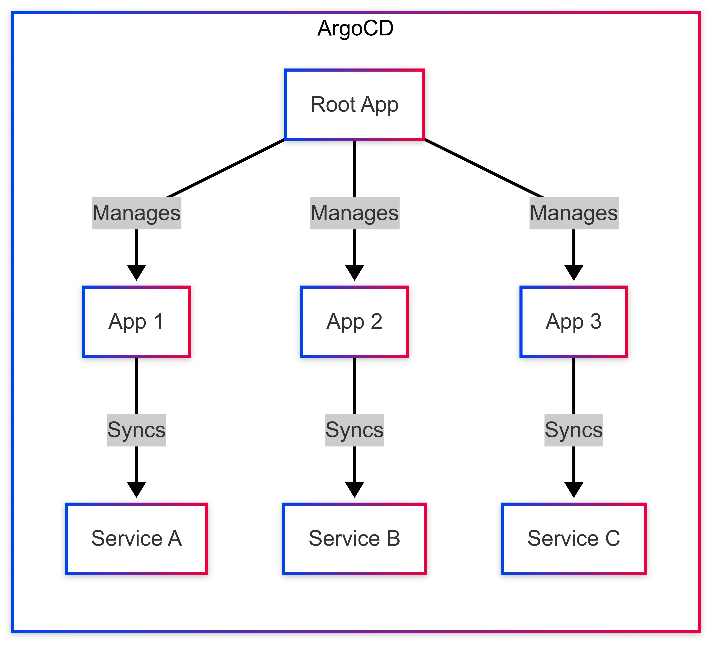
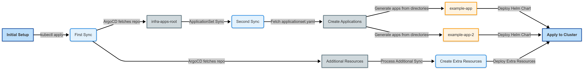

## Overview

In the [previous post](/posts/homelab-k8s-setup/), we set up a homelab Kubernetes cluster using Dell OptiPlex Micro machines and completed the basic configuration. This post covers installing ArgoCD, a GitOps tool for declaratively managing all cluster components from a Git repository, and applying the App of Apps pattern to build a scalable infrastructure management system.



## Understanding GitOps

> **What is GitOps?**
>
> GitOps is an operational model first proposed by Alexis Richardson of Weaveworks in 2017. It uses a Git repository as the Single Source of Truth for infrastructure and application configurations. All infrastructure changes are tracked through Git commits, reviewed via Pull Requests, and reflected in the actual environment through automated processes, enabling infrastructure to be managed like code.

Traditional infrastructure management involved administrators directly connecting to servers to execute commands or change settings through consoles. This approach had problems including difficulty tracking change history, complex root cause analysis and recovery when failures occurred due to mistakes, and difficulty maintaining consistency across multiple environments. GitOps addresses these issues by defining all infrastructure configuration as code, version controlling it in Git repositories, and having automated tools continuously compare the Git repository state with the actual cluster state, automatically synchronizing when differences occur.

### Core Principles of GitOps

The GitOps methodology is based on four core principles:

- **Declarative**: Define the desired state of the system declaratively rather than imperatively, storing it in a Git repository in the form of "this is what it should be." Kubernetes YAML manifests are a prime example.
- **Versioned**: All changes are recorded as Git commits, allowing tracking of who changed what, when, and why. When problems occur, you can immediately restore to a previous state by rolling back to a specific commit.
- **Automatically Applied**: Approved changes are automatically applied to the system without manual intervention, preventing human error and increasing deployment speed.
- **Continuously Reconciled**: Software agents continuously compare the desired state defined in the Git repository with the actual system state, automatically adjusting when differences occur to prevent drift.

### Benefits of GitOps

Adopting the GitOps approach provides the following advantages:

- **Audit Trail**: All infrastructure changes are recorded in Git history, which is useful for compliance audits and failure root cause analysis.
- **Enhanced Collaboration**: The code review process through Pull Requests can also be applied to infrastructure changes, enabling knowledge sharing and quality improvement among team members.
- **Easier Disaster Recovery**: Since the entire infrastructure configuration is stored as code in the Git repository, the same state can be quickly reconstructed in a new environment during cluster failures.
- **Environment Consistency**: Managing development, staging, and production environment configurations from the same codebase minimizes problems caused by environment differences.

## Introduction to ArgoCD

> **What is ArgoCD?**
>
> ArgoCD is a declarative GitOps continuous deployment tool for Kubernetes. It was developed by Intuit and released as open source in 2018, and is now widely used as a graduated project of the CNCF (Cloud Native Computing Foundation). It automatically synchronizes Kubernetes manifests defined in Git repositories to clusters and provides functionality for visually monitoring application status through a web UI and CLI.


ArgoCD uses a Pull-based deployment model. Unlike the Push model where external CI systems directly access clusters for deployment, ArgoCD inside the cluster continuously polls Git repositories to detect and apply changes. This Pull model has advantages including higher security by not exposing cluster credentials externally, and easier deployment to clusters behind network firewalls.

### Core Components of ArgoCD

ArgoCD consists of several components, each performing the following roles:

- **API Server**: The central component that handles all requests through web UI, CLI, and gRPC/REST API, and manages authentication and authorization.
- **Repository Server**: Responsible for fetching manifests from Git repositories and running template tools like Helm, Kustomize, and Jsonnet to generate final Kubernetes resources.
- **Application Controller**: The core controller that continuously compares the desired state defined in Git repositories with the actual cluster state, performing synchronization when differences occur.
- **Dex**: An OpenID Connect (OIDC) provider that supports SSO (Single Sign-On) integration, enabling connection with external authentication systems like GitHub, GitLab, and LDAP.
- **Redis**: An in-memory data store used for application state caching and session management.

### Core Concepts in ArgoCD

There are two core concepts to understand when using ArgoCD:

- **Application**: The basic unit of ArgoCD that defines a group of Kubernetes resources. It connects a source (Git repository path) with a destination (Kubernetes cluster and namespace) to specify which manifests to deploy where.
- **Project**: A policy container that logically groups multiple Applications and restricts access permissions, allowed source repositories, and deployable clusters and namespaces. Used for resource isolation and security in multi-tenant environments.

## Installing ArgoCD

ArgoCD can be installed in several ways, but this guide uses Helm, the Kubernetes package manager.

> **What is Helm?**
>
> Helm is a package manager for Kubernetes applications. It was first developed by Deis (now Microsoft) in 2015 and is currently maintained as a CNCF graduated project. It defines complex Kubernetes applications in a package format called "Charts," can apply different settings per environment through templates and values files, and performs a role similar to apt on Linux or Homebrew on macOS in the Kubernetes environment.


### Installing Helm

First, install Helm:

```bash
curl -fsSL -o get_helm.sh https://raw.githubusercontent.com/helm/helm/main/scripts/get-helm-3
chmod 700 get_helm.sh
./get_helm.sh
```

This command downloads and executes the official Helm installation script, which automatically detects the operating system and installs the appropriate binary. After installation is complete, verify the version with the following command:

```bash
helm version
```

```
version.BuildInfo{Version:"v3.12.0", GitCommit:"...", GitTreeState:"clean", GoVersion:"go1.20.4"}
```

### Creating the ArgoCD Namespace

Create a dedicated namespace for ArgoCD:

```bash
kubectl create namespace argocd
```

```
namespace/argocd created
```

### Installing the ArgoCD Helm Chart

Add the official ArgoCD Helm chart repository and proceed with installation:

```bash
helm repo add argo https://argoproj.github.io/argo-helm
helm repo update
```

Install ArgoCD:

```bash
helm upgrade --install argocd argo/argo-cd --namespace argocd
```

The `upgrade --install` option is an idempotent command that upgrades if ArgoCD is already installed, or installs new if not, making it safe to run repeatedly. When installation is complete, the following message is displayed:

```
Release "argocd" does not exist. Installing it now.
NAME: argocd
LAST DEPLOYED: Tue Feb 25 12:34:56 2025
NAMESPACE: argocd
STATUS: deployed
REVISION: 1
```

### Verifying Installation

Check the Pod status to verify all components are running properly:

```bash
kubectl get pods -n argocd
```

```
NAME                                               READY   STATUS    RESTARTS   AGE
argocd-application-controller-5f8c95f7b8-5xglw     1/1     Running   0          5m
argocd-dex-server-7589cfcbb9-ntzwx                 1/1     Running   0          5m
argocd-redis-74cb89f446-c6jsb                      1/1     Running   0          5m
argocd-repo-server-6dddb4b65d-gx9vh                1/1     Running   0          5m
argocd-server-54f988d66b-l69zc                     1/1     Running   0          5m
```

If all Pods are in `Running` status and the `READY` column shows normal, ArgoCD has been successfully installed.

### Retrieving the Initial Admin Password

The initial admin password for logging into the ArgoCD web UI is stored in a Kubernetes secret and can be retrieved with the following command:

```bash
kubectl -n argocd get secret argocd-initial-admin-secret -o jsonpath="{.data.password}" | base64 -d; echo
```

This command extracts and decodes the base64-encoded password from the secret. The output password is a randomly generated value, so be sure to record it and change it after logging in for security purposes.

### Accessing the Web UI

Set up port forwarding to access the ArgoCD web UI:

```bash
kubectl port-forward svc/argocd-server -n argocd 8080:443
```

```
Forwarding from 127.0.0.1:8080 -> 8080
Forwarding from [::1]:8080 -> 8080
```

Access `https://localhost:8080` in a web browser to see the ArgoCD login screen. ArgoCD uses a self-signed certificate by default, so the browser may display a security warning. In development environments, you can safely ignore the warning and proceed.



Enter the username `admin` and the initial password retrieved earlier to log in and view the ArgoCD dashboard.



## Designing the GitOps Repository Structure

To effectively utilize ArgoCD, you need to systematically design the Git repository structure. This guide adopts a structure that separates concerns using two Git repositories:

- **app-of-apps repository**: Repository defining the top-level bootstrap application, managing the list of applications to deploy to the cluster and their settings.
- **k8s-resource repository**: Repository containing actual Kubernetes resources and Helm charts, managing the specific configuration of each application.

This separation structure reduces management complexity by separating bootstrap logic from actual resource definitions, and is advantageous for security management as different access permissions can be set for each repository.

### App of Apps Pattern

> **What is the App of Apps Pattern?**
>
> The App of Apps pattern is a design pattern for hierarchically managing multiple applications in ArgoCD. It has a structure where one root Application creates and manages multiple child Applications. Using this pattern provides excellent scalability since you only need to add a directory to the Git repository when adding new applications, and management is easy since you can understand the entire cluster configuration from a single entry point.



The operation flow of the App of Apps pattern is as follows:

1. **Root Application Creation**: The administrator applies the root Application manifest to the cluster.
2. **Child Application Creation**: The root Application references the Git repository and automatically creates child Applications.
3. **Actual Resource Deployment**: Each child Application deploys the manifests from its referenced Git path to the cluster.

### app-of-apps Repository Structure

The first repository is structured as follows:

```
app-of-apps/
├── Chart.yaml
├── templates/
│   └── infra-apps-root.yaml
└── values.yaml
```

This repository follows the Helm chart format. The `infra-apps-root.yaml` file in the `templates/` directory defines an ArgoCD Application that references the ApplicationSet in the second repository.

### k8s-resource Repository Structure

The second repository is structured as follows:

```
k8s-resource/
├── applicationset.yaml
└── apps/
    ├── example-app/
    │   ├── Chart.yaml
    │   ├── templates/
    │   └── values.yaml
    └── another-app/
        ├── Chart.yaml
        ├── templates/
        └── values.yaml
```

In this structure, each subdirectory under the `apps/` directory represents one application, and the ApplicationSet automatically detects these directories and creates ArgoCD Applications.

## Configuring ArgoCD Applications

### Creating the Root Application

Save the following manifest as the `app-of-apps.yaml` file:

```yaml
apiVersion: argoproj.io/v1alpha1
kind: Application
metadata:
    name: app-of-apps
    namespace: argocd
spec:
    project: default
    source:
        repoURL: https://github.com/injunweb/app-of-apps.git
        targetRevision: HEAD
        path: .
    destination:
        server: https://kubernetes.default.svc
        namespace: argocd
    syncPolicy:
        automated:
            prune: true
            selfHeal: true
        syncOptions:
            - CreateNamespace=true
```

This Application uses the root directory of the `app-of-apps` repository as its source. The `syncPolicy.automated` setting automatically detects changes in the Git repository and applies them to the cluster. `prune: true` automatically deletes resources from the cluster that were deleted from the Git repository, and `selfHeal: true` automatically restores resources manually changed in the cluster to the Git repository state.

Apply to the cluster:

```bash
kubectl apply -f app-of-apps.yaml
```

```
application.argoproj.io/app-of-apps created
```

### Configuring the infra-apps-root Application

The `templates/infra-apps-root.yaml` file in the `app-of-apps` repository is configured as follows:

```yaml
apiVersion: argoproj.io/v1alpha1
kind: Application
metadata:
    name: infra-apps-root
    namespace: argocd
spec:
    project: default
    source:
        repoURL: https://github.com/injunweb/k8s-resource.git
        targetRevision: HEAD
        path: .
        directory:
            recurse: false
            include: "applicationset.yaml"
    destination:
        server: {{ .Values.spec.destination.server }}
        namespace: argocd
    syncPolicy:
        automated:
            prune: true
            selfHeal: true
        syncOptions:
            - CreateNamespace=true
```

This Application fetches and applies only the `applicationset.yaml` file from the root directory of the `k8s-resource` repository. The `directory.include` setting allows selective inclusion of specific files.

### Configuring the ApplicationSet

> **What is ApplicationSet?**
>
> ApplicationSet is an ArgoCD feature that uses templates and Generators to automatically create and manage multiple Applications. It can dynamically create Applications based on Git repository directory structures, cluster lists, external data sources, and more. It is useful for managing large-scale multi-cluster environments or many microservices, allowing dozens of Applications to be automatically created and maintained with a single definition.

The `applicationset.yaml` file in the `k8s-resource` repository is configured as follows:

```yaml
apiVersion: argoproj.io/v1alpha1
kind: ApplicationSet
metadata:
    name: infra-apps
    namespace: argocd
spec:
    generators:
        - git:
              repoURL: https://github.com/injunweb/k8s-resource.git
              revision: HEAD
              directories:
                  - path: apps/*
    template:
        metadata:
            name: "{{path.basename}}"
            namespace: argocd
        spec:
            project: default
            source:
                repoURL: https://github.com/injunweb/k8s-resource.git
                targetRevision: HEAD
                path: "{{path}}"
            destination:
                server: https://kubernetes.default.svc
                namespace: "{{path.basename}}"
            syncPolicy:
                automated:
                    prune: true
                    selfHeal: true
                syncOptions:
                    - ServerSideApply=true
                    - CreateNamespace=true
```

This ApplicationSet uses a Git generator to find all directories matching the `apps/*` pattern and automatically creates an ArgoCD Application for each directory. `{{path.basename}}` is a template variable that references the directory name, used as both the application name and namespace.

The operation of this configuration is as follows:

1. **Directory Discovery**: The Git generator finds all subdirectories under the `apps/` directory.
2. **Application Creation**: Applies the template to each found directory to create an ArgoCD Application.
3. **Automatic Synchronization**: Each created Application deploys the Helm charts or manifests from its directory to the cluster.
4. **Dynamic Management**: When a new folder is added to the `apps/` directory, a new Application is automatically created. When a folder is deleted, the corresponding Application is also automatically deleted.

## Complete Workflow

Once all configuration is complete, the GitOps workflow operates as follows:



1. **Initial Bootstrap**: When the administrator applies `app-of-apps.yaml` to the cluster, the root Application is created.
2. **First Synchronization**: The root Application synchronizes the `app-of-apps` repository to create the `infra-apps-root` Application.
3. **Second Synchronization**: The `infra-apps-root` Application synchronizes the `applicationset.yaml` from the `k8s-resource` repository to create the ApplicationSet.
4. **Third Synchronization**: The ApplicationSet creates individual Applications for each folder in the `apps/` directory, and each Application deploys actual Kubernetes resources.

From then on, when you want to deploy a new application, simply add a new folder to the `apps/` directory in the `k8s-resource` repository and commit. ArgoCD will automatically detect and deploy it. When you want to change settings for an existing application, simply modify the files in that directory and commit, and the changes are automatically reflected.

## Conclusion

In this post, we installed ArgoCD on our homelab Kubernetes cluster and applied the App of Apps pattern to build a GitOps-based infrastructure management environment. All cluster configurations can now be declaratively managed from Git repositories, and changes are automatically reflected in the cluster. This GitOps-based system serves as the foundation for installing and managing various components covered in subsequent posts in this series, including storage, networking, and monitoring.

[Next Post: Homelab Kubernetes #3 - Distributed Storage with Longhorn](/posts/homelab-k8s-storage/)
