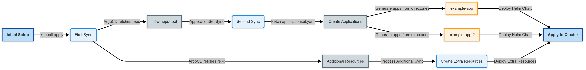

## 개요

[이전 글](/posts/homelab-k8s-setup/)에서는 Dell OptiPlex Micro를 활용하여 홈랩 쿠버네티스 클러스터를 구성하고 기본 설정을 완료했다. 이번 글에서는 클러스터의 모든 구성요소를 Git 저장소에서 선언적으로 관리하기 위해 GitOps 도구인 ArgoCD를 설치하고 App of Apps 패턴을 적용하여 확장 가능한 인프라 관리 체계를 구축하는 방법을 다룬다.


## GitOps의 이해

> **GitOps란?**
>
> GitOps는 2017년 Weaveworks의 Alexis Richardson이 처음 제안한 운영 모델로, Git 저장소를 인프라와 애플리케이션 구성의 단일 진실 공급원(Single Source of Truth)으로 활용하는 방식이며, 모든 인프라 변경 사항을 Git 커밋으로 추적하고 Pull Request를 통해 검토한 후 자동화된 프로세스를 통해 실제 환경에 반영함으로써 인프라를 코드처럼 관리할 수 있게 한다.

전통적인 인프라 관리 방식에서는 관리자가 서버에 직접 접속하여 명령어를 실행하거나 콘솔에서 설정을 변경하는 방식을 사용했는데, 이러한 방식은 변경 이력을 추적하기 어렵고 실수로 인한 장애 발생 시 원인 파악과 복구가 복잡하며 여러 환경 간의 일관성을 유지하기 어렵다는 문제가 있었다. GitOps는 이러한 문제를 해결하기 위해 모든 인프라 구성을 코드로 정의하고 Git 저장소에서 버전 관리하며, 자동화된 도구가 Git 저장소의 상태와 실제 클러스터의 상태를 지속적으로 비교하여 차이가 발생하면 자동으로 동기화하는 방식으로 운영한다.

### GitOps의 핵심 원칙

GitOps 방법론은 네 가지 핵심 원칙을 기반으로 한다:

- **선언적 정의(Declarative)**: 시스템의 원하는 상태를 명령형이 아닌 선언형으로 정의하여 "이 상태가 되어야 한다"는 형태로 Git 저장소에 저장하며, 쿠버네티스의 YAML 매니페스트가 대표적인 예이다.
- **버전 관리(Versioned)**: 모든 변경 사항이 Git 커밋으로 기록되어 누가, 언제, 무엇을, 왜 변경했는지 추적할 수 있으며, 문제 발생 시 특정 커밋으로 롤백하여 이전 상태로 즉시 복구할 수 있다.
- **자동 적용(Automatically Applied)**: 승인된 변경 사항은 수동 개입 없이 자동으로 시스템에 적용되어 휴먼 에러를 방지하고 배포 속도를 높인다.
- **지속적 조정(Continuously Reconciled)**: 소프트웨어 에이전트가 Git 저장소에 정의된 원하는 상태와 실제 시스템 상태를 지속적으로 비교하고, 차이가 발생하면 자동으로 조정하여 드리프트(drift)를 방지한다.

### GitOps의 장점

GitOps 방식을 도입하면 다음과 같은 이점을 얻을 수 있다:

- **감사 추적성(Audit Trail)**: 모든 인프라 변경 사항이 Git 히스토리에 기록되어 규정 준수 감사나 장애 원인 분석 시 유용하게 활용할 수 있다.
- **협업 강화**: Pull Request를 통한 코드 리뷰 프로세스를 인프라 변경에도 적용할 수 있어 팀원 간의 지식 공유와 품질 향상이 가능하다.
- **재해 복구 용이성**: Git 저장소에 전체 인프라 구성이 코드로 저장되어 있으므로 클러스터 장애 시 새로운 환경에서 동일한 상태를 빠르게 재구성할 수 있다.
- **환경 일관성**: 개발, 스테이징, 프로덕션 환경의 구성을 동일한 코드베이스에서 관리하여 환경 간 차이로 인한 문제를 최소화할 수 있다.

## ArgoCD 소개

> **ArgoCD란?**
>
> ArgoCD는 쿠버네티스를 위한 선언적 GitOps 연속 배포 도구로, 2018년 Intuit에서 개발하여 오픈소스로 공개되었으며 현재 CNCF(Cloud Native Computing Foundation)의 졸업 프로젝트로 널리 사용되고 있다. Git 저장소에 정의된 쿠버네티스 매니페스트를 자동으로 클러스터에 동기화하고, 웹 UI와 CLI를 통해 애플리케이션 상태를 시각적으로 모니터링할 수 있는 기능을 제공한다.


ArgoCD는 Pull 기반의 배포 모델을 사용하는데, 이는 외부 CI 시스템이 클러스터에 직접 접근하여 배포하는 Push 모델과 달리 클러스터 내부의 ArgoCD가 Git 저장소를 지속적으로 폴링하여 변경 사항을 감지하고 적용하는 방식이다. 이러한 Pull 모델은 클러스터의 자격 증명을 외부에 노출하지 않아 보안성이 높고, 네트워크 방화벽 뒤에 있는 클러스터에도 쉽게 배포할 수 있다는 장점이 있다.

### ArgoCD의 핵심 구성요소

ArgoCD는 여러 컴포넌트로 구성되어 있으며 각각 다음과 같은 역할을 수행한다:

- **API Server**: 웹 UI, CLI, gRPC/REST API를 통한 모든 요청을 처리하고 인증 및 권한 관리를 담당하는 중앙 컴포넌트이다.
- **Repository Server**: Git 저장소에서 매니페스트를 가져오고 Helm, Kustomize, Jsonnet 등의 템플릿 도구를 실행하여 최종 쿠버네티스 리소스를 생성하는 역할을 한다.
- **Application Controller**: Git 저장소에 정의된 원하는 상태와 클러스터의 실제 상태를 지속적으로 비교하고, 차이가 발생하면 동기화 작업을 수행하는 핵심 컨트롤러이다.
- **Dex**: OpenID Connect(OIDC) 프로바이더로서 SSO(Single Sign-On) 통합을 지원하여 GitHub, GitLab, LDAP 등 외부 인증 시스템과 연동할 수 있게 한다.
- **Redis**: 애플리케이션 상태 캐싱과 세션 관리에 사용되는 인메모리 데이터 스토어이다.

### ArgoCD의 핵심 개념

ArgoCD를 사용하기 위해 이해해야 할 두 가지 핵심 개념이 있다:

- **Application**: 쿠버네티스 리소스 그룹을 정의하는 ArgoCD의 기본 단위로, 소스(Git 저장소 경로)와 대상(쿠버네티스 클러스터 및 네임스페이스)을 연결하여 어떤 매니페스트를 어디에 배포할지 지정한다.
- **Project**: 여러 Application을 논리적으로 그룹화하고 접근 권한, 허용되는 소스 저장소, 배포 가능한 클러스터 및 네임스페이스 등을 제한하는 정책 컨테이너로, 멀티 테넌트 환경에서 리소스 격리와 보안을 위해 사용된다.

## ArgoCD 설치

ArgoCD는 여러 방식으로 설치할 수 있지만, 이 글에서는 쿠버네티스 패키지 관리자인 Helm을 사용하여 설치한다.

> **Helm이란?**
>
> Helm은 쿠버네티스 애플리케이션의 패키지 관리자로, 2015년 Deis(현재 Microsoft)에서 처음 개발되어 현재 CNCF 졸업 프로젝트로 유지보수되고 있다. 복잡한 쿠버네티스 애플리케이션을 "차트(Chart)"라는 패키지 형식으로 정의하고, 템플릿과 values 파일을 통해 환경별로 다른 설정을 적용할 수 있으며, 리눅스의 apt나 macOS의 Homebrew와 유사한 역할을 쿠버네티스 환경에서 수행한다.


### Helm 설치

먼저 Helm을 설치한다:

```bash
curl -fsSL -o get_helm.sh https://raw.githubusercontent.com/helm/helm/main/scripts/get-helm-3
chmod 700 get_helm.sh
./get_helm.sh
```

이 명령어는 Helm 공식 설치 스크립트를 다운로드하여 실행하며, 스크립트가 운영체제를 자동으로 감지하여 적절한 바이너리를 설치한다. 설치가 완료되면 다음 명령어로 버전을 확인한다:

```bash
helm version
```

```
version.BuildInfo{Version:"v3.12.0", GitCommit:"...", GitTreeState:"clean", GoVersion:"go1.20.4"}
```

### ArgoCD 네임스페이스 생성

ArgoCD를 위한 전용 네임스페이스를 생성한다:

```bash
kubectl create namespace argocd
```

```
namespace/argocd created
```

### ArgoCD Helm 차트 설치

ArgoCD의 공식 Helm 차트 저장소를 추가하고 설치를 진행한다:

```bash
helm repo add argo https://argoproj.github.io/argo-helm
helm repo update
```

ArgoCD를 설치한다:

```bash
helm upgrade --install argocd argo/argo-cd --namespace argocd
```

`upgrade --install` 옵션은 ArgoCD가 이미 설치되어 있으면 업그레이드하고, 설치되어 있지 않으면 새로 설치하는 멱등성 있는 명령어로 동일한 명령어를 반복 실행해도 안전하다. 설치가 완료되면 다음과 같은 메시지가 출력된다:

```
Release "argocd" does not exist. Installing it now.
NAME: argocd
LAST DEPLOYED: Tue Feb 25 12:34:56 2025
NAMESPACE: argocd
STATUS: deployed
REVISION: 1
```

### 설치 확인

Pod 상태를 확인하여 모든 컴포넌트가 정상적으로 실행되고 있는지 확인한다:

```bash
kubectl get pods -n argocd
```

```
NAME                                               READY   STATUS    RESTARTS   AGE
argocd-application-controller-5f8c95f7b8-5xglw     1/1     Running   0          5m
argocd-dex-server-7589cfcbb9-ntzwx                 1/1     Running   0          5m
argocd-redis-74cb89f446-c6jsb                      1/1     Running   0          5m
argocd-repo-server-6dddb4b65d-gx9vh                1/1     Running   0          5m
argocd-server-54f988d66b-l69zc                     1/1     Running   0          5m
```

모든 Pod가 `Running` 상태이고 `READY` 열이 정상이면 ArgoCD가 성공적으로 설치된 것이다.

### 초기 관리자 비밀번호 확인

ArgoCD 웹 UI에 로그인하기 위한 초기 관리자 비밀번호는 쿠버네티스 시크릿에 저장되어 있으며 다음 명령어로 확인할 수 있다:

```bash
kubectl -n argocd get secret argocd-initial-admin-secret -o jsonpath="{.data.password}" | base64 -d; echo
```

이 명령어는 시크릿에서 base64로 인코딩된 비밀번호를 추출하고 디코딩하여 출력한다. 출력된 비밀번호는 임의로 생성된 값이므로 반드시 기록해두고 보안을 위해 로그인 후 변경하는 것을 권장한다.

### 웹 UI 접속

ArgoCD 웹 UI에 접속하기 위해 포트 포워딩을 설정한다:

```bash
kubectl port-forward svc/argocd-server -n argocd 8080:443
```

```
Forwarding from 127.0.0.1:8080 -> 8080
Forwarding from [::1]:8080 -> 8080
```

웹 브라우저에서 `https://localhost:8080`에 접속하면 ArgoCD 로그인 화면이 나타난다. ArgoCD는 기본적으로 자체 서명 인증서를 사용하므로 브라우저에서 보안 경고가 표시될 수 있는데, 개발 환경에서는 경고를 무시하고 진행해도 무방하다.


사용자 이름 `admin`과 앞서 확인한 초기 비밀번호를 입력하여 로그인하면 ArgoCD 대시보드가 표시된다.


## GitOps 저장소 구조 설계

ArgoCD를 효과적으로 활용하기 위해서는 Git 저장소 구조를 체계적으로 설계해야 한다. 이 글에서는 두 개의 Git 저장소를 사용하여 관심사를 분리하는 구조를 채택한다:

- **app-of-apps 저장소**: 최상위 부트스트랩 애플리케이션을 정의하는 저장소로, 클러스터에 배포할 애플리케이션 목록과 설정을 관리한다.
- **k8s-resource 저장소**: 실제 쿠버네티스 리소스와 Helm 차트를 포함하는 저장소로, 각 애플리케이션의 구체적인 구성을 관리한다.

이러한 분리 구조는 부트스트랩 로직과 실제 리소스 정의를 분리하여 관리의 복잡성을 줄이고, 각 저장소에 대한 접근 권한을 다르게 설정할 수 있어 보안 관리에도 유리하다.

### App of Apps 패턴

> **App of Apps 패턴이란?**
>
> App of Apps 패턴은 ArgoCD에서 여러 애플리케이션을 계층적으로 관리하기 위한 설계 패턴으로, 하나의 루트 Application이 여러 하위 Application을 생성하고 관리하는 구조를 가진다. 이 패턴을 사용하면 새로운 애플리케이션을 추가할 때 Git 저장소에 디렉토리만 추가하면 되므로 확장성이 뛰어나고, 전체 클러스터 구성을 단일 진입점에서 파악할 수 있어 관리가 용이하다.


App of Apps 패턴의 동작 흐름은 다음과 같다:

1. **루트 Application 생성**: 관리자가 루트 Application 매니페스트를 클러스터에 적용한다.
2. **하위 Application 생성**: 루트 Application이 Git 저장소를 참조하여 하위 Application들을 자동으로 생성한다.
3. **실제 리소스 배포**: 각 하위 Application이 자신이 참조하는 Git 경로의 매니페스트를 클러스터에 배포한다.

### app-of-apps 저장소 구조

첫 번째 저장소는 다음과 같은 구조로 구성한다:

```
app-of-apps/
├── Chart.yaml
├── templates/
│   └── infra-apps-root.yaml
└── values.yaml
```

이 저장소는 Helm 차트 형식을 따르며, `templates/` 디렉토리에 있는 `infra-apps-root.yaml` 파일이 두 번째 저장소의 ApplicationSet을 참조하는 ArgoCD Application을 정의한다.

### k8s-resource 저장소 구조

두 번째 저장소는 다음과 같은 구조로 구성한다:

```
k8s-resource/
├── applicationset.yaml
└── apps/
    ├── example-app/
    │   ├── Chart.yaml
    │   ├── templates/
    │   └── values.yaml
    └── another-app/
        ├── Chart.yaml
        ├── templates/
        └── values.yaml
```

이 구조에서 `apps/` 디렉토리 아래의 각 하위 디렉토리가 하나의 애플리케이션을 나타내며, ApplicationSet이 이 디렉토리들을 자동으로 감지하여 ArgoCD Application을 생성한다.

## ArgoCD Application 구성

### 루트 Application 생성

다음 매니페스트를 `app-of-apps.yaml` 파일로 저장한다:

```yaml
apiVersion: argoproj.io/v1alpha1
kind: Application
metadata:
    name: app-of-apps
    namespace: argocd
spec:
    project: default
    source:
        repoURL: https://github.com/injunweb/app-of-apps.git
        targetRevision: HEAD
        path: .
    destination:
        server: https://kubernetes.default.svc
        namespace: argocd
    syncPolicy:
        automated:
            prune: true
            selfHeal: true
        syncOptions:
            - CreateNamespace=true
```

이 Application은 `app-of-apps` 저장소의 루트 디렉토리를 소스로 사용하며, `syncPolicy.automated` 설정으로 Git 저장소의 변경 사항을 자동으로 감지하여 클러스터에 적용한다. `prune: true`는 Git 저장소에서 삭제된 리소스를 클러스터에서도 자동으로 삭제하고, `selfHeal: true`는 클러스터에서 수동으로 변경된 리소스를 Git 저장소의 상태로 자동 복구한다.

클러스터에 적용한다:

```bash
kubectl apply -f app-of-apps.yaml
```

```
application.argoproj.io/app-of-apps created
```

### infra-apps-root Application 구성

`app-of-apps` 저장소의 `templates/infra-apps-root.yaml` 파일은 다음과 같이 구성한다:

```yaml
apiVersion: argoproj.io/v1alpha1
kind: Application
metadata:
    name: infra-apps-root
    namespace: argocd
spec:
    project: default
    source:
        repoURL: https://github.com/injunweb/k8s-resource.git
        targetRevision: HEAD
        path: .
        directory:
            recurse: false
            include: "applicationset.yaml"
    destination:
        server: {{ .Values.spec.destination.server }}
        namespace: argocd
    syncPolicy:
        automated:
            prune: true
            selfHeal: true
        syncOptions:
            - CreateNamespace=true
```

이 Application은 `k8s-resource` 저장소의 루트 디렉토리에서 `applicationset.yaml` 파일만 가져와 적용한다. `directory.include` 설정으로 특정 파일만 선택적으로 포함할 수 있다.

### ApplicationSet 구성

> **ApplicationSet이란?**
>
> ApplicationSet은 ArgoCD의 기능으로, 템플릿과 생성기(Generator)를 사용하여 여러 Application을 자동으로 생성하고 관리하는 컨트롤러이다. Git 저장소의 디렉토리 구조, 클러스터 목록, 외부 데이터 소스 등을 기반으로 동적으로 Application을 생성할 수 있어 대규모 멀티 클러스터 환경이나 많은 마이크로서비스를 관리할 때 유용하며, 단일 정의로 수십 개의 Application을 자동으로 생성하고 유지보수할 수 있다.

`k8s-resource` 저장소의 `applicationset.yaml` 파일은 다음과 같이 구성한다:

```yaml
apiVersion: argoproj.io/v1alpha1
kind: ApplicationSet
metadata:
    name: infra-apps
    namespace: argocd
spec:
    generators:
        - git:
              repoURL: https://github.com/injunweb/k8s-resource.git
              revision: HEAD
              directories:
                  - path: apps/*
    template:
        metadata:
            name: "{{path.basename}}"
            namespace: argocd
        spec:
            project: default
            source:
                repoURL: https://github.com/injunweb/k8s-resource.git
                targetRevision: HEAD
                path: "{{path}}"
            destination:
                server: https://kubernetes.default.svc
                namespace: "{{path.basename}}"
            syncPolicy:
                automated:
                    prune: true
                    selfHeal: true
                syncOptions:
                    - ServerSideApply=true
                    - CreateNamespace=true
```

이 ApplicationSet은 Git 생성기를 사용하여 `apps/*` 패턴에 맞는 모든 디렉토리를 찾고, 각 디렉토리에 대해 ArgoCD Application을 자동으로 생성한다. `{{path.basename}}`은 디렉토리 이름을 참조하는 템플릿 변수로, 애플리케이션 이름과 네임스페이스로 사용된다.

이 구성의 동작 방식은 다음과 같다:

1. **디렉토리 탐색**: Git 생성기가 `apps/` 디렉토리 아래의 모든 하위 디렉토리를 찾는다.
2. **Application 생성**: 찾은 각 디렉토리에 대해 템플릿을 적용하여 ArgoCD Application을 생성한다.
3. **자동 동기화**: 생성된 각 Application이 해당 디렉토리의 Helm 차트나 매니페스트를 클러스터에 배포한다.
4. **동적 관리**: `apps/` 디렉토리에 새 폴더를 추가하면 자동으로 새 Application이 생성되고, 폴더를 삭제하면 해당 Application도 자동으로 삭제된다.

## 전체 워크플로우

모든 구성이 완료되면 GitOps 워크플로우는 다음과 같이 동작한다:



1. **초기 부트스트랩**: 관리자가 `app-of-apps.yaml`을 클러스터에 적용하면 루트 Application이 생성된다.
2. **1차 동기화**: 루트 Application이 `app-of-apps` 저장소를 동기화하여 `infra-apps-root` Application을 생성한다.
3. **2차 동기화**: `infra-apps-root` Application이 `k8s-resource` 저장소의 `applicationset.yaml`을 동기화하여 ApplicationSet을 생성한다.
4. **3차 동기화**: ApplicationSet이 `apps/` 디렉토리의 각 폴더에 대해 개별 Application을 생성하고, 각 Application이 실제 쿠버네티스 리소스를 배포한다.

이후에는 새로운 애플리케이션을 배포하고 싶을 때 `k8s-resource` 저장소의 `apps/` 디렉토리에 새 폴더를 추가하고 커밋하면 ArgoCD가 자동으로 감지하여 배포한다. 기존 애플리케이션의 설정을 변경하고 싶을 때도 해당 디렉토리의 파일을 수정하고 커밋하면 자동으로 반영된다.

## 마치며

이번 글에서는 홈랩 쿠버네티스 클러스터에 ArgoCD를 설치하고 App of Apps 패턴을 적용하여 GitOps 기반의 인프라 관리 환경을 구축했다. 이제 모든 클러스터 구성을 Git 저장소에서 선언적으로 관리할 수 있으며, 변경 사항은 자동으로 클러스터에 반영된다. 이 GitOps 기반 체계는 이후 시리즈에서 다룰 스토리지, 네트워크, 모니터링 등 다양한 구성요소를 설치하고 관리하는 기반이 된다.

[다음 글: 미니PC Kubernetes #3: Longhorn 스토리지](/posts/homelab-k8s-storage/)
