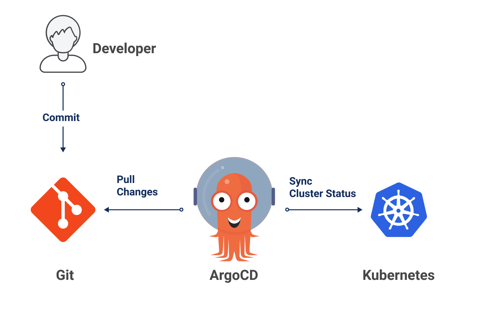

## 개요

이전 글에서는 홈랩 쿠버네티스 클러스터를 설치하고 기본 설정을 완료했다. 이번 글에서는 GitOps 방식으로 클러스터 구성요소들을 관리하기 위해 ArgoCD를 설치하고 구성하는 방법을 상세하게 다룬다. GitOps 방식은 코드로 인프라를 관리함으로써 버전 관리, 협업, 자동화 등 다양한 이점을 제공한다.

## GitOps란 무엇인가?

GitOps는 Git 저장소를 인프라와 애플리케이션 설정의 "단일 진실 공급원(Single Source of Truth)"으로 사용하는 운영 모델이다. 쉽게 말해, 모든 인프라 구성 정보를 Git 저장소에 코드로 저장하고, 이 코드가 자동으로 실제 환경에 반영되도록 하는 방식이다.



예를 들어, 데이터베이스 서버 설정을 변경하고 싶다면:

1. 기존 방식: 클러스터에 직접 접속하여 명령어 실행
2. GitOps 방식: Git 저장소의 설정 파일을 수정하고 커밋, 자동으로 클러스터에 적용됨

### GitOps의 주요 장점

이렇게 하면 몇 가지 큰 장점이 있다:

-   **이력 관리**: 모든 변경 사항이 Git 커밋으로 기록되어 누가, 언제, 무엇을 변경했는지 추적할 수 있다.
-   **롤백 용이성**: 문제가 발생했을 때 이전 버전으로 쉽게 되돌릴 수 있다. (예: "이전 설정으로 돌아가야 해요!" → 특정 커밋으로 롤백)
-   **협업 강화**: 개발자들이 Git을 통해 인프라 변경에 참여할 수 있다. (Pull Request 기반 검토 가능)
-   **자동화**: 수동 작업 없이 변경 사항이 자동으로 배포된다.

### GitOps의 주요 원칙

1. **선언적 정의**: 모든 시스템 구성은 "이렇게 되어야 한다"라는 형태로 Git 저장소에 정의된다.
2. **버전 관리**: 모든 변경사항은 Git을 통해서 추적되고 버전 관리된다.
3. **자동 적용**: 변경사항은 자동으로 시스템에 적용된다. (사람이 직접 명령어를 입력할 필요 없음)
4. **지속적 조정**: 시스템의 실제 상태와 Git에 정의된 상태가 다르면 자동으로 맞추어 조정한다.

## ArgoCD 소개

ArgoCD는 쿠버네티스를 위한 GitOps 도구다. 간단히 말해서, Git 저장소에 있는 쿠버네티스 매니페스트(YAML 파일)를 가져와서 클러스터에 자동으로 적용해주는 역할을 한다.


### ArgoCD가 하는 일

1. Git 저장소를 모니터링한다.
2. 변경 사항이 있으면 감지한다.
3. 변경된 매니페스트를 쿠버네티스 클러스터에 적용한다.
4. 클러스터 상태가 Git 저장소와 다르면 경고하거나 자동으로 조정한다.

### ArgoCD의 주요 개념

ArgoCD에서는 두 가지 핵심 개념이 있다:

-   **애플리케이션(Application)**: 하나의 쿠버네티스 리소스 집합으로, Git 저장소의 경로와 클러스터의 대상을 연결한다.

    예시: "웹 서버 배포"라는 애플리케이션은 GitHub의 `my-repo/webapp` 디렉토리에 있는 YAML 파일들을 클러스터의 `webapp` 네임스페이스에 배포한다.

-   **프로젝트(Project)**: 애플리케이션들을 그룹화하고 권한을 관리하는 논리적 단위다.

    예시: "백엔드 시스템", "프론트엔드 시스템" 등으로 프로젝트를 나눌 수 있다. 각 프로젝트에 다른 팀이 접근 권한을 가질 수 있다.

## ArgoCD 설치 가이드

### Step 1: Helm 설치

ArgoCD는 여러 방법으로 설치할 수 있지만, 여기서는 쿠버네티스 패키지 관리자인 Helm을 사용한다. Helm은 복잡한 애플리케이션을 쉽게 설치하고 관리할 수 있게 해주는 도구다.


> **Helm이란?**
>
> Helm은 쿠버네티스용 패키지 관리자다. 리눅스의 apt나 yum, macOS의 Homebrew와 비슷한 역할을 한다.
> 복잡한 쿠버네티스 애플리케이션을 "차트(Chart)"라는 패키지로 묶어서 쉽게 설치, 업그레이드, 삭제할 수 있게 해준다.
> Helm 차트는 여러 쿠버네티스 매니페스트 파일과 설정값들을 포함하고 있어, 한 번의 명령어로
> 복잡한 애플리케이션을 쿠버네티스에 배포할 수 있게 해준다.

먼저 Helm을 설치한다:

```bash
curl -fsSL -o get_helm.sh https://raw.githubusercontent.com/helm/helm/main/scripts/get-helm-3
chmod 700 get_helm.sh
./get_helm.sh
```

설치가 완료되었는지 확인한다:

```bash
helm version
```

버전 정보가 표시되면 Helm이 정상적으로 설치된 것이다. 다음과 비슷한 출력이 나타난다:

```
version.BuildInfo{Version:"v3.12.0", GitCommit:"...", GitTreeState:"clean", GoVersion:"go1.20.4"}
```

### Step 2: ArgoCD를 위한 네임스페이스 생성

쿠버네티스에서는 네임스페이스를 사용하여 리소스를 논리적으로 분리한다. ArgoCD를 위한 전용 네임스페이스를 만든다:

```bash
kubectl create namespace argocd
```

성공하면 `namespace/argocd created` 메시지가 출력된다.

### Step 3: ArgoCD Helm 차트 설치

이제 Helm을 사용하여 ArgoCD를 설치한다. 먼저 ArgoCD의 Helm 저장소(chart repository)를 추가한다:

```bash
helm repo add argo https://argoproj.github.io/argo-helm
helm repo update
```

그리고 ArgoCD를 설치한다:

```bash
helm upgrade --install argocd argo/argo-cd \
  --namespace argocd
```

`upgrade --install` 옵션은 이미 설치되어 있으면 업그레이드하고, 없으면 새로 설치한다는 의미다.
설치가 정상적으로 완료되면 다음과 비슷한 메시지가 표시된다:

```
Release "argocd" does not exist. Installing it now.
NAME: argocd
LAST DEPLOYED: Tue Feb 25 12:34:56 2025
NAMESPACE: argocd
STATUS: deployed
REVISION: 1
TEST SUITE: None
```

### Step 4: 설치 확인

설치가 완료되었는지 확인하기 위해 Pod의 상태를 확인한다:

```bash
kubectl get pods -n argocd
```

다음과 같은 Pod들이 모두 `Running` 상태여야 한다:

```
NAME                                             READY   STATUS    RESTARTS   AGE
argocd-application-controller-5f8c95f7b8-5xglw   1/1     Running   0          5m
argocd-dex-server-7589cfcbb9-ntzwx               1/1     Running   0          5m
argocd-redis-74cb89f446-c6jsb                    1/1     Running   0          5m
argocd-repo-server-6dddb4b65d-gx9vh              1/1     Running   0          5m
argocd-server-54f988d66b-l69zc                   1/1     Running   0          5m
```

각 Pod의 역할:

-   **application-controller**: Git 저장소와 클러스터 상태를 비교하고 조정하는 핵심 컴포넌트
-   **dex-server**: 인증을 담당하는 서버 (SSO 통합 등)
-   **redis**: 캐시 및 상태 저장용 데이터베이스
-   **repo-server**: Git 저장소에서 매니페스트를 가져오는 서버
-   **server**: 웹 UI와 API 서버

### Step 5: 초기 관리자 비밀번호 확인

ArgoCD에 처음 로그인하려면 초기 비밀번호가 필요하다. 기본 사용자 이름은 `admin`이며, 초기 비밀번호는 다음 명령어로 확인할 수 있다:

```bash
kubectl -n argocd get secret argocd-initial-admin-secret -o jsonpath="{.data.password}" | base64 -d; echo
```

이 명령어는 base64로 인코딩된 비밀번호를 디코딩하여 보여준다. 출력된 비밀번호는 랜덤하게 생성된 값이며, 나중에 웹 UI에서 변경할 수 있다.

예: `uLxMkS7H2L8A9jZ`와 같은 값이 출력된다.

⚠️ **중요**: 이 비밀번호는 반드시 기록해두어야 한다. 로그인 후 보안을 위해 변경하는 것을 권장한다.

### Step 6: 웹 UI 접속을 위한 포트포워딩

```bash
kubectl port-forward svc/argocd-server -n argocd 8080:443
```

이 명령어는 로컬 컴퓨터의 8080 포트를 ArgoCD 서버의 443 포트(HTTPS)로 연결한다. 명령어를 실행한 터미널을 열어둔 상태로 유지해야 한다. 다음과 같은 메시지가 표시된다:

```
Forwarding from 127.0.0.1:8080 -> 8080
Forwarding from [::1]:8080 -> 8080
```

## ArgoCD UI 접속 및 첫 설정

### Step 1: 웹 UI 접속

이제 웹 브라우저에서 `https://localhost:8080` 주소로 접속한다.

⚠️ **참고**: ArgoCD는 기본적으로 HTTPS를 사용하므로, 브라우저에서 "이 연결은 안전하지 않습니다"와 같은 인증서 오류가 발생할 수 있다. 이는 개발 환경에서는 무시하고 진행해도 된다. (고급 → 안전하지 않음 사이트로 이동)

로그인 화면에서 다음 정보를 입력한다:

-   사용자 이름: `admin`
-   비밀번호: 위 Step 5에서 확인한 초기 비밀번호


로그인에 성공하면 ArgoCD의 대시보드가 표시된다. 아직 애플리케이션을 구성하지 않았기 때문에 비어있을 것이다.


## GitOps 아키텍처 설계: 저장소 구조 설계하기

이제 GitOps 방식으로 클러스터를 관리하기 위한 Git 저장소 구조를 설계한다. 여기서는 두 개의 Git 저장소를 사용한다:

1. **app-of-apps 저장소**: 최상위 애플리케이션을 관리하는 저장소 (https://github.com/injunweb/app-of-apps)
2. **k8s-resource 저장소**: 실제 애플리케이션 구성을 관리하는 저장소 (https://github.com/injunweb/k8s-resource)

### "App of Apps" 패턴 소개

여러 애플리케이션을 효율적으로 관리하기 위해 "App of Apps" 패턴을 사용한다. 이 패턴은 다음과 같이 작동한다:

1. 하나의 "루트" 애플리케이션을 만든다.
2. 이 루트 애플리케이션이 여러 하위 애플리케이션을 관리한다.
3. 하위 애플리케이션이 실제 쿠버네티스 리소스를 배포한다.


이 패턴의 장점은 다음과 같다:

-   여러 애플리케이션을 한 번에 배포하고 관리할 수 있다.
-   새로운 애플리케이션을 추가할 때 Git 저장소만 수정하면 된다.
-   클러스터 전체 구성을 한눈에 파악할 수 있다.

### 저장소 1: app-of-apps 구조 설계

첫 번째 저장소(https://github.com/injunweb/app-of-apps)는 다음과 같은 구조로 구성한다:

```
app-of-apps/
├── Chart.yaml            # Helm 차트 정보
├── templates/
│   └── infra-apps-root.yaml  # 인프라 관련 helm chart를 동기화하는 애플리케이션
└── values.yaml           # 값 설정 파일
```

이 구조는 Helm 차트 형식을 따른다. `infra-apps-root.yaml` 파일은 두 번째 저장소(k8s-resource)의 ApplicationSet을 가리키는 ArgoCD 애플리케이션을 정의한다.

### Step 1: 루트 애플리케이션 설정

이제 app-of-apps 저장소를 ArgoCD에 등록하기 위한 매니페스트를 작성한다. 이 매니페스트를 `app-of-apps.yaml`로 저장한다:

```yaml
apiVersion: argoproj.io/v1alpha1
kind: Application
metadata:
    name: app-of-apps # 애플리케이션 이름
    namespace: argocd # ArgoCD가 설치된 네임스페이스
spec:
    project: default # ArgoCD 프로젝트 (기본값 사용)
    source:
        repoURL: https://github.com/injunweb/app-of-apps.git # 첫 번째 Git 저장소 URL
        targetRevision: HEAD # 최신 커밋 사용
        path: . # 저장소의 루트 디렉토리 사용
    destination:
        server: https://kubernetes.default.svc # 현재 클러스터 사용
        namespace: argocd # ArgoCD 네임스페이스에 배포
    syncPolicy:
        automated: # 자동 동기화 설정
            prune: true # 삭제된 리소스도 자동으로 제거
            selfHeal: true # 수동 변경된 리소스 자동 복구
        syncOptions:
            - CreateNamespace=true # 필요시 네임스페이스 자동 생성
```

이 매니페스트는 첫 번째 Git 저장소(app-of-apps)를 가리키며, 그 안의 Helm 차트를 적용한다.

다음 명령어로 이 매니페스트를 클러스터에 적용한다:

```bash
kubectl apply -f app-of-apps.yaml
```

성공하면 `application.argoproj.io/app-of-apps created` 메시지가 표시된다.

### Step 2: infra-apps-root 애플리케이션 설정

첫 번째 저장소(app-of-apps)의 `templates/infra-apps-root.yaml` 파일은 다음과 같이 구성한다:

```yaml
apiVersion: argoproj.io/v1alpha1
kind: Application
metadata:
    name: infra-apps-root # 두 번째 애플리케이션 이름
    namespace: argocd # ArgoCD 네임스페이스
spec:
    project: default
    source:
        repoURL: https://github.com/injunweb/k8s-resource.git # 두 번째 Git 저장소 URL
        targetRevision: HEAD
        path: . # 저장소의 루트 디렉토리
        directory:
            recurse: false # 하위 디렉토리 검색 안 함
            include: "applicationset.yaml" # applicationset.yaml 파일만 포함
    destination:
        server: {{ .Values.spec.destination.server }} # Helm 값에서 서버 주소 가져옴
        namespace: argocd
    syncPolicy:
        automated:
            prune: true
            selfHeal: true
        syncOptions:
            - CreateNamespace=true
```

이 매니페스트는 두 번째 Git 저장소(k8s-resource)를 가리키며, 그 중에서도 `applicationset.yaml` 파일만 가져온다.

### 저장소 2: k8s-resource 구조 설계

두 번째 저장소(https://github.com/injunweb/k8s-resource)는 다음과 같은 구조로 구성한다:

```
k8s-resource/
├── applicationset.yaml  # ApplicationSet 정의
└── apps/  # 실제 애플리케이션들이 위치하는 디렉토리
    ├── example-app/  # 첫 번째 애플리케이션
    │   ├── Chart.yaml  # 의존성을 정의한 Helm 차트
    │   ├── templates/  # 템플릿 디렉토리
    │   │   └── (재정의할 템플릿 파일들)
    │   └── values.yaml  # 값 설정 파일
    └── example-app-2/  # 두 번째 애플리케이션
        ├── Chart.yaml
        ├── templates/
        └── values.yaml
```

### Step 3: ApplicationSet 설정

ApplicationSet은 ArgoCD의 강력한 기능으로, 하나의 설정으로 여러 애플리케이션을 자동 생성할 수 있다.

> **ApplicationSet이란?**
>
> ApplicationSet은 여러 ArgoCD 애플리케이션을 템플릿 기반으로 자동 생성하는 기능이다.
> 예를 들어, 여러 환경(개발/스테이징/프로덕션)에 동일한 애플리케이션을 배포하거나,
> 여러 팀의 마이크로서비스를 관리할 때 매우 유용하다. 단 하나의 정의로 수십, 수백 개의
> 애플리케이션을 자동으로 생성하고 관리할 수 있다.
>
> ApplicationSet은 다음과 같은 경우에 특히 유용하다:
>
> -   여러 환경에 동일한 애플리케이션 배포 (개발, 테스트, 프로덕션)
> -   여러 클러스터에 동일한 애플리케이션 배포 (멀티 클러스터 시나리오)
> -   Git 저장소의 폴더 구조를 기반으로 여러 애플리케이션 자동 생성

두 번째 저장소(k8s-resource)의 루트 디렉토리에 있는 `applicationset.yaml` 파일은 다음과 같이 구성한다:

```yaml
apiVersion: argoproj.io/v1alpha1
kind: ApplicationSet
metadata:
    name: infra-apps
    namespace: argocd
spec:
    generators: # 애플리케이션 생성 방법 정의
        - git: # Git 저장소에서 디렉토리 검색
              repoURL: https://github.com/injunweb/k8s-resource.git # 두 번째 Git 저장소
              revision: HEAD
              directories:
                  - path: apps/* # apps 디렉토리 아래의 모든 디렉토리 검색
    template: # 생성할 애플리케이션 템플릿
        metadata:
            name: "{{path.basename}}" # 디렉토리 이름을 애플리케이션 이름으로 사용
            namespace: argocd
        spec:
            project: default
            source:
                repoURL: https://github.com/injunweb/k8s-resource.git
                targetRevision: HEAD
                path: "{{path}}" # 각 디렉토리의 경로 사용
            destination:
                server: https://kubernetes.default.svc
                namespace: "{{path.basename}}" # 디렉토리 이름을 네임스페이스로 사용
            syncPolicy:
                automated:
                    prune: true
                    selfHeal: true
                syncOptions:
                    - ServerSideApply=true
                    - CreateNamespace=true
```

> **위 ApplicationSet의 동작 방식**
>
> 이 ApplicationSet은 다음과 같은 단계로 작동한다:
>
> 1. **generators**: Git 저장소의 'apps/\*' 경로 패턴에 맞는 모든 디렉토리를 찾는다.
>    예를 들어 `apps/database`, `apps/webserver` 등의 디렉토리를 찾는다.
>
> 2. **template**: 찾아낸 각 디렉토리마다 ArgoCD 애플리케이션을 생성한다.
>
>     - 애플리케이션 이름: 디렉토리 이름 (예: "database", "webserver")
>     - 소스 경로: 찾아낸 디렉토리 경로 (예: "apps/database")
>     - 대상 네임스페이스: 디렉토리 이름과 동일 (예: "database", "webserver")
>
> 3. **syncPolicy**: 생성된 각 애플리케이션에 대해 자동 동기화 설정:
>     - `prune: true`: 저장소에서 삭제된 리소스는 클러스터에서도 자동 삭제
>     - `selfHeal: true`: 클러스터에서 수동으로 변경된 리소스를 Git 저장소 상태로 자동 복구
>     - `CreateNamespace: true`: 필요한 네임스페이스가 없으면 자동 생성

이 ApplicationSet은 다음과 같은 작업을 수행한다:

1. `k8s-resource` 저장소의 `apps` 디렉토리에서 모든 하위 디렉토리를 찾는다.
2. 각 하위 디렉토리(예: `apps/example-app`)에 대해 ArgoCD 애플리케이션을 자동으로 생성한다.
3. 생성된 각 애플리케이션은 해당 디렉토리의 Helm 차트를 사용한다.
4. 각 애플리케이션은 디렉토리 이름과 동일한 네임스페이스에 배포된다. (예: `example-app` 디렉토리의 내용은 `example-app` 네임스페이스에 배포)

## 전체 GitOps 워크플로우

이제 모든 설정이 완료되었다. 전체 GitOps 워크플로우를 정리하면 다음과 같다:

1. **초기 설정**: 우리는 `app-of-apps.yaml` 매니페스트를 클러스터에 직접 적용했다. (`kubectl apply -f app-of-apps.yaml`)

2. **첫 번째 동기화**:

    - ArgoCD는 첫 번째 저장소(app-of-apps)를 가져와서 Helm 차트를 렌더링한다.
    - 그 결과로 `infra-apps-root` 애플리케이션이 생성된다.

3. **두 번째 동기화**:

    - `infra-apps-root` 애플리케이션은 두 번째 저장소(k8s-resource)의 `applicationset.yaml` 파일을 가져온다.
    - 이 ApplicationSet은 `apps` 디렉토리의 모든 하위 디렉토리에 대해 애플리케이션을 생성한다.

4. **세 번째 동기화**:
    - 생성된 각 애플리케이션(`example-app`, `example-app-2` 등)은 해당 디렉토리의 Helm 차트를 클러스터에 적용한다.
    - 각 애플리케이션은 자신의 이름과 동일한 네임스페이스에 배포된다.


> **왜 이런 복잡한 구조를 사용하나?**
>
> 이 구조는 처음에는 복잡해 보일 수 있지만, 확장성과 관리 용이성을 크게 향상시킨다:
>
> 1. **중앙 집중식 관리**: 모든 인프라 구성이 Git 저장소에서 관리되므로, 변경 사항을 쉽게 추적하고 협업할 수 있다.
>
> 2. **자동화된 배포**: 새로운 애플리케이션을 추가하려면 단순히 Git 저장소에 새 디렉토리를 추가하기만 하면 된다.
>    ArgoCD가 자동으로 이를 감지하고 배포한다.
>
> 3. **일관된 구성**: 모든 애플리케이션이 동일한 패턴과 구조로 관리되므로, 새로운 팀원도 쉽게 이해하고 작업할 수 있다.
>
> 4. **클러스터 상태 동기화**: ArgoCD는 지속적으로 Git 저장소와 클러스터 상태를 비교하고,
>    차이가 있으면 자동으로 조정한다. 이를 통해 "드리프트(drift)"라고 불리는 구성 차이를 방지할 수 있다.

## 마치며

이제 GitOps 방식으로 클러스터를 관리하는 ArgoCD를 설치하고 구성하는 방법을 배웠다. ArgoCD를 사용하면 클러스터 구성을 Git 저장소로 관리하고, 변경 사항을 자동으로 적용할 수 있다.

다음 글에서는 이 구조를 활용하여 홈랩 환경에 필요한 스토리지 솔루션을 설치하고 구성하는 방법을 알아볼 것이다.
