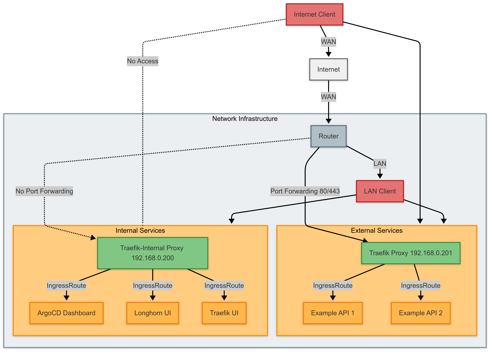

## 개요

이전 글에서는 Longhorn 분산 스토리지 시스템을 설치했다. 이번 글에서는 홈랩 쿠버네티스 클러스터에 Traefik 인그레스 컨트롤러를 설치하고 내부 네트워크를 구성하는 방법을 알아본다.


## 인그레스 컨트롤러 선택

홈랩 환경에서 쿠버네티스 서비스를 외부에 노출하는 방법은 여러 가지가 있다:

1. **NodePort**: 각 노드의 특정 포트(30000-32767)를 통해 서비스에 접근
2. **LoadBalancer**: MetalLB와 같은 로드 밸런서 구현체를 사용
3. **Ingress**: HTTP/HTTPS 트래픽을 서비스로 라우팅하는 규칙 정의

NodePort는 설정이 간단하지만 포트 번호를 기억해야 하는 불편함이 있고, LoadBalancer는 각 서비스마다 별도의 IP가 필요하다. 반면 인그레스 컨트롤러는 URL 경로와 호스트 이름 기반 라우팅, SSL/TLS 종료, 인증 등 다양한 기능을 제공하므로 홈랩 환경에서 가장 적합한 방법이다.

### Traefik을 선택한 이유

처음에는 Nginx Ingress Controller를 설치했었다. 그러나 Let's Encrypt 인증서 발급을 위해 cert-manager를 별도로 설치하고 적절한 ClusterIssuer를 구성해야 했다. 설정이 복잡했고, 특히 사용자 정의 헤더와 미들웨어 구성에서 여러 번 실패했다. 결국 더 통합된 솔루션을 찾게 되었고, Traefik은 필요한 모든 기능이 단일 패키지로 제공되어 선택하게 되었다.

Traefik의 주요 장점:

1. **설정의 단순함**: Let's Encrypt 통합이 기본으로 내장되어 인증서 자동화가 용이하다.
2. **대시보드 기능**: 트래픽 경로와 서비스 상태를 시각적으로 확인할 수 있다.
3. **Helm 차트 지원**: GitOps 방식으로 배포하기 좋은 공식 Helm 차트가 제공된다.
4. **CRD 지원**: IngressRoute와 같은 CRD로 세밀한 라우팅 규칙을 정의할 수 있다.
5. **미들웨어 기능**: 요청 및 응답 변환, 인증, 재시도 등의 미들웨어 기능을 제공한다.

## 내부와 외부 서비스 분리

홈랩 환경에서 중요한 고려사항 중 하나는 보안이다. ArgoCD, Longhorn, Traefik 대시보드와 같은 관리 인터페이스는 외부에 노출되지 않도록 해야 한다. 이를 위해 내부와 외부 서비스를 명확히 분리하는 전략을 사용한다:



1. **내부용 로드밸런서(192.168.0.200)**: 관리 인터페이스만 노출하고 내부 네트워크에서만 접근 가능
2. **외부용 로드밸런서(192.168.0.201)**: 공개 서비스만 노출하고 포트포워딩을 통해 외부에서 접근 가능

이렇게 설계하면 서비스 수준에서 분리가 이루어져 실수로 중요한 관리 인터페이스가 외부에 노출될 위험이 줄어든다. 참고로 이 설정은 완전한 네트워크 분리가 아닌 서비스 분리에 해당한다는 점을 유의하자.

## Traefik 설치 준비

### 1. MetalLB IP 주소 풀 구성

Traefik을 배포하기 전에 먼저 내부/외부 서비스 분리를 위한 IP 주소 풀을 MetalLB에 구성해야 한다. [GitHub 저장소](https://github.com/injunweb/k8s-resources)에 다음 파일들을 생성했다:

`apps/traefik/templates/ipaddresspool.yaml` 파일:

```yaml
apiVersion: metallb.io/v1beta1
kind: IPAddressPool
metadata:
    name: traefik-ip-pool
    namespace: metallb-system
spec:
    addresses:
        - 192.168.0.200-192.168.0.201
```

`apps/traefik/templates/l2advertisement.yaml` 파일:

```yaml
apiVersion: metallb.io/v1beta1
kind: L2Advertisement
metadata:
    name: traefik-l2-advertisement
    namespace: metallb-system
spec:
    ipAddressPools:
        - traefik-ip-pool
```

### 2. Helm 차트 구성

`apps/traefik/Chart.yaml` 파일:

```yaml
apiVersion: v2
name: traefik
description: traefik chart for Kubernetes
type: application
version: 1.0.0
appVersion: "v3.2.2"
dependencies:
    - name: traefik
      version: "33.2.1"
      repository: "https://traefik.github.io/charts"
```

`apps/traefik/values.yaml` 파일에는 다양한 설정이 포함되어 있다. 주요 부분만 설명하겠다:

#### 내부/외부 엔트리포인트 설정

```yaml
ports:
    web:
        port: 8000
        expose:
            default: true
            internal: false
        exposedPort: 80
        protocol: TCP
    websecure:
        port: 8443
        expose:
            default: true
            internal: false
        exposedPort: 443
        protocol: TCP
        tls:
            enabled: true
            certResolver: "letsencrypt"
    intweb:
        port: 8001
        expose:
            default: false
            internal: true
        exposedPort: 80
        protocol: TCP
    intwebsec:
        port: 8444
        expose:
            default: false
            internal: true
        exposedPort: 443
        protocol: TCP
        tls:
            enabled: true
            certResolver: "letsencrypt"
```

여기서 `web`과 `websecure`는 외부용 엔트리포인트, `intweb`과 `intwebsec`는 내부용 엔트리포인트이다. 각 엔트리포인트는 다른 포트를 사용하지만, 외부에는 동일한 표준 포트(80, 443)로 노출된다.

#### Let's Encrypt 설정

```yaml
certificatesResolvers:
    letsencrypt:
        acme:
            email: your-email@example.com
            httpChallenge:
                entryPoint: web
            storage: /data/acme.json
```

이 설정은 Let's Encrypt를 사용하여 SSL/TLS 인증서를 자동으로 발급하고 갱신하도록 한다. 참고로 Let's Encrypt의 HTTP 챌린지 방식은 외부에서 접근이 가능해야 인증서 발급이 가능하다. 따라서 인증서 발급은 다음 글에서 다룰 외부 접근 설정이 완료된 이후에 정상적으로 동작할 것이다.

#### 내부/외부 서비스 분리

```yaml
service:
    enabled: true
    single: true
    type: LoadBalancer
    annotations:
        metallb.universe.tf/loadBalancerIPs: 192.168.0.201
    additionalServices:
        internal:
            type: LoadBalancer
            annotations:
                metallb.universe.tf/loadBalancerIPs: 192.168.0.200
            labels:
                traefik-service-type: internal
```

이 설정은 두 개의 별도 서비스를 생성한다:

1. **기본 서비스**: 이름이 `traefik`으로, IP 주소 `192.168.0.201`을 가지며, 외부에서 접근 가능한 서비스를 위한 것이다.
2. **내부용 서비스**: 이름이 `traefik-internal`로, IP 주소 `192.168.0.200`을 가지며, 내부 관리 서비스를 위한 것이다.

참고로 이 IP 주소들은 DHCP 서버 설정에서 제외되어야 충돌이 발생하지 않는다. 홈 네트워크에서 사용 중인 라우터의 DHCP 범위를 확인하고 필요하다면 이 두 IP를 제외하도록 설정하자.

#### 권한 및 인증서 설정

```yaml
deployment:
    initContainers:
        - name: volume-permissions
          image: busybox:1.36
          command:
              [
                  "sh",
                  "-c",
                  "touch /data/acme.json; chmod -v 600 /data/acme.json; adduser -S 65532 65532; chown -R 65532:65532 /data/acme.json",
              ]
          volumeMounts:
              - name: data
                mountPath: /data

persistence:
    enabled: true
    accessMode: ReadWriteOnce
    size: 128Mi
    storageClass: longhorn # Longhorn 스토리지 클래스

podSecurityContext:
    fsGroup: 65532
    fsGroupChangePolicy: "OnRootMismatch"
    runAsGroup: 65532
    runAsNonRoot: true
    runAsUser: 65532
```

이 설정은 인증서 저장을 위한 볼륨 권한을 설정하고, Longhorn 스토리지 클래스를 사용하여 데이터를 저장한다.

### 3. GitOps로 배포하기

설정 파일을 Git 저장소에 푸시하여 ArgoCD가 자동으로 배포하도록 한다:

```bash
git add apps/traefik
git commit -m "Add Traefik configuration with MetalLB IP pool"
git push origin main
```

배포가 완료되었는지 확인하려면 다음 명령을 실행한다:

```bash
kubectl get pods -n traefik
```

정상적으로 배포되었다면, 다음과 같이 Traefik 파드가 Running 상태로 표시된다:

```
NAME                       READY   STATUS    RESTARTS   AGE
traefik-5d7b9b4f6c-xtz89   1/1     Running   0          5m
```

## 내부 서비스 접근 구성

이제 Traefik이 설치되었으니, 내부 관리 인터페이스(ArgoCD, Longhorn, Traefik 대시보드)에 접근할 수 있도록 구성한다.

### 1. 내부 서비스 라우팅 구성

내부 관리 인터페이스를 위한 IngressRoute를 설정한다. 이 라우트들은 내부 네트워크에서만 접근 가능하도록 `intweb`과 `intwebsec` 엔트리포인트를 사용한다.

ArgoCD 접근을 위한 `apps/argocd/templates/ingressroute.yaml` 파일:

```yaml
apiVersion: traefik.containo.us/v1alpha1
kind: IngressRoute
metadata:
    name: argocd-server-internal
    namespace: argocd
spec:
    entryPoints:
        - intweb
        - intwebsec
    routes:
        - match: Host(`argocd.injunweb.com`)
          kind: Rule
          services:
              - name: argocd-server
                port: 80
```

Longhorn UI를 위한 `apps/longhorn-system/templates/ingressroute.yaml` 파일:

```yaml
apiVersion: traefik.containo.us/v1alpha1
kind: IngressRoute
metadata:
    name: longhorn-frontend-internal
    namespace: longhorn-system
spec:
    entryPoints:
        - intweb
        - intwebsec
    routes:
        - match: Host(`longhorn.injunweb.com`)
          kind: Rule
          services:
              - name: longhorn-frontend
                port: 80
```

생성한 매니페스트 파일들을 Git 저장소에 추가한다:

```bash
git add apps/argocd/templates/ingressroute.yaml
git add apps/longhorn-system/templates/ingressroute.yaml
git commit -m "Add internal IngressRoutes for admin interfaces"
git push origin main
```

Traefik 대시보드는 Traefik Helm 차트 설정 중 `ingressRoute.dashboard` 부분에서 직접 구성했다:

```yaml
ingressRoute:
    dashboard:
        enabled: true
        annotations: {}
        labels: {}
        matchRule: Host(`traefik.injunweb.com`) && (PathPrefix(`/dashboard`) || PathPrefix(`/api`))
        services:
            - name: api@internal
              kind: TraefikService
        entryPoints: ["intweb", "intwebsec"]
```

### 2. 로컬 호스트 설정

내부 서비스에 쉽게 접근하기 위해 호스트 파일을 수정한다:

**Linux/macOS**:

```bash
sudo vim /etc/hosts
```

호스트 파일에 다음 라인을 추가한다:

```
192.168.0.200 traefik.injunweb.com argocd.injunweb.com longhorn.injunweb.com
```

저장 후 종료한다.

## 접근 테스트

모든 구성이 완료되었으니 이제 내부 네트워크에서 접근이 가능한지 테스트해보자.

### 내부 네트워크 테스트

내부 네트워크에서 다음 URL을 통해 각 서비스에 접근해본다:

-   http://traefik.injunweb.com/dashboard/ - Traefik 대시보드
-   http://argocd.injunweb.com - ArgoCD UI
-   http://longhorn.injunweb.com - Longhorn UI

모든 서비스가 정상적으로 접근 가능한지 확인한다.

## 마치며

이 글에서는 홈랩 쿠버네티스 클러스터에 Traefik 인그레스 컨트롤러를 설치하고, 내부 서비스를 안전하게 접근할 수 있도록 구성하는 방법을 살펴보았다.

현재 상태에서는 내부 서비스들이 내부 IP(192.168.0.200)에만 연결되어 있으며, 외부 접근을 위한 DDNS 설정과 포트포워딩은 아직 구성되지 않았다. 따라서 외부 네트워크에서는 접근이 불가능하다.

다음 글에서는 홈랩 쿠버네티스 클러스터의 외부 접근 설정과 DDNS 구성 방법에 대해 알아볼 것이다.
