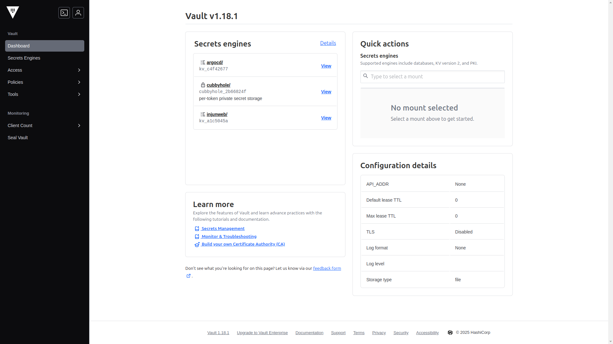

## Overview

In the [previous post](/posts/homelab-k8s-external-access/), we configured DDNS and port forwarding to enable external internet access to homelab Kubernetes cluster services. This post covers how to install and configure HashiCorp Vault to securely manage sensitive information like passwords, API keys, and certificates in the Kubernetes cluster.


## Limitations of Default Kubernetes Secrets

Secret management was the biggest challenge while building the homelab environment using GitOps methodology. Several limitations became clear when using default Kubernetes Secrets.

First, there is the GitOps integration issue. Secrets cannot be stored directly in Git repositories, and even base64 encoding is vulnerable since original values can be restored through simple decoding. Tools like Sealed Secrets and SOPS were also reviewed, but a comprehensive secret management solution beyond simple encryption was needed.

Second, there is the secret rotation problem. External API tokens and certificates require periodic renewal, but manual handling is inefficient and prone to errors. Automated secret rotation management was necessary.

> **What is HashiCorp Vault?**
>
> HashiCorp Vault is a secret management tool that HashiCorp released as open source in 2015. It securely stores and manages sensitive data like passwords, API keys, and certificates in a centralized location, provides enterprise-grade features such as fine-grained access control, audit logging, and automatic secret renewal, and supports Kubernetes integration.

HashiCorp Vault provides secret encryption, access control, and automatic renewal features along with integration with Kubernetes and GitOps workflows, making it the chosen solution to address these problems.

## Installing Vault

### 1. Preparing Directories for GitOps Configuration

Since all resources in the homelab environment are managed through GitOps, Vault installation follows the same approach. First, create the necessary directory structure:

```bash
mkdir -p k8s-resources/apps/vault/templates
cd k8s-resources/apps/vault
```

### 2. Helm Chart Configuration

Create the `Chart.yaml` file as follows:

```yaml
apiVersion: v2
name: vault
description: HashiCorp Vault installation
type: application
version: 1.0.0
appVersion: "1.15.2"
dependencies:
    - name: vault
      version: "0.27.0"
      repository: "https://helm.releases.hashicorp.com"
```

This configuration defines fetching and installing the Vault v0.27.0 chart from the official HashiCorp Helm repository.

Add Vault settings to the `values.yaml` file:

```yaml
vault:
    server:
        enabled: true

    ui:
        enabled: true
```

High availability (HA) configuration was considered but deemed wasteful of resources in the homelab environment, so it was simplified with the approach of upgrading later if needed.

### 3. Ingress Configuration

Configure an ingress route to access the Vault UI, utilizing the Traefik ingress controller configured previously.

`templates/ingressroute.yaml` file:

```yaml
apiVersion: traefik.io/v1alpha1
kind: IngressRoute
metadata:
    name: vault-ui
    namespace: vault
spec:
    entryPoints:
        - intweb
        - intwebsec
    routes:
        - kind: Rule
          match: Host(`vault.injunweb.com`)
          services:
              - name: vault-ui
                port: 8200
```

Setting `entryPoints` to `intweb` and `intwebsec` ensures the Vault UI is accessible only from the internal network, as external exposure of a secret management interface poses a serious security risk.

### 4. Add to Git Repository and Deploy with ArgoCD

```bash
git add .
git commit -m "Add Vault Helm chart configuration"
git push origin main
```

ArgoCD detects changes in the Git repository and automatically deploys to the cluster.

## Vault Initialization and Unsealing

After Vault installation, two important steps are required: initialization and unsealing. These processes involve encryption key generation and activation, and are performed manually rather than automated for security reasons.

### 1. Perform Initialization

Access the Vault pod to perform initialization:

```bash
kubectl -n vault exec -it vault-0 -- /bin/sh

vault operator init
```

Execution result:

```
Unseal Key 1: wO14Gu9jIfGtae33/8U3l9mFv9QERnQS/IMoA1jJZ0vF
Unseal Key 2: FfL8J4QoIP/7fRrKJ7NN/5W8zG2ODzL9MiCJV5UcQmjx
Unseal Key 3: IgNkd4APfXmJywTqh+JjWbkiVgEHBTS+wjUGy/mtQ1pL
Unseal Key 4: +3Q0TUmCtw91/TNjdg7+dIh/8tHmfkoMykMTB9BPkMKn
Unseal Key 5: tJGLuUEYjpXc+K2jjxnMZ2JW7BUQ0KVYq7pGGBhEFLvG

Initial Root Token: hvs.6xu4j8TSoFBJ3EFNpW791e0I
```

> **Warning**: These keys are examples only. In a real environment, this information should never be disclosed. Store them securely in a password manager.

### 2. Perform Unsealing

After initialization, the unsealing process is required. In the default configuration, use 3 of the 5 keys to unseal Vault:

```bash
vault operator unseal wO14Gu9jIfGtae33/8U3l9mFv9QERnQS/IMoA1jJZ0vF
vault operator unseal FfL8J4QoIP/7fRrKJ7NN/5W8zG2ODzL9MiCJV5UcQmjx
vault operator unseal IgNkd4APfXmJywTqh+JjWbkiVgEHBTS+wjUGy/mtQ1pL
```

After entering the third key, Vault becomes active. Check the status:

```bash
vault status
```

```
Key             Value
---             -----
Seal Type       shamir
Initialized     true
Sealed          false
Total Shares    5
Threshold       3
...
```

`Sealed: false` indicates that unsealing was successful.

> **Shamir's Secret Sharing Algorithm**
>
> Vault uses Shamir's Secret Sharing algorithm to split the master key into multiple pieces. In enterprise environments, these 5 keys are distributed to different administrators so that Vault can only be opened with the agreement of at least 3 people, implementing the four-eyes principle. Although managed by one person in the homelab, this provides experience with enterprise security principles.

## Accessing the Vault Web UI

Once Vault is active, it can be managed through the web UI. Add the following entry to the local computer's hosts file:

```
192.168.0.200 vault.injunweb.com
```

Access `http://vault.injunweb.com` in a browser to see the Vault UI. Use the root token obtained during initialization for login.


Dashboard displayed after login:



The UI is intuitively organized, allowing efficient execution of complex policy settings and secret management tasks.

## Basic Vault Configuration

Once Vault installation and initialization are complete, proceed with basic configuration for Kubernetes integration.

### 1. Kubernetes Authentication Setup

Using Kubernetes authentication allows pods to authenticate to Vault with their service account tokens. Access the Vault pod and execute the following commands:

```bash
vault login hvs.6xu4j8TSoFBJ3EFNpW791e0I

vault auth enable kubernetes

vault write auth/kubernetes/config \
  kubernetes_host="https://$KUBERNETES_PORT_443_TCP_ADDR:443" \
  token_reviewer_jwt="$(cat /var/run/secrets/kubernetes.io/serviceaccount/token)" \
  kubernetes_ca_cert="$(cat /var/run/secrets/kubernetes.io/serviceaccount/ca.crt)" \
  issuer="https://kubernetes.default.svc.cluster.local"
```

This configuration enables Vault to verify the validity of Kubernetes service account tokens and process authentication requests through communication with the Kubernetes API server.

### 2. Enable KV Secret Engine

The Key-Value (KV) engine is the most basic secret storage method. Enable the version 2 engine:

```bash
vault secrets enable -path=secret kv-v2
```

KV version 2 provides useful features like secret versioning, soft deletion, and metadata storage, enabling secret change history tracking and recovery from accidental deletion.

### 3. Create Policy and Role

Policies are the core of access control in Vault. Create a sample policy for application use:

```bash
cat <<EOF > app-policy.hcl
path "secret/data/app/*" {
  capabilities = ["read"]
}

path "secret/metadata/app/*" {
  capabilities = ["read", "list"]
}
EOF

vault policy write app-policy app-policy.hcl
```

This policy grants read permission for all secrets under the `secret/data/app/*` path and permission to query metadata.

Then create a role for Kubernetes authentication:

```bash
vault write auth/kubernetes/role/app \
  bound_service_account_names=app \
  bound_service_account_namespaces=default \
  policies=app-policy \
  ttl=1h
```

This configuration means that when the `app` service account in the `default` namespace authenticates to Vault, the `app-policy` policy applies and the token expires after 1 hour.

### 4. Create Sample Secret

Create a sample secret for testing:

```bash
vault kv put secret/app/config \
  db.username="dbuser" \
  db.password="supersecret" \
  api.key="api12345"

vault kv get secret/app/config
```

Secret verification result:

```
====== Metadata ======
Key              Value
---              -----
created_time     2025-02-26T07:45:22.123456789Z
deletion_time    n/a
destroyed        false
version          1

====== Data ======
Key            Value
---            -----
api.key        api12345
db.password    supersecret
db.username    dbuser
```

Now basic secrets are stored in Vault. Next, implement two methods for using these secrets in Kubernetes applications.

## Installing Vault Secrets Operator

The first approach is to use the Vault Secrets Operator. This Operator automatically synchronizes Vault secrets to Kubernetes Secrets, with the advantage of utilizing Vault secrets without changing existing application code.

### 1. Add Operator Configuration

`k8s-resources/apps/vault-secrets-operator/Chart.yaml` file:

```yaml
apiVersion: v2
name: vault-secrets-operator
description: Vault Secrets Operator installation
type: application
version: 1.0.0
appVersion: "0.4.1"
dependencies:
    - name: vault-secrets-operator
      version: "0.3.4"
      repository: "https://helm.releases.hashicorp.com"
```

`k8s-resources/apps/vault-secrets-operator/values.yaml` file:

```yaml
vault-secrets-operator:
    defaultVaultConnection:
        enabled: true
        address: "http://vault.vault.svc.cluster.local:8200"
```

This configuration provides default connection information for the Operator to access Vault within the cluster.

### 2. Create Vault Role for Operator

Access Vault to create a policy and role for the Operator:

```bash
cat <<EOF > operator-policy.hcl
path "secret/data/app/*" {
  capabilities = ["read"]
}

path "secret/metadata/app/*" {
  capabilities = ["read", "list"]
}
EOF

vault policy write operator-policy operator-policy.hcl

vault write auth/kubernetes/role/vault-secrets-operator \
  bound_service_account_names=vault-secrets-operator \
  bound_service_account_namespaces=vault-secrets-operator \
  policies=operator-policy \
  ttl=1h
```

### 3. Add to Git and Deploy

```bash
cd k8s-resources
git add apps/vault-secrets-operator
git commit -m "Add Vault Secrets Operator configuration"
git push origin main
```

Verify after deployment:

```bash
kubectl get pods -n vault-secrets-operator
```

Result:

```
NAME                                      READY   STATUS    RESTARTS   AGE
vault-secrets-operator-75bcd5b69d-x2jf9   2/2     Running   0          45s
```

## Configuring Secret Synchronization Resources

Configure settings to synchronize Vault secrets to Kubernetes Secrets through the Vault Secrets Operator.

### 1. Create VaultAuth Resource

The `VaultAuth` resource defines how to authenticate to Vault:

```yaml
apiVersion: secrets.hashicorp.com/v1beta1
kind: VaultAuth
metadata:
    name: default
    namespace: default
spec:
    method: kubernetes
    mount: kubernetes
    kubernetes:
        role: vault-secrets-operator
        serviceAccount: default
```

### 2. Create VaultStaticSecret Resource

The `VaultStaticSecret` resource specifies synchronization of a specific Vault secret to a Kubernetes Secret:

```yaml
apiVersion: secrets.hashicorp.com/v1beta1
kind: VaultStaticSecret
metadata:
    name: app-config
    namespace: default
spec:
    type: kv-v2
    mount: secret
    path: app/config
    destination:
        name: app-config
        create: true
    refreshAfter: 30s
    vaultAuthRef: default
```

The `refreshAfter: 30s` setting ensures that when secrets change in Vault, the Kubernetes Secret is automatically updated within 30 seconds, allowing the latest values to be reflected without application redeployment.

### 3. Deploy and Verify

```bash
kubectl apply -f vault-auth.yaml
kubectl apply -f static-secret.yaml
```

Verify Secret creation:

```bash
kubectl get secret app-config
```

Result:

```
NAME        TYPE     DATA   AGE
app-config  Opaque   3      15s
```

Verify secret contents:

```bash
kubectl get secret app-config -o jsonpath="{.data.db\.password}" | base64 -d
```

### 4. Test Automatic Secret Renewal

Verify that when a secret changes in Vault, the Kubernetes Secret is automatically updated:

```bash
vault kv put secret/app/config \
  db.username="dbuser" \
  db.password="newpassword" \
  api.key="newapi12345"

# Check Kubernetes Secret after 30 seconds
kubectl get secret app-config -o jsonpath="{.data.db\.password}" | base64 -d
```

If the result changes to `newpassword`, automatic renewal is working correctly.

## Installing ArgoCD Vault Plugin

The second approach is to configure the ArgoCD Vault Plugin. This plugin integrates deeply with GitOps workflows by storing only secret references in the Git repository and replacing them with actual values when ArgoCD deploys.

### 1. Modify ArgoCD Helm Chart Values File

Add the following content to the `k8s-resources/apps/argocd/values.yaml` file:

```yaml
argo-cd:
    configs:
        params:
            server.disable.auth: true
            server.insecure: true
    server:
        extraArgs:
            - --insecure
        ingress:
            enabled: false
        ingressGrpc:
            enabled: false

    repoServer:
        rbac:
            - verbs: ["get", "list", "watch"]
              apiGroups: [""]
              resources: ["secrets", "configmaps"]

        initContainers:
            - name: download-tools
              image: alpine/curl
              env:
                  - name: AVP_VERSION
                    value: "1.18.1"
              command: [sh, -c]
              args:
                  - >-
                      curl -L https://github.com/argoproj-labs/argocd-vault-plugin/releases/download/v$(AVP_VERSION)/argocd-vault-plugin_$(AVP_VERSION)_linux_amd64 -o argocd-vault-plugin &&
                      chmod +x argocd-vault-plugin &&
                      mv argocd-vault-plugin /custom-tools/
              volumeMounts:
                  - mountPath: /custom-tools
                    name: custom-tools

        extraContainers:
            - name: avp-helm
              command: ["/var/run/argocd/argocd-cmp-server"]
              image: quay.io/argoproj/argocd:v2.13.2
              securityContext:
                  runAsNonRoot: true
                  runAsUser: 999
              volumeMounts:
                  - mountPath: /var/run/argocd
                    name: var-files
                  - mountPath: /home/argocd/cmp-server/plugins
                    name: plugins
                  - mountPath: /tmp
                    name: tmp-dir
                  - mountPath: /home/argocd/cmp-server/config
                    name: cmp-plugin
                  - name: custom-tools
                    subPath: argocd-vault-plugin
                    mountPath: /usr/local/bin/argocd-vault-plugin
        volumes:
            - configMap:
                  name: cmp-plugin
              name: cmp-plugin
            - name: custom-tools
              emptyDir: {}
            - name: tmp-dir
              emptyDir: {}
```

This configuration adds the Vault Plugin as a sidecar container to the ArgoCD repo-server, enabling replacement of secret references with actual values during Helm chart rendering.

### 2. Create Vault Role for ArgoCD

Access Vault to create a policy and role for ArgoCD:

```bash
cat <<EOF > argocd-policy.hcl
path "secret/data/app/*" {
  capabilities = ["read"]
}

path "secret/metadata/app/*" {
  capabilities = ["read", "list"]
}
EOF

vault policy write argocd argocd-policy.hcl

vault write auth/kubernetes/role/argocd \
  bound_service_account_names=argocd-repo-server \
  bound_service_account_namespaces=argocd \
  policies=argocd \
  ttl=1h
```

### 3. Create Authentication Secret

Create the `k8s-resources/apps/argocd/templates/avp-secret.yaml` file:

```yaml
apiVersion: v1
kind: Secret
metadata:
    name: argocd-vault-plugin-credentials
    namespace: argocd
type: Opaque
stringData:
    AVP_AUTH_TYPE: "k8s"
    AVP_K8S_ROLE: "argocd"
    AVP_TYPE: "vault"
    VAULT_ADDR: "http://vault.vault.svc.cluster.local:8200"
```

### 4. Create ConfigMap

`k8s-resources/apps/argocd/templates/configmap.yaml` file:

```yaml
apiVersion: v1
kind: ConfigMap
metadata:
    name: cmp-plugin
    namespace: argocd
data:
    plugin.yaml: |
        apiVersion: argoproj.io/v1alpha1
        kind: ConfigManagementPlugin
        metadata:
          name: argocd-vault-plugin-helm
        spec:
          allowConcurrency: true
          discover:
            find:
              command:
                - sh
                - "-c"
                - "find . -name 'Chart.yaml' && find . -name 'values.yaml'"
          init:
            command:
              - bash
              - "-c"
              - |
                helm repo add bitnami https://charts.bitnami.com/bitnami
                helm dependency build
          generate:
            command:
              - sh
              - "-c"
              - |
                helm template $ARGOCD_APP_NAME -n $ARGOCD_APP_NAMESPACE ${ARGOCD_ENV_HELM_ARGS} . --include-crds |
                argocd-vault-plugin generate -s argocd:argocd-vault-plugin-credentials -
          lockRepo: false
```

This ConfigMap defines the ArgoCD Vault Plugin's behavior, configuring a pipeline that renders Helm charts and then replaces secret references with actual values from Vault.

## Using Secrets in Applications

Now Vault secrets can be used in applications through two methods.

### 1. Using Secrets Synchronized by Vault Secrets Operator

Simple test Deployment:

```yaml
apiVersion: apps/v1
kind: Deployment
metadata:
    name: demo-app
    namespace: default
spec:
    replicas: 1
    selector:
        matchLabels:
            app: demo-app
    template:
        metadata:
            labels:
                app: demo-app
        spec:
            containers:
                - name: demo-app
                  image: nginx:alpine
                  env:
                      - name: DB_PASSWORD
                        valueFrom:
                            secretKeyRef:
                                name: app-config
                                key: db.password
```

The advantage of this method is that no modification to existing application code is needed. Vault's secret management features can be utilized while using the standard Kubernetes Secret reference method as-is.

### 2. Using Secrets Replaced by ArgoCD Vault Plugin

Deployment using plugin reference:

```yaml
apiVersion: apps/v1
kind: Deployment
metadata:
    name: demo-app-avp
    namespace: default
    annotations:
        avp.kubernetes.io/path: "secret/data/app/config"
spec:
    replicas: 1
    selector:
        matchLabels:
            app: demo-app-avp
    template:
        metadata:
            labels:
                app: demo-app-avp
        spec:
            containers:
                - name: demo-app
                  image: nginx:alpine
                  env:
                      - name: DB_PASSWORD
                        value: <path:secret/data/app/config#db.password>
```

The advantage of this method is that secret values are not stored in Git. Only placeholders like `<path:secret/data/app/config#db.password>` are stored in Git, and actual values are retrieved from Vault by ArgoCD at deployment time.

When creating an application in ArgoCD, selecting "argocd-vault-plugin-helm" as the Config Management Plugin causes ArgoCD to replace `<path:...>` format references with actual values before applying manifests to the cluster.

## Conclusion

This post covered installing HashiCorp Vault in a homelab Kubernetes cluster and building a secure secret management system. Vault Secrets Operator can synchronize secrets to Kubernetes Secrets without changing existing application code, and ArgoCD Vault Plugin can maintain GitOps workflow without storing sensitive information in Git repositories.

The next post covers installing Harbor, Argo Events, and Argo Workflows to build the foundation for a CI/CD pipeline.

[Next Post: Homelab Kubernetes #7 - Building an Internal Developer Platform (IDP) (1)](/posts/homelab-k8s-cicd-1/)
