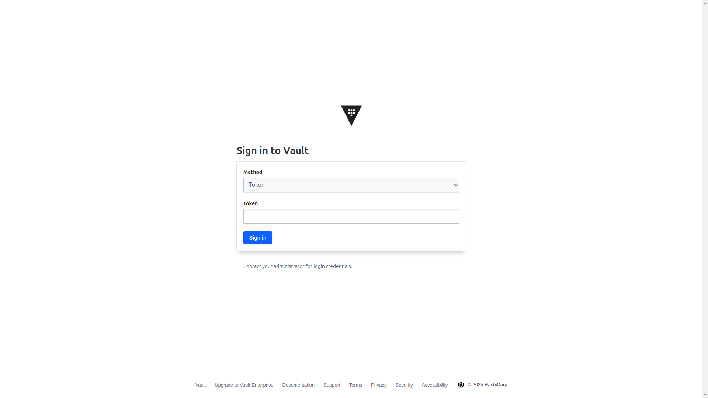
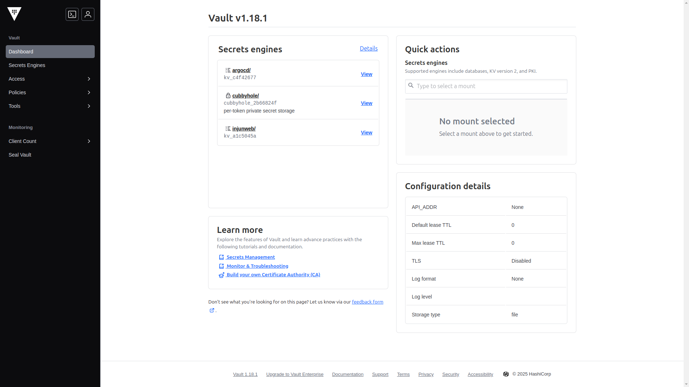

## 개요

[이전 글](/posts/homelab-k8s-external-access/)에서는 DDNS와 포트포워딩을 구성하여 홈랩 쿠버네티스 클러스터의 서비스를 외부 인터넷에서 접근할 수 있도록 했다. 이번 글에서는 쿠버네티스 클러스터에서 비밀번호, API 키, 인증서 같은 민감한 정보를 안전하게 관리하기 위해 HashiCorp Vault를 설치하고 구성하는 방법을 알아본다.


## 기본 쿠버네티스 시크릿의 한계

GitOps 방식으로 홈랩 환경을 구성하면서 시크릿 관리가 가장 큰 난제였으며, 기본 쿠버네티스 Secret을 사용해보니 여러 가지 한계점이 명확하게 드러났다.

첫째, GitOps와의 통합 문제가 있다. Git 저장소에 시크릿을 그대로 저장할 수 없고, base64로 인코딩해도 단순한 디코딩으로 원본 값을 복원할 수 있어 보안에 취약하다. Sealed Secrets나 SOPS 같은 도구도 검토했으나, 단순 암호화를 넘어선 종합적인 시크릿 관리 솔루션이 필요했다.

둘째, 시크릿 갱신 문제가 있다. 외부 API 토큰이나 인증서는 주기적으로 갱신이 필요한데, 매번 수동으로 처리하는 것은 비효율적이고 실수가 발생하기 쉽다. 자동화된 시크릿 로테이션 관리가 필요했다.

> **HashiCorp Vault란?**
>
> HashiCorp Vault는 2015년에 HashiCorp가 오픈소스로 공개한 시크릿 관리 도구로, 비밀번호, API 키, 인증서 같은 민감한 데이터를 중앙에서 안전하게 저장하고 관리하며, 세밀한 접근 제어, 감사 로깅, 자동 시크릿 갱신 같은 엔터프라이즈급 기능을 제공하고 쿠버네티스와의 통합도 지원한다.

HashiCorp Vault는 시크릿 암호화, 접근 제어, 자동 갱신 기능과 함께 쿠버네티스 및 GitOps 워크플로우와의 통합도 지원하여 이러한 문제들을 해결할 수 있는 솔루션으로 선택하게 되었다.

## Vault 설치하기

### 1. GitOps 구성을 위한 디렉토리 준비

홈랩 환경의 모든 리소스를 GitOps로 관리하므로 Vault 설치도 동일한 방식으로 진행하며, 먼저 필요한 디렉토리 구조를 생성한다:

```bash
mkdir -p k8s-resources/apps/vault/templates
cd k8s-resources/apps/vault
```

### 2. Helm 차트 구성

`Chart.yaml` 파일을 다음과 같이 작성한다:

```yaml
apiVersion: v2
name: vault
description: HashiCorp Vault installation
type: application
version: 1.0.0
appVersion: "1.15.2"
dependencies:
    - name: vault
      version: "0.27.0"
      repository: "https://helm.releases.hashicorp.com"
```

이 설정은 HashiCorp 공식 Helm 저장소에서 Vault v0.27.0 차트를 가져와 설치하도록 정의한다.

`values.yaml` 파일에는 Vault 설정을 추가한다:

```yaml
vault:
    server:
        enabled: true

    ui:
        enabled: true
```

고가용성(HA) 설정도 고려했으나 홈랩 환경에서는 리소스 낭비라고 판단하여 간소화했으며, 필요시 나중에 업그레이드하는 방식으로 접근했다.

### 3. 인그레스 구성

Vault UI에 접근하기 위한 인그레스 라우트를 구성하며, 이전에 설정한 Traefik 인그레스 컨트롤러를 활용한다.

`templates/ingressroute.yaml` 파일:

```yaml
apiVersion: traefik.io/v1alpha1
kind: IngressRoute
metadata:
    name: vault-ui
    namespace: vault
spec:
    entryPoints:
        - intweb
        - intwebsec
    routes:
        - kind: Rule
          match: Host(`vault.injunweb.com`)
          services:
              - name: vault-ui
                port: 8200
```

`entryPoints`를 `intweb`과 `intwebsec`로 설정하여 Vault UI는 내부 네트워크에서만 접근 가능하도록 했으며, 시크릿 관리 인터페이스인 만큼 외부 노출은 심각한 보안 위험이 되기 때문이다.

### 4. Git 저장소에 추가 및 ArgoCD로 배포

```bash
git add .
git commit -m "Add Vault Helm chart configuration"
git push origin main
```

ArgoCD가 Git 저장소의 변경 사항을 감지하여 자동으로 클러스터에 배포한다.

## Vault 초기화 및 언실링

Vault 설치 후에는 초기화(initialization)와 언실링(unsealing)이라는 두 가지 중요한 단계가 필요하며, 이 과정은 암호화 키 생성과 활성화 과정으로 보안을 위해 자동화하지 않고 수동으로 진행한다.

### 1. 초기화 수행

Vault 파드에 접속하여 초기화를 수행한다:

```bash
kubectl -n vault exec -it vault-0 -- /bin/sh

vault operator init
```

실행 결과:

```
Unseal Key 1: wO14Gu9jIfGtae33/8U3l9mFv9QERnQS/IMoA1jJZ0vF
Unseal Key 2: FfL8J4QoIP/7fRrKJ7NN/5W8zG2ODzL9MiCJV5UcQmjx
Unseal Key 3: IgNkd4APfXmJywTqh+JjWbkiVgEHBTS+wjUGy/mtQ1pL
Unseal Key 4: +3Q0TUmCtw91/TNjdg7+dIh/8tHmfkoMykMTB9BPkMKn
Unseal Key 5: tJGLuUEYjpXc+K2jjxnMZ2JW7BUQ0KVYq7pGGBhEFLvG

Initial Root Token: hvs.6xu4j8TSoFBJ3EFNpW791e0I
```

> **주의**: 이 키들은 예시일 뿐이며, 실제 환경에서는 절대로 이런 정보를 공개해서는 안 된다. 패스워드 관리자에 안전하게 저장해야 한다.

### 2. 언실링 수행

초기화 후에는 언실링 과정이 필요하며, 기본 설정에서는 5개의 키 중 3개를 사용하여 Vault를 언실링한다:

```bash
vault operator unseal wO14Gu9jIfGtae33/8U3l9mFv9QERnQS/IMoA1jJZ0vF
vault operator unseal FfL8J4QoIP/7fRrKJ7NN/5W8zG2ODzL9MiCJV5UcQmjx
vault operator unseal IgNkd4APfXmJywTqh+JjWbkiVgEHBTS+wjUGy/mtQ1pL
```

세 번째 키를 입력하면 Vault가 활성화되며, 상태를 확인한다:

```bash
vault status
```

```
Key             Value
---             -----
Seal Type       shamir
Initialized     true
Sealed          false
Total Shares    5
Threshold       3
...
```

`Sealed: false`는 정상적으로 언실링되었음을 의미한다.

> **Shamir의 비밀 공유 알고리즘**
>
> Vault는 Shamir의 비밀 공유(Shamir's Secret Sharing) 알고리즘을 사용하여 마스터 키를 여러 조각으로 분할하며, 기업 환경에서는 이 5개의 키를 서로 다른 관리자에게 분산시켜 최소 3명이 동의해야만 Vault를 열 수 있게 하는 4-eyes principle을 구현한다. 홈랩에서는 한 사람이 관리하지만 엔터프라이즈 보안 원칙을 경험해볼 수 있다.

## Vault 웹 UI 접근

Vault가 활성화되면 웹 UI를 통해 관리할 수 있으며, 로컬 컴퓨터의 호스트 파일에 다음 항목을 추가한다:

```
192.168.0.200 vault.injunweb.com
```

브라우저에서 `http://vault.injunweb.com`으로 접속하면 Vault UI가 표시되고, 로그인에는 초기화 과정에서 받은 루트 토큰을 사용한다.



로그인 후 표시되는 대시보드:



UI는 직관적으로 구성되어 있어 복잡한 정책 설정이나 시크릿 관리 작업도 효율적으로 수행할 수 있다.

## Vault 기본 설정

Vault 설치와 초기화가 완료되었으면 쿠버네티스와의 통합을 위한 기본 설정을 진행한다.

### 1. 쿠버네티스 인증 설정

쿠버네티스 인증 방식을 사용하면 파드가 자신의 서비스 계정 토큰으로 Vault에 인증할 수 있으며, Vault 파드에 접속하여 다음 명령을 실행한다:

```bash
vault login hvs.6xu4j8TSoFBJ3EFNpW791e0I

vault auth enable kubernetes

vault write auth/kubernetes/config \
  kubernetes_host="https://$KUBERNETES_PORT_443_TCP_ADDR:443" \
  token_reviewer_jwt="$(cat /var/run/secrets/kubernetes.io/serviceaccount/token)" \
  kubernetes_ca_cert="$(cat /var/run/secrets/kubernetes.io/serviceaccount/ca.crt)" \
  issuer="https://kubernetes.default.svc.cluster.local"
```

이 설정은 Vault가 쿠버네티스 서비스 계정 토큰의 유효성을 검증할 수 있게 하며, 쿠버네티스 API 서버와의 통신을 통해 인증 요청을 처리한다.

### 2. KV 시크릿 엔진 활성화

Key-Value(KV) 엔진은 가장 기본적인 시크릿 저장 방식으로, 버전 2 엔진을 활성화한다:

```bash
vault secrets enable -path=secret kv-v2
```

KV 버전 2는 시크릿 버전 관리, 소프트 삭제, 메타데이터 저장 같은 유용한 기능을 제공하여 시크릿 변경 이력 추적과 실수로 인한 삭제 복구가 가능하다.

### 3. 정책 및 역할 생성

Vault에서 접근 제어의 핵심은 정책(Policy)이며, 애플리케이션에서 사용할 샘플 정책을 생성한다:

```bash
cat <<EOF > app-policy.hcl
path "secret/data/app/*" {
  capabilities = ["read"]
}

path "secret/metadata/app/*" {
  capabilities = ["read", "list"]
}
EOF

vault policy write app-policy app-policy.hcl
```

이 정책은 `secret/data/app/*` 경로의 모든 시크릿에 대한 읽기 권한과 메타데이터 조회 권한을 부여한다.

그리고 쿠버네티스 인증을 위한 역할을 생성한다:

```bash
vault write auth/kubernetes/role/app \
  bound_service_account_names=app \
  bound_service_account_namespaces=default \
  policies=app-policy \
  ttl=1h
```

이 설정은 `default` 네임스페이스의 `app` 서비스 계정이 Vault에 인증할 때 `app-policy` 정책이 적용되며, 토큰은 1시간 후 만료됨을 의미한다.

### 4. 샘플 시크릿 생성

테스트를 위한 샘플 시크릿을 생성한다:

```bash
vault kv put secret/app/config \
  db.username="dbuser" \
  db.password="supersecret" \
  api.key="api12345"

vault kv get secret/app/config
```

시크릿 확인 결과:

```
====== Metadata ======
Key              Value
---              -----
created_time     2025-02-26T07:45:22.123456789Z
deletion_time    n/a
destroyed        false
version          1

====== Data ======
Key            Value
---            -----
api.key        api12345
db.password    supersecret
db.username    dbuser
```

이제 Vault에 기본적인 시크릿이 저장되었으며, 다음으로 이 시크릿을 쿠버네티스 애플리케이션에서 사용할 수 있는 두 가지 방법을 구현한다.

## Vault Secrets Operator 설치

첫 번째 접근법은 Vault Secrets Operator를 사용하는 것으로, 이 Operator는 Vault의 시크릿을 쿠버네티스 Secret으로 자동 동기화하여 기존 애플리케이션 코드 변경 없이 Vault 시크릿을 활용할 수 있는 장점이 있다.

### 1. Operator 설정 추가

`k8s-resources/apps/vault-secrets-operator/Chart.yaml` 파일:

```yaml
apiVersion: v2
name: vault-secrets-operator
description: Vault Secrets Operator installation
type: application
version: 1.0.0
appVersion: "0.4.1"
dependencies:
    - name: vault-secrets-operator
      version: "0.3.4"
      repository: "https://helm.releases.hashicorp.com"
```

`k8s-resources/apps/vault-secrets-operator/values.yaml` 파일:

```yaml
vault-secrets-operator:
    defaultVaultConnection:
        enabled: true
        address: "http://vault.vault.svc.cluster.local:8200"
```

이 설정은 Operator가 클러스터 내부의 Vault에 접근할 수 있는 기본 연결 정보를 제공한다.

### 2. Operator용 Vault 역할 생성

Vault에 접속하여 Operator용 정책과 역할을 생성한다:

```bash
cat <<EOF > operator-policy.hcl
path "secret/data/app/*" {
  capabilities = ["read"]
}

path "secret/metadata/app/*" {
  capabilities = ["read", "list"]
}
EOF

vault policy write operator-policy operator-policy.hcl

vault write auth/kubernetes/role/vault-secrets-operator \
  bound_service_account_names=vault-secrets-operator \
  bound_service_account_namespaces=vault-secrets-operator \
  policies=operator-policy \
  ttl=1h
```

### 3. Git에 추가 및 배포

```bash
cd k8s-resources
git add apps/vault-secrets-operator
git commit -m "Add Vault Secrets Operator configuration"
git push origin main
```

배포 후 확인:

```bash
kubectl get pods -n vault-secrets-operator
```

결과:

```
NAME                                      READY   STATUS    RESTARTS   AGE
vault-secrets-operator-75bcd5b69d-x2jf9   2/2     Running   0          45s
```

## 시크릿 동기화 리소스 구성

Vault Secrets Operator를 통해 Vault의 시크릿을 쿠버네티스 Secret으로 동기화하는 설정을 진행한다.

### 1. VaultAuth 리소스 생성

`VaultAuth` 리소스는 Vault에 인증하는 방법을 정의한다:

```yaml
apiVersion: secrets.hashicorp.com/v1beta1
kind: VaultAuth
metadata:
    name: default
    namespace: default
spec:
    method: kubernetes
    mount: kubernetes
    kubernetes:
        role: vault-secrets-operator
        serviceAccount: default
```

### 2. VaultStaticSecret 리소스 생성

`VaultStaticSecret` 리소스는 Vault의 특정 시크릿을 쿠버네티스 Secret으로 동기화하도록 지정한다:

```yaml
apiVersion: secrets.hashicorp.com/v1beta1
kind: VaultStaticSecret
metadata:
    name: app-config
    namespace: default
spec:
    type: kv-v2
    mount: secret
    path: app/config
    destination:
        name: app-config
        create: true
    refreshAfter: 30s
    vaultAuthRef: default
```

`refreshAfter: 30s` 설정은 Vault에서 시크릿이 변경될 때 30초 내에 쿠버네티스 Secret도 자동으로 업데이트되도록 하며, 시크릿 변경 시 애플리케이션 재배포 없이 최신 값을 반영할 수 있다.

### 3. 배포 및 확인

```bash
kubectl apply -f vault-auth.yaml
kubectl apply -f static-secret.yaml
```

Secret 생성 확인:

```bash
kubectl get secret app-config
```

결과:

```
NAME        TYPE     DATA   AGE
app-config  Opaque   3      15s
```

시크릿 내용 확인:

```bash
kubectl get secret app-config -o jsonpath="{.data.db\.password}" | base64 -d
```

### 4. 시크릿 자동 갱신 테스트

Vault에서 시크릿을 변경했을 때 쿠버네티스 Secret이 자동으로 업데이트되는지 확인한다:

```bash
vault kv put secret/app/config \
  db.username="dbuser" \
  db.password="newpassword" \
  api.key="newapi12345"

# 30초 후 쿠버네티스 Secret 확인
kubectl get secret app-config -o jsonpath="{.data.db\.password}" | base64 -d
```

결과가 `newpassword`로 변경되면 자동 갱신이 정상 작동하는 것이다.

## ArgoCD Vault Plugin 설치

두 번째 접근법은 ArgoCD Vault Plugin을 구성하는 것으로, 이 플러그인은 GitOps 워크플로우에 깊게 통합되어 Git 저장소에는 시크릿 참조만 저장하고 ArgoCD가 배포할 때 실제 값으로 대체한다.

### 1. ArgoCD Helm 차트 값 파일 수정

`k8s-resources/apps/argocd/values.yaml` 파일에 다음 내용을 추가한다:

```yaml
argo-cd:
    configs:
        params:
            server.disable.auth: true
            server.insecure: true
    server:
        extraArgs:
            - --insecure
        ingress:
            enabled: false
        ingressGrpc:
            enabled: false

    repoServer:
        rbac:
            - verbs: ["get", "list", "watch"]
              apiGroups: [""]
              resources: ["secrets", "configmaps"]

        initContainers:
            - name: download-tools
              image: alpine/curl
              env:
                  - name: AVP_VERSION
                    value: "1.18.1"
              command: [sh, -c]
              args:
                  - >-
                      curl -L https://github.com/argoproj-labs/argocd-vault-plugin/releases/download/v$(AVP_VERSION)/argocd-vault-plugin_$(AVP_VERSION)_linux_amd64 -o argocd-vault-plugin &&
                      chmod +x argocd-vault-plugin &&
                      mv argocd-vault-plugin /custom-tools/
              volumeMounts:
                  - mountPath: /custom-tools
                    name: custom-tools

        extraContainers:
            - name: avp-helm
              command: ["/var/run/argocd/argocd-cmp-server"]
              image: quay.io/argoproj/argocd:v2.13.2
              securityContext:
                  runAsNonRoot: true
                  runAsUser: 999
              volumeMounts:
                  - mountPath: /var/run/argocd
                    name: var-files
                  - mountPath: /home/argocd/cmp-server/plugins
                    name: plugins
                  - mountPath: /tmp
                    name: tmp-dir
                  - mountPath: /home/argocd/cmp-server/config
                    name: cmp-plugin
                  - name: custom-tools
                    subPath: argocd-vault-plugin
                    mountPath: /usr/local/bin/argocd-vault-plugin
        volumes:
            - configMap:
                  name: cmp-plugin
              name: cmp-plugin
            - name: custom-tools
              emptyDir: {}
            - name: tmp-dir
              emptyDir: {}
```

이 설정은 ArgoCD repo-server에 Vault Plugin을 사이드카 컨테이너로 추가하여 Helm 차트 렌더링 시 시크릿 참조를 실제 값으로 대체할 수 있도록 한다.

### 2. ArgoCD용 Vault 역할 생성

Vault에 접속하여 ArgoCD용 정책과 역할을 생성한다:

```bash
cat <<EOF > argocd-policy.hcl
path "secret/data/app/*" {
  capabilities = ["read"]
}

path "secret/metadata/app/*" {
  capabilities = ["read", "list"]
}
EOF

vault policy write argocd argocd-policy.hcl

vault write auth/kubernetes/role/argocd \
  bound_service_account_names=argocd-repo-server \
  bound_service_account_namespaces=argocd \
  policies=argocd \
  ttl=1h
```

### 3. 인증 시크릿 생성

`k8s-resources/apps/argocd/templates/avp-secret.yaml` 파일을 생성한다:

```yaml
apiVersion: v1
kind: Secret
metadata:
    name: argocd-vault-plugin-credentials
    namespace: argocd
type: Opaque
stringData:
    AVP_AUTH_TYPE: "k8s"
    AVP_K8S_ROLE: "argocd"
    AVP_TYPE: "vault"
    VAULT_ADDR: "http://vault.vault.svc.cluster.local:8200"
```

### 4. ConfigMap 생성

`k8s-resources/apps/argocd/templates/configmap.yaml` 파일:

```yaml
apiVersion: v1
kind: ConfigMap
metadata:
    name: cmp-plugin
    namespace: argocd
data:
    plugin.yaml: |
        apiVersion: argoproj.io/v1alpha1
        kind: ConfigManagementPlugin
        metadata:
          name: argocd-vault-plugin-helm
        spec:
          allowConcurrency: true
          discover:
            find:
              command:
                - sh
                - "-c"
                - "find . -name 'Chart.yaml' && find . -name 'values.yaml'"
          init:
            command:
              - bash
              - "-c"
              - |
                helm repo add bitnami https://charts.bitnami.com/bitnami
                helm dependency build
          generate:
            command:
              - sh
              - "-c"
              - |
                helm template $ARGOCD_APP_NAME -n $ARGOCD_APP_NAMESPACE ${ARGOCD_ENV_HELM_ARGS} . --include-crds |
                argocd-vault-plugin generate -s argocd:argocd-vault-plugin-credentials -
          lockRepo: false
```

이 ConfigMap은 ArgoCD Vault Plugin의 동작 방식을 정의하며, Helm 차트를 렌더링한 후 시크릿 참조를 Vault의 실제 값으로 대체하는 파이프라인을 구성한다.

## 애플리케이션에서 시크릿 활용

이제 두 가지 방법으로 Vault 시크릿을 애플리케이션에서 사용할 수 있다.

### 1. Vault Secrets Operator로 동기화된 Secret 사용

간단한 테스트 Deployment:

```yaml
apiVersion: apps/v1
kind: Deployment
metadata:
    name: demo-app
    namespace: default
spec:
    replicas: 1
    selector:
        matchLabels:
            app: demo-app
    template:
        metadata:
            labels:
                app: demo-app
        spec:
            containers:
                - name: demo-app
                  image: nginx:alpine
                  env:
                      - name: DB_PASSWORD
                        valueFrom:
                            secretKeyRef:
                                name: app-config
                                key: db.password
```

이 방식의 장점은 기존 애플리케이션 코드를 전혀 수정할 필요가 없다는 것으로, 표준 쿠버네티스 Secret 참조 방식을 그대로 사용하면서 Vault의 시크릿 관리 기능을 활용할 수 있다.

### 2. ArgoCD Vault Plugin으로 대체되는 시크릿 사용

플러그인 참조를 사용하는 Deployment:

```yaml
apiVersion: apps/v1
kind: Deployment
metadata:
    name: demo-app-avp
    namespace: default
    annotations:
        avp.kubernetes.io/path: "secret/data/app/config"
spec:
    replicas: 1
    selector:
        matchLabels:
            app: demo-app-avp
    template:
        metadata:
            labels:
                app: demo-app-avp
        spec:
            containers:
                - name: demo-app
                  image: nginx:alpine
                  env:
                      - name: DB_PASSWORD
                        value: <path:secret/data/app/config#db.password>
```

이 방식의 장점은 시크릿 값이 Git에 저장되지 않는다는 점으로, `<path:secret/data/app/config#db.password>` 같은 플레이스홀더만 Git에 저장되고 실제 값은 ArgoCD가 배포 시점에 Vault에서 가져온다.

ArgoCD에서 애플리케이션을 생성할 때 "argocd-vault-plugin-helm"을 Config Management Plugin으로 선택하면 ArgoCD가 매니페스트를 클러스터에 적용하기 전에 `<path:...>` 형식의 참조를 실제 값으로 대체한다.

## 마치며

이번 글에서는 홈랩 쿠버네티스 클러스터에 HashiCorp Vault를 설치하고 안전한 시크릿 관리 시스템을 구축하는 방법을 살펴보았다. Vault Secrets Operator는 기존 애플리케이션 코드 변경 없이 시크릿을 쿠버네티스 Secret으로 동기화할 수 있고, ArgoCD Vault Plugin은 Git 저장소에 민감한 정보를 저장하지 않으면서 GitOps 워크플로우를 유지할 수 있다.

다음 글에서는 Harbor, Argo Events, Argo Workflows를 설치하여 CI/CD 파이프라인의 기반을 구축하는 방법을 알아본다.

[다음 글: 홈랩 쿠버네티스 #7 - 내부 개발자 플랫폼(IDP) 구축하기 (1)](/posts/homelab-k8s-cicd-1/)
