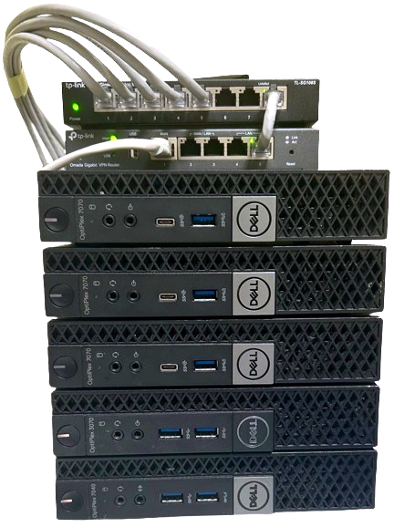
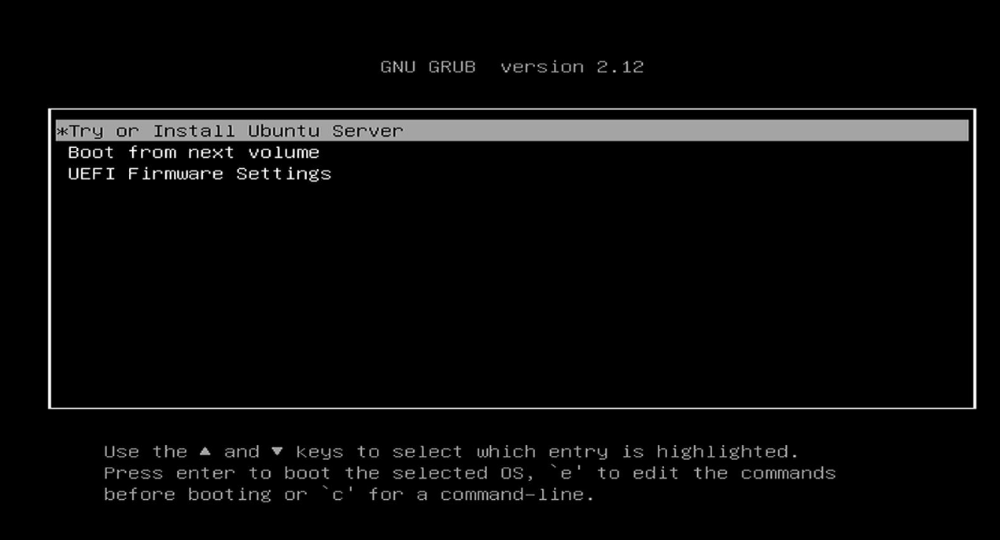
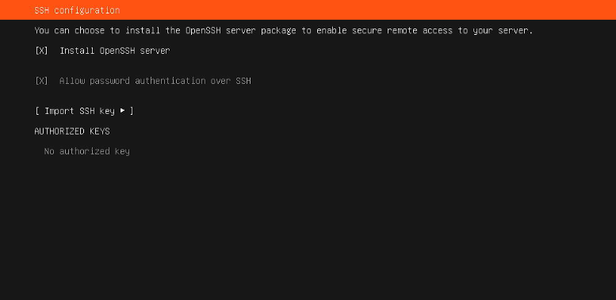
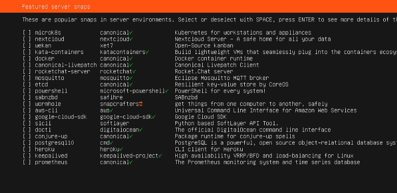
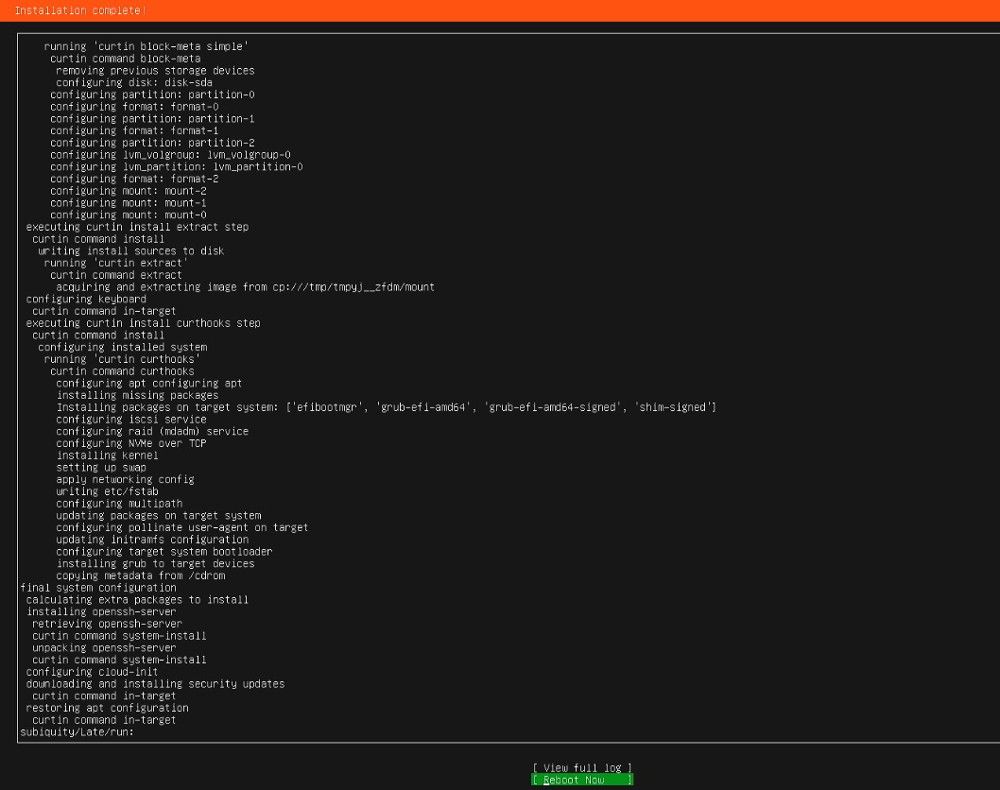
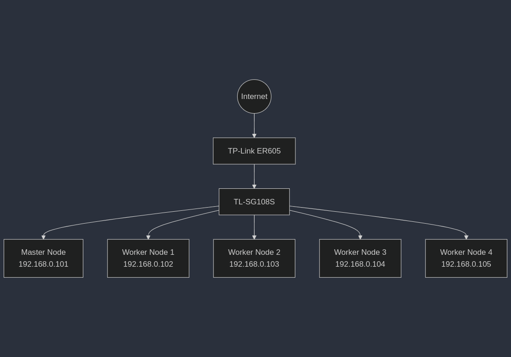

## Series Introduction

This series covers the process of installing a Kubernetes cluster in a homelab environment and building a CI/CD system for side projects and testing purposes. It demonstrates how to set up an environment where you can experiment with and learn various technologies by running Kubernetes at home without cloud infrastructure costs.



The hardware setup consists of five Dell OptiPlex Micro units as nodes and TP-Link router and switch for networking. The Dell OptiPlex Micro is a mini PC with low power consumption and can be purchased affordably on the used market.

The models purchased are equipped with 9th generation i5 CPUs, 16GB RAM, and 256GB SSDs, providing sufficient specifications to handle Kubernetes workloads.

## OS Installation

First, an operating system must be installed on each node. The Dell OptiPlex Micro units originally came with Windows 10 installed. This was removed and replaced with Ubuntu 24.04 LTS Server (CLI).

The server version of Ubuntu was chosen because it has no GUI, resulting in lower resource usage and is optimized for server environments like Kubernetes. Additionally, LTS versions provide long-term support with high stability and continuous security updates, making them suitable for server operations.

To install, create a bootable USB drive and proceed with the following steps.



First, select "Try or Install Ubuntu" and continue with the installation. Following the default settings, the server configuration screen shown below will appear.



Here, "Install OpenSSH server" must be selected. This is essential for remote SSH access to perform work. Since the system will operate as a headless server, this configuration is necessary to manage it remotely without a monitor and keyboard.

On the additional package installation screen, proceed without selecting any extra packages for now. Necessary packages can be installed later.



Once the installation is complete, the screen shown below will appear. Repeat this process identically on all nodes.



## Network Configuration

Once the operating system installation is complete, the network must be configured. The diagram below shows the network architecture.



Following the [previous post](ubuntu-2404-lts-set-static-ip), static IPs were assigned to each node. In a Kubernetes cluster, inter-node communication is critical, making static IP configuration essential.

IPs assigned via DHCP can change upon reboot, potentially compromising cluster stability. Additionally, using static IPs makes service discovery and load balancing configuration much simpler.

## Kubernetes Installation

With Ubuntu installation and network configuration complete, the actual Kubernetes installation can begin. To install Kubernetes, Docker and related packages must first be installed.

Execute the following commands on all nodes (both master and worker nodes).

```bash
sudo apt-get update && sudo apt-get upgrade -y
sudo apt-get install -y apt-transport-https ca-certificates curl software-properties-common

sudo apt-get update
sudo apt-get install ca-certificates curl
sudo install -m 0755 -d /etc/apt/keyrings
sudo curl -fsSL https://download.docker.com/linux/ubuntu/gpg -o /etc/apt/keyrings/docker.asc
sudo chmod a+r /etc/apt/keyrings/docker.asc

echo \
"deb [arch=$(dpkg --print-architecture) signed-by=/etc/apt/keyrings/docker.asc] https://download.docker.com/linux/ubuntu \
$(. /etc/os-release && echo "$VERSION_CODENAME") stable" | \
sudo tee /etc/apt/sources.list.d/docker.list > /dev/null

sudo apt-get update
sudo apt-get install docker-ce docker-ce-cli containerd.io

sudo systemctl start docker
sudo systemctl enable docker

echo "deb [signed-by=/etc/apt/keyrings/kubernetes-apt-keyring.gpg] https://pkgs.k8s.io/core:/stable:/v1.30/deb/ /" | sudo tee /etc/apt/sources.list.d/kubernetes.list
curl -fsSL https://pkgs.k8s.io/core:/stable:/v1.30/deb/Release.key | sudo gpg --dearmor -o /etc/apt/keyrings/kubernetes-apt-keyring.gpg

sudo apt-get update
sudo apt-get install -y kubelet kubeadm kubectl
sudo apt-mark hold kubelet kubeadm kubectl

# Disable swap (Kubernetes requires swap to be disabled)
sudo swapoff -a
sudo sed -i '/swap/d' /etc/fstab

# iptables configuration
cat <<EOF | sudo tee /etc/modules-load.d/k8s.conf
overlay
br_netfilter
EOF

sudo modprobe overlay
sudo modprobe br_netfilter

cat <<EOF | sudo tee /etc/sysctl.d/k8s.conf
net.bridge.bridge-nf-call-iptables  = 1
net.bridge.bridge-nf-call-ip6tables = 1
net.ipv4.ip_forward                 = 1
EOF

sudo sysctl --system

sudo mkdir -p /etc/containerd
sudo containerd config default | sudo tee /etc/containerd/config.toml
sudo sed -i 's/SystemdCgroup = false/SystemdCgroup = true/' /etc/containerd/config.toml
sudo systemctl restart containerd

sudo kubeadm config images pull
```

Executing the above commands performs the following steps:

1. Update package manager and install necessary dependencies
2. Add Docker repository and install Docker
3. Add Kubernetes repository and install kubelet, kubeadm, kubectl
4. Disable swap (Kubernetes requirement)
5. Configure iptables and load kernel modules
6. Configure and restart containerd
7. Download necessary Kubernetes images

Once all required packages are installed on all nodes, initialize the Kubernetes cluster by executing the following command on the master node only.

```bash
sudo kubeadm init --pod-network-cidr=10.244.0.0/16
```

The `--pod-network-cidr` option specifies the IP address range for the pod network, configured here to match the Calico network plugin.

When initialization is complete, the following message will be displayed.

```
Your Kubernetes control-plane has initialized successfully!

To start using your cluster, you need to run the following as a regular user:

  mkdir -p $HOME/.kube
  sudo cp -i /etc/kubernetes/admin.conf $HOME/.kube/config
  sudo chown $(id -u):$(id -g) $HOME/.kube/config

You should now deploy a pod network to the cluster.
Run "kubectl apply -f [podnetwork].yaml" with one of the options listed at:
  https://kubernetes.io/docs/concepts/cluster-administration/addons/

Then you can join any number of worker nodes by running the following on each as root:

kubeadm join <your-master-ip>:6443 --token <token> --discovery-token-ca-cert-hash sha256:<hash>
```

The `kubeadm join` command shown in the last part of the output must be executed on all worker nodes. This command connects worker nodes to the master node to form the cluster.

Next, execute the following commands on the master node to enable kubectl usage.

```bash
mkdir -p $HOME/.kube
sudo cp -i /etc/kubernetes/admin.conf $HOME/.kube/config
sudo chown $(id -u):$(id -g) $HOME/.kube/config
```

These commands copy the Kubernetes administrator configuration file to the current user directory and grant appropriate permissions to enable kubectl command execution.

The Kubernetes cluster is now configured, but a network plugin is needed for inter-node communication. Execute the following command on the master node to install the Calico network plugin.

Calico was chosen for its high performance and security policy support. Calico uses BGP to provide efficient network routing and allows fine-grained control of inter-pod traffic through network policies.

```bash
kubectl apply -f https://raw.githubusercontent.com/projectcalico/calico/v3.26.1/manifests/calico.yaml
```

This command installs all essential Calico components to enable inter-node network communication.

## Load Balancer Installation

To expose services within the cluster to the outside, a load balancer must be installed. MetalLB is used here. MetalLB is a load balancer commonly used in on-premises environments where, unlike cloud environments, a load balancer is not provided by default.

MetalLB was chosen because it enables the implementation of LoadBalancer-type services in Kubernetes even in bare-metal environments. This allows services to be exposed externally in a manner similar to cloud environments, maintaining consistency in development experience.

Install MetalLB with the following command.

```bash
kubectl apply -f https://raw.githubusercontent.com/metallb/metallb/v0.14.9/config/manifests/metallb-native.yaml
```

This command installs MetalLB's controller and speaker components.

Verify the installation was successful with the following command.

```bash
kubectl get pods -n metallb-system
```

In this series, MetalLB will be used in Layer 2 mode. In this mode, the load balancer is created using node IPs, and the ARP/NDP protocols are used to map assigned IPs to the corresponding node's MAC address.

For example, when MetalLB assigns the virtual IP 192.168.0.200, packets arriving at that IP are translated to the MAC address of the node with that IP through the ARP/NDP protocol and forwarded. This enables load balancer functionality.

To learn more about ARP and NDP, refer to the following posts:

-   [How ARP Protocol Works](how-arp-protocol-works)
-   [Understanding IPv6 NDP](understanding-ipv6-ndp)

### Conclusion

Through the process so far, a basic Kubernetes cluster has been built and a load balancer has been configured using MetalLB. A basic Kubernetes environment is now ready.

In the [next post](homelab-k8s-gitops), we will explore how to install ArgoCD on this foundation and integrate it with a Git repository to build the basis for GitOps.
