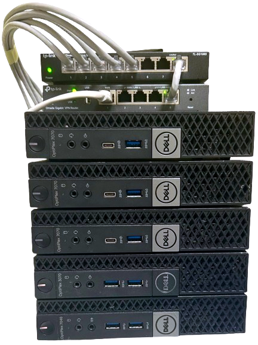
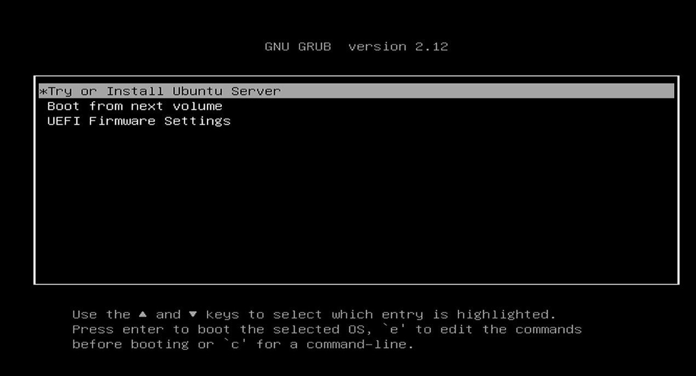
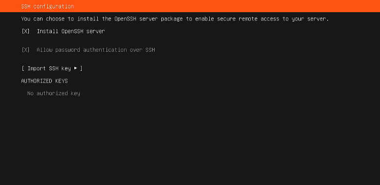
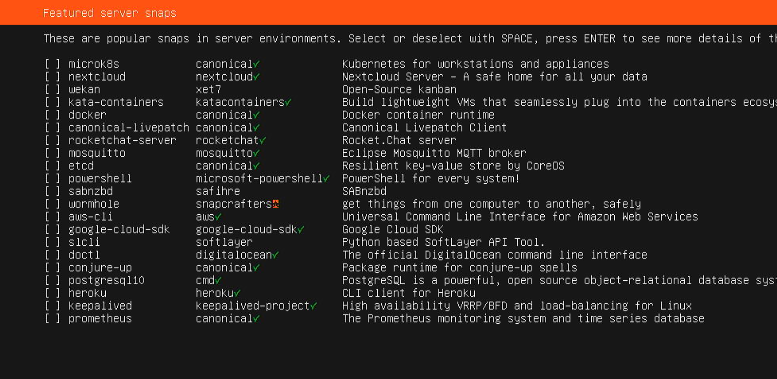
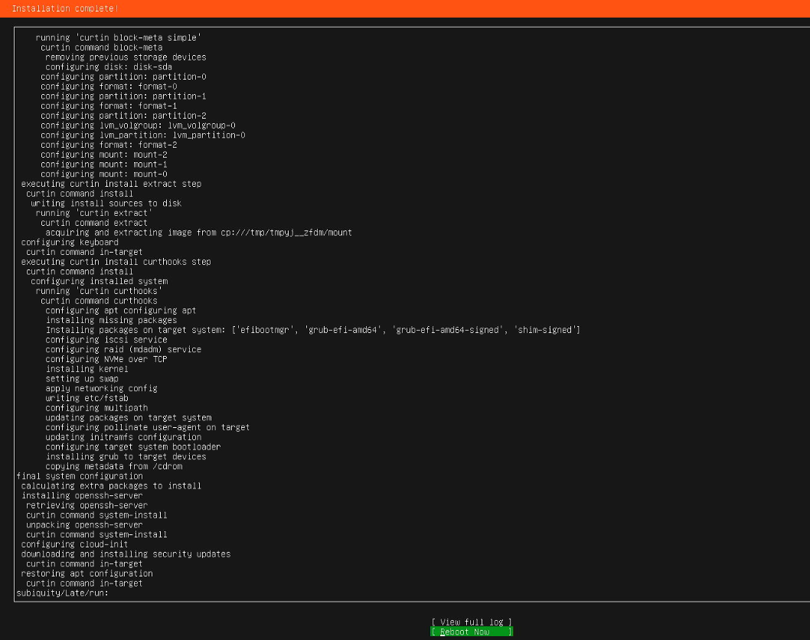
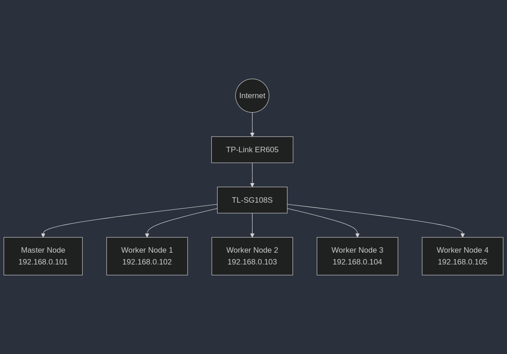

## 개요

이 시리즈는 홈랩을 만들고 운영하면서 정리해두고 싶은 것들을 기록하는 글이다. 설치 과정만 따라가는 문서보다는, 어떤 환경을 꾸렸고 왜 그렇게 구성했는지를 중심으로 적어가려 한다.

이번 글은 그 시작점으로, 미니PC로 쿠버네티스 클러스터를 구성할 때 사용한 하드웨어와 기본 설치 과정을 정리한다.



하드웨어는 Dell OptiPlex Micro 다섯 대를 클러스터 노드로 사용하고, TP-Link 라우터와 스위치로 네트워크를 구성했다. Dell OptiPlex Micro는 전력 소모가 적은 미니 PC라 중고 시장에서 비교적 저렴하게 구할 수 있다. 사용한 모델은 9세대 i5 CPU, 16GB 메모리, 256GB SSD를 갖추고 있어 쿠버네티스 워크로드를 처리하기에 충분한 사양이다.

> **홈랩(Homelab)이란?**
>
> 홈랩은 집이나 개인 공간에 직접 꾸리는 서버 환경을 뜻한다. 주로 학습이나 개인 프로젝트를 위해 서버, 네트워크 장비, 스토리지 등을 구성하며, 클라우드 비용 부담 없이 다양한 기술을 실험해볼 수 있다는 점이 장점이다.

## OS 설치

나는 각 노드에 원래 설치되어 있던 Windows 10을 제거하고 Ubuntu 24.04 LTS Server를 설치했다. GUI가 없어 시스템 리소스 사용량이 적고 쿠버네티스 같은 서버 환경에 잘 맞는다는 점이 선택 이유였고, 2029년까지 지원되는 LTS(Long Term Support) 버전이라 장기간 운영에도 부담이 적었다.

설치할 때는 Ubuntu ISO 파일을 내려받아 Rufus나 balenaEtcher 같은 도구로 부팅 가능한 USB를 만들고, BIOS에서 USB 부팅을 선택해 각 노드에 순서대로 설치했다.



부팅 후에는 "Try or Install Ubuntu"를 선택했고, 언어 선택과 키보드 레이아웃, 네트워크 설정 같은 기본 화면은 대부분 기본값으로 넘겼다. 이어서 아래와 같은 서버 설정 화면이 나타났다.



이 화면에서는 "Install OpenSSH server" 옵션을 켰다. 내 구성은 모니터와 키보드를 계속 연결해두지 않는 헤드리스(Headless) 방식이었기 때문에, 설치 시점에 SSH를 활성화해두는 쪽이 자연스러웠다.



추가 패키지 설치 화면에서는 Docker나 PostgreSQL 같은 사전 구성 패키지를 건드리지 않고 넘어갔다. 이 환경에서는 어차피 쿠버네티스 쪽에서 별도로 올릴 예정이라 설치 단계에서 미리 넣을 필요가 없었다.



설치가 끝나면 위와 같은 화면이 나타났고, 여기서 "Reboot Now"를 눌러 재부팅했다. 같은 과정을 다섯 대 모두 반복해서 운영체제 설치를 마무리했다.

## 네트워크 설정

운영체제 설치가 끝난 다음에는 네트워크를 정리했다. 내 홈랩에서는 노드 간 통신이 계속 안정적으로 유지되어야 했기 때문에 DHCP로 바뀔 수 있는 동적 IP 대신 고정 IP를 사용했다.



위 그림은 내가 구성한 네트워크 다이어그램이다. 마스터 노드 1대와 워커 노드 4대가 스위치를 통해 연결되어 있고, 라우터를 통해 외부 네트워크와 통신하는 구조다. 각 노드에는 192.168.0.x 대역의 고정 IP를 할당했다.

고정 IP를 잡는 과정은 [Ubuntu 24.04 LTS 고정 IP 설정하기](/posts/ubuntu-2404-lts-set-static-ip/) 글에 따로 정리해두었다. DHCP로 받은 주소는 라우터 재부팅이나 임대 시간 만료 때 바뀔 수 있어서, 내 클러스터에서는 처음부터 고정 IP로 맞춰두는 편이 훨씬 편했다.

## 쿠버네티스 설치

Ubuntu 설치와 네트워크 설정이 끝나면 이제 쿠버네티스를 올릴 차례다. 먼저 컨테이너 런타임인 containerd와 쿠버네티스 핵심 컴포넌트인 kubelet, kubeadm, kubectl을 설치해야 한다.

> **쿠버네티스 핵심 컴포넌트**
>
> - **kubelet**: 각 노드에서 실행되는 에이전트로, 컨테이너가 파드 내에서 정상적으로 실행되도록 관리한다.
> - **kubeadm**: 쿠버네티스 클러스터를 부트스트랩하는 도구로, 클러스터 초기화와 노드 조인을 담당한다.
> - **kubectl**: 쿠버네티스 클러스터와 상호작용하기 위한 CLI 도구로, 모든 관리 작업에 사용된다.

아래 명령은 마스터와 워커를 포함한 모든 노드에서 공통으로 실행했다.

```bash
# 시스템 패키지 업데이트
sudo apt-get update && sudo apt-get upgrade -y
sudo apt-get install -y apt-transport-https ca-certificates curl software-properties-common

# Docker 저장소 설정 및 containerd 설치
sudo apt-get update
sudo apt-get install ca-certificates curl
sudo install -m 0755 -d /etc/apt/keyrings
sudo curl -fsSL https://download.docker.com/linux/ubuntu/gpg -o /etc/apt/keyrings/docker.asc
sudo chmod a+r /etc/apt/keyrings/docker.asc

echo \
"deb [arch=$(dpkg --print-architecture) signed-by=/etc/apt/keyrings/docker.asc] https://download.docker.com/linux/ubuntu \
$(. /etc/os-release && echo "$VERSION_CODENAME") stable" | \
sudo tee /etc/apt/sources.list.d/docker.list > /dev/null

sudo apt-get update
sudo apt-get install docker-ce docker-ce-cli containerd.io

sudo systemctl start docker
sudo systemctl enable docker

# 쿠버네티스 저장소 설정 및 설치
echo "deb [signed-by=/etc/apt/keyrings/kubernetes-apt-keyring.gpg] https://pkgs.k8s.io/core:/stable:/v1.30/deb/ /" | sudo tee /etc/apt/sources.list.d/kubernetes.list
curl -fsSL https://pkgs.k8s.io/core:/stable:/v1.30/deb/Release.key | sudo gpg --dearmor -o /etc/apt/keyrings/kubernetes-apt-keyring.gpg

sudo apt-get update
sudo apt-get install -y kubelet kubeadm kubectl
sudo apt-mark hold kubelet kubeadm kubectl

# 스왑 비활성화
sudo swapoff -a
sudo sed -i '/swap/d' /etc/fstab

# 커널 모듈 로드 및 네트워크 설정
cat <<EOF | sudo tee /etc/modules-load.d/k8s.conf
overlay
br_netfilter
EOF

sudo modprobe overlay
sudo modprobe br_netfilter

cat <<EOF | sudo tee /etc/sysctl.d/k8s.conf
net.bridge.bridge-nf-call-iptables  = 1
net.bridge.bridge-nf-call-ip6tables = 1
net.ipv4.ip_forward                 = 1
EOF

sudo sysctl --system

# containerd 설정
sudo mkdir -p /etc/containerd
sudo containerd config default | sudo tee /etc/containerd/config.toml
sudo sed -i 's/SystemdCgroup = false/SystemdCgroup = true/' /etc/containerd/config.toml
sudo systemctl restart containerd

# 쿠버네티스 이미지 사전 다운로드
sudo kubeadm config images pull
```

이 스크립트로 한 작업은 다음과 같다:

1. **시스템 패키지 업데이트**: apt 저장소를 최신 상태로 업데이트하고 필수 의존성 패키지를 설치한다.
2. **containerd 설치**: Docker 공식 저장소에서 containerd를 설치하며, 쿠버네티스 1.24 버전부터는 Docker 대신 containerd를 직접 사용하는 것이 권장된다.
3. **쿠버네티스 컴포넌트 설치**: 공식 쿠버네티스 저장소에서 kubelet, kubeadm, kubectl을 설치하고, `apt-mark hold` 명령으로 자동 업그레이드를 방지한다.
4. **스왑 비활성화**: 쿠버네티스는 메모리 관리를 위해 스왑이 비활성화되어야 하며, `/etc/fstab`에서 스왑 항목을 제거하여 재부팅 후에도 비활성화 상태를 유지한다.
5. **커널 모듈 및 네트워크 설정**: overlay와 br_netfilter 모듈을 로드하고 IP 포워딩을 활성화하여 파드 간 네트워크 통신이 가능하도록 설정한다.
6. **containerd 설정 최적화**: SystemdCgroup을 활성화하여 kubelet과 containerd가 동일한 cgroup 드라이버를 사용하도록 설정한다.

모든 노드에 공통 패키지를 올린 뒤에는 마스터 노드에서만 아래 명령으로 클러스터를 초기화했다.

```bash
sudo kubeadm init --pod-network-cidr=10.244.0.0/16
```

`--pod-network-cidr` 옵션은 파드 네트워크에서 사용할 IP 주소 범위를 지정한다. 이 값은 CNI(Container Network Interface) 플러그인 설정과 일치해야 하며, 여기서는 Calico 기본 설정에 맞춰 10.244.0.0/16을 사용했다.

초기화가 성공적으로 완료되면 다음과 같은 메시지가 출력된다.

```
Your Kubernetes control-plane has initialized successfully!

To start using your cluster, you need to run the following as a regular user:

  mkdir -p $HOME/.kube
  sudo cp -i /etc/kubernetes/admin.conf $HOME/.kube/config
  sudo chown $(id -u):$(id -g) $HOME/.kube/config

You should now deploy a pod network to the cluster.
Run "kubectl apply -f [podnetwork].yaml" with one of the options listed at:
  https://kubernetes.io/docs/concepts/cluster-administration/addons/

Then you can join any number of worker nodes by running the following on each as root:

kubeadm join <your-master-ip>:6443 --token <token> --discovery-token-ca-cert-hash sha256:<hash>
```

출력 마지막의 `kubeadm join` 명령은 워커 노드를 붙일 때 그대로 사용했다. 토큰은 24시간 후 만료되기 때문에 나는 이 값을 바로 메모해두었고, 필요하면 `kubeadm token create --print-join-command`로 다시 만들 수 있다.

초기화 직후에는 마스터 노드에서 `kubectl`을 바로 쓸 수 있도록 kubeconfig도 같이 잡아줬다.

```bash
mkdir -p $HOME/.kube
sudo cp -i /etc/kubernetes/admin.conf $HOME/.kube/config
sudo chown $(id -u):$(id -g) $HOME/.kube/config
```

위 명령어는 쿠버네티스 관리자 설정 파일을 현재 사용자의 홈 디렉토리로 복사하고 적절한 권한을 부여하여 sudo 없이 kubectl 명령어를 실행할 수 있게 한다.

### CNI 플러그인 설치

쿠버네티스 클러스터가 초기화되었지만 아직 노드 간 파드 통신이 불가능하며, CNI(Container Network Interface) 플러그인을 설치해야 파드 네트워크가 구성되고 노드 간 통신이 가능해진다.

> **Calico란?**
>
> Calico는 쿠버네티스에서 널리 쓰이는 CNI 플러그인 중 하나다. 파드 간 네트워크를 구성하고 네트워크 정책을 적용할 수 있어, 트래픽 제어가 필요한 환경에서 자주 사용된다.

내 구성에서는 CNI로 Calico를 선택했고, 마스터 노드에서 아래 명령으로 설치했다.

```bash
kubectl apply -f https://raw.githubusercontent.com/projectcalico/calico/v3.26.1/manifests/calico.yaml
```

이 명령어는 Calico의 모든 필수 구성 요소(calico-node, calico-kube-controllers 등)를 kube-system 네임스페이스에 설치하며, 설치 완료 후 각 노드에 calico-node 파드가 실행되어 노드 간 네트워크 통신을 담당한다.

그다음에는 앞서 저장해둔 `kubeadm join` 명령을 각 워커 노드에서 실행해 클러스터에 붙였다.

```bash
sudo kubeadm join <master-ip>:6443 --token <token> --discovery-token-ca-cert-hash sha256:<hash>
```

워커 노드가 모두 붙은 뒤에는 마스터 노드에서 아래 명령으로 상태를 확인했다.

```bash
kubectl get nodes
```

모든 노드가 Ready 상태로 표시되면 클러스터가 정상적으로 구성된 것이다.

## 로드밸런서 설치

쿠버네티스에서 서비스를 외부에 노출하는 방법 중 하나는 LoadBalancer 타입을 사용하는 것인데, AWS나 GCP 같은 클라우드 환경에서는 클라우드 프로바이더가 자동으로 로드밸런서를 프로비저닝해주지만, 온프레미스나 홈랩 환경에서는 별도의 로드밸런서 구현체가 필요하다.

> **MetalLB란?**
>
> MetalLB는 베어메탈(Bare-metal) 쿠버네티스 클러스터에서 LoadBalancer 타입 서비스를 사용할 수 있게 해주는 로드밸런서 구현체다. Layer 2 모드와 BGP 모드를 지원하며, 홈랩 같은 온프레미스 환경에서 자주 사용된다.

로드밸런서 구현체로는 MetalLB를 골랐고, 설치는 아래 명령으로 진행했다.

```bash
kubectl apply -f https://raw.githubusercontent.com/metallb/metallb/v0.14.9/config/manifests/metallb-native.yaml
```

이 명령어는 MetalLB의 컨트롤러와 스피커 컴포넌트를 metallb-system 네임스페이스에 설치하며, 컨트롤러는 IP 주소 할당을 관리하고 스피커는 각 노드에서 실행되어 할당된 IP에 대한 네트워크 응답을 처리한다.

설치가 끝난 뒤에는 아래 명령으로 파드 상태를 확인했다.

```bash
kubectl get pods -n metallb-system
```

컨트롤러 파드 1개와 각 노드마다 스피커 파드가 Running 상태로 표시되어야 한다.

### MetalLB Layer 2 모드

이 시리즈에서는 MetalLB를 Layer 2 모드로 사용하며, 이 모드에서는 MetalLB 스피커가 ARP(IPv4) 또는 NDP(IPv6) 프로토콜을 사용하여 할당된 가상 IP를 자신의 MAC 주소로 응답함으로써 로드밸런서 기능을 구현한다.

예를 들어 MetalLB가 192.168.0.200이라는 가상 IP를 서비스에 할당하면, 같은 네트워크의 다른 장치가 192.168.0.200의 MAC 주소를 물어보는 ARP 요청을 보낼 때 MetalLB 스피커가 해당 서비스를 호스팅하는 노드의 MAC 주소로 응답하여 트래픽이 올바른 노드로 전달되도록 한다.

ARP와 NDP는 예전에 따로 정리해둔 글이 있어서, 여기서는 그 글을 함께 참고했다:

- [ARP 프로토콜의 작동 방식 완벽 이해](/posts/how-arp-protocol-works/)
- [IPv6 NDP(Neighbor Discovery Protocol) 이해하기](/posts/understanding-ipv6-ndp/)

## 마치며

이번 글에서는 Dell OptiPlex Micro를 활용하여 5대의 노드로 구성된 쿠버네티스 클러스터를 구축하고, Calico CNI로 파드 네트워크를 구성하고, MetalLB로 로드밸런서를 설정하는 방법을 살펴보았다. 이제 기본적인 쿠버네티스 환경이 준비되었으며, 이 클러스터 위에 다양한 워크로드를 배포하고 운영할 수 있는 기반이 마련되었다.

다음 글에서는 ArgoCD를 설치하여 GitOps 방식으로 쿠버네티스 리소스를 관리하는 방법을 알아본다.

[다음 글: 홈랩 구축기 #2: ArgoCD GitOps](/posts/homelab-k8s-gitops/)
