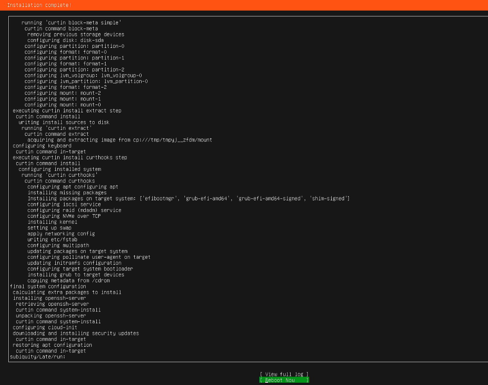
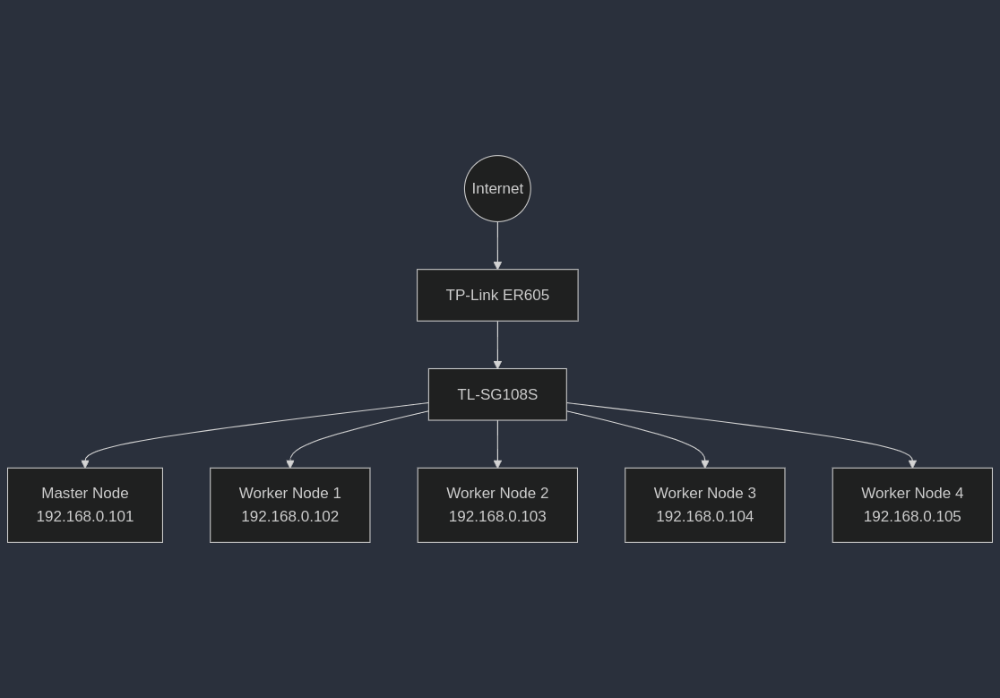

## 개요

이 시리즈는 홈랩 환경에 쿠버네티스 클러스터를 구축하고 사이드 프로젝트나 테스트 환경을 위한 완전한 CI/CD 파이프라인을 구성하는 과정을 다루며, 클라우드 서비스 비용에 대한 부담 없이 집에서 직접 쿠버네티스를 운영하면서 컨테이너 오케스트레이션, 네트워킹, 스토리지, 모니터링, GitOps 등 다양한 클라우드 네이티브 기술을 실험하고 학습할 수 있는 환경을 구성하는 방법을 알아본다.


하드웨어 구성으로는 Dell OptiPlex Micro 다섯 대로 노드를 구성하고 TP-Link 라우터와 스위치로 네트워크를 구성했으며, Dell OptiPlex Micro는 전력 소모가 적은 미니 PC로 중고 시장에서 저렴하게 구할 수 있는 장점이 있고, 구매한 모델은 9세대 i5 CPU와 16GB 메모리, 256GB SSD로 구성되어 있어 쿠버네티스 워크로드를 충분히 처리할 수 있는 사양을 갖추고 있다.

> **홈랩(Homelab)이란?**
>
> 홈랩은 집에 구축하는 개인 서버 환경으로, 주로 IT 전문가나 개발자가 학습 목적이나 개인 프로젝트를 위해 서버, 네트워크 장비, 스토리지 등을 구성하여 실제 데이터센터와 유사한 환경을 만드는 것을 의미하며, 클라우드 비용 없이 다양한 기술을 실험하고 경험할 수 있는 장점이 있다.

## OS 설치

먼저 각 노드에 운영체제를 설치해야 하며, Dell OptiPlex Micro에 원래 설치되어 있던 Windows 10을 제거하고 Ubuntu 24.04 LTS Server 버전을 설치한다. 서버용 Ubuntu를 선택한 이유는 GUI가 없어 시스템 리소스 사용량이 적고 쿠버네티스와 같은 서버 환경에 최적화되어 있기 때문이며, LTS(Long Term Support) 버전은 2029년까지 5년간 보안 업데이트와 기술 지원이 제공되어 안정적인 서버 운영에 적합하다.

설치를 위해 Ubuntu ISO 파일을 다운로드하고 Rufus나 balenaEtcher와 같은 도구를 사용하여 부팅 가능한 USB를 만든 후, BIOS에서 USB 부팅을 선택하여 설치를 진행한다.


부팅 후 "Try or Install Ubuntu"를 선택하고 설치를 진행하면 언어 선택, 키보드 레이아웃, 네트워크 설정 등 기본 설정 화면이 나타나며, 기본값을 따라가다 보면 아래와 같은 서버 설정 화면이 나타난다.


이 화면에서 "Install OpenSSH server" 옵션을 반드시 선택해야 하며, 이는 모니터와 키보드 없이 네트워크를 통해 원격으로 서버에 접속하여 관리하기 위한 필수 설정으로, 헤드리스(Headless) 서버 환경에서는 SSH가 유일한 접속 수단이 되기 때문에 설치 시점에 활성화하는 것이 중요하다.


추가 패키지 설치 화면에서는 Docker나 PostgreSQL 같은 사전 구성된 패키지들이 제공되지만, 쿠버네티스 환경에서는 별도의 방식으로 설치할 예정이므로 여기서는 아무것도 선택하지 않고 진행하며, 필요한 패키지는 설치 완료 후 직접 설치한다.



설치가 완료되면 위와 같은 화면이 나타나며, "Reboot Now"를 선택하여 시스템을 재부팅한다. 이 과정을 모든 노드에서 동일하게 반복하여 운영체제 설치를 완료한다.

## 네트워크 설정

운영체제 설치가 완료되었다면 다음으로 네트워크를 구성해야 하며, 쿠버네티스 클러스터에서는 노드 간 통신이 매우 중요하기 때문에 DHCP로 할당된 동적 IP 대신 고정 IP를 사용하는 것이 필수적이다.



위 그림은 구성한 네트워크 다이어그램으로, 마스터 노드 1대와 워커 노드 4대가 스위치를 통해 연결되어 있고 라우터를 통해 외부 네트워크와 통신하는 구조이며, 각 노드에는 192.168.0.x 대역의 고정 IP가 할당되어 있다.

고정 IP 설정 방법은 [Ubuntu 24.04 LTS 고정 IP 설정하기](/posts/ubuntu-2404-lts-set-static-ip/) 포스트를 참고하면 되며, DHCP로 할당된 IP는 라우터 재부팅이나 DHCP 임대 시간 만료 시 변경될 수 있어 클러스터 안정성을 해칠 수 있고, 고정 IP를 사용하면 쿠버네티스의 서비스 디스커버리와 로드밸런싱 구성이 훨씬 간편해진다.

## 쿠버네티스 설치

Ubuntu 설치와 네트워크 설정이 완료되었으니 이제 본격적으로 쿠버네티스를 설치하며, 쿠버네티스 설치를 위해서는 먼저 컨테이너 런타임인 containerd와 쿠버네티스 핵심 컴포넌트인 kubelet, kubeadm, kubectl을 설치해야 한다.

> **쿠버네티스 핵심 컴포넌트**
>
> - **kubelet**: 각 노드에서 실행되는 에이전트로, 컨테이너가 파드 내에서 정상적으로 실행되도록 관리한다.
> - **kubeadm**: 쿠버네티스 클러스터를 부트스트랩하는 도구로, 클러스터 초기화와 노드 조인을 담당한다.
> - **kubectl**: 쿠버네티스 클러스터와 상호작용하기 위한 CLI 도구로, 모든 관리 작업에 사용된다.

다음 명령어를 모든 노드(마스터 노드와 워커 노드 모두)에서 실행한다.

```bash
# 시스템 패키지 업데이트
sudo apt-get update && sudo apt-get upgrade -y
sudo apt-get install -y apt-transport-https ca-certificates curl software-properties-common

# Docker 저장소 설정 및 containerd 설치
sudo apt-get update
sudo apt-get install ca-certificates curl
sudo install -m 0755 -d /etc/apt/keyrings
sudo curl -fsSL https://download.docker.com/linux/ubuntu/gpg -o /etc/apt/keyrings/docker.asc
sudo chmod a+r /etc/apt/keyrings/docker.asc

echo \
"deb [arch=$(dpkg --print-architecture) signed-by=/etc/apt/keyrings/docker.asc] https://download.docker.com/linux/ubuntu \
$(. /etc/os-release && echo "$VERSION_CODENAME") stable" | \
sudo tee /etc/apt/sources.list.d/docker.list > /dev/null

sudo apt-get update
sudo apt-get install docker-ce docker-ce-cli containerd.io

sudo systemctl start docker
sudo systemctl enable docker

# 쿠버네티스 저장소 설정 및 설치
echo "deb [signed-by=/etc/apt/keyrings/kubernetes-apt-keyring.gpg] https://pkgs.k8s.io/core:/stable:/v1.30/deb/ /" | sudo tee /etc/apt/sources.list.d/kubernetes.list
curl -fsSL https://pkgs.k8s.io/core:/stable:/v1.30/deb/Release.key | sudo gpg --dearmor -o /etc/apt/keyrings/kubernetes-apt-keyring.gpg

sudo apt-get update
sudo apt-get install -y kubelet kubeadm kubectl
sudo apt-mark hold kubelet kubeadm kubectl

# 스왑 비활성화
sudo swapoff -a
sudo sed -i '/swap/d' /etc/fstab

# 커널 모듈 로드 및 네트워크 설정
cat <<EOF | sudo tee /etc/modules-load.d/k8s.conf
overlay
br_netfilter
EOF

sudo modprobe overlay
sudo modprobe br_netfilter

cat <<EOF | sudo tee /etc/sysctl.d/k8s.conf
net.bridge.bridge-nf-call-iptables  = 1
net.bridge.bridge-nf-call-ip6tables = 1
net.ipv4.ip_forward                 = 1
EOF

sudo sysctl --system

# containerd 설정
sudo mkdir -p /etc/containerd
sudo containerd config default | sudo tee /etc/containerd/config.toml
sudo sed -i 's/SystemdCgroup = false/SystemdCgroup = true/' /etc/containerd/config.toml
sudo systemctl restart containerd

# 쿠버네티스 이미지 사전 다운로드
sudo kubeadm config images pull
```

위 스크립트는 다음 작업을 수행한다:

1. **시스템 패키지 업데이트**: apt 저장소를 최신 상태로 업데이트하고 필수 의존성 패키지를 설치한다.
2. **containerd 설치**: Docker 공식 저장소에서 containerd를 설치하며, 쿠버네티스 1.24 버전부터는 Docker 대신 containerd를 직접 사용하는 것이 권장된다.
3. **쿠버네티스 컴포넌트 설치**: 공식 쿠버네티스 저장소에서 kubelet, kubeadm, kubectl을 설치하고, `apt-mark hold` 명령으로 자동 업그레이드를 방지한다.
4. **스왑 비활성화**: 쿠버네티스는 메모리 관리를 위해 스왑이 비활성화되어야 하며, `/etc/fstab`에서 스왑 항목을 제거하여 재부팅 후에도 비활성화 상태를 유지한다.
5. **커널 모듈 및 네트워크 설정**: overlay와 br_netfilter 모듈을 로드하고 IP 포워딩을 활성화하여 파드 간 네트워크 통신이 가능하도록 설정한다.
6. **containerd 설정 최적화**: SystemdCgroup을 활성화하여 kubelet과 containerd가 동일한 cgroup 드라이버를 사용하도록 설정한다.

모든 노드에 필요한 패키지 설치가 완료되었다면, 이제 마스터 노드에서만 아래 명령어를 실행하여 쿠버네티스 클러스터를 초기화한다.

```bash
sudo kubeadm init --pod-network-cidr=10.244.0.0/16
```

`--pod-network-cidr` 옵션은 파드 네트워크에서 사용할 IP 주소 범위를 지정하며, 이 값은 CNI(Container Network Interface) 플러그인 설정과 일치해야 하고, 여기서는 Calico 네트워크 플러그인의 기본 설정에 맞춰 10.244.0.0/16을 사용한다.

초기화가 성공적으로 완료되면 다음과 같은 메시지가 출력된다.

```
Your Kubernetes control-plane has initialized successfully!

To start using your cluster, you need to run the following as a regular user:

  mkdir -p $HOME/.kube
  sudo cp -i /etc/kubernetes/admin.conf $HOME/.kube/config
  sudo chown $(id -u):$(id -g) $HOME/.kube/config

You should now deploy a pod network to the cluster.
Run "kubectl apply -f [podnetwork].yaml" with one of the options listed at:
  https://kubernetes.io/docs/concepts/cluster-administration/addons/

Then you can join any number of worker nodes by running the following on each as root:

kubeadm join <your-master-ip>:6443 --token <token> --discovery-token-ca-cert-hash sha256:<hash>
```

출력 메시지 마지막 부분에 있는 `kubeadm join` 명령어는 워커 노드를 클러스터에 추가할 때 사용하며, 이 토큰은 24시간 후 만료되므로 메모해두거나 나중에 `kubeadm token create --print-join-command` 명령으로 새로 생성할 수 있다.

마스터 노드에서 kubectl을 사용할 수 있도록 다음 명령어를 실행하여 kubeconfig 파일을 설정한다.

```bash
mkdir -p $HOME/.kube
sudo cp -i /etc/kubernetes/admin.conf $HOME/.kube/config
sudo chown $(id -u):$(id -g) $HOME/.kube/config
```

위 명령어는 쿠버네티스 관리자 설정 파일을 현재 사용자의 홈 디렉토리로 복사하고 적절한 권한을 부여하여 sudo 없이 kubectl 명령어를 실행할 수 있게 한다.

### CNI 플러그인 설치

쿠버네티스 클러스터가 초기화되었지만 아직 노드 간 파드 통신이 불가능하며, CNI(Container Network Interface) 플러그인을 설치해야 파드 네트워크가 구성되고 노드 간 통신이 가능해진다.

> **Calico란?**
>
> Calico는 쿠버네티스 환경에서 가장 널리 사용되는 CNI 플러그인 중 하나로, Tigera에서 개발하여 오픈소스로 공개되었으며, BGP(Border Gateway Protocol)를 사용한 고성능 네트워크 라우팅과 강력한 네트워크 정책 기능을 제공하여 파드 간 트래픽을 세밀하게 제어할 수 있다.

마스터 노드에서 다음 명령어를 실행하여 Calico를 설치한다.

```bash
kubectl apply -f https://raw.githubusercontent.com/projectcalico/calico/v3.26.1/manifests/calico.yaml
```

이 명령어는 Calico의 모든 필수 구성 요소(calico-node, calico-kube-controllers 등)를 kube-system 네임스페이스에 설치하며, 설치 완료 후 각 노드에 calico-node 파드가 실행되어 노드 간 네트워크 통신을 담당한다.

이제 앞서 저장해둔 `kubeadm join` 명령어를 모든 워커 노드에서 실행하여 클러스터에 참여시킨다.

```bash
sudo kubeadm join <master-ip>:6443 --token <token> --discovery-token-ca-cert-hash sha256:<hash>
```

모든 노드가 정상적으로 클러스터에 참여했는지 마스터 노드에서 다음 명령어로 확인한다.

```bash
kubectl get nodes
```

모든 노드가 Ready 상태로 표시되면 클러스터가 정상적으로 구성된 것이다.

## 로드밸런서 설치

쿠버네티스에서 서비스를 외부에 노출하는 방법 중 하나는 LoadBalancer 타입을 사용하는 것인데, AWS나 GCP 같은 클라우드 환경에서는 클라우드 프로바이더가 자동으로 로드밸런서를 프로비저닝해주지만, 온프레미스나 홈랩 환경에서는 별도의 로드밸런서 구현체가 필요하다.

> **MetalLB란?**
>
> MetalLB는 베어메탈(Bare-metal) 쿠버네티스 클러스터를 위한 로드밸런서 구현체로, Google의 David Anderson이 2017년에 개발을 시작하여 현재는 CNCF 샌드박스 프로젝트로 관리되고 있으며, Layer 2 모드와 BGP 모드를 지원하여 클라우드 환경과 동일한 방식으로 LoadBalancer 타입 서비스를 사용할 수 있게 해준다.

다음 명령어로 MetalLB를 설치한다.

```bash
kubectl apply -f https://raw.githubusercontent.com/metallb/metallb/v0.14.9/config/manifests/metallb-native.yaml
```

이 명령어는 MetalLB의 컨트롤러와 스피커 컴포넌트를 metallb-system 네임스페이스에 설치하며, 컨트롤러는 IP 주소 할당을 관리하고 스피커는 각 노드에서 실행되어 할당된 IP에 대한 네트워크 응답을 처리한다.

설치가 완료되었는지 다음 명령어로 확인한다.

```bash
kubectl get pods -n metallb-system
```

컨트롤러 파드 1개와 각 노드마다 스피커 파드가 Running 상태로 표시되어야 한다.

### MetalLB Layer 2 모드

이 시리즈에서는 MetalLB를 Layer 2 모드로 사용하며, 이 모드에서는 MetalLB 스피커가 ARP(IPv4) 또는 NDP(IPv6) 프로토콜을 사용하여 할당된 가상 IP를 자신의 MAC 주소로 응답함으로써 로드밸런서 기능을 구현한다.

예를 들어 MetalLB가 192.168.0.200이라는 가상 IP를 서비스에 할당하면, 같은 네트워크의 다른 장치가 192.168.0.200의 MAC 주소를 물어보는 ARP 요청을 보낼 때 MetalLB 스피커가 해당 서비스를 호스팅하는 노드의 MAC 주소로 응답하여 트래픽이 올바른 노드로 전달되도록 한다.

ARP와 NDP 프로토콜에 대해 더 자세히 알아보려면 다음 글을 참고한다:

- [ARP 프로토콜의 작동 방식 완벽 이해](/posts/how-arp-protocol-works/)
- [IPv6 NDP(Neighbor Discovery Protocol) 이해하기](/posts/understanding-ipv6-ndp/)

## 마치며

이번 글에서는 Dell OptiPlex Micro를 활용하여 5대의 노드로 구성된 쿠버네티스 클러스터를 구축하고, Calico CNI로 파드 네트워크를 구성하고, MetalLB로 로드밸런서를 설정하는 방법을 살펴보았다. 이제 기본적인 쿠버네티스 환경이 준비되었으며, 이 클러스터 위에 다양한 워크로드를 배포하고 운영할 수 있는 기반이 마련되었다.

다음 글에서는 ArgoCD를 설치하여 GitOps 방식으로 쿠버네티스 리소스를 관리하는 방법을 알아본다.

[다음 글: 미니PC Kubernetes #2: ArgoCD GitOps](/posts/homelab-k8s-gitops/)
