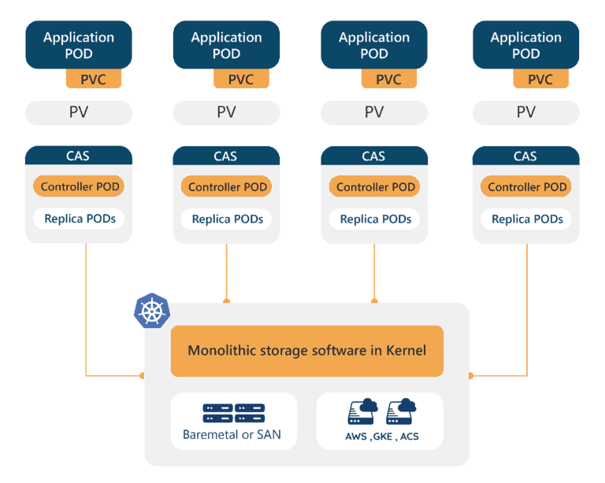
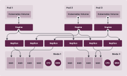
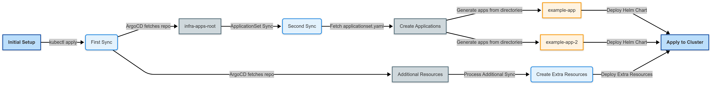
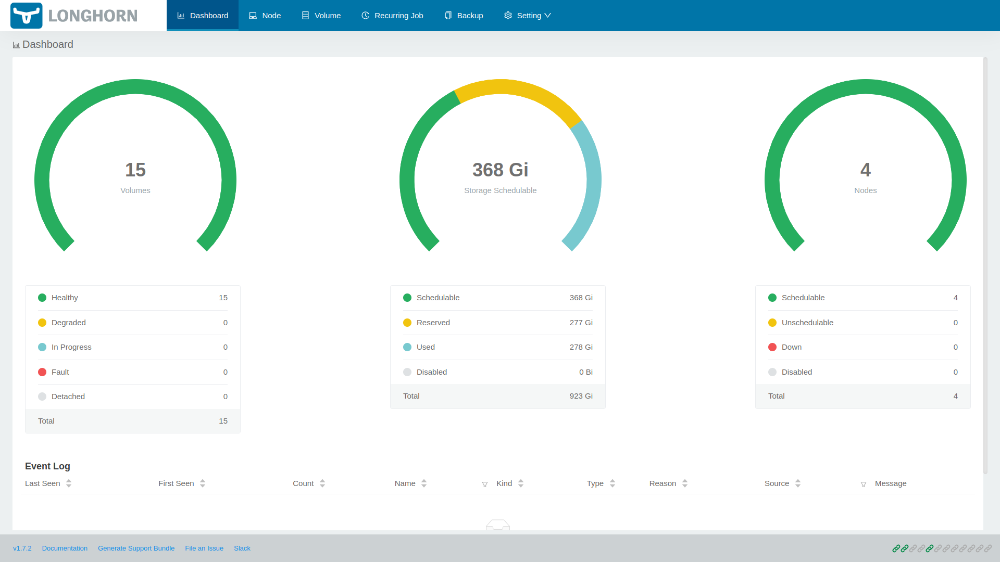

## Overview

In the [previous post](/posts/homelab-k8s-gitops/), we set up a GitOps environment by installing ArgoCD. This post covers how to install and configure the Longhorn distributed storage system in a homelab Kubernetes cluster, sharing experiences from evaluating various storage solutions and explaining why persistent storage is necessary.


## Storage Challenges in a Homelab Environment

One of the biggest challenges when building a homelab Kubernetes cluster was configuring storage. Most practical applications such as databases, monitoring tools, and backup systems require persistent storage that maintains data even when pods restart or move to different nodes.



Initially, the following approaches were attempted:

1. **Local Storage**: The simplest approach using local disks on each node directly, but when pods were rescheduled to different nodes, data stored on the original node became inaccessible. The critical drawback is that data recovery is impossible when a node fails.

2. **NFS (Network File System)**: Configuring a separate NAS device as an NFS server for shared storage across all nodes allows pods to access the same data regardless of which node they run on. However, the NFS server becomes a single point of failure, making all storage inaccessible when the server fails. Stability issues with NFS file locking in Kubernetes environments were also experienced.

3. **Rook-Ceph**: Deploying the Kubernetes-native distributed storage solution Ceph through the Rook operator provides powerful features and high reliability. However, it requires a minimum of 3 OSD (Object Storage Daemon) nodes and has significant memory and CPU overhead, creating resource burden in a homelab environment built with Dell OptiPlex Micro units.

After several trials and errors, Longhorn was chosen. Longhorn is simple to install, has low resource requirements, yet provides enterprise-grade features like distributed replication, snapshots, and backup, making it the most suitable distributed storage system for homelab scale.

## Problems Solved by Longhorn

After adopting Longhorn, the following problems were resolved:

1. **Data Persistence**: Volume data is replicated and stored across multiple nodes, so if a specific node fails, data can be read from replicas on other nodes, greatly reducing the risk of data loss. Previously, data stored in local storage could disappear or become inaccessible after node reboots.

2. **Workload Mobility**: Even when the Kubernetes scheduler moves pods to different nodes, Longhorn automatically handles making volumes accessible on those nodes, allowing pods to continue accessing the same data.

3. **Backup and Recovery**: Through Longhorn's built-in backup functionality, volume snapshots can be created and backed up to S3-compatible object storage or NFS servers, making it easy to protect important data.

4. **Ease of Management**: Through the web UI dashboard provided by Longhorn, volume status, replica distribution, per-node storage usage, and more can be visually monitored and managed, greatly reducing operational burden.

## Introduction to Longhorn

> **What is Longhorn?**
>
> Longhorn is a lightweight distributed block storage system for Kubernetes. Rancher Labs started development in 2017 and released it as open source. It is currently managed as a CNCF (Cloud Native Computing Foundation) incubating project. It creates a distributed storage pool using each node's local disk and provides high availability and data protection by replicating volume data across multiple nodes.



Key features of Longhorn include:

- **Distributed Replication**: Each volume is replicated and stored across multiple nodes according to the configured replica count (default 3). When a node fails, replicas are automatically reconstructed on other nodes.
- **Microservices Architecture**: Each volume operates as an independent microservice, so problems with one volume do not affect other volumes.
- **Snapshots and Backup**: Point-in-time snapshots of volumes can be created and backed up to external storage, facilitating data protection and disaster recovery.
- **Intuitive Web UI**: Provides a dashboard for visually managing volumes, nodes, and backup status.
- **Lightweight Design**: Has lower resource requirements compared to Rook-Ceph, making it suitable for homelab or edge environments.

## Longhorn Installation Requirements

Before installing Longhorn, verify that all nodes meet the following requirements:

1. **Supported OS**: Supports most Linux distributions including Ubuntu 18.04+, Debian 10+, CentOS 7+, RHEL 7+.
2. **Container Runtime**: Docker or containerd must be installed.
3. **open-iscsi Package**: Longhorn uses iSCSI to attach volumes to nodes, so the open-iscsi package is required.
4. **NFSv4 Client**: Required if using an NFS server as a backup target.

### Prerequisites

SSH into all nodes and install the required packages:

```bash
sudo apt-get update
sudo apt-get install -y open-iscsi nfs-common
sudo systemctl enable iscsid
sudo systemctl start iscsid
```

The commands above update the package list, install the iSCSI initiator (open-iscsi) and NFS client (nfs-common), then enable the iSCSI daemon to start automatically at system boot and start it immediately.

Verify that the iSCSI service is running properly on each node:

```bash
sudo systemctl status iscsid
```

You should see `active (running)` status like this:

```
● iscsid.service - iSCSI Initiator Daemon
     Loaded: loaded (/lib/systemd/system/iscsid.service; enabled; vendor preset: enabled)
     Active: active (running) since Tue 2025-02-25 08:30:15 UTC; 5s ago
```

## Installing Longhorn with GitOps

In this series, all Kubernetes resources are managed using GitOps methodology. Longhorn is also configured by defining Helm chart settings in a Git repository and having ArgoCD automatically deploy it. The Git repository used is `https://github.com/injunweb/k8s-resource`.

### 1. Add Longhorn Helm Chart Configuration to Git Repository

First, clone the repository locally and create the directory structure for Longhorn configuration:

```bash
git clone https://github.com/injunweb/k8s-resource.git
cd k8s-resource
mkdir -p apps/longhorn-system
cd apps/longhorn-system
```

Create the `Chart.yaml` file to define the Helm chart's metadata and dependencies:

```yaml
apiVersion: v2
name: longhorn
description: Longhorn Distributed Block Storage for Kubernetes
type: application
version: 1.0.0
appVersion: 1.4.0
dependencies:
    - name: longhorn
      version: 1.4.0
      repository: https://charts.longhorn.io
```

This configuration defines fetching and installing the v1.4.0 chart from the official Longhorn Helm repository (`https://charts.longhorn.io`).

Create the `values.yaml` file to define Longhorn's detailed settings:

```yaml
longhorn:
    defaultSettings:
        defaultDataPath: /var/lib/longhorn
        defaultDataLocality: best-effort
        replicaAutoBalance: best-effort

    preUpgradeChecker:
        jobEnabled: false
```

The meaning of each configuration item is as follows:

- **defaultDataPath**: The directory path where Longhorn stores volume data on each node. Using the default `/var/lib/longhorn` stores data on the system disk.
- **defaultDataLocality**: When set to `best-effort`, Longhorn places volume replicas on the node where pods are running when possible, improving performance through local disk access.
- **replicaAutoBalance**: When set to `best-effort`, replicas are automatically redistributed across nodes when nodes are added or removed, maintaining balanced storage usage.
- **preUpgradeChecker.jobEnabled**: Disables the pre-upgrade check Job for Longhorn upgrades. In ArgoCD environments, this Job can cause synchronization issues, so it should be set to `false`.

Commit and push the changes to Git:

```bash
git add .
git commit -m "Add Longhorn distributed storage configuration"
git push
```

### 2. Automatic Deployment via ApplicationSet

ArgoCD's ApplicationSet controller monitors the `apps/` directory in the Git repository and automatically creates and deploys applications when new subdirectories are detected.



The automatic deployment process of ApplicationSet is as follows:

1. **Directory Detection**: The ApplicationSet controller periodically scans the `apps/` directory of the Git repository (`https://github.com/injunweb/k8s-resource`) and detects the new `longhorn-system` directory.
2. **Application Creation**: According to the template, an ArgoCD Application resource named `longhorn-system` (matching the directory name) is automatically created.
3. **Namespace Creation**: A namespace with the same name as the application, `longhorn-system`, is created in the cluster.
4. **Helm Chart Deployment**: ArgoCD parses the Helm chart in that directory, resolves dependencies, and deploys resources to the cluster.

Verify the application created by ApplicationSet:

```bash
kubectl get applications -n argocd
```

Confirm that the `longhorn-system` application has been created and synchronized in the output:

```
NAME              SYNC STATUS   HEALTH STATUS
longhorn-system   Synced        Healthy
```

The newly created `longhorn-system` application's details and deployed resources can also be visually confirmed in the ArgoCD web UI.

### 3. Verify Longhorn Deployment Status

Verify that all Longhorn components have been successfully deployed:

```bash
kubectl -n longhorn-system get pods
```

All pods should be in `Running` status as follows:

```
NAME                                                READY   STATUS    RESTARTS   AGE
csi-attacher-77d87d4c79-bkw5r                       1/1     Running   0          5m
csi-attacher-77d87d4c79-d42zq                       1/1     Running   0          5m
csi-attacher-77d87d4c79-zlszr                       1/1     Running   0          5m
csi-provisioner-5c9dfb6446-7xk2n                    1/1     Running   0          5m
csi-provisioner-5c9dfb6446-l8xz4                    1/1     Running   0          5m
csi-provisioner-5c9dfb6446-w9vmc                    1/1     Running   0          5m
csi-resizer-6f8d9f7f9c-2jk8p                        1/1     Running   0          5m
csi-snapshotter-86bc9b7f6c-5xz8k                    1/1     Running   0          5m
engine-image-ei-68f17757-2j8k5                      1/1     Running   0          5m
instance-manager-e-xxxxx                            1/1     Running   0          5m
instance-manager-r-xxxxx                            1/1     Running   0          5m
longhorn-csi-plugin-xxxxx                           2/2     Running   0          5m
longhorn-driver-deployer-xxxxx                      1/1     Running   0          5m
longhorn-manager-xxxxx                              1/1     Running   0          5m
longhorn-ui-xxxxx                                   1/1     Running   0          5m
```

Verify that Longhorn is registered as the default StorageClass:

```bash
kubectl get storageclass
```

```
NAME                 PROVISIONER          RECLAIMPOLICY   VOLUMEBINDINGMODE   ALLOWVOLUMEEXPANSION   AGE
longhorn (default)   driver.longhorn.io   Delete          Immediate           true                   5m
```

## Accessing the Longhorn Web UI

Longhorn provides a web UI for visually managing volumes, nodes, and backup status. It can be accessed locally through port forwarding:

```bash
kubectl port-forward -n longhorn-system svc/longhorn-frontend 8080:80
```

This command forwards port 8080 on the local system to port 80 of the Longhorn frontend service. Accessing `http://localhost:8080` in a web browser displays the Longhorn dashboard.



From the dashboard, you can view and manage the overall cluster storage capacity and usage, each volume's status and replica distribution, per-node storage status, scheduled backup jobs, and more at a glance.

## Testing

To verify that Longhorn is working properly, create a test PVC (PersistentVolumeClaim) and pod to confirm that volumes are properly provisioned and mounted.

```yaml
apiVersion: v1
kind: PersistentVolumeClaim
metadata:
    name: longhorn-test-pvc
spec:
    accessModes:
        - ReadWriteOnce
    storageClassName: longhorn
    resources:
        requests:
            storage: 1Gi
---
apiVersion: v1
kind: Pod
metadata:
    name: volume-test
spec:
    containers:
        - name: volume-test
          image: nginx:alpine
          volumeMounts:
              - name: test-volume
                mountPath: /data
    volumes:
        - name: test-volume
          persistentVolumeClaim:
              claimName: longhorn-test-pvc
```

This manifest defines two resources:

1. **PersistentVolumeClaim**: Requests a 1GB read/write volume using the `longhorn` StorageClass.
2. **Pod**: Runs an nginx container and mounts the requested PVC at the `/data` path.

Apply the manifest and verify that the volume is properly mounted:

```bash
kubectl apply -f test.yaml
kubectl get pvc longhorn-test-pvc
```

If the PVC status shows `Bound`, Longhorn has successfully provisioned the volume:

```
NAME                STATUS   VOLUME                                     CAPACITY   ACCESS MODES   STORAGECLASS   AGE
longhorn-test-pvc   Bound    pvc-xxxxxxxx-xxxx-xxxx-xxxx-xxxxxxxxxxxx   1Gi        RWO            longhorn       30s
```

Verify that the volume is mounted inside the pod:

```bash
kubectl exec -it volume-test -- df -h /data
```

If mounted successfully, the `/data` directory will be displayed as a 1GB volume:

```
Filesystem                Size      Used Available Use% Mounted on
/dev/longhorn/pvc-xxx     976.0M    2.5M    907.4M   0% /data
```

Once testing is complete, delete the created resources:

```bash
kubectl delete -f test.yaml
```

## Conclusion

This post covered installing and configuring the Longhorn distributed storage system in a homelab Kubernetes cluster. Longhorn overcomes the limitations of local storage and NFS while being lighter than Rook-Ceph, making it a suitable storage solution for homelab environments. It provides enterprise-grade features including data protection through distributed replication, snapshot and backup functionality, and an intuitive web UI.

The next post covers installing the Traefik ingress controller and configuring access to internal services.

[Next Post: Homelab Kubernetes #4 - Traefik Ingress and Internal/External Service Separation](/posts/homelab-k8s-internal-services/)
