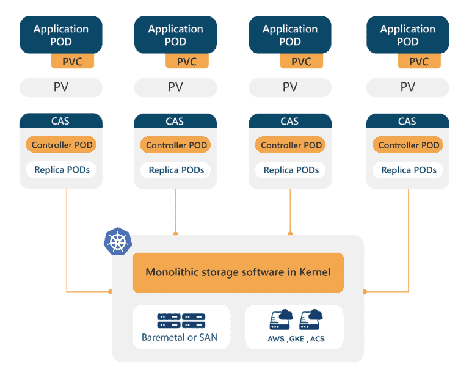
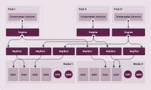
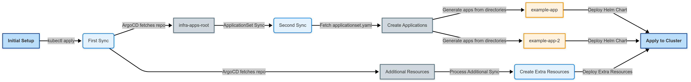
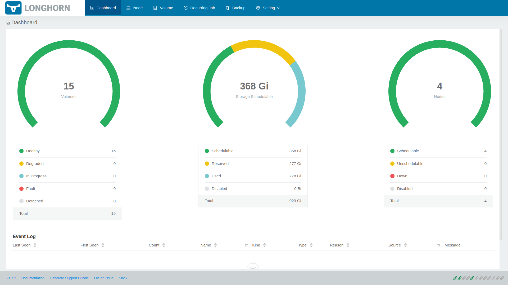

## 개요

[이전 글](/posts/homelab-k8s-gitops/)에서는 ArgoCD를 설치해 GitOps 환경을 구축했다. 이번 글에서는 홈랩 쿠버네티스 클러스터에 Longhorn 분산 스토리지를 설치하고 구성한 과정을 정리한다. 영구 스토리지가 필요한 이유와 여러 스토리지 솔루션을 검토하며 얻은 판단 기준도 함께 공유한다.


## 홈랩 환경의 스토리지 고민

홈랩 쿠버네티스를 구축하면서 가장 크게 고민한 부분 중 하나는 스토리지였다. 데이터베이스, 모니터링 도구, 백업 시스템처럼 실제로 운영할 만한 애플리케이션 대부분은 파드가 재시작되거나 다른 노드로 이동해도 데이터가 유지되는 영구 스토리지를 필요로 한다.



처음에는 다음과 같은 방법을 시도했다:

1. **로컬 스토리지(Local Storage)**: 각 노드의 로컬 디스크를 직접 사용하는 가장 단순한 방식이었다. 구성은 쉬웠지만, 파드가 다른 노드로 재스케줄링되면 기존 노드에 저장된 데이터에 접근할 수 없었다. 노드 장애 시 데이터 복구가 어렵다는 점도 치명적이었다.

2. **NFS(Network File System)**: 별도의 NAS 장비를 NFS 서버로 구성해 모든 노드가 공유 스토리지를 사용하도록 했다. 어느 노드에서 파드가 실행되든 같은 데이터에 접근할 수 있다는 점은 좋았다. 하지만 NFS 서버가 단일 장애점이 되었고, 쿠버네티스 환경에서는 파일 잠금(locking) 문제로 안정성 이슈도 겪었다.

3. **Rook-Ceph**: 쿠버네티스 네이티브 분산 스토리지 솔루션인 Ceph를 Rook 오퍼레이터로 배포하는 방식도 검토했다. 기능과 안정성은 뛰어났지만 최소 3개의 OSD(Object Storage Daemon) 노드가 필요했고, 메모리와 CPU 오버헤드도 상당했다. Dell OptiPlex Micro로 구성한 홈랩 환경에는 부담이 컸다.

여러 시행착오 끝에 Longhorn을 선택했다. 설치가 간단하고 리소스 요구사항이 비교적 낮으면서도 분산 복제, 스냅샷, 백업 같은 기능을 제공해 홈랩 규모에 가장 잘 맞는 선택지라고 판단했다.

## Longhorn이 해결한 문제들

Longhorn을 도입한 뒤에는 다음과 같은 문제가 해결되었다:

1. **데이터 지속성**: 볼륨 데이터가 여러 노드에 복제되어 저장되므로 특정 노드에 장애가 나도 다른 노드의 복제본에서 데이터를 읽을 수 있게 되었다. 이전에는 노드 재부팅 후 로컬 스토리지에 저장된 데이터가 사라지거나 접근할 수 없는 경우가 있었다.

2. **워크로드 이동성**: 쿠버네티스 스케줄러가 파드를 다른 노드로 옮겨도 Longhorn이 자동으로 볼륨 접근을 처리해 주었다. 덕분에 파드는 같은 데이터를 계속 사용할 수 있었다.

3. **백업과 복구**: Longhorn의 내장 백업 기능으로 볼륨 스냅샷을 생성하고 S3 호환 오브젝트 스토리지나 NFS 서버로 백업할 수 있게 되었다. 중요 데이터를 보호하고 복구하는 과정도 훨씬 단순해졌다.

4. **관리 용이성**: 웹 UI 대시보드에서 볼륨 상태, 복제본 분포, 노드별 스토리지 사용량을 한눈에 확인할 수 있었다. 운영 중 상태를 파악하고 문제를 진단하는 부담도 크게 줄었다.

## Longhorn 소개

> **Longhorn이란?**
>
> Longhorn은 쿠버네티스를 위한 경량 분산 블록 스토리지 시스템이다. Rancher Labs가 2017년에 개발을 시작해 오픈소스로 공개했으며, 현재는 CNCF(Cloud Native Computing Foundation) 인큐베이팅 프로젝트로 관리된다. 각 노드의 로컬 디스크를 활용해 분산 스토리지 풀을 구성하고, 볼륨 데이터를 여러 노드에 복제해 고가용성과 데이터 보호를 제공한다.



Longhorn의 주요 특징은 다음과 같다:

- **분산 복제**: 각 볼륨은 설정된 복제 수(기본값 3)만큼 여러 노드에 복제되어 저장되며, 노드 장애 시 자동으로 다른 노드에서 복제본을 재구성한다.
- **마이크로서비스 아키텍처**: 각 볼륨이 독립적인 마이크로서비스로 동작해 한 볼륨의 문제가 다른 볼륨에 영향을 주지 않는다.
- **스냅샷과 백업**: 볼륨의 특정 시점 스냅샷을 생성하고 외부 스토리지로 백업할 수 있어 데이터 보호와 재해 복구가 쉽다.
- **직관적인 웹 UI**: 볼륨, 노드, 백업 상태를 시각적으로 관리할 수 있는 대시보드를 제공한다.
- **경량 설계**: Rook-Ceph보다 리소스 요구사항이 낮아 홈랩이나 에지 환경에 적합하다.

## Longhorn 설치 요구사항

Longhorn을 올리기 전에 모든 노드에서 아래 요구사항을 먼저 확인했다:

1. **지원 OS**: Ubuntu 18.04 이상, Debian 10 이상, CentOS 7 이상, RHEL 7 이상 등 대부분의 리눅스 배포판을 지원한다.
2. **컨테이너 런타임**: Docker 또는 containerd가 설치되어 있어야 한다.
3. **open-iscsi 패키지**: Longhorn은 iSCSI를 사용해 볼륨을 노드에 연결하므로 open-iscsi 패키지가 필수다.
4. **NFSv4 클라이언트**: 백업 대상으로 NFS 서버를 사용할 경우 NFS 클라이언트가 필요하다.

### 사전 준비

사전 준비로는 모든 노드에 SSH로 접속해 필요한 패키지를 설치했다:

```bash
sudo apt-get update
sudo apt-get install -y open-iscsi nfs-common
sudo systemctl enable iscsid
sudo systemctl start iscsid
```

위 명령어는 패키지 목록을 업데이트한 뒤 iSCSI 이니시에이터(`open-iscsi`)와 NFS 클라이언트(`nfs-common`)를 설치한다. 이어서 iSCSI 데몬이 시스템 부팅 시 자동으로 시작되도록 등록하고, 즉시 실행한다.

패키지를 설치한 뒤에는 각 노드에서 iSCSI 서비스가 정상인지 확인했다:

```bash
sudo systemctl status iscsid
```

다음과 같이 `active (running)` 상태가 표시되면 정상이다:

```
● iscsid.service - iSCSI Initiator Daemon
     Loaded: loaded (/lib/systemd/system/iscsid.service; enabled; vendor preset: enabled)
     Active: active (running) since Tue 2025-02-25 08:30:15 UTC; 5s ago
```

## GitOps로 Longhorn 설치

이 시리즈에서는 모든 쿠버네티스 리소스를 GitOps 방식으로 관리한다. Longhorn도 Git 저장소에 Helm 차트 설정을 정의해 ArgoCD가 자동으로 배포하도록 구성했다. 사용하는 Git 저장소는 `https://github.com/injunweb/k8s-resource`이다.

### 1. Git 저장소에 Longhorn Helm 차트 구성 추가

Longhorn 설정은 GitOps 저장소에 추가했다. 로컬에서는 먼저 저장소를 클론한 뒤 디렉토리를 만들었다:

```bash
git clone https://github.com/injunweb/k8s-resource.git
cd k8s-resource
mkdir -p apps/longhorn-system
cd apps/longhorn-system
```

`Chart.yaml`에는 아래처럼 메타데이터와 의존성을 넣었다:

```yaml
apiVersion: v2
name: longhorn
description: Longhorn Distributed Block Storage for Kubernetes
type: application
version: 1.0.0
appVersion: 1.4.0
dependencies:
    - name: longhorn
      version: 1.4.0
      repository: https://charts.longhorn.io
```

이 설정은 Longhorn 공식 Helm 저장소(`https://charts.longhorn.io`)에서 v1.4.0 버전 차트를 가져와 설치하도록 정의한다.

`values.yaml`에는 Longhorn에서 실제로 사용할 값을 아래처럼 정리했다:

```yaml
longhorn:
    defaultSettings:
        defaultDataPath: /var/lib/longhorn
        defaultDataLocality: best-effort
        replicaAutoBalance: best-effort

    preUpgradeChecker:
        jobEnabled: false
```

각 설정 항목의 의미는 다음과 같다:

- **defaultDataPath**: Longhorn이 각 노드에서 볼륨 데이터를 저장할 디렉터리 경로다. 기본값인 `/var/lib/longhorn`을 사용하면 시스템 디스크에 데이터가 저장된다.
- **defaultDataLocality**: `best-effort`로 설정하면 가능한 경우 파드가 실행되는 노드에 볼륨 복제본을 배치해 로컬 디스크 접근으로 인한 성능 향상을 기대할 수 있다.
- **replicaAutoBalance**: `best-effort`로 설정하면 노드 추가나 제거 시 복제본이 노드 간에 자동으로 재분배되어 스토리지 사용량 균형을 유지한다.
- **preUpgradeChecker.jobEnabled**: Longhorn 업그레이드 전 사전 검사 Job을 비활성화한다. ArgoCD 환경에서는 이 Job이 동기화 문제를 일으킬 수 있어 `false`로 설정했다.

설정 파일을 만든 뒤에는 Git에 커밋하고 원격 저장소에 올렸다:

```bash
git add .
git commit -m "Add Longhorn distributed storage configuration"
git push
```

### 2. ApplicationSet을 통한 자동 배포

ArgoCD의 ApplicationSet 컨트롤러는 Git 저장소의 `apps/` 디렉터리를 모니터링한다. 새로운 하위 디렉터리가 감지되면 해당 애플리케이션을 자동으로 생성하고 배포한다.



ApplicationSet의 자동 배포 과정은 다음과 같다:

1. **디렉터리 감지**: ApplicationSet 컨트롤러가 Git 저장소(`https://github.com/injunweb/k8s-resource`)의 `apps/` 디렉터리를 주기적으로 스캔해 새로운 `longhorn-system` 디렉터리를 감지한다.
2. **Application 생성**: 템플릿에 따라 디렉터리 이름과 같은 `longhorn-system` ArgoCD Application 리소스를 자동으로 생성한다.
3. **네임스페이스 생성**: 애플리케이션과 같은 이름인 `longhorn-system` 네임스페이스가 클러스터에 생성된다.
4. **Helm 차트 배포**: ArgoCD가 해당 디렉터리의 Helm 차트를 파싱하고 의존성을 해결한 뒤 클러스터에 리소스를 배포한다.

푸시 후에는 ApplicationSet이 애플리케이션을 제대로 생성했는지 확인했다:

```bash
kubectl get applications -n argocd
```

출력에서 `longhorn-system` 애플리케이션이 생성되어 동기화된 상태인지 확인할 수 있었다:

```
NAME              SYNC STATUS   HEALTH STATUS
longhorn-system   Synced        Healthy
```

ArgoCD 웹 UI에서도 새로 생성된 `longhorn-system` 애플리케이션의 상세 정보와 배포된 리소스를 시각적으로 확인할 수 있었다.

### 3. Longhorn 배포 상태 확인

Longhorn이 올라온 뒤에는 컴포넌트 상태부터 확인했다:

```bash
kubectl -n longhorn-system get pods
```

다음과 같이 모든 파드가 `Running` 상태면 정상으로 볼 수 있다:

```
NAME                                                READY   STATUS    RESTARTS   AGE
csi-attacher-77d87d4c79-bkw5r                       1/1     Running   0          5m
csi-attacher-77d87d4c79-d42zq                       1/1     Running   0          5m
csi-attacher-77d87d4c79-zlszr                       1/1     Running   0          5m
csi-provisioner-5c9dfb6446-7xk2n                    1/1     Running   0          5m
csi-provisioner-5c9dfb6446-l8xz4                    1/1     Running   0          5m
csi-provisioner-5c9dfb6446-w9vmc                    1/1     Running   0          5m
csi-resizer-6f8d9f7f9c-2jk8p                        1/1     Running   0          5m
csi-snapshotter-86bc9b7f6c-5xz8k                    1/1     Running   0          5m
engine-image-ei-68f17757-2j8k5                      1/1     Running   0          5m
instance-manager-e-xxxxx                            1/1     Running   0          5m
instance-manager-r-xxxxx                            1/1     Running   0          5m
longhorn-csi-plugin-xxxxx                           2/2     Running   0          5m
longhorn-driver-deployer-xxxxx                      1/1     Running   0          5m
longhorn-manager-xxxxx                              1/1     Running   0          5m
longhorn-ui-xxxxx                                   1/1     Running   0          5m
```

기본 StorageClass가 등록되었는지도 함께 확인했다:

```bash
kubectl get storageclass
```

```
NAME                 PROVISIONER          RECLAIMPOLICY   VOLUMEBINDINGMODE   ALLOWVOLUMEEXPANSION   AGE
longhorn (default)   driver.longhorn.io   Delete          Immediate           true                   5m
```

## Longhorn 웹 UI 접속

Longhorn UI는 포트 포워딩으로 먼저 확인했다:

```bash
kubectl port-forward -n longhorn-system svc/longhorn-frontend 8080:80
```

이 명령어는 로컬 시스템의 8080 포트를 Longhorn 프런트엔드 서비스의 80 포트로 포워딩한다. 웹 브라우저에서 `http://localhost:8080`으로 접속하면 Longhorn 대시보드가 표시된다.



대시보드에서는 전체 클러스터의 스토리지 용량과 사용량, 각 볼륨의 상태와 복제본 분포, 노드별 스토리지 상태, 스케줄링된 백업 작업 등을 한눈에 확인하고 관리할 수 있다.

## 테스트

설치 후에는 테스트용 PVC와 파드를 만들어 실제로 볼륨이 프로비저닝되고 마운트되는지 확인했다.

```yaml
apiVersion: v1
kind: PersistentVolumeClaim
metadata:
    name: longhorn-test-pvc
spec:
    accessModes:
        - ReadWriteOnce
    storageClassName: longhorn
    resources:
        requests:
            storage: 1Gi
---
apiVersion: v1
kind: Pod
metadata:
    name: volume-test
spec:
    containers:
        - name: volume-test
          image: nginx:alpine
          volumeMounts:
              - name: test-volume
                mountPath: /data
    volumes:
        - name: test-volume
          persistentVolumeClaim:
              claimName: longhorn-test-pvc
```

이 매니페스트에는 다음 두 리소스가 들어 있다:

1. **PersistentVolumeClaim**: `longhorn` StorageClass를 사용해 1GB 크기의 읽기/쓰기 가능한 볼륨을 요청한다.
2. **Pod**: nginx 컨테이너를 실행하고 위에서 요청한 PVC를 `/data` 경로에 마운트한다.

검증은 아래 매니페스트를 적용한 뒤 상태를 확인하는 방식으로 진행했다:

```bash
kubectl apply -f test.yaml
kubectl get pvc longhorn-test-pvc
```

PVC 상태가 `Bound`로 표시되면 Longhorn이 볼륨을 정상적으로 프로비저닝한 것이다:

```
NAME                STATUS   VOLUME                                     CAPACITY   ACCESS MODES   STORAGECLASS   AGE
longhorn-test-pvc   Bound    pvc-xxxxxxxx-xxxx-xxxx-xxxx-xxxxxxxxxxxx   1Gi        RWO            longhorn       30s
```

파드 내부에 마운트되었는지도 추가로 확인했다:

```bash
kubectl exec -it volume-test -- df -h /data
```

정상적으로 마운트되었다면 `/data` 디렉터리가 1GB 볼륨으로 표시된다:

```
Filesystem                Size      Used Available Use% Mounted on
/dev/longhorn/pvc-xxx     976.0M    2.5M    907.4M   0% /data
```

테스트가 끝난 뒤에는 생성한 리소스를 정리했다:

```bash
kubectl delete -f test.yaml
```

## 마치며

이번 글에서는 홈랩 쿠버네티스 클러스터에 Longhorn 분산 스토리지를 도입한 과정을 정리했다. Longhorn은 로컬 스토리지나 NFS의 한계를 피하면서도 Rook-Ceph보다 가볍게 운영할 수 있어, 당시 내 환경에는 가장 현실적인 선택이었다.

다음 글에서는 Traefik 인그레스 컨트롤러를 설치하고 내부 서비스에 접근할 수 있도록 구성하는 방법을 알아본다.

[다음 글: 홈랩 구축기 #4: 내부 서비스 구성](/posts/homelab-k8s-internal-services/)
