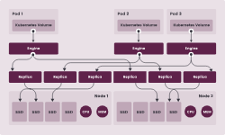

## 개요

[이전 글](/posts/homelab-k8s-gitops/)에서는 ArgoCD를 설치하여 GitOps 환경을 구축했다. 이번 글에서는 홈랩 쿠버네티스 클러스터에 Longhorn 분산 스토리지 시스템을 설치하고 구성하는 방법을 알아보며, 영구 스토리지가 필요한 이유와 다양한 스토리지 솔루션을 검토한 경험을 공유한다.


## 홈랩 환경의 스토리지 고민

홈랩 쿠버네티스를 구축하면서 가장 큰 고민 중 하나는 스토리지 구성이었으며, 데이터베이스나 모니터링 도구, 백업 시스템 같은 대부분의 실용적인 애플리케이션들은 파드가 재시작되거나 다른 노드로 이동해도 데이터가 유지되는 영구 스토리지(Persistent Storage)가 필요하다.


처음에는 다음과 같은 방법을 시도했다:

1. **로컬 스토리지(Local Storage)**: 각 노드의 로컬 디스크를 직접 사용하는 방식으로 가장 간단하지만, 파드가 다른 노드로 재스케줄링되면 기존 노드에 저장된 데이터에 접근할 수 없는 문제가 발생했으며, 노드 장애 시 데이터 복구가 불가능하다는 치명적인 단점이 있다.

2. **NFS(Network File System)**: 별도의 NAS 장비를 NFS 서버로 구성하여 모든 노드에서 공유 스토리지로 사용하는 방식으로, 파드가 어느 노드에서 실행되든 동일한 데이터에 접근할 수 있었지만, NFS 서버가 단일 장애점(Single Point of Failure)이 되어 서버 장애 시 모든 스토리지 접근이 불가능해지는 문제가 있었으며, 쿠버네티스 환경에서 NFS의 파일 잠금(locking) 문제로 인한 안정성 이슈도 경험했다.

3. **Rook-Ceph**: 쿠버네티스 네이티브 분산 스토리지 솔루션인 Ceph를 Rook 오퍼레이터를 통해 배포하는 방식으로, 강력한 기능과 높은 안정성을 제공하지만, 최소 3개의 OSD(Object Storage Daemon) 노드가 필요하고 메모리와 CPU 오버헤드가 상당하여 Dell OptiPlex Micro로 구성한 홈랩 환경에서는 리소스 부담이 컸다.

결국 여러 시행착오 끝에 Longhorn을 선택했으며, Longhorn은 설치가 간단하고 리소스 요구사항이 적으면서도 분산 복제와 스냅샷, 백업 같은 엔터프라이즈급 기능을 제공하여 홈랩 규모에 가장 적합한 분산 스토리지 시스템이었다.

## Longhorn이 해결한 문제들

Longhorn을 도입한 후 다음과 같은 문제들이 해결되었다:

1. **데이터 지속성**: 볼륨 데이터가 여러 노드에 복제되어 저장되므로 특정 노드에 장애가 발생해도 다른 노드의 복제본에서 데이터를 읽을 수 있어 데이터 손실 위험이 크게 감소했으며, 이전에는 노드 재부팅 후 로컬 스토리지에 저장된 데이터가 사라지거나 접근 불가능해지는 경우가 있었다.

2. **워크로드 이동성**: 쿠버네티스 스케줄러가 파드를 다른 노드로 이동시켜도 Longhorn이 자동으로 볼륨을 해당 노드에서 접근 가능하도록 처리하여 파드가 동일한 데이터에 계속 접근할 수 있게 되었다.

3. **백업과 복구**: Longhorn에 내장된 백업 기능을 통해 볼륨 스냅샷을 생성하고 S3 호환 오브젝트 스토리지나 NFS 서버로 백업하여 중요 데이터를 쉽게 보호할 수 있게 되었다.

4. **관리 용이성**: Longhorn이 제공하는 웹 UI 대시보드를 통해 볼륨 상태, 복제본 분포, 노드별 스토리지 사용량 등을 시각적으로 확인하고 관리할 수 있어 운영 부담이 크게 줄었다.

## Longhorn 소개

> **Longhorn이란?**
>
> Longhorn은 쿠버네티스를 위한 경량 분산 블록 스토리지 시스템으로, Rancher Labs에서 2017년에 개발을 시작하여 오픈소스로 공개했으며 현재는 CNCF(Cloud Native Computing Foundation) 인큐베이팅 프로젝트로 관리되고 있다. 각 노드의 로컬 디스크를 활용하여 분산 스토리지 풀을 구성하고, 볼륨 데이터를 여러 노드에 복제하여 고가용성과 데이터 보호를 제공한다.



Longhorn의 주요 특징은 다음과 같다:

- **분산 복제**: 각 볼륨은 설정된 복제 수(기본값 3)만큼 여러 노드에 복제되어 저장되며, 노드 장애 시 자동으로 다른 노드에서 복제본을 재구성한다.
- **마이크로서비스 아키텍처**: 각 볼륨이 독립적인 마이크로서비스로 동작하여 한 볼륨의 문제가 다른 볼륨에 영향을 주지 않는다.
- **스냅샷과 백업**: 볼륨의 특정 시점 스냅샷을 생성하고 외부 스토리지로 백업할 수 있어 데이터 보호와 재해 복구가 용이하다.
- **직관적인 웹 UI**: 볼륨, 노드, 백업 상태를 시각적으로 관리할 수 있는 대시보드를 제공한다.
- **경량 설계**: Rook-Ceph에 비해 리소스 요구사항이 적어 홈랩이나 에지 환경에 적합하다.

## Longhorn 설치 요구사항

Longhorn을 설치하기 전에 모든 노드가 다음 요구사항을 충족하는지 확인해야 한다:

1. **지원 OS**: Ubuntu 18.04 이상, Debian 10 이상, CentOS 7 이상, RHEL 7 이상 등 대부분의 리눅스 배포판을 지원한다.
2. **컨테이너 런타임**: Docker 또는 containerd가 설치되어 있어야 한다.
3. **open-iscsi 패키지**: Longhorn은 iSCSI를 사용하여 볼륨을 노드에 연결하므로 open-iscsi 패키지가 필수다.
4. **NFSv4 클라이언트**: 백업 대상으로 NFS 서버를 사용할 경우 NFS 클라이언트가 필요하다.

### 사전 준비

모든 노드에 SSH로 접속하여 필요한 패키지를 설치한다:

```bash
sudo apt-get update
sudo apt-get install -y open-iscsi nfs-common
sudo systemctl enable iscsid
sudo systemctl start iscsid
```

위 명령어는 패키지 목록을 업데이트하고, iSCSI 이니시에이터(open-iscsi)와 NFS 클라이언트(nfs-common)를 설치한 후, iSCSI 데몬을 시스템 부팅 시 자동 시작되도록 활성화하고 즉시 실행한다.

각 노드에서 iSCSI 서비스가 정상적으로 실행 중인지 확인한다:

```bash
sudo systemctl status iscsid
```

다음과 같이 `active (running)` 상태가 표시되어야 한다:

```
● iscsid.service - iSCSI Initiator Daemon
     Loaded: loaded (/lib/systemd/system/iscsid.service; enabled; vendor preset: enabled)
     Active: active (running) since Tue 2025-02-25 08:30:15 UTC; 5s ago
```

## GitOps로 Longhorn 설치

이 시리즈에서는 모든 쿠버네티스 리소스를 GitOps 방식으로 관리하며, Longhorn 역시 Git 저장소에 Helm 차트 설정을 정의하고 ArgoCD가 자동으로 배포하도록 구성한다. 사용하는 Git 저장소는 `https://github.com/injunweb/k8s-resource`이다.

### 1. Git 저장소에 Longhorn Helm 차트 구성 추가

먼저 로컬 환경에 저장소를 클론하고 Longhorn 설정을 위한 디렉토리 구조를 생성한다:

```bash
git clone https://github.com/injunweb/k8s-resource.git
cd k8s-resource
mkdir -p apps/longhorn-system
cd apps/longhorn-system
```

`Chart.yaml` 파일을 생성하여 Helm 차트의 메타데이터와 의존성을 정의한다:

```yaml
apiVersion: v2
name: longhorn
description: Longhorn Distributed Block Storage for Kubernetes
type: application
version: 1.0.0
appVersion: 1.4.0
dependencies:
    - name: longhorn
      version: 1.4.0
      repository: https://charts.longhorn.io
```

이 설정은 Longhorn 공식 Helm 저장소(`https://charts.longhorn.io`)에서 v1.4.0 버전 차트를 가져와 설치하도록 정의한다.

`values.yaml` 파일을 생성하여 Longhorn의 세부 설정을 정의한다:

```yaml
longhorn:
    defaultSettings:
        defaultDataPath: /var/lib/longhorn
        defaultDataLocality: best-effort
        replicaAutoBalance: best-effort

    preUpgradeChecker:
        jobEnabled: false
```

각 설정 항목의 의미는 다음과 같다:

- **defaultDataPath**: Longhorn이 각 노드에서 볼륨 데이터를 저장할 디렉토리 경로로, 기본값인 `/var/lib/longhorn`을 사용하면 시스템 디스크에 데이터가 저장된다.
- **defaultDataLocality**: `best-effort`로 설정하면 Longhorn이 가능한 경우 파드가 실행되는 노드에 볼륨 복제본을 배치하여 로컬 디스크 접근으로 인한 성능 향상을 도모한다.
- **replicaAutoBalance**: `best-effort`로 설정하면 노드 추가나 제거 시 복제본이 노드 간에 자동으로 재분배되어 스토리지 사용량의 균형을 유지한다.
- **preUpgradeChecker.jobEnabled**: Longhorn 업그레이드 전 사전 검사 Job을 비활성화하며, ArgoCD 환경에서는 이 Job이 동기화 문제를 일으킬 수 있으므로 `false`로 설정한다.

변경사항을 Git에 커밋하고 원격 저장소에 푸시한다:

```bash
git add .
git commit -m "Add Longhorn distributed storage configuration"
git push
```

### 2. ApplicationSet을 통한 자동 배포

ArgoCD의 ApplicationSet 컨트롤러는 Git 저장소의 `apps/` 디렉토리를 모니터링하여 새로운 하위 디렉토리가 감지되면 자동으로 해당 애플리케이션을 생성하고 배포한다.


ApplicationSet의 자동 배포 과정은 다음과 같다:

1. **디렉토리 감지**: ApplicationSet 컨트롤러가 Git 저장소(`https://github.com/injunweb/k8s-resource`)의 `apps/` 디렉토리를 주기적으로 스캔하여 새로운 `longhorn-system` 디렉토리를 감지한다.
2. **Application 생성**: 템플릿에 따라 디렉토리 이름과 동일한 `longhorn-system`이라는 ArgoCD Application 리소스를 자동으로 생성한다.
3. **네임스페이스 생성**: 애플리케이션과 동일한 이름인 `longhorn-system` 네임스페이스가 클러스터에 생성된다.
4. **Helm 차트 배포**: ArgoCD가 해당 디렉토리의 Helm 차트를 파싱하고 의존성을 해결한 후 클러스터에 리소스를 배포한다.

ApplicationSet이 생성한 애플리케이션을 확인한다:

```bash
kubectl get applications -n argocd
```

출력에서 `longhorn-system` 애플리케이션이 생성되고 동기화되었는지 확인한다:

```
NAME              SYNC STATUS   HEALTH STATUS
longhorn-system   Synced        Healthy
```

ArgoCD 웹 UI에서도 새롭게 생성된 `longhorn-system` 애플리케이션의 상세 정보와 배포된 리소스들을 시각적으로 확인할 수 있다.

### 3. Longhorn 배포 상태 확인

Longhorn의 모든 컴포넌트가 성공적으로 배포되었는지 확인한다:

```bash
kubectl -n longhorn-system get pods
```

다음과 같이 모든 파드가 `Running` 상태가 되어야 정상이다:

```
NAME                                                READY   STATUS    RESTARTS   AGE
csi-attacher-77d87d4c79-bkw5r                       1/1     Running   0          5m
csi-attacher-77d87d4c79-d42zq                       1/1     Running   0          5m
csi-attacher-77d87d4c79-zlszr                       1/1     Running   0          5m
csi-provisioner-5c9dfb6446-7xk2n                    1/1     Running   0          5m
csi-provisioner-5c9dfb6446-l8xz4                    1/1     Running   0          5m
csi-provisioner-5c9dfb6446-w9vmc                    1/1     Running   0          5m
csi-resizer-6f8d9f7f9c-2jk8p                        1/1     Running   0          5m
csi-snapshotter-86bc9b7f6c-5xz8k                    1/1     Running   0          5m
engine-image-ei-68f17757-2j8k5                      1/1     Running   0          5m
instance-manager-e-xxxxx                            1/1     Running   0          5m
instance-manager-r-xxxxx                            1/1     Running   0          5m
longhorn-csi-plugin-xxxxx                           2/2     Running   0          5m
longhorn-driver-deployer-xxxxx                      1/1     Running   0          5m
longhorn-manager-xxxxx                              1/1     Running   0          5m
longhorn-ui-xxxxx                                   1/1     Running   0          5m
```

Longhorn이 기본 StorageClass로 등록되었는지 확인한다:

```bash
kubectl get storageclass
```

```
NAME                 PROVISIONER          RECLAIMPOLICY   VOLUMEBINDINGMODE   ALLOWVOLUMEEXPANSION   AGE
longhorn (default)   driver.longhorn.io   Delete          Immediate           true                   5m
```

## Longhorn 웹 UI 접속

Longhorn은 볼륨, 노드, 백업 상태를 시각적으로 관리할 수 있는 웹 UI를 제공하며, 포트 포워딩을 통해 로컬에서 접속할 수 있다:

```bash
kubectl port-forward -n longhorn-system svc/longhorn-frontend 8080:80
```

이 명령어는 로컬 시스템의 8080 포트를 Longhorn 프론트엔드 서비스의 80 포트로 포워딩하며, 웹 브라우저에서 `http://localhost:8080`으로 접속하면 Longhorn 대시보드가 표시된다.


대시보드에서는 전체 클러스터의 스토리지 용량과 사용량, 각 볼륨의 상태와 복제본 분포, 노드별 스토리지 상태, 스케줄링된 백업 작업 등을 한눈에 확인하고 관리할 수 있다.

## 테스트

Longhorn이 정상적으로 작동하는지 검증하기 위해 테스트용 PVC(PersistentVolumeClaim)와 파드를 생성하여 볼륨이 제대로 프로비저닝되고 마운트되는지 확인한다.

```yaml
apiVersion: v1
kind: PersistentVolumeClaim
metadata:
    name: longhorn-test-pvc
spec:
    accessModes:
        - ReadWriteOnce
    storageClassName: longhorn
    resources:
        requests:
            storage: 1Gi
---
apiVersion: v1
kind: Pod
metadata:
    name: volume-test
spec:
    containers:
        - name: volume-test
          image: nginx:alpine
          volumeMounts:
              - name: test-volume
                mountPath: /data
    volumes:
        - name: test-volume
          persistentVolumeClaim:
              claimName: longhorn-test-pvc
```

이 매니페스트는 두 가지 리소스를 정의한다:

1. **PersistentVolumeClaim**: `longhorn` StorageClass를 사용하여 1GB 크기의 읽기/쓰기 가능한 볼륨을 요청한다.
2. **Pod**: nginx 컨테이너를 실행하고 위에서 요청한 PVC를 `/data` 경로에 마운트한다.

매니페스트를 적용하고 볼륨이 정상적으로 마운트되었는지 확인한다:

```bash
kubectl apply -f test.yaml
kubectl get pvc longhorn-test-pvc
```

PVC 상태가 `Bound`로 표시되면 Longhorn이 볼륨을 성공적으로 프로비저닝한 것이다:

```
NAME                STATUS   VOLUME                                     CAPACITY   ACCESS MODES   STORAGECLASS   AGE
longhorn-test-pvc   Bound    pvc-xxxxxxxx-xxxx-xxxx-xxxx-xxxxxxxxxxxx   1Gi        RWO            longhorn       30s
```

파드 내부에서 볼륨이 마운트되었는지 확인한다:

```bash
kubectl exec -it volume-test -- df -h /data
```

정상적으로 마운트되었다면 `/data` 디렉토리가 1GB 볼륨으로 표시된다:

```
Filesystem                Size      Used Available Use% Mounted on
/dev/longhorn/pvc-xxx     976.0M    2.5M    907.4M   0% /data
```

테스트가 완료되면 생성한 리소스를 삭제한다:

```bash
kubectl delete -f test.yaml
```

## 마치며

이번 글에서는 홈랩 쿠버네티스 클러스터에 Longhorn 분산 스토리지 시스템을 설치하고 구성하는 방법을 살펴보았다. Longhorn은 로컬 스토리지나 NFS의 한계를 극복하면서도 Rook-Ceph보다 가벼워 홈랩 환경에 적합한 스토리지 솔루션이며, 분산 복제를 통한 데이터 보호, 스냅샷과 백업 기능, 직관적인 웹 UI 등 엔터프라이즈급 기능을 제공한다.

다음 글에서는 Traefik 인그레스 컨트롤러를 설치하고 내부 서비스에 접근할 수 있도록 구성하는 방법을 알아본다.

[다음 글: 미니PC Kubernetes #4: 내부 서비스 구성](/posts/homelab-k8s-internal-services/)
