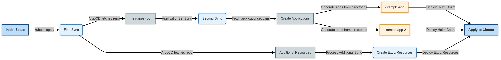
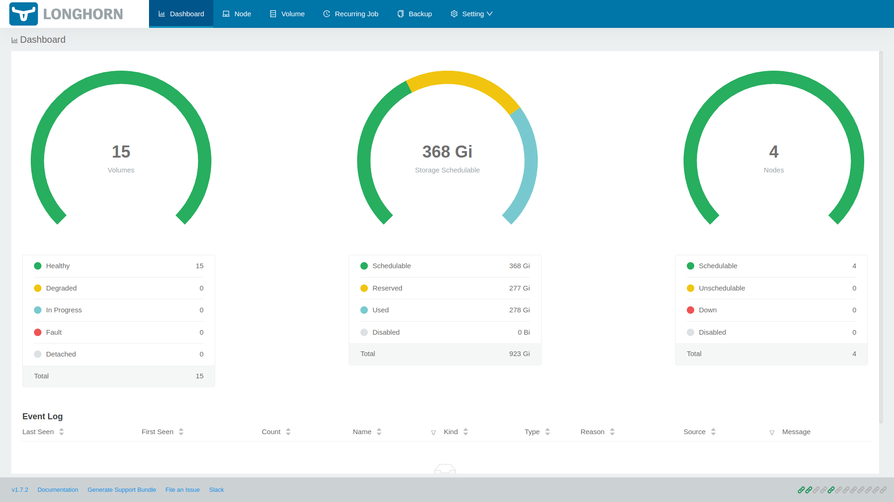

## 개요

이전 글에서는 ArgoCD를 설치하여 GitOps 환경을 구축했다. 이번 글에서는 홈랩 쿠버네티스 클러스터에 Longhorn 분산 스토리지 시스템을 설치하고 구성하는 방법을 알아본다.


## 홈랩 환경의 스토리지 고민

홈랩 쿠버네티스를 구축하면서 가장 큰 고민 중 하나는 스토리지 구성이었다. 데이터베이스, 모니터링 도구, 백업 시스템 등 대부분의 실용적인 애플리케이션들은 영구 스토리지가 필요하다.


처음에는 다음과 같은 방법을 시도했다:

1. **로컬 스토리지**: 각 노드의 로컬 스토리지를 사용했지만, 파드가 다른 노드로 재스케줄링되면 데이터에 접근할 수 없는 문제가 발생했다.

2. **NFS**: 별도의 NAS를 NFS 서버로 사용했지만, 단일 장애점(Single Point of Failure)이 존재하고, 쿠버네티스 환경에서 NFS의 안정성 문제도 있었다.

3. **Rook-Ceph**: 시도했지만 오버헤드가 크고 리소스 요구사항이 높아 내 홈랩 환경(Dell OptiPlex Micro)에서는 무거운 감이 있었다.

결국 여러 시행착오 끝에 Longhorn을 선택했다. Longhorn은 가볍고, 설치가 간단하며, 홈랩 규모에 적합한 분산 스토리지 시스템이었다.

## Longhorn이 해결한 문제들

Longhorn을 도입한 후 다음과 같은 문제들이 해결되었다:

1. **데이터 지속성**: 노드 장애가 발생해도 데이터가 손실되지 않게 되었다. 이전에는 노드 재부팅 후 데이터가 사라지는 경우가 있었다.

2. **워크로드 이동성**: 파드가 다른 노드로 이동해도 동일한 볼륨에 접근할 수 있게 되었다.

3. **백업과 복구**: 내장된 백업 기능으로 중요 데이터를 쉽게 보호할 수 있게 되었다.

4. **관리 용이성**: UI 대시보드를 통해 스토리지 상태를 한눈에 확인하고 관리할 수 있게 되었다.

## Longhorn 소개

Longhorn은 쿠버네티스를 위한 경량 분산 블록 스토리지 시스템으로, CNCF 인큐베이팅 프로젝트다. Rancher에서 개발했으며 다음과 같은 특징이 있다:


-   각 노드의 디스크를 활용한 분산 스토리지 시스템
-   볼륨 데이터를 여러 노드에 복제하여 고가용성 제공
-   직관적인 UI로 관리 용이
-   백업 및 복구 기능 내장
-   상대적으로 가벼워 리소스 제약이 있는 홈랩 환경에 적합

## Longhorn 설치 요구사항

Longhorn을 설치하기 전에 노드가 다음 요구사항을 충족하는지 확인해야 한다:

1. **지원 OS**: Ubuntu, Debian, CentOS, RHEL 등
2. **도커 런타임** 또는 **containerd** 런타임
3. **open-iscsi** 패키지 설치
4. **NFSv4 클라이언트** (백업에 NFS 사용 시)

### 사전 준비

모든 노드에 필요한 패키지를 설치한다:

```bash
# 모든 노드에서 실행
sudo apt-get update
sudo apt-get install -y open-iscsi nfs-common
sudo systemctl enable iscsid
sudo systemctl start iscsid
```

각 노드에서 iSCSI 서비스가 실행 중인지 확인한다:

```bash
sudo systemctl status iscsid
```

다음과 같이 `active (running)` 상태가 표시되어야 한다:

```
● iscsid.service - iSCSI Initiator Daemon
     Loaded: loaded (/lib/systemd/system/iscsid.service; enabled; vendor preset: enabled)
     Active: active (running) since Tue 2025-02-25 08:30:15 UTC; 5s ago
```

## GitOps로 Longhorn 설치

이전 글에서 구성한 ArgoCD를 활용하여 GitOps 방식으로 Longhorn을 설치한다. 이번에도 우리의 핵심 Git 저장소인 `https://github.com/injunweb/k8s-resource`를 활용할 것이다.

### 1. Git 저장소에 Longhorn Helm 차트 구성 추가

먼저 로컬에 저장소를 클론하고 Longhorn 디렉토리 구조를 생성한다:

```bash
git clone https://github.com/injunweb/k8s-resource.git
cd k8s-resource
mkdir -p apps/longhorn-system
cd apps/longhorn-system
```

`Chart.yaml` 파일을 생성한다:

```yaml
apiVersion: v2
name: longhorn
description: Longhorn Distributed Block Storage for Kubernetes
type: application
version: 1.0.0
appVersion: 1.4.0
dependencies:
    - name: longhorn
      version: 1.4.0
      repository: https://charts.longhorn.io
```

`values.yaml` 파일을 생성하여 Longhorn 설정을 정의한다:

```yaml
longhorn:
    defaultSettings:
        defaultDataPath: /var/lib/longhorn # 데이터가 저장될 기본 경로
        defaultDataLocality: best-effort # 가능하면 로컬 노드에 데이터 저장 시도
        replicaAutoBalance: best-effort # 복제본을 노드 간에 자동으로 균형있게 분배

    preUpgradeChecker:
        jobEnabled: false # 업그레이드 전 검사 작업 비활성화
```

각 설정의 의미:

-   **defaultDataPath**: Longhorn이 노드에서 데이터를 저장할 경로다. 기본값은 `/var/lib/longhorn`이다.
-   **defaultDataLocality**: `best-effort`로 설정하면 가능한 경우 데이터를 워크로드가 실행 중인 노드에 저장하여 성능을 향상시킨다.
-   **replicaAutoBalance**: `best-effort`로 설정하면 복제본이 노드 간에 자동으로 균형있게 분배되어 노드 간 스토리지 사용량 불균형을 방지한다.
-   **preUpgradeChecker.jobEnabled**: Longhorn 업그레이드 전 사전 검사 작업을 비활성화한다. ArgoCD에서는 이 값을 `false`로 설정해야 오류 없이 동작한다.

변경사항을 커밋하고 푸시한다:

```bash
git add .
git commit -m "Add Longhorn configuration"
git push
```

### 2. ApplicationSet을 통한 자동 배포 과정

이전 글에서 구성한 ArgoCD의 ApplicationSet 기능이 자동으로 Longhorn 애플리케이션을 생성하는 과정을 살펴보자:



1. ApplicationSet 컨트롤러는 등록된 Git 저장소(`https://github.com/injunweb/k8s-resource`)를 모니터링한다.

2. `apps/longhorn-system` 디렉토리를 감지하면 템플릿에 따라 새로운 ArgoCD 애플리케이션을 생성한다.

3. 생성된 애플리케이션 이름은 디렉토리 이름인 `longhorn-system`이 된다.

4. 마찬가지로 네임스페이스도 `longhorn-system`으로 생성된다.

5. ArgoCD는 해당 디렉토리에서 감지한 Helm 차트를 클러스터에 적용한다.

먼저 ApplicationSet이 생성한 애플리케이션을 확인한다:

```bash
kubectl get applications -n argocd
```

출력에서 `longhorn-system` 애플리케이션이 생성되었는지 확인한다:

```
NAME             SYNC STATUS   HEALTH STATUS
app-of-apps      Synced        Healthy
infra-apps-root  Synced        Healthy
longhorn-system  Synced        Healthy
```

ArgoCD UI에서도 새롭게 생성된 `longhorn-system` 애플리케이션을 확인할 수 있다.

### 3. Longhorn 배포 상태 확인

Longhorn 컴포넌트가 성공적으로 배포되었는지 확인한다:

```bash
kubectl -n longhorn-system get pods
```

다음과 같이 모든 Pod가 `Running` 상태가 되어야 한다:

```
NAME                                                READY   STATUS    RESTARTS   AGE
csi-attacher-77d87d4c79-bkw5r                       1/1     Running   0          5m
csi-attacher-77d87d4c79-d42zq                       1/1     Running   0          5m
csi-attacher-77d87d4c79-zlszr                       1/1     Running   0          5m
...
```

## Longhorn 웹 UI 접속

Longhorn은 직관적인 웹 UI를 제공한다. 포트 포워딩으로 웹 UI에 접속할 수 있다:

```bash
kubectl port-forward -n longhorn-system svc/longhorn-frontend 8080:80
```

이후 웹 브라우저에서 `http://localhost:8080`으로 접속한다.



## 테스트

테스트용 PVC와 Pod를 생성하여 Longhorn이 제대로 작동하는지 확인해보자:

```yaml
apiVersion: v1
kind: PersistentVolumeClaim
metadata:
    name: longhorn-test-pvc
spec:
    accessModes:
        - ReadWriteOnce
    storageClassName: longhorn
    resources:
        requests:
            storage: 1Gi
---
apiVersion: v1
kind: Pod
metadata:
    name: volume-test
spec:
    containers:
        - name: volume-test
          image: nginx:alpine
          volumeMounts:
              - name: test-volume
                mountPath: /data
    volumes:
        - name: test-volume
          persistentVolumeClaim:
              claimName: longhorn-test-pvc
```

이 매니페스트를 적용하고 볼륨이 제대로 마운트되었는지 확인한다:

```bash
kubectl apply -f test.yaml
kubectl exec -it volume-test -- df -h /data
```

## 마치며

이제 홈랩 쿠버네티스 클러스터에 분산 스토리지 시스템을 구축했다. Longhorn은 홈랩 환경에 적합한 경량 스토리지 솔루션으로, 충분한 데이터 보호 기능을 제공하면서도 리소스 요구사항이 적다.

이전에는 NFS나 로컬 스토리지의 한계로 인해 스테이트풀 애플리케이션을 안정적으로 운영하기 어려웠지만, Longhorn을 통해 클라우드와 유사한 수준의 스토리지 인프라를 홈랩에서도 구축할 수 있게 되었다.

다음 글에서는 홈랩에 외부 접근이 가능하도록 설정하는 방법을 알아볼 것이다.
