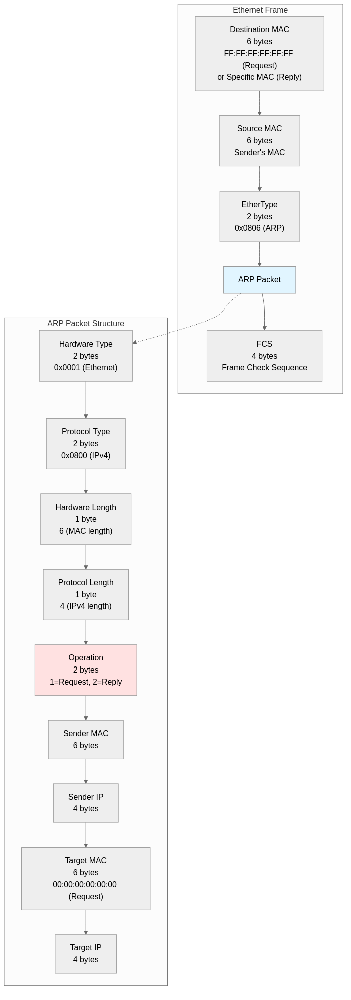
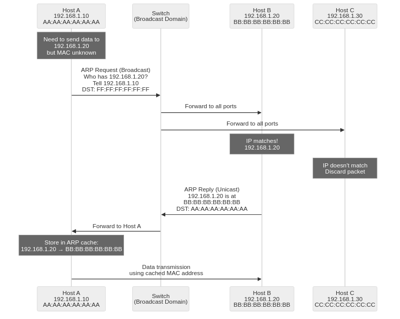

## What is ARP

ARP (Address Resolution Protocol) is a network protocol officially standardized in 1982 through the IETF's RFC 826 document. In TCP/IP network environments, it dynamically discovers the MAC address (physical address) corresponding to a given IP address as an address translation protocol. It operates at the boundary between Layer 2 (Data Link Layer) and Layer 3 (Network Layer) of the OSI 7-layer model, performing the core role of mapping logical addresses (IP) to physical addresses (MAC).

In network communication, actual data transmission between devices is based on MAC addresses. Since the upper layer (Network Layer) only knows IP addresses, the lower layer (Data Link Layer) must know the destination's MAC address to transmit packets. This is where ARP handles the process of converting IP addresses to MAC addresses. ARP operates by broadcasting queries to all devices in the network, with only the device having that IP responding. It is an essential protocol used in most local network environments, including Ethernet networks.

## Role and Necessity of ARP

ARP performs the following core roles in the TCP/IP network stack, which are essential elements for normal network communication.

1. **Converts IP addresses to MAC addresses**
   - Maps Layer 3 (Network Layer) logical addresses (IP) to Layer 2 (Data Link Layer) physical addresses (MAC)
   - Needed by all network devices including routers, switches, and hosts for actual communication

2. **Identifies devices capable of direct communication within the network**
   - Supports direct communication between devices within the same subnet (broadcast domain)
   - Enables efficient packet transmission between directly connected devices without going through a router

3. **Performance optimization through ARP caching**
   - Stores learned MAC addresses in memory (ARP cache) to prevent repetitive broadcast requests
   - Improves overall network performance through reduced network traffic and shortened response time

4. **Detects duplicate IP conflicts (using Gratuitous ARP)**
   - Verifies whether a host's IP address is already in use when joining the network
   - Prevents IP address conflicts and ensures network stability

5. **Router and gateway discovery**
   - Enables external network communication by learning the MAC address of the default gateway
   - Supports transmission of all packets going outside the subnet to the router's MAC address

## ARP's Position in the OSI Layer

ARP occupies a unique position in the OSI 7-layer model. It is officially considered a Layer 2.5 protocol. While encapsulated within Layer 2 (Data Link Layer) Ethernet frames, it uses Layer 3 (Network Layer) IP addresses, acting as a bridge connecting the two layers.

**Role by Layer**:
- **Layer 3 (Network Layer)**: IP packet generation, logical addressing, routing decisions
- **ARP (Layer 2.5)**: IP address → MAC address conversion
- **Layer 2 (Data Link Layer)**: Ethernet frame generation, physical addressing, switching

ARP packets are not encapsulated within IP packets but are directly encapsulated in Ethernet frames. The Ethernet frame's EtherType field uses the value 0x0806 to indicate the ARP protocol.

## ARP Packet Structure



ARP packets have a fixed size of 28 bytes and are transmitted directly encapsulated within Ethernet frames.

**Ethernet Frame Header (14 bytes)**:
- **Destination MAC Address (6 bytes)**: FF:FF:FF:FF:FF:FF (broadcast) for ARP requests, specific MAC address for ARP replies
- **Source MAC Address (6 bytes)**: MAC address of the device sending the request or reply
- **EtherType (2 bytes)**: 0x0806 (ARP protocol identifier)

**ARP Packet Fields (28 bytes)**:
- **Hardware Type (2 bytes)**: Hardware address type, 0x0001 (Ethernet)
- **Protocol Type (2 bytes)**: Protocol address type, 0x0800 (IPv4)
- **Hardware Length (1 byte)**: MAC address length, 6 bytes
- **Protocol Length (1 byte)**: IP address length, 4 bytes
- **Operation (2 bytes)**: Operation code, 1 (ARP request), 2 (ARP reply)
- **Sender Hardware Address (6 bytes)**: Sender's MAC address
- **Sender Protocol Address (4 bytes)**: Sender's IP address
- **Target Hardware Address (6 bytes)**: Receiver's MAC address, 00:00:00:00:00:00 for requests
- **Target Protocol Address (4 bytes)**: Receiver's IP address

Ethernet frames require a minimum size of 60 bytes, so ARP packets (14 + 28 = 42 bytes) are transmitted with 18 bytes of padding added. A 4-byte FCS (Frame Check Sequence) is added at the end of the frame, creating a total 64-byte Ethernet frame.

## ARP Operation Process



ARP operates through a 2-step process (request-reply), consisting of a combination of broadcast requests and unicast replies.

### 1. ARP Request

An ARP request begins when Host A (192.168.1.10) wants to communicate with Host B (192.168.1.20) but doesn't know its MAC address.

**ARP Request Packet Composition**:
```
[Ethernet Header]
Destination MAC: FF:FF:FF:FF:FF:FF (broadcast)
Source MAC: AA:AA:AA:AA:AA:AA (Host A's MAC)
EtherType: 0x0806 (ARP)

[ARP Packet]
Hardware Type: 0x0001 (Ethernet)
Protocol Type: 0x0800 (IPv4)
Hardware Length: 6
Protocol Length: 4
Operation: 1 (request)
Sender MAC: AA:AA:AA:AA:AA:AA
Sender IP: 192.168.1.10
Target MAC: 00:00:00:00:00:00 (unknown)
Target IP: 192.168.1.20
```

**Broadcast Transmission**:
- The switch recognizes that the destination MAC is broadcast (FF:FF:FF:FF:FF:FF) and forwards the frame to all ports in the same broadcast domain (VLAN)
- All hosts in the same subnet receive the ARP request packet delivered to their network cards (NIC)
- Each host checks the Target IP field to see if it matches their own IP

### 2. ARP Reply

Host B (192.168.1.20) confirms that the Target IP matches its own IP and sends a unicast ARP reply.

**ARP Reply Packet Composition**:
```
[Ethernet Header]
Destination MAC: AA:AA:AA:AA:AA:AA (Host A's MAC)
Source MAC: BB:BB:BB:BB:BB:BB (Host B's MAC)
EtherType: 0x0806 (ARP)

[ARP Packet]
Hardware Type: 0x0001 (Ethernet)
Protocol Type: 0x0800 (IPv4)
Hardware Length: 6
Protocol Length: 4
Operation: 2 (reply)
Sender MAC: BB:BB:BB:BB:BB:BB
Sender IP: 192.168.1.20
Target MAC: AA:AA:AA:AA:AA:AA
Target IP: 192.168.1.10
```

**Unicast Transmission**:
- The destination MAC address is set to a specific host (Host A), so the switch references its MAC address table and forwards only to that port
- Host A receives the ARP reply and learns that the MAC address of 192.168.1.20 is BB:BB:BB:BB:BB:BB
- The learned information is stored in the ARP cache (ARP table) and reused for a certain period

### 3. ARP Cache Storage and Data Transmission

Host A stores the learned MAC address in the ARP cache. Subsequently, it can directly transmit all packets destined for Host B by setting the destination MAC address to BB:BB:BB:BB:BB:BB. ARP cache entries expire and are deleted after a certain time (usually 2-20 minutes) according to TTL (Time To Live), and can be renewed through ARP requests when needed.

## ARP Cache and TTL

ARP caches learned MAC address information in memory to optimize network performance. This is called the ARP cache (ARP Table) or ARP table.

**Types of ARP Cache**:

1. **Dynamic ARP Cache**
   - MAC address information automatically learned through the ARP request-reply process
   - TTL (Time To Live) timer is set and automatically deleted after a certain time
   - Windows: Default 2 minutes, maximum 10 minutes (renewed when used)
   - Linux: Default 60 seconds (renewed when used), maximum 30 minutes
   - Automatically adapts to network changes (IP or MAC changes)

2. **Static ARP Cache**
   - MAC address information manually configured by network administrators
   - No TTL, maintained permanently until system reboot
   - Used for important servers, gateways, etc., to prevent ARP spoofing attacks
   - Configuration example (Linux): `sudo arp -s 192.168.1.1 aa:bb:cc:dd:ee:ff`
   - Configuration example (Windows): `arp -s 192.168.1.1 aa-bb-cc-dd-ee-ff`

**ARP Cache Query Commands**:
- Linux: `arp -n` or `ip neigh show`
- Windows: `arp -a`
- macOS: `arp -a`

**ARP Cache Deletion Commands**:
- Linux: `sudo ip neigh flush all` (delete all entries)
- Windows: `arp -d *` (delete all entries)
- macOS: `sudo arp -d -a` (delete all entries)

## Special ARP Types

The ARP protocol is utilized for several special purposes beyond basic request-reply, each designed to solve specific network scenarios.

### Gratuitous ARP

Gratuitous ARP is an ARP packet sent voluntarily without being requested. Both sender and receiver IP addresses are set to the sender's own IP address. It is transmitted via broadcast so all devices on the network can learn or update the sender's MAC address.

**Main Uses**:
1. **Duplicate IP Detection**
   - Host broadcasts its IP address during boot or IP configuration to check for duplicate usage
   - Can detect conflicts if another device using the same IP responds

2. **ARP Cache Update Notification**
   - Notifies all hosts of MAC address changes when network card (NIC) is replaced
   - Notifies MAC address changes of virtual IP (VIP) during failover
   - Rapid MAC address information synchronization during network reconfiguration

3. **High Availability Cluster**
   - Propagates new MAC addresses when master node changes in protocols like VRRP, HSRP
   - Notifies virtual server MAC address changes in load balancers

### Proxy ARP

Proxy ARP is a technique where a router responds to ARP requests on behalf of hosts in other subnets. Clients can communicate as if they are in the same subnet without recognizing the router's existence.

**Operation Principle**:
1. Host A (192.168.1.10/24) tries to send a packet to Host B (192.168.2.20/24) but has no gateway configuration and mistakenly assumes it's the same subnet
2. Host A broadcasts an ARP request for 192.168.2.20
3. The router knows 192.168.2.20 is in a different subnet it's connected to and sends an ARP reply with its own MAC address
4. Host A transmits the packet to the router's MAC address, and the router forwards it to the actual destination

**Use Cases**:
- When gateway configuration is impossible in legacy systems
- Temporary compatibility maintenance after subnet division
- Simplified network configuration (not recommended in modern networks)

### Reverse ARP (RARP)

Reverse ARP is a protocol defined in RFC 903 (1984) that performs the opposite function of ARP. It is used by devices that know their MAC address but don't know their IP address to obtain an IP address from the network.

**Operation Principle**:
1. Client broadcasts a RARP request containing its MAC address
2. RARP server references a mapping table of MAC addresses and IP addresses to find the IP assigned to that MAC
3. RARP server transmits a RARP reply containing the IP address to the client

**Historical Significance**:
- Used in the 1980s by diskless workstations to obtain IP addresses during boot
- Currently replaced by BOOTP (1985) and DHCP (1993) and rarely used
- RARP only works within broadcast domains, but DHCP can work across different subnets through DHCP Relay

## Security Issues with ARP

The ARP protocol did not consider security during its 1982 design and has no authentication mechanism whatsoever. This results in several security vulnerabilities and exposure to malicious attacks.

### 1. ARP Spoofing

ARP spoofing is an attack technique where an attacker sends forged ARP reply packets to poison the victim's ARP cache. It is the most common method for performing Man-in-the-Middle (MITM) attacks within networks.

**Attack Mechanism**:
1. Attacker continuously sends forged ARP replies to Victim A stating "the gateway's (192.168.1.1) MAC address is the attacker's MAC"
2. Attacker sends forged ARP replies to the gateway stating "Victim A's (192.168.1.10) MAC address is the attacker's MAC"
3. Victim A sends all outbound packets to the attacker, and the gateway sends all packets destined for Victim A to the attacker
4. Attacker intercepts packets to read or modify content, then forwards to the original destination, disguising normal communication

**Attack Tools**: Ettercap, Cain & Abel, Arpspoof, Bettercap, etc.

### 2. ARP Cache Poisoning

ARP cache poisoning is similar to ARP spoofing but a broader concept. It injects incorrect MAC address information into the ARP caches of multiple hosts in the network to cause network communication failures or intercept traffic.

**Damage Types**:
- Denial of Service (DoS): Blocks communication by mapping to non-existent MAC addresses
- Man-in-the-Middle (MITM): Intercepts traffic by mapping to attacker's MAC address
- Session Hijacking: Steals authentication information or session cookies

### 3. MITM (Man-in-the-Middle) Attack

A Man-in-the-Middle attack based on ARP spoofing where the attacker positions themselves between two communicating parties to intercept and eavesdrop on or manipulate all traffic.

**Attack Scenarios**:
1. **Password Theft**: Intercepts plaintext passwords transmitted through HTTP login forms
2. **Session Cookie Theft**: Intercepts non-HTTPS HTTP session cookies for session hijacking
3. **SSL Stripping**: Downgrades HTTPS connections to HTTP to bypass encryption
4. **DNS Spoofing**: Manipulates DNS responses to redirect users to malicious websites
5. **Packet Manipulation**: Modifies transmitted data in real-time to inject malicious code

## ARP Security Enhancement Methods

While ARP's security vulnerabilities cannot be completely eliminated, the following defense techniques can significantly reduce attack risks.

### 1. Using Static ARP Tables

Manually registers MAC addresses for important servers, gateways, and network equipment to completely block ARP spoofing attacks at the source.

**Advantages**:
- Complete immunity to ARP spoofing attacks
- Effective for protecting critical communication paths (e.g., server ↔ gateway)

**Disadvantages**:
- Management burden increases with network scale
- Manual updates required when MAC addresses change (NIC replacement, etc.)
- Low practicality in dynamic network environments (DHCP, etc.)

**Configuration Examples**:
```bash
# Linux
sudo arp -s 192.168.1.1 aa:bb:cc:dd:ee:ff

# Windows
arp -s 192.168.1.1 aa-bb-cc-dd-ee-ff
```

### 2. Dynamic ARP Inspection (DAI)

A security feature provided by managed switches that validates ARP packet validity based on DHCP Snooping tables to block forged ARP packets.

**Operation Principle**:
1. Builds binding table by learning IP-MAC mapping information for hosts connected to each port through DHCP Snooping
2. Compares sender IP and sender MAC against binding table when ARP packets pass through switch
3. Drops ARP packets that are not in the table or don't match
4. Allows passage without verification for trusted ports (uplink, router connection ports)

**Configuration Example (Cisco Switch)**:
```
! Enable DHCP Snooping
ip dhcp snooping
ip dhcp snooping vlan 10

! Enable DAI
ip arp inspection vlan 10

! Configure trusted port (router connection port)
interface GigabitEthernet0/1
  ip dhcp snooping trust
  ip arp inspection trust
```

### 3. ARP Monitoring and Detection Systems

Software or hardware solutions that monitor network traffic to detect abnormal ARP activities and provide alerts.

**Main Detection Techniques**:
- Detects patterns where different MAC addresses appear repeatedly in a short time for the same IP
- Identifies hosts transmitting abnormally many ARP reply packets
- Detects excessive use of Gratuitous ARP
- Detects unsolicited ARP replies sent without ARP requests

**Tools and Solutions**:
- **ArpWatch (Linux)**: Logs ARP table changes and sends email notifications
- **XArp (Windows)**: Real-time ARP monitoring and spoofing detection, provides alerts
- **Snort (IDS/IPS)**: Can apply ARP spoofing detection rules
- **Wireshark**: Network traffic capture and ARP packet analysis

### 4. Using VPN and Encryption Protocols

ARP spoofing attacks are only possible on local networks (same broadcast domain). On untrusted networks (public Wi-Fi, etc.), using VPN to establish encrypted tunnels prevents attackers from reading content even if they intercept traffic.

**Protection Mechanisms**:
- All traffic within VPN tunnels is encrypted and cannot be decrypted even if intercepted by ARP spoofing
- Use application layer encryption protocols like HTTPS, SSH, TLS
- Network layer encryption through IPsec

### 5. Network Segmentation

Logically dividing networks through VLANs (Virtual LANs) to limit broadcast domains minimizes the impact scope of ARP spoofing attacks.

**Advantages**:
- Limits the number of hosts attackers can access
- Protects by separating important servers and regular users into different VLANs
- Can apply separate security policies for each VLAN

## Conclusion

ARP (Address Resolution Protocol) has been used for over 40 years since its standardization through RFC 826 in 1982 as a core protocol of TCP/IP networks. It performs the essential role of converting IP addresses to MAC addresses, enabling actual data transmission in Ethernet networks. While operating efficiently through broadcast-based request-reply mechanisms and caching, it has various security vulnerabilities including ARP spoofing, cache poisoning, and Man-in-the-Middle attacks due to lack of security considerations in its early design. Network administrators should strengthen security by appropriately combining defense techniques such as static ARP tables, Dynamic ARP Inspection, ARP monitoring systems, VPN encryption, and network segmentation. In modern network environments, ARP is being replaced by IPv6's NDP (Neighbor Discovery Protocol), but understanding ARP's operation principles and security issues remains essential knowledge for network engineers and security professionals as IPv4 networks continue to be widely used.
