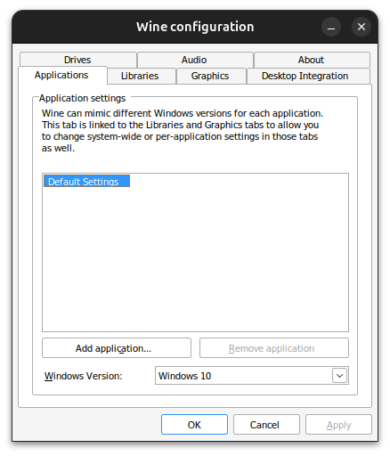
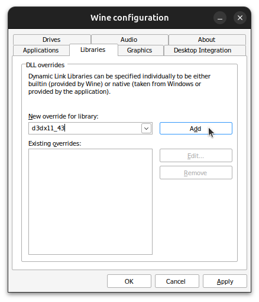

## What is Wine?

Wine (Wine Is Not an Emulator) lets you run Windows programs on Linux systems like Ubuntu 24.04 LTS. Rather than being a typical emulator, Wine works by translating Windows commands directly into ones your Linux system can understand. This means better performance than you'd get with traditional virtualization.

### Main Benefits

-   Runs without a virtual machine, keeping things fast and simple
-   Plays your favorite Windows games through DirectX support
-   Works with everyday Windows software like Microsoft Office

## 1. Getting Your System Ready

Let's start by updating your system:

```bash
sudo apt update
sudo apt upgrade
```

We'll also need to enable 32-bit support:

```bash
sudo dpkg --add-architecture i386
```

## 2. Setting Up the Wine Repository

First, add Wine's security key:

```bash
sudo mkdir -pm755 /etc/apt/keyrings
sudo wget -O /etc/apt/keyrings/winehq-archive.key https://dl.winehq.org/wine-builds/winehq.key
```

Then add the repository:

```bash
sudo wget -NP /etc/apt/sources.list.d/ https://dl.winehq.org/wine-builds/ubuntu/dists/$(lsb_release -sc)/winehq-$(lsb_release -sc).sources
```

## 3. Installing Wine

Now let's install Wine:

```bash
sudo apt update
sudo apt install --install-recommends winehq-stable
```

## 4. Initial Setup

Start the Wine configuration tool:

```bash
winecfg
```



## 5. Setting Up DirectX

Many Windows programs need DirectX support, particularly d3dx11_43.dll. Here's how to set it up:

1. Open Wine's configuration tool (winecfg)
2. Click on the "Libraries" tab
3. Find "d3dx11_43" in the New override dropdown



4. Click "Add"
5. Hit "Apply" and "OK" to save your changes

This helps Windows programs that use DirectX run more smoothly.

## 6. Running Windows Programs

To run a Windows program, simply use:

```bash
wine program.exe
```

That's it! You're now ready to run Windows programs on your Ubuntu 24.04 LTS system.
