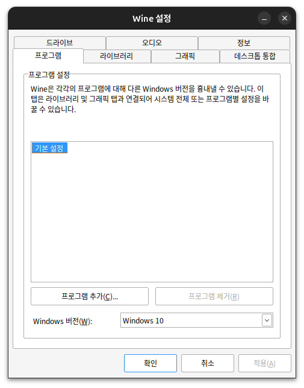
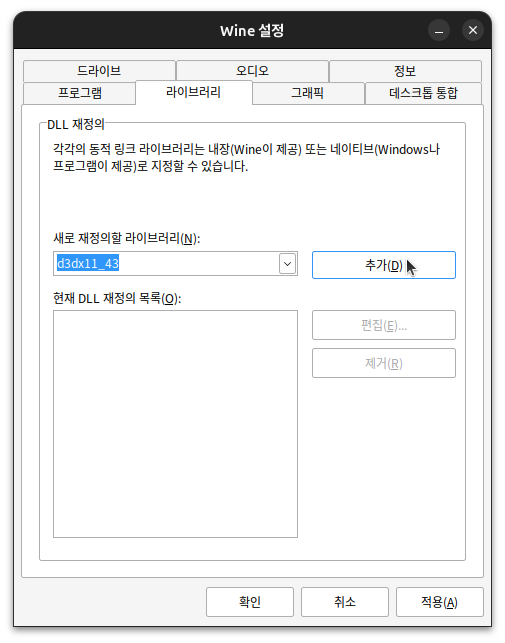

## Wine이란?

Wine(Wine Is Not an Emulator)은 Ubuntu 24.04 LTS를 포함한 Linux, macOS, BSD와 같은 UNIX 호환 운영체제에서 Windows 프로그램을 실행할 수 있는 호환성 레이어이다.

Wine은 단순한 에뮬레이터가 아니다. Windows API 호출을 POSIX 시스템 호출로 변환하는 방식으로 작동하므로, 가상화나 에뮬레이션보다 더 나은 성능을 제공한다.

### 주요 특징

-   별도의 가상 머신이 필요 없어 가볍고 빠르다
-   DirectX 지원으로 게임 실행이 가능하다
-   Microsoft Office 같은 Windows 프로그램을 Ubuntu에서 사용할 수 있다

## 1. 시스템 준비

먼저 시스템을 최신 상태로 업데이트한다:

```bash
sudo apt update
sudo apt upgrade
```

32비트 지원을 활성화한다:

```bash
sudo dpkg --add-architecture i386
```

## 2. Wine 저장소 추가

Wine 공식 저장소의 GPG 키를 추가한다:

```bash
sudo mkdir -pm755 /etc/apt/keyrings
sudo wget -O /etc/apt/keyrings/winehq-archive.key https://dl.winehq.org/wine-builds/winehq.key
```

Wine 저장소를 추가한다:

```bash
sudo wget -NP /etc/apt/sources.list.d/ https://dl.winehq.org/wine-builds/ubuntu/dists/$(lsb_release -sc)/winehq-$(lsb_release -sc).sources
```

## 3. Wine 설치

저장소를 업데이트하고 Wine을 설치한다:

```bash
sudo apt update
sudo apt install --install-recommends winehq-stable
```

## 4. 기본 설정

Wine 설정을 실행한다:

```bash
winecfg
```



## 5. DirectX 설정

많은 프로그램이 DirectX DLL을 필요로 하며, 특히 d3dx11_43.dll이 중요하다.

1. Wine 설정(winecfg)을 실행한다
2. "라이브러리" 탭으로 이동한다
3. 새 재정의에서 "d3dx11_43"을 선택한다



4. "추가"를 누른다
5. "적용"을 누르고 "확인"으로 마무리한다

이 설정으로 DirectX를 사용하는 프로그램의 호환성이 향상된다.

## 6. 프로그램 실행

Windows 프로그램 실행 방법은 다음과 같다:

```bash
wine program.exe
```

이제 Ubuntu 24.04 LTS에서 Windows 프로그램을 실행할 준비가 완료되었다.
