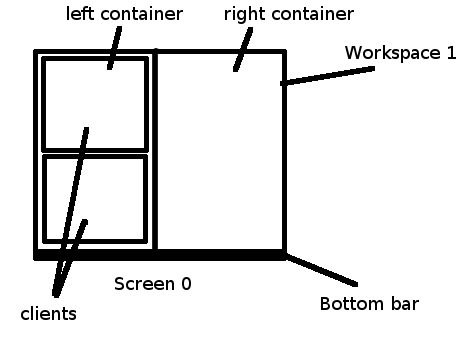
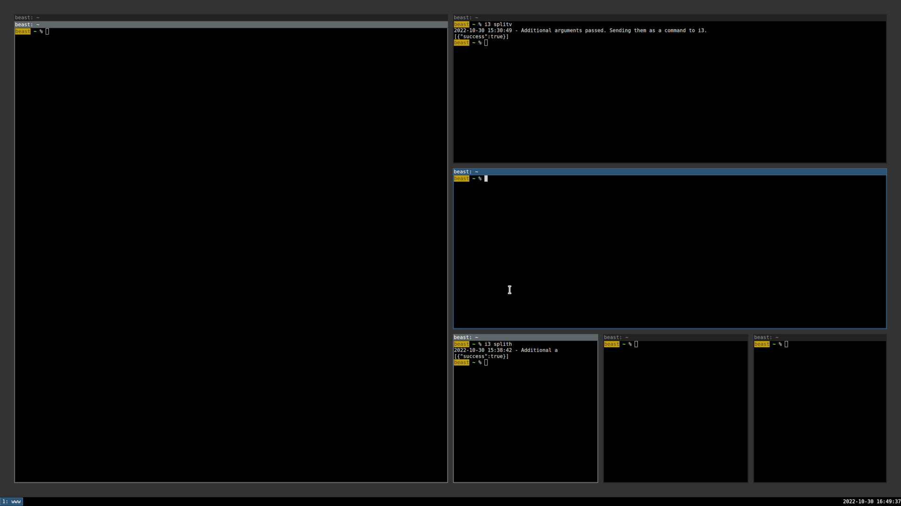
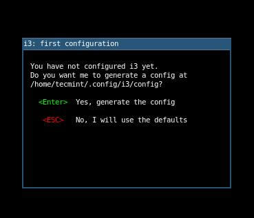
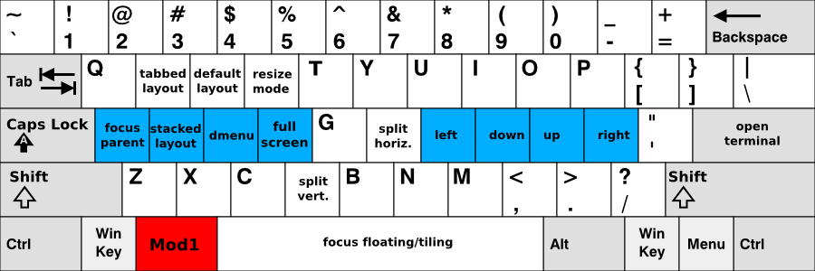
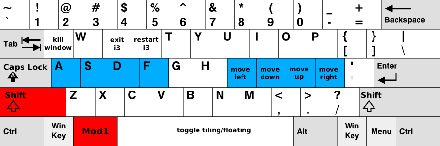

## Meeting i3wm: A Choice for Productivity



The i3 window manager (i3wm) is a tiling window manager focused on efficiency and productivity. It was first developed in 2009 by German developer Michael Stapelberg to address the limitations of the wmii window manager. The name "i3" stands for "improved tiling wm." Written in C with roughly 10,000 lines of concise code, i3 is lightweight while still offering powerful functionality. It has become popular among developers, system administrators, and power users who prefer keyboard-driven workflows with minimal mouse use. It is especially common among users of distributions such as Arch Linux, Gentoo, and NixOS.

i3 runs on the traditional X Window System (X11) and works with common display managers such as LightDM, GDM, and SDDM. More recently, Sway, an i3-compatible Wayland compositor, has emerged to support the newer Wayland display protocol. It is now widely used because it combines Wayland's security and performance benefits with nearly identical i3 configuration and key bindings. i3's design philosophy follows the Unix principle of "do one thing and do it well." It removes unnecessary visual decorations and animation effects, maximizes screen space for actual work, and provides multi-monitor support, efficient window management, and highly customizable text-based configuration files.

i3wm is also well known for the quality of its official documentation. Its features and configuration options are documented clearly and systematically, so even beginners can learn step by step and build their own environment. The official documentation is available at [i3wm.org/docs](https://i3wm.org/docs/) and covers topics such as the User's Guide, Configuration Reference, and IPC Protocol. Active discussion also takes place in community forums and in Reddit's r/i3wm subreddit.

### Philosophy and Structure of the Tiling System



The most fundamental feature of i3wm is its "tiling" window arrangement model. This is fundamentally different from the floating-window behavior common in desktop environments such as GNOME and KDE Plasma, as well as operating systems like Windows and macOS. In those environments, windows can overlap and users must manually adjust their positions and sizes. That usually means more mouse use and more wasted or obscured screen space. In contrast, i3 divides the screen logically and arranges windows automatically so they do not overlap and use the available space efficiently. Users can focus on their work instead of managing window placement.

**Key tiling characteristics of i3:**

-   **Automatic Layout**: When a new window opens, i3 automatically splits the available space and places the new window. There is no need to manually resize or reposition windows, and all windows remain visible on screen.

-   **Directional Split**: You can specify horizontal or vertical splits to control where the next window will be placed relative to the current one. Complex layouts are easy to build by combining these splits.

-   **Ratio Adjustment**: The boundaries between split windows can be adjusted with the keyboard or mouse to change how much space each window occupies. Precise adjustments can be made in 10px or 10% increments.

-   **Layout Switching**: In addition to tiling mode, i3 also supports stacking and tabbed modes. You can switch instantly with a single key and choose the best layout for each situation, and different layouts can be applied per container.

i3's tiling algorithm is based on a binary tree data structure, an elegant design that applies a familiar computer science concept to window arrangement. Each time a user opens a new window, the space occupied by the currently focused window is split into two parts: one for the existing window and one for the new one. The split direction, horizontal or vertical, is either explicitly specified by the user or determined by i3's default behavior. Thanks to this tree structure, i3 can manage even very complex layouts consistently. The parent-child relationships between windows remain clear, which makes behavior more predictable when moving or removing windows.

## Installing i3wm

i3wm is included in the official repositories of most major Linux distributions and can be installed easily through their package managers. Depending on the distribution, the package may be named `i3`, `i3-wm`, or `i3-gaps` (a fork that adds gaps between windows).

**Debian/Ubuntu-based**: The `sudo apt install i3` command installs the basic components, including i3-wm, i3status, and i3lock. It is also recommended to install `dmenu` or `rofi` (application launcher), `feh` or `nitrogen` (wallpaper management), and `compton` or `picom` (compositor).

**Fedora**: Install with `sudo dnf install i3`. Fedora provides the i3-with-shmlog version by default and supports debugging through IPC sockets.

**Arch Linux**: Install with `sudo pacman -S i3-wm` or `sudo pacman -S i3-gaps`. Arch users can also explore many i3-related packages and themes through the AUR (Arch User Repository). The `i3-gnome` package allows i3 to be used together with GNOME.

After installation, log out and select the i3 session from the login screen to start i3. On first launch, a setup wizard appears and asks whether to create a configuration file (`~/.config/i3/config`) and which mod key to use. The mod key is the main modifier used in most i3 shortcuts. You will typically choose either Alt (Mod1) or the Windows/Super key (Mod4). I recommend the Windows key (Mod4) because the Alt key is already used by many applications and can cause shortcut conflicts.



## Basic Key Combinations

Because i3wm is designed around the keyboard, learning the basic key combinations is essential.




### Basic Control

-   **$mod + Enter**: Launch the default terminal
-   **$mod + d**: Open the application launcher menu
-   **$mod + Shift + q**: Close the current window
-   **$mod + Shift + r**: Reload i3 configuration
-   **$mod + Shift + e**: Open i3 exit menu
-   **$mod + Shift + c**: Reload i3 configuration file

### Window Management

-   **$mod + j/k/l/;**: Move focus left/down/up/right (default)
-   **$mod + Shift + j/k/l/;**: Move current window left/down/up/right
-   **$mod + f**: Toggle fullscreen for current window
-   **$mod + h**: Horizontal split for next window
-   **$mod + v**: Vertical split for next window
-   **$mod + r**: Resize mode
-   **$mod + space**: Toggle between tiling and floating mode

Unlike vim, i3wm uses `jkl;` as directional keys by default. This choice is based on the natural position of the right hand on the keyboard home row, but it may feel unfamiliar to users who are used to vim. If needed, you can switch to `hjkl` style bindings in the configuration file (`~/.config/i3/config`). Since I already use `hjkl` in vim, tmux, and many CLI tools, I found that switching i3 to `hjkl` felt much more intuitive. It also helped me keep the same muscle memory across tools.

### Workspace Management

-   **$mod + number(1-0)**: Switch to the workspace with that number
-   **$mod + Shift + number(1-0)**: Move current window to that workspace

## Configuring i3wm

i3wm is configured through a text file at `~/.config/i3/config`.

### Configuration File Contents

1. Basic settings (mod key, font, etc.)
2. Autostart program settings
3. Dark mode and power management settings
4. Media key bindings
5. Basic window manipulation key bindings
6. Workspace settings
7. Window style and color settings
8. Bar (i3bar) settings

### Configuration Examples

```bash
# Basic variable settings
set $mod Mod1
font pango:JetBrains Mono 10

# Default programs
bindsym $mod+Return exec alacritty
bindsym $mod+d exec --no-startup-id rofi -show drun

# Default window movement keys (jkl;)
bindsym $mod+j focus left
bindsym $mod+k focus down
bindsym $mod+l focus up
bindsym $mod+semicolon focus right

# Window splitting methods
bindsym $mod+h split h
bindsym $mod+v split v
```

## Efficiently Using Workspaces

i3wm's workspace system is highly efficient for task management. It provides 10 workspaces by default.

### Workspace Configuration

```bash
# Workspace definitions (concise number names)
set $ws1 "1"
set $ws2 "2"
set $ws3 "3"

# Workspace switching
bindsym $mod+1 workspace number $ws1
bindsym $mod+2 workspace number $ws2

# Moving windows to workspaces
bindsym $mod+Shift+1 move container to workspace number $ws1
bindsym $mod+Shift+2 move container to workspace number $ws2
```

In my configuration, I use simple workspace names such as `"1"`, `"2"`, and `"3"`. This helps reduce cognitive load and makes switching faster. Some users add labels after the number, such as `"1:web"`, `"2:code"`, or `"3:term"`, to give each workspace a fixed purpose. I prefer to keep workspaces flexible, so plain numbers feel freer and more efficient for my workflow. If needed, the names can always be changed later in the configuration file.

## Customizing i3bar and i3status

i3wm provides a status bar at the bottom or top of the screen. It consists of i3bar, which renders the bar itself, and i3status, which collects and formats system information. i3bar receives the JSON-formatted output from i3status and displays it visually. i3status can monitor CPU usage, memory usage, disk space, network status, battery level, and time. You can customize both the displayed information and its format through the configuration file (`~/.config/i3status/config`). If you need more features, you can also use alternatives such as i3blocks, polybar, or bumblebee-status instead of i3status.

### i3bar Configuration

```bash
bar {
    position bottom
    status_command i3status
    tray_output primary
    font pango:JetBrains Mono 10

    mode hide  # Hidden by default
    hidden_state hide
    modifier $mod

    colors {
        background #1c1c1c
        statusline #c0c5ce
        focused_workspace  #2b303b #2b303b #c0c5ce
        inactive_workspace #1c1c1c #1c1c1c #888888
    }
}
```

In this example, the bar is hidden by default and only appears when the `$mod` key is pressed. It uses a dark color scheme and also allows volume control with the mouse wheel.

## Tips for Enhancing Productivity

### Resize Mode

Resize mode lets you adjust window sizes more precisely:

```bash
mode "resize" {
    # Size adjustment bindings
    bindsym j resize shrink width 10 px or 10 ppt
    bindsym k resize grow height 10 px or 10 ppt
    bindsym l resize shrink height 10 px or 10 ppt
    bindsym semicolon resize grow width 10 px or 10 ppt

    # Exit mode
    bindsym Return mode "default"
    bindsym Escape mode "default"
}
```

### Key Binding Customization

You can also change the default `jkl;` navigation keys to vim-style `hjkl` bindings:

```bash
# VI style hjkl change
bindsym $mod+h focus left
bindsym $mod+j focus down
bindsym $mod+k focus up
bindsym $mod+l focus right

# Split key change (h is already in use)
bindsym $mod+b split h  # Horizontal split
```

### Useful Shortcut Settings

```bash
# Screenshot
bindsym Print exec --no-startup-id scrot '%Y-%m-%d_%H-%M-%S.png' -e 'mv $f ~/Pictures/'

# System control
bindsym $mod+Shift+x exec xtrlock  # Screen lock
bindsym $mod+Shift+e exec "i3-nagbar -t warning -m 'Do you want to exit?'"
```

More detailed configuration examples and my actual settings are available in my GitHub repository ([github.com/in-jun/i3wm-setup](https://github.com/in-jun/i3wm-setup)).

## Conclusion

i3wm is a minimalist window manager that takes a fundamentally different approach from traditional desktop environments like GNOME, KDE Plasma, and Xfce. Once you get past the initial learning curve, it can offer a noticeable boost in productivity by reducing mouse use and letting you handle most tasks from the keyboard. Its keyboard-centric interface, efficient automatic tiling, flexible text-based configuration, and lightweight design make it especially appealing to developers, system administrators, and power users. It is particularly effective in development workflows that involve heavy multitasking.

While the learning curve can feel steep at first, the official documentation ([i3wm.org/docs](https://i3wm.org/docs/)) is detailed and well organized, making it excellent for step-by-step learning. The r/i3wm community on Reddit and the i3 page on the Arch Wiki also provide plenty of examples and tips. Most importantly, gradually refining your configuration as you use it can be an enjoyable and rewarding process in its own right.
