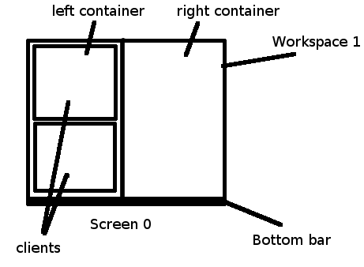
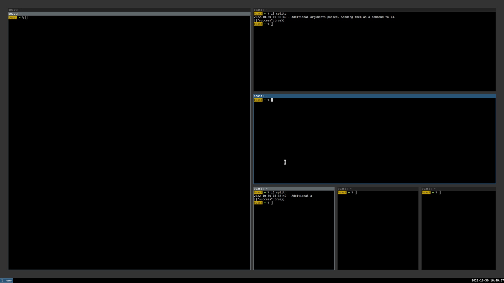
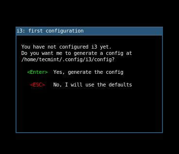
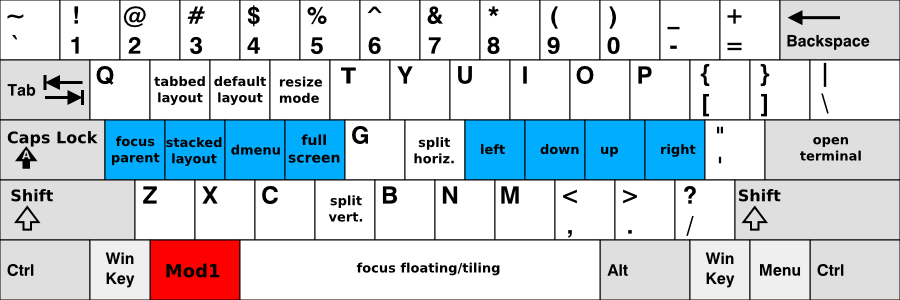
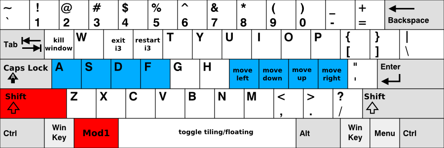

## Introduction



The i3 window manager (i3wm) is a tiling window manager focused on efficiency and productivity, first developed by Michael Stapelberg in 2009. Written in C, i3 provides lightweight yet powerful functionality and has gained significant popularity among developers and power users who prefer keyboard-centric workflows. i3 operates in the X Window System environment, and recently, a Wayland-compatible version called Sway has also become widely used. Built on a philosophy of minimizing unnecessary visual elements and maximizing screen space utilization, it offers multi-monitor support, efficient window management, and high-level customization capabilities.

i3wm is known for its excellent official documentation. All features and settings are clearly described, making it easy for beginners to get started and configure their environment. The official documentation can be found at [i3wm.org/docs](https://i3wm.org/docs/).

### Tiling System



The most fundamental feature of i3wm is its 'tiling' window arrangement method. Unlike traditional stacking window managers (such as GNOME, KDE, etc.), i3 automatically divides the screen and arranges windows so they don't overlap, maximizing screen space usage.

**Key tiling characteristics:**

-   **Automatic layout**: When a new window opens, it automatically divides the existing space
-   **Directional splitting**: Space can be divided horizontally or vertically
-   **Ratio adjustment**: The boundaries between split windows can be adjusted in size
-   **Layout switching**: Instant switching between tiling, stacking, and tab modes

i3's basic tiling algorithm is based on a binary tree structure. Each time a user opens a new window, the currently selected window's space is divided in two, with the split direction determined by settings or mode.

## Installing i3wm

i3wm can be easily installed on various Linux distributions.

**Debian/Ubuntu-based**: `sudo apt install i3`

**Fedora**: `sudo dnf install i3`

**Arch Linux**: `sudo pacman -S i3-wm`

After installation, log out and select the i3 session from the login screen. At first launch, a window will appear asking whether to create a configuration file and set up the mod key. The mod key is typically set as Alt (Mod1) or the Windows key (Mod4).



## Basic Key Combinations

Since i3wm provides a keyboard-centric environment, it's important to learn the basic key combinations.




### Basic Control

-   **$mod + Enter**: Launch the default terminal
-   **$mod + d**: Open the application launcher menu
-   **$mod + Shift + q**: Close the current window
-   **$mod + Shift + r**: Reload i3 configuration
-   **$mod + Shift + e**: Open i3 exit menu
-   **$mod + Shift + c**: Reload i3 configuration file

### Window Management

-   **$mod + j/k/l/;**: Move focus left/down/up/right (default)
-   **$mod + Shift + j/k/l/;**: Move current window left/down/up/right
-   **$mod + f**: Toggle fullscreen for current window
-   **$mod + h**: Horizontal split for next window
-   **$mod + v**: Vertical split for next window
-   **$mod + r**: Resize mode
-   **$mod + space**: Toggle between tiling and floating mode

Unlike vim, i3wm uses jkl; as directional keys. This can be changed to the hjkl style in the configuration file if needed. Personally, I found using hjkl as directional keys more convenient.

### Workspace Management

-   **$mod + number(1-0)**: Switch to the workspace with that number
-   **$mod + Shift + number(1-0)**: Move current window to that workspace

## Configuring the i3wm Configuration File

i3wm is configured through a text-based configuration file (`~/.config/i3/config`).

### Configuration File Contents

1. Basic variable settings (mod key, font, etc.)
2. Autostart program settings
3. Dark mode and power management settings
4. Media key bindings
5. Basic window manipulation key bindings
6. Workspace settings
7. Window style and color settings
8. Bar (i3bar) settings

### Configuration Examples

```bash
# Basic variable settings
set $mod Mod1
font pango:JetBrains Mono 10

# Default programs
bindsym $mod+Return exec alacritty
bindsym $mod+d exec --no-startup-id rofi -show drun

# Default window movement keys (jkl;)
bindsym $mod+j focus left
bindsym $mod+k focus down
bindsym $mod+l focus up
bindsym $mod+semicolon focus right

# Window splitting methods
bindsym $mod+h split h
bindsym $mod+v split v
```

## Efficiently Using Workspaces

i3wm's workspace system is highly efficient for task management. It provides 10 workspaces by default.

### Workspace Configuration

```bash
# Workspace definitions (concise number names)
set $ws1 "1"
set $ws2 "2"
set $ws3 "3"

# Workspace switching
bindsym $mod+1 workspace number $ws1
bindsym $mod+2 workspace number $ws2

# Moving windows to workspaces
bindsym $mod+Shift+1 move container to workspace number $ws1
bindsym $mod+Shift+2 move container to workspace number $ws2
```

In my configuration, I use simple numbers for workspace names for clarity. If needed, you can add colons and descriptions after the numbers.

## Customizing i3bar and i3status

i3wm provides a status bar at the bottom (or top) of the screen. This bar consists of i3bar and i3status components.

### i3bar Configuration

```bash
bar {
    position bottom
    status_command i3status
    tray_output primary
    font pango:JetBrains Mono 10

    mode hide  # Hidden by default
    hidden_state hide
    modifier $mod

    colors {
        background #1c1c1c
        statusline #c0c5ce
        focused_workspace  #2b303b #2b303b #c0c5ce
        inactive_workspace #1c1c1c #1c1c1c #888888
    }
}
```

Key features: It's hidden by default and only shows when the $mod key is pressed, uses dark theme-based colors, and allows volume control with the mouse wheel.

## Tips for Enhancing Productivity

### Resize Mode

Resize mode for precisely adjusting window sizes:

```bash
mode "resize" {
    # Size adjustment bindings
    bindsym j resize shrink width 10 px or 10 ppt
    bindsym k resize grow height 10 px or 10 ppt
    bindsym l resize shrink height 10 px or 10 ppt
    bindsym semicolon resize grow width 10 px or 10 ppt

    # Exit mode
    bindsym Return mode "default"
    bindsym Escape mode "default"
}
```

### Key Binding Customization

Changing the default jkl; array to VI editor-style hjkl keys:

```bash
# VI style hjkl change
bindsym $mod+h focus left
bindsym $mod+j focus down
bindsym $mod+k focus up
bindsym $mod+l focus right

# Split key change (h is already in use)
bindsym $mod+b split h  # Horizontal split
```

### Useful Shortcut Settings

```bash
# Screenshot
bindsym Print exec --no-startup-id scrot '%Y-%m-%d_%H-%M-%S.png' -e 'mv $f ~/Pictures/'

# System control
bindsym $mod+Shift+x exec xtrlock  # Screen lock
bindsym $mod+Shift+e exec "i3-nagbar -t warning -m 'Do you want to exit?'"
```

More detailed configuration examples and my actual settings can be found in my GitHub repository ([github.com/in-jun/i3wm-setup](https://github.com/in-jun/i3wm-setup)).

## Conclusion

i3wm takes a different approach from traditional desktop environments, but once you get used to it, you can experience remarkable productivity improvements. Its keyboard-centric interface, efficient window management, and high customization potential make it attractive to developers and power users.

The learning curve may be somewhat steep, but the official documentation is very detailed and serves as an excellent reference.
