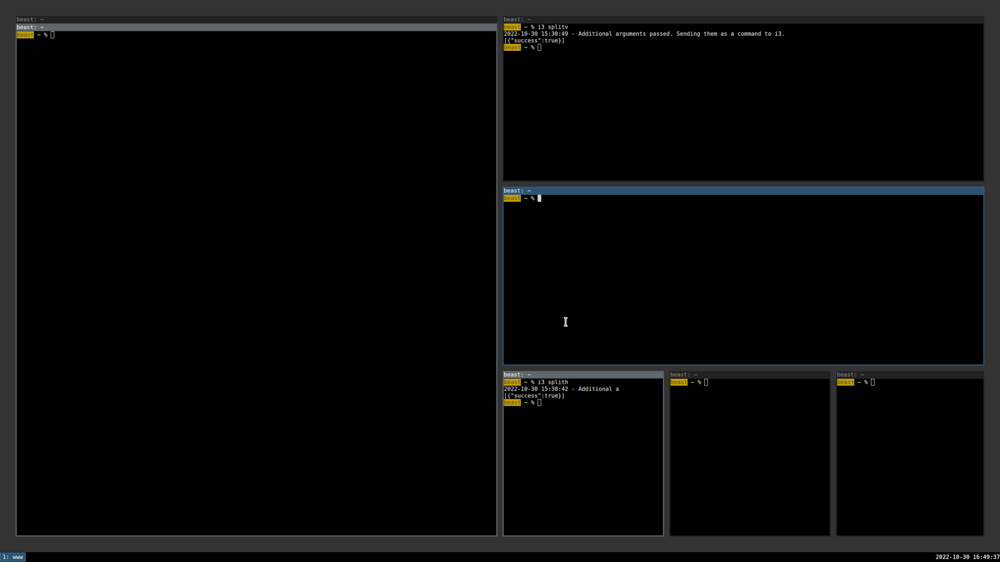

## i3wm과의 만남: 생산성을 위한 선택


i3 윈도우 매니저(i3wm)는 효율성과 생산성에 초점을 맞춘 타일링 윈도우 매니저로, 2009년 독일의 개발자 Michael Stapelberg가 기존 wmii 윈도우 매니저의 한계를 극복하고자 처음 개발했으며 "improved tiling wm"의 약자로 i3라는 이름이 붙었다. C 언어로 작성된 i3는 약 10,000줄의 간결한 코드로 구성되어 가벼우면서도 강력한 기능을 제공하며, 특히 마우스를 거의 사용하지 않고 키보드만으로 모든 작업을 수행하는 워크플로우를 선호하는 개발자, 시스템 관리자, 그리고 파워 유저들 사이에서 큰 인기를 얻고 있고, Arch Linux, Gentoo, NixOS 사용자들 사이에서 특히 높은 채택률을 보인다.

i3는 전통적인 X Window System(X11) 환경에서 동작하며 X Display Manager와 독립적으로 실행되어 LightDM, GDM, SDDM 등 어떤 로그인 매니저와도 호환되고, 최근에는 차세대 디스플레이 서버 프로토콜인 Wayland를 지원하는 호환 버전인 Sway(i3-compatible Wayland compositor)도 개발되어 널리 사용되고 있으며 Wayland의 보안성과 성능 향상을 활용하면서도 i3의 설정과 키 바인딩을 거의 그대로 사용할 수 있다. i3의 설계 철학은 "do one thing and do it well"이라는 Unix 철학을 따르며, 불필요한 시각적 장식이나 애니메이션 효과를 완전히 배제하고 화면 공간을 최대한 활용하여 실제 작업 콘텐츠에 집중할 수 있도록 하며, 다중 모니터 지원, 효율적인 창 관리, 그리고 텍스트 기반 설정 파일을 통한 높은 수준의 사용자 정의 기능을 제공한다.

i3wm은 오픈 소스 프로젝트 중에서도 특히 뛰어난 공식 문서화로 유명하며, 모든 기능과 설정 옵션이 명확하고 체계적으로 기술되어 있어 타일링 윈도우 매니저를 처음 접하는 초보자도 단계적으로 학습하고 자신만의 환경을 구성할 수 있다. 공식 문서는 [i3wm.org/docs](https://i3wm.org/docs/)에서 확인할 수 있으며, User's Guide, Configuration Reference, IPC Protocol 등 다양한 주제를 다루고 있고, 커뮤니티 포럼과 Reddit의 r/i3wm 서브레딧에서도 활발한 정보 교환이 이루어진다.

### 타일링 시스템의 철학과 구조



i3wm의 가장 기본적이면서도 핵심적인 특징은 '타일링(Tiling)' 창 배치 방식이며, 이는 전통적인 스태킹(Stacking) 윈도우 매니저인 GNOME, KDE Plasma, Windows, macOS의 방식과 근본적으로 다른 접근법이다. 스태킹 윈도우 매니저에서는 창들이 서로 겹쳐질 수 있고 사용자가 수동으로 창의 위치와 크기를 조정해야 하며, 이는 마우스 사용을 필수적으로 요구하고 화면 공간의 상당 부분이 활용되지 않거나 가려지는 비효율을 초래한다. 반면 i3는 화면을 논리적으로 분할하여 창들을 자동으로 정렬하므로 모든 창이 겹치지 않고 화면 공간을 최대한 활용하며, 사용자는 창의 위치를 고민할 필요 없이 작업 내용에만 집중할 수 있다.

**i3의 주요 타일링 특성:**

-   **자동 레이아웃(Automatic Layout)**: 새 창이 열리면 i3가 자동으로 기존 공간을 분할하여 새 창을 배치하므로, 수동으로 창 크기를 조절하거나 위치를 이동할 필요가 없고 모든 창이 항상 화면에 완전히 표시된다.

-   **방향성 분할(Directional Split)**: 수평(Horizontal) 분할 또는 수직(Vertical) 분할을 지정하여 다음 창이 현재 창의 어느 방향에 배치될지 제어할 수 있으며, 이를 조합하여 복잡한 레이아웃도 쉽게 구성할 수 있다.

-   **비율 조절(Ratio Adjustment)**: 분할된 창들 사이의 경계선을 키보드 또는 마우스로 조절하여 각 창이 차지하는 공간의 비율을 자유롭게 변경할 수 있으며, 10px 단위 또는 10% 단위로 정밀하게 조정할 수 있다.

-   **레이아웃 전환(Layout Switching)**: 타일링 모드 외에도 스태킹(Stacking) 모드와 탭(Tabbed) 모드를 지원하며, 키 하나로 즉시 전환할 수 있어 상황에 따라 최적의 레이아웃을 선택할 수 있고, 컨테이너별로 다른 레이아웃을 적용할 수도 있다.

i3의 타일링 알고리즘은 이진 트리(Binary Tree) 구조를 기반으로 하며, 이는 컴퓨터 과학의 자료 구조를 윈도우 배치에 적용한 우아한 설계이다. 사용자가 새 창을 열 때마다 현재 포커스된 창이 차지하던 공간이 트리 노드로서 둘로 분할(Split)되며, 하나는 기존 창이 차지하고 다른 하나는 새 창이 차지하게 되고, 분할 방향(수평 또는 수직)은 사용자가 명시적으로 지정하거나 i3의 기본 동작 모드에 따라 결정된다. 이러한 트리 구조 덕분에 i3는 매우 복잡한 레이아웃도 일관된 방식으로 관리할 수 있으며, 창의 부모-자식 관계가 명확하여 창을 이동하거나 제거할 때도 논리적으로 예측 가능한 동작을 보장한다.

## i3wm 설치하기

i3wm은 대부분의 주요 리눅스 배포판의 공식 저장소에 포함되어 있어 패키지 관리자를 통해 쉽게 설치할 수 있으며, 배포판별로 `i3`, `i3-wm`, `i3-gaps`(창 사이 간격 지원 포크 버전) 등 다양한 패키지 이름으로 제공된다.

**Debian/Ubuntu 계열**: `sudo apt install i3` 명령으로 i3-wm, i3status, i3lock 등 기본 컴포넌트가 함께 설치되며, 추가로 `dmenu` 또는 `rofi`(애플리케이션 런처), `feh` 또는 `nitrogen`(배경화면 설정), `compton` 또는 `picom`(컴포지터) 등을 함께 설치하는 것이 좋다.

**Fedora**: `sudo dnf install i3` 명령으로 설치하며, Fedora는 기본적으로 i3-with-shmlog 버전을 제공하고 IPC 소켓을 통한 디버깅을 지원한다.

**Arch Linux**: `sudo pacman -S i3-wm` 또는 `sudo pacman -S i3-gaps` 명령으로 설치하며, Arch 사용자들은 AUR(Arch User Repository)을 통해 다양한 i3 관련 패키지와 테마를 활용할 수 있고, `i3-gnome` 패키지를 사용하면 GNOME과 i3를 함께 사용할 수도 있다.

설치 후 로그아웃하고 로그인 화면에서 i3 세션을 선택하면 i3가 시작되며, 첫 실행 시 자동으로 설정 마법사가 나타나 설정 파일(`~/.config/i3/config`) 생성 여부와 mod 키 설정을 물어본다. mod 키는 i3의 모든 단축키에서 사용되는 핵심 수정자 키로, 보통 Alt(Mod1) 또는 윈도우 키/Super 키(Mod4) 중 하나를 선택하며, 개인적으로는 윈도우 키(Mod4)를 권장하는데 Alt 키는 많은 애플리케이션에서 이미 단축키로 사용되어 충돌이 발생할 수 있기 때문이다.


## 기본 키 조합

i3wm은 키보드 중심의 환경을 제공하기 때문에, 기본 키 조합을 익히는 것이 중요하다.


### 기본 제어

-   **$mod + Enter**: 기본 터미널 실행
-   **$mod + d**: 어플리케이션 실행 메뉴 열기
-   **$mod + Shift + q**: 현재 창 닫기
-   **$mod + Shift + r**: i3 설정 다시 불러오기
-   **$mod + Shift + e**: i3 종료 메뉴
-   **$mod + Shift + c**: i3 설정 파일 다시 불러오기

### 창 관리

-   **$mod + j/k/l/;**: 좌/하/상/우 방향으로 창 이동 (기본값)
-   **$mod + Shift + j/k/l/;**: 현재 창을 좌/하/상/우 방향으로 이동
-   **$mod + f**: 현재 창 전체화면 토글
-   **$mod + h**: 다음 창 수평 분할
-   **$mod + v**: 다음 창 수직 분할
-   **$mod + r**: 크기 조절 모드
-   **$mod + space**: 타일링/플로팅 모드 전환

i3wm은 vim 편집기와 달리 기본적으로 `jkl;`를 방향키로 사용하며, 이는 키보드 홈 로우(Home Row)에서 오른손의 자연스러운 위치를 고려한 설계이지만 vim에 익숙한 사용자에게는 다소 낯설게 느껴질 수 있다. 필요시 설정 파일(`~/.config/i3/config`)에서 `hjkl` 스타일로 변경할 수 있으며, 개인적으로는 vim과 tmux, 그리고 많은 CLI 도구에서 `hjkl`을 방향키로 사용해왔기 때문에 i3에서도 `hjkl`로 변경하여 사용하는 것이 훨씬 더 직관적이고 편리하다고 느꼈으며, 근육 기억(Muscle Memory)을 일관되게 유지할 수 있어 전환 비용이 적었다.

### 워크스페이스 관리

-   **$mod + 숫자(1-0)**: 해당 번호의 워크스페이스로 이동
-   **$mod + Shift + 숫자(1-0)**: 현재 창을 해당 워크스페이스로 이동

## i3wm 설정 파일 구성하기

i3wm의 설정은 텍스트 기반 설정 파일(`~/.config/i3/config`)을 통해 이루어진다.

### 설정 파일 내용

1. 기본 변수 설정(mod 키, 폰트 등)
2. 자동 실행 프로그램 설정
3. 다크 모드 및 전원 관리 설정
4. 미디어 키 바인딩
5. 기본 창 조작 키 바인딩
6. 워크스페이스 설정
7. 창 스타일 및 색상 설정
8. 바(i3bar) 설정

### 설정 예시

```bash
# 기본 변수 설정
set $mod Mod1
font pango:JetBrains Mono 10

# 기본 프로그램
bindsym $mod+Return exec alacritty
bindsym $mod+d exec --no-startup-id rofi -show drun

# 창 이동 기본값 (jkl;)
bindsym $mod+j focus left
bindsym $mod+k focus down
bindsym $mod+l focus up
bindsym $mod+semicolon focus right

# 창 분할 방식
bindsym $mod+h split h
bindsym $mod+v split v
```

## 워크스페이스 효율적으로 활용하기

i3wm의 워크스페이스 시스템은 작업 관리에 매우 효율적이다. 기본적으로 10개의 워크스페이스가 제공된다.

### 워크스페이스 설정

```bash
# 워크스페이스 정의 (간결한 숫자 이름)
set $ws1 "1"
set $ws2 "2"
set $ws3 "3"

# 워크스페이스 전환
bindsym $mod+1 workspace number $ws1
bindsym $mod+2 workspace number $ws2

# 윈도우 워크스페이스 이동
bindsym $mod+Shift+1 move container to workspace number $ws1
bindsym $mod+Shift+2 move container to workspace number $ws2
```

나의 설정에서는 단순히 `"1"`, `"2"`, `"3"`과 같이 숫자만 사용한 간결한 워크스페이스 이름을 사용하고 있으며, 이는 빠른 전환과 인지적 부담을 최소화하기 위한 선택이다. 일부 사용자들은 `"1:web"`, `"2:code"`, `"3:term"`처럼 숫자 뒤에 콜론과 설명을 추가하여 각 워크스페이스의 용도를 명시하기도 하지만, 나는 워크스페이스를 고정된 용도로 사용하기보다는 유동적으로 활용하는 편이어서 숫자만 사용하는 것이 더 자유롭고 효율적이라고 느꼈으며, 필요에 따라 언제든지 설정 파일에서 이름을 변경할 수 있는 유연성을 유지하고 있다.

## i3bar와 i3status 커스터마이징

i3wm은 화면 하단(또는 상단)에 상태 표시줄을 제공하며, 이는 i3bar(표시줄 렌더링 컴포넌트)와 i3status(시스템 정보 수집 및 포맷팅 컴포넌트)로 구성되고, i3bar는 i3status가 출력하는 JSON 형식의 데이터를 받아 시각적으로 표시하는 역할을 한다. i3status는 CPU 사용률, 메모리 사용량, 디스크 공간, 네트워크 상태, 배터리 잔량, 시간 등 다양한 시스템 정보를 모니터링하며, 설정 파일(`~/.config/i3status/config`)을 통해 표시할 정보와 형식을 자유롭게 커스터마이징할 수 있고, 더 강력한 기능이 필요하다면 i3status 대신 i3blocks, polybar, bumblebee-status 등의 대체 상태 표시줄 프로그램을 사용할 수도 있다.

### i3bar 설정

```bash
bar {
    position bottom
    status_command i3status
    tray_output primary
    font pango:JetBrains Mono 10

    mode hide  # 평소에는 숨김
    hidden_state hide
    modifier $mod

    colors {
        background #1c1c1c
        statusline #c0c5ce
        focused_workspace  #2b303b #2b303b #c0c5ce
        inactive_workspace #1c1c1c #1c1c1c #888888
    }
}
```

주요 특징: 평소에는 숨겨졌다가 $mod 키를 누를 때만 표시되며, 다크 테마 기반 색상을 사용하고, 마우스 휠로 볼륨 조절이 가능하다.

## 생산성 향상을 위한 팁

### 리사이즈 모드

창 크기를 정밀하게 조절하는 리사이즈 모드:

```bash
mode "resize" {
    # 크기 조절 바인딩
    bindsym j resize shrink width 10 px or 10 ppt
    bindsym k resize grow height 10 px or 10 ppt
    bindsym l resize shrink height 10 px or 10 ppt
    bindsym semicolon resize grow width 10 px or 10 ppt

    # 모드 빠져나가기
    bindsym Return mode "default"
    bindsym Escape mode "default"
}
```

### 키 바인딩 커스터마이징

기본 jkl; 배열을 VI 편집기 스타일의 hjkl 키로 변경:

```bash
# VI 스타일 hjkl 변경
bindsym $mod+h focus left
bindsym $mod+j focus down
bindsym $mod+k focus up
bindsym $mod+l focus right

# 창 분할키 변경 (h가 이미 사용됨)
bindsym $mod+b split h  # 수평 분할
```

### 유용한 단축키 설정

```bash
# 스크린샷
bindsym Print exec --no-startup-id scrot '%Y-%m-%d_%H-%M-%S.png' -e 'mv $f ~/Pictures/'

# 시스템 제어
bindsym $mod+Shift+x exec xtrlock  # 화면 잠금
bindsym $mod+Shift+e exec "i3-nagbar -t warning -m '종료하시겠습니까?'"
```

더 자세한 설정 예시와 내가 실제 사용 중인 설정은 GitHub 레포지토리([github.com/in-jun/i3wm-setup](https://github.com/in-jun/i3wm-setup))에서 확인할 수 있다.

## 결론

i3wm은 GNOME, KDE Plasma, Xfce 같은 전통적인 데스크톱 환경과는 근본적으로 다른 접근 방식을 취하는 미니멀리즘 철학의 윈도우 매니저이지만, 초기 학습 곡선을 넘어서면 마우스 사용을 최소화하고 키보드만으로 모든 작업을 빠르게 수행할 수 있는 놀라운 생산성 향상을 경험할 수 있다. 키보드 중심의 인터페이스, 자동 타일링을 통한 효율적인 창 관리, 텍스트 기반 설정 파일을 통한 높은 사용자화 가능성, 그리고 경량성과 안정성은 개발자, 시스템 관리자, 그리고 파워 유저들에게 매우 매력적인 요소이며, 특히 멀티태스킹이 많은 개발 워크플로우에서 진가를 발휘한다.

학습 곡선이 다소 가파르게 느껴질 수 있지만, 공식 문서([i3wm.org/docs](https://i3wm.org/docs/))가 매우 상세하고 체계적으로 작성되어 있어 단계적으로 학습하기 좋으며, Reddit의 r/i3wm 커뮤니티와 Arch Wiki의 i3 페이지에서도 풍부한 예제와 팁을 얻을 수 있고, 무엇보다 직접 사용하면서 설정을 조금씩 개선해나가는 과정 자체가 재미있고 보람 있는 경험이 된다.
