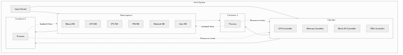

Linux container technology has steadily evolved since the first introduction of mount namespace in kernel 2.4.19 in 2002 to become a core foundation of modern cloud infrastructure, with Namespaces handling process isolation and Cgroups (Control Groups) handling resource control at its center. All container runtimes including Docker, Kubernetes, and Podman leverage these two kernel features to provide isolation environments that are much lighter and faster than virtual machines, and understanding them is the first step to deeply grasping container technology.

## Historical Background of Container Technology

> **Why Are Containers Needed?**
>
> Traditional virtual machines emulate entire hardware to run complete operating systems, resulting in large resource overhead and long startup times. Containers share the host kernel while providing process-level isolation, achieving the same isolation effect with millisecond-level fast startup and minimal resource usage.

The concept of Linux namespaces was inspired by the Plan 9 operating system from Bell Labs, with the first implementation starting as mount namespace in Linux kernel 2.4.19 in 2002. Full-scale expansion began from 2006, with PID namespace and network namespace added in 2007, and memory cgroups appearing in 2008 to strengthen resource control capabilities. The technical foundation for complete container support was completed when user namespace was introduced in kernel 3.8. LXC (Linux Containers) provided user tools leveraging these features in 2008, and Docker popularized container technology in 2013 by combining image building and deployment tools.

## Namespaces: Isolation of Kernel Resources

> **What is a Namespace?**
>
> A namespace is a Linux kernel feature that partitions specific system resources by process group, making each group appear to have its own independent instance of that resource. Unlike virtual machines that virtualize hardware, namespaces partition kernel functionality itself to provide lighter and more efficient isolation.

The current Linux kernel (6.1 and above) provides 8 types of namespaces, each responsible for isolating specific system resources. Container runtimes combine the necessary namespaces when creating new containers to create isolated environments, and processes inside containers have their own unique resource views.

### Detailed Explanation by Namespace Type

| Namespace | Isolation Target | Kernel Version | Description |
|-----------|-----------------|----------------|-------------|
| **Mount (mnt)** | Filesystem mount points | Kernel 2.4.19 (2002) | Each namespace has independent mount point list |
| **UTS** | Hostname, domain name | Kernel 2.6.19 (2006) | Different hostname per container possible |
| **IPC** | System V IPC, POSIX message queues | Kernel 2.6.19 (2006) | Semaphores, message queues, shared memory isolation |
| **PID** | Process IDs | Kernel 2.6.24 (2008) | Independent numbering starting from PID 1 per namespace |
| **Network (net)** | Network stack | Kernel 2.6.29 (2009) | IP addresses, routing tables, sockets, firewall rules isolation |
| **User** | UID/GID mapping | Kernel 3.8 (2013) | Maps container root to regular user on host |
| **Cgroup** | Cgroup hierarchy view | Kernel 4.6 (2016) | Each container sees isolated cgroup hierarchy |
| **Time** | System time | Kernel 5.6 (2020) | Different system time per process possible |

### How PID Namespace Works

The first process created in a PID namespace is assigned PID 1 and receives the same special treatment as the traditional init process. When this process terminates, all processes in that namespace terminate immediately. Orphaned processes (processes whose parent has terminated) are re-parented to this PID 1 process, allowing each container to have its own process tree. Nested PID namespaces can be used, making it possible to run another container inside a container.

### How Network Namespace Works

When a network namespace is created, it initially contains only the loopback interface (lo), and to communicate externally, a virtual network interface (veth pair) must be created and connected to the host namespace. Each network namespace has independent IP addresses, routing tables, iptables rules, and sockets. Physical or virtual network interfaces can belong to exactly one namespace but can be moved between namespaces. Docker implements network connectivity between containers and host using veth pairs in bridge network mode.

### User Namespace and Security

User namespace plays the most important role in container security, implementing privilege separation by mapping UID/GID inside the container to different UID/GID on the host. For example, a process running as root (UID 0) inside a container can be mapped to a non-privileged user like UID 100000 on the host, so even if a container escape attack succeeds, it cannot gain root privileges on the host. This feature is called "rootless containers," with Podman using this mode by default and Docker also supporting rootless mode.

## Cgroups: Resource Allocation and Limitation

> **What are Cgroups?**
>
> Cgroups (Control Groups) is a Linux kernel feature that limits, accounts for, and isolates resource usage of process groups, developed by Google engineers in 2007 and merged into kernel 2.6.24. It can finely control resources such as CPU, memory, disk I/O, and network bandwidth, and is the core mechanism for preventing the "noisy neighbor" problem in container environments.

Cgroups are organized in a hierarchical structure, with child cgroups inheriting resource limits from parent cgroups. Each cgroup can contain multiple processes, and each process belongs to exactly one cgroup. Resource controllers (subsystems) perform actual resource limiting, with major controllers including cpu, cpuacct, memory, blkio, net_cls, and pids.

### Major Cgroups Resource Controllers

| Controller | Function | Key Parameters |
|-----------|----------|----------------|
| **cpu** | CPU time allocation ratio adjustment | cpu.shares, cpu.cfs_quota_us |
| **cpuacct** | CPU usage accounting | cpuacct.usage, cpuacct.stat |
| **memory** | Memory usage limitation | memory.limit_in_bytes, memory.soft_limit_in_bytes |
| **blkio** | Block I/O bandwidth limitation | blkio.throttle.read_bps_device |
| **pids** | Process count limitation | pids.max |
| **devices** | Device access control | devices.allow, devices.deny |

### Differences Between Cgroups v1 and v2

Cgroups v1 allowed each resource controller to have separate hierarchies, providing configuration flexibility but increasing complexity and lacking consistency between controllers. Cgroups v2 was introduced in kernel 4.5 in 2016, using a single unified hierarchy where all controllers operate in the same hierarchy, simplifying management. In v2, processes can only be attached to leaf nodes, it operates at process granularity instead of thread-level fine-grained control, and the memory controller supports hierarchical memory limits by default.

| Characteristic | Cgroups v1 | Cgroups v2 |
|----------------|-----------|------------|
| **Hierarchy** | Multiple hierarchies per controller | Single unified hierarchy |
| **Process Attachment** | All nodes possible | Leaf nodes only |
| **Thread Support** | Per-thread cgroup allocation possible | Process granularity only |
| **Memory Hierarchy** | Optional | Default support |
| **Kubernetes Support** | Maintenance mode (v1.31~) | Recommended |

The Kubernetes community transitioned cgroups v1 support to maintenance mode starting from v1.31, and RHEL 10 only supports cgroups v2. Using cgroups v2 is recommended for new deployments.

## Docker and Container Isolation

Docker uses mount, UTS, IPC, PID, and network namespaces by default when creating containers, with user namespace optionally enabled for enhanced security. When a container starts, the Docker daemon creates a dedicated namespace set and cgroup for that container, and runc (OCI runtime) actually calls the kernel interface to configure the isolation environment.

### Docker's Resource Limiting Options

Docker abstracts cgroups to allow resource limits to be set with simple flags, using options like `--memory`, `--cpus`, and `--blkio-weight` in the `docker run` command to control resources per container. For example, to limit memory to 512MB and CPU to 1.5 cores, use the `--memory=512m --cpus=1.5` flags, and these settings are directly reflected in the cgroup parameters for that container.

### How to Verify Isolation Mechanisms

To verify namespaces and cgroups at the system level, use the `lsns` command to query all namespaces on the current system, and check specific process namespace symbolic links in the `/proc/<PID>/ns/` directory. Cgroups settings can be verified in the `/sys/fs/cgroup/` directory, and on systems using cgroups v2, resource settings for each service can be viewed under `/sys/fs/cgroup/system.slice/`. For Docker containers, the `docker inspect` command can be used to check that container's namespace IDs and cgroup paths.

## Security Considerations and Limitations

> **Fundamental Limitations of Containers**
>
> Unlike virtual machines, containers share the host kernel, so when kernel vulnerabilities are discovered, all containers can be affected. As the saying goes, "Containers don't contain" - namespaces and cgroups alone cannot provide complete security boundaries, and additional security layers are needed.

Beyond security risks from kernel sharing, default settings have no limits on process creation counts making them vulnerable to resource exhaustion attacks like fork bombs. Improper cgroups settings can cause noisy neighbor problems where one container uses excessive resources degrading other containers' performance. Additionally, when containers are configured to access host privileged resources (`--privileged` flag), isolation is effectively neutralized.

### Security Enhancement Methods

A defense-in-depth approach is needed to strengthen container security. Enable user namespace so container root maps to non-privileged user on host, use MAC (Mandatory Access Control) systems like AppArmor or SELinux to restrict process behavior. Apply seccomp profiles to whitelist-restrict system calls containers can invoke, remove unnecessary Linux capabilities, and apply read-only filesystems and principle of least privilege. eBPF-based runtime security tools (Falco, Cilium, Tetragon, etc.) can detect and block anomalous container behavior in real-time.

| Security Layer | Technology | Effect |
|----------------|------------|--------|
| **User Isolation** | User namespace, Rootless mode | Limit host privileges on container escape |
| **Access Control** | AppArmor, SELinux | Restrict process behavior |
| **System Call Filtering** | Seccomp | Block dangerous system calls |
| **Capability Limitation** | --cap-drop | Remove unnecessary privileges |
| **Runtime Security** | eBPF, Falco | Real-time anomaly detection |

## Conclusion

Linux namespaces and cgroups have gone through a long development process since 2002 to become the core foundation of modern container technology, with the entire container ecosystem including Docker and Kubernetes built on these two kernel features. Namespaces isolate 8 types of resources including processes, networks, filesystems, and user IDs to make each container operate like an independent system, while cgroups precisely allocate and limit resources like CPU, memory, and I/O to enable fair resource distribution and noisy neighbor prevention. However, due to the structural characteristic of sharing the kernel, complete security isolation cannot be provided, so applying multi-layered security mechanisms such as user namespace, MAC, seccomp, and eBPF together is key to building a secure container environment.
