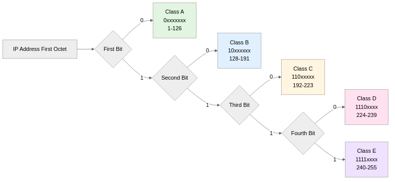

## 클래스 기반 주소 체계란

클래스 기반 주소 체계(Classful Addressing)는 1981년 IETF의 RFC 791 문서를 통해 IPv4 프로토콜과 함께 공식적으로 도입된 IP 주소 할당 방식으로, 초기 인터넷 네트워크에서 주소 공간을 효율적으로 분배하고 라우팅 테이블을 최소화하기 위해 설계되었으며, IP 주소의 첫 번째 옥텟(8비트)의 비트 패턴을 기반으로 네트워크 규모를 5개 클래스(A, B, C, D, E)로 구분하여 서로 다른 크기의 네트워크 주소 공간을 제공하는 체계다.

이 체계는 1980년대 초반 인터넷이 아직 소규모였을 때 대규모 조직, 중규모 기업, 소규모 네트워크를 명확히 구분하여 주소를 할당할 수 있도록 설계되었으며, 각 클래스마다 네트워크 부분과 호스트 부분의 길이가 고정되어 있어 라우터가 IP 주소의 첫 번째 바이트만 보고도 네트워크 경계를 즉시 판단할 수 있는 장점이 있었지만, 1990년대 들어 인터넷이 급격히 성장하면서 주소 공간의 비효율적 사용 문제가 심각해져 1993년 CIDR(Classless Inter-Domain Routing) 방식으로 대체되기 시작했다.

## IP 주소의 기본 구조

IPv4 주소는 32비트(4바이트)로 구성되며, 이를 8비트씩 4개의 옥텟(octet)으로 나누어 10진수 점 표기법(dotted decimal notation)으로 표현하고, 각 옥텟은 0부터 255까지의 값을 가질 수 있으며, 논리적으로는 네트워크를 구분하는 '네트워크 부분(Network ID)'과 해당 네트워크 내 개별 호스트를 구분하는 '호스트 부분(Host ID)'의 두 영역으로 분리되어 네트워크 계층에서의 주소 지정과 라우팅을 가능하게 한다.

예를 들어 회사 건물의 주소 체계와 비슷한데, '서울시 강남구 테헤란로 123번길'이 네트워크 부분이라면 '3층 301호'는 호스트 부분이며, 네트워크 부분이 같으면 같은 네트워크(브로드캐스트 도메인)에 속한 것으로 간주되고 라우터 없이도 직접 통신할 수 있지만, 네트워크 부분이 다르면 서로 다른 네트워크로 인식되어 라우터를 통한 라우팅이 필요하다.

192.168.1.100 이라는 IP 주소가 있을 때(클래스 C 기준):
- 앞부분 24비트(192.168.1)는 네트워크를 식별하는 네트워크 ID다
- 뒷부분 8비트(100)는 그 네트워크 안의 특정 장치를 가리키는 호스트 ID다
- 네트워크 주소는 호스트 부분이 모두 0인 192.168.1.0이며, 이는 네트워크 자체를 나타낸다
- 브로드캐스트 주소는 호스트 부분이 모두 1인 192.168.1.255이며, 해당 네트워크의 모든 호스트에게 데이터를 전송할 때 사용된다

## 클래스별 비트 패턴과 구분

클래스 기반 체계는 IP 주소의 첫 번째 옥텟의 상위 비트 패턴을 통해 클래스를 구분하며, 이는 라우터가 복잡한 계산 없이도 빠르게 네트워크 경계를 파악할 수 있도록 설계된 것이다.



각 클래스의 비트 패턴:
- **클래스 A**: 첫 번째 비트가 0 (0xxxxxxx), 첫 옥텟 범위 1-126
- **클래스 B**: 첫 두 비트가 10 (10xxxxxx), 첫 옥텟 범위 128-191
- **클래스 C**: 첫 세 비트가 110 (110xxxxx), 첫 옥텟 범위 192-223
- **클래스 D**: 첫 네 비트가 1110 (1110xxxx), 첫 옥텟 범위 224-239
- **클래스 E**: 첫 네 비트가 1111 (1111xxxx), 첫 옥텟 범위 240-255

주의할 점은 0.x.x.x와 127.x.x.x는 특수 목적으로 예약되어 있다는 것인데, 0.0.0.0은 기본 라우트(default route)를 나타내며 127.0.0.0/8 범위(특히 127.0.0.1)는 루프백(loopback) 주소로 자신의 호스트를 가리키는 데 사용되어 클래스 A의 실질적인 첫 번째 옥텟 범위는 1부터 126까지로 제한된다.

## 클래스 A


클래스 A는 가장 큰 네트워크 주소 공간을 제공하는 클래스로, 초기 인터넷에서 MIT, IBM, HP, AT&T, Apple, 미국 국방부(DoD), 포드 자동차 등 극소수의 대규모 조직과 정부 기관에만 할당되었으며, 첫 번째 8비트만 네트워크 부분으로 사용하고 나머지 24비트를 모두 호스트 부분으로 사용하는 구조로 설계되어 하나의 네트워크 내에 1600만 개 이상의 호스트를 수용할 수 있다.

**기술적 특징**:
- **첫 번째 옥텟**: 1 ~ 126 (0xxxxxxx 비트 패턴)
- **주소 범위**: 1.0.0.0 ~ 126.255.255.255
- **네트워크 부분**: 첫 번째 8비트
- **호스트 부분**: 나머지 24비트
- **네트워크 수**: 126개 (실제로는 2^7 = 128개이지만 0과 127은 특수 목적으로 예약)
- **호스트 수**: 16,777,214개 (2^24 - 2, 네트워크 주소와 브로드캐스트 주소 제외)
- **기본 서브넷 마스크**: 255.0.0.0 (/8)

**실제 할당 사례**:
- 3.0.0.0/8: General Electric Company
- 8.0.0.0/8: Level 3 Communications (현재 레거시 인터넷 백본)
- 12.0.0.0/8: AT&T Services
- 15.0.0.0/8: Hewlett-Packard Company
- 16.0.0.0/8: Digital Equipment Corporation (현재 HP에 인수)
- 17.0.0.0/8: Apple Inc.

**네트워크 주소 계산 예시**:
```
IP 주소: 10.45.123.200
클래스: A (첫 옥텟 10이 1-126 범위)
네트워크 ID: 10.0.0.0
호스트 ID: 0.45.123.200 (10진수로 45.123.200)
네트워크 주소: 10.0.0.0 (호스트 부분이 모두 0)
브로드캐스트 주소: 10.255.255.255 (호스트 부분이 모두 1)
사용 가능한 호스트 범위: 10.0.0.1 ~ 10.255.255.254
```

## 클래스 B

클래스 B는 중규모 네트워크를 위해 설계된 클래스로, 대학교, 중대형 기업, ISP(Internet Service Provider) 등에 주로 할당되었으며, 첫 번째 16비트를 네트워크 부분으로 사용하고 나머지 16비트를 호스트 부분으로 사용하여 네트워크 수와 호스트 수 사이의 균형을 제공하며, 클래스 A와 C의 중간 크기로 6만 개 이상의 호스트를 수용할 수 있어 중대형 조직에 적합하다.

**기술적 특징**:
- **첫 번째 옥텟**: 128 ~ 191 (10xxxxxx 비트 패턴)
- **주소 범위**: 128.0.0.0 ~ 191.255.255.255
- **네트워크 부분**: 첫 번째 16비트
- **호스트 부분**: 나머지 16비트
- **네트워크 수**: 16,384개 (2^14, 첫 2비트는 클래스 식별용)
- **호스트 수**: 65,534개 (2^16 - 2)
- **기본 서브넷 마스크**: 255.255.0.0 (/16)

**실제 할당 사례**:
- 128.2.0.0/16: Carnegie Mellon University
- 129.6.0.0/16: Massachusetts Institute of Technology (MIT)
- 130.94.0.0/16: University of Cambridge
- 132.163.0.0/16: Princeton University
- 172.16.0.0 ~ 172.31.0.0: 사설 네트워크 대역(RFC 1918)

**네트워크 주소 계산 예시**:
```
IP 주소: 172.16.45.200
클래스: B (첫 옥텟 172가 128-191 범위)
네트워크 ID: 172.16.0.0
호스트 ID: 0.0.45.200 (10진수로 45 × 256 + 200 = 11,720)
네트워크 주소: 172.16.0.0
브로드캐스트 주소: 172.16.255.255
사용 가능한 호스트 범위: 172.16.0.1 ~ 172.16.255.254
```

## 클래스 C

클래스 C는 소규모 네트워크를 위해 설계된 클래스로, 작은 기업, 지점, 소규모 조직에 주로 할당되었으며, 첫 번째 24비트를 네트워크 부분으로 사용하고 마지막 8비트만 호스트 부분으로 사용하여 하나의 네트워크에 254개의 호스트만 수용할 수 있지만, 전체 네트워크 수는 200만 개가 넘어 많은 소규모 조직에 주소 공간을 제공할 수 있도록 설계되었다.

**기술적 특징**:
- **첫 번째 옥텟**: 192 ~ 223 (110xxxxx 비트 패턴)
- **주소 범위**: 192.0.0.0 ~ 223.255.255.255
- **네트워크 부분**: 첫 번째 24비트
- **호스트 부분**: 마지막 8비트
- **네트워크 수**: 2,097,152개 (2^21, 첫 3비트는 클래스 식별용)
- **호스트 수**: 254개 (2^8 - 2)
- **기본 서브넷 마스크**: 255.255.255.0 (/24)

**실제 할당 사례**:
- 192.168.0.0 ~ 192.168.255.0: 사설 네트워크 대역(RFC 1918, 가장 널리 사용)
- 193.0.0.0/8 ~ 223.0.0.0/8: 공인 IP 주소로 전 세계 ISP와 조직에 분배

**네트워크 주소 계산 예시**:
```
IP 주소: 192.168.1.100
클래스: C (첫 옥텟 192가 192-223 범위)
네트워크 ID: 192.168.1.0
호스트 ID: 0.0.0.100 (10진수로 100)
네트워크 주소: 192.168.1.0
브로드캐스트 주소: 192.168.1.255
사용 가능한 호스트 범위: 192.168.1.1 ~ 192.168.1.254
```

각 클래스에서 2를 빼는 이유는 네트워크 주소와 브로드캐스트 주소를 제외하기 때문인데, 네트워크 주소는 호스트 부분이 모두 0인 주소로 네트워크 자체를 나타내며 호스트에 할당할 수 없고, 브로드캐스트 주소는 호스트 부분이 모두 1인 주소로 해당 네트워크의 모든 호스트에게 동시에 패킷을 전송할 때 사용되므로 역시 개별 호스트에 할당할 수 없다.

## 클래스 D와 E

클래스 D와 E는 일반적인 유니캐스트(unicast) 통신용이 아닌 특수 목적으로 예약된 주소 공간으로, 클래스 A, B, C와 달리 네트워크 부분과 호스트 부분의 구분이 없으며 특정한 용도로만 사용된다.

### 클래스 D (멀티캐스트)

클래스 D는 멀티캐스트(multicast) 통신을 위해 예약된 주소 공간으로, 하나의 송신자가 여러 수신자에게 동시에 데이터를 전송할 때 사용되며, 각 수신자가 멀티캐스트 그룹에 가입(join)하여 특정 멀티캐스트 주소로 전송되는 패킷을 수신하는 방식으로 동작한다.

**기술적 특징**:
- **첫 번째 옥텟**: 224 ~ 239 (1110xxxx 비트 패턴)
- **주소 범위**: 224.0.0.0 ~ 239.255.255.255
- **프로토콜**: IGMP(Internet Group Management Protocol)를 통해 그룹 관리
- **네트워크/호스트 구분 없음**: 전체 32비트가 멀티캐스트 그룹 ID로 사용됨

**주요 사용 사례**:
- **224.0.0.1**: 동일 서브넷의 모든 호스트(All Hosts)
- **224.0.0.2**: 동일 서브넷의 모든 라우터(All Routers)
- **224.0.0.5**: OSPF 라우터 간 통신
- **224.0.0.9**: RIPv2 라우팅 프로토콜
- **239.0.0.0 ~ 239.255.255.255**: 조직 내부 멀티캐스트용 사설 주소

**실제 활용**:
- IPTV 스트리밍 (하나의 소스에서 여러 수신자에게 동일한 비디오 스트림 전송)
- 화상 회의 시스템 (여러 참가자에게 동시에 영상/음성 전송)
- 금융 시장 데이터 피드 (주식 시세를 여러 거래 단말기에 실시간 전송)
- 온라인 게임 (게임 서버가 여러 클라이언트에게 동시에 게임 상태 전송)

### 클래스 E (실험/예약)

클래스 E는 실험적 용도와 미래 사용을 위해 IETF에서 예약한 주소 공간으로, 일반적인 네트워크 환경에서는 사용되지 않으며, 대부분의 라우터와 운영체제에서 이 범위의 주소를 필터링하거나 거부하도록 설정되어 있다.

**기술적 특징**:
- **첫 번째 옥텟**: 240 ~ 255 (1111xxxx 비트 패턴)
- **주소 범위**: 240.0.0.0 ~ 255.255.255.255
- **사용 제한**: 표준 인터넷 프로토콜에서 사용 금지
- **특수 주소**: 255.255.255.255는 제한된 브로드캐스트(limited broadcast) 주소로 사용

**255.255.255.255의 특별한 용도**:
제한된 브로드캐스트 주소로, 로컬 네트워크 세그먼트에만 전송되며 라우터를 넘어가지 않는 브로드캐스트에 사용되고, DHCP 클라이언트가 IP 주소를 아직 할당받지 못한 상태에서 DHCP 서버를 찾을 때 목적지 주소로 255.255.255.255를 사용하여 동일 물리적 네트워크의 모든 호스트에게 DHCP Discover 메시지를 전송한다.

## 사설 네트워크 주소 (RFC 1918)

1996년 RFC 1918 문서를 통해 공식적으로 정의된 사설 IP 주소(Private IP Address) 범위는 인터넷에 직접 연결되지 않는 내부 네트워크에서 자유롭게 사용할 수 있도록 예약된 주소 공간으로, 인터넷 라우터에서 라우팅되지 않으며(non-routable), NAT(Network Address Translation)를 통해 공인 IP 주소로 변환되어 외부 인터넷과 통신할 수 있다.

**클래스별 사설 주소 범위**:
- **클래스 A**: 10.0.0.0 ~ 10.255.255.255 (10.0.0.0/8)
  - 1개의 클래스 A 네트워크, 16,777,216개 주소
  - 대규모 기업 내부 네트워크, 데이터센터에서 주로 사용
- **클래스 B**: 172.16.0.0 ~ 172.31.255.255 (172.16.0.0/12)
  - 16개의 연속된 클래스 B 네트워크, 1,048,576개 주소
  - 중규모 기업 네트워크, 캠퍼스 네트워크에서 주로 사용
- **클래스 C**: 192.168.0.0 ~ 192.168.255.255 (192.168.0.0/16)
  - 256개의 연속된 클래스 C 네트워크, 65,536개 주소
  - 가정용 라우터, 소규모 사무실 네트워크에서 가장 널리 사용

**사설 주소의 장점**:
- **주소 절약**: 여러 조직이 동일한 사설 주소 범위를 재사용할 수 있어 공인 IP 주소 고갈 문제 완화
- **보안 강화**: 외부 인터넷에서 직접 접근할 수 없어 기본적인 보안 계층 제공
- **유연한 네트워크 설계**: 내부 네트워크 구조를 외부에 노출하지 않고 자유롭게 변경 가능
- **비용 절감**: 공인 IP 주소를 대량으로 구매할 필요 없이 소수의 공인 IP로 많은 내부 호스트 운영 가능

**실제 활용 사례**:
- 가정용 Wi-Fi 라우터는 대부분 192.168.0.0/24 또는 192.168.1.0/24 네트워크 사용
- 기업 내부 네트워크는 10.0.0.0/8 대역을 서브넷팅하여 부서별, 층별, 건물별로 분할 사용
- AWS VPC(Virtual Private Cloud)는 기본적으로 172.31.0.0/16 대역 제공

## 클래스 체계의 한계와 CIDR로의 전환

클래스 기반 주소 체계는 1980년대 초반 소규모 인터넷 환경에서는 효과적이었으나, 1990년대 들어 월드 와이드 웹(WWW)의 등장과 상업적 인터넷 사용 급증으로 심각한 한계가 드러나기 시작했고, 이는 결국 1993년 CIDR(Classless Inter-Domain Routing) 방식의 도입으로 이어졌다.

**클래스 체계의 주요 문제점**:

1. **극심한 주소 공간 낭비**
   - 500대의 호스트가 필요한 조직은 클래스 C(254개)로는 부족하고 클래스 B(65,534개)를 할당받아야 했는데, 이는 65,000개 이상의 주소를 낭비하는 결과를 초래했다
   - 클래스 A는 총 126개만 존재하며 대부분 초기에 대기업과 정부 기관에 할당되어 새로운 대규모 조직은 할당받을 수 없었다
   - 클래스 B 주소는 1990년대 초반에 거의 고갈되었고, 이는 IPv4 주소 고갈 문제를 가속화했다

2. **라우팅 테이블의 폭발적 증가**
   - 클래스 C는 200만 개 이상의 네트워크를 생성할 수 있었고, 각 네트워크마다 별도의 라우팅 엔트리가 필요했다
   - 1990년대 초반 인터넷 백본 라우터의 라우팅 테이블 크기가 기하급수적으로 증가하여 라우터의 메모리와 처리 능력에 심각한 부담을 주었다
   - 여러 클래스 C 네트워크를 하나로 요약(aggregation)할 방법이 없어 라우팅 효율성이 크게 저하되었다

3. **유연성 부족**
   - 네트워크 크기가 3가지(254, 65,534, 16,777,214 호스트)로 고정되어 실제 요구사항에 맞는 적절한 크기 선택 불가
   - 서브넷팅을 사용하더라도 클래스의 기본 경계 내에서만 가능하여 제약이 많았다
   - 네트워크 통합(supernetting)이나 유연한 주소 할당이 불가능했다

**CIDR의 등장과 장점**:

1993년 IETF RFC 1517, 1518, 1519를 통해 도입된 CIDR은 클래스 개념을 제거하고 가변 길이 서브넷 마스크(VLSM)를 사용하여 네트워크 크기를 1비트 단위로 조정할 수 있게 했으며, 이를 통해 주소 공간을 효율적으로 사용하고, 라우트 집약(route aggregation)을 통해 라우팅 테이블 크기를 크게 줄일 수 있게 되었고, 현재는 거의 모든 인터넷 라우팅이 CIDR 기반으로 동작하지만 네트워크 클래스의 개념은 여전히 IP 주소 체계를 이해하는 기초로서 중요한 의미를 가진다.

## 클래스 체계의 현대적 의의

비록 클래스 기반 주소 체계가 1993년 CIDR로 대체되었지만, 다음과 같은 이유로 여전히 네트워크 학습과 실무에서 중요하다:

1. **역사적 이해**: 초기 인터넷 구조와 IPv4 주소 고갈 문제의 원인을 이해하는 데 필수적이다
2. **기본 개념**: 네트워크 부분과 호스트 부분의 개념은 CIDR과 서브넷팅의 기초가 된다
3. **레거시 시스템**: 일부 오래된 네트워크 장비와 문서에서 여전히 클래스 개념을 사용한다
4. **사설 주소**: RFC 1918 사설 주소는 여전히 클래스 기반 범위로 정의되어 널리 사용된다
5. **교육 목적**: 네트워크 초보자가 IP 주소 구조를 이해하는 데 직관적인 출발점을 제공한다

## 마치며

네트워크 클래스 A, B, C, D, E 체계는 1981년 IPv4와 함께 도입된 초기 IP 주소 할당 방식으로, 네트워크 규모에 따라 주소 공간을 5개 클래스로 구분하여 효율적인 주소 분배와 라우팅을 목표로 했으나, 1990년대 인터넷의 폭발적 성장과 함께 주소 공간 낭비와 라우팅 테이블 비대화 문제가 심각해져 1993년 CIDR 방식으로 대체되었다. 비록 현대 네트워크에서는 클래스 개념을 직접 사용하지 않지만, 네트워크 부분과 호스트 부분의 구분, 사설 IP 주소 범위(RFC 1918), 멀티캐스트 주소(클래스 D) 등 많은 개념이 여전히 남아 있으며, IP 주소 체계와 서브넷팅을 이해하는 기초 지식으로서 네트워크 학습에 필수적인 역할을 한다.
