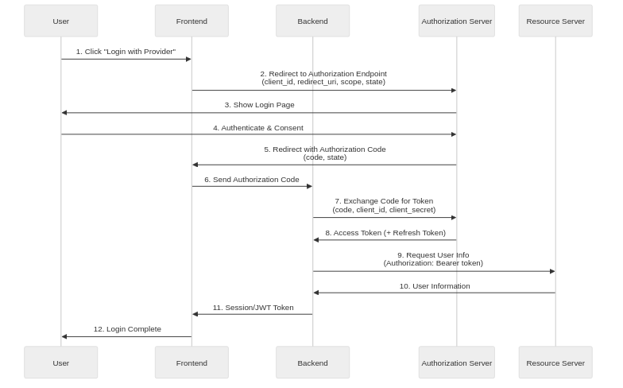

OAuth 2.0 is an authorization framework standardized as RFC 6749 by the IETF (Internet Engineering Task Force) in 2012. It allows users to grant third-party applications limited access to their resources without exposing their credentials (passwords). It is now widely used for social login and API authorization across major services such as Google, Facebook, GitHub, and Twitter.

## The Origins of OAuth

> **The Problem OAuth Solves**
>
> Before OAuth, users had to directly provide their usernames and passwords to third-party applications, which created serious security risks. Users had no way to know which applications would safely manage their credentials, nor could they granularly control access permissions or revoke them at any time.

OAuth 1.0 was the first open authorization standard created in 2007 through collaboration between Twitter and several other companies, but it failed to achieve widespread adoption due to implementation complexity and demanding cryptographic signature requirements. To address these issues, OAuth 2.0 was released in 2012, abandoning backward compatibility with the previous version in favor of simplicity and flexibility, and significantly reducing client implementation complexity by relying on transport layer security through HTTPS.

## Core Components of OAuth 2.0

### Role Definitions

OAuth 2.0 defines four roles, and understanding how they interact during the authorization process makes the overall protocol much easier to follow.

| Role | Description | Example |
|------|-------------|---------|
| **Resource Owner** | An entity capable of granting access to protected resources, typically the end user | A user with a GitHub account |
| **Client** | An application accessing protected resources on behalf of the Resource Owner | A web application supporting GitHub login |
| **Resource Server** | A server hosting protected resources that accepts requests using access tokens | GitHub API server |
| **Authorization Server** | A server that authenticates the Resource Owner and issues access tokens after obtaining authorization | GitHub OAuth server |

### Distinguishing Authentication and Authorization

> **OAuth 2.0 is an Authorization Protocol**
>
> OAuth 2.0 is fundamentally an authorization protocol, not an authentication protocol. Authentication is the process of confirming "who you are," while authorization is the process of determining "what you can do." OpenID Connect (OIDC) is what adds an authentication layer on top of OAuth 2.0.

## Grant Types

OAuth 2.0 defines several Grant Types to support different use cases, with each type designed for specific environments and security requirements.

| Grant Type | Use Environment | Characteristics |
|------------|-----------------|-----------------|
| **Authorization Code** | Server-side web applications | Most secure, supports Refresh Token |
| **Authorization Code + PKCE** | SPA, mobile apps | Secure authorization without Client Secret |
| **Client Credentials** | Server-to-server communication | Client self-authentication without user involvement |
| **Device Code** | Smart TVs, IoT devices | For devices with limited input capabilities |
| **Refresh Token** | All environments | For access token renewal |

The Implicit Grant and Resource Owner Password Credentials Grant have been officially marked as deprecated in the OAuth 2.1 draft specification and should not be used in new implementations for security reasons.

## Detailed Analysis of Authorization Code Flow

Authorization Code Flow is the most secure OAuth 2.0 flow for confidential clients and is commonly used in web applications with a backend.

### Step 1: Application Registration

Before starting the OAuth flow, developers must register their client application with the Authorization Server, providing the application name, homepage URL, and Redirect URI (Authorization Callback URL). Upon completion, the Authorization Server issues a Client ID and Client Secret. The Client ID is a public identifier that can safely appear in frontend code, but the Client Secret must never be exposed in client-side code and should be managed only on the backend server.

### Step 2: Authorization Request

When a user clicks the "Social Login" button, the client redirects the user to the Authorization Server's authorization endpoint, including several important parameters in the request. The `client_id` is the client identifier issued during registration, `redirect_uri` is the URI to which the authorization server redirects the user after authorization, and `response_type=code` indicates that an Authorization Code is being requested. The `scope` specifies the requested permissions, and `state` is a random string used to prevent CSRF attacks and must be returned unchanged in the authorization response.

### Step 3: User Authentication and Consent

The Authorization Server requests the user to log in (if not already logged in), displays the permissions (scope) requested by the client, and asks for consent. When the user consents, the Authorization Server generates an Authorization Code and redirects the user to the specified `redirect_uri` with the authorization code and state value included as URL query parameters.

### Step 4: Token Exchange

The client's backend server submits the received authorization code to the Authorization Server's token endpoint to exchange it for an access token. This request must be performed on the backend because it includes the Client Secret, and the authorization code is single-use with a very short validity period (typically 1-10 minutes), which makes interception much less useful to an attacker.

### Step 5: Token Response

Upon successful validation, the Authorization Server issues an access token, typically returning the token type (Bearer), expiration time (expires_in), permission scope (scope), and optionally a Refresh Token.

### Step 6: Resource Access

The client includes the issued access token as a Bearer token in the HTTP Authorization header to call the Resource Server's API, and the Resource Server validates the token before returning the requested resource.

## PKCE (Proof Key for Code Exchange)

> **What is PKCE?**
>
> PKCE (Proof Key for Code Exchange, pronounced "pixie") is an OAuth 2.0 extension defined in RFC 7636, originally designed to prevent authorization code interception attacks in mobile apps, but now recommended for all public clients including SPAs. In OAuth 2.1, PKCE usage will be mandatory for all client types.

PKCE uses a dynamically generated secret to link the authorization request to the token request. The client first generates a high-entropy random string called the `code_verifier`, hashes it with SHA-256, Base64URL encodes it to create the `code_challenge`, and includes it in the authorization request. During the token request, the original `code_verifier` is sent along, and the Authorization Server hashes it to compare it with the stored `code_challenge`. This mechanism helps prevent attackers who intercept the authorization code from obtaining tokens.

## Role Distribution Between Frontend and Backend

### Frontend Responsibilities

The frontend is responsible for redirecting users to the Authorization Server's authorization page, generating and storing a state value for CSRF prevention, and, when using PKCE, generating and securely storing the `code_verifier`. After authorization is complete, it extracts the authorization code from the callback URL and passes it to the backend, while also verifying the state value to confirm response integrity. The frontend also needs to store any access tokens or session information received from the backend in an appropriate way.

### Backend Responsibilities

The backend handles the most security-sensitive operations in the OAuth flow, securely storing the Client Secret and never exposing it to clients. It submits the authorization code received from the frontend to the Authorization Server's token endpoint to exchange it for an access token, then uses the issued token to query user information from the Resource Server. Based on the retrieved information, it creates user accounts in its own system or links to existing accounts, and issues its own authentication session or JWT, which it then sends back to the client.

## Security Considerations

### Essential Security Measures

Several security measures should always be followed when implementing OAuth 2.0. All communication must occur over HTTPS; using HTTP allows tokens and authorization codes to be intercepted on the network. The state parameter must be a cryptographically secure random value, stored in the session and verified on callback to prevent CSRF attacks. The redirect_uri must exactly match the pre-registered value, and wildcards should not be allowed to prevent open redirect vulnerabilities.

### Token Security

Access tokens should be set with short validity periods (typically 15 minutes to 1 hour) to minimize damage even if tokens are stolen, with Refresh Tokens used to obtain new access tokens. Refresh Tokens should be stored in cookies with HttpOnly, Secure, and SameSite attributes set, or kept in backend sessions; storing them in browser localStorage or sessionStorage makes them vulnerable to XSS attacks.

### Principle of Minimum Scope

Requesting only the minimum permissions required by the application is a fundamental security principle. Excessive permission requests not only reduce user consent rates but can also lead to greater damage if tokens are stolen, so only necessary scopes should be selectively requested.

## OAuth 2.0 vs OpenID Connect

| Aspect | OAuth 2.0 | OpenID Connect |
|--------|-----------|----------------|
| **Purpose** | Authorization | Authentication + Authorization |
| **Tokens** | Access Token, Refresh Token | Adds ID Token |
| **User Information** | Requires separate API call | Included in ID Token or UserInfo endpoint |
| **Standardization** | User info format undefined | Defines standard claims (sub, email, name, etc.) |

When implementing social login, most providers support OpenID Connect alongside OAuth 2.0, so using OIDC's ID Token is a more standardized approach when user authentication is required.

## Conclusion

OAuth 2.0 is the de facto standard for handling third-party authorization in modern web and mobile applications, and understanding it correctly has a direct impact on service security. Authorization Code Flow is the most secure flow, but it is more complex to implement, and adding PKCE allows it to be used safely even in public clients. Clearly separating frontend and backend responsibilities, securely managing Client Secrets and tokens, and following current security best practices are the keys to a safe OAuth implementation.
