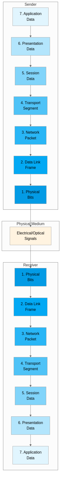
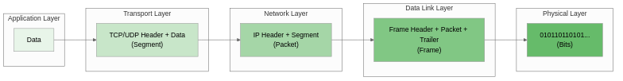

## 개요

네트워크 통신은 복잡한 과정을 거쳐 이루어지며, 이 과정을 체계적으로 이해하기 위해서는 표준화된 참조 모델이 필요하다. OSI(Open Systems Interconnection) 7계층 모델은 국제표준화기구(ISO)가 1984년에 발표한 네트워크 통신 표준으로, 서로 다른 시스템 간의 통신을 7개의 계층으로 나누어 설명하며 각 계층이 독립적으로 동작하면서도 상호 협력하여 데이터를 전송하는 방식을 정의하고, 이 모델은 네트워크 엔지니어와 소프트웨어 개발자가 복잡한 통신 과정을 이해하고 문제를 진단하는 데 있어 핵심적인 개념적 프레임워크 역할을 수행한다.

> **OSI 7계층 모델이란?**
>
> OSI 7계층 모델은 네트워크 통신 과정을 물리 계층부터 응용 계층까지 7개의 추상화된 계층으로 나눈 참조 모델로, 1970년대 후반 네트워크 장비 제조사마다 독자적인 프로토콜을 사용하여 상호 운용성이 부족했던 문제를 해결하기 위해 ISO에서 개발했으며, 현재는 실제 구현보다는 네트워크 개념을 이해하고 문제를 진단하는 데 사용되는 참조 모델로 활용된다.

## OSI 모델의 탄생 배경

1970년대와 1980년대 초반에는 IBM의 SNA(Systems Network Architecture), DEC의 DECnet, Xerox의 XNS(Xerox Network Systems) 등 각 벤더가 독자적인 네트워크 아키텍처를 사용했으며, 이로 인해 서로 다른 제조사의 장비 간 통신이 불가능하거나 매우 어려웠고, 기업들은 한 번 특정 벤더의 장비를 도입하면 그 벤더의 생태계에 종속되는 벤더 락인(Vendor Lock-in) 문제에 직면했다. ISO는 이러한 상호 운용성 문제를 해결하기 위해 1977년부터 개방형 시스템 상호 연결을 위한 표준 개발을 시작했고, 7년간의 개발 과정을 거쳐 1984년에 OSI 모델을 국제 표준(ISO 7498)으로 공식 발표했다.

OSI 모델의 핵심 설계 원칙은 각 계층이 명확히 정의된 기능을 수행하고 상위 계층에 서비스를 제공하며 계층 간 인터페이스를 통해 독립적으로 발전할 수 있도록 하는 것으로, 이를 통해 특정 계층의 프로토콜이나 기술이 변경되어도 다른 계층에 영향을 주지 않는 모듈화된 구조를 실현했으며, 이러한 계층화(Layering) 개념은 현대 소프트웨어 아키텍처에서도 널리 사용되는 설계 패턴의 기초가 되었다.

## OSI 7계층 구조 개요

다음 다이어그램은 OSI 7계층 모델에서 데이터가 송신자에서 수신자로 전달되는 과정을 보여준다.

## 7계층 - 응용 계층(Application Layer)

응용 계층은 OSI 모델의 최상위 계층으로 사용자와 가장 가까운 계층이며, 네트워크 서비스를 실제로 사용하는 응용 프로그램이 동작하는 영역으로, 사용자가 웹 브라우저, 이메일 클라이언트, 파일 전송 프로그램 등을 통해 네트워크 자원에 접근할 때 이 계층의 프로토콜들이 동작한다. 이 계층은 사용자 인터페이스를 제공하고 네트워크 자원에 접근하는 방법을 정의하며, HTTP, FTP, SMTP, DNS, SSH, SNMP 등의 프로토콜이 이 계층에서 동작하고, 응용 계층 프로토콜은 특정 애플리케이션의 요구사항에 맞게 설계되어 각각 고유한 메시지 형식과 통신 규칙을 가진다.

응용 계층의 주요 기능은 파일 전송, 전자 메일, 원격 접속, 디렉터리 서비스, 네트워크 관리 등 사용자가 직접 사용하는 네트워크 응용 서비스를 제공하는 것으로, 웹 브라우저가 HTTP 프로토콜을 사용하여 웹 서버와 통신하거나, 이메일 클라이언트가 SMTP와 IMAP을 사용하여 메일을 송수신하거나, 네트워크 관리자가 SNMP를 통해 네트워크 장비를 모니터링하는 것이 대표적인 예이며, 이 계층에서 동작하는 프로토콜들은 각각의 사용 목적에 최적화되어 설계되었다.

**주요 프로토콜:**

- **HTTP/HTTPS**: 웹 페이지 전송을 위한 프로토콜로, 클라이언트-서버 모델을 기반으로 요청(Request)과 응답(Response)을 주고받으며 월드 와이드 웹의 기반 기술이고, HTTPS는 TLS/SSL을 통해 암호화된 HTTP 통신을 제공한다
- **FTP**: 파일 전송 프로토콜로, 제어 연결(포트 21)과 데이터 연결(포트 20)을 분리하여 파일을 업로드하거나 다운로드하며, Active 모드와 Passive 모드 두 가지 전송 방식을 지원한다
- **SMTP/IMAP/POP3**: 전자 메일 전송 및 수신을 위한 프로토콜로, SMTP(포트 25, 587)는 메일 발송에 사용되고 IMAP(포트 143)은 서버에 메일을 보관하면서 동기화하며 POP3(포트 110)는 메일을 로컬에 다운로드하는 방식으로 동작한다
- **DNS**: 도메인 이름을 IP 주소로 변환하는 분산 데이터베이스 시스템으로, 계층적 구조(루트 → TLD → 권한 있는 네임서버)를 통해 전 세계적으로 도메인 이름을 관리하며 인터넷의 전화번호부 역할을 수행한다
- **SSH**: 안전한 원격 접속을 위한 암호화 프로토콜로, 1995년 Tatu Ylönen이 텔넷의 보안 취약점(평문 전송)을 해결하기 위해 개발했으며, 공개키 기반 인증과 대칭키 기반 세션 암호화를 결합하여 안전한 통신 채널을 제공한다

## 6계층 - 표현 계층(Presentation Layer)

표현 계층은 응용 계층과 세션 계층 사이에서 데이터의 표현 방식을 변환하고 조정하는 역할을 담당하며, 서로 다른 시스템 간에 데이터를 교환할 때 데이터 형식의 차이를 해결하는 번역기 역할을 수행하고, 이 계층 덕분에 이기종 시스템 간에도 데이터를 올바르게 해석할 수 있다. 이 계층에서는 데이터 인코딩과 디코딩, 암호화와 복호화, 압축과 해제 등의 작업이 이루어지며, 이러한 기능들은 데이터의 의미를 보존하면서 전송 효율성과 보안성을 높이는 데 기여한다.

표현 계층이 필요한 이유는 서로 다른 컴퓨터 시스템이 내부적으로 데이터를 표현하는 방식이 다를 수 있기 때문으로, 예를 들어 인텔 x86 프로세서는 리틀 엔디안(Little Endian) 방식으로 바이트를 저장하고 일부 네트워크 프로토콜은 빅 엔디안(Big Endian) 방식을 사용하므로 이러한 바이트 순서의 차이를 변환해야 하며, 또한 메인프레임에서 사용되던 EBCDIC와 현대 시스템에서 사용하는 ASCII/UTF-8 같은 문자 인코딩 방식의 차이도 이 계층에서 처리한다.

**주요 기능:**

- **데이터 변환**: ASCII, EBCDIC, UTF-8, UTF-16 등 서로 다른 문자 인코딩 간의 변환을 수행하여 시스템 간 호환성을 보장하며, JSON, XML, ASN.1 같은 데이터 직렬화 형식 간의 변환도 포함한다
- **암호화/복호화**: SSL/TLS 프로토콜을 통해 데이터를 암호화하여 전송 중 정보 유출과 변조를 방지하고 수신 측에서 복호화하며, AES, RSA, ChaCha20 등 다양한 암호화 알고리즘이 사용된다
- **압축/해제**: gzip, deflate, Brotli 등의 알고리즘을 사용하여 전송 효율을 높이기 위해 데이터를 압축하고 수신 측에서 원래 형태로 복원한다
- **멀티미디어 형식 처리**: JPEG, PNG, GIF, WebP 등 이미지 형식과 MP3, AAC, FLAC 등 오디오 형식, H.264, H.265, VP9 등 비디오 코덱을 처리한다

## 5계층 - 세션 계층(Session Layer)

세션 계층은 두 시스템 간의 대화(세션)를 설정하고 관리하며 종료하는 역할을 담당하는 계층으로, 응용 프로그램 간의 논리적 연결을 제어하고 데이터 교환의 동기화를 책임지며, 통신하는 양측이 서로를 인식하고 대화를 유지할 수 있도록 한다. 이 계층은 전이중(Full-duplex, 양방향 동시 통신) 또는 반이중(Half-duplex, 교대 통신) 통신 방식을 결정하고, 통신 장애 발생 시 복구를 위한 체크포인트를 관리하며, 세션의 시작과 종료를 관장한다.

세션 계층의 중요한 기능 중 하나는 동기화 포인트(Synchronization Point)를 설정하는 것으로, 대용량 파일 전송 중 네트워크 연결이 끊어졌을 때 처음부터 다시 전송하지 않고 마지막 체크포인트부터 재전송할 수 있도록 하여 네트워크 자원을 효율적으로 사용하고 사용자 경험을 개선한다. 또한 토큰 관리를 통해 어느 쪽에서 데이터를 전송할 수 있는지를 제어하여 충돌을 방지하며, 이는 양방향 통신에서 데이터 무결성을 유지하는 데 중요한 역할을 한다.

**주요 기능:**

- **세션 설정 및 종료**: 통신 세션의 시작과 끝을 관리하며, 사용자 인증, 권한 부여, 세션 ID 할당 등의 과정을 포함할 수 있다
- **세션 유지 관리**: 연결 상태를 모니터링하고 유휴 세션의 타임아웃을 처리하며, Keep-alive 메시지를 통해 연결 유지 여부를 확인한다
- **동기화 및 복구**: 데이터 전송 중 장애 발생 시 체크포인트를 활용하여 중단된 지점부터 복구하며, 이를 통해 대용량 데이터 전송의 안정성을 보장한다
- **대화 제어**: 양방향 통신에서 데이터 흐름의 방향을 제어하고, 동시 전송으로 인한 충돌을 방지한다

**실무 활용 예:**

- 데이터베이스 연결 풀(Connection Pool)에서 세션 관리 및 트랜잭션 처리
- 원격 프로시저 호출(RPC)과 gRPC에서 세션 상태 관리
- 웹 서버에서 사용자 로그인 세션 유지 및 쿠키/토큰 기반 세션 관리
- 화상 회의 시스템에서 참가자 간 세션 설정 및 동기화

## 4계층 - 전송 계층(Transport Layer)

전송 계층은 종단 간(End-to-End) 데이터 전송을 담당하는 계층으로, 상위 계층에서 내려온 데이터를 세그먼트(Segment)로 분할하고 수신 측에서 이를 재조립하며, 신뢰성 있는 데이터 전송을 보장하거나 빠른 전송을 우선시하는 등의 전송 품질(QoS)을 관리하고, 이 계층은 네트워크 계층이 제공하는 비신뢰성 통신 위에 신뢰성 있는 통신 채널을 구축하는 역할을 수행한다. 이 계층은 포트 번호(0~65535)를 사용하여 동일한 호스트 내에서 실행되는 여러 응용 프로그램을 구분하며, 잘 알려진 포트(0~1023), 등록된 포트(1024~49151), 동적/사설 포트(49152~65535)로 범위가 나뉜다.

전송 계층의 가장 대표적인 프로토콜은 TCP(Transmission Control Protocol)와 UDP(User Datagram Protocol)로, TCP는 1981년 RFC 793에서 정의된 연결 지향적이고 신뢰성 있는 데이터 전송 프로토콜로서 흐름 제어와 혼잡 제어 기능을 포함하며, UDP는 1980년 RFC 768에서 정의된 비연결형 프로토콜로 신뢰성을 보장하지 않지만 오버헤드가 적어 실시간 스트리밍, 온라인 게임, VoIP, DNS 쿼리와 같이 속도가 중요하고 일부 데이터 손실을 허용할 수 있는 응용 프로그램에 적합하다.

**TCP의 주요 특징:**

- **3-way Handshake**: SYN → SYN-ACK → ACK 패킷을 교환하여 연결을 설정하고, FIN → FIN-ACK → ACK 또는 RST 패킷으로 연결을 종료하며, 이 과정을 통해 양측이 통신 준비가 되었음을 확인한다
- **순서 보장**: 32비트 시퀀스 번호를 사용하여 패킷의 순서를 추적하고 수신 측에서 올바른 순서로 재조립하며, 중복 패킷을 감지하고 제거한다
- **흐름 제어**: 슬라이딩 윈도우(Sliding Window) 방식으로 수신자가 처리할 수 있는 만큼만 데이터를 전송하여 수신자 버퍼 오버플로우를 방지한다
- **혼잡 제어**: Slow Start, Congestion Avoidance, Fast Retransmit, Fast Recovery 등의 알고리즘으로 네트워크 혼잡 상황을 감지하고 전송 속도를 조절하여 네트워크 붕괴를 방지한다
- **오류 검출 및 재전송**: 16비트 체크섬으로 오류를 검출하고, ACK를 받지 못한 세그먼트는 타임아웃 후 재전송하며, Selective ACK(SACK)를 통해 선택적 재전송도 지원한다

**UDP의 주요 특징:**

- **비연결형**: 연결 설정 과정(핸드셰이크) 없이 바로 데이터를 전송하여 지연 시간이 적고, 연결 상태를 유지하지 않아 서버 자원 소모가 적다
- **최선형 전송(Best-effort)**: 전송 실패 시 재전송하지 않으며 순서도 보장하지 않고, 데이터그램이 도착하지 않거나 중복되거나 순서가 바뀌어도 상위 계층에서 처리해야 한다
- **낮은 오버헤드**: TCP 헤더(20~60바이트)에 비해 UDP 헤더(8바이트)가 작아 효율적이며, 헤더에는 소스 포트, 목적지 포트, 길이, 체크섬만 포함된다
- **브로드캐스트/멀티캐스트 지원**: 하나의 패킷을 여러 수신자에게 동시에 전송할 수 있어 IPTV, 스트리밍 서비스, 서비스 디스커버리 등에 활용된다

## 3계층 - 네트워크 계층(Network Layer)

네트워크 계층은 서로 다른 네트워크 간의 통신을 가능하게 하는 계층으로, 패킷(Packet)의 경로를 결정하는 라우팅 기능을 핵심으로 수행하며, 논리적 주소(IP 주소)를 사용하여 출발지에서 목적지까지 여러 네트워크를 거쳐 데이터를 전달하고, 이 계층이 없다면 같은 로컬 네트워크 내에서만 통신이 가능하고 인터넷과 같은 글로벌 네트워크는 존재할 수 없다. 이 계층에서 동작하는 대표적인 장비가 라우터이며, 라우터는 라우팅 테이블을 참조하여 패킷을 다음 홉(Next Hop)으로 전달하고, 정적 라우팅과 동적 라우팅 프로토콜을 통해 최적의 경로를 결정한다.

네트워크 계층의 핵심 프로토콜인 IP(Internet Protocol)는 현재 IPv4와 IPv6 두 가지 버전이 사용되고 있으며, IPv4는 1981년 RFC 791에서 정의된 32비트 주소 체계로 약 43억 개(2^32)의 주소를 제공하고 IPv6는 1998년 RFC 2460에서 정의된 128비트 주소 체계로 약 3.4×10^38개의 주소를 제공하여 사실상 무한에 가까운 주소 공간을 확보했다. IP는 비연결형이고 비신뢰성 프로토콜로 설계되어 패킷이 손실되거나 순서가 뒤바뀌어도 이를 처리하지 않으며, 신뢰성 보장은 상위 계층(전송 계층)의 TCP가 담당한다.

**주요 프로토콜:**

- **IP(Internet Protocol)**: 패킷을 출발지에서 목적지로 전달하는 핵심 프로토콜로, TTL(Time To Live) 필드를 사용하여 패킷의 수명을 제한하고(라우터를 통과할 때마다 1씩 감소) 무한 루프를 방지하며, 단편화(Fragmentation)를 통해 MTU가 다른 네트워크를 통과할 수 있다
- **ICMP(Internet Control Message Protocol)**: 네트워크 오류를 보고하고 진단하는 프로토콜로, ping 명령(Echo Request/Reply)과 traceroute 명령(TTL 초과 메시지)이 이 프로토콜을 사용하며, 목적지 도달 불가, 리다이렉트 등의 제어 메시지를 전달한다
- **ARP(Address Resolution Protocol)**: IP 주소를 물리적 MAC 주소로 변환하는 프로토콜로, 네트워크 계층과 데이터 링크 계층 사이에서 동작하며, ARP 캐시를 통해 변환 결과를 저장하고 재사용한다
- **라우팅 프로토콜**: 내부 게이트웨이 프로토콜(IGP)인 RIP(거리 벡터), OSPF(링크 상태), EIGRP(하이브리드)와 외부 게이트웨이 프로토콜(EGP)인 BGP가 있으며, 라우터 간에 경로 정보를 교환하여 최적의 경로를 동적으로 결정한다

## 2계층 - 데이터 링크 계층(Data Link Layer)

데이터 링크 계층은 물리 계층을 통해 전송된 비트 스트림을 의미 있는 데이터 단위인 프레임(Frame)으로 구성하고, 인접한 노드 간의 신뢰성 있는 데이터 전송을 담당하는 계층으로, 네트워크 계층이 논리적 주소(IP)를 사용하는 반면 이 계층은 물리적 주소(MAC 주소)를 사용하여 같은 네트워크 세그먼트 내의 장치를 식별하며 오류 검출 및 흐름 제어 기능을 제공한다. 스위치와 브리지가 이 계층에서 동작하는 대표적인 장비로, 스위치는 MAC 주소 테이블을 학습하여 프레임을 특정 포트로만 전달함으로써 충돌 도메인을 분리하고 네트워크 효율성을 높인다.

데이터 링크 계층은 IEEE에 의해 LLC(Logical Link Control, IEEE 802.2)와 MAC(Media Access Control) 두 개의 하위 계층으로 나뉘며, LLC 하위 계층은 네트워크 계층과의 인터페이스를 담당하고 흐름 제어와 오류 제어를 수행하며 여러 네트워크 프로토콜이 같은 물리적 매체를 공유할 수 있도록 하고, MAC 하위 계층은 물리 계층에 접근하는 방법을 정의하고 물리적 주소 지정을 담당하며 매체 유형에 따라 IEEE 802.3(이더넷), IEEE 802.11(Wi-Fi) 등 다양한 표준이 정의되어 있다.

**주요 특징:**

- **프레이밍(Framing)**: 비트 스트림을 프레임 단위로 구분하여 시작과 끝을 식별하며, 이더넷의 경우 프리앰블(7바이트)과 SFD(Start Frame Delimiter, 1바이트)로 프레임 시작을 표시한다
- **물리적 주소 지정**: 48비트(6바이트) MAC 주소를 사용하여 네트워크 인터페이스를 고유하게 식별하며, 앞 24비트는 OUI(제조사 식별자), 뒤 24비트는 장치 고유 번호다
- **오류 검출**: CRC-32(Cyclic Redundancy Check)를 사용하여 전송 중 발생한 비트 오류를 검출하며, 오류가 감지된 프레임은 폐기한다(오류 수정은 상위 계층에서 재전송으로 처리)
- **매체 접근 제어**: 유선 이더넷은 CSMA/CD(Carrier Sense Multiple Access with Collision Detection)를, 무선 Wi-Fi는 CSMA/CA(Collision Avoidance)를 사용하여 공유 매체에 대한 접근을 조정한다

**주요 프로토콜:**

- **Ethernet(이더넷)**: 1973년 Xerox PARC의 Robert Metcalfe가 개발한 가장 널리 사용되는 유선 LAN 기술로, IEEE 802.3 표준에 정의되어 있으며, 10Mbps(10BASE-T)부터 400Gbps(400GBASE)까지 다양한 속도를 지원한다
- **Wi-Fi**: IEEE 802.11 표준에 정의된 무선 LAN 기술로, 802.11a/b/g/n/ac/ax(Wi-Fi 6)/be(Wi-Fi 7) 등 여러 세대가 존재하며, 2.4GHz와 5GHz, 6GHz 주파수 대역을 사용한다
- **PPP(Point-to-Point Protocol)**: 두 노드 간의 직접 연결을 위한 프로토콜로, 인증(PAP, CHAP), 암호화, IP 주소 할당 기능을 제공하며 전화 접속이나 VPN에서 사용된다

## 1계층 - 물리 계층(Physical Layer)

물리 계층은 OSI 모델의 최하위 계층으로, 실제 데이터를 전기적 신호(구리선), 광 신호(광섬유), 또는 전자기파(무선)로 변환하여 물리적 매체를 통해 전송하는 역할을 담당하며, 이 계층은 데이터의 의미나 구조를 이해하지 않고 오직 비트(0과 1)를 물리적 신호로 변환하는 데만 집중한다. 이 계층은 케이블, 커넥터, 전압 레벨, 신호 타이밍, 데이터 전송률, 핀 배치 등 하드웨어적인 특성을 정의하며, 이러한 표준화를 통해 서로 다른 제조사의 장비가 물리적으로 연결되어 통신할 수 있다.

물리 계층에서 정의하는 요소에는 전기적 특성(전압 레벨, 신호 지속 시간, 임피던스), 기계적 특성(커넥터 모양, 핀 수, 핀 배치), 기능적 특성(각 핀의 기능 정의), 절차적 특성(비트 전송 절차, 동기화 방법)이 포함되며, 이러한 네 가지 특성을 표준화함으로써 다양한 제조사의 네트워크 장비가 물리적으로 상호 연결될 수 있다.

**물리적 전송 매체:**

- **트위스트 페어 케이블(Twisted Pair)**: 가장 일반적인 유선 매체로, UTP(Unshielded Twisted Pair, 비차폐)와 STP(Shielded Twisted Pair, 차폐) 유형이 있으며, Cat5e(1Gbps), Cat6(10Gbps/55m), Cat6a(10Gbps/100m), Cat7(10Gbps/차폐), Cat8(25-40Gbps) 등 카테고리에 따라 전송 속도와 거리가 다르다
- **동축 케이블(Coaxial Cable)**: 초기 이더넷(10BASE5, 10BASE2)과 케이블 TV, CATV 인터넷에 사용되며, 중심 도체를 절연체와 차폐층이 감싸는 구조로 외부 전자기 간섭에 강하다
- **광섬유 케이블(Fiber Optic)**: 빛을 사용하여 데이터를 전송하며, 싱글모드(SM, 장거리/고속)와 멀티모드(MM, 단거리/저가) 두 종류가 있고, 전자기 간섭이 없고 도청이 어려우며 최대 100km 이상의 장거리 고속 전송에 적합하다
- **무선 주파수(Radio Frequency)**: Wi-Fi(2.4/5/6GHz), 블루투스(2.4GHz), 셀룰러 통신(700MHz~6GHz, mmWave), 위성 통신에 사용되며, 물리적 케이블 없이 전자기파를 통해 데이터를 전송한다

## 데이터 캡슐화와 역캡슐화

OSI 모델에서 데이터가 송신 측에서 수신 측으로 전달될 때 각 계층을 통과하면서 캡슐화(Encapsulation)와 역캡슐화(De-encapsulation) 과정을 거치며, 이 과정은 편지를 봉투에 넣고 주소를 적는 것과 유사하게 각 계층이 필요한 제어 정보를 헤더로 추가하는 방식으로 이루어진다. 송신 측에서 데이터는 응용 계층에서 시작하여 아래 계층으로 내려가면서 각 계층의 헤더(경우에 따라 트레일러)가 추가되고, 수신 측에서는 물리 계층에서 시작하여 위 계층으로 올라가면서 각 계층의 헤더가 제거되어 최종적으로 원본 데이터만 응용 계층에 전달된다.

각 계층의 데이터 단위는 고유한 이름을 가지며, 응용/표현/세션 계층에서는 데이터(Data), 전송 계층에서는 세그먼트(Segment, TCP) 또는 데이터그램(Datagram, UDP), 네트워크 계층에서는 패킷(Packet), 데이터 링크 계층에서는 프레임(Frame), 물리 계층에서는 비트(Bit)라고 부른다. 이러한 캡슐화 과정을 통해 각 계층의 정보가 독립적으로 처리되고 전달되며, 수신 측의 각 계층은 자신에게 해당하는 헤더만 확인하고 처리한 후 상위 계층으로 전달한다.

## OSI 모델과 TCP/IP 모델 비교

실제 인터넷은 OSI 7계층 모델이 아닌 TCP/IP 4계층 모델을 기반으로 동작하며, OSI 모델이 1984년 ISO에서 발표한 이론적이고 개념적인 참조 모델인 반면 TCP/IP 모델은 1970년대 DARPA(미 국방고등연구계획국)에서 개발한 ARPANET을 기반으로 실제 인터넷 프로토콜의 구현을 반영한 실용적인 모델이다. TCP/IP 모델은 응용 계층(Application), 전송 계층(Transport), 인터넷 계층(Internet), 네트워크 접근 계층(Network Access)의 4개 계층으로 구성되며, OSI 모델의 5, 6, 7계층이 TCP/IP의 응용 계층으로 통합되고 1, 2계층이 네트워크 접근 계층으로 통합된다.

OSI 모델이 실무에서 여전히 중요한 이유는 네트워크 문제를 진단하고 해결할 때 계층별로 문제 영역을 좁혀나갈 수 있기 때문으로, 예를 들어 연결 문제가 발생했을 때 케이블 연결과 LED 상태(1계층), MAC 주소 해석과 스위치 포트(2계층), IP 주소와 라우팅 테이블(3계층), 포트 연결과 방화벽 규칙(4계층), 응용 프로그램 설정과 로그(7계층) 순으로 점검하여 문제를 체계적으로 파악할 수 있다.

| OSI 계층       | TCP/IP 계층   | 주요 프로토콜             | PDU     |
| -------------- | ------------- | ------------------------- | ------- |
| 7. 응용        | 응용          | HTTP, FTP, DNS, SMTP, SSH | 데이터  |
| 6. 표현        | 응용          | SSL/TLS, JPEG, ASCII      | 데이터  |
| 5. 세션        | 응용          | NetBIOS, RPC, SIP         | 데이터  |
| 4. 전송        | 전송          | TCP, UDP, SCTP            | 세그먼트 |
| 3. 네트워크    | 인터넷        | IP, ICMP, ARP, OSPF       | 패킷    |
| 2. 데이터 링크 | 네트워크 접근 | Ethernet, Wi-Fi, PPP      | 프레임  |
| 1. 물리        | 네트워크 접근 | 케이블, 허브, 리피터      | 비트    |

## 실무에서의 OSI 모델 활용

OSI 모델은 네트워크 문제 해결(트러블슈팅)에서 가장 빛을 발하며, 계층별로 체계적인 접근이 가능하기 때문에 복잡한 네트워크 문제의 원인을 신속하게 파악할 수 있다.

**계층별 트러블슈팅 체크리스트:**

1. **물리 계층(L1)**: 케이블이 제대로 연결되어 있는가? 링크 LED가 켜져 있는가? 케이블 단선이나 손상은 없는가?
2. **데이터 링크 계층(L2)**: `arp -a` 명령으로 MAC 주소가 학습되었는가? 스위치 포트가 활성화되어 있는가? VLAN 설정이 올바른가?
3. **네트워크 계층(L3)**: `ping` 명령으로 목적지에 도달 가능한가? `traceroute`로 어디서 패킷이 멈추는가? 라우팅 테이블이 올바른가?
4. **전송 계층(L4)**: `netstat -an` 또는 `ss -tuln`으로 포트가 리스닝 중인가? 방화벽이 해당 포트를 차단하고 있지 않는가?
5. **응용 계층(L7)**: 애플리케이션 로그에 오류가 있는가? DNS 해석이 정상적인가? 인증서가 유효한가?

## 마치며

이번 글에서는 OSI 7계층 모델의 탄생 배경부터 각 계층의 역할과 주요 프로토콜, TCP/IP 모델과의 비교, 데이터 캡슐화 과정, 그리고 실무에서의 활용까지 네트워크 통신의 표준 참조 모델을 상세히 살펴보았다. OSI 모델은 실제 인터넷 구현에는 직접 사용되지 않지만, 1984년 발표 이후 40년이 지난 지금까지도 네트워크 개념을 체계적으로 이해하고 문제를 진단하는 데 있어 핵심적인 프레임워크로 활용되고 있으며, 네트워크 엔지니어와 개발자가 반드시 이해해야 할 필수 지식으로 자리 잡았다.
