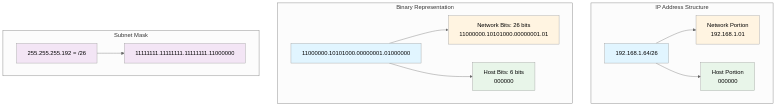
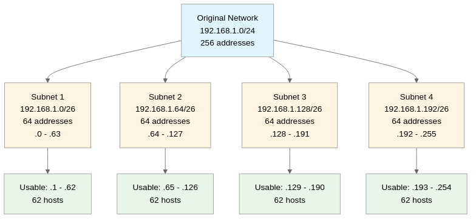

## Background and History of CIDR

CIDR (Classless Inter-Domain Routing) was officially introduced by the IETF in 1993 through RFC 1517, RFC 1518, and RFC 1519 to overcome the serious limitations of the existing class-based IP address allocation method, and later revised as RFC 2050 in 1998 to become the internet routing standard. From the late 1980s, as the internet grew rapidly, the existing classful addressing system faced two serious problems. First, Class C networks (254 hosts) were too small and Class B networks (65,534 hosts) were too large, not matching actual needs and wasting large amounts of IP addresses. Second, internet routing tables exploded, causing overload on router memory and processing performance. CIDR solved these problems by completely removing the class concept and introducing Variable Length Subnet Mask (VLSM) to allow precise adjustment of network sizes as needed, and enabled dramatic reduction in routing table size through route aggregation or supernetting techniques that consolidate multiple small networks into a single routing entry.

## CIDR Notation and Structure

CIDR uses prefix notation that displays the number of network bits with a slash ('/') symbol after the IP address. This clearly distinguishes the network portion from the host portion and concisely expresses the subnet mask. For example, 192.168.1.0/24 means the first 24 bits are the network portion and the remaining 8 bits (32 - 24 = 8) are the host portion, while 192.168.1.128/25 indicates the first 25 bits are the network portion and the remaining 7 bits are the host portion. Since IP addresses consist of 32 bits, CIDR prefixes can range from /0 to /32, where /0 means the entire internet (0.0.0.0/0, used for default routes) and /32 means a single host (host route, e.g., 192.168.1.1/32). Understanding CIDR notation becomes clearer when expressed in binary. For 192.168.1.64/26, the binary representation is 11000000.10101000.00000001.01000000, where the first 26 bits (11000000.10101000.00000001.01) are the network portion and the remaining 6 bits (000000) are the host portion. The subnet mask /26 is expressed as 11111111.11111111.11111111.11000000 (255.255.255.192), with network bits all set to 1 and host bits all set to 0.

## Relationship Between CIDR and Subnet Masks

CIDR prefixes correspond one-to-one with subnet masks. A subnet mask is a 32-bit value that distinguishes the network portion from the host portion in an IP address and is used to extract the network address through AND operations. Common CIDR prefix and subnet mask correspondences are as follows: /24 corresponds to subnet mask 255.255.255.0 (binary: 11111111.11111111.11111111.00000000), having 256 (2^8) addresses with 254 hosts allocatable; /25 is 255.255.255.128 (binary: 11111111.11111111.11111111.10000000) with 128 (2^7) addresses and 126 hosts; /26 is 255.255.255.192 (binary: 11111111.11111111.11111111.11000000) with 64 (2^6) addresses and 62 hosts; and /27 is 255.255.255.224 (binary: 11111111.11111111.11111111.11100000) with 32 (2^5) addresses and 30 hosts. In each network, the first address is the network address used to identify the network itself, and the last address is the broadcast address used to send messages to all hosts in the network, so they cannot be assigned to actual hosts. Therefore, the number of usable hosts is the total number of addresses minus 2.

## Network Size Calculation and Understanding

Network size according to CIDR prefix is calculated as powers of 2. When the number of host bits is n, the total number of addresses is 2^n and the number of usable hosts is 2^n - 2. For example, a /24 network has 8 host bits (32 - 24 = 8), so 2^8 = 256 addresses with 254 hosts allocatable; /25 has 7 host bits with 2^7 = 128 addresses and 126 hosts; /26 has 6 host bits with 2^6 = 64 addresses and 62 hosts; /27 has 5 host bits with 2^5 = 32 addresses and 30 hosts; /28 has 4 host bits with 2^4 = 16 addresses and 14 hosts; /29 has 3 host bits with 2^3 = 8 addresses and 6 hosts; and /30 has 2 host bits with 2^2 = 4 addresses and 2 hosts. A /30 network can only use 2 hosts and is primarily used for Point-to-Point connections between routers (e.g., dedicated lines connecting headquarters and branches, BGP peering between ISPs). RFC 3021 allows /31 networks to use both addresses as hosts without a broadcast address, limited to Point-to-Point links. /32 represents a single host and is used for host routes (exact paths to specific IP addresses) or loopback interface assignments.

## Understanding Subnetting

Subnetting is the process of dividing one large network into multiple smaller networks (subnets). It is implemented by increasing the CIDR prefix to expand the network portion and shrink the host portion, allowing logical network separation to reduce broadcast domains, enhance security, and efficiently manage IP addresses. For example, when subnetting a 192.168.1.0/24 network (256 addresses, 254 hosts) to /26, it divides into 4 subnets. The first subnet is 192.168.1.0/26 (address range: 192.168.1.0 ~ 192.168.1.63, network address: .0, broadcast: .63, usable: .1 ~ .62, 62 hosts), the second subnet is 192.168.1.64/26 (address range: 192.168.1.64 ~ 192.168.1.127, network address: .64, broadcast: .127, usable: .65 ~ .126, 62 hosts), the third subnet is 192.168.1.128/26 (address range: 192.168.1.128 ~ 192.168.1.191, network address: .128, broadcast: .191, usable: .129 ~ .190, 62 hosts), and the fourth subnet is 192.168.1.192/26 (address range: 192.168.1.192 ~ 192.168.1.255, network address: .192, broadcast: .255, usable: .193 ~ .254, 62 hosts). When performing subnetting, subnet boundaries must align on powers of 2. Since /26 subnet size is 64, they must start at 0, 64, 128, 192, and cannot start at arbitrary addresses (e.g., 50). To verify this, when converting the last octet to binary, all host bits must be 0.

## Supernetting and Route Aggregation

Supernetting is the opposite concept of subnetting, consolidating multiple small networks into one large network. It is implemented by decreasing the CIDR prefix to shrink the network portion and expand the host portion, playing an important role in reducing routing table size and decreasing router memory usage and path search time. For example, four consecutive /24 networks (192.168.0.0/24, 192.168.1.0/24, 192.168.2.0/24, 192.168.3.0/24) can be aggregated into one /22 network (192.168.0.0/22). This becomes clear when verified in binary: from 192.168.0.0 (11000000.10101000.00000000.00000000) to 192.168.3.255 (11000000.10101000.00000011.11111111), the first 22 bits (11000000.10101000.000000) are common, so it can be expressed as /22. Route aggregation is a core technology for preventing explosive growth of internet routing tables in ISPs and large organizations, widely used in BGP (Border Gateway Protocol) routing. It solved the problem of exponentially increasing routing tables in the early 1990s through CIDR and route aggregation, and remains essential for maintaining internet backbone router routing table sizes at manageable levels.

## CIDR and VLSM (Variable Length Subnet Mask)

VLSM is a technology that allows simultaneous use of different-sized subnets within a single network. It is one of the core functions of CIDR and can maximize IP address utilization. In classful addressing or Fixed Length Subnet Mask (FLSM), all subnets had to be the same size, but VLSM allows setting different subnet sizes according to actual host needs, minimizing IP address waste. For example, a 192.168.1.0/24 network can be divided with VLSM as follows: a server farm network requiring 100 hosts is allocated 192.168.1.0/25 (126 hosts available), an office network requiring 50 hosts is allocated 192.168.1.128/26 (62 hosts available), a DMZ network requiring 10 hosts is allocated 192.168.1.192/27 (30 hosts available), three Point-to-Point router links requiring 2 hosts each are allocated 192.168.1.224/30, 192.168.1.228/30, 192.168.1.232/30 (2 hosts each), and the remaining address space (192.168.1.236/30 ~ 192.168.1.252/30) can be reserved for future expansion. When applying VLSM, allocate larger subnets first and progressively allocate smaller subnets to prevent address space fragmentation, ensure subnet addresses don't overlap, and verify that routing protocols support VLSM. RIPv2, OSPF, EIGRP, IS-IS, and BGP support VLSM, but RIPv1 and IGRP do not.

## CIDR Block Calculation Method

The method to calculate the required CIDR block for a specific number of hosts is as follows: First, add 2 to the required number of hosts (reserved for network address and broadcast address). Next, find the smallest power of 2 that equals or exceeds this value (e.g., 50 hosts needed → 50 + 2 = 52 → 2^6 = 64). The exponent of that power becomes the number of host bits (6 bits). Finally, subtract the number of host bits from 32 to get the CIDR prefix (32 - 6 = /26). For concrete examples: if 10 hosts are needed, 10 + 2 = 12 and the smallest power of 2 above is 2^4 = 16, requiring 4 host bits, so CIDR is /28 (14 hosts usable); if 100 hosts are needed, 100 + 2 = 102 and the smallest power of 2 above is 2^7 = 128, requiring 7 host bits, so CIDR is /25 (126 hosts usable); if 500 hosts are needed, 500 + 2 = 502 and the smallest power of 2 above is 2^9 = 512, requiring 9 host bits, so CIDR is /23 (510 hosts usable); and for Point-to-Point links (router-to-router connections), only 2 hosts are needed, so use /30 (2 hosts) or /31 (RFC 3021, 2 hosts).

## Checking if an IP Address Belongs to a Specific CIDR Block

To check if an IP address belongs to a specific CIDR block, use AND operations. Convert the IP address and subnet mask to binary, perform an AND operation, and check if the resulting network address matches the CIDR block's network address. For example, to check if 192.168.1.75 belongs to the 192.168.1.64/26 block: first, convert 192.168.1.75 to binary: 11000000.10101000.00000001.01001011; the /26 subnet mask is 11111111.11111111.11111111.11000000 (255.255.255.192); performing the AND operation gives 11000000.10101000.00000001.01000000 = 192.168.1.64; since this matches the CIDR block's network address (192.168.1.64), 192.168.1.75 belongs to the 192.168.1.64/26 block. Conversely, checking if 192.168.1.200 belongs to the 192.168.1.64/26 block: 192.168.1.200 in binary is 11000000.10101000.00000001.11001000; AND operation with the /26 mask gives 11000000.10101000.00000001.11000000 = 192.168.1.192; since this differs from 192.168.1.64, 192.168.1.200 does not belong to the 192.168.1.64/26 block but instead belongs to the 192.168.1.192/26 block.

## Real-World Use Cases

### Enterprise Network Design

When a medium-sized company is allocated a 192.168.0.0/16 private IP block, CIDR and VLSM can be used to efficiently design the network as follows. Headquarters with 500 employees is allocated 192.168.0.0/23 (510 hosts), using the 192.168.0.1 ~ 192.168.1.254 range; Branch A with 100 employees is allocated 192.168.2.0/25 (126 hosts), using 192.168.2.1 ~ 192.168.2.126; Branch B with 50 employees is allocated 192.168.2.128/26 (62 hosts), using 192.168.2.129 ~ 192.168.2.190; Data center servers with 30 machines are allocated 192.168.3.0/27 (30 hosts), using 192.168.3.1 ~ 192.168.3.30; DMZ web servers with 10 machines are allocated 192.168.3.32/28 (14 hosts), using 192.168.3.33 ~ 192.168.3.46; Point-to-Point router links are allocated 192.168.4.0/30, 192.168.4.4/30, 192.168.4.8/30 (2 hosts each); and the remaining address space (192.168.4.12/30 ~ 192.168.255.252/30) is reserved for future expansion or new branch openings.

### Cloud Environment (AWS VPC)

When creating an AWS VPC (Virtual Private Cloud), CIDR block design is very important. Typically, a /16 block (e.g., 10.0.0.0/16, 65,534 hosts) is allocated to the VPC and divided into multiple subnets. Public subnets (externally accessible through internet gateway) are allocated 10.0.1.0/24 (254 hosts) for web servers, load balancers, and NAT gateways; private subnets (no external access, only outbound through NAT) are allocated 10.0.10.0/24 (254 hosts) for application servers and 10.0.20.0/24 (254 hosts) for database servers; for high availability, each subnet is distributed across multiple Availability Zones, for example, dividing into 10.0.1.0/25 in ap-northeast-2a zone and 10.0.1.128/25 in ap-northeast-2c zone; communication between subnets is controlled by routing tables and Security Groups; and when connecting multiple VPCs using VPC peering or Transit Gateway, care must be taken to ensure CIDR blocks don't overlap.

### Kubernetes Pod Network

In Kubernetes clusters, separate CIDR blocks are allocated to Pods, Services, and Nodes. Pod CIDR is the IP range allocated to all Pods in the cluster, typically using 10.244.0.0/16 (65,534 IPs), managed by CNI (Container Network Interface) plugins (Calico, Flannel, Weave, etc.); Service CIDR is the virtual IP range allocated to ClusterIP type services, typically using 10.96.0.0/12 (1,048,574 IPs), with kube-proxy routing traffic through iptables or IPVS rules; Node CIDR is the IP range for physical or virtual servers, using existing infrastructure network ranges (e.g., 192.168.1.0/24). These three CIDR blocks must not overlap with each other or conflict with existing company networks.

## Advantages and Limitations of CIDR

### Advantages

The biggest advantage of CIDR is improved flexibility and efficiency in IP address allocation. In classful addressing, there was no intermediate size between Class C (254 hosts) and Class B (65,534 hosts), so allocating Class B to a network needing 1,000 hosts wasted over 64,000 IPs, but CIDR allows precise allocation of /22 (1,022 hosts) to minimize waste. Routing table size reduction is also an important advantage, as route aggregation can consolidate multiple networks into a single entry, reducing router memory usage and path search time. The exponentially increasing internet routing table problem of the early 1990s was solved with CIDR introduction, and it continues to contribute to maintaining global BGP routing tables at manageable levels (about 1 million entries). VLSM support significantly improves network design flexibility by allowing simultaneous use of different-sized subnets within a single network, adjusting subnet sizes to match actual host needs to maximize IP address utilization, and removing class concepts so network boundaries are not limited to 8-bit units, enabling division or consolidation of networks at arbitrary bit positions.

### Limitations

CIDR's limitations appear as increased complexity. Classful addressing was simple and intuitive, allowing easy determination of network size just by looking at the IP address (e.g., 192.168.1.x was always Class C), but CIDR requires checking the prefix together and familiarity with binary operations for accurate calculations, increasing the learning curve for network administrators. Routing protocol compatibility issues also exist, as old routing protocols (RIPv1, IGRP) don't support CIDR and VLSM, requiring upgrades to modern protocols (RIPv2, OSPF, EIGRP, BGP), and compatibility problems can occur when integrating with legacy systems. It is not a fundamental solution to IPv4 address depletion, as CIDR only delayed depletion by increasing IP address utilization efficiency, the 32-bit address space limitation still exists, and the ultimate solution is transitioning to IPv6 with 128-bit address space. However, in the current situation where IPv4 and IPv6 coexist, CIDR continues to be used as a core technology for IPv4 network management.

## Conclusion

CIDR has been the core technology for internet address allocation and routing for over 30 years since its introduction in 1993, solving the inefficiency of classful addressing and routing table explosion problems to enable sustainable internet growth. CIDR's core concepts of Variable Length Subnet Mask (VLSM), route aggregation (supernetting), and prefix notation have become fundamental principles of modern network design and are widely used across all areas from enterprise networks to cloud infrastructure and container orchestration. Deep understanding of CIDR allows minimizing IP address waste and performing efficient subnetting in network design, improving ability to diagnose and solve routing problems, correctly configuring networks in cloud environments (AWS VPC, Azure VNet, GCP VPC), understanding and troubleshooting network structures in container platforms like Kubernetes or Docker Swarm, and helping understand BGP routing and internet backbone structure. Even with IPv6 transition underway, IPv4 is still widely used, and CIDR will continue to play an important role as an indispensable technology for efficiently managing IPv4 networks.
