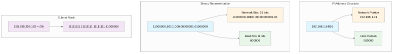
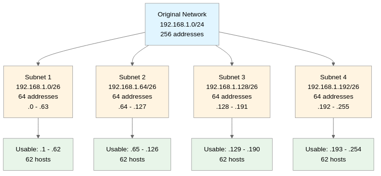

## Background and History of CIDR

CIDR (Classless Inter-Domain Routing) was introduced by the IETF in 1993 through RFC 1517, RFC 1518, and RFC 1519. It later became the internet routing standard with the publication of RFC 2050 in 1998.

It was created to address two major problems in the older class-based IP allocation model. First, Class C networks with 254 hosts were often too small, while Class B networks with 65,534 hosts were far too large, which led to heavy address waste. Second, internet routing tables were growing rapidly and putting pressure on router memory and processing capacity.

CIDR addressed both issues by removing the fixed class concept and introducing Variable Length Subnet Mask (VLSM), which made it possible to size networks more precisely. It also enabled route aggregation, or supernetting, so multiple smaller networks could be combined into a single routing entry.

## CIDR Notation and Structure

CIDR uses prefix notation, which writes the number of network bits after the IP address with a slash (`/`). This makes it easy to distinguish the network portion from the host portion while expressing the subnet mask in a compact form.

For example, `192.168.1.0/24` means the first 24 bits are the network portion and the remaining 8 bits (`32 - 24 = 8`) are the host portion. Likewise, `192.168.1.128/25` means the first 25 bits are for the network and the remaining 7 bits are for hosts.

Because IPv4 addresses are 32 bits long, CIDR prefixes range from `/0` to `/32`. A `/0` represents the entire internet (`0.0.0.0/0`), which is commonly used for a default route. A `/32` represents a single host, such as `192.168.1.1/32`.

The notation becomes even clearer in binary. For `192.168.1.64/26`, the binary form is `11000000.10101000.00000001.01000000`. The first 26 bits (`11000000.10101000.00000001.01`) are the network portion, and the remaining 6 bits (`000000`) are the host portion. The `/26` subnet mask is `11111111.11111111.11111111.11000000` (`255.255.255.192`), with all network bits set to `1` and all host bits set to `0`.

## Relationship Between CIDR and Subnet Masks

CIDR prefixes map directly to subnet masks. A subnet mask is a 32-bit value that separates the network portion from the host portion of an IP address and is used to extract the network address with an AND operation.

Some common mappings are:

- `/24` = `255.255.255.0` (`11111111.11111111.11111111.00000000`), 256 total addresses, 254 usable hosts
- `/25` = `255.255.255.128` (`11111111.11111111.11111111.10000000`), 128 total addresses, 126 usable hosts
- `/26` = `255.255.255.192` (`11111111.11111111.11111111.11000000`), 64 total addresses, 62 usable hosts
- `/27` = `255.255.255.224` (`11111111.11111111.11111111.11100000`), 32 total addresses, 30 usable hosts

In each subnet, the first address is the network address and the last address is the broadcast address. Since neither can be assigned to a host, the number of usable hosts is usually the total number of addresses minus 2.

## Network Size Calculation and Understanding

Network size in CIDR is calculated with powers of 2. If the number of host bits is `n`, then the total number of addresses is `2^n`, and the number of usable hosts is usually `2^n - 2`.

For example, a `/24` network has 8 host bits (`32 - 24 = 8`), so it has `2^8 = 256` addresses and 254 usable hosts. A `/25` has 7 host bits, so it provides 128 addresses and 126 usable hosts. A `/26` has 6 host bits, so it provides 64 addresses and 62 usable hosts. A `/27` has 5 host bits, so it provides 32 addresses and 30 usable hosts. A `/28` has 16 addresses and 14 usable hosts, a `/29` has 8 addresses and 6 usable hosts, and a `/30` has 4 addresses and 2 usable hosts.

A `/30` network is commonly used for Point-to-Point connections between routers, such as dedicated links between headquarters and branches or BGP peering between ISPs. RFC 3021 also allows `/31` networks on Point-to-Point links by using both addresses as hosts without a broadcast address. A `/32` represents a single host and is typically used for host routes or loopback interface assignments.

## Understanding Subnetting

Subnetting is the process of dividing one large network into multiple smaller networks, or subnets. It works by increasing the CIDR prefix so that the network portion grows and the host portion shrinks. This allows logical separation of networks, reduces broadcast domains, improves security, and helps use IP addresses more efficiently.

For example, if you subnet `192.168.1.0/24` into `/26`, the network is divided into four subnets:

- `192.168.1.0/26`: range `192.168.1.0 ~ 192.168.1.63`, network `.0`, broadcast `.63`, usable `.1 ~ .62`
- `192.168.1.64/26`: range `192.168.1.64 ~ 192.168.1.127`, network `.64`, broadcast `.127`, usable `.65 ~ .126`
- `192.168.1.128/26`: range `192.168.1.128 ~ 192.168.1.191`, network `.128`, broadcast `.191`, usable `.129 ~ .190`
- `192.168.1.192/26`: range `192.168.1.192 ~ 192.168.1.255`, network `.192`, broadcast `.255`, usable `.193 ~ .254`

Each subnet provides 62 usable hosts. Subnet boundaries must align on powers of 2, so `/26` subnets start at 0, 64, 128, and 192 rather than at arbitrary values such as 50. In binary terms, a valid subnet boundary has all host bits set to `0`.

## Supernetting and Route Aggregation

Supernetting is the reverse of subnetting: it combines multiple smaller networks into one larger network. It is done by decreasing the CIDR prefix so that the network portion shrinks and the host portion grows. This is important for reducing routing table size, lowering router memory usage, and shortening route lookups.

For example, four consecutive `/24` networks (`192.168.0.0/24`, `192.168.1.0/24`, `192.168.2.0/24`, and `192.168.3.0/24`) can be aggregated into a single `/22` network, `192.168.0.0/22`.

This is easier to see in binary. From `192.168.0.0` (`11000000.10101000.00000000.00000000`) to `192.168.3.255` (`11000000.10101000.00000011.11111111`), the first 22 bits (`11000000.10101000.000000`) are identical, so the combined route can be expressed as `/22`.

Route aggregation is a core technique for keeping internet routing tables manageable in ISPs and large organizations, and it is widely used in BGP (Border Gateway Protocol). CIDR and route aggregation were key to slowing the explosive growth of routing tables in the early 1990s, and they remain essential today.

## CIDR and VLSM (Variable Length Subnet Mask)

VLSM allows different subnet sizes to coexist within the same network. It is one of the key features of CIDR and helps maximize IP address utilization.

In classful addressing or Fixed Length Subnet Mask (FLSM), every subnet had to be the same size. With VLSM, subnet sizes can be matched to actual host requirements, which reduces wasted address space.

For example, a `192.168.1.0/24` network might be divided like this:

- server farm requiring 100 hosts: `192.168.1.0/25` (126 usable hosts)
- office network requiring 50 hosts: `192.168.1.128/26` (62 usable hosts)
- DMZ requiring 10 hosts: `192.168.1.192/27` (30 usable hosts)
- three Point-to-Point router links requiring 2 hosts each: `192.168.1.224/30`, `192.168.1.228/30`, and `192.168.1.232/30`
- remaining space `192.168.1.236/30 ~ 192.168.1.252/30`: reserved for future expansion

When using VLSM, allocate larger subnets first and then assign smaller ones to avoid fragmenting the address space. It is also important to make sure subnets do not overlap and that the routing protocols in use support VLSM. RIPv2, OSPF, EIGRP, IS-IS, and BGP support it, while RIPv1 and IGRP do not.

## CIDR Block Calculation Method

To calculate the right CIDR block for a given number of hosts, follow a simple process.

First, add 2 to the required number of hosts to account for the network and broadcast addresses. Next, find the smallest power of 2 that is equal to or greater than that value. The exponent of that power gives you the number of host bits. Finally, subtract the number of host bits from 32 to get the CIDR prefix.

For example, if you need 50 hosts, start with `50 + 2 = 52`. The next power of 2 is `2^6 = 64`, so you need 6 host bits. That gives you a prefix of `/26` (`32 - 6 = 26`).

Using the same method:

- 10 hosts -> `10 + 2 = 12` -> `2^4 = 16` -> `/28` (14 usable hosts)
- 100 hosts -> `100 + 2 = 102` -> `2^7 = 128` -> `/25` (126 usable hosts)
- 500 hosts -> `500 + 2 = 502` -> `2^9 = 512` -> `/23` (510 usable hosts)
- Point-to-Point links needing 2 hosts -> `/30` or `/31` (RFC 3021)

## Checking if an IP Address Belongs to a Specific CIDR Block

To check whether an IP address belongs to a CIDR block, apply the subnet mask with an AND operation and compare the result with the block's network address.

For example, to see whether `192.168.1.75` belongs to `192.168.1.64/26`, convert the address to binary: `11000000.10101000.00000001.01001011`. The `/26` subnet mask is `11111111.11111111.11111111.11000000` (`255.255.255.192`). Applying the AND operation produces `11000000.10101000.00000001.01000000`, which is `192.168.1.64`. Because that matches the network address of the CIDR block, `192.168.1.75` belongs to `192.168.1.64/26`.

Now check `192.168.1.200` against the same block. In binary, it is `11000000.10101000.00000001.11001000`. Applying the same `/26` mask gives `11000000.10101000.00000001.11000000`, which is `192.168.1.192`. Since that does not match `192.168.1.64`, the address is not in `192.168.1.64/26`; it belongs to `192.168.1.192/26` instead.

## Real-World Use Cases

### Enterprise Network Design

If a medium-sized company is assigned the private block `192.168.0.0/16`, CIDR and VLSM can be used to divide it efficiently.

Headquarters with 500 employees can use `192.168.0.0/23` (510 hosts), covering `192.168.0.1 ~ 192.168.1.254`. Branch A with 100 employees can use `192.168.2.0/25` (126 hosts), covering `192.168.2.1 ~ 192.168.2.126`. Branch B with 50 employees can use `192.168.2.128/26` (62 hosts), covering `192.168.2.129 ~ 192.168.2.190`.

For infrastructure, data center servers with 30 machines can use `192.168.3.0/27` (30 hosts), and a DMZ with 10 web servers can use `192.168.3.32/28` (14 hosts). Point-to-Point router links can use `192.168.4.0/30`, `192.168.4.4/30`, and `192.168.4.8/30`. The remaining address space, from `192.168.4.12/30` through `192.168.255.252/30`, can be reserved for future growth or additional branch offices.

### Cloud Environment (AWS VPC)

CIDR planning is also important when designing an AWS VPC (Virtual Private Cloud). A common approach is to assign a `/16` block such as `10.0.0.0/16` to the VPC and divide it into smaller subnets.

Public subnets that connect through an internet gateway might use `10.0.1.0/24` for web servers, load balancers, and NAT gateways. Private subnets with no direct external access might use `10.0.10.0/24` for application servers and `10.0.20.0/24` for database servers.

For high availability, each subnet is typically spread across multiple Availability Zones. For example, `10.0.1.0/25` could be placed in the `ap-northeast-2a` zone and `10.0.1.128/25` in `ap-northeast-2c`. Communication between subnets is controlled with routing tables and Security Groups. When connecting multiple VPCs through VPC peering or Transit Gateway, their CIDR blocks must not overlap.

### Kubernetes Pod Network

In Kubernetes clusters, separate CIDR blocks are assigned to Pods, Services, and Nodes. Pod CIDR is the address range used by all Pods in the cluster, often something like `10.244.0.0/16`, and it is managed by CNI (Container Network Interface) plugins such as Calico, Flannel, or Weave. Service CIDR is the virtual IP range used by `ClusterIP` services, often `10.96.0.0/12`, with kube-proxy routing traffic through iptables or IPVS rules. Node CIDR refers to the address range for the underlying physical or virtual servers, often using an existing infrastructure network such as `192.168.1.0/24`.

These three CIDR ranges must not overlap with one another or with the surrounding corporate network.

## Advantages and Limitations of CIDR

### Advantages

CIDR's biggest advantage is flexibility in IP address allocation. In the old classful model, there was no practical size between Class C (254 hosts) and Class B (65,534 hosts), so a network that needed around 1,000 hosts might receive a Class B block and waste more than 64,000 addresses. With CIDR, that same network can be assigned a `/22` with 1,022 usable hosts, which is much more efficient.

CIDR also reduces routing table size through route aggregation, which lowers router memory usage and shortens route lookup time. This was a major reason it helped control the rapid routing-table growth of the early 1990s, and it still plays an important role in keeping global BGP tables manageable.

Another major benefit is support for VLSM. Because network boundaries are no longer tied to fixed address classes or 8-bit boundaries, networks can be divided or combined at many different bit positions. That makes network design more flexible and allows address space to be matched much more closely to real requirements.

### Limitations

The main limitation of CIDR is increased complexity. Classful addressing was simpler to read because the network size could often be guessed from the address itself, but CIDR requires reading the prefix and understanding binary operations to calculate subnet boundaries accurately.

There are also compatibility concerns with older routing protocols. Legacy protocols such as RIPv1 and IGRP do not support CIDR or VLSM, so environments that still rely on them must be upgraded to protocols such as RIPv2, OSPF, EIGRP, or BGP.

CIDR also is not a fundamental solution to IPv4 exhaustion. It delayed depletion by improving address utilization, but the basic limit of a 32-bit IPv4 address space remains. The long-term answer is IPv6 with its 128-bit address space. Even so, as long as IPv4 remains in wide use, CIDR will continue to be a core technology for IPv4 network management.

## Conclusion

CIDR has been a core technology for internet address allocation and routing since its introduction in 1993. By solving the inefficiency of classful addressing and helping contain routing-table growth, it made the continued expansion of the internet much more practical.

Its key ideas, including VLSM, route aggregation, and prefix notation, remain fundamental in modern network design. They are used everywhere from enterprise environments to cloud platforms and container orchestration systems.

Understanding CIDR helps with efficient subnet design, better IP address utilization, and clearer troubleshooting of routing and network-boundary issues. Even as IPv6 adoption continues, CIDR remains an essential part of everyday IPv4 operations.
