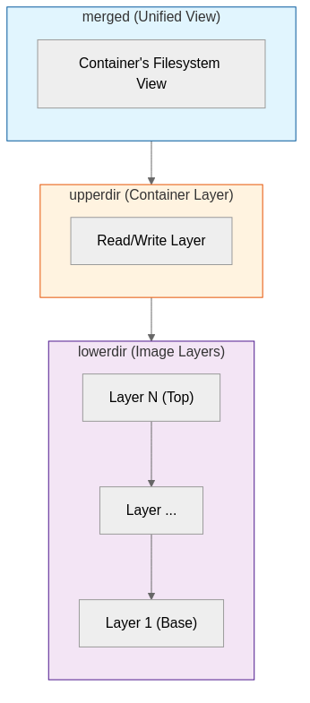

Docker image layers are the fundamental building blocks of Docker images. Each layer captures filesystem changes and stacks as a read-only tier on top of previous layers. Through a Union File System, these layers are presented as a single filesystem view for containers. Understanding the layer structure is essential for efficient image building and storage optimization.

## Docker Image Layer Overview

> **What is a Docker Image Layer?**
>
> A Docker image layer is a filesystem snapshot generated by each instruction in a Dockerfile. Like Git commits, it stores only the changes from the previous state, maximizing space efficiency.

### History and Background of the Layer System

Docker's layer system is rooted in the Linux Union File System concept. This technology originated from Unionfs, developed in 2004 by Professor Erez Zadok's research team at SUNY Stony Brook. Docker initially used AUFS (Another Union File System), but overlay2 is now the default storage driver and is natively supported in Linux kernel 3.18 and above.

| Year | Event | Description |
|------|-------|-------------|
| **2004** | Unionfs development | First Union File System implementation |
| **2006** | AUFS release | Improved version of Unionfs, used in early Docker |
| **2013** | Docker release | Adopted AUFS-based layer system |
| **2014** | overlay introduction | OverlayFS integrated into Linux kernel 3.18 |
| **2016** | overlay2 becomes default | overlay2 recommended as driver in Docker 1.12 |
| **2020** | Optimization complete | Performance improvements and stabilization of overlay2 |

### Why Layers are Necessary

Treating a Docker image as a single filesystem creates several inefficiencies. The layer system solves the following problems.

| Problem | Limitation of Single Structure | Layer System Solution |
|---------|-------------------------------|----------------------|
| **Storage waste** | Full duplication even for identical base images | Deduplication through shared common layers |
| **Increased build time** | Full rebuild required even for a single line change | Only changed layers are rebuilt |
| **Network bandwidth consumption** | Full file transfer when transferring images | Only missing layers are downloaded |
| **Difficult version management** | Cannot track change history | Each layer serves as change history |

## Union File System Operation Principles

> **What is a Union File System?**
>
> A Union File System is a technology that mounts multiple directories (branches) as a single unified filesystem view. Each branch has either read-only or read-write permissions, and upper branches overlay (shadow) lower branches.

### overlay2 Storage Driver

The current default storage driver for Docker, overlay2, is based on the Linux kernel's OverlayFS. It consists of four directories: lowerdir (read-only lower layers), upperdir (read-write upper layer), workdir (internal working directory), and merged (unified view).



### Layer Stack Operation

When multiple layers are stacked, the filesystem follows these rules: files in upper layers shadow files at the same path in lower layers, file deletions are marked with whiteout files, and file reads search from the upper layer downward and return the first file found.

```dockerfile
FROM ubuntu:22.04           # Layer 1: ~77MB - Ubuntu base filesystem
RUN apt-get update          # Layer 2: ~45MB - Package cache creation
RUN apt-get install -y nginx # Layer 3: ~60MB - nginx binaries and config
COPY nginx.conf /etc/nginx/  # Layer 4: ~1KB - Config file only
COPY app /var/www/html/      # Layer 5: Variable - Application files
```

Each layer stores only the changes (delta) from the previous layer. Layer 3 contains only the files added by nginx installation, and references Layer 1 for Ubuntu base files.

## Copy-on-Write Mechanism

> **What is Copy-on-Write (CoW)?**
>
> Copy-on-Write is an optimization technique that delays resource duplication until actual modification occurs. In Docker, when a container modifies a file from an image layer, the file is copied to the container layer before modification.

### CoW Operation Process

When modifying a file in a container, Copy-on-Write operates in the following steps:

1. **File read request**: Container requests to modify `/etc/nginx/nginx.conf` file
2. **File search**: Search in upper layer (upperdir), then in lower layer (lowerdir) if not found
3. **File copy**: Copy from lowerdir to upperdir when found (copy-up)
4. **File modification**: Apply modification to the copy in upperdir
5. **Subsequent access**: All subsequent accesses go to the modified file in upperdir

### CoW Performance Characteristics

The Copy-on-Write mechanism offers space efficiency and fast container startup. However, the first modification of a large file incurs copy overhead, and write-intensive workloads can suffer performance degradation. In such cases, it is recommended to bypass CoW overhead using volume mounts.

```yaml
# docker-compose.yml - Use volumes for write-intensive directories
services:
  database:
    image: postgres:15
    volumes:
      - db-data:/var/lib/postgresql/data  # Bypass CoW

volumes:
  db-data:
```

## Layer Caching Strategies

> **What is Build Cache?**
>
> Docker build cache stores layers generated from previous builds and reuses cached layers instead of building new ones when the same instruction and context are detected. This dramatically reduces build time.

### Cache Invalidation Rules

Docker invalidates the cache for a layer and all subsequent layers when any of the following conditions are met, so layer order directly affects build performance.

| Condition | Description | Example |
|-----------|-------------|---------|
| **Instruction change** | Dockerfile instruction text changed | `RUN apt-get install nginx` → `RUN apt-get install -y nginx` |
| **COPY/ADD file change** | Content or metadata of files to copy changed | Source code modification |
| **ARG value change** | Build argument value changed | `--build-arg VERSION=2.0` |
| **Previous layer invalidation** | Preceding layer was rebuilt | When Layer 1 changes, Layers 2~N are all rebuilt |

### Cache-Optimized Dockerfile Writing

To maximize cache efficiency, place layers with low change frequency first and place frequently changing layers later in the Dockerfile.

**Inefficient Dockerfile:**

```dockerfile
FROM node:20-alpine
WORKDIR /app
COPY . .                    # Copy all files - Cache invalidated on source change
RUN npm install             # Runs every time
RUN npm run build
```

**Optimized Dockerfile:**

```dockerfile
FROM node:20-alpine
WORKDIR /app

# Copy only dependency files first (low change frequency)
COPY package.json package-lock.json ./
RUN npm ci --only=production    # Runs only when dependencies change

# Copy source code (high change frequency)
COPY . .
RUN npm run build
```

In the optimized version, even if source code changes, if `package.json` has not changed, the npm install layer is reused from cache, significantly reducing build time.

## Layer Consolidation and Optimization

> **Minimizing Layer Count**
>
> Each RUN, COPY, and ADD instruction in a Dockerfile creates a new layer. Consolidating related instructions reduces the number of layers and image size.

### Command Consolidation Techniques

Connecting multiple RUN instructions with `&&` and deleting temporary files within the same layer reduces final image size.

**Inefficient approach:**

```dockerfile
RUN apt-get update
RUN apt-get install -y nginx
RUN apt-get install -y curl
RUN apt-get clean
RUN rm -rf /var/lib/apt/lists/*
```

**Optimized approach:**

```dockerfile
RUN apt-get update && \
    apt-get install -y --no-install-recommends \
        nginx \
        curl && \
    apt-get clean && \
    rm -rf /var/lib/apt/lists/*
```

The optimized version creates only 1 layer instead of 5. Temporary files (apt cache) are deleted in the same layer, so they are not included in the final image.

### Using .dockerignore

Using a `.dockerignore` file prevents unnecessary files from being included in the build context, improving build speed and reducing image size.

```
# .dockerignore
node_modules
npm-debug.log
.git
.gitignore
README.md
docker-compose*.yml
.env*
*.test.js
coverage/
.nyc_output/
```

## Multi-Stage Builds

> **What is Multi-Stage Build?**
>
> Multi-stage build is a technique that uses multiple FROM instructions in a single Dockerfile to separate build and runtime environments. By excluding build tools and intermediate artifacts from the final image, image size can be dramatically reduced.

### Multi-Stage Build Example

This multi-stage build example for a Go application shows how separating the build and runtime environments reduces image size.

```dockerfile
# ===== Build Stage =====
FROM golang:1.21-alpine AS builder

WORKDIR /app

# Copy and download dependencies
COPY go.mod go.sum ./
RUN go mod download

# Copy source code and build
COPY . .
RUN CGO_ENABLED=0 GOOS=linux go build -a -installsuffix cgo -o main .

# ===== Runtime Stage =====
FROM alpine:3.19

# Create non-root user for security
RUN adduser -D -g '' appuser

WORKDIR /app

# Copy only binary from build stage
COPY --from=builder /app/main .

# Switch to non-root user
USER appuser

EXPOSE 8080
CMD ["./main"]
```

In this example, the build stage's golang:1.21-alpine image is about 300MB, while the final runtime image based on alpine:3.19 is about 10MB. That cuts the image size by over 97%.

### Node.js Multi-Stage Build

The following example applies the same multi-stage approach to a frontend application.

```dockerfile
# ===== Dependencies Stage =====
FROM node:20-alpine AS deps
WORKDIR /app
COPY package.json package-lock.json ./
RUN npm ci --only=production

# ===== Build Stage =====
FROM node:20-alpine AS builder
WORKDIR /app
COPY package.json package-lock.json ./
RUN npm ci
COPY . .
RUN npm run build

# ===== Runtime Stage =====
FROM nginx:alpine
COPY --from=builder /app/dist /usr/share/nginx/html
COPY nginx.conf /etc/nginx/nginx.conf
EXPOSE 80
CMD ["nginx", "-g", "daemon off;"]
```

## Layer Analysis Tools

### docker history Command

The `docker history` command displays information about each layer of an image, allowing you to identify which instructions occupy how much size.

```bash
# Check layer history
docker history nginx:latest

# Display full commands (not truncated)
docker history --no-trunc nginx:latest

# Format for size-based sorting
docker history --format "table {{.Size}}\t{{.CreatedBy}}" nginx:latest
```

Output example:

```
IMAGE          CREATED       CREATED BY                                      SIZE
a8758716bb6a   2 weeks ago   CMD ["nginx" "-g" "daemon off;"]                0B
<missing>      2 weeks ago   STOPSIGNAL SIGQUIT                              0B
<missing>      2 weeks ago   EXPOSE 80                                       0B
<missing>      2 weeks ago   ENTRYPOINT ["/docker-entrypoint.sh"]            0B
<missing>      2 weeks ago   COPY 30-tune-worker-processes.sh /docker-ent…   4.62kB
<missing>      2 weeks ago   COPY 20-envsubst-on-templates.sh /docker-ent…   3.02kB
<missing>      2 weeks ago   COPY 10-listen-on-ipv6-by-default.sh /docker…   2.12kB
<missing>      2 weeks ago   COPY docker-entrypoint.sh / # buildkit          1.62kB
<missing>      2 weeks ago   RUN /bin/sh -c set -x     && groupadd --syst…   112MB
<missing>      2 weeks ago   ENV DYNPKG_RELEASE=1~bookworm                   0B
```

### docker inspect Command

The `docker inspect` command provides detailed image metadata in JSON format, allowing you to check layer IDs, environment variables, volume settings, and more.

```bash
# Check layer ID list
docker inspect --format '{{json .RootFS.Layers}}' nginx:latest | jq .

# Check total image size
docker inspect --format '{{.Size}}' nginx:latest

# Check virtual size (including shared layers)
docker inspect --format '{{.VirtualSize}}' nginx:latest
```

### dive Tool

dive is a third-party tool for visually exploring and analyzing Docker image layers. It shows files added/modified/deleted in each layer and provides an image efficiency score.

```bash
# Install dive (Ubuntu/Debian)
wget https://github.com/wagoodman/dive/releases/download/v0.12.0/dive_0.12.0_linux_amd64.deb
sudo dpkg -i dive_0.12.0_linux_amd64.deb

# Analyze image
dive nginx:latest

# Efficiency check in CI/CD
CI=true dive nginx:latest --ci-config .dive-ci.yml
```

## Conclusion

The Docker image layer system is central to efficient storage usage, fast image builds, and rapid container startup. It relies on Union File System and Copy-on-Write mechanisms. Understanding how layers work helps you write Dockerfiles that build faster, ship smaller images, and make better use of storage.

In practice, that means putting low-change layers first, consolidating related commands, separating build and runtime environments with multi-stage builds, and using tools like docker history and dive to spot optimization opportunities.
