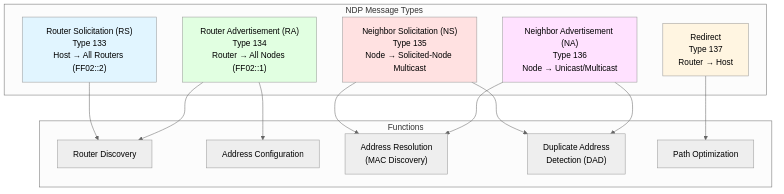

## What is NDP

NDP (Neighbor Discovery Protocol) is a core protocol for IPv6 networks officially standardized in 2007 through the IETF's RFC 4861 document. It integrates the functions of several IPv4 protocols such as ARP (Address Resolution Protocol), ICMP Router Discovery, and ICMP Redirect into one, enabling more efficient and secure network management. Operating on the basis of ICMPv6 (Internet Control Message Protocol version 6), it performs various functions including neighbor node discovery, router discovery, automatic address configuration, duplicate address detection, and path optimization.

In IPv4 environments, multiple protocols operated independently for different functions (ARP, DHCP, ICMP, etc.), making network management complex. However, in IPv6, NDP integrates these functions to simplify the protocol stack and enhance security. In particular, using multicast-based communication significantly improves network efficiency compared to IPv4's broadcast method. This contributes to reducing unnecessary traffic and saving power consumption in large-scale network environments.

## Background of NDP Emergence and Differences from IPv4

In IPv4 networks, separate protocols were needed for each function such as address resolution (ARP), router discovery (ICMP Router Discovery), address allocation (DHCP), and path redirection (ICMP Redirect). This increased network complexity and created security vulnerabilities. ARP in particular was vulnerable to spoofing attacks due to its lack of authentication mechanisms.

When designing IPv6, the IETF introduced NDP to address these issues and incorporated the following major improvements:

**Transition from IPv4 to IPv6**:
- **ARP → NDP Neighbor Solicitation/Advertisement**: Uses multicast instead of broadcast
- **DHCP → SLAAC (Stateless Address Autoconfiguration)**: Automatic address configuration without servers
- **ICMP Router Discovery → NDP Router Solicitation/Advertisement**: Integrated router discovery mechanism
- **ICMP Redirect → NDP Redirect**: Enhanced path optimization

**Major Improvements**:
1. **Enhanced Security**: Supports cryptographic authentication through SEND (SEcure Neighbor Discovery) protocol
2. **Network Efficiency**: Reduces unnecessary traffic through multicast usage (over 99% reduction compared to broadcast)
3. **Automation**: Complete automatic address configuration through SLAAC, no DHCP server needed
4. **Scalability**: Efficient operation even in large-scale networks
5. **Mobile Support**: Integrated with Mobile IPv6 for mobility support

## Core Functions of NDP



NDP performs the following core functions in IPv6 networks, which are essential elements for normal network communication.

### 1. Router Discovery

When a host connects to a network, it automatically finds routers on the local link and obtains configuration information such as network prefix, MTU (Maximum Transmission Unit), and hop limit from routers. This enables communication with external networks without manual gateway configuration.

**Operation Mechanism**:
- Host sends Router Solicitation (RS) message to All-Routers multicast address (FF02::2)
- Router responds with Router Advertisement (RA) message or broadcasts periodically (default every 200 seconds)
- RA message includes network prefix, default gateway information, MTU, address configuration flags, etc.

### 2. Stateless Address Autoconfiguration (SLAAC)

Hosts can automatically generate unique global unicast addresses by combining the prefix received from the router with their interface ID, without needing a DHCP server. This significantly reduces address management burden in large-scale networks and enables Plug and Play network connectivity.

**Address Generation Methods**:
- **EUI-64 Method**: Converts MAC address (48 bits) to 64-bit interface ID
  - Insert FFFE in middle of MAC: `00:11:22:33:44:55` → `02:11:22:FF:FE:33:44:55`
  - Flip 7th bit (Universal/Local bit)
- **Privacy Extensions (RFC 4941)**: Generates random interface ID for privacy protection
- **Stable Privacy (RFC 7217)**: Generates addresses that are stable yet protect privacy

### 3. Neighbor Address Resolution

Replaces IPv4's ARP to convert IPv6 addresses to Link-Layer addresses (MAC addresses). Uses Neighbor Solicitation (NS) and Neighbor Advertisement (NA) messages. Uses Solicited-Node multicast addresses instead of broadcast, greatly improving network efficiency.

**Solicited-Node Multicast**:
- Format: `FF02::1:FF00:0000` + last 24 bits of IPv6 address
- Example: `2001:db8::1234` → `FF02::1:FF00:1234`
- Advantage: Only nodes with that address process it, so no CPU usage by other nodes

### 4. Duplicate Address Detection (DAD)

A mandatory process where hosts verify whether an address is already in use on the network before using a new IPv6 address. Prevents IP address conflicts and ensures network stability. Sends Neighbor Solicitation message without source address (::) to check for duplicates.

**DAD Process**:
1. Host generates new address (Tentative state)
2. Send NS message (source address: `::`(unspecified), destination: Solicited-Node multicast)
3. Wait 1 second (default DupAddrDetectTransmits = 1)
4. No response = address available (Preferred state)
5. Response received = address conflict, need to generate new address

### 5. Neighbor Unreachability Detection (NUD)

Periodically verifies whether cached neighbor nodes are still reachable to respond quickly to network topology changes. Managed through Neighbor Cache state machine. Removes unreachable nodes from cache to prevent unnecessary packet transmission.

**Neighbor Cache States**:
- **INCOMPLETE**: Waiting for NA after sending NS
- **REACHABLE**: Recently confirmed reachable (default 30 seconds)
- **STALE**: Reachability verification needed
- **DELAY**: Waiting for upper layer confirmation (5 seconds)
- **PROBE**: Retransmitting NS (max 3 times)

### 6. Path Optimization (Redirect)

Function where router informs host of a more efficient next hop. Improves network performance by reducing unnecessary router hops. Redirect messages can only be sent by routers, and hosts receive them to update their routing tables.

**Usage Scenarios**:
- Destination is on the same link (direct communication possible)
- Better router exists on the same link
- Router must resend received packet through same interface

## NDP Message Types and ICMPv6 Structure

NDP uses 5 ICMPv6 message types, each with specific purposes and structures.

### Router Solicitation (RS) - Type 133

Message sent by hosts to find routers. Transmitted immediately upon network connection, enabling rapid network configuration.

**Packet Structure**:
```
ICMPv6 Header (8 bytes):
  Type: 133
  Code: 0
  Checksum: (calculated)
  Reserved: 0 (4 bytes)
Options:
  Source Link-Layer Address (optional, 8 bytes)
```

**Transmission Information**:
- Source address: Link-Local address or :: (if address not assigned)
- Destination address: FF02::2 (All-Routers multicast)
- Hop Limit: 255 (for router verification)

### Router Advertisement (RA) - Type 134

Message providing network configuration information from router. Transmitted periodically or in response to RS.

**Packet Structure**:
```
ICMPv6 Header (16 bytes):
  Type: 134
  Code: 0
  Checksum: (calculated)
  Cur Hop Limit: 64 (default)
  M(Managed) Flag: Whether to use DHCP
  O(Other) Flag: Whether to get additional info from DHCP
  Router Lifetime: 1800 (seconds, 0 = not default router)
  Reachable Time: 30000 (milliseconds)
  Retrans Timer: 1000 (milliseconds)
Options:
  Source Link-Layer Address (8 bytes)
  MTU (8 bytes)
  Prefix Information (32 bytes):
    Prefix Length: /64
    L(On-Link) Flag: 1
    A(Autonomous) Flag: 1 (SLAAC allowed)
    Valid Lifetime: 2592000 (30 days)
    Preferred Lifetime: 604800 (7 days)
    Prefix: 2001:db8::/64
```

**Important Flags**:
- **M Flag = 1**: Use Stateful DHCPv6 (get address from DHCPv6)
- **M Flag = 0, O Flag = 1**: Stateless DHCPv6 (address via SLAAC, additional info from DHCPv6)
- **M Flag = 0, O Flag = 0**: Pure SLAAC (DHCPv6 unnecessary)

### Neighbor Solicitation (NS) - Type 135

Message to find destination's Link-Layer address or verify neighbor reachability. Replaces IPv4's ARP Request.

**Packet Structure**:
```
ICMPv6 Header (24 bytes):
  Type: 135
  Code: 0
  Checksum: (calculated)
  Reserved: 0 (4 bytes)
  Target Address: 2001:db8::20 (IPv6 address to find, 16 bytes)
Options:
  Source Link-Layer Address (optional, omitted for DAD, 8 bytes)
```

**Transmission Information**:
- DAD purpose: Source address `::`, destination Solicited-Node multicast
- Address resolution: Source address own IPv6, destination Solicited-Node multicast
- NUD purpose: Source address own IPv6, destination unicast

### Neighbor Advertisement (NA) - Type 136

Response to Neighbor Solicitation or notification of Link-Layer address change.

**Packet Structure**:
```
ICMPv6 Header (24 bytes):
  Type: 136
  Code: 0
  Checksum: (calculated)
  R(Router) Flag: Whether router
  S(Solicited) Flag: Whether response to NS
  O(Override) Flag: Whether to overwrite cache
  Reserved: 0
  Target Address: 2001:db8::20 (own IPv6 address, 16 bytes)
Options:
  Target Link-Layer Address (8 bytes)
```

**Flag Meanings**:
- **R Flag = 1**: This node is a router
- **S Flag = 1**: Response to NS (unicast transmission)
- **S Flag = 0**: Gratuitous NA (multicast transmission, MAC change notification)
- **O Flag = 1**: Allow cache entry overwriting

### Redirect - Type 137

Message from router to host about better next hop. Used for path optimization.

**Packet Structure**:
```
ICMPv6 Header (40+ bytes):
  Type: 137
  Code: 0
  Checksum: (calculated)
  Reserved: 0 (4 bytes)
  Target Address: 2001:db8::7 (better next hop address, 16 bytes)
  Destination Address: 2001:db8::9 (final destination address, 16 bytes)
Options:
  Target Link-Layer Address (8 bytes)
  Redirected Header (variable, part of original packet)
```

**Security Constraints**:
- Can only be sent from Link-Local address
- Hop Limit = 255 (router verification)
- Only routers can send, hosts only receive

## NDP Operation Process


NDP's complete operation process consists of 5 stages, each using specific ICMPv6 messages.

### Stage 1: Router Discovery

When a new host connects to the network, it first finds routers to obtain network configuration information.

**Message Exchange**:
```
[Host → All-Routers (FF02::2)]
Router Solicitation (Type 133):
  Source address: FE80::1234:5678:9abc:def0 (Link-Local)
  Destination address: FF02::2
  Hop Limit: 255
  Options: Source Link-Layer Address

[Router → All-Nodes (FF02::1)]
Router Advertisement (Type 134):
  Source address: FE80::1 (Router Link-Local)
  Destination address: FF02::1 (or unicast)
  Hop Limit: 255
  Cur Hop Limit: 64
  M Flag: 0, O Flag: 0 (use SLAAC)
  Router Lifetime: 1800 seconds
  Reachable Time: 30000ms
  Retrans Timer: 1000ms
  Options:
    - Source Link-Layer Address: aa:bb:cc:dd:ee:ff
    - MTU: 1500
    - Prefix Information:
        Prefix: 2001:db8::/64
        Prefix Length: 64
        A Flag: 1 (SLAAC allowed)
        L Flag: 1 (On-Link)
        Valid Lifetime: 2592000 seconds (30 days)
        Preferred Lifetime: 604800 seconds (7 days)
```

### Stage 2: Automatic Address Configuration (SLAAC)

Generates global unicast address by combining prefix received from router with own interface ID.

**Address Generation Process**:
```
1. Link-Local address generation:
   Prefix: FE80::/64
   Interface ID: MAC-based EUI-64 or random
   Result: FE80::1234:5678:9abc:def0

2. Analyze information from RA:
   Network prefix: 2001:db8::/64
   A Flag: 1 (automatic configuration allowed)

3. Generate global unicast address:
   Prefix: 2001:db8::/64 (from RA)
   Interface ID: 1234:5678:9abc:def0 (same as Link-Local)
   Result: 2001:db8::1234:5678:9abc:def0

4. Address state: Tentative (until DAD completes)
```

### Stage 3: Duplicate Address Detection (DAD)

Mandatory stage to verify that the generated address is unique on the network.

**DAD Message Exchange**:
```
[Host → Solicited-Node Multicast]
Neighbor Solicitation (Type 135):
  Source address: :: (unspecified, DAD characteristic)
  Destination address: FF02::1:FF9a:bcde (Solicited-Node)
  Hop Limit: 255
  Target Address: 2001:db8::1234:5678:9abc:def0
  Options: None (because source address is ::)

[Wait: 1 second (default RetransTimer)]

[No duplicate address]
→ Address state: Preferred (available)
→ Bind address to interface

[Duplicate address detected]
← Receive Neighbor Advertisement (Type 136)
→ Address state: Duplicate
→ Regenerate address with new interface ID
→ Retry DAD
```

### Stage 4: Neighbor Node Address Resolution (Neighbor Discovery)

Find MAC address of destination IPv6 address for actual communication.

**Address Resolution Message Exchange**:
```
[Host A (2001:db8::10) → Solicited-Node Multicast]
Neighbor Solicitation (Type 135):
  Source address: 2001:db8::10
  Destination address: FF02::1:FF00:20 (Solicited-Node of 2001:db8::20)
  Hop Limit: 255
  Target Address: 2001:db8::20
  Options: Source Link-Layer Address: aa:aa:aa:aa:aa:aa

[Host B (2001:db8::20) → Host A (Unicast)]
Neighbor Advertisement (Type 136):
  Source address: 2001:db8::20
  Destination address: 2001:db8::10 (unicast)
  Hop Limit: 255
  R Flag: 0 (not a router)
  S Flag: 1 (Solicited, response to NS)
  O Flag: 1 (Override, update cache)
  Target Address: 2001:db8::20
  Options: Target Link-Layer Address: bb:bb:bb:bb:bb:bb

[Host A's Neighbor Cache Update]
2001:db8::20 → bb:bb:bb:bb:bb:bb (REACHABLE state)
```

### Stage 5: Data Transmission and Neighbor Reachability Verification

Transmit data using cached MAC address and periodically verify reachability.

**Neighbor Cache State Transitions**:
```
[During data transmission]
REACHABLE (30 seconds) → STALE (reachability verification needed)
↓
[When upper layer attempts packet transmission]
STALE → DELAY (5 seconds, wait for upper layer confirmation)
↓
[No upper layer confirmation]
DELAY → PROBE (retransmit NS, max 3 times)
↓
[Receive NA]
PROBE → REACHABLE
↓
[NA reception failure]
PROBE → (remove from cache)
```

## SLAAC: Stateless Address Autoconfiguration

SLAAC is one of NDP's most innovative features, enabling hosts to automatically configure IPv6 addresses without a DHCP server. This significantly reduces management burden in large-scale networks or IoT environments and enables Plug and Play network connectivity.

### SLAAC Operation Principles

1. **Link-Local Address Generation**: Host automatically generates Link-Local address by combining FE80::/64 prefix with interface ID during boot
2. **Perform DAD**: Verify duplicate status of generated Link-Local address
3. **Router Discovery**: Send RS to obtain network prefix from router
4. **Global Address Generation**: Combine prefix provided by router with interface ID
5. **Perform DAD Again**: Verify duplicate status of global address
6. **Start Using Address**: Convert address to Preferred state when DAD passes

### Interface ID Generation Methods

**EUI-64 (Extended Unique Identifier-64)**:
```
MAC Address: 00:11:22:33:44:55

1. Split MAC into two parts:
   00:11:22 | 33:44:55

2. Insert FFFE in middle:
   00:11:22:FF:FE:33:44:55

3. Flip 7th bit (Universal/Local bit):
   00 (00000000) → 02 (00000010)

4. Final interface ID:
   02:11:22:FF:FE:33:44:55

5. Convert to IPv6 format:
   0211:22FF:FE33:4455

6. Full address (with prefix 2001:db8::/64):
   2001:db8::211:22ff:fe33:4455
```

**Privacy Extensions (RFC 4941)**:
```
Problem: EUI-64 exposes MAC address, enabling device tracking
Solution: Generate random interface ID

1. Use cryptographically secure random number generator
2. Generate 128-bit random value
3. Use last 64 bits as interface ID
4. Generate new address periodically (default 1 day)
5. Previous address transitions to Deprecated state (receive only)

Example:
2001:db8::a4b3:92c7:8def:1234 (temporary address)
```

### SLAAC vs DHCPv6 Comparison

| Category | SLAAC | Stateful DHCPv6 | Stateless DHCPv6 |
|----------|-------|-----------------|------------------|
| Address allocation | Host self-generates | DHCPv6 server assigns | Host self-generates |
| Server required | Not needed | Required | Required (info only) |
| RA M Flag | 0 | 1 | 0 |
| RA O Flag | 0 | - | 1 |
| DNS info | RDNSS option | DHCPv6 | DHCPv6 |
| Address management | Not centralized | Centralized possible | Not centralized |
| Scalability | Very high | Medium | High |

## NDP Security Vulnerabilities and Attacks

While NDP provides improved security features compared to IPv4 ARP, it can still be exposed to various attacks. Basic NDP without authentication mechanisms is particularly vulnerable to Man-in-the-Middle (MITM) attacks.

### 1. RA Spoofing (Router Advertisement Spoofing)

Attack where attacker sends forged RA messages to manipulate host network configuration. The most serious type of NDP attack.

**Attack Scenario**:
```
[Normal Situation]
Legitimate router → RA: Prefix 2001:db8::/64, default gateway FE80::1

[Attack Starts]
Attacker → RA (forged):
  Prefix: 2001:db8:bad::/64 (malicious network)
  Default gateway: FE80::attacker (attacker)
  M Flag: 1 (induce use of attacker's DHCPv6 server)
  DNS: Attacker-controlled DNS server

[Result]
→ Host generates address with attacker-provided prefix
→ All traffic passes through attacker (MITM)
→ DNS queries can be manipulated (phishing)
```

**Damage Types**:
- Man-in-the-Middle attack: Intercept all traffic
- DNS hijacking: Redirect to malicious DNS server
- Denial of Service: Block communication with incorrect prefix
- Network fragmentation: Confuse network with multiple prefixes

### 2. NS/NA Spoofing (Neighbor Solicitation/Advertisement Spoofing)

Similar to IPv4 ARP spoofing, attack where attacker sends forged NS or NA messages to poison Neighbor Cache.

**Attack Mechanism**:
```
[Normal Communication]
Host A (2001:db8::10) ↔ Host B (2001:db8::20)

[Attacker's Forged NA Transmission]
Attacker → Host A:
  Neighbor Advertisement (Type 136)
  Target Address: 2001:db8::20 (pretending to be Host B)
  Target Link-Layer: cc:cc:cc:cc:cc:cc (attacker MAC)
  S Flag: 0 (Gratuitous NA)
  O Flag: 1 (Override, overwrite cache)

[Host A's Neighbor Cache Poisoned]
2001:db8::20 → cc:cc:cc:cc:cc:cc (attacker MAC)

[Result]
Packets Host A sends to Host B are delivered to attacker
```

### 3. DAD DoS Attack (Duplicate Address Detection Denial of Service)

Denial of Service attack where attacker responds with NA to all DAD NS messages, preventing host from obtaining address.

**Attack Flow**:
```
[Host's DAD Attempt]
Host → NS: Target = 2001:db8::1234 (own new address)

[Attacker's Immediate Response]
Attacker → NA: Target = 2001:db8::1234 (false response claiming already in use)

[Host's Retry]
Host → NS: Target = 2001:db8::5678 (new address)
Attacker → NA: Target = 2001:db8::5678 (false response again)

[Infinite Loop]
→ Host never obtains address
→ Unable to access network
```

### 4. Redirect Attack

Attacker sends forged Redirect messages to manipulate host's routing table and intercept traffic.

**Attack Example**:
```
[Host A sends packet to external server 2001:db8:1::100]
Host A → Router: Packet destination 2001:db8:1::100

[Attacker's Forged Redirect]
Attacker → Host A:
  Redirect (Type 137)
  Target Address: FE80::attacker (attacker)
  Destination Address: 2001:db8:1::100

[Host A's Route Table Change]
2001:db8:1::100 → Next Hop: FE80::attacker

[Result]
All packets to external server route through attacker
```

## NDP Security Enhancement Methods

### 1. SEND (SEcure Neighbor Discovery, RFC 3971)

SEND is a protocol that adds cryptographic signatures to NDP messages to ensure authentication and integrity. Uses public key cryptography (RSA) based authentication and effectively prevents RA spoofing and NS/NA spoofing.

**SEND Operation Principles**:
1. **Certificate-based Authentication**: Use X.509 certificates to verify router and host identities
2. **CGA (Cryptographically Generated Addresses)**: Use public key hash as interface ID
3. **Timestamp Option**: Prevents replay attacks
4. **Nonce Option**: Binds NS/NA messages, prevents Man-in-the-Middle attacks
5. **RSA Signature Option**: Adds digital signature to all messages

**SEND Message Structure**:
```
ICMPv6 Header (RA, NS, NA, etc.)
+ CGA Parameters Option (public key, CGA parameters)
+ Timestamp Option (timestamp, replay prevention)
+ Nonce Option (one-time random number)
+ RSA Signature Option (RSA signature of entire message)
```

**Advantages and Disadvantages**:
- Advantages: Strong authentication, prevents RA/NS/NA spoofing, standardized (RFC 3971)
- Disadvantages: High computational cost (RSA signature verification), requires PKI infrastructure, limited implementation (many devices don't support)

### 2. RA Guard (RFC 6105)

Function to block unauthorized RA messages at switches. Filters RA sent from non-router devices through physical port-based policies.

**RA Guard Operation Mechanism**:
```
[Switch Port Classification]
Trusted Port (Router Port):
  - Allow RA message transmission
  - Example: Router connection port, uplink port

Untrusted Port (Host Port):
  - Block RA messages
  - Example: End user computers, printers, etc.

[RA Guard Verification]
1. Receive RA message
2. Check receiving port
3. Received on Untrusted Port → Drop
4. Received on Trusted Port → Forward
```

**Cisco Switch Configuration Example**:
```
! Create IPv6 RA Guard policy
ipv6 nd raguard policy HOST_POLICY
  device-role host

ipv6 nd raguard policy ROUTER_POLICY
  device-role router

! Apply policy to interfaces
interface GigabitEthernet1/0/1
  description User PC
  ipv6 nd raguard attach-policy HOST_POLICY

interface GigabitEthernet1/0/24
  description Router Uplink
  ipv6 nd raguard attach-policy ROUTER_POLICY
```

**Bypass Attacks and Countermeasures**:
- **Problem**: Attacker attempts to bypass RA Guard using Extension Headers
- **Countermeasure**: Strengthen Extension Header verification, block all Fragment packets

### 3. DHCPv6 Guard

Similar to RA Guard, function to block unauthorized DHCPv6 server responses.

**Configuration Example (Cisco)**:
```
ipv6 dhcp guard policy CLIENT_POLICY
  device-role client

interface GigabitEthernet1/0/1
  ipv6 dhcp guard attach-policy CLIENT_POLICY
```

### 4. IPv6 Source Guard

Function to verify source addresses to prevent IPv6 address spoofing. Operates based on DHCPv6 binding table or Neighbor Discovery snooping table.

**Operation Principle**:
```
1. Switch snoops ND messages to build binding table
   Port GigabitEthernet1/0/1:
     2001:db8::10 → aa:aa:aa:aa:aa:aa

2. Verify source address when receiving packet
   Source address: 2001:db8::10
   Receiving port: GigabitEthernet1/0/1
   → Matches binding table → Forward

3. Block packet if mismatch
   Source address: 2001:db8::99 (spoofing)
   Receiving port: GigabitEthernet1/0/1
   → Not in binding table → Drop
```

### 5. Access Control Lists (ACL)

Filter ICMPv6 messages at firewalls or routers to block attacks.

**Recommended ACL Rules**:
```
! RA only received from routers
permit icmp any any router-advertisement
deny icmp any any router-advertisement

! Restrict to Link-Local addresses only
permit icmpv6 FE80::/10 any nd-na
permit icmpv6 FE80::/10 any nd-ns
deny icmpv6 any any nd-na
deny icmpv6 any any nd-ns

! Verify Hop Limit = 255 (router messages)
! (Automatically verified on most equipment)
```

### 6. Network Segmentation (VLAN Segmentation)

Use VLANs to segment broadcast/multicast domains and limit attack impact scope.

**Security-Enhanced VLAN Design**:
```
VLAN 10: Management (routers, switches)
VLAN 20: Servers (critical servers)
VLAN 30: Users (general users)
VLAN 40: Guest (guest network)

Apply ACL at router between each VLAN
```

## NDP vs IPv4 ARP Comparison

| Category | IPv4 ARP | IPv6 NDP |
|----------|----------|----------|
| Protocol | Independent protocol | ICMPv6 (IP layer) |
| Address resolution | ARP Request/Reply | NS/NA |
| Transmission method | Broadcast | Multicast (Solicited-Node) |
| Router discovery | ICMP Router Discovery (optional) | RA/RS (mandatory) |
| Address configuration | DHCP required | SLAAC (automatic) |
| Duplicate address check | Gratuitous ARP (optional) | DAD (mandatory) |
| Security | None (vulnerable) | SEND (optional) |
| Path optimization | ICMP Redirect | Redirect (integrated) |
| Network efficiency | Low (broadcast) | High (multicast) |

## Conclusion

NDP (Neighbor Discovery Protocol) has established itself as a core protocol for IPv6 networks since its standardization through RFC 4861 in 2007. It integrates the functions of several IPv4 protocols such as ARP, ICMP Router Discovery, and ICMP Redirect to enable more efficient and automated network management. It significantly reduces network traffic through multicast-based communication, and through SLAAC enables operation of large-scale networks without DHCP servers. It performs various functions including Router Discovery, Address Resolution, Duplicate Address Detection, Neighbor Unreachability Detection, and Redirect through 5 ICMPv6 message types (RS, RA, NS, NA, Redirect). However, basic NDP lacks authentication mechanisms and can be exposed to various security threats such as RA spoofing, NS/NA spoofing, DAD DoS, and Redirect attacks. Network administrators should build secure IPv6 networks by appropriately combining security measures such as SEND (SEcure Neighbor Discovery), RA Guard, DHCPv6 Guard, IPv6 Source Guard, ACL filtering, and VLAN segmentation. As IPv6 adoption accelerates in modern network environments, accurately understanding NDP's operation principles and security issues is essential knowledge for network engineers and security professionals.
