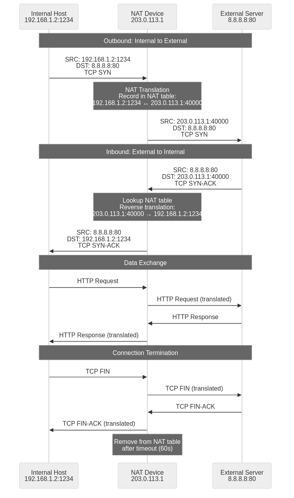

## Background and History of NAT

NAT (Network Address Translation) is a core technology that translates between private and public IP addresses in network communications. It emerged in the mid-1990s to address the IPv4 address depletion problem and was first standardized through the IETF's RFC 1631 document in 1994, later revised as RFC 2663 in 1999 to take its current form. The original internet design assumed all devices would have unique public IP addresses, but rapid internet expansion from the late 1980s led to the quick depletion of the 32-bit IPv4 address space (approximately 4.3 billion addresses). NAT was developed as a short-term solution to this problem and has become an essential technology forming the foundation of global network infrastructure. NAT is widely used in everything from home routers to large-scale corporate networks, cloud infrastructure, and mobile communication networks, and even with IPv6 transition underway, it continues to play an important role for legacy system support and security purposes.

## Basic Concepts and Operating Principles of NAT

NAT operates on network devices such as routers or firewalls, translating IP addresses between internal networks (private IP) and external networks (public IP) by modifying IP addresses and TCP/UDP port numbers in packet headers and recording translation information in NAT tables to enable bidirectional communication. Private IP address ranges defined in RFC 1918 in 1996 (Class A: 10.0.0.0/8, Class B: 172.16.0.0/12, Class C: 192.168.0.0/16) are special address ranges that are not routed on the internet and can be reused anywhere in the world without conflicts in NAT environments for internal network configuration. When packets pass through NAT devices, IP and TCP/UDP header checksums are also recalculated, which is essential for ensuring packet integrity by reflecting changes due to IP address or port number modifications, and NAT devices also perform basic firewall functions by monitoring connection states (such as SYN, ESTABLISHED, FIN_WAIT for TCP) through stateful inspection and passing only valid packets.

## Types of NAT

### 1. Static NAT

Static NAT permanently maps one private IP address to one public IP address in a 1:1 relationship. It is primarily used when external users need constant access to specific internal servers (web servers, mail servers, game servers, database servers, etc.). The mapping relationship is explicitly defined in the NAT device's configuration file and persists even after system restarts, supporting bidirectional communication perfectly regardless of connection initiation direction. This method has the advantage of simplifying DNS record configuration and SSL/TLS certificate management since external users accessing 203.0.113.10:80 always have traffic accurately forwarded to the same internal web server (192.168.1.10:80), but has the disadvantage of requiring separate public IPs for each internal host, resulting in minimal IP address conservation and significantly increased costs and management burden for acquiring public IPs in large-scale networks.

**Examples:**

- Internal web server 192.168.1.10 → Public IP 203.0.113.10 (permanent mapping)
- Internal mail server 192.168.1.20 → Public IP 203.0.113.20 (permanent mapping)
- Internal game server 192.168.1.30 → Public IP 203.0.113.30 (permanent mapping)
- When external users access 203.0.113.10:80, the NAT device accurately forwards traffic to the internal web server (192.168.1.10:80).

**Characteristics:**

- Fixed configuration makes it predictable and stable, allowing easy identification of problem causes during troubleshooting.
- Perfect support for bidirectional connections allows complex protocols like FTP Active mode, SIP, and H.323 to work without additional configuration.
- Requires many public IPs, resulting in minimal IP address conservation and no contribution to solving IPv4 address depletion.
- In large-scale networks, managing hundreds of 1:1 mappings individually increases configuration change and maintenance burden.

### 2. Dynamic NAT

Dynamic NAT dynamically allocates available IPs from a predefined pool of public IP addresses to internal hosts at request time. When connections terminate, the public IPs return to the pool for other internal devices to use, resulting in higher IP utilization than static NAT. It allocates IPs on a first-come-first-served basis like DHCP but continues using the same public IP while the session is maintained. For example, if 11 public IPs from 203.0.113.10 to 203.0.113.20 are configured as a pool, only 11 internal hosts can connect externally simultaneously, and when a 12th host attempts external connection, the IP pool is exhausted and connection fails until existing connections terminate and IPs return to the pool. This method is useful in environments where the number of internal hosts exceeds the number of public IPs but not all hosts connect externally simultaneously (e.g., university campuses, corporate offices), and can efficiently utilize limited public IPs through statistical multiplexing effects.

**Examples:**

- Public IP pool: 203.0.113.10 ~ 203.0.113.20 (11 total)
- Internal host A (192.168.1.5) receives 203.0.113.10 when connecting externally
- Internal host B (192.168.1.6) receives 203.0.113.11 when connecting externally
- Internal host C (192.168.1.7) receives 203.0.113.12 when connecting externally
- When host A's connection terminates, 203.0.113.10 returns to the pool and becomes immediately available for other hosts.

**Characteristics:**

- More flexible IP management than static NAT with higher IP utilization, supporting more internal hosts than available public IPs.
- Good resource efficiency by allocating public IPs only when needed, with unused IPs remaining in the pool for other hosts during off-peak times.
- When the IP pool is exhausted, additional external connections become impossible, potentially causing bottlenecks during traffic surges, requiring pool size expansion.
- Difficult to initiate connections from external to internal networks, making it unsuitable for server operations and primarily used for client device outbound traffic processing.
- Allocated public IPs can change for each connection, potentially causing problems for applications requiring session persistence.

### 3. PAT (Port Address Translation) / NAPT

PAT (Port Address Translation) or NAPT (Network Address Port Translation) is the most commonly used NAT method where thousands of internal IPs share a single public IP. It distinguishes each connection using TCP/UDP port numbers, and NAT devices track each session's {internal IP:port, external IP:port, destination IP:port, protocol} information through state tables to deliver return traffic to the correct internal host. This method is used by default in home routers and small business networks and can theoretically support up to approximately 65,000 simultaneous connections (TCP port range 1024-65535) with a single public IP, maximizing IP address conservation, and in real environments can handle tens of thousands to hundreds of thousands of simultaneous connections depending on NAT device memory and CPU performance. PAT utilizes ephemeral port ranges to assign unique public ports to each internal connection, and when the same internal host creates multiple connections to the same destination server, each is assigned and distinguished by different public ports, while protocols like FTP, SIP, and H.323 that include IP address information in packet payloads require an additional processing module called ALG (Application Layer Gateway) where NAT devices inspect and modify packet contents.

**Examples:**

- Internal host A (192.168.1.2:1234) connecting externally → translated to 203.0.113.1:40000
- Internal host B (192.168.1.3:1234) connecting externally with the same port → translated to 203.0.113.1:40001
- Internal host A connecting with a different port (5678) → translated to 203.0.113.1:40002
- Internal host C (192.168.1.4:8080) connecting externally → translated to 203.0.113.1:40003
- All connections share a single public IP (203.0.113.1) but each connection is uniquely identified by port number.

**Characteristics:**

- Default method used in home routers and small business networks, with most homes and offices worldwide accessing the internet through this method.
- Can support tens of thousands of simultaneous connections with a single public IP, maximizing IP address conservation and being the most effective method to practically solve IPv4 address depletion.
- Theoretically limited to about 64,000 simultaneous connections per single IP due to TCP/UDP port number range (0-65535, actually using 1024-65535), but in practice NAT device memory and processing performance become the bottleneck.
- Protocols like FTP, SIP, H.323, and RTSP that include IP address information in packet payloads require ALG (Application Layer Gateway), and without ALG, connections fail or work only partially.
- NAT traversal problems can occur in online games, P2P file sharing, and VoIP, requiring additional technologies like UPnP, STUN, TURN, and ICE.

### 4. DNAT (Destination NAT)

DNAT changes the destination address of incoming packets from external sources to internal IP addresses. It is primarily used to allow external users to access internal servers while concealing the actual structure of the internal network, with port forwarding being a typical example of DNAT that can selectively forward traffic coming to specific ports to particular internal servers. For example, all HTTP traffic coming to port 80 of public IP 203.0.113.1 is forwarded to internal web server 192.168.1.10:80, while port 443 of the same public IP is forwarded to the same web server's 192.168.1.10:443, and port 22 is forwarded to a separate SSH server 192.168.1.20:22, allowing multiple internal servers to be exposed externally through a single public IP. DNAT plays a core role in DMZ (Demilitarized Zone) configuration, allowing security enhancement by placing externally exposed servers in a separate area isolated from the internal network, and when combined with load balancers, traffic entering through a single public IP and port can be distributed across multiple internal servers to ensure high availability and scalability.

**Examples:**

- External access to public IP 203.0.113.1:80 → forwarded to internal web server 192.168.1.10:80
- External access to public IP 203.0.113.1:443 → forwarded to internal web server 192.168.1.10:443
- External access to public IP 203.0.113.1:22 → forwarded to internal SSH server 192.168.1.20:22
- External access to public IP 203.0.113.1:25 → forwarded to internal mail server 192.168.1.30:25
- External access to public IP 203.0.113.1:3389 → forwarded to internal RDP server 192.168.1.40:3389

**Application Areas:**

- Operating internal web, mail, game, and FTP servers while providing services externally and hiding actual server IPs.
- Configuring remote access environments through port forwarding to safely use SSH, RDP, VNC, etc. from external locations.
- Maintaining a balance between internal network security and external service provision through DMZ (Demilitarized Zone) configuration, limiting damage scope in case of security incidents.
- Implementing reverse proxy systems by placing proxy servers like Nginx and HAProxy in front to perform load balancing, SSL termination, and caching.
- Distributing traffic through load balancers to distribute large amounts of traffic coming to a single public IP across multiple internal servers, improving performance and availability.

**Characteristics:**

- Enables service provision without exposing actual IP addresses of internal servers, improving security and making it difficult for attackers to identify internal network structure.
- Multiple internal servers can be exposed externally with a single public IP, achieving both IP address conservation and server operation while significantly reducing costs for acquiring public IPs.
- Can enhance security by combining with detailed firewall rules to allow access only to specific services, minimizing attack surface by blocking all unnecessary ports.
- In large-scale service environments, hundreds of intertwined DNAT rules can increase management complexity with potential rule conflicts or priority issues.

### 5. SNAT (Source NAT)

SNAT changes the source address of outgoing packets from internal to external networks to public IPs. It is the most common form of NAT and is almost always used when internal users access the internet. While PAT can be considered a type of SNAT, SNAT is a broader concept referring to source address translation in general, including cases where only IP addresses are changed without port translation. SNAT enhances security by completely concealing internal network structure from external networks, enables consistent access control and logging from external systems' perspective since all internal devices use the same public IP as the source, and accurately delivers return traffic to the correct internal host through connection tracking functionality. In large enterprise networks, thousands of internal devices access the internet through a small number of public IPs, in cloud environments virtual machines' outbound traffic is converted to single or few public IPs through NAT Gateway and transmitted externally, and in multi-homed (multiple ISP connection) environments, source-based routing can change the source IP of specific traffic to different public IPs for transmission through specific ISPs.

**Examples:**

- Packet sent from internal host 192.168.1.10 to external network → source changed to public IP 203.0.113.1
- Packet sent from internal host 192.168.1.20 to external network → source changed to same public IP 203.0.113.1
- In Kubernetes clusters containing multiple servers, all Pods make external API calls through a single public IP.
- In multi-homed (multiple ISP connection) environments, one application's traffic source IP is changed to ISP A's public IP while another application uses ISP B's public IP.

**Application Areas:**

- Thousands of internal devices (PCs, servers, IoT equipment) in large enterprise networks accessing the internet with limited public IPs, significantly reducing IP address acquisition costs.
- Managing outbound traffic of virtual machines in cloud environments (AWS NAT Gateway, Azure NAT, GCP Cloud NAT) and performing detailed access control combined with security groups.
- Implementing source-based routing in environments using multiple ISPs to direct traffic to specific lines, maximizing cost optimization and bandwidth utilization.
- Automatic source traffic switching during failures in high-availability systems to ensure service continuity, implementing Active-Standby or Active-Active configurations.

**Characteristics:**

- Enhanced security by not exposing internal network structure externally, preventing attackers from identifying internal IP address schemes or network topology.
- Consistent access control (firewall rules, ACLs) and logging possible from external systems' perspective since all internal devices use the same public IP, simplifying whitelist management.
- Delivers return traffic to the correct internal host through connection tracking, utilizing NAT table mapping information of {internal IP:port, public IP:port, destination IP:port}.
- In high-volume traffic environments, NAT table management can consume significant system resources (CPU, memory), and in environments creating tens of thousands to hundreds of thousands of new connections per second, NAT devices can become bottlenecks.

## Detailed Analysis of NAT Packet Flow

Examining how packets are processed in a real NAT environment step by step helps understand NAT's operational principles more clearly. The following is a detailed analysis of the process of an internal client (192.168.1.2) connecting to an external web server (8.8.8.8:80) in a PAT (Port Address Translation) environment, including the entire process from TCP 3-way handshake through data transmission to connection termination.

### 1. Request from Internal to External (Outbound Packet)

1. An internal host (192.168.1.2) attempts an HTTP request to an external server (8.8.8.8:80) via a web browser, resolving the domain name to an IP address through DNS lookup before starting a TCP connection.
2. The internal host's operating system selects port 1234 from the ephemeral port range (Linux defaults to 32768-60999, Windows to 49152-65535) and creates a TCP SYN packet.
3. The generated packet content is `Source IP=192.168.1.2, Source Port=1234, Destination IP=8.8.8.8, Destination Port=80, TCP Flag=SYN, Sequence Number=random value`, approximately 60 bytes including IP and TCP headers.
4. This packet is sent to the default gateway (NAT device, typically 192.168.1.1) of the internal network, confirming the gateway's MAC address through ARP protocol and encapsulated in an Ethernet frame.
5. The NAT device receives the packet and checks the routing table to recognize it should be forwarded to the external interface, then begins NAT processing.
6. During NAT transformation, the packet's source IP is changed to the public IP (203.0.113.1), the source port is changed to a temporary NAT port (40000, selected from the NAT device's available port pool), the TTL value in the IP header is decremented by 1, and both IP and TCP checksums are recalculated to ensure packet integrity.
7. The NAT device records translation information in the NAT table with entries including `{Internal IP: 192.168.1.2, Internal Port: 1234, Public IP: 203.0.113.1, Public Port: 40000, Destination IP: 8.8.8.8, Destination Port: 80, Protocol: TCP, State: SYN_SENT, Creation Time: current time, Timeout: 120 seconds}`.
8. The transformed packet content becomes `Source IP=203.0.113.1, Source Port=40000, Destination IP=8.8.8.8, Destination Port=80, TCP Flag=SYN`, and the NAT device transmits this packet to the internet through the external network interface.

### 2. Response from External to Internal (Inbound Packet)

1. The external server (8.8.8.8:80) processes the request and generates a response packet (TCP SYN-ACK), selecting its own sequence number and setting the ACK number to the client's sequence number plus 1.
2. The response packet content is `Source IP=8.8.8.8, Source Port=80, Destination IP=203.0.113.1, Destination Port=40000, TCP Flag=SYN-ACK, Sequence Number=server's random value, ACK Number=client sequence+1`, transmitted to the NAT device's public IP through the internet via multiple routers.
3. The NAT device receives the packet on the external interface and checks the destination IP:port (203.0.113.1:40000) to recognize this is inbound traffic requiring NAT processing.
4. It looks up the NAT table to find mapping information (192.168.1.2:1234) corresponding to public port 40000 and destination IP:port (8.8.8.8:80) combination, using hash tables or index structures for fast lookup.
5. It performs reverse NAT processing by changing the packet's destination IP to the internal host IP (192.168.1.2), changing the destination port to the original host port (1234), and recalculating both IP and TCP checksums.
6. The NAT table entry's state is updated from `SYN_SENT` to `ESTABLISHED`, and the last activity time is refreshed to reset the timeout counter.
7. The transformed packet content becomes `Source IP=8.8.8.8, Source Port=80, Destination IP=192.168.1.2, Destination Port=1234, TCP Flag=SYN-ACK`, and the NAT device transmits this packet through the internal network interface, delivered to the internal host's MAC address confirmed through ARP, reaching the host that made the original request.

### 3. Data Transfer and Connection Maintenance

1. The internal host receives SYN-ACK and sends an ACK packet to complete the TCP 3-way handshake, then transmits actual HTTP request data (such as GET /index.html HTTP/1.1).
2. The same NAT rules apply to all subsequent packets, translating outbound source from 192.168.1.2:1234 to 203.0.113.1:40000 and inbound destination from 203.0.113.1:40000 to 192.168.1.2:1234.
3. The NAT device continuously tracks connection state to keep the NAT table updated, refreshing the last activity time with each packet to prevent timeout.
4. The NAT device removes connection information from the table that has had no traffic for a certain period (timeout, typically 7200 seconds or 2 hours for TCP ESTABLISHED state) to efficiently manage resources, preventing zombie connections from filling the table.
5. For long-maintained connections (SSH, database connections, etc.), applications must periodically send Keep-Alive messages to prevent NAT table entries from being removed, either by enabling TCP Keep-Alive options or using application-level ping messages.

### 4. Connection Termination and Resource Release

1. When the internal host completes data transmission and requests connection termination, it sends a TCP FIN packet, which the NAT device also processes with the same NAT rules, translating the source to 203.0.113.1:40000 and transmitting externally.
2. The external server receives the FIN packet, responds with ACK, then sends its own FIN packet, which the NAT device reverse-translates and delivers to the internal host, and the internal host sends a final ACK to complete the TCP 4-way termination process.
3. The NAT device recognizes connection termination and changes the NAT table entry state for that connection from `ESTABLISHED` to `FIN_WAIT` or `TIME_WAIT`, setting a short timeout (typically 60-120 seconds).
4. After timeout, the NAT device completely removes the mapping information from the table and returns the used public port 40000 to the port pool, making it available for reuse by new connections from other internal hosts.
5. In large-scale traffic environments, tens of thousands of connection creations and terminations can occur per second, and NAT devices utilize data structures like hash tables, B-trees, and timeout queues for efficient table management to perform fast lookup, insertion, and deletion.

The above process is a basic HTTP communication example, but complex protocols like FTP (File Transfer Protocol) create separate data channels (port 20 or arbitrary ports) in addition to control channels (port 21), requiring special processing called ALG (Application Layer Gateway) in NAT devices. ALG inspects control channel packet payloads to identify data channel connection information (IP addresses and ports), modifies them according to NAT translation, and dynamically creates NAT table entries. SIP (Session Initiation Protocol) has separated signaling and media streams with IP address and port information included in SDP (Session Description Protocol) messages, requiring SIP ALG to inspect and modify them for normal VoIP calls, and H.323, RTSP, etc. similarly require ALG support.

## Comprehensive Analysis of NAT Advantages and Disadvantages

NAT is a technology that affects various aspects of network environments, with clear advantages and disadvantages in areas such as security, address management, network configuration, and application compatibility. Understanding these in depth is essential for effectively utilizing NAT and solving problems.

### Security Aspect

**Advantages:**

- **Complete Internal Network Concealment:** NAT completely hides the actual IP address structure of the internal network (subnet structure, number of hosts, IP allocation methods, etc.) from the outside, significantly reducing direct attack vectors against internal systems, and when attackers attempt port scanning, they can only see the NAT device without being able to identify internal network structure.
- **State-based Filtering:** Most NAT implementations provide basic firewall functionality by allowing only responses to connections initiated from the inside through stateful inspection, and unauthorized connection attempts from external sources are automatically blocked due to lack of matching entries in the NAT table.
- **Address Scanning Prevention:** Makes it difficult for external attackers to identify the IP address range of the internal network (e.g., 192.168.1.0/24), significantly reducing the effectiveness of indiscriminate scanning attacks (e.g., full network scans through nmap) and blocking attack preparation stages.
- **IP-based Attack Mitigation:** When receiving DDoS attacks or IP spoofing attacks, only the public IP is affected while internal hosts remain relatively safe, with the NAT device acting as a kind of shield.

**Disadvantages:**

- **Limitations in Detailed Security Control:** NAT alone cannot respond to application-layer security threats (SQL injection, XSS, malicious file uploads, etc.) and requires additional security solutions like IDS/IPS, WAF, and antivirus.
- **Increased Complexity of Bidirectional Connections:** Explicit port forwarding rules must be configured to allow external access to specific internal servers, which can become security vulnerabilities in case of configuration errors and increase management complexity.
- **Logging and Auditing Challenges:** Since multiple internal users share the same public IP, detailed session-level logging (source IP:port, destination IP:port, time, etc.) must be maintained on NAT devices to accurately trace the source of specific malicious activities (spam sending, hacking attempts, etc.), requiring large-capacity storage and log analysis tools.
- **End-to-End Encryption Interference:** Network-level encryption protocols like IPsec can have problems in NAT environments (verification fails when changed because IP addresses are included in encryption targets), requiring additional technologies like NAT Traversal (NAT-T).

### Address Management Aspect

**Advantages:**

- **Maximized IPv4 Address Conservation:** Thousands of internal devices (theoretically up to 65,000 in PAT environments) can connect to the internet with a single public IP address, effectively mitigating the serious IPv4 address shortage problem (most of approximately 4.3 billion addresses worldwide depleted), and without NAT, maintaining the current internet scale would have been impossible.
- **Address Independence and Flexibility:** The address scheme of the internal network (subnet size, IP range, DHCP settings, etc.) can be designed and managed completely independently of ISPs or external networks, freely utilizing RFC 1918 private IP ranges.
- **Network Redesign Simplicity:** The internal network configuration can be maintained even when changing ISPs or public IPs (e.g., transitioning from static IP to dynamic IP, changing ISP providers), facilitating management without needing to redesign the entire network.
- **Address Conflict Avoidance During Company Mergers:** Even if different organizations use the same private IP range (e.g., 192.168.1.0/24), integration is possible through NAT and subnet redesign.

**Disadvantages:**

- **Simultaneous Connection Limits Due to Port Restrictions:** In PAT environments, there is a theoretical limit to the number of simultaneous connections a single public IP can handle due to TCP/UDP port number ranges (actually using 1024-65535, about 64,000), and in large-scale traffic environments, multiple public IPs must be configured as a pool or NAT devices must be added.
- **Address Conflict Issues:** When both sides of a network use the same private IP range (e.g., 192.168.1.0/24) during company mergers or VPN connections, conflicts occur making routing impossible, requiring changing the IP range of one or both sides or configuring double NAT.
- **IPv6 Transition Delay Criticism:** There are criticisms that NAT has reduced the necessity and speed of transitioning to IPv6 by alleviating the IPv4 address shortage problem, with some experts evaluating that NAT has delayed IPv6 adoption by more than 20 years.
- **IP-based Service License Issues:** Some software or services manage licenses based on IP addresses, which can conflict with license policies in NAT environments where all internal devices use the same public IP.

### Network Configuration and Management Aspect

**Advantages:**

- **Easy Configuration and Setup:** NAT functionality is provided as a basic feature in most router and firewall devices (Cisco, Juniper, pfSense, iptables, etc.), making setup straightforward, and home routers have PAT enabled by default for use without separate configuration.
- **Maximized Cost Efficiency:** Large-scale networks can be operated with a small number of public IPs, reducing IP address purchase and management costs (some ISPs charge monthly fees for each additional public IP), and small to medium businesses can operate entire networks with a single public IP.
- **Flexible Network Design:** Changes to internal network structure (subnet division, VLAN addition, IP reallocation, etc.) do not affect external connections, increasing network design flexibility and allowing transparent internal refactoring externally.
- **Test Environment Construction Simplicity:** Development and test environments can be configured with private IPs and allow external access only when needed through NAT to easily build isolated environments.

**Disadvantages:**

- **Increased Server Operation Complexity:** Additional configurations such as port forwarding or DMZ setup are required to provide services from internal networks, and configuration errors can cause service failures or security vulnerabilities, making documentation and change management important.
- **Difficulty Implementing Advanced Features:** Some advanced network features like IP multicast (IPTV, video conferencing), IPsec VPN (especially transport mode), and Mobile IP are difficult or impossible to implement in NAT environments, requiring workaround technologies like NAT-T or tunneling.
- **Performance Bottlenecks in Large Environments:** In large-scale environments handling many simultaneous connections (tens of thousands to hundreds of thousands), NAT device CPU, memory, and table lookup performance can cause bottlenecks, potentially requiring dedicated NAT gateways or hardware acceleration (FPGA, ASIC).
- **Increased Debugging and Troubleshooting Difficulty:** When network problems occur, the added NAT translation process makes packet tracing more complex, and when capturing packets with tcpdump or Wireshark, different IP:ports appear on internal and external interfaces, making accurate analysis difficult.

### Application Compatibility Aspect

**Advantages:**

- **Compatibility with Most Applications:** Common client-server model internet activities such as web browsing (HTTP/HTTPS), email (SMTP, POP3, IMAP), file downloading (HTTP, FTP passive mode), DNS, and SSH work without issues in NAT environments.
- **Expanded ALG Support:** Many NAT devices provide ALG (Application Layer Gateway) for complex protocols like FTP, SIP, H.323, PPTP, and RTSP, automatically translating IP addresses and port information in packet payloads to ensure compatibility.
- **Ecosystem Adaptation Through Widespread Use:** Since most networks worldwide use NAT, many applications (especially commercial software) are designed and tested with NAT environments in consideration, supporting automatic port forwarding protocols like UPnP, NAT-PMP, and PCP.
- **Compatibility with Cloud Services:** Most cloud services (AWS, Azure, GCP, SaaS applications) are designed with the assumption that clients are behind NAT and work without issues.

**Disadvantages:**

- **P2P Application Constraints:** P2P file sharing like BitTorrent and eMule, some online games (especially host-client models), and VoIP (some features of Skype and Zoom) have difficulty with direct connections in NAT environments and require NAT traversal technologies like STUN (Session Traversal Utilities for NAT), TURN (Traversal Using Relays around NAT), and ICE (Interactive Connectivity Establishment).
- **Connection Initiation Asymmetry:** External-to-internal connection initiation is blocked by default, requiring port forwarding configuration for remote desktop (RDP, VNC), SSH servers, and game server hosting, and must be combined with DDNS (Dynamic DNS) in dynamic IP environments.
- **NAT Traversal Complexity and Reliability Issues:** WebRTC (web-based real-time communication) uses STUN, TURN, and ICE in combination for P2P connections in NAT environments, which increases connection establishment time (can take several seconds) and causes connection failures in some environments, and relay through TURN servers increases bandwidth and costs.
- **Protocol-specific Compatibility Issues:** FTP Active mode (where the server initiates data connection to the client) fails in NAT environments so Passive mode must be used, and SIP requires complex ALG processing and in some environments partial failures occur where voice calls work but video does not.

## Conclusion

NAT is an essential core technology in IPv4 environments that has supported global internet infrastructure for nearly 30 years since its emergence in the mid-1990s. In particular, the PAT method is commonly used in homes and businesses, providing the most practical and effective solution to the public IP shortage problem. Although the introduction of IPv6 provides a 128-bit address space (approximately 340 undecillion, practically infinite) and the need for NAT is gradually decreasing, as of 2025 most worldwide traffic is still IPv4-based and NAT continues to be utilized for reasons including legacy system support, security enhancement, and network design flexibility. Understanding the various NAT methods (Static NAT, Dynamic NAT, PAT, DNAT, SNAT) and their operational principles in depth will be of great help in network troubleshooting (connection failures, performance degradation, application malfunctions, etc.), architecture design (DMZ configuration, load balancing, high availability), and security enhancement (port forwarding minimization, firewall rule optimization), and will serve as essential foundational knowledge for understanding dual-stack environments and transition technologies like NAT64/DNS64 in the future IPv6 transition process.
