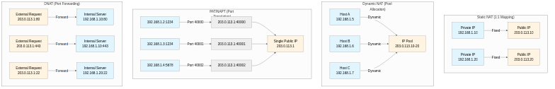
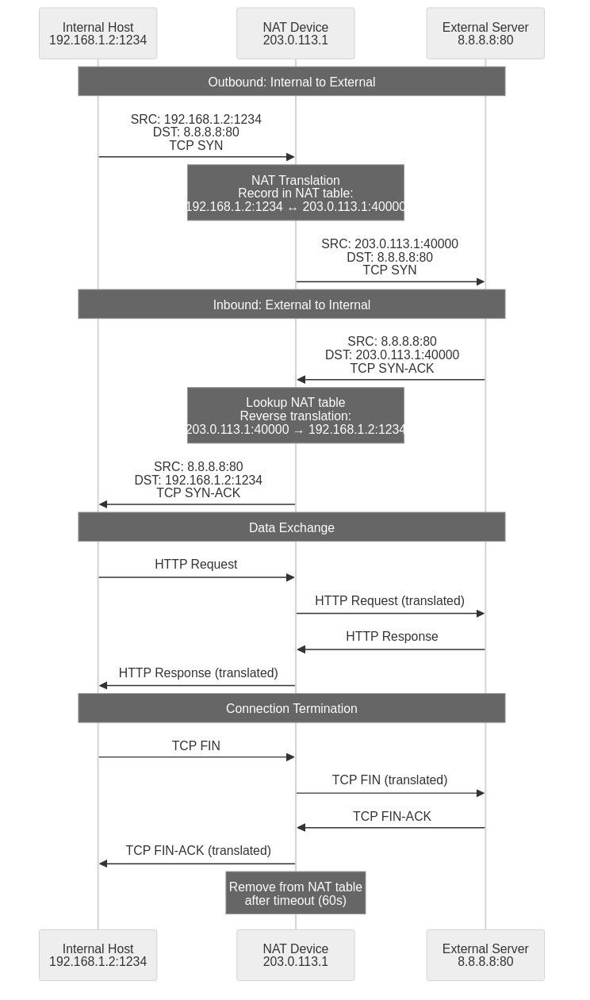

## NAT의 등장 배경과 역사

NAT(Network Address Translation)는 네트워크 통신에서 사설 IP 주소와 공인 IP 주소를 상호 변환하는 핵심 기술이다. 이 기술은 1990년대 중반 IPv4 주소 고갈 문제에 대응하기 위해 등장했으며, 1994년 IETF의 RFC 1631에서 처음 표준화되었다. 이후 1999년 RFC 2663으로 개정되면서 현재 널리 쓰이는 형태를 갖추게 되었다.

인터넷 초기 설계에서는 모든 장치가 고유한 공인 IP 주소를 가질 것으로 예상했다. 그러나 1980년대 말부터 인터넷이 급속히 확산되면서 32비트 IPv4 주소 공간(약 43억 개)이 빠르게 소진되기 시작했다. NAT는 이 문제를 완화하기 위한 현실적인 대응책으로 도입되었고, 현재까지 전 세계 네트워크 인프라의 중요한 기반 기술로 자리 잡았다.

오늘날 NAT는 가정용 공유기부터 대규모 기업 네트워크, 클라우드 인프라, 모바일 통신망까지 폭넓게 활용된다. IPv6 전환이 진행 중인 지금도 레거시 시스템 지원과 보안 측면에서 여전히 중요한 역할을 한다.

## NAT의 기본 개념과 동작 원리

NAT는 라우터나 방화벽과 같은 네트워크 장비에서 동작하며, 내부 네트워크(사설 IP)와 외부 네트워크(공인 IP) 간의 IP 주소를 변환하는 과정에서 패킷 헤더의 IP 주소와 TCP/UDP 포트 번호를 수정하고 NAT 테이블에 변환 정보를 기록하여 양방향 통신을 가능하게 한다. 1996년 RFC 1918에서 정의된 사설 IP 주소 대역(Class A: 10.0.0.0/8, Class B: 172.16.0.0/12, Class C: 192.168.0.0/16)은 인터넷 상에서 라우팅되지 않는 특별한 주소 범위로, NAT 환경에서 내부 네트워크 구성에 광범위하게 활용되며 전 세계 어디서든 충돌 없이 재사용될 수 있다. 패킷이 NAT 장비를 통과할 때 IP 헤더와 TCP/UDP 헤더의 체크섬(checksum)도 함께 재계산되는데, 이는 IP 주소나 포트 번호 변경으로 인한 헤더 변경을 반영하여 패킷의 무결성을 보장하는 데 필수적이며, NAT 장비는 상태 추적(stateful inspection) 기능을 통해 각 연결의 상태(TCP의 경우 SYN, ESTABLISHED, FIN_WAIT 등)를 모니터링하여 올바른 패킷만 통과시키는 기본적인 방화벽 역할도 수행한다.

## NAT의 종류

### 1. 정적 NAT (Static NAT)

정적 NAT는 하나의 사설 IP 주소와 하나의 공인 IP 주소를 1:1로 영구 매핑하는 방식이다. 외부에서 내부의 특정 서버(웹 서버, 메일 서버, 게임 서버, 데이터베이스 서버 등)에 항상 접근해야 할 때 주로 사용한다. 매핑 관계는 NAT 장비 설정에 명시적으로 정의되며, 시스템이 재시작되어도 유지되고 연결 시작 방향과 관계없이 양방향 통신을 지원한다.

예를 들어 외부 사용자가 `203.0.113.10:80`으로 접근하면 NAT 장비는 항상 동일한 내부 웹 서버 `192.168.1.10:80`으로 트래픽을 전달한다. 덕분에 DNS 레코드 설정이나 SSL/TLS 인증서 관리가 단순해진다. 반면 각 내부 호스트마다 별도의 공인 IP가 필요하므로 IP 주소 절약 효과는 거의 없고, 대규모 환경에서는 공인 IP 확보 비용과 관리 부담이 커진다.

**예시:**

- 내부 웹 서버 192.168.1.10 → 공인 IP 203.0.113.10 (영구 매핑)
- 내부 메일 서버 192.168.1.20 → 공인 IP 203.0.113.20 (영구 매핑)
- 내부 게임 서버 192.168.1.30 → 공인 IP 203.0.113.30 (영구 매핑)
- 외부 사용자가 203.0.113.10:80으로 접근하면 NAT 장비가 내부 웹 서버(192.168.1.10:80)로 트래픽을 정확히 전달한다.

**특징:**

- 설정이 고정되어 있어 예측 가능하고 안정적이며, 트러블슈팅 시 문제 원인을 쉽게 파악할 수 있다.
- 양방향 연결이 완벽하게 지원되어 FTP Active 모드, SIP, H.323 등 복잡한 프로토콜도 추가 설정 없이 작동한다.
- 많은 수의 공인 IP가 필요하여 IP 주소 절약 효과가 적으며, IPv4 주소 고갈 문제 해결에 기여하지 못한다.
- 대규모 네트워크에서는 수백 개의 1:1 매핑을 개별 관리해야 하므로 설정 변경과 유지보수 부담이 가중된다.

### 2. 동적 NAT (Dynamic NAT)

동적 NAT는 미리 정의한 공인 IP 풀(pool)에서 사용 가능한 주소를 요청 시점에 내부 호스트에 동적으로 할당하는 방식이다. 연결이 끝나면 해당 공인 IP는 풀로 반환되므로 정적 NAT보다 주소 활용도가 높다. DHCP처럼 사용 가능한 자원을 순차적으로 배분하지만, 세션이 유지되는 동안에는 같은 공인 IP를 계속 사용한다.

예를 들어 `203.0.113.10`부터 `203.0.113.20`까지 11개의 공인 IP를 풀로 구성했다면 동시에 외부 접속할 수 있는 내부 호스트는 최대 11대다. 12번째 호스트가 외부 접속을 시도하면 풀이 소진되어 연결이 실패한다. 기존 연결이 종료되어 주소가 반환되기 전까지는 추가 외부 접속도 불가능하다. 이런 특성 때문에 동적 NAT는 내부 호스트 수가 공인 IP 수보다 많지만, 모든 호스트가 동시에 외부에 접속하지는 않는 환경에서 유용하다.

**예시:**

- 공인 IP 풀: 203.0.113.10 ~ 203.0.113.20 (총 11개)
- 내부 호스트 A(192.168.1.5)가 외부 접속 시 203.0.113.10 할당 받음
- 내부 호스트 B(192.168.1.6)가 외부 접속 시 203.0.113.11 할당 받음
- 내부 호스트 C(192.168.1.7)가 외부 접속 시 203.0.113.12 할당 받음
- 호스트 A의 연결이 종료되면 203.0.113.10은 풀로 반환되어 다른 호스트가 즉시 사용 가능하다.

**특징:**

- 정적 NAT보다 유연하게 IP를 관리할 수 있으며, 공인 IP 수보다 많은 내부 호스트를 지원할 수 있어 IP 활용도가 높다.
- 공인 IP가 필요한 시점에만 할당되므로 자원 효율성이 좋고, 사용하지 않는 시간대에는 IP가 풀에 남아 다른 호스트가 활용할 수 있다.
- IP 풀이 소진되면 추가 외부 접속이 불가능하여 트래픽 폭증 시 병목현상이 발생할 수 있으며, 이를 해결하려면 IP 풀 크기를 늘려야 한다.
- 외부에서 내부로의 연결 시작이 어려워 서버 운영에는 적합하지 않으며, 주로 클라이언트 장치의 아웃바운드 트래픽 처리에 사용된다.
- 각 연결마다 할당되는 공인 IP가 변경될 수 있어 세션 지속성(session persistence)이 필요한 애플리케이션에서 문제가 발생할 수 있다.

### 3. PAT (Port Address Translation) / NAPT

PAT(Port Address Translation) 또는 NAPT(Network Address Port Translation)는 가장 널리 쓰이는 NAT 방식이다. 여러 내부 호스트가 하나의 공인 IP를 공유하고, NAT 장비는 TCP/UDP 포트 번호로 각 연결을 구분한다. 이때 상태 테이블(state table)에 세션별 정보를 기록해 반환 트래픽을 올바른 내부 호스트로 전달한다.

이 방식은 가정용 공유기와 소규모 기업 네트워크에서 기본적으로 사용된다. 하나의 공인 IP로 이론상 최대 약 65,000개(TCP 포트 범위 1024-65535)의 동시 연결을 지원할 수 있어 IP 주소 절약 효과가 매우 크다. 실제 처리량은 NAT 장비의 메모리와 CPU 성능에 따라 수만~수십만 개 수준까지 달라질 수 있다.

PAT는 임시 포트(ephemeral port) 범위를 활용해 각 내부 연결에 고유한 공인 포트를 할당한다. 동일한 내부 호스트가 같은 목적지 서버로 여러 연결을 생성하더라도 각각 다른 공인 포트가 부여되어 구분된다. 반면 FTP, SIP, H.323처럼 패킷 페이로드에 IP 주소 정보를 담는 프로토콜은 ALG(Application Layer Gateway)가 필요하며, NAT 장비가 패킷 내용을 검사하고 수정해야 정상 동작한다.

**예시:**

- 내부 호스트 A(192.168.1.2:1234)가 외부 접속 → 203.0.113.1:40000으로 변환
- 내부 호스트 B(192.168.1.3:1234)가 동일한 포트로 외부 접속 → 203.0.113.1:40001로 변환
- 내부 호스트 A가 다른 포트(5678)로 추가 접속 → 203.0.113.1:40002로 변환
- 내부 호스트 C(192.168.1.4:8080)가 외부 접속 → 203.0.113.1:40003으로 변환
- 모든 연결이 단일 공인 IP(203.0.113.1)를 공유하지만 포트 번호로 각 연결을 고유하게 식별한다.

**특징:**

- 가정용 공유기와 소규모 기업 네트워크에서 기본적으로 사용되는 방식으로, 전 세계 대부분의 가정과 사무실이 이 방식을 통해 인터넷에 접속한다.
- 하나의 공인 IP로 수만 개의 동시 연결을 지원할 수 있어 IP 주소 절약 효과가 극대화되며, IPv4 주소 고갈 문제를 실질적으로 해결하는 가장 효과적인 방법이다.
- TCP/UDP 포트 번호의 범위(0-65535, 실제로는 1024-65535 사용)로 인해 이론적으로 단일 IP당 최대 약 64,000개의 동시 연결로 제한되나, 실제로는 NAT 장비의 메모리와 처리 성능이 병목이 된다.
- FTP, SIP, H.323, RTSP와 같이 패킷 페이로드에 IP 주소 정보를 포함하는 프로토콜은 ALG(Application Layer Gateway)가 필요하며, ALG가 없으면 연결이 실패하거나 부분적으로만 작동한다.
- 온라인 게임, P2P 파일 공유, VoIP 등에서 NAT 트래버설(NAT traversal) 문제가 발생할 수 있으며, UPnP, STUN, TURN, ICE와 같은 추가 기술이 필요하다.

### 4. DNAT (Destination NAT)

DNAT는 외부에서 들어오는 패킷의 목적지 주소(destination address)를 내부 IP로 바꾸는 방식이다. 외부 사용자가 내부 서버에 접근할 수 있게 하면서도 내부 네트워크의 실제 구조를 숨길 때 주로 사용한다. 포트 포워딩(port forwarding)이 가장 대표적인 예다. 이를 이용하면 특정 포트로 들어오는 트래픽만 선택적으로 내부 서버로 전달할 수 있다.

예를 들어 공인 IP `203.0.113.1`의 80번 포트로 들어오는 HTTP 트래픽을 내부 웹 서버 `192.168.1.10:80`으로 전달하고, 같은 공인 IP의 443번 포트는 `192.168.1.10:443`으로, 22번 포트는 별도의 SSH 서버 `192.168.1.20:22`로 전달할 수 있다. 이렇게 하면 하나의 공인 IP만으로도 여러 내부 서버를 외부에 노출할 수 있다.

DNAT는 DMZ(Demilitarized Zone) 구성에서도 핵심적인 역할을 한다. 외부 노출 서버를 내부 네트워크와 분리된 영역에 배치해 보안을 강화할 수 있고, 로드 밸런서와 결합하면 하나의 공인 IP와 포트로 들어오는 트래픽을 여러 내부 서버로 분산해 고가용성과 확장성을 확보할 수 있다.

**예시:**

- 외부에서 공인 IP 203.0.113.1:80으로 접속 → 내부 웹 서버 192.168.1.10:80으로 전달
- 외부에서 공인 IP 203.0.113.1:443으로 접속 → 내부 웹 서버 192.168.1.10:443으로 전달
- 외부에서 공인 IP 203.0.113.1:22로 접속 → 내부 SSH 서버 192.168.1.20:22로 전달
- 외부에서 공인 IP 203.0.113.1:25로 접속 → 내부 메일 서버 192.168.1.30:25로 전달
- 외부에서 공인 IP 203.0.113.1:3389로 접속 → 내부 RDP 서버 192.168.1.40:3389로 전달

**활용 분야:**

- 웹 서버, 메일 서버, 게임 서버, FTP 서버 등을 내부에서 운영하면서 외부에 서비스를 제공하고, 실제 서버 IP는 숨긴다.
- 포트 포워딩을 통한 원격 접속 환경 구성으로 SSH, RDP, VNC 등을 외부에서 안전하게 사용할 수 있다.
- DMZ(Demilitarized Zone) 구성으로 내부 네트워크 보안과 외부 서비스 제공의 균형을 유지하며, 침해 사고 발생 시 피해 범위를 제한한다.
- 역방향 프록시(Reverse Proxy) 시스템 구현으로 Nginx, HAProxy 같은 프록시 서버를 앞단에 배치하여 로드 밸런싱, SSL 종료, 캐싱 등을 수행한다.
- 로드 밸런서를 통한 트래픽 분산 처리로 하나의 공인 IP로 들어오는 대량 트래픽을 여러 내부 서버로 분산하여 성능과 가용성을 향상시킨다.

**특징:**

- 내부 서버의 실제 IP 주소를 외부에 노출하지 않으면서도 서비스 제공이 가능하여 보안성이 향상되고, 공격자가 내부 네트워크 구조를 파악하기 어렵게 만든다.
- 다수의 내부 서버를 하나의 공인 IP로 외부에 노출할 수 있어 IP 주소 절약과 서버 운영을 동시에 달성하며, 공인 IP 확보 비용을 크게 절감한다.
- 세밀한 방화벽 규칙과 결합하여 특정 서비스에 대한 접근만 허용함으로써 보안을 강화할 수 있으며, 불필요한 포트는 모두 차단하여 공격 표면을 최소화한다.
- 대규모 서비스 환경에서는 수백 개의 DNAT 규칙이 복잡하게 얽혀 관리 복잡성이 증가할 수 있으며, 규칙 간 충돌이나 우선순위 문제가 발생할 수 있다.

### 5. SNAT (Source NAT)

SNAT는 내부에서 외부로 나가는 패킷의 출발지 주소(source address)를 공인 IP로 바꾸는 방식이다. 가장 일반적인 NAT 형태로, 내부 사용자가 인터넷에 접속할 때 거의 항상 사용된다. PAT도 넓게 보면 SNAT의 한 종류지만, SNAT는 포트 변환 없이 IP 주소만 바꾸는 경우까지 포함하는 더 넓은 개념이다.

SNAT를 사용하면 내부 네트워크 구조를 외부에 숨길 수 있어 보안성이 높아진다. 또한 여러 내부 장치가 동일한 공인 IP를 출발지로 사용하므로 외부 시스템 입장에서는 접근 제어와 로깅을 일관되게 적용하기 쉽다. 반환 트래픽은 상태 추적(Connection Tracking) 정보를 바탕으로 원래 내부 호스트에 정확히 전달된다.

대규모 기업 네트워크에서는 수천 대의 내부 장치가 소수의 공인 IP를 통해 인터넷에 접속한다. 클라우드 환경에서는 가상 머신의 아웃바운드 트래픽이 NAT Gateway를 거쳐 단일 또는 소수의 공인 IP로 변환된다. 멀티호밍(다중 ISP 연결) 환경에서는 출발지 기반 라우팅(Source Based Routing)과 함께 사용해 특정 트래픽을 서로 다른 공인 IP로 변환하고, 원하는 ISP 회선으로 내보낼 수 있다.

**예시:**

- 내부 호스트 192.168.1.10에서 외부로 패킷 전송 → 출발지가 공인 IP 203.0.113.1로 변경됨
- 내부 호스트 192.168.1.20에서 외부로 패킷 전송 → 출발지가 동일한 공인 IP 203.0.113.1로 변경됨
- 여러 서버를 포함한 쿠버네티스 클러스터에서 모든 Pod가 하나의 공인 IP를 통해 외부 API 호출을 수행한다.
- 멀티호밍(다중 ISP 연결) 환경에서 특정 애플리케이션의 트래픽 출발지 IP를 ISP A의 공인 IP로, 다른 애플리케이션은 ISP B의 공인 IP로 변경한다.

**활용 분야:**

- 대규모 기업 네트워크에서 수천 대의 내부 장치(PC, 서버, IoT 장비)가 제한된 공인 IP로 인터넷에 접속하며, IP 주소 확보 비용을 크게 절감한다.
- 클라우드 환경(AWS NAT Gateway, Azure NAT, GCP Cloud NAT)에서 가상 머신들의 아웃바운드 트래픽을 관리하고, 보안 그룹과 결합하여 세밀한 접근 제어를 수행한다.
- 여러 ISP를 사용하는 환경에서 출발지 기반 라우팅(Source Based Routing) 구현으로 트래픽을 특정 회선으로 유도하고, 비용 최적화와 대역폭 활용을 극대화한다.
- 고가용성 시스템에서 장애 발생 시 트래픽 출발지를 자동 전환하여 서비스 연속성을 보장하며, Active-Standby 또는 Active-Active 구성을 구현한다.

**특징:**

- 내부 네트워크 구조를 외부에 노출하지 않아 보안성이 강화되며, 공격자가 내부 IP 주소 체계나 네트워크 토폴로지를 파악할 수 없다.
- 모든 내부 장치가 동일한 공인 IP를 사용하므로 외부 시스템 입장에서 일관된 접근 제어(방화벽 규칙, ACL)와 로깅이 가능하며, 화이트리스트 관리가 단순해진다.
- 상태 추적(Connection Tracking)을 통해 반환 트래픽을 올바른 내부 호스트로 전달하며, NAT 테이블의 {내부IP:포트, 공인IP:포트, 목적지IP:포트} 매핑 정보를 활용한다.
- 대용량 트래픽 환경에서는 NAT 테이블 관리에 상당한 시스템 리소스(CPU, 메모리)가 소모될 수 있으며, 초당 수만~수십만 개의 새로운 연결이 생성되는 환경에서는 NAT 장비가 병목이 될 수 있다.

## NAT 패킷 흐름 상세 분석

실제 NAT 환경에서 패킷이 어떻게 처리되는지 살펴보면 동작 원리를 더 쉽게 이해할 수 있다. 아래는 PAT(포트 주소 변환) 환경에서 내부 클라이언트(`192.168.1.2`)가 외부 웹 서버(`8.8.8.8:80`)에 접속하는 예시다. TCP 3-way 핸드셰이크부터 데이터 전송, 연결 종료까지의 흐름을 순서대로 정리했다.

### 1. 내부에서 외부로 요청 (아웃바운드 패킷)

1. 내부 호스트(192.168.1.2)가 웹 브라우저를 통해 외부 서버(8.8.8.8:80)에 HTTP 요청을 시도하며, DNS 조회를 통해 도메인 이름을 IP 주소로 해석한 후 TCP 연결을 시작한다.
2. 내부 호스트의 운영체제는 임시 포트(ephemeral port, 리눅스는 기본적으로 32768-60999 범위, 윈도우는 49152-65535 범위에서 할당)인 1234번을 선택하여 TCP SYN 패킷을 생성한다.
3. 생성된 패킷 내용은 `소스 IP=192.168.1.2, 소스 포트=1234, 목적지 IP=8.8.8.8, 목적지 포트=80, TCP 플래그=SYN, 시퀀스 번호=무작위 값`이며, IP 헤더와 TCP 헤더가 포함된 약 60바이트 크기의 패킷이다.
4. 이 패킷은 내부 네트워크의 기본 게이트웨이(NAT 장비, 일반적으로 192.168.1.1)로 전송되며, ARP 프로토콜을 통해 게이트웨이의 MAC 주소를 확인하고 이더넷 프레임에 캡슐화된다.
5. NAT 장비는 해당 패킷을 수신하고 라우팅 테이블을 확인하여 외부 인터페이스로 전달해야 함을 인식한 후 NAT 처리를 시작한다.
6. NAT 변환 과정에서 패킷의 출발지 IP를 공인 IP(203.0.113.1)로 변경하고, 출발지 포트를 NAT용 임시 포트(40000, NAT 장비가 사용 가능한 포트 풀에서 선택)로 변경하며, IP 헤더의 TTL 값을 1 감소시키고, IP 체크섬과 TCP 체크섬을 모두 재계산하여 패킷 무결성을 보장한다.
7. NAT 장비는 변환 정보를 NAT 테이블에 기록한다. 이 항목에는 내부 IP와 포트, 공인 IP와 포트, 목적지 IP와 포트, 프로토콜, 연결 상태, 생성 시각, 타임아웃 같은 정보가 포함된다. 예를 들면 `192.168.1.2:1234`가 `203.0.113.1:40000`으로 변환되어 `8.8.8.8:80`과 TCP 세션을 맺고 있고, 상태는 `SYN_SENT`, 타임아웃은 120초인 식이다.
8. 변환된 패킷 내용은 `소스 IP=203.0.113.1, 소스 포트=40000, 목적지 IP=8.8.8.8, 목적지 포트=80, TCP 플래그=SYN`이 되며, NAT 장비는 이 패킷을 외부 네트워크 인터페이스를 통해 인터넷으로 전송한다.

### 2. 외부에서 내부로 응답 (인바운드 패킷)

1. 외부 서버(8.8.8.8:80)는 요청을 처리하고 응답 패킷(TCP SYN-ACK)을 생성하며, 자신의 시퀀스 번호를 선택하고 클라이언트의 시퀀스 번호에 1을 더한 ACK 번호를 설정한다.
2. 응답 패킷 내용은 `소스 IP=8.8.8.8, 소스 포트=80, 목적지 IP=203.0.113.1, 목적지 포트=40000, TCP 플래그=SYN-ACK, 시퀀스 번호=서버의 무작위 값, ACK 번호=클라이언트 시퀀스+1`이며, 여러 라우터를 거쳐 인터넷을 통해 NAT 장비의 공인 IP로 전송된다.
3. NAT 장비는 외부 인터페이스에서 패킷을 수신하고, 목적지 IP:포트(203.0.113.1:40000)를 확인하여 이 패킷이 NAT 처리가 필요한 인바운드 트래픽임을 인식한다.
4. NAT 테이블을 조회하여 공인포트 40000과 목적지IP:포트(8.8.8.8:80) 조합에 해당하는 매핑 정보(192.168.1.2:1234)를 찾으며, 해시 테이블이나 인덱스 구조를 사용하여 빠른 조회가 가능하다.
5. NAT 역변환 처리를 수행하여 패킷의 목적지 IP를 내부 호스트 IP(192.168.1.2)로 변경하고, 목적지 포트를 원래 호스트 포트(1234)로 변경하며, IP 체크섬과 TCP 체크섬을 다시 재계산한다.
6. NAT 테이블 항목의 상태를 `SYN_SENT`에서 `ESTABLISHED`로 업데이트하고, 마지막 활동 시간을 갱신하여 타임아웃 카운터를 리셋한다.
7. 변환된 패킷 내용은 `소스 IP=8.8.8.8, 소스 포트=80, 목적지 IP=192.168.1.2, 목적지 포트=1234, TCP 플래그=SYN-ACK`가 되며, NAT 장비는 이 패킷을 내부 네트워크 인터페이스를 통해 전송하고 패킷은 ARP를 통해 확인된 내부 호스트의 MAC 주소로 전달되어 원래 요청한 호스트에 도달한다.

### 3. 데이터 전송 및 연결 유지

1. 내부 호스트는 SYN-ACK를 받고 ACK 패킷을 전송하여 TCP 3-way 핸드셰이크를 완료하며, 이후 실제 HTTP 요청 데이터(GET /index.html HTTP/1.1 등)를 전송한다.
2. 모든 후속 패킷에 대해서도 동일한 NAT 규칙이 적용되어 아웃바운드는 출발지를 192.168.1.2:1234에서 203.0.113.1:40000으로 변환하고, 인바운드는 목적지를 203.0.113.1:40000에서 192.168.1.2:1234로 변환한다.
3. NAT 장비는 연결의 상태를 지속적으로 추적하여 NAT 테이블을 최신 상태로 유지하며, 각 패킷마다 마지막 활동 시간을 갱신하여 타임아웃이 발생하지 않도록 관리한다.
4. NAT 장비는 일정 시간(타임아웃, TCP ESTABLISHED 상태는 일반적으로 7200초 또는 2시간) 동안 트래픽이 없는 연결 정보를 테이블에서 제거하여 리소스를 효율적으로 관리하며, 이를 통해 좀비 연결(zombie connection)이 테이블을 가득 채우는 것을 방지한다.
5. 장시간 유지되는 연결(SSH, 데이터베이스 연결 등)의 경우 애플리케이션 레벨에서 Keep-Alive 메시지를 주기적으로 전송하여 NAT 테이블 항목이 제거되지 않도록 해야 하며, TCP Keep-Alive 옵션을 활성화하거나 애플리케이션 레벨 핑(ping) 메시지를 사용할 수 있다.

### 4. 연결 종료 및 리소스 해제

1. 내부 호스트가 데이터 전송을 완료하고 연결 종료를 요청하면 TCP FIN 패킷을 전송하며, NAT 장비는 이 패킷도 동일한 NAT 규칙으로 처리하여 출발지를 203.0.113.1:40000으로 변환하여 외부로 전송한다.
2. 외부 서버는 FIN 패킷을 받고 ACK로 응답한 후 자신도 FIN 패킷을 전송하며, NAT 장비는 역변환하여 내부 호스트에 전달하고, 내부 호스트는 마지막 ACK를 전송하여 TCP 4-way 종료 과정이 완료된다.
3. NAT 장비는 연결 종료를 인식하고 해당 연결에 대한 NAT 테이블 항목의 상태를 `ESTABLISHED`에서 `FIN_WAIT` 또는 `TIME_WAIT`로 변경하며, 타임아웃을 짧게(일반적으로 60-120초) 설정한다.
4. 타임아웃 후 NAT 장비는 해당 매핑 정보를 테이블에서 완전히 제거하고, 사용했던 공인포트 40000을 포트 풀로 반환하여 다른 내부 호스트의 새로운 연결에 재사용될 수 있는 상태로 만든다.
5. 대규모 트래픽 환경에서는 초당 수만 개의 연결 생성과 종료가 발생할 수 있으며, NAT 장비는 효율적인 테이블 관리를 위해 해시 테이블, B-트리, 타임아웃 큐 등의 자료구조를 활용하여 빠른 조회와 삽입/삭제를 수행한다.

위 과정은 기본적인 HTTP 통신 예시다. 그러나 FTP(File Transfer Protocol)처럼 제어 채널(21번 포트)과 별도의 데이터 채널(20번 포트 또는 임의 포트)을 함께 사용하는 프로토콜은 NAT 장비의 추가 처리가 필요하다. 이때 쓰이는 기능이 ALG(Application Layer Gateway)이며, 제어 채널의 패킷 페이로드를 검사해 데이터 채널 연결 정보(IP 주소와 포트)를 파악하고 NAT 변환에 맞게 수정한 뒤 필요한 NAT 테이블 항목을 동적으로 만든다.

SIP(Session Initiation Protocol)도 비슷한 문제를 가진다. SIP는 시그널링과 미디어 스트림이 분리되어 있고, SDP(Session Description Protocol) 메시지 안에 IP 주소와 포트 정보가 포함된다. 따라서 SIP ALG가 이 정보를 검사하고 수정해야 정상적인 VoIP 통화가 가능하다. H.323, RTSP 같은 프로토콜도 같은 이유로 ALG 지원이 필요하다.

## NAT의 장단점 종합 분석

NAT는 네트워크 환경에서 다양한 측면에 영향을 미치는 기술로, 보안, 주소 관리, 네트워크 구성, 애플리케이션 호환성 등 각 영역에서 명확한 장점과 단점을 가지고 있으며, 이를 심층적으로 이해하는 것이 NAT를 효과적으로 활용하고 문제를 해결하는 데 필수적이다.

### 보안 측면

**장점:**

- **내부 네트워크 은닉:** 내부 IP 주소 체계와 네트워크 구조를 외부에 드러내지 않아 직접적인 공격 벡터를 줄인다.
- **상태 기반 필터링:** 대부분의 NAT 구현은 상태 추적(stateful inspection)을 통해 내부에서 시작한 연결의 응답만 허용하므로 기본적인 방화벽 기능을 제공한다.
- **주소 스캐닝 방지:** 공격자가 내부 IP 대역을 파악하기 어려워 무차별 스캐닝의 효과를 낮춘다.
- **IP 기반 공격 완화:** 공인 IP가 외부에 노출되더라도 내부 호스트는 한 단계 뒤에 있어 상대적으로 보호된다.

**단점:**

- **세밀한 보안 제어의 한계:** NAT만으로는 SQL 인젝션, XSS 같은 애플리케이션 계층 공격에 대응하기 어렵다.
- **양방향 연결의 복잡성:** 내부 서버를 외부에 공개하려면 명시적인 포트 포워딩 규칙이 필요해 설정과 관리가 까다로워진다.
- **로깅과 감사의 어려움:** 여러 사용자가 하나의 공인 IP를 공유하므로 세션 단위 로그가 없으면 행위 추적이 어렵다.
- **End-to-End 암호화 간섭:** IPsec 같은 일부 네트워크 계층 암호화 프로토콜은 NAT 환경에서 추가 기술(NAT-T)이 필요할 수 있다.

### 주소 관리 측면

**장점:**

- **IPv4 주소 절약:** 하나의 공인 IP로 많은 내부 장치를 인터넷에 연결할 수 있어 IPv4 부족 문제를 크게 완화한다.
- **주소 독립성:** 내부 네트워크 주소 체계를 ISP나 외부 네트워크와 독립적으로 설계하고 운영할 수 있다.
- **네트워크 재설계 용이:** ISP나 공인 IP가 바뀌어도 내부 주소 체계를 유지하기 쉽다.
- **주소 충돌 완화:** 조직 통합이나 네트워크 연동 시 NAT를 활용하면 사설 IP 충돌 문제를 완화할 수 있다.

**단점:**

- **동시 연결 수 한계:** PAT는 포트 수에 의해 단일 공인 IP당 처리 가능한 연결 수가 제한된다.
- **주소 충돌 가능성:** VPN 연결이나 조직 통합 시 동일한 사설 IP 대역을 쓰면 충돌이 발생할 수 있다.
- **IPv6 전환 지연 비판:** NAT가 IPv4 부족 문제를 완화한 만큼 IPv6 전환을 늦췄다는 지적이 있다.
- **IP 기반 라이선스 충돌:** 공인 IP 공유 환경에서는 IP 기반 서비스 정책과 충돌할 수 있다.

### 네트워크 구성 및 관리 측면

**장점:**

- **구성 편의성:** 대부분의 라우터와 방화벽 장비가 NAT를 기본 제공해 설정이 비교적 쉽다.
- **비용 효율성:** 적은 수의 공인 IP로 많은 장치를 운영할 수 있어 주소 확보 비용을 줄인다.
- **유연한 설계:** 내부 네트워크 구조를 바꿔도 외부 연결에는 영향이 적다.
- **테스트 환경 구성 용이:** 사설 IP 기반의 격리된 개발 환경을 쉽게 만들 수 있다.

**단점:**

- **서버 운영 복잡성:** 외부 서비스를 열려면 포트 포워딩이나 DMZ 같은 추가 설정이 필요하다.
- **고급 기능 구현 어려움:** IP 멀티캐스트, 일부 IPsec VPN, Mobile IP 등은 NAT 환경에서 제약이 크다.
- **성능 병목 가능성:** 대규모 환경에서는 NAT 테이블 관리와 패킷 처리 자체가 병목이 될 수 있다.
- **트러블슈팅 난이도 상승:** 내부와 외부에서 보이는 IP와 포트가 달라 패킷 추적이 복잡해진다.

### 애플리케이션 호환성 측면

**장점:**

- **대부분의 애플리케이션 호환:** 웹, 이메일, DNS, SSH 같은 일반적인 클라이언트-서버 통신은 NAT 환경에서 큰 문제 없이 동작한다.
- **ALG 기반 보완:** 많은 장비가 FTP, SIP, H.323, PPTP, RTSP 등을 위한 ALG를 제공해 호환성을 높인다.
- **생태계 적응:** NAT가 워낙 널리 쓰여 많은 애플리케이션이 이를 전제로 설계되고 테스트된다.
- **클라우드 서비스 호환성:** 대부분의 클라우드 서비스는 클라이언트가 NAT 뒤에 있다는 가정하에 동작한다.

**단점:**

- **P2P 애플리케이션 제약:** P2P 파일 공유, 일부 온라인 게임, VoIP는 직접 연결이 어려워 STUN, TURN, ICE 같은 NAT 트래버설 기술이 필요하다.
- **연결 시작의 비대칭성:** 외부에서 내부로 연결을 시작하려면 포트 포워딩 같은 추가 설정이 필요하다.
- **NAT 트래버설 복잡성:** WebRTC처럼 STUN, TURN, ICE를 조합해야 하는 경우 연결 수립이 느려지거나 실패할 수 있다.
- **프로토콜별 호환성 문제:** FTP Active 모드나 일부 SIP 환경처럼 NAT에서 추가 조치가 필요한 프로토콜이 존재한다.

## 결론

NAT는 IPv4 환경에서 없어서는 안 될 핵심 기술이다. 1990년대 중반 등장한 이후 약 30년 동안 전 세계 인터넷 인프라를 지탱해 왔고, 특히 PAT는 가정과 기업에서 공인 IP 부족 문제를 완화하는 가장 현실적인 방법으로 자리 잡았다.

IPv6가 도입되면서 128비트 주소 공간(약 `3.4 x 10^38`개)이 제공되어 NAT의 필요성은 장기적으로 줄어들 가능성이 크다. 하지만 2025년 현재도 전 세계 트래픽의 상당수는 여전히 IPv4 기반이며, NAT는 레거시 시스템 지원, 보안 강화, 네트워크 설계 유연성 때문에 계속 활용되고 있다.

Static NAT, Dynamic NAT, PAT, DNAT, SNAT의 차이와 동작 원리를 이해하면 연결 실패나 성능 저하 같은 네트워크 문제를 분석할 때 큰 도움이 된다. 또한 DMZ 구성, 로드 밸런싱, 고가용성 설계, 포트 포워딩 최소화 같은 실무 과제를 다룰 때도 유용하다. 나아가 IPv6 전환 과정에서 듀얼 스택 환경이나 NAT64/DNS64 같은 기술을 이해하는 기반 지식으로도 이어진다.
