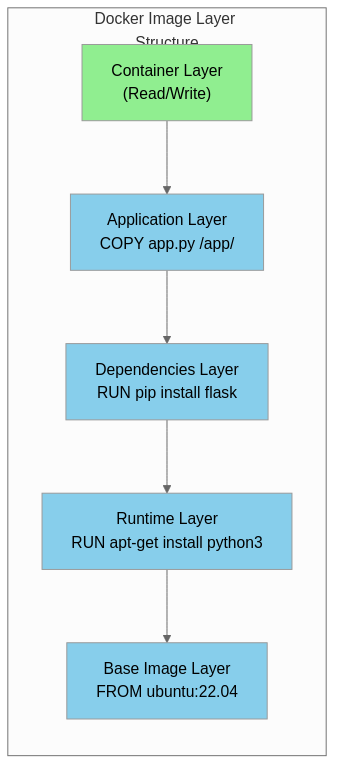
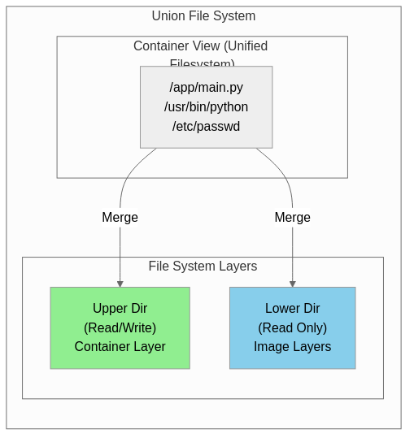

컨테이너 기술은 현대 소프트웨어 개발과 배포 방식을 근본적으로 변화시킨 혁신적인 기술로, Docker는 이 컨테이너 기술을 대중화시킨 핵심 플랫폼이며, 2013년 등장 이후 마이크로서비스 아키텍처, CI/CD 파이프라인, 클라우드 네이티브 컴퓨팅의 표준으로 자리잡았다.

## 컨테이너 기술의 역사와 Docker의 탄생

> **컨테이너(Container)란?**
>
> 컨테이너는 애플리케이션과 그 실행에 필요한 모든 의존성(라이브러리, 설정 파일, 바이너리 등)을 하나의 표준화된 패키지로 묶어 어디서든 동일하게 실행할 수 있도록 하는 경량 가상화 기술이다.

### 컨테이너 기술의 발전 과정

컨테이너 개념은 Docker가 등장하기 훨씬 전부터 존재했으며, 운영체제 수준의 격리 기술은 수십 년에 걸쳐 발전해왔다.

| 연도 | 기술/이벤트 | 설명 |
|------|------------|------|
| **1979** | chroot | Unix V7에서 도입된 파일 시스템 격리 기술로, 프로세스의 루트 디렉토리를 변경하여 격리된 환경 제공 |
| **2000** | FreeBSD Jails | chroot를 확장하여 프로세스, 네트워크, 파일 시스템의 완전한 격리 구현 |
| **2001** | Linux VServer | 리눅스에서 서버 가상화를 위한 커널 패치로, 리소스 격리 기능 제공 |
| **2004** | Solaris Zones | Sun Microsystems가 개발한 운영체제 수준의 가상화 기술 |
| **2006** | Process Containers | Google이 개발한 프로세스 리소스 제한 기술로, 이후 cgroups로 발전 |
| **2008** | LXC (Linux Containers) | 리눅스 커널의 cgroups와 네임스페이스를 활용한 최초의 완전한 컨테이너 구현 |
| **2013** | Docker 출시 | dotCloud 사가 개발한 컨테이너 플랫폼으로, 컨테이너 기술의 대중화 시작 |
| **2014** | Kubernetes 발표 | Google이 컨테이너 오케스트레이션 플랫폼 오픈소스로 공개 |
| **2015** | OCI 설립 | Open Container Initiative 설립으로 컨테이너 표준화 시작 |
| **2017** | containerd 분리 | Docker에서 컨테이너 런타임이 독립 프로젝트로 분리 |

### Docker의 등장 배경

Docker가 등장하기 전 소프트웨어 배포는 여러 문제점을 안고 있었으며, 개발 환경과 운영 환경의 차이로 인한 "내 컴퓨터에서는 작동하는데(Works on my machine)" 문제가 빈번하게 발생했고, 서버마다 다른 라이브러리 버전, 운영체제 설정, 의존성 충돌 등으로 인해 배포 과정이 복잡하고 오류가 잦았다.

Solomon Hykes가 이끄는 dotCloud 팀은 2013년 PyCon에서 Docker를 처음 공개했으며, 기존 LXC 기반의 컨테이너 기술을 사용하기 쉬운 도구와 이미지 포맷으로 포장하여 개발자들이 쉽게 접근할 수 있도록 만들었고, 이후 자체 컨테이너 런타임인 libcontainer를 개발하여 LXC 의존성을 제거했다.

## 컨테이너와 가상 머신의 비교

> **가상 머신(Virtual Machine)이란?**
>
> 가상 머신은 하이퍼바이저를 통해 물리적 하드웨어 위에 완전한 운영체제를 포함하는 가상 컴퓨터를 생성하는 기술로, 각 VM은 독립적인 커널, 운영체제, 애플리케이션을 실행한다.

### 아키텍처 비교


### 상세 비교표

| 비교 항목 | 가상 머신 (VM) | 컨테이너 (Docker) |
|----------|---------------|------------------|
| **가상화 수준** | 하드웨어 수준 (하이퍼바이저) | 운영체제 수준 (커널 공유) |
| **운영체제** | 각 VM마다 전체 OS 포함 (수 GB) | 호스트 OS 커널 공유 (수 MB) |
| **시작 시간** | 수 분 (OS 부팅 필요) | 수 초 (프로세스 시작) |
| **리소스 사용** | 높음 (OS별 메모리, CPU 할당) | 낮음 (필요한 리소스만 사용) |
| **이미지 크기** | 수 GB ~ 수십 GB | 수십 MB ~ 수백 MB |
| **격리 수준** | 강력함 (완전한 하드웨어 격리) | 상대적으로 약함 (커널 공유) |
| **이식성** | 하이퍼바이저 호환성 필요 | Docker 엔진만 있으면 실행 가능 |
| **밀도** | 호스트당 수십 개 | 호스트당 수백~수천 개 |
| **보안** | 강력한 격리로 높은 보안 | 커널 공유로 잠재적 취약점 |
| **사용 사례** | 이기종 OS 실행, 완전한 격리 필요 | 마이크로서비스, CI/CD, 클라우드 네이티브 |

## Docker의 핵심 구성 요소

### Docker Engine

> **Docker Engine이란?**
>
> Docker Engine은 컨테이너를 빌드하고 실행하는 클라이언트-서버 애플리케이션으로, Docker 데몬(dockerd), REST API, CLI(docker)로 구성되어 컨테이너의 전체 생명주기를 관리한다.

Docker Engine은 세 가지 주요 구성 요소로 이루어져 있으며, 각 구성 요소는 다음과 같은 역할을 수행한다.


### Docker Image

> **Docker Image란?**
>
> Docker Image는 컨테이너 실행에 필요한 파일 시스템과 설정을 포함하는 읽기 전용 템플릿으로, 여러 레이어로 구성되어 효율적인 저장과 전송을 지원하며, Dockerfile을 통해 생성된다.

Docker Image는 레이어 구조로 되어 있어 공통 레이어를 공유함으로써 저장 공간을 절약하고 이미지 빌드 및 배포 속도를 향상시킨다.



### Dockerfile

Dockerfile은 Docker Image를 생성하기 위한 명령어들을 담은 텍스트 파일로, 베이스 이미지 선택부터 애플리케이션 설치, 환경 설정, 실행 명령까지 이미지 빌드의 모든 과정을 정의한다.

```dockerfile
# 베이스 이미지 지정 (Python 3.11 슬림 버전)
FROM python:3.11-slim

# 메타데이터 추가
LABEL maintainer="developer@example.com"
LABEL version="1.0"

# 환경 변수 설정
ENV PYTHONDONTWRITEBYTECODE=1
ENV PYTHONUNBUFFERED=1

# 작업 디렉토리 설정
WORKDIR /app

# 의존성 파일 복사 및 설치 (레이어 캐싱 활용)
COPY requirements.txt .
RUN pip install --no-cache-dir -r requirements.txt

# 애플리케이션 코드 복사
COPY . .

# 비루트 사용자 생성 및 전환 (보안)
RUN useradd --create-home appuser
USER appuser

# 포트 노출
EXPOSE 8000

# 헬스체크 설정
HEALTHCHECK --interval=30s --timeout=3s \
    CMD curl -f http://localhost:8000/health || exit 1

# 컨테이너 시작 명령
CMD ["python", "app.py"]
```

### 주요 Dockerfile 명령어

| 명령어 | 설명 | 예시 |
|--------|------|------|
| **FROM** | 베이스 이미지 지정 | `FROM python:3.11-slim` |
| **RUN** | 이미지 빌드 시 명령 실행 | `RUN apt-get update && apt-get install -y curl` |
| **COPY** | 호스트 파일을 이미지로 복사 | `COPY . /app` |
| **ADD** | COPY와 유사하나 URL, tar 압축 해제 지원 | `ADD https://example.com/file.tar.gz /tmp/` |
| **WORKDIR** | 작업 디렉토리 설정 | `WORKDIR /app` |
| **ENV** | 환경 변수 설정 | `ENV NODE_ENV=production` |
| **EXPOSE** | 컨테이너 포트 문서화 | `EXPOSE 8080` |
| **CMD** | 컨테이너 시작 시 기본 명령 | `CMD ["node", "server.js"]` |
| **ENTRYPOINT** | 컨테이너 시작 시 실행할 명령 (고정) | `ENTRYPOINT ["python"]` |
| **ARG** | 빌드 시 전달할 변수 | `ARG VERSION=1.0` |
| **VOLUME** | 볼륨 마운트 포인트 지정 | `VOLUME /data` |
| **USER** | 실행 사용자 지정 | `USER appuser` |

### Docker Registry

> **Docker Registry란?**
>
> Docker Registry는 Docker 이미지를 저장하고 배포하는 서버 측 애플리케이션으로, Docker Hub가 가장 대표적인 공개 레지스트리이며, 기업 환경에서는 Harbor, AWS ECR, GCR 등의 프라이빗 레지스트리를 사용한다.

| 레지스트리 | 유형 | 특징 |
|-----------|------|------|
| **Docker Hub** | 공개 | 가장 큰 공개 레지스트리, 공식 이미지 제공 |
| **GitHub Container Registry** | 공개/비공개 | GitHub와 통합, GitHub Actions와 연동 |
| **AWS ECR** | 비공개 | AWS 서비스와 통합, IAM 기반 접근 제어 |
| **Google GCR/Artifact Registry** | 비공개 | GCP 서비스와 통합, 취약점 스캔 |
| **Azure ACR** | 비공개 | Azure 서비스와 통합, 지역 복제 |
| **Harbor** | 자체 호스팅 | CNCF 프로젝트, 보안 스캔, RBAC |

## Docker의 작동 원리

Docker는 리눅스 커널의 핵심 기능인 네임스페이스(Namespace)와 컨트롤 그룹(cgroups)을 활용하여 컨테이너 격리와 리소스 제한을 구현하며, 유니온 파일 시스템(UnionFS)을 통해 효율적인 이미지 레이어 관리를 수행한다.

### Linux Namespace

네임스페이스는 프로세스가 볼 수 있는 시스템 리소스의 범위를 제한하여 격리된 환경을 제공하는 리눅스 커널 기능이다.

| 네임스페이스 | 격리 대상 | 설명 |
|-------------|----------|------|
| **PID** | 프로세스 ID | 컨테이너 내 프로세스는 독립적인 PID 공간 사용 |
| **NET** | 네트워크 | 독립적인 네트워크 인터페이스, IP 주소, 라우팅 테이블 |
| **MNT** | 파일 시스템 마운트 | 독립적인 마운트 포인트 |
| **UTS** | 호스트명, 도메인명 | 컨테이너별 독립적인 호스트명 |
| **IPC** | 프로세스 간 통신 | 독립적인 공유 메모리, 세마포어 |
| **USER** | 사용자/그룹 ID | 컨테이너 내 루트가 호스트에서는 일반 사용자 |
| **CGROUP** | cgroup 루트 디렉토리 | 리소스 제한의 독립적인 뷰 |

### Control Groups (cgroups)

cgroups는 프로세스 그룹의 리소스 사용량을 제한, 계정, 격리하는 리눅스 커널 기능으로, Docker는 이를 통해 컨테이너별 CPU, 메모리, 디스크 I/O, 네트워크 대역폭을 제한한다.

```bash
# 컨테이너 리소스 제한 예시
docker run -d \
    --name myapp \
    --cpus="2.0" \                  # CPU 2코어 제한
    --memory="1g" \                 # 메모리 1GB 제한
    --memory-swap="2g" \            # 스왑 포함 2GB 제한
    --blkio-weight=500 \            # 블록 I/O 가중치
    myapp:latest
```

### Union File System

유니온 파일 시스템은 여러 파일 시스템 레이어를 하나의 통합된 뷰로 제공하는 기술로, Docker는 OverlayFS를 기본 스토리지 드라이버로 사용하여 이미지 레이어를 효율적으로 관리한다.



## Docker의 장점과 활용 사례

### Docker의 핵심 장점

| 장점 | 설명 |
|------|------|
| **환경 일관성** | 개발, 테스트, 운영 환경에서 동일한 실행 환경 보장 |
| **빠른 배포** | 이미지 기반 배포로 수 초 내 애플리케이션 시작 가능 |
| **리소스 효율성** | VM 대비 낮은 오버헤드, 높은 컨테이너 밀도 |
| **격리성** | 애플리케이션 간 의존성 충돌 방지 |
| **이식성** | "한 번 빌드, 어디서나 실행" - Docker가 있으면 실행 가능 |
| **버전 관리** | 이미지 태그를 통한 버전 관리 및 롤백 용이 |
| **확장성** | 수평 확장이 용이하며 오케스트레이션 도구와 연동 |

### 실제 활용 사례

#### 마이크로서비스 아키텍처

```yaml
# docker-compose.yml 예시
version: '3.8'
services:
  api-gateway:
    image: api-gateway:latest
    ports:
      - "80:8080"
    depends_on:
      - user-service
      - order-service

  user-service:
    image: user-service:latest
    environment:
      - DB_HOST=user-db
    depends_on:
      - user-db

  order-service:
    image: order-service:latest
    environment:
      - DB_HOST=order-db
    depends_on:
      - order-db

  user-db:
    image: postgres:15
    volumes:
      - user-data:/var/lib/postgresql/data

  order-db:
    image: postgres:15
    volumes:
      - order-data:/var/lib/postgresql/data

volumes:
  user-data:
  order-data:
```

#### CI/CD 파이프라인

컨테이너 기반 CI/CD는 빌드 환경의 일관성을 보장하고 파이프라인의 재현성을 높이며, 빌드 캐싱을 통해 빌드 시간을 단축한다.

```yaml
# GitHub Actions 예시
name: Build and Deploy
on:
  push:
    branches: [main]

jobs:
  build:
    runs-on: ubuntu-latest
    steps:
      - uses: actions/checkout@v4

      - name: Build Docker image
        run: docker build -t myapp:${{ github.sha }} .

      - name: Push to Registry
        run: |
          docker tag myapp:${{ github.sha }} registry.example.com/myapp:${{ github.sha }}
          docker push registry.example.com/myapp:${{ github.sha }}

      - name: Deploy to Kubernetes
        run: |
          kubectl set image deployment/myapp myapp=registry.example.com/myapp:${{ github.sha }}
```

#### 개발 환경 표준화

Docker를 사용하면 팀원 모두가 동일한 개발 환경에서 작업할 수 있으며, 신규 팀원의 온보딩 시간을 크게 단축할 수 있고, 환경 차이로 인한 버그 발생을 원천적으로 방지할 수 있다.

```bash
# 개발 환경 실행
docker-compose -f docker-compose.dev.yml up -d

# 데이터베이스, 캐시, 메시지 큐 등 의존 서비스 포함
# 모든 개발자가 동일한 환경에서 작업 가능
```

## Docker 생태계와 미래

### 컨테이너 오케스트레이션

Docker 컨테이너의 대규모 운영을 위해 오케스트레이션 도구가 필요하며, Kubernetes가 사실상 표준으로 자리잡았다.

| 도구 | 특징 |
|------|------|
| **Kubernetes** | CNCF 프로젝트, 사실상 업계 표준, 강력한 생태계 |
| **Docker Swarm** | Docker 내장, 간단한 설정, 소규모 클러스터에 적합 |
| **Amazon ECS** | AWS 관리형 서비스, AWS 서비스와 긴밀한 통합 |
| **Nomad** | HashiCorp 제품, 간단한 아키텍처, 컨테이너 외 워크로드 지원 |

### OCI 표준

Open Container Initiative(OCI)는 컨테이너 이미지 포맷과 런타임에 대한 업계 표준을 정의하며, Docker, containerd, CRI-O 등 다양한 구현체가 이 표준을 준수하여 상호 호환성을 보장한다.

### 컨테이너 기술의 미래

컨테이너 기술은 클라우드 네이티브 컴퓨팅의 핵심으로서 지속적으로 발전하고 있으며, WebAssembly(Wasm)와의 결합, 서버리스 컨테이너, 보안 강화, 엣지 컴퓨팅 지원 등 새로운 영역으로 확장되고 있다.

## 결론

Docker는 컨테이너 기술을 대중화시킨 혁신적인 플랫폼으로, 애플리케이션의 개발, 배포, 운영 방식을 근본적으로 변화시켰다. 리눅스 커널의 네임스페이스와 cgroups를 기반으로 가벼우면서도 효과적인 격리 환경을 제공하며, 레이어 기반의 이미지 시스템을 통해 효율적인 저장과 배포를 가능하게 한다.

컨테이너 기술은 마이크로서비스 아키텍처, CI/CD 파이프라인, 클라우드 네이티브 애플리케이션의 기반 기술로서 현대 소프트웨어 개발에 필수적인 요소가 되었으며, Kubernetes와 같은 오케스트레이션 도구와 결합하여 대규모 분산 시스템 운영의 표준으로 자리잡았다.
