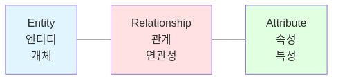
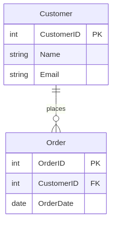
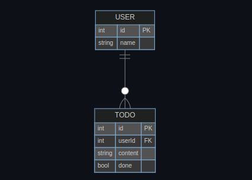
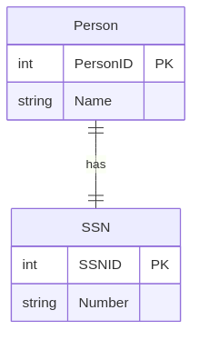
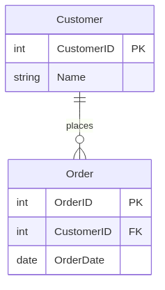
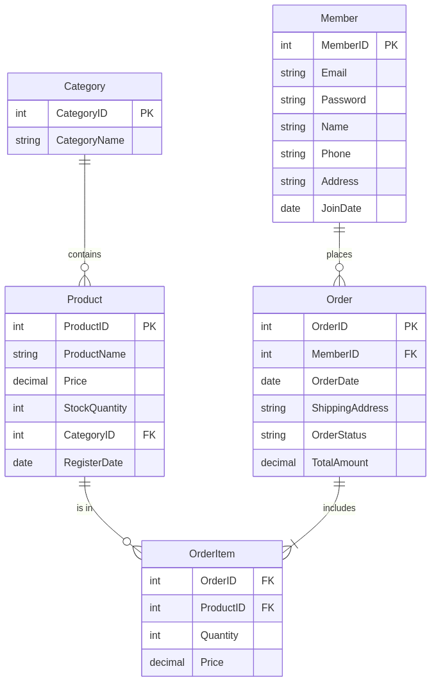

## History and Origins of ERD

An Entity Relationship Diagram (ERD) is a visual representation of database structure. It shows relationships between database tables and helps make database design and structure easy to understand.

Entity-Relationship modeling was developed for database design by Peter Chen and published in a 1976 paper. While serving as an assistant professor at MIT's Sloan School of Management, he published a groundbreaking paper titled "The Entity-Relationship Model: Toward a Unified View of Data." The paper was published in ACM's Transactions on Database Systems and remains relevant today.

Peter Chen (also known as Peter Pin-Shan Chen), currently a faculty member at Carnegie-Mellon University in Pittsburgh, is credited with developing ER modeling for database design in the 1970s. Before Chen's work, Charles Bachman and A.P.G. Brown were working with close predecessors of Chen's approach. Bachman developed a type of Data Structure Diagram named after him as the Bachman Diagram.

The ER model was also named an ANSI standard. The year 2026 marks 50 years since Peter Chen's groundbreaking 1976 publication that introduced the Entity-Relationship model to the world of database design. Today it is commonly used for teaching students the basics of database structure.

## Core Components of ERD

ERD consists of three core components: entities, attributes, and relationships. These form the basic building blocks of database design.

### Entity

An entity represents an object to be managed in the database. For example, students, professors, courses, orders, and customers can be entities. An entity is an abstraction of real-world objects or concepts that can exist independently.

### Attribute

An attribute represents characteristics of an entity. For example, the student entity can have attributes such as student ID, name, department, and enrollment year. Attributes are data fields that store specific information about entities. Each attribute has a specific data type (string, number, date, etc.).

### Relationship

A relationship represents associations between entities. For example, there can be an 'enrollment' relationship between students and courses. There can be a 'teaches' relationship between professors and courses. Relationships define how two or more entities interact and connect with each other.

Each component of ERD clearly expresses the logical structure of the database. Through this, data redundancy is minimized, data integrity is ensured, and communication between developers and stakeholders is facilitated.

## Comparison of ERD Notations

Various ERD notations exist, each with unique advantages and disadvantages and use cases. Chen, IE (Information Engineering/Crow's Foot), IDEF1X, and UML are representative.

### Chen Notation

Chen notation explicitly shows entities (rectangles), relationships (diamonds), and attributes (ovals). Chen's ERD notation is a more detailed way to represent entities and relationships.

However, Chen notation can be verbose and cluttered, especially when dealing with many entities and attributes. It may also require some translation to convert it into a physical database schema.

### Crow's Foot (IE) Notation

Crow's Foot (Information Engineering/IE) notation shows entities as boxes with attributes. Relationships use symbols for cardinality (maximum) and optionality (minimum). Crow's foot notation is compact and easy to read. It can be directly mapped to a relational database model.

Advantages include being compact, readable, widely supported in CASE tools, and easy to map to relational schemas. The most commonly used are IE and Barker.

### IDEF1X Notation

IDEF1X notation is standards-driven (DoD/US Gov origins) with rich semantics for keys and identifying relationships. IDEF1X notation is rigorous and precise. It follows rules and guidelines that ensure the quality and integrity of the data model.

For example, it uses primary keys, foreign keys, and unique identifiers to define entities and relationships. However, this notation is fundamentally a physical design modeling technique and is not appropriate for conceptual design.

### UML Notation

UML notation is primarily used in software engineering. It incorporates a wider range of diagram types and focuses on object-oriented representation. It differs from Crow's Foot which is more specialized for database schema representation.

The main difference between UML and ER diagrams is that UML is a language used to create diagrams, whereas ERDs are a type of diagram.

### Notation Selection Guide

As models grow, prefer concise notations for communication (Crow's Foot) and reserve detailed ones (Chen/IDEF1X) for pedagogy or standards. In practice, IE (Crow's Foot) notation is most widely used.

## Detailed Explanation of IE (Crow's Foot) Notation

IE notation or Crow's Foot notation is the most widely used notation in ERD. It is concise and intuitive. It is easy to convert directly to a relational database.

### Entity Representation

Entities are represented by rectangles. The entity name is written at the top of the rectangle. Attribute names are written inside the rectangle. You can write the attribute name and data type together. You can display constraints such as PK (Primary Key) and FK (Foreign Key).

### Relationship Representation

Relationships are represented by lines connecting entities. The type of line and the symbols at the ends indicate the relationship type and cardinality.

- **Solid line**: Indicates an identifying relationship where the parent table's PK is included as part of the child table's PK.
- **Dashed line**: Indicates a non-identifying relationship where the parent table's PK is used only as a regular attribute (FK) in the child table.

### Cardinality and Optionality

Cardinality indicates the maximum number of instances one entity can have with another entity. Optionality indicates whether the relationship is mandatory or optional.

### Crow's Foot Symbols

- **one (|)**: Exactly one instance
- **many (≺)**: Multiple instances (crow's foot)
- **only one (||)**: Exactly one must exist
- **zero or one (o|)**: None or one
- **one or many (|≺)**: One or more
- **zero or many (o≺)**: None or multiple

## Cardinality and Relationship Types

Cardinality indicates what numerical relationship one entity has with another entity in the relationship between entities. It defines the maximum number of occurrences of the relationship. Cardinality indicates the maximum number of times an instance of one entity can relate to instances of another entity. This is a key element in defining relationships between tables in database design.

### 1:1 Relationship (One-to-One)

A 1:1 relationship is when one instance of an entity relates to exactly one instance of another entity. For example, the relationship between a person and a social security number is a 1:1 relationship. One person has only one social security number and one social security number belongs to only one person.

### 1:N Relationship (One-to-Many)

A 1:N relationship is when one instance of an entity can relate to multiple instances of another entity. For example, the relationship between customers and orders where one customer can have multiple orders is a 1:N relationship. This is the most common relationship type in databases.

### N:M Relationship (Many-to-Many)

An N:M relationship is when instances of both entities can relate to multiple instances of each other. For example, in the relationship between students and courses, one student can take multiple courses and one course can have multiple students.

N:M relationships cannot be implemented directly in relational databases. They must be decomposed into two 1:N relationships using an intermediate junction table.

### Optionality

Optionality indicates the minimum number of occurrences of the relationship. It indicates whether the relationship is mandatory or optional. A mandatory relationship means the relationship must exist. An optional relationship means the relationship may not exist.

## Strong Entities and Weak Entities

Entities are classified as strong entities and weak entities. The difference lies in independence and identification method.

### Strong Entity

A strong entity is not dependent on any other entity in the schema and will always have a primary key. A strong entity can be defined solely by its own attributes. It can exist independently and can be uniquely identified by its own attributes.

### Weak Entity

A weak entity is an entity set that does not have sufficient attributes to form a primary key. It cannot be uniquely identified by its attributes alone. It depends on another entity known as the owner or parent entity for identification.

A weak entity is represented by a double rectangle. The relationship between a strong entity and a weak entity is represented by a double diamond. A weak entity always has an identifying relationship with the parent entity. It combines the parent entity's primary key with its own partial key to ensure uniqueness.

### Practical Example of Weak Entity

In the relationship between Order and OrderItem, OrderItem is a weak entity. OrderItem cannot exist without an Order. It is uniquely identified using both the order number and item number together.

The existence of a weak entity depends on the existence of the parent entity. When the parent entity is deleted, the weak entity must also be deleted (Cascading Delete).

## Normalization and ERD Design

Normalization is a core principle for minimizing data redundancy and ensuring data integrity in the ERD design process. Application of normalization during ERD development allows for more robust requirement analysis.

### Concurrent Application of Normalization and ERD

It is difficult to separate the normalization process from the ER modeling process, so the two techniques should be used concurrently. Current best practices for 2025-2026 advocate for concurrent application of normalization principles during ERD development rather than treating them as separate sequential phases.

### Third Normal Form (3NF) Principles

Each entity type should have only one dependency where the determinant is the entity identifier. There should not be any additional dependency among the non-entity identifier attributes. This is the core principle of Third Normal Form (3NF).

### Importance of Early Normalization

Applying normalization principles like 1NF, 2NF, and 3NF from the very beginning prevents data redundancy and anomalies that are difficult and costly to fix later. A common goal for many applications is achieving Third Normal Form (3NF), which strikes an optimal balance between data integrity and performance.

### Visual Documentation

Use database design tools to create an Entity-Relationship Diagram (ERD). This visual representation helps clarify relationships and dependencies before you write any code. Always document your normalization decisions and the reasoning behind them for future maintenance.

### Strategic Denormalization

In read-heavy systems like data warehouses or reporting databases, intentionally violating normalization rules (denormalization) can boost query performance by reducing the need for complex joins. The tradeoff between data integrity and query performance must be carefully evaluated.

## ERD Design Best Practices

When designing ERDs, a systematic approach is needed that considers clarity, consistency, and scalability. The following best practices should be followed.

### Naming Conventions

- **Entity names**: Use singular nouns (e.g., Student, Order, Product). Apply consistent naming conventions.
- **Attribute names**: Should be clear and descriptive, minimizing the use of abbreviations.
- **Relationship names**: Use verbs to clearly express the relationship between entities (e.g., 'enroll', 'order', 'teach').

### Primary Key Settings

All entities must have a primary key. The primary key should use values that are as simple and unchanging as possible. Using surrogate keys rather than natural keys is advantageous for maintenance. Composite keys should only be used when necessary and kept as simple as possible.

### N:M Relationship Handling

N:M relationships should always be decomposed into two 1:N relationships using a junction table. The junction table should include foreign keys from both entities and additional attributes if needed. The junction table name should be clearly designated by combining the names of both entities.

### Relationship Design Principles

Avoid circular references and design so that data flow has clear directionality. Remove unnecessary redundant relationships and define relationships only when necessary. Clearly indicate the cardinality of entities and relationships so that the database structure can be easily understood.

### Maintenance and Documentation

ERDs should be continuously updated according to requirement changes. Track change history through version control. Keep ERD and actual database schema in sync. Improve design quality through team member reviews.

## ERD Tool Comparison

Various tools exist for creating ERDs, each with unique features and pricing policies. Comparing the most popular tools as of 2026 is as follows.

### dbdiagram.io

A quick, simple ER diagram tool that uses a Domain-specific language (DSL) designed for developers, DBAs, and data analysts. Users can create ERDs solely with the keyboard. The interface is simple and intuitive.

It is capable of generating SQL scripts for object creation on demand. It is fast for developers who prefer keyboard-driven workflows. Pricing is free for up to 10 diagrams, then $9/month.

### Draw.io (Diagrams.net)

One of the most popular ER model tools that allow users to create Entity Relationship Diagrams even without any kind of registration. It's open-source, browser-based, and works offline too.

It is 100% free and open source. It supports online collaboration, allowing multiple users to work on a single diagram at the same time. It allows saving diagrams to cloud storage services like GDrive, Dropbox, and OneDrive. However, it is not tailored for databases with no SQL import/export.

### Lucidchart

One of the most popular diagrams and chart editing packages that can help you create, customize, and import Entity Relationship Diagrams. It's an incredibly flexible tool, enabling you to model diagrams from scratch using templates, symbols, and notations.

There are plenty of collaboration options so you can work on the diagram with your teammates collectively. It provides real-time editing, version history, and broad template support.

However, the onboarding process is a bit overwhelming. The free plan is limited compared to competitors (limited to 3 diagrams and 60 objects per diagram).

### ERDPlus

A minimal, academic-focused ERD tool, good for students or quick one-off diagrams. It's a basic database modeling tool for creating Entity Relationship Diagrams, Relational Schemas, Star Schemas, and SQL DDL statements.

It is free with no sign-up needed. It exports SQL and PNG. It is held in high regard in the industry. However, it has very basic visuals with no real collaboration and is not ideal for large schemas.

### Tool Selection Guide

- **Code-based preference**: If you're a developer, DBA, or data analyst that prefers to write code, go for dbdiagram.io or QuickDBD.
- **GUI-based preference**: If you prefer GUI, go for Diagrams.net or Lucidchart.
- **Open-source focus**: If you care about open-source and privacy, ChartDB or Draw.io are your best bets.

## Practical ERD Example

When creating an actual ERD, you should start with requirement analysis and approach systematically. Taking an online shopping mall as an example, the process is as follows.

### Step 1: Entity Identification

First, analyze business requirements to identify necessary entities. For an online shopping mall, entities such as Member, Product, Order, OrderItem, and Category are needed.

### Step 2: Attribute Definition

Define attributes for each entity and select primary keys.

- **Member entity**: MemberID (PK), Email, Password, Name, Phone, Address, JoinDate
- **Product entity**: ProductID (PK), ProductName, Price, StockQuantity, CategoryID (FK), RegisterDate
- **Order entity**: OrderID (PK), MemberID (FK), OrderDate, ShippingAddress, OrderStatus, TotalAmount

### Step 3: Relationship Definition

Define relationships between entities and determine cardinality.

- **Member and Order**: 1:N relationship (one member can have multiple orders)
- **Order and OrderItem**: 1:N relationship (one order can include multiple order items)
- **Product and OrderItem**: 1:N relationship (one product can be included in multiple order items)
- **Category and Product**: 1:N relationship (one category can include multiple products)

### Step 4: Normalization Application

Apply normalization to remove data redundancy. Decompose the N:M relationship between Order and Product into two 1:N relationships through the OrderItem table. Verify that each table satisfies Third Normal Form (3NF). Remove transitive dependencies to ensure data integrity.

### Step 5: Diagram Creation

Use the selected ERD tool to create the diagram. Draw entities as rectangles and list attributes. Draw relationship lines to connect entities and indicate cardinality. Distinguish between identifying and non-identifying relationships in representation. Review with team members and improve the ERD by reflecting feedback.

## Conclusion

ERD has been a core tool for database design for 50 years since Peter Chen published it at MIT in 1976. It visually represents complex data structures through three basic components: entities, attributes, and relationships.

Various notations exist including Chen, IE (Crow's Foot), IDEF1X, and UML, but in practice, the concise and intuitive IE (Crow's Foot) notation is most widely used. Relationships between entities are clearly defined through cardinality and optionality.

The distinction between strong and weak entities, application of normalization principles, and use of clear naming conventions are key to high-quality ERD design. Various tools such as dbdiagram.io, Draw.io, Lucidchart, and ERDPlus can be used to efficiently create ERDs.

As of 2026, ERD is still used as an essential tool for teaching database structure to students and facilitating communication between developers and stakeholders. The modern approach of concurrently applying normalization and ERD helps achieve a balance between data integrity and performance.
