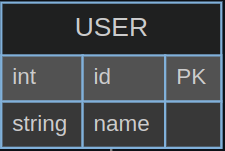

> An Entity Relationship Diagram (ERD) is a visual representation of the structure of a database. It shows the relationships between database tables and helps make the design and structure of the database easier to understand.

## Components of an ERD

An ERD consists of the following components:

1. **Entity**
2. **Attribute**
3. **Relationship**

### Entity

An entity represents an object that is managed in the database. For example, students, professors, and courses can all be entities.

### Attribute

An attribute represents the characteristics of an entity. For example, the student entity can have attributes such as student ID, name, and department.

### Relationship

A relationship represents the connection between entities. For example, there can be a relationship called 'enrollment' between students and professors.

## ERD Notation

There are various notations for ERDs, but the most widely used is **IE notation**. IE notation uses the following conventions:

-   **Entity**: Represented by a rectangle. The entity name is written at the top of the rectangle.
-   **Attribute**: Written inside the rectangle. You can include both the attribute name and data type. Constraints such as FK and PK can also be specified.
    
-   **Relationship**:
    1. Solid and dashed lines
        - Solid line: Identifying relationship
            - A relationship where the PK is used as an FK:
                - The parent table's PK is used as the FK in the child table
        - Dashed line: Non-identifying relationship
            - A relationship where the PK is not used as an FK:
                - The parent table's PK is not used as the FK in the child table
    2. Mapping Cardinality - Meaning: Indicates how one entity relates to another entity in their relationship. - Represents relationships such as 1:1, 1:N, and N:M. - IE notation uses crow's foot notation.
       
       The diagram above shows the following relationships:
        - A USER table may have multiple TODO tables or none at all.
        - A TODO table has exactly one USER table.

## Crow's Foot Notation

Crow's foot notation is used to represent relationships in ERDs. It uses the following symbols:

-   **one**: When there is exactly one element
-   **many**: When there are N elements (multiple)
-   **only one**: When there is only one element
-   **zero or one**: When there are 0 or 1 elements
-   **one or many**: When there are 1 or more elements (1..N)
-   **zero or many**: When there are 0 or more elements (0..N)
