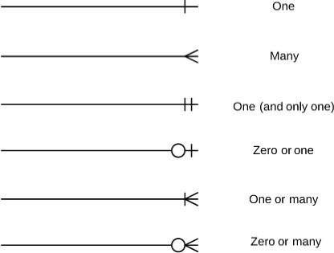

## ERD의 역사와 탄생 배경

ERD(Entity Relationship Diagram)는 데이터베이스의 구조를 시각적으로 표현한 것으로, 데이터베이스의 테이블 간의 관계를 나타내며 데이터베이스의 설계와 구조를 이해하기 쉽게 도와준다.

Entity-Relationship 모델링은 Peter Chen에 의해 데이터베이스 설계를 위해 개발되었으며 1976년 논문으로 발표되었다. MIT의 Sloan School of Management에서 조교수로 재직하던 중 "The Entity-Relationship Model: Toward a Unified View of Data"라는 제목의 획기적인 논문을 발표했다. 이 논문은 ACM의 Transactions on Database Systems에 게재되었으며 오늘날까지도 관련성을 유지하고 있다.

현재 Carnegie-Mellon University in Pittsburgh의 교수진인 Peter Chen(일명 Peter Pin-Shan Chen)은 1970년대에 데이터베이스 설계를 위한 ER 모델링을 개발한 공로를 인정받고 있다. Chen의 작업 이전에는 Charles Bachman과 A.P.G. Brown이 유사한 선행 작업을 진행하고 있었으며, Bachman은 Bachman Diagram이라고 명명된 Data Structure Diagram의 한 유형을 개발했다.

ER 모델은 ANSI 표준으로도 지정되었다. 2026년은 Peter Chen의 획기적인 1976년 발표 이후 50년이 되는 해로, ERD가 데이터베이스 설계 세계에 도입된 지 반세기를 맞이한다. 오늘날 ERD는 데이터베이스 구조의 기초를 학생들에게 가르치는 데 일반적으로 사용되고 있다.

## ERD의 핵심 구성 요소

ERD는 엔티티(Entity), 속성(Attribute), 관계(Relationship)의 세 가지 핵심 구성 요소로 이루어져 있으며, 이들은 데이터베이스 설계의 기본 빌딩 블록을 형성한다.

### 엔티티(Entity)

엔티티는 데이터베이스에서 관리하려는 개체를 나타낸다. 예를 들어 학생, 교수, 강의, 주문, 고객 등이 엔티티가 될 수 있다. 엔티티는 독립적으로 존재할 수 있는 실제 세계의 객체나 개념을 추상화한 것이다.

### 속성(Attribute)

속성은 엔티티의 특성을 나타낸다. 예를 들어 학생 엔티티의 속성으로 학번, 이름, 학과, 입학년도 등이 있을 수 있다. 속성은 엔티티에 대한 구체적인 정보를 저장하는 데이터 필드로, 각 속성은 특정 데이터 타입(문자열, 숫자, 날짜 등)을 가진다.

### 관계(Relationship)

관계는 엔티티 간의 연관성을 나타낸다. 예를 들어 학생과 강의 간에는 '수강'이라는 관계가 있을 수 있고, 교수와 강의 간에는 '담당'이라는 관계가 있을 수 있다. 관계는 두 개 이상의 엔티티가 어떻게 상호작용하고 연결되는지를 정의한다.

ERD의 각 구성 요소는 데이터베이스의 논리적 구조를 명확하게 표현한다. 이를 통해 데이터의 중복을 최소화하고 데이터 무결성을 보장하며, 개발자와 이해관계자 간의 의사소통을 원활하게 한다.

## ERD 표기법 비교

ERD는 다양한 표기법이 존재하며 각각 고유한 장단점과 사용 사례를 가지고 있다. Chen, IE(Information Engineering/Crow's Foot), IDEF1X, UML 등이 대표적이다.

### Chen 표기법

Chen 표기법은 엔티티(직사각형), 관계(마름모), 속성(타원)을 명시적으로 보여준다. Chen의 ERD 표기법은 엔티티와 관계를 표현하는 더 상세한 방법이다.

하지만 Chen 표기법은 많은 엔티티와 속성을 다룰 때 특히 장황하고 복잡해질 수 있으며, 물리적 데이터베이스 스키마로 변환하는 데 약간의 번역이 필요할 수 있다.

### Crow's Foot (IE) 표기법

Crow's Foot(Information Engineering/IE) 표기법은 엔티티는 속성이 있는 상자이고, 관계는 카디널리티(최대)와 옵셔널리티(최소)를 위한 기호를 사용한다. Crow's foot 표기법은 간결하고 읽기 쉬우며 관계형 데이터베이스 모델에 직접 매핑될 수 있다.

장점으로는 간결하고 읽기 쉬우며 CASE 도구에서 광범위하게 지원되고 관계형 스키마에 쉽게 매핑할 수 있다. 가장 일반적으로 사용되는 것은 IE와 Barker이다.

### IDEF1X 표기법

IDEF1X 표기법은 표준 기반(DoD/US Gov 출처)이며 키와 식별 관계에 대한 풍부한 의미론을 가지고 있다. IDEF1X 표기법은 엄격하고 정확하며 데이터 모델의 품질과 무결성을 보장하는 몇 가지 규칙과 지침을 따른다.

예를 들어 기본 키, 외래 키, 고유 식별자를 사용하여 엔티티와 관계를 정의한다. 하지만 이 표기법은 근본적으로 물리적 설계 모델링 기술이며 개념적 설계에는 적합하지 않다.

### UML 표기법

UML 표기법은 주로 소프트웨어 엔지니어링에서 사용되며 더 넓은 범위의 다이어그램 유형을 통합하고 객체 지향 표현에 중점을 둔다. 데이터베이스 스키마 표현에 더 특화된 Crow's Foot과는 다르다.

UML과 ER 다이어그램의 주요 차이점은 UML은 다이어그램을 생성하는 데 사용되는 언어인 반면, ERD는 다이어그램의 한 유형이라는 것이다.

### 표기법 선택 가이드

모델이 커질수록 의사소통을 위해 간결한 표기법(Crow's Foot)을 선호하고, 교육이나 표준을 위해 상세한 표기법(Chen/IDEF1X)을 예약하는 것이 좋다. 실무에서는 IE(Crow's Foot) 표기법이 가장 널리 사용된다.

## IE(Crow's Foot) 표기법 상세 설명

IE 표기법 또는 Crow's Foot 표기법은 ERD에서 가장 널리 사용되는 표기법으로, 간결하고 직관적이며 관계형 데이터베이스로 직접 변환하기 쉽다.

### 엔티티 표현

엔티티는 직사각형으로 표현되며 엔티티의 이름을 직사각형 상단에 작성한다. 직사각형 안에 속성의 이름을 작성하며, 속성의 이름과 데이터 타입을 함께 작성할 수 있다. 속성의 PK(Primary Key), FK(Foreign Key) 등의 제약 조건을 표시할 수 있다.

### 관계 표현

관계는 엔티티를 연결하는 선으로 표현되며, 선의 종류와 끝 부분의 기호로 관계의 유형과 카디널리티를 나타낸다.

- **실선**: 식별 관계(Identifying Relationship)를 나타내며, 부모 테이블의 PK가 자식 테이블의 PK의 일부로 포함되는 관계이다.
- **점선**: 비식별 관계(Non-Identifying Relationship)를 나타내며, 부모 테이블의 PK가 자식 테이블의 일반 속성(FK)으로만 사용되는 관계이다.

### 카디널리티와 옵셔널리티

카디널리티(Cardinality)는 한 엔티티의 인스턴스가 다른 엔티티의 인스턴스와 최대 몇 개까지 관계를 맺을 수 있는지를 나타낸다. 옵셔널리티(Optionality)는 관계가 필수인지 선택적인지를 나타낸다.

### Crow's Foot 기호

- **one (|)**: 정확히 하나의 인스턴스를 의미
- **many (≺)**: 여러 개의 인스턴스를 의미 (까마귀 발)
- **only one (||)**: 정확히 하나만 존재해야 함을 의미
- **zero or one (o|)**: 없거나 하나를 의미
- **one or many (|≺)**: 하나 이상을 의미
- **zero or many (o≺)**: 없거나 여러 개를 의미

## 카디널리티와 관계 유형

카디널리티는 엔티티 간의 관계에서 한 엔티티가 다른 엔티티와 어떤 수적 관계를 맺고 있는지를 나타낸다. 관계의 최대 발생 횟수를 정의하며, 한 엔티티의 인스턴스가 다른 엔티티의 인스턴스와 관련될 수 있는 최대 횟수를 의미한다. 이는 데이터베이스 설계에서 테이블 간의 관계를 정의하는 데 핵심적인 요소이다.

### 1:1 관계 (One-to-One)

1:1 관계는 한 엔티티의 인스턴스가 다른 엔티티의 정확히 하나의 인스턴스와만 관계를 맺는 경우이다. 예를 들어 사람과 주민등록번호의 관계가 1:1 관계이다. 한 사람은 하나의 주민등록번호만 가지며, 하나의 주민등록번호는 한 사람에게만 속한다.

### 1:N 관계 (One-to-Many)

1:N 관계는 한 엔티티의 인스턴스가 다른 엔티티의 여러 인스턴스와 관계를 맺을 수 있는 경우이다. 예를 들어 고객과 주문의 관계에서 한 명의 고객이 여러 개의 주문을 할 수 있다. 이는 데이터베이스에서 가장 일반적인 관계 유형이다.

### N:M 관계 (Many-to-Many)

N:M 관계는 양쪽 엔티티의 인스턴스가 서로 여러 개의 인스턴스와 관계를 맺을 수 있는 경우이다. 예를 들어 학생과 강의의 관계에서 한 학생은 여러 강의를 수강할 수 있고, 한 강의는 여러 학생을 가질 수 있다.

N:M 관계는 관계형 데이터베이스에서 직접 구현할 수 없다. 중간 연결 테이블(Junction Table)을 사용하여 두 개의 1:N 관계로 분해해야 한다.

### 옵셔널리티

옵셔널리티는 관계의 최소 발생 횟수를 나타낸다. 관계가 필수(Mandatory)인지 선택적(Optional)인지를 표시한다. 필수 관계는 반드시 관계가 존재해야 하며, 선택적 관계는 관계가 없을 수도 있음을 의미한다.

## 강한 엔티티와 약한 엔티티

엔티티는 강한 엔티티(Strong Entity)와 약한 엔티티(Weak Entity)로 구분되며, 이들의 차이는 독립성과 식별 방법에 있다.

### 강한 엔티티 (Strong Entity)

강한 엔티티는 스키마의 다른 엔티티에 의존하지 않으며 항상 기본 키(Primary Key)를 가진다. 자체 속성만으로 정의될 수 있으며, 독립적으로 존재할 수 있고 자신의 속성으로 고유하게 식별될 수 있다.

### 약한 엔티티 (Weak Entity)

약한 엔티티는 기본 키를 형성하기에 충분한 속성이 없는 엔티티 집합이다. 속성만으로는 고유하게 식별될 수 없으며, 식별을 위해 소유자 또는 부모 엔티티로 알려진 다른 엔티티에 의존한다.

약한 엔티티는 이중 직사각형으로 표현된다. 강한 엔티티와 약한 엔티티 간의 관계는 이중 마름모로 표현된다. 약한 엔티티는 항상 부모 엔티티와 식별 관계를 가지며, 부모 엔티티의 기본 키를 자신의 부분 키(Partial Key)와 결합하여 고유성을 확보한다.

### 약한 엔티티의 실전 예제

주문(Order)과 주문항목(OrderItem)의 관계에서 주문항목은 약한 엔티티이다. 주문항목은 주문 없이는 존재할 수 없다. 주문번호와 항목번호를 함께 사용하여 고유하게 식별된다.

약한 엔티티의 존재는 부모 엔티티의 존재에 의존한다. 부모 엔티티가 삭제되면 약한 엔티티도 함께 삭제되어야 한다(Cascading Delete).

## 정규화와 ERD 설계

정규화는 ERD 설계 과정에서 데이터 중복을 최소화하고 데이터 무결성을 보장하기 위한 핵심 원칙이다. ERD 개발 중 정규화를 적용하면 더 강력한 요구사항 분석이 가능하다.

### 정규화와 ERD의 동시 적용

정규화 프로세스를 ER 모델링 프로세스에서 분리하는 것은 어려우므로 두 기술을 동시에 사용해야 한다. 2025-2026년 현재의 모범 사례는 정규화 원칙을 ERD 개발 중에 동시에 적용하는 것을 옹호하며, 순차적인 별도 단계로 취급하지 않는다.

### 제3정규형 (3NF) 원칙

각 엔티티 타입에는 엔티티 식별자가 결정자인 하나의 종속성만 있어야 한다. 엔티티 식별자가 아닌 속성 간에는 추가적인 종속성이 없어야 한다. 이는 제3정규형(3NF)의 핵심 원칙이다.

### 조기 정규화의 중요성

1NF, 2NF, 3NF와 같은 정규화 원칙을 처음부터 적용하면 나중에 수정하기 어렵고 비용이 많이 드는 데이터 중복과 이상 현상을 방지할 수 있다. 많은 애플리케이션의 공통 목표는 데이터 무결성과 성능 사이의 최적 균형을 제공하는 제3정규형(3NF)을 달성하는 것이다.

### 시각적 문서화

데이터베이스 설계 도구를 사용하여 ERD(Entity-Relationship Diagram)를 생성한다. 이 시각적 표현은 코드를 작성하기 전에 관계와 종속성을 명확히 하는 데 도움이 된다. 향후 유지 관리를 위해 정규화 결정과 그 근거를 항상 문서화해야 한다.

### 전략적 비정규화

데이터 웨어하우스나 보고 데이터베이스와 같은 읽기 중심 시스템에서 의도적으로 정규화 규칙을 위반(비정규화)하여 복잡한 조인의 필요성을 줄임으로써 쿼리 성능을 향상시킬 수 있다. 데이터 무결성과 쿼리 성능 사이의 트레이드오프를 신중하게 평가해야 한다.

## ERD 설계 모범 사례

ERD를 설계할 때는 명확성, 일관성, 확장성을 고려한 체계적인 접근이 필요하다. 다음과 같은 모범 사례를 따라야 한다.

### 명명 규칙

- **엔티티 이름**: 명사형 단수를 사용한다(예: Student, Order, Product). 일관된 명명 규칙을 적용한다.
- **속성 이름**: 명확하고 설명적이어야 하며 약어 사용을 최소화한다.
- **관계 이름**: 동사형을 사용하여 엔티티 간의 관계를 명확히 표현한다(예: '수강하다', '주문하다', '담당하다').

### 기본 키 설정

모든 엔티티는 반드시 기본 키를 가져야 한다. 기본 키는 가능한 한 단순하고 변경되지 않는 값을 사용한다. 자연 키(Natural Key)보다는 대리 키(Surrogate Key)를 사용하는 것이 유지보수에 유리하다. 복합 키(Composite Key)는 필요한 경우에만 사용하고 가능한 한 단순하게 유지해야 한다.

### N:M 관계 처리

N:M 관계는 항상 연결 테이블(Junction Table)을 사용하여 두 개의 1:N 관계로 분해한다. 연결 테이블에는 양쪽 엔티티의 외래 키와 필요한 경우 추가 속성을 포함한다. 연결 테이블의 이름은 두 엔티티의 이름을 조합하여 명확하게 지정해야 한다.

### 관계 설계 원칙

순환 참조(Circular Reference)를 피하고 데이터의 흐름이 명확한 방향성을 가지도록 설계한다. 불필요한 중복 관계를 제거하고 필요한 경우에만 관계를 정의한다. 엔티티와 관계의 카디널리티를 명확히 표시하여 데이터베이스 구조를 쉽게 이해할 수 있도록 한다.

### 유지보수와 문서화

ERD는 요구사항 변경에 따라 지속적으로 업데이트되어야 한다. 버전 관리를 통해 변경 이력을 추적하고, ERD와 실제 데이터베이스 스키마가 일치하도록 유지한다. 팀원 간의 리뷰를 통해 설계의 품질을 향상시켜야 한다.

## ERD 도구 비교

ERD를 작성하기 위한 다양한 도구들이 존재하며 각각 고유한 특징과 가격 정책을 가지고 있다. 2026년 현재 가장 인기 있는 도구들을 비교하면 다음과 같다.

### dbdiagram.io

개발자, DBA, 데이터 분석가를 위해 설계된 Domain-specific language(DSL)를 사용하는 빠르고 간단한 ER 다이어그램 도구이다. 사용자는 키보드만으로 ERD를 생성할 수 있고 인터페이스는 간단하고 직관적이다.

요청 시 객체 생성을 위한 SQL 스크립트를 생성할 수 있으며, 키보드 기반 워크플로를 선호하는 개발자에게 빠르다. 가격은 최대 10개의 다이어그램까지 무료이고 그 이후 월 $9이다.

### Draw.io (Diagrams.net)

등록 없이도 사용자가 Entity Relationship Diagram을 생성할 수 있는 가장 인기 있는 ER 모델 도구 중 하나이다. 오픈 소스이고 브라우저 기반이며 오프라인에서도 작동한다.

100% 무료이며 오픈 소스이다. 온라인 협업을 지원하여 여러 사용자가 단일 다이어그램에서 동시에 작업할 수 있다. GDrive, Dropbox, OneDrive와 같은 클라우드 스토리지 서비스에 다이어그램을 저장할 수 있다. 다만 데이터베이스에 특화되지 않았으며 SQL 가져오기/내보내기가 없다.

### Lucidchart

Entity Relationship Diagram을 생성, 사용자 정의 및 가져올 수 있는 가장 인기 있는 다이어그램 및 차트 편집 패키지 중 하나이다. 매우 유연한 도구로 템플릿, 기호 및 표기법을 사용하여 처음부터 다이어그램을 모델링할 수 있다.

팀원들과 함께 다이어그램 작업을 할 수 있는 다양한 협업 옵션이 있다. ERD 공유를 쉽게 만드는 광범위한 통합 목록과 실시간 편집, 버전 기록 및 광범위한 템플릿 지원을 제공한다.

하지만 온보딩 프로세스가 다소 압도적이고 무료 플랜이 경쟁사에 비해 제한적이다(3개의 다이어그램과 다이어그램당 60개의 객체로 제한).

### ERDPlus

학생이나 빠른 일회성 다이어그램에 적합한 최소한의 학술 중심 ERD 도구이다. Entity Relationship Diagram, Relational Schema, Star Schema 및 SQL DDL 문을 생성하기 위한 기본 데이터베이스 모델링 도구이다.

무료이며 가입이 필요 없고 SQL과 PNG를 내보낼 수 있다. 업계에서 높이 평가되지만 매우 기본적인 시각적 표현이며 실제 협업이 없고 대규모 스키마에는 이상적이지 않다.

### 도구 선택 가이드

- **코드 기반 선호**: 개발자, DBA 또는 데이터 분석가라면 dbdiagram.io나 QuickDBD를 선택한다.
- **GUI 기반 선호**: Diagrams.net 또는 Lucidchart를 선택한다.
- **오픈소스 중시**: ChartDB 또는 Draw.io가 최선의 선택이다.

## ERD 작성 실전 예제

실제 ERD를 작성할 때는 요구사항 분석부터 시작하여 체계적으로 접근해야 한다. 온라인 쇼핑몰을 예로 들어 설명하면 다음과 같다.

### 1단계: 엔티티 식별

먼저 비즈니스 요구사항을 분석하여 필요한 엔티티를 식별한다. 온라인 쇼핑몰의 경우 회원(Member), 상품(Product), 주문(Order), 주문항목(OrderItem), 카테고리(Category) 등의 엔티티가 필요하다.

### 2단계: 속성 정의

각 엔티티의 속성을 정의하고 기본 키를 선택한다.

- **회원 엔티티**: 회원ID(PK), 이메일, 비밀번호, 이름, 전화번호, 주소, 가입일자
- **상품 엔티티**: 상품ID(PK), 상품명, 가격, 재고수량, 카테고리ID(FK), 등록일자
- **주문 엔티티**: 주문ID(PK), 회원ID(FK), 주문일자, 배송주소, 주문상태, 총금액

### 3단계: 관계 정의

엔티티 간의 관계를 정의하고 카디널리티를 결정한다.

- **회원과 주문**: 1:N 관계(한 회원은 여러 주문을 할 수 있음)
- **주문과 주문항목**: 1:N 관계(한 주문은 여러 주문항목을 포함할 수 있음)
- **상품과 주문항목**: 1:N 관계(한 상품은 여러 주문항목에 포함될 수 있음)
- **카테고리와 상품**: 1:N 관계(한 카테고리는 여러 상품을 포함할 수 있음)

### 4단계: 정규화 적용

정규화를 적용하여 데이터 중복을 제거한다. 주문항목 테이블을 통해 주문과 상품 간의 N:M 관계를 두 개의 1:N 관계로 분해한다. 각 테이블이 제3정규형(3NF)을 만족하는지 확인하고, 이행적 종속성을 제거하여 데이터 무결성을 보장한다.

### 5단계: 다이어그램 작성

선택한 ERD 도구를 사용하여 다이어그램을 작성한다. 엔티티를 직사각형으로 그리고 속성을 나열한다. 관계선을 그어 엔티티를 연결하고 카디널리티를 표시한다. 식별 관계와 비식별 관계를 구분하여 표현한다. 팀원들과 리뷰하고 피드백을 반영하여 ERD를 개선한다.

## 결론

ERD는 1976년 Peter Chen이 MIT에서 발표한 이후 50년 동안 데이터베이스 설계의 핵심 도구로 자리잡았다. 엔티티, 속성, 관계라는 세 가지 기본 구성 요소를 통해 복잡한 데이터 구조를 시각적으로 표현한다.

Chen, IE(Crow's Foot), IDEF1X, UML 등 다양한 표기법이 존재하지만 실무에서는 간결하고 직관적인 IE(Crow's Foot) 표기법이 가장 널리 사용된다. 카디널리티와 옵셔널리티를 통해 엔티티 간의 관계를 명확히 정의한다.

강한 엔티티와 약한 엔티티의 구분, 정규화 원칙의 적용, 명확한 명명 규칙의 사용은 고품질 ERD 설계의 핵심이다. dbdiagram.io, Draw.io, Lucidchart, ERDPlus 등 다양한 도구를 활용하여 효율적으로 ERD를 작성할 수 있다.

2026년 현재 ERD는 여전히 데이터베이스 구조를 학생들에게 가르치고 개발자와 이해관계자 간의 의사소통을 원활하게 하는 데 필수적인 도구로 사용되고 있다. 정규화와 ERD를 동시에 적용하는 현대적 접근 방식은 데이터 무결성과 성능 사이의 균형을 달성하는 데 도움을 준다.
